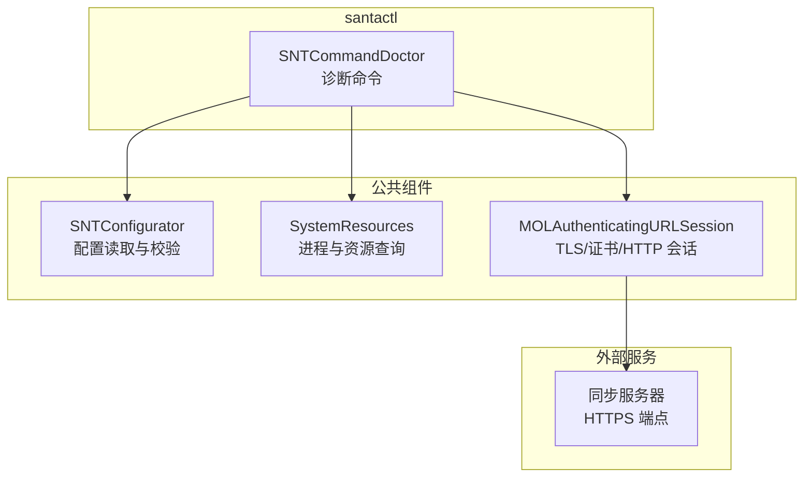
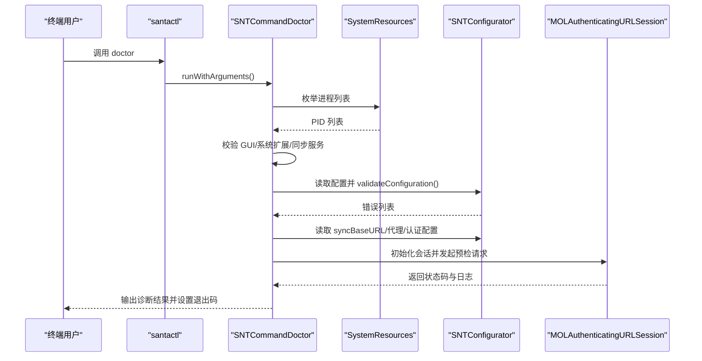
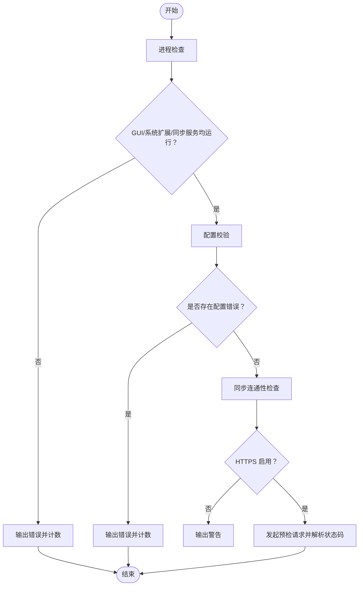
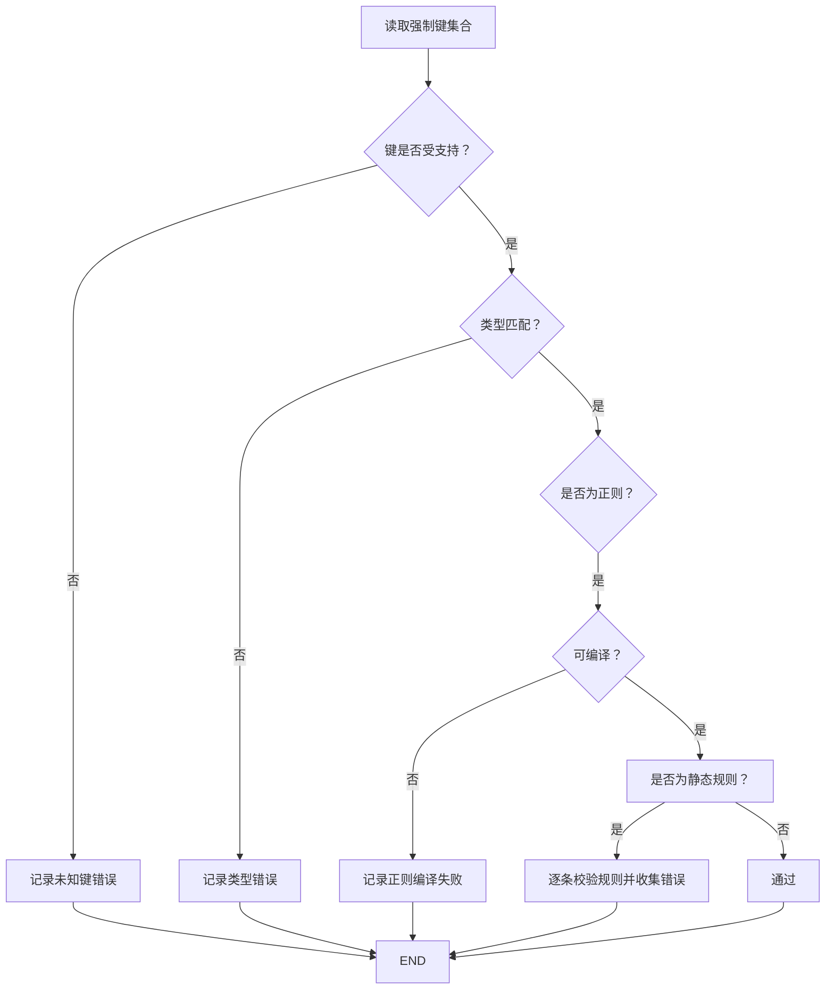
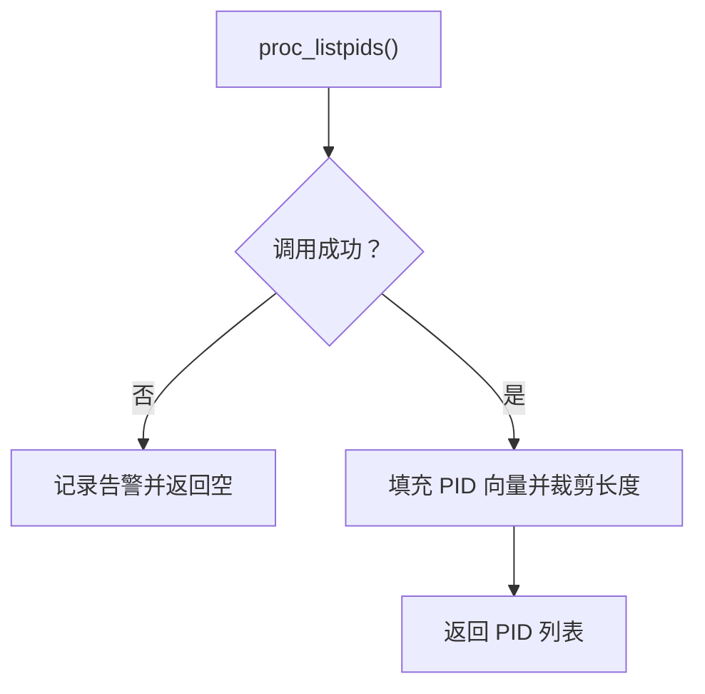
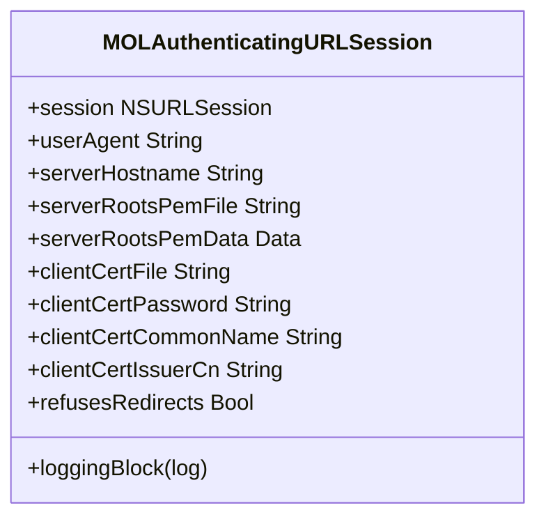
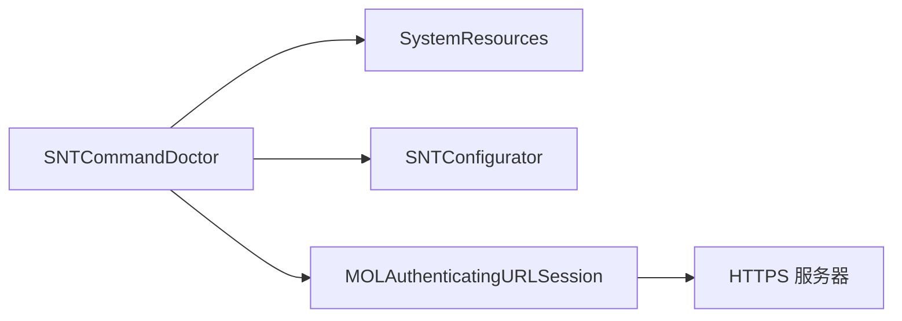

# 诊断命令

<cite>
**本文引用的文件**
- [SNTCommandDoctor.mm](file://Source/santactl/Commands/SNTCommandDoctor.mm)
- [SNTConfigurator.h](file://Source/common/SNTConfigurator.h)
- [SNTConfigurator.mm](file://Source/common/SNTConfigurator.mm)
- [MOLAuthenticatingURLSession.h](file://Source/common/MOLAuthenticatingURLSession.h)
- [MOLAuthenticatingURLSession.mm](file://Source/common/MOLAuthenticatingURLSession.mm)
- [SystemResources.h](file://Source/common/SystemResources.h)
- [SystemResources.mm](file://Source/common/SystemResources.mm)
- [troubleshooting.md](file://docs/docs/deployment/troubleshooting.md)
- [sync.md](file://docs/docs/features/sync.md)
</cite>

## 目录
1. [简介](#简介)
2. [项目结构](#项目结构)
3. [核心组件](#核心组件)
4. [架构总览](#架构总览)
5. [详细组件分析](#详细组件分析)
6. [依赖关系分析](#依赖关系分析)
7. [性能考量](#性能考量)
8. [故障排除指南](#故障排除指南)
9. [结论](#结论)
10. [附录](#附录)

## 简介
本指南面向系统管理员与支持工程师，提供 Santa 工具链中“诊断命令（doctor）”的完整操作说明。该命令用于快速检查系统健康状况、配置有效性以及与同步服务器的连通性，帮助定位问题并生成可执行的修复建议。命令会以非零退出码提示存在潜在问题，便于自动化脚本与 CI 流水线集成。

## 项目结构
doctor 命令位于 santactl 子模块中，通过调用公共组件完成进程状态检查、配置校验与同步连通性测试。关键依赖包括：
- 配置读取：SNTConfigurator 提供配置键值与校验逻辑
- 进程枚举：SystemResources 提供 PID 列表与任务信息
- 同步会话：MOLAuthenticatingURLSession 封装 TLS 与证书认证
- 文档与使用：官方部署与排障文档提供使用示例与最佳实践

图表来源
- [SNTCommandDoctor.mm](file://Source/santactl/Commands/SNTCommandDoctor.mm#L79-L85)
- [SNTConfigurator.h](file://Source/common/SNTConfigurator.h#L544-L583)
- [SystemResources.h](file://Source/common/SystemResources.h#L40-L48)
- [MOLAuthenticatingURLSession.h](file://Source/common/MOLAuthenticatingURLSession.h#L15-L34)

章节来源
- [SNTCommandDoctor.mm](file://Source/santactl/Commands/SNTCommandDoctor.mm#L79-L85)
- [troubleshooting.md](file://docs/docs/deployment/troubleshooting.md#L23-L30)

## 核心组件
- 诊断命令入口与流程控制
  - 注册命令名、要求 root 权限、不依赖守护进程连接
  - 执行顺序：进程检查 → 配置校验 → 同步连通性检查
  - 任一阶段失败即以非零退出码结束
- 配置校验器
  - 仅对强制键进行校验，识别未知键、类型不符、正则编译失败、静态规则无效等
- 进程与系统资源
  - 枚举所有进程，识别 GUI、系统扩展与同步服务是否运行
- 同步连通性
  - 依据配置构造 HTTPS 请求，支持服务端根证书覆盖、客户端证书或 CN/Issuer 认证
  - 发送预检请求，解析响应状态码并输出日志

章节来源
- [SNTCommandDoctor.mm](file://Source/santactl/Commands/SNTCommandDoctor.mm#L54-L85)
- [SNTConfigurator.mm](file://Source/common/SNTConfigurator.mm#L1925-L1997)
- [SystemResources.mm](file://Source/common/SystemResources.mm#L83-L107)
- [MOLAuthenticatingURLSession.mm](file://Source/common/MOLAuthenticatingURLSession.mm#L39-L73)

## 架构总览
doctor 命令在本地执行三段式诊断，最终以状态码反馈结果，适合在脚本中直接判断。

图表来源
- [SNTCommandDoctor.mm](file://Source/santactl/Commands/SNTCommandDoctor.mm#L79-L85)
- [SystemResources.mm](file://Source/common/SystemResources.mm#L83-L107)
- [SNTConfigurator.mm](file://Source/common/SNTConfigurator.mm#L1925-L1997)
- [MOLAuthenticatingURLSession.mm](file://Source/common/MOLAuthenticatingURLSession.mm#L39-L73)

## 详细组件分析

### 组件 A：诊断命令（SNTCommandDoctor）
- 功能要点
  - 进程检查：确认 GUI、系统扩展与同步服务运行状态
  - 配置检查：基于强制键进行类型与内容校验
  - 同步检查：以 HTTPS 预检请求验证服务器可达性与认证配置
- 关键行为
  - 使用 ANSI 彩色输出区分成功与失败信息
  - 任一阶段失败均导致非零退出码
  - 不依赖守护进程连接，适合离线诊断

图表来源
- [SNTCommandDoctor.mm](file://Source/santactl/Commands/SNTCommandDoctor.mm#L87-L126)
- [SNTCommandDoctor.mm](file://Source/santactl/Commands/SNTCommandDoctor.mm#L128-L143)
- [SNTCommandDoctor.mm](file://Source/santactl/Commands/SNTCommandDoctor.mm#L145-L246)

章节来源
- [SNTCommandDoctor.mm](file://Source/santactl/Commands/SNTCommandDoctor.mm#L35-L85)
- [SNTCommandDoctor.mm](file://Source/santactl/Commands/SNTCommandDoctor.mm#L87-L126)
- [SNTCommandDoctor.mm](file://Source/santactl/Commands/SNTCommandDoctor.mm#L128-L143)
- [SNTCommandDoctor.mm](file://Source/santactl/Commands/SNTCommandDoctor.mm#L145-L246)

### 组件 B：配置校验器（SNTConfigurator）
- 强制键校验
  - 仅对被强制的键进行校验，忽略系统默认键
  - 检测未知键、类型不匹配、正则表达式无法编译
  - 对静态规则数组逐条校验，返回具体索引与错误描述
- 配置来源
  - 支持移动配置与同步下发键，统一通过单例读取

图表来源
- [SNTConfigurator.mm](file://Source/common/SNTConfigurator.mm#L1925-L1997)

章节来源
- [SNTConfigurator.h](file://Source/common/SNTConfigurator.h#L544-L583)
- [SNTConfigurator.mm](file://Source/common/SNTConfigurator.mm#L1925-L1997)

### 组件 C：系统资源与进程枚举（SystemResources）
- 能力
  - 获取当前进程 PID 列表，用于诊断 GUI、系统扩展与同步服务是否运行
  - 提供任务信息查询接口（虚拟内存、驻留内存、CPU 时间），为更深入诊断预留

图表来源
- [SystemResources.mm](file://Source/common/SystemResources.mm#L83-L107)

章节来源
- [SystemResources.h](file://Source/common/SystemResources.h#L40-L48)
- [SystemResources.mm](file://Source/common/SystemResources.mm#L83-L107)

### 组件 D：同步会话与认证（MOLAuthenticatingURLSession）
- 能力
  - 基于 NSURLSession 的安全封装，支持 TLS 最低版本、管线化、超时控制
  - 支持服务端根证书覆盖（文件或数据）、客户端证书（PKCS#12 或系统证书 CN/Issuer）
  - 可注入 User-Agent、拒绝重定向、绑定目标主机名并输出调试日志
- doctor 使用路径
  - 从配置读取代理与认证参数
  - 构造预检请求（POST /preflight/santactl-doctor-test）
  - 解析状态码并输出诊断信息

图表来源
- [MOLAuthenticatingURLSession.h](file://Source/common/MOLAuthenticatingURLSession.h#L15-L34)
- [MOLAuthenticatingURLSession.mm](file://Source/common/MOLAuthenticatingURLSession.mm#L39-L73)

章节来源
- [MOLAuthenticatingURLSession.h](file://Source/common/MOLAuthenticatingURLSession.h#L15-L34)
- [MOLAuthenticatingURLSession.mm](file://Source/common/MOLAuthenticatingURLSession.mm#L39-L73)
- [SNTCommandDoctor.mm](file://Source/santactl/Commands/SNTCommandDoctor.mm#L145-L246)

## 依赖关系分析
- 诊断命令对系统资源与配置的依赖强，但对守护进程连接无依赖
- 同步检查依赖配置中的同步基地址、代理、认证参数
- 会话层抽象良好，便于在其他组件复用

图表来源
- [SNTCommandDoctor.mm](file://Source/santactl/Commands/SNTCommandDoctor.mm#L79-L85)
- [SystemResources.mm](file://Source/common/SystemResources.mm#L83-L107)
- [SNTConfigurator.mm](file://Source/common/SNTConfigurator.mm#L1925-L1997)
- [MOLAuthenticatingURLSession.mm](file://Source/common/MOLAuthenticatingURLSession.mm#L39-L73)

章节来源
- [SNTCommandDoctor.mm](file://Source/santactl/Commands/SNTCommandDoctor.mm#L79-L85)
- [SNTConfigurator.h](file://Source/common/SNTConfigurator.h#L544-L583)

## 性能考量
- 进程枚举与会话初始化均为轻量级操作，通常在秒级内完成
- 正则与静态规则校验在配置过大时可能增加 CPU 开销，建议在集中分发前进行本地预检
- 会话层启用 TLS 管线化与最小协议版本，有助于提升连接稳定性与安全性

## 故障排除指南
- 常见症状与定位
  - 进程缺失：GUI、系统扩展或同步服务未运行
  - 配置错误：未知键、类型不符、正则无法编译、静态规则无效
  - 同步失败：未使用 HTTPS、证书链不匹配、认证失败、网络不可达
- 建议修复措施
  - 确认系统扩展已加载并处于激活状态
  - 检查同步服务器是否使用 HTTPS 并正确配置根证书或客户端证书
  - 在代理环境正确配置代理字典与额外头
  - 使用官方排障文档提供的命令进行辅助验证
- 自动化与定期维护
  - 将 doctor 命令加入每日巡检脚本，结合退出码触发告警
  - 结合系统日志与事件日志进行交叉验证

章节来源
- [troubleshooting.md](file://docs/docs/deployment/troubleshooting.md#L23-L30)
- [troubleshooting.md](file://docs/docs/deployment/troubleshooting.md#L77-L86)
- [sync.md](file://docs/docs/features/sync.md#L1-L170)

## 结论
doctor 命令以简洁高效的三段式诊断覆盖了 Santa 运行所需的关键面：进程状态、配置有效性与同步连通性。其非零退出码设计使其易于融入自动化运维体系，配合官方文档与日志工具，能够快速定位并解决问题。

## 附录

### 使用示例
- 基本用法
  - sudo santactl doctor
- 与自动化结合
  - 将命令输出重定向到日志文件，捕获彩色标记以便解析
  - 在 CI 中以退出码判定构建后验证是否通过

章节来源
- [troubleshooting.md](file://docs/docs/deployment/troubleshooting.md#L23-L30)

### 诊断输出解读
- 成功输出
  - 以“+”开头表示通过，如“无配置错误”“同步使用 HTTPS”
- 失败输出
  - 以“-”开头表示问题，如“进程未运行”“未使用 HTTPS”“预检请求失败”
- 状态码
  - 任一阶段失败即返回非零退出码，便于脚本判断

章节来源
- [SNTCommandDoctor.mm](file://Source/santactl/Commands/SNTCommandDoctor.mm#L35-L85)
- [SNTCommandDoctor.mm](file://Source/santactl/Commands/SNTCommandDoctor.mm#L145-L246)

### 自动化诊断脚本模板（思路）
- 步骤
  - 以 root 权限执行 doctor
  - 解析输出并统计“-”行数
  - 根据退出码与统计结果决定告警级别
  - 将结果写入日志并归档
- 定期维护检查清单
  - 每日：执行 doctor；检查系统扩展状态；核对同步服务器证书
  - 每周：比对配置强制键一致性；验证代理与额外头设置
  - 每月：审查日志与事件，评估策略变更影响

章节来源
- [SNTCommandDoctor.mm](file://Source/santactl/Commands/SNTCommandDoctor.mm#L79-L85)
- [troubleshooting.md](file://docs/docs/deployment/troubleshooting.md#L77-L86)
- [sync.md](file://docs/docs/features/sync.md#L1-L170)