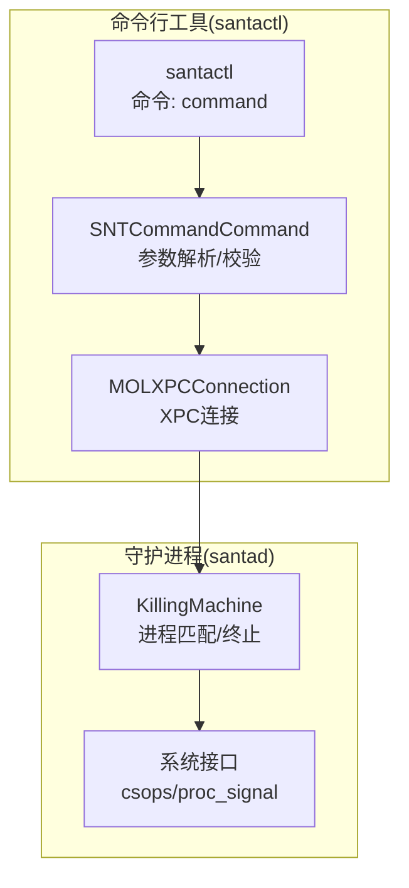
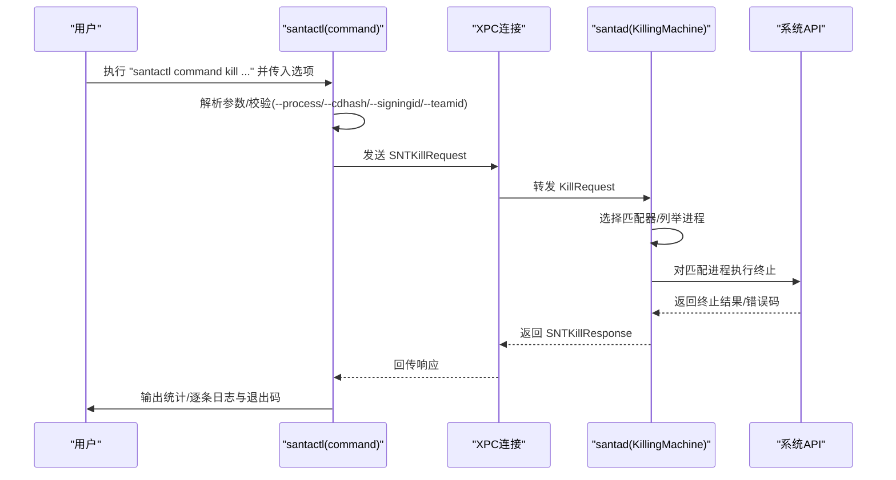
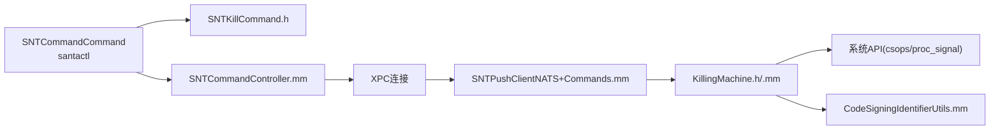

# 调试命令

<cite>
**本文引用的文件**
- [SNTCommandCommand.mm](file://Source/santactl/Commands/SNTCommandCommand.mm)
- [SNTKillCommand.h](file://Source/common/SNTKillCommand.h)
- [KillingMachine.h](file://Source/santad/KillingMachine.h)
- [KillingMachine.mm](file://Source/santad/KillingMachine.mm)
- [SNTCommandController.mm](file://Source/santactl/SNTCommandController.mm)
- [SNTLogging.h](file://Source/common/SNTLogging.h)
- [CodeSigningIdentifierUtils.mm](file://Source/common/CodeSigningIdentifierUtils.mm)
- [SNTPushClientNATS+Commands.mm](file://Source/santasyncservice/SNTPushClientNATS+Commands.mm)
</cite>

## 目录
1. [简介](#简介)
2. [项目结构](#项目结构)
3. [核心组件](#核心组件)
4. [架构总览](#架构总览)
5. [详细组件分析](#详细组件分析)
6. [依赖关系分析](#依赖关系分析)
7. [性能考量](#性能考量)
8. [故障排查指南](#故障排查指南)
9. [结论](#结论)
10. [附录](#附录)

## 简介
本指南面向需要在调试模式下使用 Santa 的“调试命令”（command）的工程师与支持人员。该命令目前仅存在于调试构建中，用于触发 Santa 守护进程（santad）执行特定调试操作，当前主要能力为“kill”进程终止功能。通过该命令，用户可以基于多种标识符（PID、cdhash、SigningID、TeamID）对目标进程进行精准或批量终止，并获得详细的响应与错误信息，便于快速定位问题。

## 项目结构
调试命令位于命令行工具 santactl 中，其核心流程如下：
- 命令入口：santactl 子命令“command”
- 参数解析与校验：在命令实现中完成
- 远程调用：通过 XPC 将请求发送至 santad
- 执行与匹配：santad 内部根据请求类型选择匹配策略并执行终止
- 结果回传：返回每个目标进程的终止结果与错误码

图表来源
- [SNTCommandCommand.mm](file://Source/santactl/Commands/SNTCommandCommand.mm#L63-L192)
- [SNTCommandController.mm](file://Source/santactl/SNTCommandController.mm#L143-L156)
- [KillingMachine.mm](file://Source/santad/KillingMachine.mm#L297-L351)

章节来源
- [SNTCommandCommand.mm](file://Source/santactl/Commands/SNTCommandCommand.mm#L1-L197)
- [SNTCommandController.mm](file://Source/santactl/SNTCommandController.mm#L1-L159)

## 核心组件
- 命令定义与帮助
  - 命令名称注册为“command”，短帮助提示“触发 Santa 命令（仅调试）”，长帮助包含 kill 操作及各参数说明。
- 权限与连接要求
  - 需要 root 权限；需要与守护进程建立 XPC 连接。
- 请求模型
  - SNTKillRequest 及其子类：RunningProcess、CDHash、SigningID、TeamID，均支持安全编码。
  - 响应模型：SNTKillResponse 包含 killedProcesses 列表与整体错误码；单个进程结果包含 pid、pidversion 与错误码。
- 匹配与终止
  - santad 内部根据请求类型构造匹配器（缓冲区匹配/状态标志匹配），遍历进程列表并执行终止；对 RunningProcess 类型额外校验引导会话与 pidversion。
- 日志输出
  - 使用统一日志宏，santactl 侧使用 TEE_LOG* 将日志同时写入系统日志与标准输出/错误流。

章节来源
- [SNTCommandCommand.mm](file://Source/santactl/Commands/SNTCommandCommand.mm#L34-L61)
- [SNTCommandCommand.mm](file://Source/santactl/Commands/SNTCommandCommand.mm#L63-L192)
- [SNTKillCommand.h](file://Source/common/SNTKillCommand.h#L1-L85)
- [KillingMachine.h](file://Source/santad/KillingMachine.h#L1-L29)
- [KillingMachine.mm](file://Source/santad/KillingMachine.mm#L297-L351)
- [SNTLogging.h](file://Source/common/SNTLogging.h#L1-L68)

## 架构总览
调试命令的端到端调用序列如下：

图表来源
- [SNTCommandCommand.mm](file://Source/santactl/Commands/SNTCommandCommand.mm#L94-L192)
- [SNTPushClientNATS+Commands.mm](file://Source/santasyncservice/SNTPushClientNATS+Commands.mm#L213-L252)
- [KillingMachine.mm](file://Source/santad/KillingMachine.mm#L297-L351)

## 详细组件分析

### 命令入口与参数解析（santactl）
- 操作类型
  - 当前仅支持“kill”操作；未知操作会打印用法并退出。
- kill 参数
  - --process {pid} {pidversion}：按 PID 与引导会话版本精确终止；需提供 bootSessionUUID。
  - --cdhash {cdhash}：按 cdhash 终止所有匹配进程。
  - --signingid {signingid}：格式为 TeamID:SigningID；可使用 TeamID “platform” 目标平台二进制。
  - --teamid {teamid}：按 TeamID 终止所有匹配进程；不支持 “platform”。
- 错误处理
  - 缺少必要参数、未知参数、无 kill 请求时，打印错误并退出。
- 超时与响应
  - 等待响应最长约 90 秒；超时或收到空响应则失败；响应中若存在错误码，按类型输出错误信息；逐个进程输出成功/失败详情，并据此决定最终退出码。

章节来源
- [SNTCommandCommand.mm](file://Source/santactl/Commands/SNTCommandCommand.mm#L63-L192)

### 请求与响应数据模型（公共头文件）
- 请求基类与子类
  - SNTKillRequest：携带请求 UUID。
  - SNTKillRequestRunningProcess：pid、pidversion、bootSessionUUID。
  - SNTKillRequestCDHash：cdhash。
  - SNTKillRequestSigningID：teamID、signingID。
  - SNTKillRequestTeamID：teamID。
- 响应与错误
  - SNTKillResponse：killedProcesses（数组）、error（整体错误）。
  - SNTKilledProcess：pid、pidversion、error（单个进程错误）。
  - 错误枚举：无效请求、列举进程失败等；单个进程错误包括无效目标、权限不足、不存在、参数无效、引导会话不匹配等。

章节来源
- [SNTKillCommand.h](file://Source/common/SNTKillCommand.h#L1-L85)

### 匹配与终止逻辑（santad）
- 匹配器
  - BufferMatcher：基于 csops 获取 cdhash、TeamID 或 SigningID 并与期望值比较；对带包装的数据结构进行长度与内容校验。
  - FlagsMatcher：基于 csops 获取状态标志并与掩码比对，用于平台二进制场景。
- RunningProcess 特例
  - 校验引导会话 UUID 一致；获取审计令牌后检查 pidversion 是否匹配，不一致则拒绝。
- 终止策略
  - 对于 RunningProcess：直接按审计令牌发送 SIGKILL。
  - 对于其他类型：先列举进程，再对每个进程在前后两次获取审计令牌期间执行匹配，确保 pid 不被重用或退出；匹配通过后再次确认 pidversion 一致再终止。
- 平台二进制
  - 当 teamID 为 “platform” 时，使用状态标志匹配平台二进制；teamID 终止不支持 “platform”。

章节来源
- [KillingMachine.mm](file://Source/santad/KillingMachine.mm#L44-L128)
- [KillingMachine.mm](file://Source/santad/KillingMachine.mm#L177-L210)
- [KillingMachine.mm](file://Source/santad/KillingMachine.mm#L212-L233)
- [KillingMachine.mm](file://Source/santad/KillingMachine.mm#L235-L269)
- [KillingMachine.mm](file://Source/santad/KillingMachine.mm#L297-L351)
- [CodeSigningIdentifierUtils.mm](file://Source/common/CodeSigningIdentifierUtils.mm#L21-L22)

### XPC 协议适配（同步服务）
- 将外部 protobuf KillRequest 映射为内部 SNTKillRequest 各子类，并设置相应错误码。
- 支持运行中进程、cdhash、SigningID、TeamID 四种类型。

章节来源
- [SNTPushClientNATS+Commands.mm](file://Source/santasyncservice/SNTPushClientNATS+Commands.mm#L213-L252)

### 权限与连接要求
- 权限
  - 命令要求 root 权限；非 root 直接退出并提示。
- 连接
  - 需要与守护进程建立 XPC 连接；连接失效时提示检查守护进程运行状态与 Full Disk Access 权限。

章节来源
- [SNTCommandController.mm](file://Source/santactl/SNTCommandController.mm#L143-L156)

### 日志与输出
- 日志宏
  - 提供 DEBUG/INFO/WARNING/ERROR 四级日志；TEE_LOG* 同时输出到系统日志与终端。
- 命令输出
  - 成功时输出被终止进程数量与逐条 pid/pidversion；失败时输出错误原因并以非零退出码结束。

章节来源
- [SNTLogging.h](file://Source/common/SNTLogging.h#L1-L68)
- [SNTCommandCommand.mm](file://Source/santactl/Commands/SNTCommandCommand.mm#L151-L192)

## 依赖关系分析
- 组件耦合
  - santactl 的 command 命令依赖公共请求/响应模型与系统信息；通过 XPC 与 santad 交互。
  - santad 的 KillingMachine 依赖系统接口（csops、proc_signal）与匹配器实现。
- 外部依赖
  - 代码签名与标识符工具提供平台 TeamID 常量与解析辅助。
- 可能的循环依赖
  - 公共头文件被命令与守护进程共享，但未见直接循环包含；通过编译单元隔离。

图表来源
- [SNTCommandCommand.mm](file://Source/santactl/Commands/SNTCommandCommand.mm#L63-L192)
- [SNTCommandController.mm](file://Source/santactl/SNTCommandController.mm#L143-L156)
- [SNTPushClientNATS+Commands.mm](file://Source/santasyncservice/SNTPushClientNATS+Commands.mm#L213-L252)
- [KillingMachine.h](file://Source/santad/KillingMachine.h#L1-L29)
- [KillingMachine.mm](file://Source/santad/KillingMachine.mm#L297-L351)
- [CodeSigningIdentifierUtils.mm](file://Source/common/CodeSigningIdentifierUtils.mm#L21-L22)

## 性能考量
- 匹配策略
  - 非 RunningProcess 类型会遍历进程列表并对每个进程执行多次系统调用（csops/audit token），复杂度与进程数线性相关。
- 保护机制
  - 采用前后两次获取审计令牌的方式避免 pid 重用与进程退出带来的竞态。
- 超时控制
  - 命令侧等待响应有超时上限，避免长时间阻塞。

章节来源
- [KillingMachine.mm](file://Source/santad/KillingMachine.mm#L235-L269)
- [SNTCommandCommand.mm](file://Source/santactl/Commands/SNTCommandCommand.mm#L162-L165)

## 故障排查指南
- 常见错误与含义
  - 列举进程失败：无法获取进程列表，通常为系统权限或资源限制导致。
  - 无效请求：请求类型或参数不符合预期。
  - 无效目标：尝试终止系统关键进程或自身进程。
  - 权限不足：当前用户或进程不具备终止目标进程的权限。
  - 不存在：目标进程已不存在或 pidversion 不匹配。
  - 参数无效：传入的参数格式或取值不合法。
  - 引导会话不匹配：RunningProcess 类型请求的引导会话 UUID 与当前不一致。
- 日志分析建议
  - 关注命令侧日志中“发送 kill 请求”、“等待响应”、“超时”、“nil 响应”等节点。
  - 关注守护进程侧日志中“拒绝请求”、“匹配失败”、“终止结果”等节点。
- 快速定位步骤
  - 确认是否以 root 运行；确认守护进程已启动且具备 Full Disk Access 权限。
  - 使用 --process 时，确保提供的 pidversion 与当前引导会话一致。
  - 使用 --signingid 时，确认格式为 TeamID:SigningID；TeamID 为 “platform” 仅用于平台二进制场景。
  - 使用 --teamid 时，注意不支持 “platform”。

章节来源
- [SNTCommandCommand.mm](file://Source/santactl/Commands/SNTCommandCommand.mm#L167-L192)
- [KillingMachine.mm](file://Source/santad/KillingMachine.mm#L177-L210)
- [KillingMachine.mm](file://Source/santad/KillingMachine.mm#L212-L233)
- [SNTCommandController.mm](file://Source/santactl/SNTCommandController.mm#L114-L128)

## 结论
调试命令“command kill”提供了在调试模式下对进程进行精准或批量终止的能力，支持 PID、cdhash、SigningID、TeamID 四种触发条件。其实现通过公共数据模型与 XPC 协议解耦，santad 内部采用多层匹配与保护机制确保安全性与稳定性。使用时务必满足 root 权限与守护进程连接要求，并结合日志与错误码进行问题定位。

## 附录

### 使用场景与注意事项
- 使用场景
  - 调试阶段定位异常进程、验证签名策略、复现规则匹配行为。
- 注意事项
  - 仅在调试构建中可用；生产环境不提供该命令。
  - 终止系统关键进程或自身进程会被拒绝。
  - 使用 --teamid 时避免对 “platform” 进行全量终止，以免造成系统不稳定。

章节来源
- [SNTCommandCommand.mm](file://Source/santactl/Commands/SNTCommandCommand.mm#L15-L20)
- [KillingMachine.mm](file://Source/santad/KillingMachine.mm#L192-L210)

### 参数组合与高级用法
- 精确终止（RunningProcess）
  - 使用 --process 指定 pid 与 pidversion，并确保引导会话 UUID 一致。
- 基于签名的批量终止
  - 使用 --cdhash 按摘要终止；使用 --signingid 按 TeamID:SigningID 终止；当 TeamID 为 “platform” 时仅匹配平台二进制。
- 基于团队的批量终止
  - 使用 --teamid 按团队终止；不支持 “platform”。

章节来源
- [SNTCommandCommand.mm](file://Source/santactl/Commands/SNTCommandCommand.mm#L94-L149)
- [KillingMachine.mm](file://Source/santad/KillingMachine.mm#L314-L333)
- [CodeSigningIdentifierUtils.mm](file://Source/common/CodeSigningIdentifierUtils.mm#L21-L22)

### 安全限制与权限要求
- 权限
  - 必须以 root 用户运行。
- 连接
  - 需要与守护进程建立 XPC 连接；连接失效需检查守护进程状态与权限配置。
- 终止限制
  - 不允许终止系统关键进程与自身进程；对 RunningProcess 额外校验引导会话与 pidversion。

章节来源
- [SNTCommandController.mm](file://Source/santactl/SNTCommandController.mm#L143-L156)
- [KillingMachine.mm](file://Source/santad/KillingMachine.mm#L192-L210)
- [KillingMachine.mm](file://Source/santad/KillingMachine.mm#L212-L233)