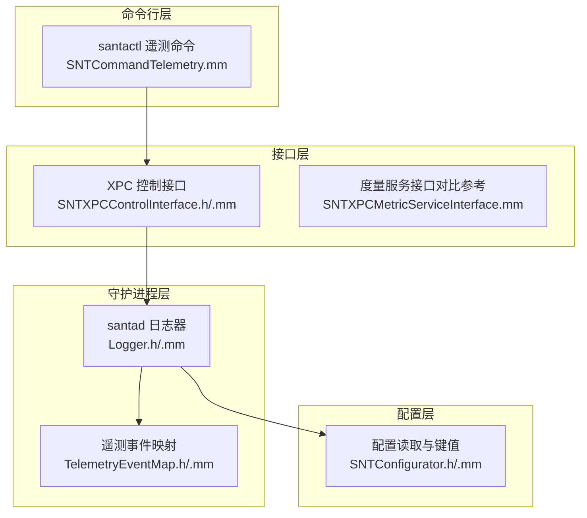
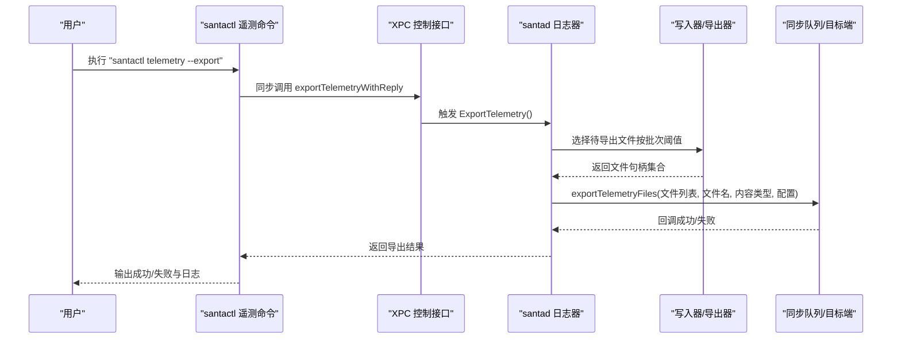
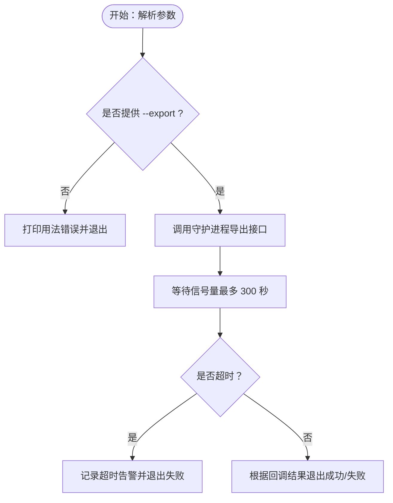
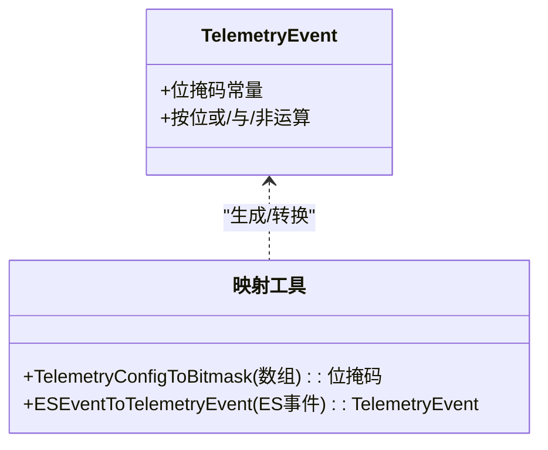
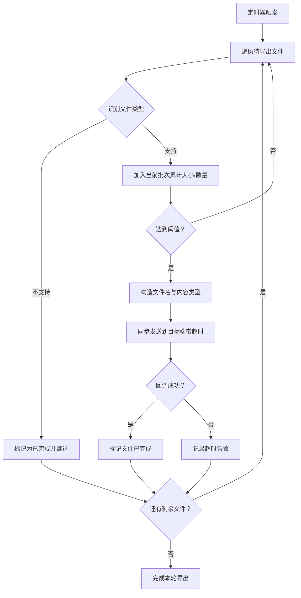
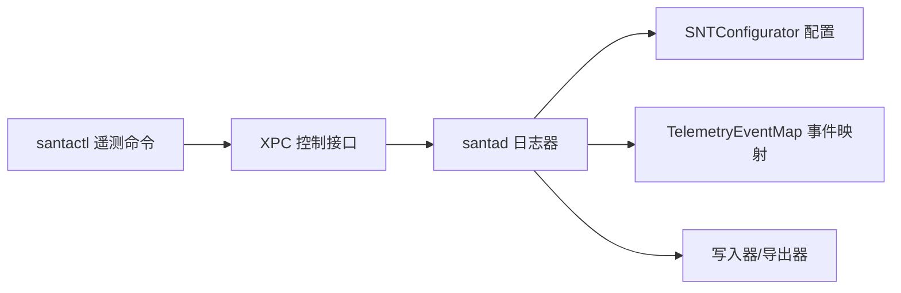

# 遥测命令

<cite>
**本文引用的文件**
- [SNTCommandTelemetry.mm](file://Source/santactl/Commands/SNTCommandTelemetry.mm)
- [TelemetryEventMap.h](file://Source/common/TelemetryEventMap.h)
- [TelemetryEventMap.mm](file://Source/common/TelemetryEventMap.mm)
- [SNTConfigurator.h](file://Source/common/SNTConfigurator.h)
- [SNTConfigurator.mm](file://Source/common/SNTConfigurator.mm)
- [Logger.h](file://Source/santad/Logs/EndpointSecurity/Logger.h)
- [Logger.mm](file://Source/santad/Logs/EndpointSecurity/Logger.mm)
- [SNTXPCControlInterface.h](file://Source/common/SNTXPCControlInterface.h)
- [SNTXPCControlInterface.mm](file://Source/common/SNTXPCControlInterface.mm)
- [SNTXPCMetricServiceInterface.mm](file://Source/common/SNTXPCMetricServiceInterface.mm)
- [SNTMetricServiceTest.mm](file://Source/santametricservice/SNTMetricServiceTest.mm)
- [telemetry.mdx](file://docs/docs/features/telemetry.mdx)
</cite>

## 目录
1. [简介](#简介)
2. [项目结构](#项目结构)
3. [核心组件](#核心组件)
4. [架构总览](#架构总览)
5. [详细组件分析](#详细组件分析)
6. [依赖关系分析](#依赖关系分析)
7. [性能考量](#性能考量)
8. [故障排查指南](#故障排查指南)
9. [结论](#结论)
10. [附录](#附录)

## 简介
本操作指南面向使用 Santa 的管理员与安全运营人员，聚焦“遥测命令”的使用与工作机制，涵盖以下方面：
- 遥测命令的功能与入口：通过命令行工具触发遥测导出。
- 数据采集范围：基于事件类型映射与配置项，明确可采集的系统状态、性能指标与事件统计。
- 数据格式与传输：遥测文件的序列化格式、导出批次策略、超时控制与目标端处理。
- 存储位置：本地磁盘上的遥测文件与导出队列管理。
- 解读与趋势分析：如何理解遥测事件类型与字段，以及结合配置进行趋势分析。
- 配置选项与自定义参数：Telemetry 事件选择、导出周期、批次阈值、超时等关键参数。
- 导出与报告：命令行导出流程、测试用例中的导出行为参考。

## 项目结构
遥测相关能力由三部分协同实现：
- 命令行层（santactl）：提供遥测子命令，调用守护进程接口触发导出。
- 守护进程层（santad）：负责事件采集、过滤、序列化、落盘与定时导出。
- 配置层（SNTConfigurator）：集中管理 Telemetry、日志类型、导出周期、批次阈值等参数。

图表来源
- [SNTCommandTelemetry.mm](file://Source/santactl/Commands/SNTCommandTelemetry.mm#L30-L107)
- [Logger.h](file://Source/santad/Logs/EndpointSecurity/Logger.h#L47-L114)
- [Logger.mm](file://Source/santad/Logs/EndpointSecurity/Logger.mm#L129-L195)
- [TelemetryEventMap.h](file://Source/common/TelemetryEventMap.h#L26-L91)
- [TelemetryEventMap.mm](file://Source/common/TelemetryEventMap.mm#L27-L121)
- [SNTConfigurator.h](file://Source/common/SNTConfigurator.h#L229-L317)
- [SNTConfigurator.mm](file://Source/common/SNTConfigurator.mm#L158-L164)
- [SNTXPCControlInterface.h](file://Source/common/SNTXPCControlInterface.h#L28-L78)
- [SNTXPCControlInterface.mm](file://Source/common/SNTXPCControlInterface.mm#L28-L40)
- [SNTXPCMetricServiceInterface.mm](file://Source/common/SNTXPCMetricServiceInterface.mm#L19-L41)

章节来源
- [SNTCommandTelemetry.mm](file://Source/santactl/Commands/SNTCommandTelemetry.mm#L30-L107)
- [Logger.h](file://Source/santad/Logs/EndpointSecurity/Logger.h#L47-L114)
- [Logger.mm](file://Source/santad/Logs/EndpointSecurity/Logger.mm#L129-L195)
- [TelemetryEventMap.h](file://Source/common/TelemetryEventMap.h#L26-L91)
- [TelemetryEventMap.mm](file://Source/common/TelemetryEventMap.mm#L27-L121)
- [SNTConfigurator.h](file://Source/common/SNTConfigurator.h#L229-L317)
- [SNTConfigurator.mm](file://Source/common/SNTConfigurator.mm#L158-L164)
- [SNTXPCControlInterface.h](file://Source/common/SNTXPCControlInterface.h#L28-L78)
- [SNTXPCControlInterface.mm](file://Source/common/SNTXPCControlInterface.mm#L28-L40)
- [SNTXPCMetricServiceInterface.mm](file://Source/common/SNTXPCMetricServiceInterface.mm#L19-L41)

## 核心组件
- 遥测命令（santactl）
  - 提供子命令“telemetry”，当前仅在调试构建中可用。
  - 支持操作：--export（导出当前遥测）。
  - 通过 XPC 连接守护进程，同步调用导出接口并等待结果或超时。
- 日志器（santad）
  - 基于定时器周期性触发导出；支持按批次聚合多个文件，限制单批大小与最大打开文件数。
  - 识别遥测文件类型（未压缩流、gzip、zstd），并根据导出配置发送到目标端。
- 事件映射
  - 将配置中的事件名称映射为内部位掩码，决定哪些事件被记录与导出。
- 配置
  - Telemetry：事件选择列表（默认全部）。
  - enableTelemetryExport、telemetryExportIntervalSec、telemetryExportTimeoutSec、telemetryExportBatchThresholdSizeMB、telemetryExportMaxFilesPerBatch：导出行为的关键参数。

章节来源
- [SNTCommandTelemetry.mm](file://Source/santactl/Commands/SNTCommandTelemetry.mm#L30-L107)
- [Logger.h](file://Source/santad/Logs/EndpointSecurity/Logger.h#L47-L114)
- [Logger.mm](file://Source/santad/Logs/EndpointSecurity/Logger.mm#L195-L394)
- [TelemetryEventMap.h](file://Source/common/TelemetryEventMap.h#L26-L91)
- [TelemetryEventMap.mm](file://Source/common/TelemetryEventMap.mm#L27-L121)
- [SNTConfigurator.h](file://Source/common/SNTConfigurator.h#L229-L317)
- [SNTConfigurator.mm](file://Source/common/SNTConfigurator.mm#L158-L164)

## 架构总览
遥测命令从用户态进入，经由 XPC 调用守护进程的导出接口；守护进程根据配置与事件映射，将本地已生成的遥测文件按批次打包并通过同步队列发送至目标端。

图表来源
- [SNTCommandTelemetry.mm](file://Source/santactl/Commands/SNTCommandTelemetry.mm#L74-L107)
- [SNTXPCControlInterface.h](file://Source/common/SNTXPCControlInterface.h#L28-L78)
- [Logger.mm](file://Source/santad/Logs/EndpointSecurity/Logger.mm#L247-L394)

章节来源
- [SNTCommandTelemetry.mm](file://Source/santactl/Commands/SNTCommandTelemetry.mm#L74-L107)
- [Logger.mm](file://Source/santad/Logs/EndpointSecurity/Logger.mm#L247-L394)
- [SNTXPCControlInterface.h](file://Source/common/SNTXPCControlInterface.h#L28-L78)

## 详细组件分析

### 组件A：遥测命令（santactl）
- 功能要点
  - 子命令注册名为“telemetry”。
  - 当前仅支持“--export”操作。
  - 通过同步代理调用守护进程导出接口，并以信号量等待结果，超时则记录告警并退出。
- 使用建议
  - 在需要立即触发一次遥测导出时使用；注意该命令仅在调试构建中存在。
  - 若导出超时或失败，请检查守护进程日志与导出配置。

图表来源
- [SNTCommandTelemetry.mm](file://Source/santactl/Commands/SNTCommandTelemetry.mm#L51-L107)

章节来源
- [SNTCommandTelemetry.mm](file://Source/santactl/Commands/SNTCommandTelemetry.mm#L30-L107)

### 组件B：遥测事件映射（TelemetryEventMap）
- 功能要点
  - 定义遥测事件枚举与位运算，支持“全部”“无”等特殊值。
  - 将配置数组中的事件字符串转换为位掩码，用于决定是否记录某类事件。
  - 将底层 EndpointSecurity 事件类型映射到遥测事件枚举。
- 使用建议
  - 通过配置键“Telemetry”选择要记录的事件类型；默认为空表示记录所有事件。
  - 注意高频事件（如 Fork、Exit、Close）可能产生大量数据，应谨慎启用。

图表来源
- [TelemetryEventMap.h](file://Source/common/TelemetryEventMap.h#L26-L91)
- [TelemetryEventMap.mm](file://Source/common/TelemetryEventMap.mm#L27-L121)

章节来源
- [TelemetryEventMap.h](file://Source/common/TelemetryEventMap.h#L26-L91)
- [TelemetryEventMap.mm](file://Source/common/TelemetryEventMap.mm#L27-L121)

### 组件C：守护进程导出逻辑（Logger）
- 功能要点
  - 周期性触发导出（最小/最大间隔约束）。
  - 按“单批最大文件数”和“单批总大小阈值”聚合待导出文件。
  - 识别文件类型（未压缩流、gzip、zstd），构造文件名并调用同步队列导出。
  - 超时控制：根据配置设置导出超时秒数，超时后记录告警并回滚状态。
- 关键参数
  - telemetryExportIntervalSec：导出周期（受最小/最大值约束）。
  - telemetryExportTimeoutSec：单次导出超时。
  - telemetryExportBatchThresholdSizeMB：单批大小阈值（1–5120 MB 限定）。
  - telemetryExportMaxFilesPerBatch：单批最大文件数（1–100 限定）。

图表来源
- [Logger.h](file://Source/santad/Logs/EndpointSecurity/Logger.h#L47-L114)
- [Logger.mm](file://Source/santad/Logs/EndpointSecurity/Logger.mm#L195-L394)

章节来源
- [Logger.h](file://Source/santad/Logs/EndpointSecurity/Logger.h#L47-L114)
- [Logger.mm](file://Source/santad/Logs/EndpointSecurity/Logger.mm#L195-L394)

### 组件D：配置与导出参数（SNTConfigurator）
- 关键键值
  - Telemetry：事件类型数组（默认空表示全部）。
  - EnableTelemetryExport：是否启用自动导出。
  - TelemetryExportIntervalSec：导出周期（最小 60，最大 3600）。
  - TelemetryExportTimeoutSec：导出超时（最小 1，最大 600）。
  - TelemetryExportBatchThresholdSizeMB：单批大小阈值（1–5120）。
  - TelemetryExportMaxFilesPerBatch：单批最大文件数（1–100）。
- 说明
  - 配置键在运行时通过 KVO 影响日志器的行为。
  - 未设置导出配置时，守护进程会记录告警但不会导出。

章节来源
- [SNTConfigurator.h](file://Source/common/SNTConfigurator.h#L229-L317)
- [SNTConfigurator.mm](file://Source/common/SNTConfigurator.mm#L158-L164)
- [Logger.mm](file://Source/santad/Logs/EndpointSecurity/Logger.mm#L129-L195)

### 组件E：事件类型与数据解读（文档与映射）
- 事件类型概览
  - 执行/进程：Execution、Fork、Exit、CodesigningInvalidated 等。
  - 文件：Close、Rename、Unlink、Link、ExchangeData、Clone、CopyFile 等。
  - 其他：Disk、Bundle、Allowlist、FileAccess、LoginWindowSession、LoginLogout、ScreenSharing、OpenSSH、Authentication、GatekeeperOverride、TCCModification、XProtect、LaunchItem 等。
- 数据解读要点
  - 不同日志类型（file、syslog、protobuf、json、null）影响输出格式与性能。
  - Protobuf/JSON 输出基于同一底层消息，JSON 会额外进行转换，性能较低。
- 趋势分析建议
  - 结合 Telemetry 事件选择与日志类型，定位异常峰值（如频繁 Fork/Exit）。
  - 利用 Machine ID 装饰与导出批次命名，跨主机比对事件模式。

章节来源
- [telemetry.mdx](file://docs/docs/features/telemetry.mdx#L1-L433)
- [TelemetryEventMap.mm](file://Source/common/TelemetryEventMap.mm#L27-L121)

## 依赖关系分析
- 命令行依赖 XPC 接口连接守护进程。
- 守护进程依赖配置读取器获取 Telemetry 事件掩码与导出参数。
- 事件映射模块为日志器提供事件过滤依据。
- 度量服务接口（对比参考）展示了 XPC 接口与服务标识的通用模式，便于理解遥测导出的调用路径。

图表来源
- [SNTCommandTelemetry.mm](file://Source/santactl/Commands/SNTCommandTelemetry.mm#L30-L107)
- [SNTXPCControlInterface.h](file://Source/common/SNTXPCControlInterface.h#L28-L78)
- [Logger.h](file://Source/santad/Logs/EndpointSecurity/Logger.h#L47-L114)
- [SNTConfigurator.h](file://Source/common/SNTConfigurator.h#L229-L317)
- [TelemetryEventMap.h](file://Source/common/TelemetryEventMap.h#L26-L91)

章节来源
- [SNTCommandTelemetry.mm](file://Source/santactl/Commands/SNTCommandTelemetry.mm#L30-L107)
- [SNTXPCControlInterface.h](file://Source/common/SNTXPCControlInterface.h#L28-L78)
- [Logger.h](file://Source/santad/Logs/EndpointSecurity/Logger.h#L47-L114)
- [SNTConfigurator.h](file://Source/common/SNTConfigurator.h#L229-L317)
- [TelemetryEventMap.h](file://Source/common/TelemetryEventMap.h#L26-L91)

## 性能考量
- 事件噪声控制
  - 高频事件（如 Fork、Exit、Close）会产生大量数据，建议按需启用或配合文件变更前缀过滤减少噪音。
- 导出参数限幅
  - 单批大小与最大文件数限制，避免一次性打开过多文件造成资源压力。
  - 导出超时与周期设置，防止导出过程对系统造成持续性负载。
- 日志类型选择
  - Protobuf/JSON 输出相较 file/syslog 更重，建议在需要结构化分析时使用。

## 故障排查指南
- 常见问题
  - 命令不存在或不可用：遥测命令仅在调试构建中提供，确认构建类型。
  - 导出超时：检查导出超时配置与网络状况；查看守护进程日志中的超时告警。
  - 无导出配置：当启用导出但未设置导出配置时，守护进程会记录告警并跳过导出。
  - 文件类型不受支持：仅支持未压缩流、gzip、zstd；其他类型会被忽略并记录告警。
- 参考测试
  - 测试覆盖了导出配置缺失、写入原始 JSON 文件、通过 HTTP 发送 JSON 等场景，可作为行为验证的参考。

章节来源
- [SNTCommandTelemetry.mm](file://Source/santactl/Commands/SNTCommandTelemetry.mm#L74-L107)
- [Logger.mm](file://Source/santad/Logs/EndpointSecurity/Logger.mm#L247-L394)
- [SNTMetricServiceTest.mm](file://Source/santametricservice/SNTMetricServiceTest.mm#L104-L138)

## 结论
遥测命令提供了快速触发守护进程导出的能力，结合事件映射与导出参数，可在保证性能的前提下获取系统关键事件与运行状态信息。通过合理配置 Telemetry 事件集与导出策略，可以有效支撑安全分析与趋势监控工作。

## 附录

### A. 遥测命令使用示例
- 触发一次遥测导出
  - 执行：santactl telemetry --export
  - 行为：同步等待守护进程完成导出，超时或失败会输出相应日志并退出。

章节来源
- [SNTCommandTelemetry.mm](file://Source/santactl/Commands/SNTCommandTelemetry.mm#L51-L107)

### B. 配置选项与自定义参数
- Telemetry：事件类型数组（默认空表示全部）
- EnableTelemetryExport：是否启用自动导出
- TelemetryExportIntervalSec：导出周期（60–3600）
- TelemetryExportTimeoutSec：导出超时（1–600）
- TelemetryExportBatchThresholdSizeMB：单批大小阈值（1–5120）
- TelemetryExportMaxFilesPerBatch：单批最大文件数（1–100）

章节来源
- [SNTConfigurator.h](file://Source/common/SNTConfigurator.h#L229-L317)
- [SNTConfigurator.mm](file://Source/common/SNTConfigurator.mm#L158-L164)
- [Logger.mm](file://Source/santad/Logs/EndpointSecurity/Logger.mm#L166-L195)

### C. 数据格式与存储位置
- 日志类型
  - file、syslog、protobuf、json、null
- 存储位置
  - file 类型：EventLogPath（默认路径）
  - protobuf 类型：SpoolDirectory（默认路径），并受文件大小与目录总大小阈值控制
- 导出文件命名
  - 使用引导会话 UUID 与随机 UUID 组合命名，后缀根据压缩类型确定

章节来源
- [telemetry.mdx](file://docs/docs/features/telemetry.mdx#L340-L433)
- [Logger.mm](file://Source/santad/Logs/EndpointSecurity/Logger.mm#L238-L245)

### D. 遥测数据解读与趋势分析
- 事件类型解读
  - 参考文档列出各事件类型的字段与含义，结合 Machine ID 与时间戳进行关联分析。
- 趋势分析建议
  - 以事件类型为维度统计峰值与变化趋势，识别异常登录、屏幕共享、SSH 连接等高风险行为。
  - 对高频事件进行降噪与聚合，关注异常突增与持续性模式。

章节来源
- [telemetry.mdx](file://docs/docs/features/telemetry.mdx#L1-L433)