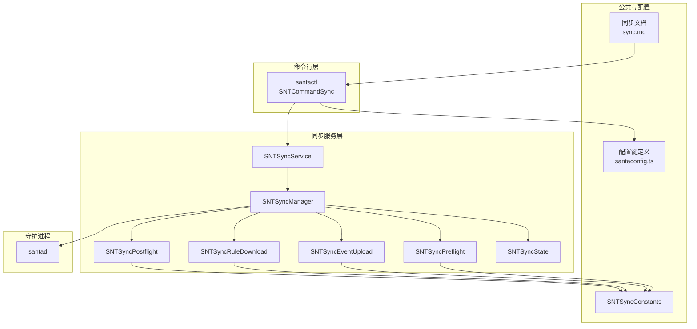
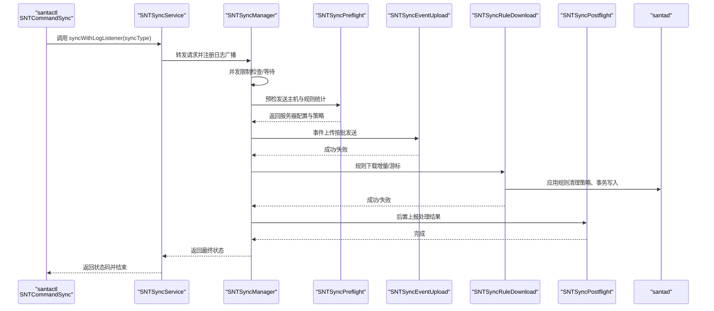
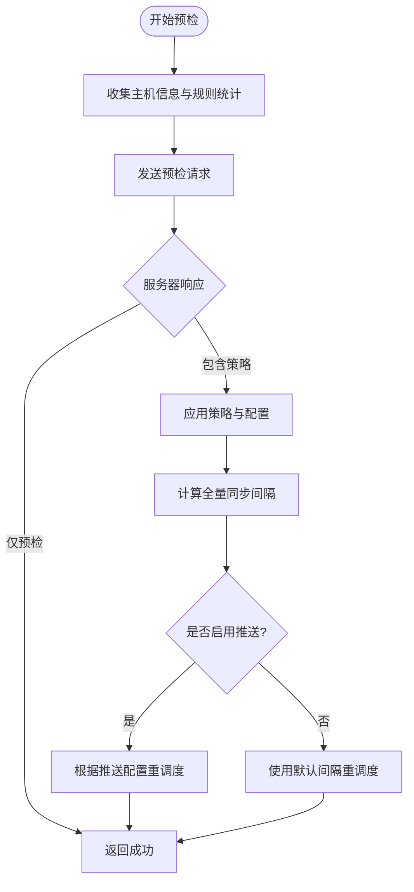
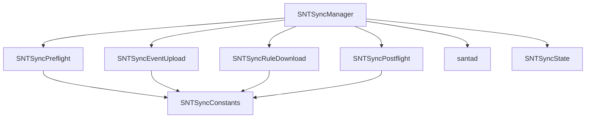

# 同步操作命令

<cite>
**本文引用的文件**
- [SNTCommandSync.mm](file://Source/santactl/Commands/SNTCommandSync.mm)
- [SNTSyncManager.mm](file://Source/santasyncservice/SNTSyncManager.mm)
- [SNTSyncPreflight.mm](file://Source/santasyncservice/SNTSyncPreflight.mm)
- [SNTSyncEventUpload.mm](file://Source/santasyncservice/SNTSyncEventUpload.mm)
- [SNTSyncRuleDownload.mm](file://Source/santasyncservice/SNTSyncRuleDownload.mm)
- [SNTSyncPostflight.mm](file://Source/santasyncservice/SNTSyncPostflight.mm)
- [SNTSyncService.mm](file://Source/santasyncservice/SNTSyncService.mm)
- [SNTSyncState.mm](file://Source/santasyncservice/SNTSyncState.mm)
- [SNTSyncConstants.h](file://Source/common/SNTSyncConstants.h)
- [santaconfig.ts](file://docs/src/lib/santaconfig.ts)
- [sync.md](file://docs/docs/features/sync.md)
- [main.mm](file://Source/santasyncservice/main.mm)
- [SNTCommandDoctor.mm](file://Source/santactl/Commands/SNTCommandDoctor.mm)
</cite>

## 目录
1. [简介](#简介)
2. [项目结构](#项目结构)
3. [核心组件](#核心组件)
4. [架构总览](#架构总览)
5. [详细组件分析](#详细组件分析)
6. [依赖关系分析](#依赖关系分析)
7. [性能考虑](#性能考虑)
8. [故障排除指南](#故障排除指南)
9. [结论](#结论)
10. [附录](#附录)

## 简介
本文件面向使用 Santa 的管理员与工程师，系统性介绍“同步操作命令”的使用方法与内部机制。内容涵盖：
- 同步阶段：预检（preflight）、事件上传（event upload）、规则下载（rule download）、后置（postflight）
- 配置项与参数：如何设置同步服务器、认证、代理、事件上传策略、批大小等
- 同步状态检查与故障排除
- 错误处理与重试机制
- 性能优化建议与最佳实践
- 诊断工具与调试方法
- 在集中管理与策略分发中的作用

## 项目结构
同步相关代码主要分布在以下模块：
- 命令行入口：santactl 的 sync 子命令
- 同步服务：santasyncservice 的后台服务与 XPC 接口
- 同步阶段：预检、事件上传、规则下载、后置
- 公共常量与配置：同步协议键名、默认值、时间间隔等
- 文档与配置生成：官方文档与配置键列表

图表来源
- [SNTCommandSync.mm](file://Source/santactl/Commands/SNTCommandSync.mm#L60-L107)
- [SNTSyncService.mm](file://Source/santasyncservice/SNTSyncService.mm#L168-L185)
- [SNTSyncManager.mm](file://Source/santasyncservice/SNTSyncManager.mm#L297-L400)
- [SNTSyncPreflight.mm](file://Source/santasyncservice/SNTSyncPreflight.mm#L406-L426)
- [SNTSyncEventUpload.mm](file://Source/santasyncservice/SNTSyncEventUpload.mm#L458-L482)
- [SNTSyncRuleDownload.mm](file://Source/santasyncservice/SNTSyncRuleDownload.mm#L395-L472)
- [SNTSyncPostflight.mm](file://Source/santasyncservice/SNTSyncPostflight.mm#L70-L83)
- [SNTSyncState.mm](file://Source/santasyncservice/SNTSyncState.mm#L17-L21)
- [SNTSyncConstants.h](file://Source/common/SNTSyncConstants.h#L15-L166)
- [santaconfig.ts](file://docs/src/lib/santaconfig.ts#L826-L967)
- [sync.md](file://docs/docs/features/sync.md#L26-L170)

章节来源
- [SNTCommandSync.mm](file://Source/santactl/Commands/SNTCommandSync.mm#L1-L119)
- [SNTSyncService.mm](file://Source/santasyncservice/SNTSyncService.mm#L168-L190)
- [SNTSyncManager.mm](file://Source/santasyncservice/SNTSyncManager.mm#L66-L103)
- [sync.md](file://docs/docs/features/sync.md#L1-L170)

## 核心组件
- 同步命令入口（santactl）：解析参数、连接同步服务、接收日志、返回状态码
- 同步服务（santasyncservice）：对外提供 XPC 接口，调度同步流程
- 同步管理器（SNTSyncManager）：编排四个阶段；控制定时器、并发限制、网络可达性监听
- 阶段实现：预检、事件上传、规则下载、后置
- 同步状态（SNTSyncState）：承载本次同步的会话、令牌、批次大小、推送配置等
- 常量与配置：协议键名、默认时间间隔、事件批大小等

章节来源
- [SNTCommandSync.mm](file://Source/santactl/Commands/SNTCommandSync.mm#L27-L119)
- [SNTSyncService.mm](file://Source/santasyncservice/SNTSyncService.mm#L168-L185)
- [SNTSyncManager.mm](file://Source/santasyncservice/SNTSyncManager.mm#L418-L500)
- [SNTSyncState.mm](file://Source/santasyncservice/SNTSyncState.mm#L17-L21)
- [SNTSyncConstants.h](file://Source/common/SNTSyncConstants.h#L15-L166)

## 架构总览
同步流程由“预检—事件上传—规则下载—后置”四阶段组成，每个阶段通过 HTTP 请求与服务器交互，并在失败时进行有限重试。管理器负责：
- 并发控制：限制同时进行的同步数量
- 定时调度：根据服务器响应或推送配置调整全量同步周期
- 网络可达性：在网络恢复时自动触发同步
- 与守护进程通信：更新配置、记录规则同步结果、通知应用

图表来源
- [SNTCommandSync.mm](file://Source/santactl/Commands/SNTCommandSync.mm#L94-L103)
- [SNTSyncService.mm](file://Source/santasyncservice/SNTSyncService.mm#L168-L185)
- [SNTSyncManager.mm](file://Source/santasyncservice/SNTSyncManager.mm#L297-L400)
- [SNTSyncPreflight.mm](file://Source/santasyncservice/SNTSyncPreflight.mm#L413-L426)
- [SNTSyncEventUpload.mm](file://Source/santasyncservice/SNTSyncEventUpload.mm#L465-L482)
- [SNTSyncRuleDownload.mm](file://Source/santasyncservice/SNTSyncRuleDownload.mm#L402-L472)
- [SNTSyncPostflight.mm](file://Source/santasyncservice/SNTSyncPostflight.mm#L77-L83)

## 详细组件分析

### 命令入口：santactl 同步命令
- 参数支持
  - --clean：执行“清理同步”，删除非传递规则并请求服务器清理
  - --clean-all：执行“全量清理同步”，删除所有规则并请求服务器清理
  - --debug：启用详细日志输出
- 行为要点
  - 降权运行，避免特权
  - 校验是否配置了同步基础地址
  - 通过 XPC 连接同步服务，注册日志接收端点
  - 发起同步并阻塞等待状态码退出

章节来源
- [SNTCommandSync.mm](file://Source/santactl/Commands/SNTCommandSync.mm#L45-L107)

### 同步服务：对外接口与日志广播
- 提供 XPC 接口，接受同步类型与日志监听端点
- 将日志监听者加入广播器，以便实时输出同步进度
- 将实际同步委托给 SNTSyncManager

章节来源
- [SNTSyncService.mm](file://Source/santasyncservice/SNTSyncService.mm#L168-L185)

### 同步管理器：编排与控制
- 并发与限流
  - 使用信号量限制同时进行的同步任务数
  - 在队列中串行执行同步，避免资源竞争
- 定时器与周期
  - 全量同步定时器：根据服务器响应或推送配置动态调整
  - 规则同步定时器：独立调度，不与全量同步冲突
- 网络可达性
  - 监听网络路径变化，网络恢复时自动触发同步
- 与守护进程交互
  - 更新同步设置（如清理模式）
  - 记录规则同步成功状态
  - 通知应用规则变更

章节来源
- [SNTSyncManager.mm](file://Source/santasyncservice/SNTSyncManager.mm#L41-L103)
- [SNTSyncManager.mm](file://Source/santasyncservice/SNTSyncManager.mm#L204-L228)
- [SNTSyncManager.mm](file://Source/santasyncservice/SNTSyncManager.mm#L502-L537)

### 预检（Preflight）
- 目的：向服务器汇报主机信息、当前规则计数、客户端模式等；接收服务器下发的策略与配置
- 关键行为
  - 收集系统信息、规则哈希、当前模式
  - 解析服务器响应，设置批大小、全量同步间隔、客户端模式、允许/禁止正则、USB/网络挂载策略、事件上传开关、导出配置等
  - 处理 v2 协议推送配置（NATS/Firebase）与设备标识
  - 若仅预检模式，则直接返回成功
- 清理同步逻辑
  - 客户端请求的清理类型优先级：clean-all > clean > normal
  - 服务器可覆盖客户端请求，但不能强制“全量清理”以外的清理类型覆盖“全量清理”

图表来源
- [SNTSyncPreflight.mm](file://Source/santasyncservice/SNTSyncPreflight.mm#L84-L323)
- [SNTSyncPreflight.mm](file://Source/santasyncservice/SNTSyncPreflight.mm#L325-L404)

章节来源
- [SNTSyncPreflight.mm](file://Source/santasyncservice/SNTSyncPreflight.mm#L413-L426)
- [SNTSyncPreflight.mm](file://Source/santasyncservice/SNTSyncPreflight.mm#L406-L426)

### 事件上传（Event Upload）
- 目的：上传被阻止或可能被阻止的执行事件，帮助服务器进行策略分析与联动
- 关键行为
  - 按批发送事件，批大小来自预检响应
  - 支持多种事件类型（执行、文件访问、临时监控审计、网络挂载）
  - 上传完成后从本地数据库移除已发送事件 ID
  - 可根据配置决定是否上传“未知”事件或全部事件
- 重试与回退
  - 上传失败时保留事件，待网络恢复后重试
  - 服务器可要求后续上传与特定二进制相关的事件

章节来源
- [SNTSyncEventUpload.mm](file://Source/santasyncservice/SNTSyncEventUpload.mm#L465-L482)
- [SNTSyncEventUpload.mm](file://Source/santasyncservice/SNTSyncEventUpload.mm#L91-L177)

### 规则下载（Rule Download）
- 目的：从服务器增量拉取规则，应用到本地数据库
- 关键行为
  - 使用游标分页，直到服务器返回空游标
  - 支持 v1/v2 协议，v2 新增文件访问规则与网络挂载事件
  - 根据同步类型选择清理策略：正常/非传递清理/全量清理
  - 应用规则时以事务方式写入，保证一致性
  - 对于允许的二进制，可触发推送通知（如存在相关提示）
- 错误处理
  - 写入超时或失败时返回失败，等待下次重试
  - 记录处理统计，便于后置上报

章节来源
- [SNTSyncRuleDownload.mm](file://Source/santasyncservice/SNTSyncRuleDownload.mm#L402-L472)
- [SNTSyncRuleDownload.mm](file://Source/santasyncservice/SNTSyncRuleDownload.mm#L87-L154)

### 后置（Postflight）
- 目的：告知服务器本次同步完成，上报规则接收与处理统计
- 关键行为
  - 上报规则接收/处理数量、同步类型、当前规则哈希
  - 更新同步设置，记录成功状态

章节来源
- [SNTSyncPostflight.mm](file://Source/santasyncservice/SNTSyncPostflight.mm#L77-L83)
- [SNTSyncPostflight.mm](file://Source/santasyncservice/SNTSyncPostflight.mm#L30-L66)

### 同步状态（SNTSyncState）
- 承载本次同步的上下文：会话、XSRF 令牌、批次大小、推送配置、清理类型等
- 生命周期：随每次同步创建，结束后释放会话

章节来源
- [SNTSyncState.mm](file://Source/santasyncservice/SNTSyncState.mm#L17-L21)

## 依赖关系分析
- 组件耦合
  - SNTSyncManager 作为编排中心，依赖各阶段组件与守护进程
  - 各阶段组件共享 SNTSyncState，降低重复初始化成本
- 外部依赖
  - 网络栈：NSURLSession、NWPathMonitor
  - 协议：Protobuf（v1/v2），用于请求/响应序列化
  - 推送：FCM/NATS（可选）
- 潜在风险
  - 并发限制与定时器调度需谨慎，避免过度占用 CPU 或网络
  - 事件批大小与清理策略影响数据库写入性能

图表来源
- [SNTSyncManager.mm](file://Source/santasyncservice/SNTSyncManager.mm#L306-L400)
- [SNTSyncPreflight.mm](file://Source/santasyncservice/SNTSyncPreflight.mm#L406-L426)
- [SNTSyncEventUpload.mm](file://Source/santasyncservice/SNTSyncEventUpload.mm#L458-L482)
- [SNTSyncRuleDownload.mm](file://Source/santasyncservice/SNTSyncRuleDownload.mm#L395-L472)
- [SNTSyncPostflight.mm](file://Source/santasyncservice/SNTSyncPostflight.mm#L70-L83)
- [SNTSyncConstants.h](file://Source/common/SNTSyncConstants.h#L15-L166)

## 性能考虑
- 批大小与网络带宽
  - 通过预检响应设置批大小，减少请求次数与网络开销
  - v2 协议支持压缩与二进制传输，可进一步降低带宽占用
- 数据库写入
  - 规则下载采用事务批量写入，避免频繁 IO
  - 清理策略应按需选择，避免不必要的全量删除
- 并发与定时
  - 合理设置全量同步间隔，避免频繁全量同步
  - 利用推送配置缩短等待时间，提升响应速度
- 事件上传
  - 仅上传必要事件，减少无效数据传输
  - 对未知事件上传策略进行审慎配置

[本节为通用指导，无需列出章节来源]

## 故障排除指南
- 常见问题与定位
  - 缺少同步基础地址：命令会直接退出
  - 连接同步服务失败：检查服务是否启动、权限是否正确
  - 同步过多：并发限制触发，稍后再试
  - 网络不可达：管理器会监听网络恢复并自动重试
- 日志与诊断
  - 使用 --debug 输出详细日志
  - doctor 命令可检查系统与同步相关配置
- 服务器响应异常
  - 预检/事件上传/规则下载/后置任一阶段失败会终止当前同步
  - 预检失败会回滚策略；规则下载成功则不会回滚规则
- 重试与退避
  - 单次请求最多重试若干次；若仍失败，管理器会等待网络恢复后重试

章节来源
- [SNTCommandSync.mm](file://Source/santactl/Commands/SNTCommandSync.mm#L67-L70)
- [SNTSyncManager.mm](file://Source/santasyncservice/SNTSyncManager.mm#L360-L364)
- [SNTSyncManager.mm](file://Source/santasyncservice/SNTSyncManager.mm#L504-L531)
- [SNTCommandDoctor.mm](file://Source/santactl/Commands/SNTCommandDoctor.mm#L79-L85)

## 结论
同步操作命令提供了从客户端到服务器的完整策略分发与事件上报链路。通过预检、事件上传、规则下载与后置四个阶段，结合并发控制、定时调度与网络可达性监听，Santa 实现了稳定高效的集中管理能力。合理配置批大小、清理策略与推送配置，可显著提升性能与用户体验。

[本节为总结性内容，无需列出章节来源]

## 附录

### 同步配置与参数
- 必填项
  - SyncBaseURL：同步服务器基础地址
- 认证与安全
  - ClientAuthCertificateFile/Password：客户端证书认证
  - ClientAuthCertificateCn/Iusser：基于 CN/Issuer 的客户端证书匹配
  - SyncServerAuthRootsFile/Data：服务器根证书
- 事件上传策略
  - EnableAllEventUpload：是否上传所有事件（含允许）
  - DisableUnknownEventUpload：是否禁用未知二进制允许事件上传
  - EnableCleanSyncEventUpload：清理同步时是否上传事件
- 传输与编码
  - SyncEnableProtoTransfer：启用二进制 Protobuf 传输
  - SyncClientContentEncoding：请求 Content-Encoding（deflate/gzip/none）
  - SyncExtraHeaders：附加请求头
- 代理与网络
  - SyncProxyConfiguration：代理配置
- 其他
  - SyncClientContentEncoding 默认值为 deflate
  - SyncExtraHeaders 会忽略系统管理的头部

章节来源
- [santaconfig.ts](file://docs/src/lib/santaconfig.ts#L826-L967)
- [SNTSyncManager.mm](file://Source/santasyncservice/SNTSyncManager.mm#L449-L498)

### 同步阶段与协议要点
- 阶段顺序：预检 → 事件上传 → 规则下载 → 后置
- 预检：下发策略与配置（批大小、全量同步间隔、客户端模式、USB/网络挂载、事件上传开关等）
- 事件上传：按批发送，支持多种事件类型
- 规则下载：增量/游标分页，事务写入
- 后置：上报统计与成功状态

章节来源
- [sync.md](file://docs/docs/features/sync.md#L26-L170)

### 同步服务与守护进程
- 同步服务入口：santasyncservice 主程序，提供 XPC 接口
- 与守护进程交互：更新同步设置、应用规则、记录状态

章节来源
- [main.mm](file://Source/santasyncservice/main.mm#L22-L37)
- [SNTSyncService.mm](file://Source/santasyncservice/SNTSyncService.mm#L168-L185)