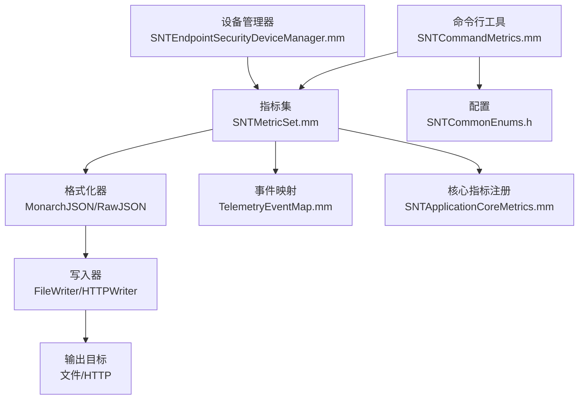
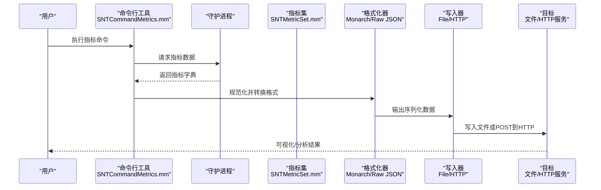
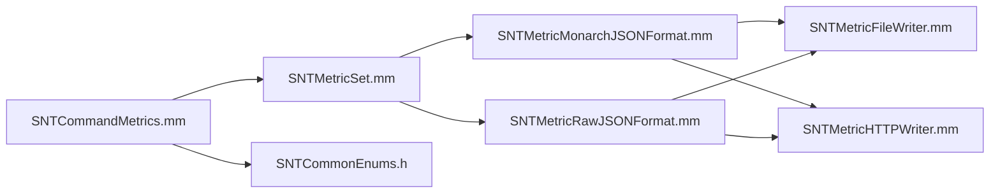

# 指标收集命令

<cite>
**本文引用的文件**
- [SNTCommandMetrics.mm](file://Source/santactl/Commands/SNTCommandMetrics.mm)
- [SNTMetricSet.mm](file://Source/common/SNTMetricSet.mm)
- [SNTMetricMonarchJSONFormat.mm](file://Source/santametricservice/Formats/SNTMetricMonarchJSONFormat.mm)
- [SNTMetricRawJSONFormat.mm](file://Source/santametricservice/Formats/SNTMetricRawJSONFormat.mm)
- [SNTMetricFileWriter.mm](file://Source/santametricservice/Writers/SNTMetricFileWriter.mm)
- [SNTMetricHTTPWriter.mm](file://Source/santametricservice/Writers/SNTMetricHTTPWriter.mm)
- [SNTCommonEnums.h](file://Source/common/SNTCommonEnums.h)
- [metrics-prettyprint.json](file://Source/santactl/Commands/testdata/metrics-prettyprint.json)
- [metrics-prettyprint.txt](file://Source/santactl/Commands/testdata/metrics-prettyprint.txt)
- [SNTMetricServiceTest.mm](file://Source/santametricservice/SNTMetricServiceTest.mm)
- [SNTApplicationCoreMetrics.mm](file://Source/santad/SNTApplicationCoreMetrics.mm)
- [SNTEndpointSecurityDeviceManager.mm](file://Source/santad/EventProviders/SNTEndpointSecurityDeviceManager.mm)
- [TelemetryEventMap.mm](file://Source/common/TelemetryEventMap.mm)
</cite>

## 目录
1. [简介](#简介)
2. [项目结构](#项目结构)
3. [核心组件](#核心组件)
4. [架构总览](#架构总览)
5. [详细组件分析](#详细组件分析)
6. [依赖关系分析](#依赖关系分析)
7. [性能考量](#性能考量)
8. [故障排查指南](#故障排查指南)
9. [结论](#结论)
10. [附录](#附录)

## 简介
本文件面向“指标收集命令”的使用者与维护者，系统性阐述指标数据的采集机制、统计维度、指标类型与计算方法、数据格式与结构、导出选项与格式选择（JSON、Monarch JSON、文本），并提供分析方法、性能监控建议、容量规划与优化实践，以及指标数据的解读与趋势分析方法。文档以仓库中的实现为依据，结合测试样例与服务端格式化器，帮助读者快速理解并正确使用指标功能。

## 项目结构
与指标相关的核心代码分布在以下模块：
- 命令行工具：用于展示与导出指标，位于 [SNTCommandMetrics.mm](file://Source/santactl/Commands/SNTCommandMetrics.mm)
- 指标集与值：通用指标模型与导出逻辑，位于 [SNTMetricSet.mm](file://Source/common/SNTMetricSet.mm)
- 指标格式化器：将指标集转换为不同输出格式，位于 [SNTMetricMonarchJSONFormat.mm](file://Source/santametricservice/Formats/SNTMetricMonarchJSONFormat.mm) 与 [SNTMetricRawJSONFormat.mm](file://Source/santametricservice/Formats/SNTMetricRawJSONFormat.mm)
- 指标写入器：文件与HTTP两种导出方式，位于 [SNTMetricFileWriter.mm](file://Source/santametricservice/Writers/SNTMetricFileWriter.mm) 与 [SNTMetricHTTPWriter.mm](file://Source/santametricservice/Writers/SNTMetricHTTPWriter.mm)
- 枚举与类型：指标格式类型等枚举定义，位于 [SNTCommonEnums.h](file://Source/common/SNTCommonEnums.h)
- 示例与测试：指标样例与测试用例，位于 [metrics-prettyprint.json](file://Source/santactl/Commands/testdata/metrics-prettyprint.json)、[metrics-prettyprint.txt](file://Source/santactl/Commands/testdata/metrics-prettyprint.txt)、[SNTMetricServiceTest.mm](file://Source/santametricservice/SNTMetricServiceTest.mm)
- 核心指标注册：进程级指标注册，位于 [SNTApplicationCoreMetrics.mm](file://Source/santad/SNTApplicationCoreMetrics.mm)
- 事件映射：事件类型到遥测事件的映射，位于 [TelemetryEventMap.mm](file://Source/common/TelemetryEventMap.mm)
- 设备管理器：网络挂载事件处理，位于 [SNTEndpointSecurityDeviceManager.mm](file://Source/santad/EventProviders/SNTEndpointSecurityDeviceManager.mm)

图表来源
- [SNTCommandMetrics.mm](file://Source/santactl/Commands/SNTCommandMetrics.mm#L112-L181)
- [SNTMetricSet.mm](file://Source/common/SNTMetricSet.mm#L274-L292)
- [SNTMetricMonarchJSONFormat.mm](file://Source/santametricservice/Formats/SNTMetricMonarchJSONFormat.mm#L205-L247)
- [SNTMetricRawJSONFormat.mm](file://Source/santametricservice/Formats/SNTMetricRawJSONFormat.mm#L80-L105)
- [SNTMetricFileWriter.mm](file://Source/santametricservice/Writers/SNTMetricFileWriter.mm#L39-L69)
- [SNTMetricHTTPWriter.mm](file://Source/santametricservice/Writers/SNTMetricHTTPWriter.mm#L54-L116)
- [SNTCommonEnums.h](file://Source/common/SNTCommonEnums.h#L169-L173)
- [TelemetryEventMap.mm](file://Source/common/TelemetryEventMap.mm#L83-L101)
- [SNTApplicationCoreMetrics.mm](file://Source/santad/SNTApplicationCoreMetrics.mm#L31-L60)
- [SNTEndpointSecurityDeviceManager.mm](file://Source/santad/EventProviders/SNTEndpointSecurityDeviceManager.mm#L410-L439)

章节来源
- [SNTCommandMetrics.mm](file://Source/santactl/Commands/SNTCommandMetrics.mm#L99-L181)
- [SNTMetricSet.mm](file://Source/common/SNTMetricSet.mm#L18-L337)
- [SNTCommonEnums.h](file://Source/common/SNTCommonEnums.h#L169-L173)

## 核心组件
- 指标集与值
  - 指标集负责聚合与导出指标，支持常量、计数器、整型/双精度/布尔/字符串仪表盘等多种类型，并记录每个值的创建与最后更新时间戳。
  - 导出时会序列化为包含指标名称、描述、类型、字段名、字段值与数据的字典结构。
- 格式化器
  - Raw JSON：直接规范化日期为ISO 8601字符串后输出完整指标字典。
  - Monarch JSON：将指标转换为Monarch期望的集合/数据集/根标签结构，按指标类型映射流类型（如GAUGE/CUMULATIVE）与值类型（INT64/BOOL/STRING/DOUBLE）。
- 写入器
  - 文件写入：逐条输出JSON对象，每条以换行分隔，便于日志收集与解析。
  - HTTP写入：按条POST到指定URL，设置TLS最小版本、超时与状态码校验。
- 命令行工具
  - 支持打印指标信息、根标签与指标明细；支持过滤与JSON输出；通过配置读取导出服务器、格式与周期。

章节来源
- [SNTMetricSet.mm](file://Source/common/SNTMetricSet.mm#L274-L292)
- [SNTMetricRawJSONFormat.mm](file://Source/santametricservice/Formats/SNTMetricRawJSONFormat.mm#L52-L105)
- [SNTMetricMonarchJSONFormat.mm](file://Source/santametricservice/Formats/SNTMetricMonarchJSONFormat.mm#L205-L247)
- [SNTMetricFileWriter.mm](file://Source/santametricservice/Writers/SNTMetricFileWriter.mm#L39-L69)
- [SNTMetricHTTPWriter.mm](file://Source/santametricservice/Writers/SNTMetricHTTPWriter.mm#L54-L116)
- [SNTCommandMetrics.mm](file://Source/santactl/Commands/SNTCommandMetrics.mm#L112-L181)

## 架构总览
指标从采集到导出的典型流程如下：
- 指标采集：由守护进程注册核心指标与事件处理过程中的计数器/仪表盘。
- 指标导出：命令行工具或服务定期从守护进程拉取指标集。
- 格式化：根据配置选择Raw JSON或Monarch JSON格式进行规范化。
- 写入：输出到本地文件或通过HTTP发送至远端服务。

图表来源
- [SNTCommandMetrics.mm](file://Source/santactl/Commands/SNTCommandMetrics.mm#L168-L179)
- [SNTMetricSet.mm](file://Source/common/SNTMetricSet.mm#L274-L292)
- [SNTMetricMonarchJSONFormat.mm](file://Source/santametricservice/Formats/SNTMetricMonarchJSONFormat.mm#L233-L247)
- [SNTMetricRawJSONFormat.mm](file://Source/santametricservice/Formats/SNTMetricRawJSONFormat.mm#L80-L105)
- [SNTMetricFileWriter.mm](file://Source/santametricservice/Writers/SNTMetricFileWriter.mm#L39-L69)
- [SNTMetricHTTPWriter.mm](file://Source/santametricservice/Writers/SNTMetricHTTPWriter.mm#L54-L116)

## 详细组件分析

### 指标类型与统计维度
- 指标类型
  - 常量：布尔、字符串、整型、双精度，用于固定元数据（如构建标签、是否使用ES框架、启动时间等）。
  - 计数器：累计事件数量，支持按字段组合进行分组计数。
  - 仪表盘：当前值，支持布尔、字符串、整型、双精度。
- 统计维度
  - 指标名称：全局唯一标识，如“/santa/events”、“/proc/cpu_usage”。
  - 描述：指标用途说明。
  - 字段：可选，用于对指标进行分组，多个字段以逗号连接形成复合键。
  - 时间戳：创建时间与最后更新时间，统一采用ISO 8601格式。
  - 数据：对应类型的数值或布尔值。
- 典型指标
  - 执行事件计数：按规则类型与客户端分组。
  - 进程内存占用：按驻留/虚拟大小分组。
  - 构建标签与运行模式：常量指标。
  - 网络挂载事件：按挂载处置类型区分。

章节来源
- [SNTMetricSet.mm](file://Source/common/SNTMetricSet.mm#L18-L337)
- [SNTMetricSet.mm](file://Source/common/SNTMetricSet.mm#L253-L292)
- [SNTCommonEnums.h](file://Source/common/SNTCommonEnums.h#L169-L173)
- [metrics-prettyprint.json](file://Source/santactl/Commands/testdata/metrics-prettyprint.json#L1-L119)
- [metrics-prettyprint.txt](file://Source/santactl/Commands/testdata/metrics-prettyprint.txt#L1-L70)

### 指标数据格式与结构
- Raw JSON格式
  - 结构：顶层包含“metrics”与“root_labels”，其中“metrics”为指标字典，“root_labels”为根标签键值对。
  - 指标项：包含“type”（指标类型枚举）、“description”（描述）、“fields”（字段分组与值数组）。
  - 字段值数组：每项包含“value”（字段值组合）、“created/last_updated”（ISO 8601时间戳）、“data”（数值或布尔）。
- Monarch JSON格式
  - 结构：包含“metricsCollection”（数组，含“metricsDataSet”与“rootLabels”）。
  - 指标项：包含“metricName”、“description”、“fieldDescriptor”（字段描述）、“data”（数据条目数组）。
  - 数据条目：包含“field”（字段键值对）、“startTimestamp/endTimestamp”（时间戳）、“valueType/streamKind”（值类型与流类型）。
- 示例参考
  - Raw JSON示例见 [metrics-prettyprint.json](file://Source/santactl/Commands/testdata/metrics-prettyprint.json#L1-L119)。
  - 文本格式示例见 [metrics-prettyprint.txt](file://Source/santactl/Commands/testdata/metrics-prettyprint.txt#L1-L70)。

章节来源
- [SNTMetricRawJSONFormat.mm](file://Source/santametricservice/Formats/SNTMetricRawJSONFormat.mm#L52-L105)
- [SNTMetricMonarchJSONFormat.mm](file://Source/santametricservice/Formats/SNTMetricMonarchJSONFormat.mm#L205-L247)
- [metrics-prettyprint.json](file://Source/santactl/Commands/testdata/metrics-prettyprint.json#L1-L119)
- [metrics-prettyprint.txt](file://Source/santactl/Commands/testdata/metrics-prettyprint.txt#L1-L70)

### 指标导出选项与格式选择
- 导出目标
  - 文件：逐条输出JSON对象，便于日志系统收集与离线分析。
  - HTTP：逐条POST到配置的URL，支持TLS 1.2及以上与超时控制。
- 格式类型
  - Raw JSON：适合通用分析与存储。
  - Monarch JSON：适配Monarch工具链的数据结构。
- 配置项
  - 指标开关、导出URL、格式类型、导出周期等由配置读取，命令行工具在未配置时会提示“未配置”。

章节来源
- [SNTMetricFileWriter.mm](file://Source/santametricservice/Writers/SNTMetricFileWriter.mm#L39-L69)
- [SNTMetricHTTPWriter.mm](file://Source/santametricservice/Writers/SNTMetricHTTPWriter.mm#L54-L116)
- [SNTCommonEnums.h](file://Source/common/SNTCommonEnums.h#L169-L173)
- [SNTCommandMetrics.mm](file://Source/santactl/Commands/SNTCommandMetrics.mm#L112-L132)

### 指标采集机制与事件类型
- 事件类型映射
  - 将底层事件类型映射为遥测事件，如执行、退出、复制、重命名、链接、取消链接、认证、登录/登出、登录窗口会话等。
- 网络挂载事件
  - 在设备管理器中识别网络挂载事件，按挂载处置类型进行处理与计数。
- 执行事件计数
  - 在执行控制器中对事件响应进行计数，支持按动作响应（允许/拒绝/保持等）分组。

章节来源
- [TelemetryEventMap.mm](file://Source/common/TelemetryEventMap.mm#L83-L101)
- [SNTEndpointSecurityDeviceManager.mm](file://Source/santad/EventProviders/SNTEndpointSecurityDeviceManager.mm#L410-L439)
- [SNTExecutionControllerTest.mm](file://Source/santad/SNTExecutionControllerTest.mm#L127-L143)

### 指标命令使用与过滤
- 命令行为
  - 从守护进程同步获取指标字典，支持过滤（前缀匹配指标名）、文本/JSON输出。
  - 当未配置导出时，打印提示信息。
- 过滤策略
  - 仅接受非以“-”开头的参数作为前缀过滤条件，匹配指标名前缀并返回子集。

章节来源
- [SNTCommandMetrics.mm](file://Source/santactl/Commands/SNTCommandMetrics.mm#L148-L179)
- [SNTCommandMetrics.mm](file://Source/santactl/Commands/SNTCommandMetrics.mm#L112-L146)

### 核心指标注册与进程资源
- 注册位置
  - 在守护进程启动阶段注册核心指标，如运行模式、CPU使用率、内存占用、启动时间等。
- 指标来源
  - 通过系统资源与配置读取，确保指标随进程生命周期变化而更新。

章节来源
- [SNTApplicationCoreMetrics.mm](file://Source/santad/SNTApplicationCoreMetrics.mm#L31-L60)

## 依赖关系分析
- 组件耦合
  - 命令行工具依赖配置读取与守护进程接口；指标集独立于格式化器与写入器，具备良好内聚性。
  - 格式化器与写入器通过统一的序列化接口对接，便于扩展新格式或输出目标。
- 外部依赖
  - HTTP写入器依赖认证会话与TLS配置；文件写入器依赖文件系统权限。
- 潜在循环
  - 指标集不依赖格式化器或写入器，避免循环依赖。

图表来源
- [SNTCommandMetrics.mm](file://Source/santactl/Commands/SNTCommandMetrics.mm#L112-L181)
- [SNTMetricSet.mm](file://Source/common/SNTMetricSet.mm#L274-L292)
- [SNTMetricMonarchJSONFormat.mm](file://Source/santametricservice/Formats/SNTMetricMonarchJSONFormat.mm#L205-L247)
- [SNTMetricRawJSONFormat.mm](file://Source/santametricservice/Formats/SNTMetricRawJSONFormat.mm#L80-L105)
- [SNTMetricFileWriter.mm](file://Source/santametricservice/Writers/SNTMetricFileWriter.mm#L39-L69)
- [SNTMetricHTTPWriter.mm](file://Source/santametricservice/Writers/SNTMetricHTTPWriter.mm#L54-L116)
- [SNTCommonEnums.h](file://Source/common/SNTCommonEnums.h#L169-L173)

## 性能考量
- 指标开销
  - 指标导出与格式化属于轻量操作，主要成本在于序列化与I/O；HTTP导出受网络与服务端响应影响。
- 资源占用
  - 指标集内部使用线程安全的值容器，计数器与仪表盘在更新时仅更新最后更新时间戳，避免频繁分配。
- 导出频率
  - 合理设置导出周期，避免过于频繁导致I/O压力；在网络写入失败时应考虑退避策略（可在上层服务中实现）。
- 事件采样
  - 对高频事件（如执行事件）建议按规则类型与客户端维度聚合，减少指标基数与序列化体积。

[本节为通用指导，无需特定文件引用]

## 故障排查指南
- 未配置导出
  - 现象：命令行提示“未配置”。
  - 排查：检查配置项（导出开关、URL、格式类型、周期）是否正确。
- HTTP写入失败
  - 现象：返回非200状态码或超时。
  - 排查：确认URL可达、TLS版本满足要求、服务端状态码与错误信息。
- 文件写入失败
  - 现象：无法打开文件或写入失败。
  - 排查：确认文件路径存在且具有写权限，文件句柄创建成功。
- 指标格式异常
  - 现象：JSON序列化失败或格式不符合预期。
  - 排查：检查日期格式化、字段值类型与格式化器映射。

章节来源
- [SNTCommandMetrics.mm](file://Source/santactl/Commands/SNTCommandMetrics.mm#L129-L132)
- [SNTMetricHTTPWriter.mm](file://Source/santametricservice/Writers/SNTMetricHTTPWriter.mm#L96-L116)
- [SNTMetricFileWriter.mm](file://Source/santametricservice/Writers/SNTMetricFileWriter.mm#L40-L53)
- [SNTMetricRawJSONFormat.mm](file://Source/santametricservice/Formats/SNTMetricRawJSONFormat.mm#L85-L95)

## 结论
指标收集命令提供了从守护进程拉取指标、按需过滤与多种格式导出的能力。通过Raw JSON与Monarch JSON两种格式，既能满足通用分析需求，也能适配特定工具链。配合合理的导出周期与事件维度聚合，可在保证可观测性的同时控制开销。建议在生产环境中结合监控平台与告警策略，持续跟踪关键指标的趋势与异常波动。

[本节为总结，无需特定文件引用]

## 附录

### 指标命令使用要点
- 使用过滤：传入非选项参数作为指标名前缀，仅显示匹配的指标。
- 输出格式：添加“--json”选项以输出原始JSON；默认输出人类可读的文本格式。
- 配置检查：若未启用导出，命令会提示未配置。

章节来源
- [SNTCommandMetrics.mm](file://Source/santactl/Commands/SNTCommandMetrics.mm#L148-L179)
- [SNTCommandMetrics.mm](file://Source/santactl/Commands/SNTCommandMetrics.mm#L112-L146)

### 指标数据解读与趋势分析方法
- 常量指标
  - 构建标签、运行模式、是否使用ES框架等，用于确认部署一致性与环境差异。
- 计数器指标
  - 执行事件按规则类型与客户端分组，观察允许/拒绝比例与热点路径，定位策略效果与异常峰值。
- 仪表盘指标
  - CPU/内存占用反映系统负载与资源瓶颈，结合事件量趋势判断是否需要扩容或优化策略。
- 趋势分析
  - 对比多周期数据，关注环比/同比变化；对异常波动进行归因（事件类型、客户端、规则类型）。

章节来源
- [metrics-prettyprint.json](file://Source/santactl/Commands/testdata/metrics-prettyprint.json#L1-L119)
- [metrics-prettyprint.txt](file://Source/santactl/Commands/testdata/metrics-prettyprint.txt#L1-L70)

### 性能监控与容量规划建议
- 监控建议
  - 关注执行事件速率、允许/拒绝比率、CPU与内存占用、网络挂载事件趋势。
  - 建立阈值告警与异常检测，结合事件类型与客户端维度定位问题。
- 容量规划
  - 基于事件量与指标基数估算I/O与网络带宽；预留缓冲空间应对突发流量。
  - 评估导出周期与格式化开销，平衡实时性与系统负载。

[本节为通用指导，无需特定文件引用]