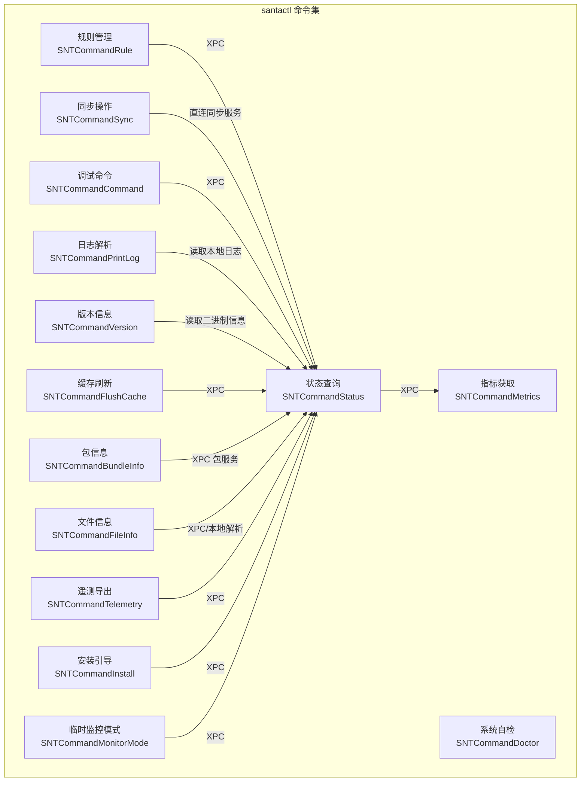
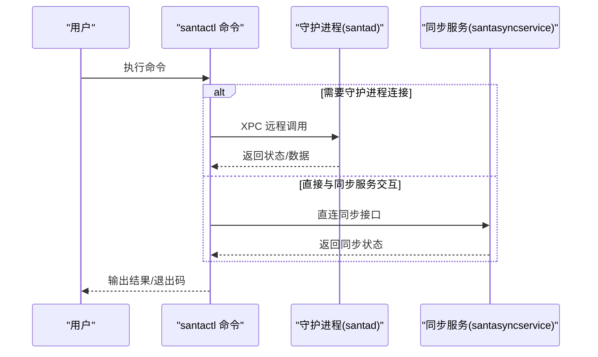
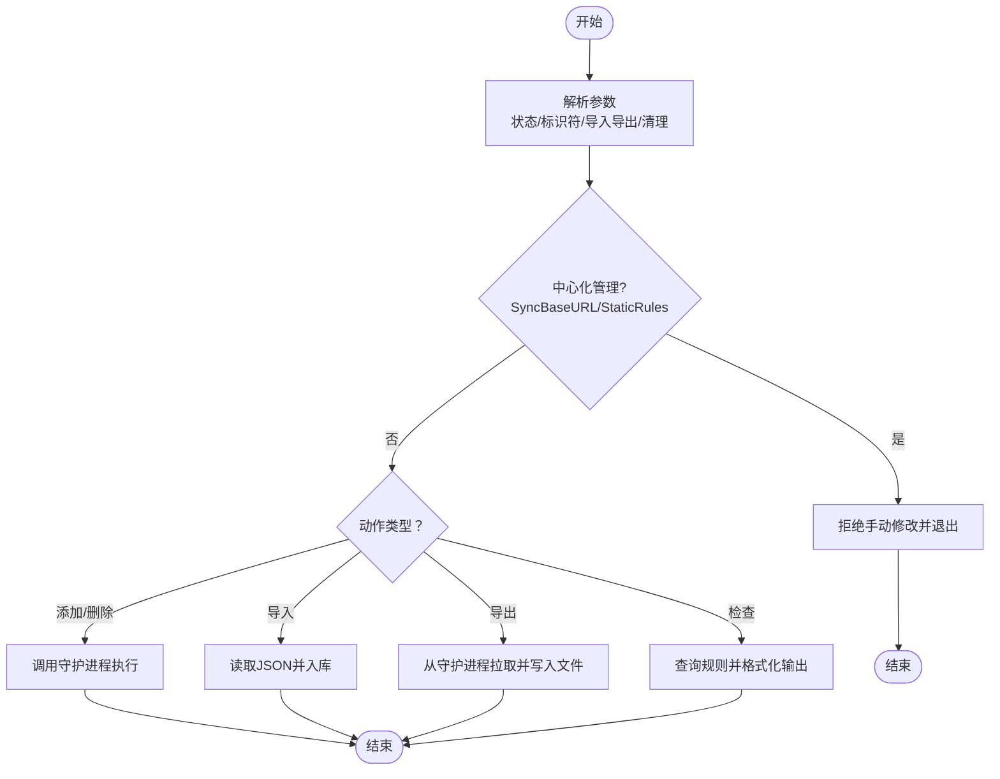
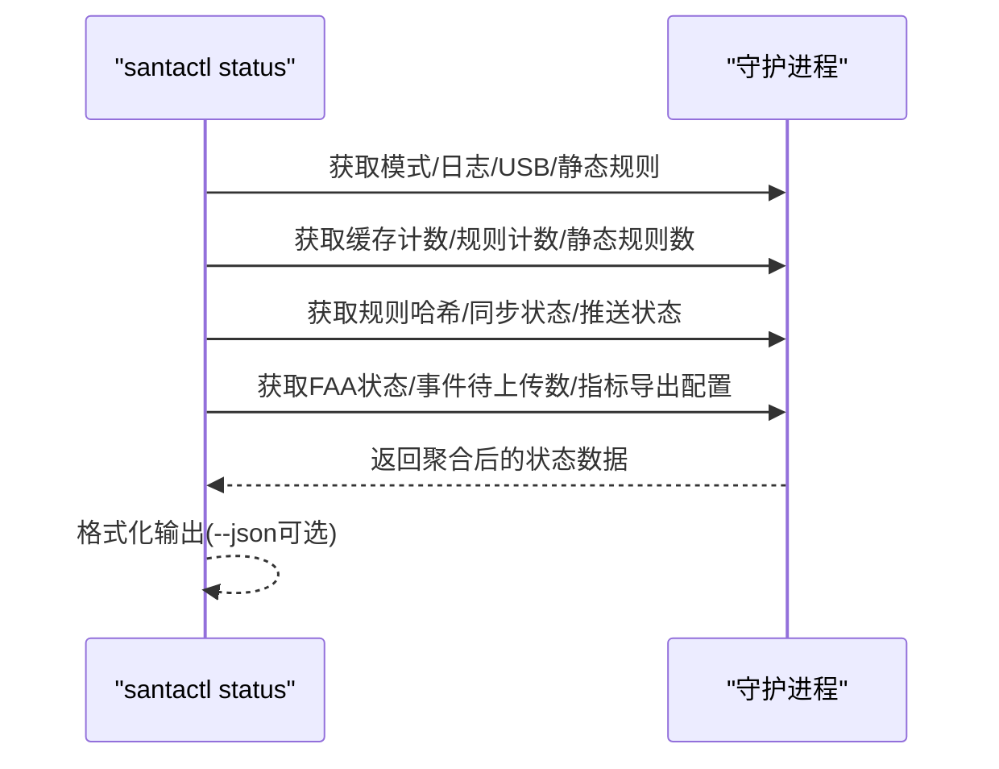
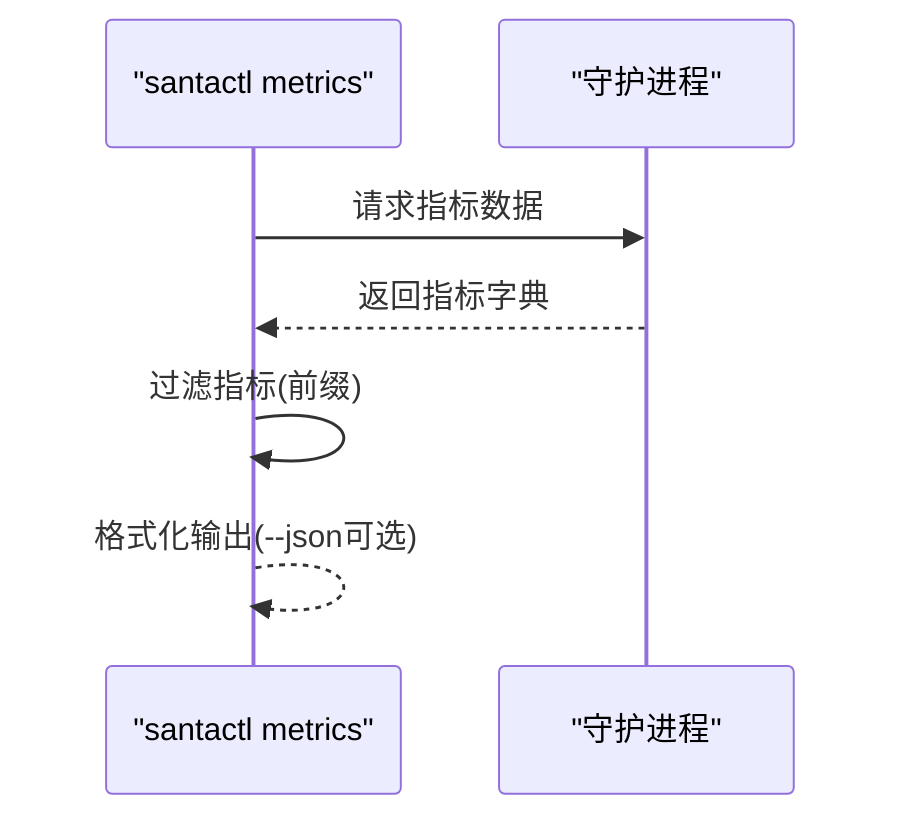
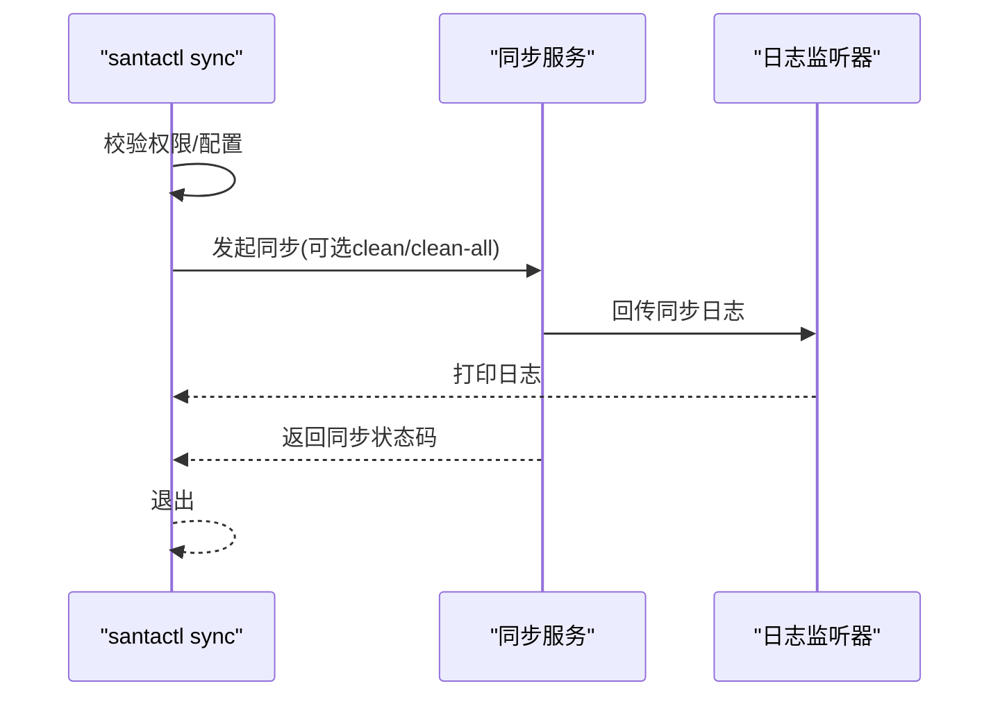
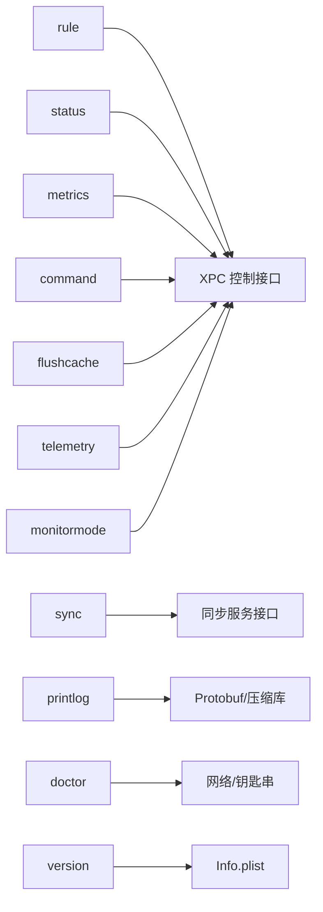

# 核心命令

<cite>
**本文引用的文件**
- [SNTCommandRule.mm](file://Source/santactl/Commands/SNTCommandRule.mm)
- [SNTCommandStatus.mm](file://Source/santactl/Commands/SNTCommandStatus.mm)
- [SNTCommandMetrics.mm](file://Source/santactl/Commands/SNTCommandMetrics.mm)
- [SNTCommandSync.mm](file://Source/santactl/Commands/SNTCommandSync.mm)
- [SNTCommandCommand.mm](file://Source/santactl/Commands/SNTCommandCommand.mm)
- [SNTCommandDoctor.mm](file://Source/santactl/Commands/SNTCommandDoctor.mm)
- [SNTCommandPrintLog.mm](file://Source/santactl/Commands/SNTCommandPrintLog.mm)
- [SNTCommandVersion.mm](file://Source/santactl/Commands/SNTCommandVersion.mm)
- [SNTCommandFlushCache.mm](file://Source/santactl/Commands/SNTCommandFlushCache.mm)
- [SNTCommandBundleInfo.mm](file://Source/santactl/Commands/SNTCommandBundleInfo.mm)
- [SNTCommandFileInfo.mm](file://Source/santactl/Commands/SNTCommandFileInfo.mm)
- [SNTCommandTelemetry.mm](file://Source/santactl/Commands/SNTCommandTelemetry.mm)
- [SNTCommandInstall.mm](file://Source/santactl/Commands/SNTCommandInstall.mm)
- [SNTCommandMonitorMode.mm](file://Source/santactl/Commands/SNTCommandMonitorMode.mm)
</cite>

## 目录
1. [简介](#简介)
2. [项目结构](#项目结构)
3. [核心组件](#核心组件)
4. [架构总览](#架构总览)
5. [详细组件分析](#详细组件分析)
6. [依赖关系分析](#依赖关系分析)
7. [性能考量](#性能考量)
8. [故障排查指南](#故障排查指南)
9. [结论](#结论)
10. [附录](#附录)

## 简介
本文件面向 Santa 的核心命令，提供全面、可操作的功能文档。内容覆盖以下方面：
- 规则管理命令：CRUD 操作、规则类型与优先级、导入/导出、清理策略
- 状态查询命令：系统状态、配置信息、健康监测、USB 扫描、事件上传等
- 指标获取命令：数据格式、统计维度、导出选项
- 同步操作命令：配置更新、状态同步、冲突处理（干净同步）
- 其他常用命令：版本、Doctor 自检、打印日志、安装、监控模式切换等

为便于不同技术背景的读者理解，文档采用“分层讲解 + 图解 + 来源标注”的方式组织。

## 项目结构
Santa 的命令入口位于 santactl 子目录中，每个命令以独立类实现，统一继承自 SNTCommand，并通过注册机制暴露名称。命令通常通过 XPC 与守护进程交互，或直接与同步服务通信。

图表来源
- [SNTCommandRule.mm](file://Source/santactl/Commands/SNTCommandRule.mm#L1-L120)
- [SNTCommandStatus.mm](file://Source/santactl/Commands/SNTCommandStatus.mm#L1-L120)
- [SNTCommandMetrics.mm](file://Source/santactl/Commands/SNTCommandMetrics.mm#L1-L60)
- [SNTCommandSync.mm](file://Source/santactl/Commands/SNTCommandSync.mm#L1-L60)

章节来源
- [SNTCommandRule.mm](file://Source/santactl/Commands/SNTCommandRule.mm#L1-L120)
- [SNTCommandStatus.mm](file://Source/santactl/Commands/SNTCommandStatus.mm#L1-L120)
- [SNTCommandMetrics.mm](file://Source/santactl/Commands/SNTCommandMetrics.mm#L1-L60)
- [SNTCommandSync.mm](file://Source/santactl/Commands/SNTCommandSync.mm#L1-L60)

## 核心组件
本节对关键命令进行功能与参数概览，帮助快速定位目标命令并理解其职责边界。

- 规则管理（rule）
  - 功能：添加/移除/检查执行规则；支持导入/导出 JSON；支持清理非传递性规则或全部规则；支持文件访问规则检查（FAA）。
  - 关键参数：--allow/--block/--silent-block/--compiler/--cel/--remove/--check/--import/--export/--clean/--clean-all/--file-access；标识符类型：--path/--identifier/--sha256/--teamid/--signingid/--certificate/--cdhash；消息与注释：--message/--comment。
  - 使用场景：集中式规则管理、离线导入导出、批量清理、基于路径自动推断标识符、FAA 规则关联查询。
  - 章节来源
    - [SNTCommandRule.mm](file://Source/santactl/Commands/SNTCommandRule.mm#L50-L123)
    - [SNTCommandRule.mm](file://Source/santactl/Commands/SNTCommandRule.mm#L125-L258)
    - [SNTCommandRule.mm](file://Source/santactl/Commands/SNTCommandRule.mm#L259-L447)

- 状态查询（status）
  - 功能：输出运行时状态、缓存计数、规则计数、静态规则数、规则哈希、同步状态、推送通知、事件待上传数、指标导出配置等；支持 --json 输出。
  - 关键参数：--json。
  - 使用场景：运维巡检、健康监测、问题定位、自动化采集。
  - 章节来源
    - [SNTCommandStatus.mm](file://Source/santactl/Commands/SNTCommandStatus.mm#L85-L178)
    - [SNTCommandStatus.mm](file://Source/santactl/Commands/SNTCommandStatus.mm#L179-L469)

- 指标获取（metrics）
  - 功能：展示运行指标、根标签、字段维度、时间戳标准化；支持按前缀过滤；支持 --json 输出。
  - 关键参数：任意前缀（用于筛选指标名）、--json。
  - 使用场景：指标采集、可视化对接、审计与合规。
  - 章节来源
    - [SNTCommandMetrics.mm](file://Source/santactl/Commands/SNTCommandMetrics.mm#L40-L80)
    - [SNTCommandMetrics.mm](file://Source/santactl/Commands/SNTCommandMetrics.mm#L112-L179)

- 同步操作（sync）
  - 功能：触发与服务器的同步；支持干净同步（清库并请求服务器全量下发）；支持调试输出。
  - 关键参数：--clean/--clean-all/--debug。
  - 使用场景：强制重置规则、恢复一致性、排障。
  - 章节来源
    - [SNTCommandSync.mm](file://Source/santactl/Commands/SNTCommandSync.mm#L59-L118)

- 版本信息（version）
  - 功能：显示 santad、santactl、SantaGUI 的版本信息；支持 --json。
  - 使用场景：环境一致性核对、升级验证。
  - 章节来源
    - [SNTCommandVersion.mm](file://Source/santactl/Commands/SNTCommandVersion.mm#L48-L99)

- Doctor 自检（doctor）
  - 功能：检查进程、配置、同步连通性；失败时返回非零退出码。
  - 使用场景：部署后快速诊断、支持工单前置检查。
  - 章节来源
    - [SNTCommandDoctor.mm](file://Source/santactl/Commands/SNTCommandDoctor.mm#L79-L126)
    - [SNTCommandDoctor.mm](file://Source/santactl/Commands/SNTCommandDoctor.mm#L145-L246)

- 打印日志（printlog）
  - 功能：将压缩/编码的日志文件解析为 JSON 列表，支持多路径输入。
  - 使用场景：离线分析、审计取证。
  - 章节来源
    - [SNTCommandPrintLog.mm](file://Source/santactl/Commands/SNTCommandPrintLog.mm#L318-L409)

- 文件信息（fileinfo）
  - 功能：输出文件签名链、规则匹配、下载元数据、Bundle 信息等；支持递归、过滤、证书索引、JSON 输出。
  - 使用场景：取证、合规检查、签名分析。
  - 章节来源
    - [SNTCommandFileInfo.mm](file://Source/santactl/Commands/SNTCommandFileInfo.mm#L171-L221)
    - [SNTCommandFileInfo.mm](file://Source/santactl/Commands/SNTCommandFileInfo.mm#L544-L589)

- 包信息（bundleinfo）
  - 功能：对 Bundle 内部二进制进行哈希与清单输出。
  - 使用场景：Bundle 审计、变更追踪。
  - 章节来源
    - [SNTCommandBundleInfo.mm](file://Source/santactl/Commands/SNTCommandBundleInfo.mm#L49-L82)

- 缓存刷新（flushcache）
  - 功能：请求守护进程刷新授权缓存（开发用途）。
  - 使用场景：开发调试、异常恢复。
  - 章节来源
    - [SNTCommandFlushCache.mm](file://Source/santactl/Commands/SNTCommandFlushCache.mm#L53-L63)

- 遥测导出（telemetry）
  - 功能：导出当前遥测数据（调试构建）。
  - 使用场景：问题复现、性能分析。
  - 章节来源
    - [SNTCommandTelemetry.mm](file://Source/santactl/Commands/SNTCommandTelemetry.mm#L51-L109)

- 安装引导（install）
  - 功能：指示守护进程安装 Santa.app（隐藏命令）。
  - 使用场景：迁移流程辅助。
  - 章节来源
    - [SNTCommandInstall.mm](file://Source/santactl/Commands/SNTCommandInstall.mm#L50-L78)

- 临时监控模式（monitormode）
  - 功能：在允许条件下申请临时 Monitor Mode 或取消临时模式。
  - 使用场景：临时放行、应急排查。
  - 章节来源
    - [SNTCommandMonitorMode.mm](file://Source/santactl/Commands/SNTCommandMonitorMode.mm#L97-L155)

## 架构总览
下图展示了命令与守护进程、同步服务之间的交互关系，以及典型工作流。

图表来源
- [SNTCommandRule.mm](file://Source/santactl/Commands/SNTCommandRule.mm#L406-L447)
- [SNTCommandStatus.mm](file://Source/santactl/Commands/SNTCommandStatus.mm#L85-L116)
- [SNTCommandSync.mm](file://Source/santactl/Commands/SNTCommandSync.mm#L71-L107)

## 详细组件分析

### 规则管理命令（rule）
- 功能要点
  - 支持多种规则状态：允许、阻止、静默阻止、编译器白名单、CEL 规则、删除、检查。
  - 支持多种标识符类型：二进制 SHA-256、证书 SHA-256、Team ID、Signing ID、CDHash；亦可通过 --path 自动推断。
  - 支持导入/导出 JSON；支持清理策略（仅非传递性或全部）。
  - 支持文件访问规则（FAA）检查。
- 参数与行为
  - 状态选择：--allow/--block/--silent-block/--compiler/--cel/--remove/--check
  - 标识符选择：--path/--identifier/--sha256/--teamid/--signingid/--certificate/--cdhash
  - 导入导出：--import/--export/--clean/--clean-all；DEBUG 下还支持 --export-file-access
  - 其他：--message/--comment/--file-access/--help
- 数据流与错误处理
  - 解析参数后，根据是否处于中心化管理模式（SyncBaseURL/StaticRules）决定是否允许手动修改。
  - 对于 --check，会查询守护进程并格式化输出；对于添加/删除，异步调用守护进程并处理返回的错误集合。
  - 导入/导出 JSON 时进行校验与转换，失败时输出错误并退出非零码。
- 实际应用场景
  - 在无中心化管理时，使用 --export 导出规则以便备份；使用 --import 清理后导入新规则。
  - 使用 --file-access 结合 --check 查询某路径关联的文件访问规则。
  - 使用 --cel 定义条件规则，结合 --message 提升可观测性。

图表来源
- [SNTCommandRule.mm](file://Source/santactl/Commands/SNTCommandRule.mm#L125-L258)
- [SNTCommandRule.mm](file://Source/santactl/Commands/SNTCommandRule.mm#L259-L447)

章节来源
- [SNTCommandRule.mm](file://Source/santactl/Commands/SNTCommandRule.mm#L50-L123)
- [SNTCommandRule.mm](file://Source/santactl/Commands/SNTCommandRule.mm#L125-L258)
- [SNTCommandRule.mm](file://Source/santactl/Commands/SNTCommandRule.mm#L259-L447)
- [SNTCommandRule.mm](file://Source/santactl/Commands/SNTCommandRule.mm#L449-L596)

### 状态查询命令（status）
- 功能要点
  - 输出客户端模式、日志类型、USB 阻断与挂载策略、启动时 USB 选项、静态规则数、看门狗 CPU/RAM 事件峰值、缓存计数、规则类型计数、FAA 规则哈希、同步状态（最后成功时间、是否需要干净同步、推送通知状态与服务器地址、事件待上传数、执行规则哈希）、指标导出配置。
  - 支持 --json 输出，便于自动化采集。
- 数据来源
  - 通过守护进程 XPC 接口一次性收集多项指标，内部使用异步回调聚合后统一输出。
- 实际应用场景
  - 运维仪表盘数据源、健康巡检脚本、问题定位（如事件堆积、推送异常）。

图表来源
- [SNTCommandStatus.mm](file://Source/santactl/Commands/SNTCommandStatus.mm#L85-L178)
- [SNTCommandStatus.mm](file://Source/santactl/Commands/SNTCommandStatus.mm#L179-L469)

章节来源
- [SNTCommandStatus.mm](file://Source/santactl/Commands/SNTCommandStatus.mm#L85-L178)
- [SNTCommandStatus.mm](file://Source/santactl/Commands/SNTCommandStatus.mm#L179-L469)

### 指标获取命令（metrics）
- 功能要点
  - 展示指标名称、描述、类型、字段、创建/更新时间、数据值；支持按前缀过滤；支持 --json 输出。
  - 将日期标准化为 ISO8601 字符串，便于下游处理。
- 实际应用场景
  - 与监控系统集成、生成报表、审计留存。

图表来源
- [SNTCommandMetrics.mm](file://Source/santactl/Commands/SNTCommandMetrics.mm#L112-L179)

章节来源
- [SNTCommandMetrics.mm](file://Source/santactl/Commands/SNTCommandMetrics.mm#L40-L80)
- [SNTCommandMetrics.mm](file://Source/santactl/Commands/SNTCommandMetrics.mm#L112-L179)

### 同步操作命令（sync）
- 功能要点
  - 与同步服务直连，发起一次同步；支持 --clean（仅非传递性规则）与 --clean-all（全部规则）两种干净同步模式；支持 --debug 输出详细日志。
- 行为说明
  - 若未配置 SyncBaseURL，直接报错退出。
  - 通过匿名监听器建立日志接收通道，将同步过程中的日志回传到终端。
  - 返回同步状态码，供上层脚本判断后续动作。
- 实际应用场景
  - 强制恢复规则一致性、在策略变更后快速生效。

图表来源
- [SNTCommandSync.mm](file://Source/santactl/Commands/SNTCommandSync.mm#L60-L107)

章节来源
- [SNTCommandSync.mm](file://Source/santactl/Commands/SNTCommandSync.mm#L59-L118)

### 调试命令（command）
- 功能要点
  - 仅在调试构建中可用；支持基于 PID、cdhash、signingid、teamid 的进程终止请求。
- 注意事项
  - 需要管理员权限；超时或错误会输出相应日志并退出非零码。
- 实际应用场景
  - 开发调试、紧急处置。

章节来源
- [SNTCommandCommand.mm](file://Source/santactl/Commands/SNTCommandCommand.mm#L63-L193)

### Doctor 自检（doctor）
- 功能要点
  - 校验进程：Santa GUI、santad、santasyncservice；校验配置有效性；校验同步连通性（HTTPS、代理、证书等），并发起预检请求。
- 实际应用场景
  - 部署后快速自检、支持工单前置。

章节来源
- [SNTCommandDoctor.mm](file://Source/santactl/Commands/SNTCommandDoctor.mm#L79-L126)
- [SNTCommandDoctor.mm](file://Source/santactl/Commands/SNTCommandDoctor.mm#L145-L246)

### 打印日志（printlog）
- 功能要点
  - 解析压缩/编码的日志文件，输出为 JSON 数组；支持多路径输入；内置大小限制与错误处理。
- 实际应用场景
  - 离线分析、审计取证。

章节来源
- [SNTCommandPrintLog.mm](file://Source/santactl/Commands/SNTCommandPrintLog.mm#L318-L409)

### 文件信息（fileinfo）
- 功能要点
  - 输出文件签名链、规则匹配、下载元数据、Bundle 信息；支持递归、过滤、证书索引、JSON 输出。
- 实际应用场景
  - 取证、合规检查、签名分析。

章节来源
- [SNTCommandFileInfo.mm](file://Source/santactl/Commands/SNTCommandFileInfo.mm#L171-L221)
- [SNTCommandFileInfo.mm](file://Source/santactl/Commands/SNTCommandFileInfo.mm#L544-L589)

### 包信息（bundleinfo）
- 功能要点
  - 对 Bundle 内部二进制进行哈希与清单输出。
- 实际应用场景
  - Bundle 审计、变更追踪。

章节来源
- [SNTCommandBundleInfo.mm](file://Source/santactl/Commands/SNTCommandBundleInfo.mm#L49-L82)

### 缓存刷新（flushcache）
- 功能要点
  - 请求守护进程刷新授权缓存（开发用途）。
- 实际应用场景
  - 开发调试、异常恢复。

章节来源
- [SNTCommandFlushCache.mm](file://Source/santactl/Commands/SNTCommandFlushCache.mm#L53-L63)

### 遥测导出（telemetry）
- 功能要点
  - 导出当前遥测数据（调试构建）。
- 实际应用场景
  - 问题复现、性能分析。

章节来源
- [SNTCommandTelemetry.mm](file://Source/santactl/Commands/SNTCommandTelemetry.mm#L51-L109)

### 安装引导（install）
- 功能要点
  - 指示守护进程安装 Santa.app（隐藏命令）。
- 实际应用场景
  - 迁移流程辅助。

章节来源
- [SNTCommandInstall.mm](file://Source/santactl/Commands/SNTCommandInstall.mm#L50-L78)

### 临时监控模式（monitormode）
- 功能要点
  - 在允许条件下申请临时 Monitor Mode 或取消临时模式。
- 实际应用场景
  - 临时放行、应急排查。

章节来源
- [SNTCommandMonitorMode.mm](file://Source/santactl/Commands/SNTCommandMonitorMode.mm#L97-L155)

## 依赖关系分析
- 组件耦合
  - 多数命令通过 XPC 与守护进程交互，耦合点集中在 SNTXPCControlInterface/SNTXPCSyncServiceInterface。
  - 同步命令直接与同步服务通信，避免对守护进程的额外依赖。
- 外部依赖
  - 日志解析依赖 Protobuf 与压缩库；Doctor 自检依赖网络栈与钥匙串交互；版本信息依赖 Info.plist。
- 潜在循环依赖
  - 命令之间无直接循环依赖；通过 XPC 形成单向调用链。

图表来源
- [SNTCommandRule.mm](file://Source/santactl/Commands/SNTCommandRule.mm#L406-L447)
- [SNTCommandStatus.mm](file://Source/santactl/Commands/SNTCommandStatus.mm#L85-L116)
- [SNTCommandMetrics.mm](file://Source/santactl/Commands/SNTCommandMetrics.mm#L168-L179)
- [SNTCommandSync.mm](file://Source/santactl/Commands/SNTCommandSync.mm#L71-L107)
- [SNTCommandPrintLog.mm](file://Source/santactl/Commands/SNTCommandPrintLog.mm#L318-L409)
- [SNTCommandDoctor.mm](file://Source/santactl/Commands/SNTCommandDoctor.mm#L145-L246)
- [SNTCommandVersion.mm](file://Source/santactl/Commands/SNTCommandVersion.mm#L48-L99)

## 性能考量
- 并发与限流
  - fileinfo 在查询规则时对守护进程请求进行了并发限制，避免大量 XPC 请求导致丢包。
- I/O 与内存
  - printlog 对压缩文件大小设置了上限，防止内存占用过高；解析采用流式读取与校验。
- 超时控制
  - 多个命令使用信号量设置超时，避免长时间阻塞。
- 建议
  - 在大规模文件扫描或规则导入时，优先使用 --json 输出并结合外部批处理工具。
  - 同步前建议先执行 doctor 自检，减少无效重试。

## 故障排查指南
- 规则管理
  - 中心化管理时禁止手动修改：若出现权限/策略冲突，请确认 SyncBaseURL 与静态规则配置。
  - 导入失败：检查 JSON 格式与字段完整性；查看返回的错误列表。
- 状态查询
  - 事件堆积：关注“事件待上传”与“执行规则哈希”变化；必要时触发同步。
  - 推送异常：检查推送状态与服务器地址；确认网络与证书配置。
- 指标获取
  - 未启用指标导出：确认配置项；使用 --json 便于自动化采集。
- 同步操作
  - Too many syncs in progress：等待后再试；检查同步服务状态。
- Doctor 自检
  - 进程缺失：确认各组件已正确安装与加载。
  - HTTPS/证书问题：修正证书链与代理配置后重试。
- 打印日志
  - 不支持的文件类型：确认文件头魔数与压缩算法；必要时先解压。
- 其他
  - flushcache/telemetry/command/install/monitormode：注意权限与超时；查看日志定位错误。

章节来源
- [SNTCommandRule.mm](file://Source/santactl/Commands/SNTCommandRule.mm#L125-L258)
- [SNTCommandStatus.mm](file://Source/santactl/Commands/SNTCommandStatus.mm#L179-L469)
- [SNTCommandMetrics.mm](file://Source/santactl/Commands/SNTCommandMetrics.mm#L112-L179)
- [SNTCommandSync.mm](file://Source/santactl/Commands/SNTCommandSync.mm#L94-L107)
- [SNTCommandDoctor.mm](file://Source/santactl/Commands/SNTCommandDoctor.mm#L145-L246)
- [SNTCommandPrintLog.mm](file://Source/santactl/Commands/SNTCommandPrintLog.mm#L318-L409)
- [SNTCommandFlushCache.mm](file://Source/santactl/Commands/SNTCommandFlushCache.mm#L53-L63)
- [SNTCommandTelemetry.mm](file://Source/santactl/Commands/SNTCommandTelemetry.mm#L86-L109)
- [SNTCommandInstall.mm](file://Source/santactl/Commands/SNTCommandInstall.mm#L50-L78)
- [SNTCommandMonitorMode.mm](file://Source/santactl/Commands/SNTCommandMonitorMode.mm#L128-L155)

## 结论
Santa 的核心命令围绕“规则治理、状态观测、指标采集、同步一致性、系统自检”五大能力展开。通过清晰的参数设计与稳健的错误处理，既能满足日常运维需求，也能支撑复杂场景下的排障与审计。建议在生产环境中结合 status 与 metrics 的周期性采集，配合 doctor 的定期巡检，确保系统稳定运行。

## 附录
- 语法参考与示例（以路径与来源代替具体代码片段）
  - 规则管理（rule）
    - 语法参考：[SNTCommandRule.mm](file://Source/santactl/Commands/SNTCommandRule.mm#L50-L123)
    - 示例用法（添加允许规则）：[SNTCommandRule.mm](file://Source/santactl/Commands/SNTCommandRule.mm#L406-L447)
    - 示例用法（检查规则）：[SNTCommandRule.mm](file://Source/santactl/Commands/SNTCommandRule.mm#L394-L404)
    - 示例用法（导入/导出）：[SNTCommandRule.mm](file://Source/santactl/Commands/SNTCommandRule.mm#L470-L524)
  - 状态查询（status）
    - 语法参考：[SNTCommandStatus.mm](file://Source/santactl/Commands/SNTCommandStatus.mm#L85-L116)
    - 示例用法（JSON 输出）：[SNTCommandStatus.mm](file://Source/santactl/Commands/SNTCommandStatus.mm#L278-L378)
  - 指标获取（metrics）
    - 语法参考：[SNTCommandMetrics.mm](file://Source/santactl/Commands/SNTCommandMetrics.mm#L40-L80)
    - 示例用法（前缀过滤 + JSON）：[SNTCommandMetrics.mm](file://Source/santactl/Commands/SNTCommandMetrics.mm#L148-L179)
  - 同步操作（sync）
    - 语法参考：[SNTCommandSync.mm](file://Source/santactl/Commands/SNTCommandSync.mm#L59-L78)
    - 示例用法（干净同步）：[SNTCommandSync.mm](file://Source/santactl/Commands/SNTCommandSync.mm#L85-L91)
  - 版本信息（version）
    - 语法参考：[SNTCommandVersion.mm](file://Source/santactl/Commands/SNTCommandVersion.mm#L48-L67)
  - Doctor 自检（doctor）
    - 语法参考：[SNTCommandDoctor.mm](file://Source/santactl/Commands/SNTCommandDoctor.mm#L79-L126)
  - 打印日志（printlog）
    - 语法参考：[SNTCommandPrintLog.mm](file://Source/santactl/Commands/SNTCommandPrintLog.mm#L318-L344)
  - 文件信息（fileinfo）
    - 语法参考：[SNTCommandFileInfo.mm](file://Source/santactl/Commands/SNTCommandFileInfo.mm#L171-L221)
  - 包信息（bundleinfo）
    - 语法参考：[SNTCommandBundleInfo.mm](file://Source/santactl/Commands/SNTCommandBundleInfo.mm#L49-L82)
  - 缓存刷新（flushcache）
    - 语法参考：[SNTCommandFlushCache.mm](file://Source/santactl/Commands/SNTCommandFlushCache.mm#L53-L63)
  - 遥测导出（telemetry）
    - 语法参考：[SNTCommandTelemetry.mm](file://Source/santactl/Commands/SNTCommandTelemetry.mm#L51-L84)
  - 安装引导（install）
    - 语法参考：[SNTCommandInstall.mm](file://Source/santactl/Commands/SNTCommandInstall.mm#L50-L78)
  - 临时监控模式（monitormode）
    - 语法参考：[SNTCommandMonitorMode.mm](file://Source/santactl/Commands/SNTCommandMonitorMode.mm#L97-L155)