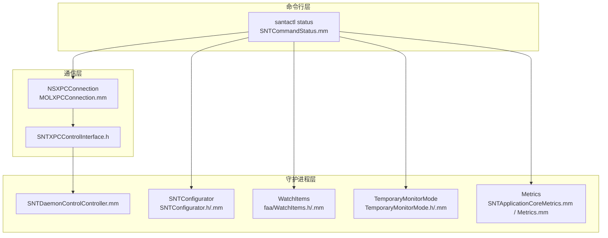
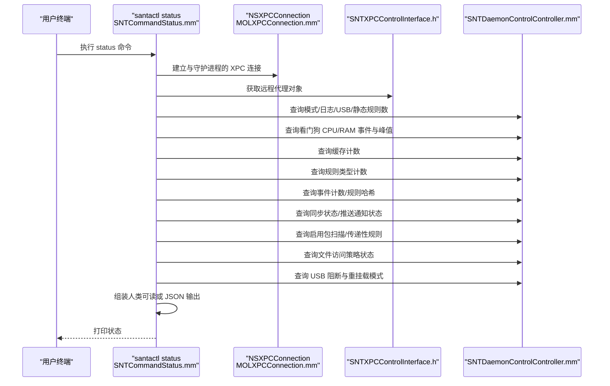
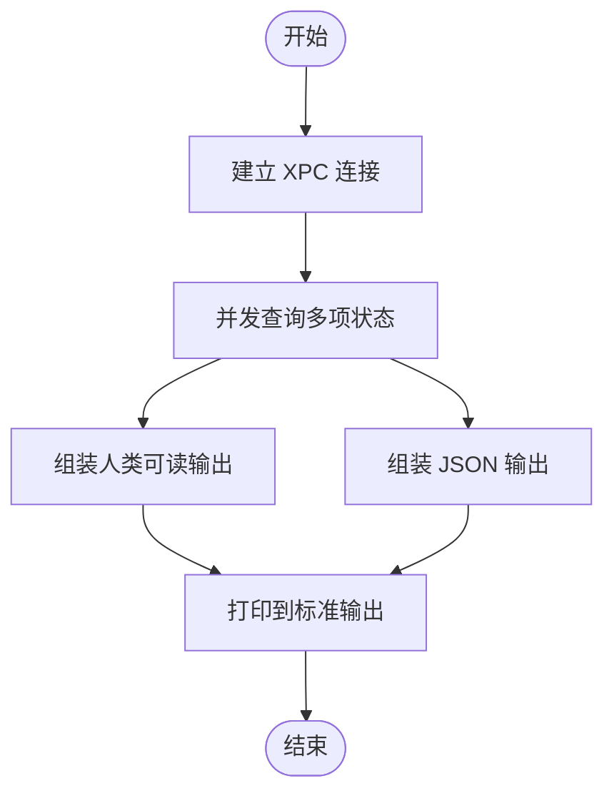
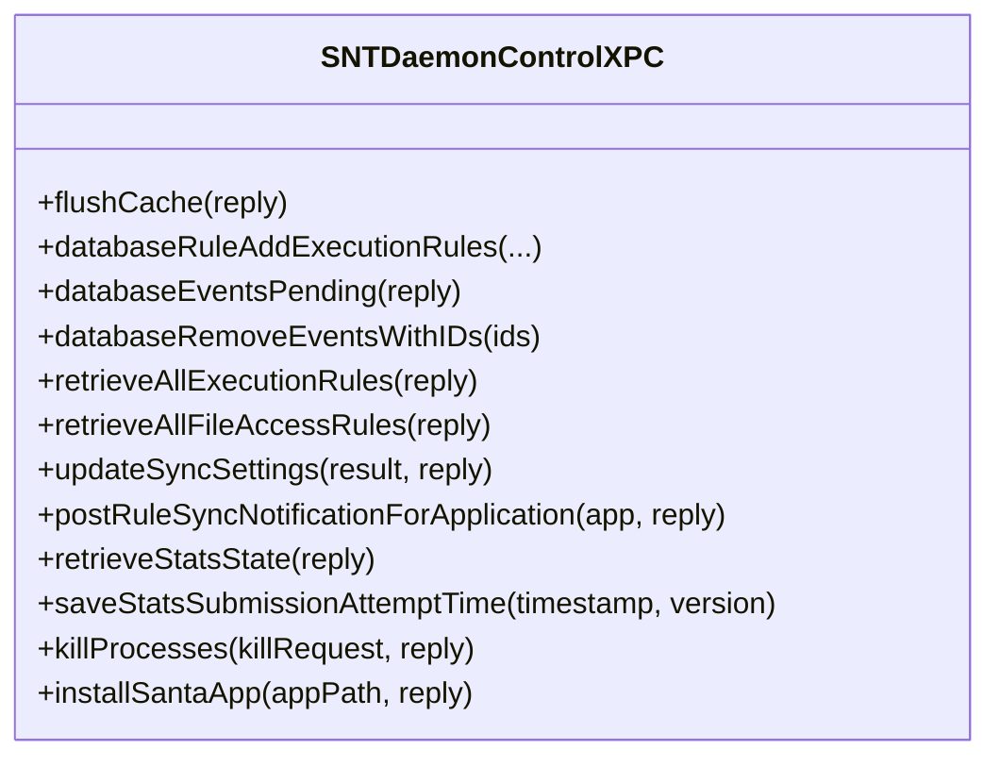
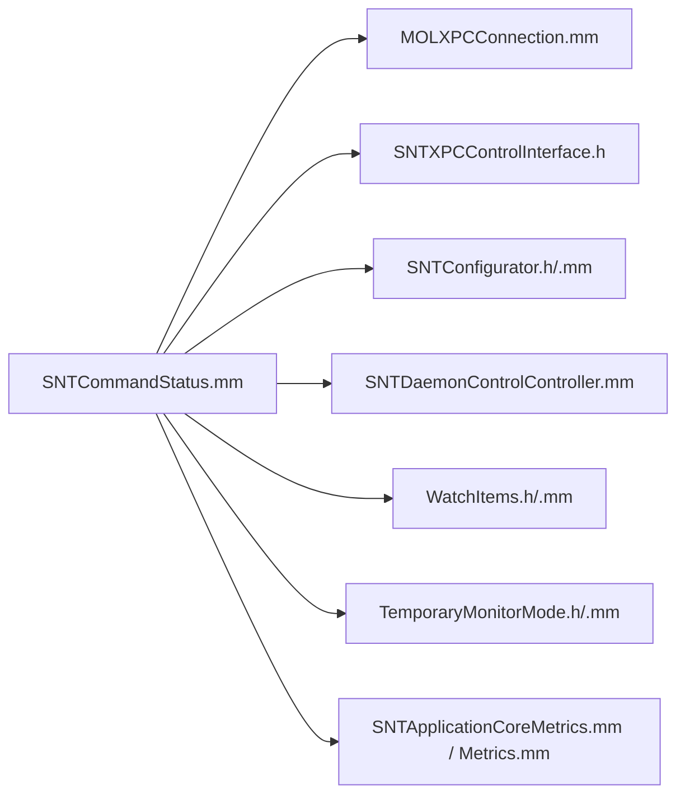

# 状态检查命令

<cite>
**本文引用的文件**
- [Source/santactl/Commands/SNTCommandStatus.mm](file://Source/santactl/Commands/SNTCommandStatus.mm)
- [Source/common/SNTXPCControlInterface.h](file://Source/common/SNTXPCControlInterface.h)
- [Source/common/MOLXPCConnection.mm](file://Source/common/MOLXPCConnection.mm)
- [Source/santad/SNTDaemonControlController.mm](file://Source/santad/SNTDaemonControlController.mm)
- [Source/common/SNTConfigurator.h](file://Source/common/SNTConfigurator.h)
- [Source/common/SNTConfigurator.mm](file://Source/common/SNTConfigurator.mm)
- [Source/common/faa/WatchItems.h](file://Source/common/faa/WatchItems.h)
- [Source/common/faa/WatchItems.mm](file://Source/common/faa/WatchItems.mm)
- [Source/santactl/Commands/SNTCommandDoctor.mm](file://Source/santactl/Commands/SNTCommandDoctor.mm)
- [Source/santad/TemporaryMonitorMode.mm](file://Source/santad/TemporaryMonitorMode.mm)
- [Source/santad/TemporaryMonitorMode.h](file://Source/santad/TemporaryMonitorMode.h)
- [Source/santad/SNTApplicationCoreMetrics.mm](file://Source/santad/SNTApplicationCoreMetrics.mm)
- [Source/santad/Metrics.mm](file://Source/santad/Metrics.mm)
</cite>

## 目录
1. [简介](#简介)
2. [项目结构](#项目结构)
3. [核心组件](#核心组件)
4. [架构总览](#架构总览)
5. [详细组件分析](#详细组件分析)
6. [依赖关系分析](#依赖关系分析)
7. [性能考量](#性能考量)
8. [故障排除指南](#故障排除指南)
9. [结论](#结论)
10. [附录](#附录)

## 简介
本文件面向系统管理员与运维工程师，提供 Santa 状态检查命令的完整使用文档。内容涵盖：
- 如何通过状态命令获取守护进程模式、配置信息、数据库规则与事件统计、系统扩展状态等。
- 输出格式说明（人类可读与 JSON）及字段含义。
- 健康检查与状态解读指南。
- 常见异常的诊断方法与解决方案。
- 状态检查在故障排除与系统维护中的作用。

## 项目结构
状态检查相关能力由以下模块协同完成：
- 命令行工具：santactl 的 status 子命令负责收集并展示状态。
- 守护进程接口：通过 XPC 协议从 santad 获取实时状态。
- 配置管理：SNTConfigurator 提供运行时配置与策略参数。
- 数据库与规则：SNTDaemonControlController 暴露规则计数、哈希与事件统计。
- 文件访问策略（FAA）：WatchItems 提供文件访问监控策略来源与状态。
- 临时监控模式：支持临时切换到 Monitor 模式并显示剩余时间。
- 指标导出：Metrics 与 SNTApplicationCoreMetrics 支持运行指标采集与上报。

图表来源
- [Source/santactl/Commands/SNTCommandStatus.mm](file://Source/santactl/Commands/SNTCommandStatus.mm#L85-L120)
- [Source/common/MOLXPCConnection.mm](file://Source/common/MOLXPCConnection.mm#L84-L119)
- [Source/common/SNTXPCControlInterface.h](file://Source/common/SNTXPCControlInterface.h#L25-L103)
- [Source/santad/SNTDaemonControlController.mm](file://Source/santad/SNTDaemonControlController.mm#L122-L157)
- [Source/common/SNTConfigurator.h](file://Source/common/SNTConfigurator.h#L31-L200)
- [Source/common/faa/WatchItems.h](file://Source/common/faa/WatchItems.h#L168-L200)
- [Source/santad/TemporaryMonitorMode.h](file://Source/santad/TemporaryMonitorMode.h#L35-L65)
- [Source/santad/SNTApplicationCoreMetrics.mm](file://Source/santad/SNTApplicationCoreMetrics.mm#L36-L58)
- [Source/santad/Metrics.mm](file://Source/santad/Metrics.mm#L446-L479)

章节来源
- [Source/santactl/Commands/SNTCommandStatus.mm](file://Source/santactl/Commands/SNTCommandStatus.mm#L85-L120)
- [Source/common/MOLXPCConnection.mm](file://Source/common/MOLXPCConnection.mm#L84-L119)
- [Source/common/SNTXPCControlInterface.h](file://Source/common/SNTXPCControlInterface.h#L25-L103)

## 核心组件
- 状态命令（santactl status）
  - 负责连接守护进程、收集运行时状态、格式化输出（人类可读或 JSON）。
  - 关键行为：获取模式、日志类型、USB 阻断、静态规则数、看门狗 CPU/RAM 事件峰值、缓存计数、规则类型计数、同步状态、推送通知状态、事件待上传数、规则哈希、文件访问策略状态、指标导出配置等。
- 守护进程控制接口（SNTDaemonControlXPC）
  - 提供数据库规则计数、规则哈希、缓存计数、事件计数、看门狗信息、推送通知状态、启用包扫描、启用传递性规则、USB 阻断与重挂载模式、文件访问策略状态等查询。
- 配置器（SNTConfigurator）
  - 提供运行时配置项：客户端模式、事件日志类型、指标导出开关与目标、全量同步间隔、推送通知全量同步间隔、USB 启动选项、是否启用文件变更日志等。
- 文件访问策略（WatchItems）
  - 提供文件访问策略的数据来源（嵌入配置/数据库/分离配置）、策略版本、规则数量、最后更新时间、配置路径等。
- 临时监控模式（TemporaryMonitorMode）
  - 提供临时 Monitor 模式的剩余时间与状态判断，用于状态输出中模式的动态展示。
- 指标导出（Metrics / SNTApplicationCoreMetrics）
  - 提供运行指标采集与导出配置，状态命令会展示指标导出是否启用、服务器地址与导出周期。

章节来源
- [Source/santactl/Commands/SNTCommandStatus.mm](file://Source/santactl/Commands/SNTCommandStatus.mm#L85-L120)
- [Source/common/SNTXPCControlInterface.h](file://Source/common/SNTXPCControlInterface.h#L25-L103)
- [Source/santad/SNTDaemonControlController.mm](file://Source/santad/SNTDaemonControlController.mm#L122-L157)
- [Source/common/SNTConfigurator.h](file://Source/common/SNTConfigurator.h#L31-L200)
- [Source/common/faa/WatchItems.h](file://Source/common/faa/WatchItems.h#L168-L200)
- [Source/santad/TemporaryMonitorMode.h](file://Source/santad/TemporaryMonitorMode.h#L35-L65)
- [Source/santad/SNTApplicationCoreMetrics.mm](file://Source/santad/SNTApplicationCoreMetrics.mm#L36-L58)
- [Source/santad/Metrics.mm](file://Source/santad/Metrics.mm#L446-L479)

## 架构总览
状态命令的调用链路如下：

图表来源
- [Source/santactl/Commands/SNTCommandStatus.mm](file://Source/santactl/Commands/SNTCommandStatus.mm#L85-L120)
- [Source/common/MOLXPCConnection.mm](file://Source/common/MOLXPCConnection.mm#L84-L119)
- [Source/common/SNTXPCControlInterface.h](file://Source/common/SNTXPCControlInterface.h#L25-L103)
- [Source/santad/SNTDaemonControlController.mm](file://Source/santad/SNTDaemonControlController.mm#L122-L157)

## 详细组件分析

### 状态命令（santactl status）工作流
- 连接守护进程：通过已配置的 XPC 接口获取远程代理对象。
- 并发查询：对模式、看门狗、缓存、规则计数、事件计数、规则哈希、同步状态、推送通知、文件访问策略、USB 阻断等进行异步查询，避免阻塞。
- 格式化输出：
  - 人类可读：分节打印各模块信息。
  - JSON：以结构化字典形式输出，便于自动化消费。

图表来源
- [Source/santactl/Commands/SNTCommandStatus.mm](file://Source/santactl/Commands/SNTCommandStatus.mm#L85-L120)
- [Source/santactl/Commands/SNTCommandStatus.mm](file://Source/santactl/Commands/SNTCommandStatus.mm#L278-L466)

章节来源
- [Source/santactl/Commands/SNTCommandStatus.mm](file://Source/santactl/Commands/SNTCommandStatus.mm#L85-L120)
- [Source/santactl/Commands/SNTCommandStatus.mm](file://Source/santactl/Commands/SNTCommandStatus.mm#L278-L466)

### 守护进程控制接口（SNTDaemonControlXPC）
- 数据库操作：规则计数、规则哈希、事件计数、执行/文件访问规则查询。
- 配置与状态：看门狗信息、USB 阻断、重挂载模式、启用包扫描、启用传递性规则、文件访问策略状态。
- 同步与推送：全量/规则同步最近成功时间、清理需求、推送通知状态与服务器地址。

图表来源
- [Source/common/SNTXPCControlInterface.h](file://Source/common/SNTXPCControlInterface.h#L25-L103)

章节来源
- [Source/common/SNTXPCControlInterface.h](file://Source/common/SNTXPCControlInterface.h#L25-L103)

### 配置器（SNTConfigurator）
- 提供运行时配置项，如：
  - 客户端模式（Monitor/Lockdown/Standalone/临时 Monitor）。
  - 事件日志类型（syslog/file/protobuf 等）。
  - 指标导出开关、目标地址、导出周期。
  - 全量同步与推送通知全量同步间隔。
  - USB 启动选项、文件变更日志开关等。

章节来源
- [Source/common/SNTConfigurator.h](file://Source/common/SNTConfigurator.h#L31-L200)
- [Source/common/SNTConfigurator.mm](file://Source/common/SNTConfigurator.mm#L90-L120)

### 文件访问策略（WatchItems）
- 数据来源：嵌入配置、数据库、分离配置。
- 状态字段：启用标志、数据来源名称、规则数量、策略版本、最后更新时间、配置路径（当为分离配置时）。

章节来源
- [Source/common/faa/WatchItems.h](file://Source/common/faa/WatchItems.h#L168-L200)
- [Source/common/faa/WatchItems.mm](file://Source/common/faa/WatchItems.mm#L952-L999)

### 临时监控模式（TemporaryMonitorMode）
- 功能：在允许的前提下请求临时 Monitor 模式，记录剩余时间；到期自动结束并生成审计事件。
- 状态命令会根据剩余秒数动态显示“临时 Monitor 模式（剩余…）”。

章节来源
- [Source/santad/TemporaryMonitorMode.h](file://Source/santad/TemporaryMonitorMode.h#L35-L65)
- [Source/santad/TemporaryMonitorMode.mm](file://Source/santad/TemporaryMonitorMode.mm#L30-L55)

### 指标导出（Metrics / SNTApplicationCoreMetrics）
- 指标采集：事件计数、速率限制、文件访问事件等。
- 模式与日志类型指标：注册回调以报告当前模式与日志类型。
- 状态命令会展示指标导出是否启用、服务器地址与导出周期。

章节来源
- [Source/santad/SNTApplicationCoreMetrics.mm](file://Source/santad/SNTApplicationCoreMetrics.mm#L36-L58)
- [Source/santad/Metrics.mm](file://Source/santad/Metrics.mm#L446-L479)

## 依赖关系分析
- 命令层依赖通信层（XPC）与配置层（SNTConfigurator），并通过守护进程控制器（SNTDaemonControlController）获取实时状态。
- 文件访问策略（WatchItems）与临时监控模式（TemporaryMonitorMode）作为状态补充信息被状态命令整合。
- 指标导出（Metrics / SNTApplicationCoreMetrics）为运行时健康度提供量化参考。

图表来源
- [Source/santactl/Commands/SNTCommandStatus.mm](file://Source/santactl/Commands/SNTCommandStatus.mm#L85-L120)
- [Source/common/MOLXPCConnection.mm](file://Source/common/MOLXPCConnection.mm#L84-L119)
- [Source/common/SNTXPCControlInterface.h](file://Source/common/SNTXPCControlInterface.h#L25-L103)
- [Source/common/SNTConfigurator.h](file://Source/common/SNTConfigurator.h#L31-L200)
- [Source/santad/SNTDaemonControlController.mm](file://Source/santad/SNTDaemonControlController.mm#L122-L157)
- [Source/common/faa/WatchItems.h](file://Source/common/faa/WatchItems.h#L168-L200)
- [Source/santad/TemporaryMonitorMode.h](file://Source/santad/TemporaryMonitorMode.h#L35-L65)
- [Source/santad/SNTApplicationCoreMetrics.mm](file://Source/santad/SNTApplicationCoreMetrics.mm#L36-L58)
- [Source/santad/Metrics.mm](file://Source/santad/Metrics.mm#L446-L479)

## 性能考量
- 异步查询：状态命令对多个状态项采用并发查询，减少等待时间，提升用户体验。
- 超时保护：在查询推送通知状态时设置超时，避免长时间阻塞。
- 轻量输出：默认人类可读输出，仅在需要自动化集成时使用 JSON。

章节来源
- [Source/santactl/Commands/SNTCommandStatus.mm](file://Source/santactl/Commands/SNTCommandStatus.mm#L186-L215)
- [Source/santactl/Commands/SNTCommandStatus.mm](file://Source/santactl/Commands/SNTCommandStatus.mm#L278-L466)

## 故障排除指南
- 使用 doctor 命令进行系统级健康检查：
  - 进程验证：确认 Santa GUI、santad、santasyncservice 是否运行。
  - 配置验证：调用配置器的校验逻辑，输出配置错误列表。
  - 同步验证：若启用同步，通过预检接口测试 HTTPS、证书与代理配置，返回 HTTP 状态码与重定向信息。
- 常见问题定位：
  - 同步失败：doctor 会输出 HTTP 状态码或重定向提示，检查证书、代理与主机名。
  - 缺少守护进程连接：确认 XPC 服务可用，必要时重启相关服务。
  - 规则不一致：对比状态命令中的规则哈希与预期，必要时触发清理同步。
  - 指标未上报：检查指标导出开关、目标地址与导出周期。
- 临时监控模式：
  - 若处于临时 Monitor 模式，状态命令会显示剩余时间；到期后自动回到 Lockdown 或原模式。

章节来源
- [Source/santactl/Commands/SNTCommandDoctor.mm](file://Source/santactl/Commands/SNTCommandDoctor.mm#L87-L126)
- [Source/santactl/Commands/SNTCommandDoctor.mm](file://Source/santactl/Commands/SNTCommandDoctor.mm#L145-L246)
- [Source/santactl/Commands/SNTCommandStatus.mm](file://Source/santactl/Commands/SNTCommandStatus.mm#L379-L466)
- [Source/santad/TemporaryMonitorMode.mm](file://Source/santad/TemporaryMonitorMode.mm#L278-L312)

## 结论
状态检查命令提供了对 Santa 守护进程运行状态的全面视图，覆盖模式、配置、数据库、同步、策略与指标等多个维度。通过人类可读与 JSON 双格式输出，既满足人工巡检也便于自动化集成。结合 doctor 命令与规则哈希比对，可快速定位配置、同步与策略异常，提升系统稳定性与可维护性。

## 附录

### 输出字段说明（人类可读）
- 守护进程信息
  - 模式：Monitor/Lockdown/Standalone 或“临时 Monitor 模式（剩余…）”
  - 日志类型：syslog/file/null/protobuf/protobufstream
  - 文件日志：是/否
  - USB 阻断：是/否；若启用，可能显示重挂载模式
  - 启动 USB 选项：Unmount/ForceUnmount/Remount/ForceRemount/None
  - 静态规则数：整数
  - 看门狗 CPU 事件与峰值：整数与百分比
  - 看门狗 RAM 事件与峰值：整数与 MB
- 缓存信息
  - Root 缓存计数：整数
  - Non-root 缓存计数：整数
- 传递性白名单
  - 启用：是/否
  - 编译器规则数：整数
  - 传递性规则数：整数
- 规则类型
  - 二进制规则数：整数
  - 证书规则数：整数
  - TeamID 规则数：整数
  - SigningID 规则数：整数
  - CDHash 规则数：整数
- 文件访问策略（Watch Items）
  - 启用：是/否；若启用，显示数据来源、规则数量、策略版本、最后更新时间、配置路径（分离配置时）
- 同步
  - 启用：是/否
  - 同步服务器：URL
  - 清理同步需求：是/否
  - 最近一次全量同步：日期时间
  - 最近一次规则同步：日期时间
  - 全量同步间隔：时长（含推送通知场景下的不同间隔）
  - 推送通知：Disabled/Disconnected/FCM/NPS Push Service（含服务器地址）
  - 包扫描：是/否
  - 待上传事件数：整数
  - 执行规则哈希：字符串
  - 文件访问规则哈希：字符串（数据库来源时）
- 指标
  - 启用：是/否
  - 指标服务器：URL
  - 导出周期（秒）：整数

章节来源
- [Source/santactl/Commands/SNTCommandStatus.mm](file://Source/santactl/Commands/SNTCommandStatus.mm#L379-L466)

### 输出字段说明（JSON）
- 结构概览
  - daemon：守护进程信息
  - cache：缓存计数
  - transitive_allowlisting：传递性白名单启用与规则数
  - rule_types：各类规则计数
  - watch_items：文件访问策略状态（启用、数据来源、规则数、最后策略更新、策略版本、配置路径）
  - sync：同步状态（启用、服务器、清理需求、最近成功全量/规则同步、推送通知状态与服务器、包扫描、待上传事件数、执行规则哈希、全量同步间隔、推送通知全量同步间隔、文件访问规则哈希）
  - metrics：指标导出（启用、服务器、导出周期）

章节来源
- [Source/santactl/Commands/SNTCommandStatus.mm](file://Source/santactl/Commands/SNTCommandStatus.mm#L278-L377)