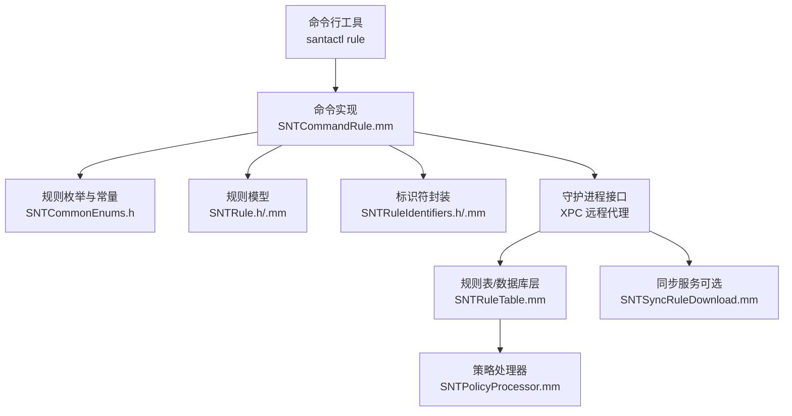
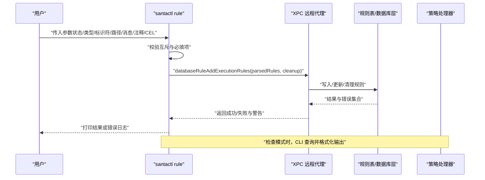
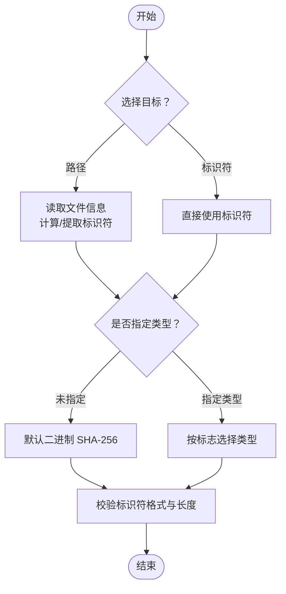
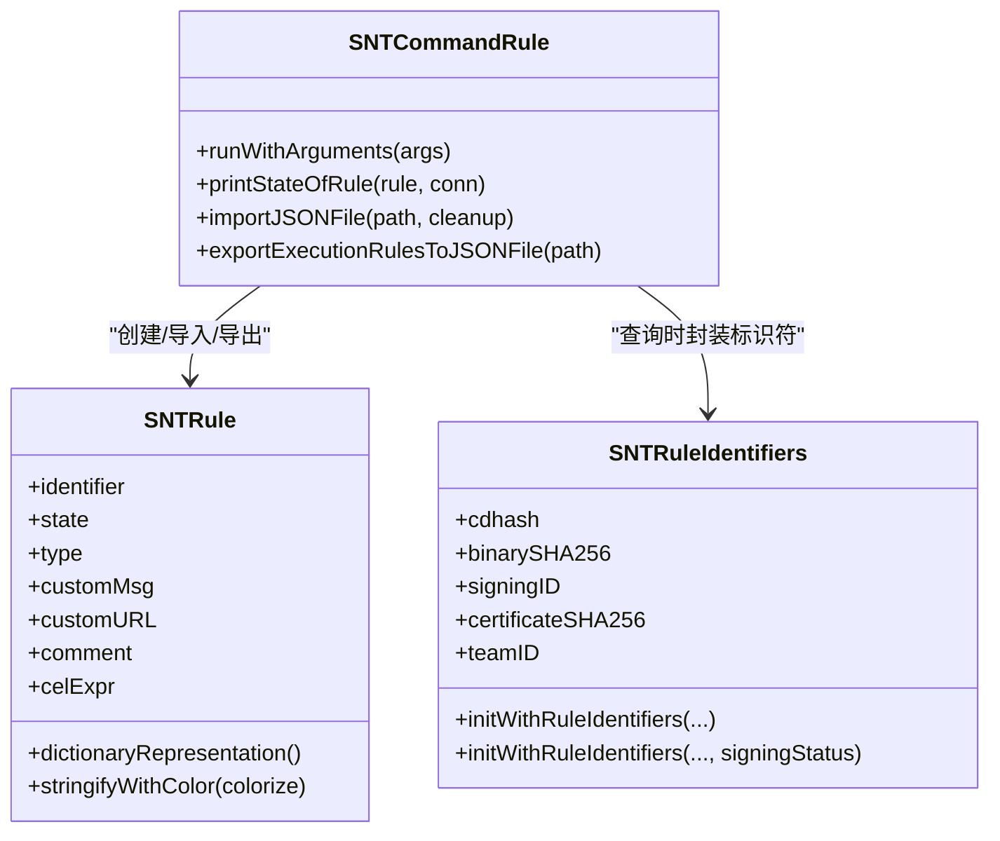
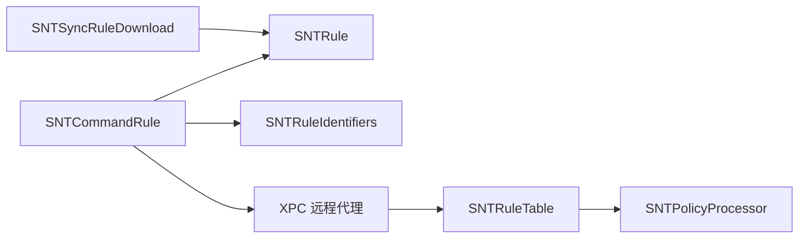

# 规则管理命令

<cite>
**本文引用的文件**
- [SNTCommandRule.mm](file://Source/santactl/Commands/SNTCommandRule.mm)
- [SNTRule.h](file://Source/common/SNTRule.h)
- [SNTRule.mm](file://Source/common/SNTRule.mm)
- [SNTCommonEnums.h](file://Source/common/SNTCommonEnums.h)
- [SNTRuleIdentifiers.h](file://Source/common/SNTRuleIdentifiers.h)
- [SNTRuleIdentifiers.mm](file://Source/common/SNTRuleIdentifiers.mm)
- [SNTRuleTable.mm](file://Source/santad/DataLayer/SNTRuleTable.mm)
- [SNTPolicyProcessor.mm](file://Source/santad/SNTPolicyProcessor.mm)
- [SNTSyncRuleDownload.mm](file://Source/santasyncservice/SNTSyncRuleDownload.mm)
- [SNTSyncConstants.h](file://Source/common/SNTSyncConstants.h)
- [cel.mdx](file://docs/docs/cookbook/cel.mdx)
- [binary-authorization.md](file://docs/docs/features/binary-authorization.md)
- [sync_ruledownload_with_cel_1.json](file://Source/santasyncservice/testdata/sync_ruledownload_with_cel_1.json)
</cite>

## 目录
1. [简介](#简介)
2. [项目结构](#项目结构)
3. [核心组件](#核心组件)
4. [架构总览](#架构总览)
5. [详细组件分析](#详细组件分析)
6. [依赖关系分析](#依赖关系分析)
7. [性能考量](#性能考量)
8. [故障排查指南](#故障排查指南)
9. [结论](#结论)
10. [附录](#附录)

## 简介
本文件面向 Santa 的规则管理命令（santactl rule），提供从入门到进阶的完整使用文档。内容涵盖：
- 规则添加、删除、检查、导入、导出的完整流程与注意事项
- 各类规则类型（允许、阻止、静默阻止、编译器、CEL 规则）的语义与适用场景
- 标识符类型（SHA-256、团队ID、签名ID、证书SHA-256、CDHash）的差异与选择建议
- 参数选项详解（--allow、--block、--silent-block、--compiler、--cel 等）
- 路径规则与标识符规则的创建方式，以及自定义消息与注释的添加
- JSON 导入/导出格式说明与示例
- 清理功能（--clean、--clean-all）的作用与使用场景

## 项目结构
规则管理命令位于用户态工具层（santactl），通过 XPC 与守护进程交互，最终由守护进程的数据层落库并参与决策。

图表来源
- [SNTCommandRule.mm](file://Source/santactl/Commands/SNTCommandRule.mm#L125-L597)
- [SNTCommonEnums.h](file://Source/common/SNTCommonEnums.h#L50-L120)
- [SNTRule.h](file://Source/common/SNTRule.h#L1-L129)
- [SNTRuleIdentifiers.h](file://Source/common/SNTRuleIdentifiers.h#L39-L61)
- [SNTRuleTable.mm](file://Source/santad/DataLayer/SNTRuleTable.mm#L821-L852)
- [SNTPolicyProcessor.mm](file://Source/santad/SNTPolicyProcessor.mm#L200-L218)
- [SNTSyncRuleDownload.mm](file://Source/santasyncservice/SNTSyncRuleDownload.mm#L322-L347)

章节来源
- [SNTCommandRule.mm](file://Source/santactl/Commands/SNTCommandRule.mm#L125-L597)

## 核心组件
- 命令实现：解析参数、构造规则对象、调用守护进程执行增删改查与导入导出
- 规则模型：统一承载标识符、状态、类型、自定义消息/URL、注释、CEL 表达式等
- 枚举与常量：规则类型、规则状态、策略事件映射、同步字段键名
- 标识符封装：将多种标识符组合为查询/匹配所需的结构体
- 数据层：持久化与查询规则，支持静态规则与动态规则
- 决策处理器：根据规则类型与状态生成事件决策码
- 同步服务：从远端下载规则并转换为本地规则对象

章节来源
- [SNTCommandRule.mm](file://Source/santactl/Commands/SNTCommandRule.mm#L125-L597)
- [SNTRule.h](file://Source/common/SNTRule.h#L1-L129)
- [SNTRule.mm](file://Source/common/SNTRule.mm#L1-L200)
- [SNTCommonEnums.h](file://Source/common/SNTCommonEnums.h#L50-L120)
- [SNTRuleIdentifiers.h](file://Source/common/SNTRuleIdentifiers.h#L39-L61)
- [SNTRuleTable.mm](file://Source/santad/DataLayer/SNTRuleTable.mm#L821-L852)
- [SNTPolicyProcessor.mm](file://Source/santad/SNTPolicyProcessor.mm#L200-L218)
- [SNTSyncRuleDownload.mm](file://Source/santasyncservice/SNTSyncRuleDownload.mm#L322-L347)

## 架构总览
下图展示从命令行到守护进程再到数据库与决策处理的整体流程。

图表来源
- [SNTCommandRule.mm](file://Source/santactl/Commands/SNTCommandRule.mm#L260-L313)
- [SNTCommandRule.mm](file://Source/santactl/Commands/SNTCommandRule.mm#L406-L447)
- [SNTCommandRule.mm](file://Source/santactl/Commands/SNTCommandRule.mm#L449-L468)
- [SNTRuleTable.mm](file://Source/santad/DataLayer/SNTRuleTable.mm#L821-L852)
- [SNTPolicyProcessor.mm](file://Source/santad/SNTPolicyProcessor.mm#L200-L218)

## 详细组件分析

### 命令行参数与行为
- 必需条件：当配置了同步基地址或存在静态规则时，非检查模式默认禁止手动修改，除非使用调试构建的强制开关
- 状态标志（二选一或多选其一）：
  - --allow：允许
  - --block：阻止
  - --silent-block：静默阻止
  - --compiler：允许并标记为编译器
  - --cel {expr}：CEL 规则，必须提供表达式
  - --remove：删除现有规则
  - --check：检查现有规则
  - --import {path}：从 JSON 文件导入规则
  - --export {path}：导出规则到 JSON 文件
- 选择规则目标（二选一）：
  - --path {path}：基于路径自动推断类型并取对应标识符；默认为二进制 SHA-256
  - --identifier {value} 或 --sha256 {hex}：显式指定标识符（sha256 已标注为弃用）
- 规则类型标志（可选，覆盖默认）：
  - --teamid、--signingid、--certificate、--cdhash
- 其他可选：
  - --message {text}：自定义阻断消息
  - --comment {text}：附加注释
  - --clean：清理所有非传递性规则
  - --clean-all：清理全部规则
  - --file-access：与 --check 搭配，检查路径关联的“文件访问规则”
- 导入/导出 JSON 格式说明见“附录”

章节来源
- [SNTCommandRule.mm](file://Source/santactl/Commands/SNTCommandRule.mm#L54-L123)
- [SNTCommandRule.mm](file://Source/santactl/Commands/SNTCommandRule.mm#L153-L258)
- [SNTCommandRule.mm](file://Source/santactl/Commands/SNTCommandRule.mm#L260-L313)
- [SNTCommandRule.mm](file://Source/santactl/Commands/SNTCommandRule.mm#L315-L335)
- [SNTCommandRule.mm](file://Source/santactl/Commands/SNTCommandRule.mm#L337-L366)
- [SNTCommandRule.mm](file://Source/santactl/Commands/SNTCommandRule.mm#L368-L382)
- [SNTCommandRule.mm](file://Source/santactl/Commands/SNTCommandRule.mm#L394-L404)
- [SNTCommandRule.mm](file://Source/santactl/Commands/SNTCommandRule.mm#L449-L468)
- [SNTCommandRule.mm](file://Source/santactl/Commands/SNTCommandRule.mm#L470-L524)
- [SNTCommandRule.mm](file://Source/santactl/Commands/SNTCommandRule.mm#L526-L569)

### 规则类型与标识符
- 规则类型（优先级与决策映射参见策略处理器）：
  - 二进制 SHA-256（Binary）
  - 证书 SHA-256（Certificate）
  - 团队 ID（TeamID）
  - 签名 ID（SigningID）
  - CDHash
- 标识符约束与规范化：
  - 二进制/证书 SHA-256：长度为 64 十六进制字符，统一转小写
  - 团队 ID：长度固定且仅含字母数字，统一转大写
  - 签名 ID：格式为 TeamID:SigningID；TeamID 大写（平台二进制使用特殊关键字）
  - CDHash：长度为 40 十六进制字符，统一转小写
- 路径规则与标识符规则：
  - 使用 --path 时，会读取文件信息并自动选择合适的标识符类型
  - 使用 --identifier 时，需配合类型标志明确类型

图表来源
- [SNTCommandRule.mm](file://Source/santactl/Commands/SNTCommandRule.mm#L337-L366)
- [SNTCommandRule.mm](file://Source/santactl/Commands/SNTCommandRule.mm#L368-L382)
- [SNTRule.mm](file://Source/common/SNTRule.mm#L57-L162)

章节来源
- [SNTCommonEnums.h](file://Source/common/SNTCommonEnums.h#L50-L83)
- [SNTRule.mm](file://Source/common/SNTRule.mm#L57-L162)
- [SNTCommandRule.mm](file://Source/santactl/Commands/SNTCommandRule.mm#L337-L382)

### 规则状态与CEL规则
- 规则状态：
  - Allow、Block、SilentBlock、Remove、AllowCompiler、AllowTransitive、CEL、CELv2 等
- CEL 规则：
  - 需要提供有效表达式；表达式输入为执行上下文，返回布尔或特定返回值类型
  - 可用于复杂策略（如按签名时间、参数过滤等）
  - 表达式缓存影响系统性能，应谨慎使用不可缓存的条件

章节来源
- [SNTCommonEnums.h](file://Source/common/SNTCommonEnums.h#L67-L83)
- [SNTRule.mm](file://Source/common/SNTRule.mm#L169-L175)
- [cel.mdx](file://docs/docs/cookbook/cel.mdx#L1-L41)
- [binary-authorization.md](file://docs/docs/features/binary-authorization.md#L304-L331)

### 导入/导出 JSON 格式
- 导入：
  - 文件顶层包含键 rules，值为规则数组
  - 每条规则字典包含：标识符、策略、规则类型、自定义消息、自定义链接、注释、CEL 表达式等键
  - 支持在导入前使用清理选项清空现有规则
- 导出：
  - 仅导出非传递性与非移除规则
  - 输出为包含 rules 数组的 JSON 文档

章节来源
- [SNTCommandRule.mm](file://Source/santactl/Commands/SNTCommandRule.mm#L106-L122)
- [SNTCommandRule.mm](file://Source/santactl/Commands/SNTCommandRule.mm#L470-L524)
- [SNTCommandRule.mm](file://Source/santactl/Commands/SNTCommandRule.mm#L526-L569)
- [SNTSyncConstants.h](file://Source/common/SNTSyncConstants.h#L115-L141)
- [SNTSyncRuleDownload.mm](file://Source/santasyncservice/SNTSyncRuleDownload.mm#L322-L347)
- [sync_ruledownload_with_cel_1.json](file://Source/santasyncservice/testdata/sync_ruledownload_with_cel_1.json#L1-L16)

### 检查与清理
- 检查：
  - --check 与 --identifier 或 --path 搭配使用，查询并格式化输出规则详情
  - 支持 --file-access 与 --check 搭配，查询路径关联的“文件访问规则”名称与版本
- 清理：
  - --clean：删除所有非传递性规则
  - --clean-all：删除所有规则
  - 可与 --import 组合，在导入前清空历史规则

章节来源
- [SNTCommandRule.mm](file://Source/santactl/Commands/SNTCommandRule.mm#L260-L313)
- [SNTCommandRule.mm](file://Source/santactl/Commands/SNTCommandRule.mm#L449-L468)

### 类关系与职责

图表来源
- [SNTCommandRule.mm](file://Source/santactl/Commands/SNTCommandRule.mm#L125-L597)
- [SNTRule.h](file://Source/common/SNTRule.h#L1-L129)
- [SNTRuleIdentifiers.h](file://Source/common/SNTRuleIdentifiers.h#L39-L61)

## 依赖关系分析
- 命令层依赖规则模型与标识符封装进行参数校验与对象构造
- 守护进程通过 XPC 接口与数据层交互，数据层负责持久化与查询
- 策略处理器依据规则类型与状态映射到事件决策码
- 同步服务可将远端规则转换为本地规则对象

图表来源
- [SNTCommandRule.mm](file://Source/santactl/Commands/SNTCommandRule.mm#L125-L597)
- [SNTRule.mm](file://Source/common/SNTRule.mm#L1-L200)
- [SNTRuleIdentifiers.mm](file://Source/common/SNTRuleIdentifiers.mm#L1-L40)
- [SNTRuleTable.mm](file://Source/santad/DataLayer/SNTRuleTable.mm#L821-L852)
- [SNTPolicyProcessor.mm](file://Source/santad/SNTPolicyProcessor.mm#L200-L218)
- [SNTSyncRuleDownload.mm](file://Source/santasyncservice/SNTSyncRuleDownload.mm#L322-L347)

章节来源
- [SNTCommandRule.mm](file://Source/santactl/Commands/SNTCommandRule.mm#L125-L597)
- [SNTRuleTable.mm](file://Source/santad/DataLayer/SNTRuleTable.mm#L821-L852)
- [SNTPolicyProcessor.mm](file://Source/santad/SNTPolicyProcessor.mm#L200-L218)
- [SNTSyncRuleDownload.mm](file://Source/santasyncservice/SNTSyncRuleDownload.mm#L322-L347)

## 性能考量
- CEL 规则可能降低缓存命中率，频繁执行的二进制应避免不可缓存的条件
- 导入/导出大量规则时，注意磁盘 IO 与 JSON 解析开销
- 清理规则（尤其是全量清理）会触发数据库批量操作，建议在维护窗口执行

## 故障排查指南
- 常见错误与提示：
  - 缺少状态标志：提示“未指定状态”
  - 缺少标识符：提示“需要有效的 SHA-256、CDHash、签名 ID、团队 ID 或路径”
  - 标识符格式不合法：提示“无效标识符”
  - 同步/静态规则已启用时禁止手动修改：提示“已配置同步服务器/静态规则，请勿手动修改”
  - 导入/导出互斥：提示“--import 与 --export 互斥”
  - --check 与其他互斥：提示“--check 与 --import/--export/--clean 等互斥”
- 建议排查步骤：
  - 确认当前配置是否启用了同步或静态规则
  - 校验标识符长度与字符集是否符合类型要求
  - 使用 --check 精确定位规则是否存在及状态
  - 导入前先使用 --clean/--clean-all 清理历史规则
  - 查看守护进程日志以获取更详细的错误信息

章节来源
- [SNTCommandRule.mm](file://Source/santactl/Commands/SNTCommandRule.mm#L260-L313)
- [SNTCommandRule.mm](file://Source/santactl/Commands/SNTCommandRule.mm#L368-L404)
- [SNTRule.mm](file://Source/common/SNTRule.mm#L57-L162)

## 结论
santactl rule 提供了灵活而强大的规则管理能力，覆盖从简单二进制/证书/团队/签名/CDHash 规则到复杂 CEL 规则的全谱系。通过路径规则与标识符规则的结合、自定义消息与注释的辅助，以及 JSON 导入/导出与清理功能，管理员可以高效地构建与维护策略。在实际部署中，建议优先使用标识符规则并配合 CEL 实现细粒度控制，同时关注性能与安全平衡。

## 附录

### 参数选项速查
- 状态类
  - --allow：允许
  - --block：阻止
  - --silent-block：静默阻止
  - --compiler：允许并标记为编译器
  - --cel {expr}：CEL 规则
  - --remove：删除规则
  - --check：检查规则
  - --import {path}：从 JSON 导入
  - --export {path}：导出到 JSON
- 目标类
  - --path {path}：基于路径创建规则
  - --identifier {value}：显式标识符
  - --sha256 {hex}：显式二进制 SHA-256（已弃用）
- 类型类
  - --teamid、--signingid、--certificate、--cdhash
- 其他
  - --message {text}：自定义阻断消息
  - --comment {text}：规则注释
  - --clean：清理非传递性规则
  - --clean-all：清理全部规则
  - --file-access：与 --check 搭配，检查路径关联的“文件访问规则”

章节来源
- [SNTCommandRule.mm](file://Source/santactl/Commands/SNTCommandRule.mm#L54-L123)
- [SNTCommandRule.mm](file://Source/santactl/Commands/SNTCommandRule.mm#L153-L258)

### 标识符类型与使用场景
- 二进制 SHA-256：针对具体二进制文件的精确控制
- 证书 SHA-256：基于签发链叶子证书的控制
- 团队 ID：面向开发者团队的范围控制
- 签名 ID：面向签名身份的细粒度控制（可包含平台二进制）
- CDHash：面向代码资源的控制

章节来源
- [SNTCommonEnums.h](file://Source/common/SNTCommonEnums.h#L50-L83)
- [SNTRule.mm](file://Source/common/SNTRule.mm#L96-L148)

### JSON 导入/导出字段说明
- 导入/导出 JSON 的顶层键：
  - rules：规则数组
- 每条规则字典包含：
  - identifier：标识符
  - policy：策略（如 ALLOWLIST、BLOCKLIST、SILENT_BLOCKLIST、REMOVE、ALLOWLIST_COMPILER、CEL 等）
  - rule_type：规则类型（BINARY、CERTIFICATE、TEAMID、SIGNINGID、CDHASH）
  - custom_msg：自定义阻断消息
  - custom_url：自定义链接
  - comment：注释
  - cel_expr：CEL 表达式（CEL 规则时必填）

章节来源
- [SNTSyncConstants.h](file://Source/common/SNTSyncConstants.h#L115-L141)
- [SNTCommandRule.mm](file://Source/santactl/Commands/SNTCommandRule.mm#L106-L122)
- [SNTCommandRule.mm](file://Source/santactl/Commands/SNTCommandRule.mm#L470-L524)
- [SNTCommandRule.mm](file://Source/santactl/Commands/SNTCommandRule.mm#L526-L569)
- [SNTSyncRuleDownload.mm](file://Source/santasyncservice/SNTSyncRuleDownload.mm#L322-L347)

### 示例参考
- 导入 JSON 示例（包含 CEL 规则）：
  - [sync_ruledownload_with_cel_1.json](file://Source/santasyncservice/testdata/sync_ruledownload_with_cel_1.json#L1-L16)
- CEL 表达式示例与说明：
  - [cel.mdx](file://docs/docs/cookbook/cel.mdx#L1-L41)
  - [binary-authorization.md](file://docs/docs/features/binary-authorization.md#L304-L331)