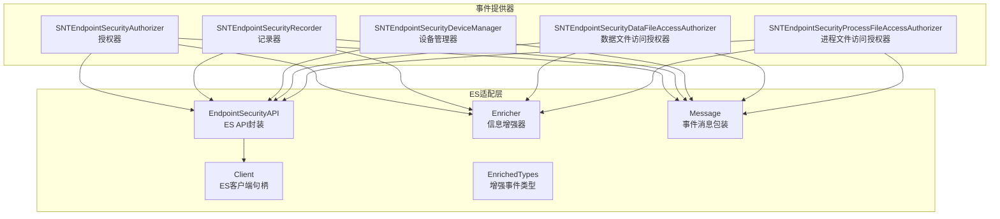
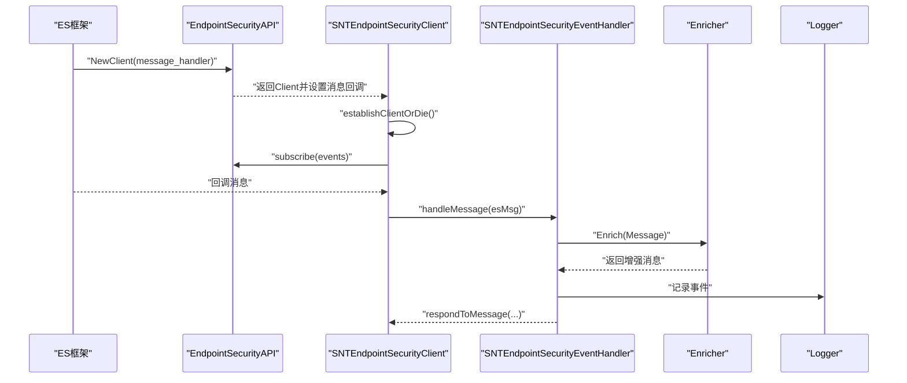
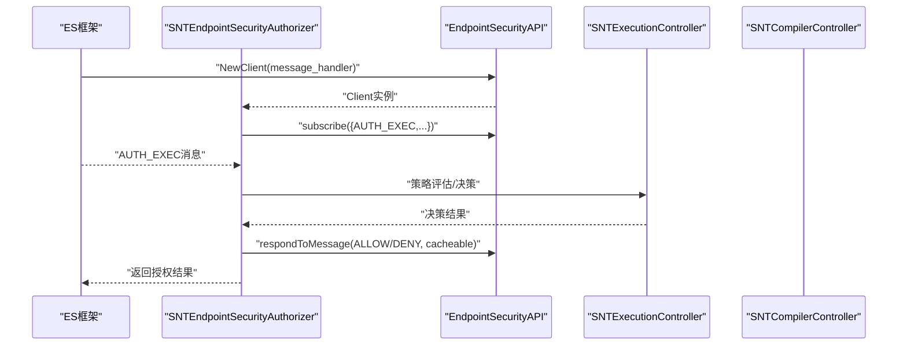
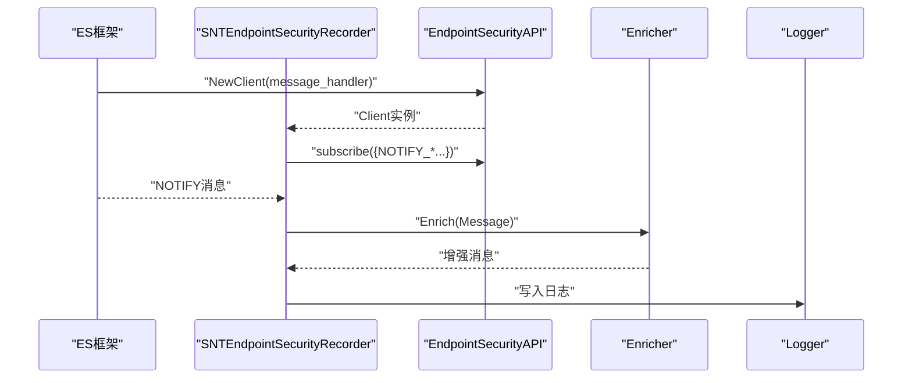
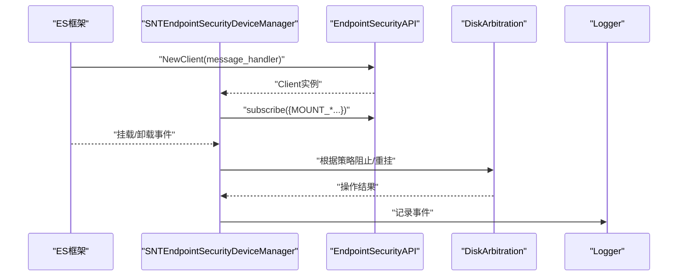
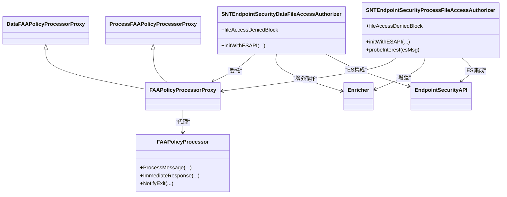
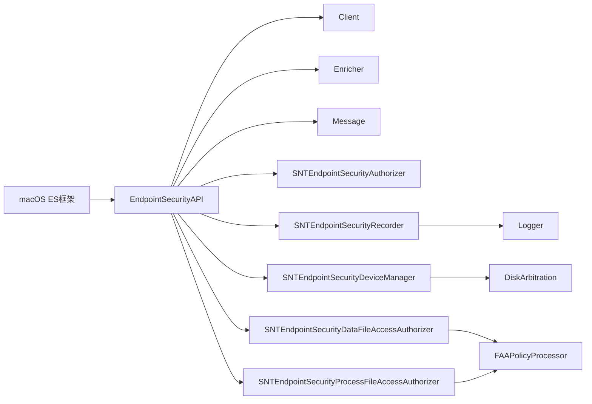

# 事件提供器

<cite>
**本文引用的文件**
- [SNTEndpointSecurityAuthorizer.h](file://Source/santad/EventProviders/SNTEndpointSecurityAuthorizer.h)
- [SNTEndpointSecurityRecorder.h](file://Source/santad/EventProviders/SNTEndpointSecurityRecorder.h)
- [SNTEndpointSecurityDeviceManager.h](file://Source/santad/EventProviders/SNTEndpointSecurityDeviceManager.h)
- [SNTEndpointSecurityClient.h](file://Source/santad/EventProviders/SNTEndpointSecurityClient.h)
- [SNTEndpointSecurityClientBase.h](file://Source/santad/EventProviders/SNTEndpointSecurityClientBase.h)
- [SNTEndpointSecurityEventHandler.h](file://Source/santad/EventProviders/SNTEndpointSecurityEventHandler.h)
- [SNTEndpointSecurityDataFileAccessAuthorizer.h](file://Source/santad/EventProviders/SNTEndpointSecurityDataFileAccessAuthorizer.h)
- [SNTEndpointSecurityProcessFileAccessAuthorizer.h](file://Source/santad/EventProviders/SNTEndpointSecurityProcessFileAccessAuthorizer.h)
- [EndpointSecurityAPI.h](file://Source/santad/EventProviders/EndpointSecurity/EndpointSecurityAPI.h)
- [Enricher.h](file://Source/santad/EventProviders/EndpointSecurity/Enricher.h)
- [Client.h](file://Source/santad/EventProviders/EndpointSecurity/Client.h)
- [Message.h](file://Source/santad/EventProviders/EndpointSecurity/Message.h)
- [EnrichedTypes.h](file://Source/santad/EventProviders/EndpointSecurity/EnrichedTypes.h)
- [FAAPolicyProcessor.h](file://Source/santad/EventProviders/FAAPolicyProcessor.h)
</cite>

## 目录
1. [简介](#简介)
2. [项目结构](#项目结构)
3. [核心组件](#核心组件)
4. [架构总览](#架构总览)
5. [详细组件分析](#详细组件分析)
6. [依赖关系分析](#依赖关系分析)
7. [性能考虑](#性能考虑)
8. [故障排除指南](#故障排除指南)
9. [结论](#结论)

## 简介
本文件面向Santa守护进程的事件提供器子系统，系统性阐述其与macOS Endpoint Security（ES）API的集成方式，覆盖授权器、记录器、设备管理与文件访问授权器等模块。文档重点解释事件订阅、事件处理与回调机制，梳理执行事件、文件访问事件、USB设备事件与网络挂载事件的处理流程，并给出配置管理、性能优化、监控指标与调试排障建议。

## 项目结构
事件提供器位于Source/santad/EventProviders目录下，按“功能域+ES适配层”组织：
- EndpointSecurity适配层：封装ES客户端生命周期、订阅/取消订阅、静音路径/进程、响应授权结果、消息保留释放等底层能力
- 事件提供器：围绕不同职责划分的客户端类，如授权器、记录器、设备管理器、两类文件访问授权器
- 协议与接口：定义事件处理器协议、探针协议、事件处理回调契约
- 增强类型：对ES事件进行上下文增强后的富类型，便于日志与策略决策

图表来源
- [SNTEndpointSecurityAuthorizer.h](file://Source/santad/EventProviders/SNTEndpointSecurityAuthorizer.h#L1-L42)
- [SNTEndpointSecurityRecorder.h](file://Source/santad/EventProviders/SNTEndpointSecurityRecorder.h#L1-L43)
- [SNTEndpointSecurityDeviceManager.h](file://Source/santad/EventProviders/SNTEndpointSecurityDeviceManager.h#L1-L58)
- [SNTEndpointSecurityDataFileAccessAuthorizer.h](file://Source/santad/EventProviders/SNTEndpointSecurityDataFileAccessAuthorizer.h#L1-L46)
- [SNTEndpointSecurityProcessFileAccessAuthorizer.h](file://Source/santad/EventProviders/SNTEndpointSecurityProcessFileAccessAuthorizer.h#L1-L40)
- [EndpointSecurityAPI.h](file://Source/santad/EventProviders/EndpointSecurity/EndpointSecurityAPI.h#L1-L80)
- [Enricher.h](file://Source/santad/EventProviders/EndpointSecurity/Enricher.h#L1-L74)
- [Client.h](file://Source/santad/EventProviders/EndpointSecurity/Client.h#L1-L70)
- [Message.h](file://Source/santad/EventProviders/EndpointSecurity/Message.h#L1-L94)
- [EnrichedTypes.h](file://Source/santad/EventProviders/EndpointSecurity/EnrichedTypes.h#L1-L120)

章节来源
- [SNTEndpointSecurityAuthorizer.h](file://Source/santad/EventProviders/SNTEndpointSecurityAuthorizer.h#L1-L42)
- [SNTEndpointSecurityRecorder.h](file://Source/santad/EventProviders/SNTEndpointSecurityRecorder.h#L1-L43)
- [SNTEndpointSecurityDeviceManager.h](file://Source/santad/EventProviders/SNTEndpointSecurityDeviceManager.h#L1-L58)
- [SNTEndpointSecurityDataFileAccessAuthorizer.h](file://Source/santad/EventProviders/SNTEndpointSecurityDataFileAccessAuthorizer.h#L1-L46)
- [SNTEndpointSecurityProcessFileAccessAuthorizer.h](file://Source/santad/EventProviders/SNTEndpointSecurityProcessFileAccessAuthorizer.h#L1-L40)
- [EndpointSecurityAPI.h](file://Source/santad/EventProviders/EndpointSecurity/EndpointSecurityAPI.h#L1-L80)
- [Enricher.h](file://Source/santad/EventProviders/EndpointSecurity/Enricher.h#L1-L74)
- [Client.h](file://Source/santad/EventProviders/EndpointSecurity/Client.h#L1-L70)
- [Message.h](file://Source/santad/EventProviders/EndpointSecurity/Message.h#L1-L94)
- [EnrichedTypes.h](file://Source/santad/EventProviders/EndpointSecurity/EnrichedTypes.h#L1-L120)

## 核心组件
- 授权器（SNTEndpointSecurityAuthorizer）
  - 职责：订阅AUTH类事件，基于策略进行授权决策并响应
  - 关键点：初始化时注入ES API、指标、执行控制器、编译控制器、授权结果缓存、TTY写入器；支持注册AUTH执行探针
- 记录器（SNTEndpointSecurityRecorder）
  - 职责：订阅NOTIFY类事件，增强消息后进行日志记录
  - 关键点：依赖ES API、指标、日志器、增强器、编译控制器、授权结果缓存、前缀树、进程树
- 设备管理器（SNTEndpointSecurityDeviceManager）
  - 职责：结合ES与DiskArbitration监控/阻止/重挂USB存储；支持网络挂载事件
  - 关键点：属性含是否阻止USB挂载、重挂参数、设备阻断回调、网络挂载回调；依赖ES API、指标、日志器、增强器、授权结果缓存
- 数据文件访问授权器（SNTEndpointSecurityDataFileAccessAuthorizer）
  - 职责：针对数据目标（如文件）的访问进行策略评估与授权
  - 关键点：依赖ES API、指标、日志器、增强器、FAA策略处理器代理、TTY写入器、策略匹配/迭代块
- 进程文件访问授权器（SNTEndpointSecurityProcessFileAccessAuthorizer）
  - 职责：针对进程维度的访问进行策略评估与授权，支持探针兴趣判定
  - 关键点：依赖ES API、指标、FAA策略处理器代理、进程策略迭代块
- ES适配层
  - EndpointSecurityAPI：统一ES客户端创建、订阅/取消订阅、静音控制、响应授权/标志位、消息保留/释放、清理缓存、执行参数/环境变量/FD查询
  - Client：ES客户端句柄封装，负责连接状态与析构
  - Enricher：对进程/文件/UID/GID等进行本地或外部辅助增强
  - Message：对es_message_t的轻量包装，提供路径目标、父进程名/路径、进程令牌等便捷访问
  - EnrichedTypes：对多种ES事件类型的增强表示，便于日志与策略决策

章节来源
- [SNTEndpointSecurityAuthorizer.h](file://Source/santad/EventProviders/SNTEndpointSecurityAuthorizer.h#L1-L42)
- [SNTEndpointSecurityRecorder.h](file://Source/santad/EventProviders/SNTEndpointSecurityRecorder.h#L1-L43)
- [SNTEndpointSecurityDeviceManager.h](file://Source/santad/EventProviders/SNTEndpointSecurityDeviceManager.h#L1-L58)
- [SNTEndpointSecurityDataFileAccessAuthorizer.h](file://Source/santad/EventProviders/SNTEndpointSecurityDataFileAccessAuthorizer.h#L1-L46)
- [SNTEndpointSecurityProcessFileAccessAuthorizer.h](file://Source/santad/EventProviders/SNTEndpointSecurityProcessFileAccessAuthorizer.h#L1-L40)
- [EndpointSecurityAPI.h](file://Source/santad/EventProviders/EndpointSecurity/EndpointSecurityAPI.h#L1-L80)
- [Enricher.h](file://Source/santad/EventProviders/EndpointSecurity/Enricher.h#L1-L74)
- [Client.h](file://Source/santad/EventProviders/EndpointSecurity/Client.h#L1-L70)
- [Message.h](file://Source/santad/EventProviders/EndpointSecurity/Message.h#L1-L94)
- [EnrichedTypes.h](file://Source/santad/EventProviders/EndpointSecurity/EnrichedTypes.h#L1-L120)

## 架构总览
事件提供器通过ES适配层与macOS Endpoint Security框架交互，采用“客户端-处理器-增强器-日志器”的分层设计：
- 客户端层：各事件提供器继承自抽象基类，统一实现建立客户端、订阅/取消订阅、静音控制、响应授权、消息处理与异步处理等
- 处理器层：事件处理器协议定义了启用订阅、逐条处理消息、记录事件处置指标等契约
- 增强层：Enricher在不触发外部工作的前提下进行本地增强，必要时可引入进程树等上下文
- 日志层：记录器将增强后的事件写入日志器，供后续上报与审计

图表来源
- [SNTEndpointSecurityClientBase.h](file://Source/santad/EventProviders/SNTEndpointSecurityClientBase.h#L1-L87)
- [SNTEndpointSecurityEventHandler.h](file://Source/santad/EventProviders/SNTEndpointSecurityEventHandler.h#L1-L82)
- [EndpointSecurityAPI.h](file://Source/santad/EventProviders/EndpointSecurity/EndpointSecurityAPI.h#L1-L80)
- [Enricher.h](file://Source/santad/EventProviders/EndpointSecurity/Enricher.h#L1-L74)
- [SNTEndpointSecurityRecorder.h](file://Source/santad/EventProviders/SNTEndpointSecurityRecorder.h#L1-L43)

## 详细组件分析

### 授权器（执行事件）
- 功能要点
  - 订阅AUTH类事件，基于策略决定允许/拒绝，并可选择是否缓存结果
  - 支持注册AUTH执行探针，用于兴趣判定
  - 与执行控制器、编译控制器、TTY写入器协作，确保策略生效与用户反馈
- 处理流程
  - 建立ES客户端并订阅AUTH事件
  - 收到消息后，调用事件处理器协议的handleMessage，记录处置指标
  - 基于策略计算授权结果，调用respondToMessage进行响应
- 性能与可靠性
  - 使用ES缓存以减少重复决策
  - 对消息处理采用同步串行，保证事件顺序一致性

图表来源
- [SNTEndpointSecurityAuthorizer.h](file://Source/santad/EventProviders/SNTEndpointSecurityAuthorizer.h#L1-L42)
- [EndpointSecurityAPI.h](file://Source/santad/EventProviders/EndpointSecurity/EndpointSecurityAPI.h#L1-L80)
- [SNTEndpointSecurityClientBase.h](file://Source/santad/EventProviders/SNTEndpointSecurityClientBase.h#L1-L87)

章节来源
- [SNTEndpointSecurityAuthorizer.h](file://Source/santad/EventProviders/SNTEndpointSecurityAuthorizer.h#L1-L42)
- [SNTEndpointSecurityClientBase.h](file://Source/santad/EventProviders/SNTEndpointSecurityClientBase.h#L1-L87)
- [EndpointSecurityAPI.h](file://Source/santad/EventProviders/EndpointSecurity/EndpointSecurityAPI.h#L1-L80)

### 记录器（通知事件与日志）
- 功能要点
  - 订阅NOTIFY类事件，增强消息后写入日志器
  - 维护前缀树与进程树，支持路径/进程维度的上下文增强
- 处理流程
  - 建立客户端并订阅NOTIFY事件
  - 消息到达后，使用Enricher进行增强，随后交给日志器序列化输出
  - 可选：记录事件处置指标

图表来源
- [SNTEndpointSecurityRecorder.h](file://Source/santad/EventProviders/SNTEndpointSecurityRecorder.h#L1-L43)
- [Enricher.h](file://Source/santad/EventProviders/EndpointSecurity/Enricher.h#L1-L74)
- [EndpointSecurityAPI.h](file://Source/santad/EventProviders/EndpointSecurity/EndpointSecurityAPI.h#L1-L80)

章节来源
- [SNTEndpointSecurityRecorder.h](file://Source/santad/EventProviders/SNTEndpointSecurityRecorder.h#L1-L43)
- [Enricher.h](file://Source/santad/EventProviders/EndpointSecurity/Enricher.h#L1-L74)
- [EndpointSecurityAPI.h](file://Source/santad/EventProviders/EndpointSecurity/EndpointSecurityAPI.h#L1-L80)

### 设备管理器（USB/网络挂载）
- 功能要点
  - 结合ES与DiskArbitration监控/阻止/重挂USB存储
  - 提供网络挂载事件回调，支持配置阻止与重挂参数
- 处理流程
  - 初始化时注入ES API、指标、日志器、增强器、授权结果缓存
  - 订阅相关ES事件，结合DiskArbitration进行挂载拦截与重挂
  - 触发阻断或网络挂载事件时，调用回调并记录日志

图表来源
- [SNTEndpointSecurityDeviceManager.h](file://Source/santad/EventProviders/SNTEndpointSecurityDeviceManager.h#L1-L58)
- [EndpointSecurityAPI.h](file://Source/santad/EventProviders/EndpointSecurity/EndpointSecurityAPI.h#L1-L80)

章节来源
- [SNTEndpointSecurityDeviceManager.h](file://Source/santad/EventProviders/SNTEndpointSecurityDeviceManager.h#L1-L58)
- [EndpointSecurityAPI.h](file://Source/santad/EventProviders/EndpointSecurity/EndpointSecurityAPI.h#L1-L80)

### 文件访问授权器（数据/进程维度）
- 数据文件访问授权器
  - 面向“数据目标”（如文件）的访问策略评估
  - 通过FAA策略处理器代理执行策略匹配、决策、日志与TTY提示
- 进程文件访问授权器
  - 面向“进程维度”的访问策略评估
  - 支持探针兴趣判定，便于按需订阅
- 共同特性
  - 增强器参与上下文丰富
  - 支持立即响应与退出通知，优化热路径与生命周期管理

图表来源
- [SNTEndpointSecurityDataFileAccessAuthorizer.h](file://Source/santad/EventProviders/SNTEndpointSecurityDataFileAccessAuthorizer.h#L1-L46)
- [SNTEndpointSecurityProcessFileAccessAuthorizer.h](file://Source/santad/EventProviders/SNTEndpointSecurityProcessFileAccessAuthorizer.h#L1-L40)
- [FAAPolicyProcessor.h](file://Source/santad/EventProviders/FAAPolicyProcessor.h#L1-L242)
- [Enricher.h](file://Source/santad/EventProviders/EndpointSecurity/Enricher.h#L1-L74)
- [EndpointSecurityAPI.h](file://Source/santad/EventProviders/EndpointSecurity/EndpointSecurityAPI.h#L1-L80)

章节来源
- [SNTEndpointSecurityDataFileAccessAuthorizer.h](file://Source/santad/EventProviders/SNTEndpointSecurityDataFileAccessAuthorizer.h#L1-L46)
- [SNTEndpointSecurityProcessFileAccessAuthorizer.h](file://Source/santad/EventProviders/SNTEndpointSecurityProcessFileAccessAuthorizer.h#L1-L40)
- [FAAPolicyProcessor.h](file://Source/santad/EventProviders/FAAPolicyProcessor.h#L1-L242)
- [Enricher.h](file://Source/santad/EventProviders/EndpointSecurity/Enricher.h#L1-L74)
- [EndpointSecurityAPI.h](file://Source/santad/EventProviders/EndpointSecurity/EndpointSecurityAPI.h#L1-L80)

### ES事件类型与增强
- 增强类型覆盖广泛事件类别，如执行、退出、派生、交换、重命名、删除、复制/克隆、认证、登录窗口会话、屏幕共享、OpenSSH会话、XProtect检测/处置、Gatekeeper覆盖、TCC修改等
- 增强过程将进程/文件元信息、用户/组名、可选的进程树注解等组合为富事件对象，便于日志与策略决策

```mermaid
classDiagram
class EnrichedEventType {
+es_msg_
+instigator_
+enrichment_time_
}
class EnrichedExec
class EnrichedClose
class EnrichedRename
class EnrichedUnlink
class EnrichedExchange
class EnrichedLink
class EnrichedFork
class EnrichedExit
class EnrichedCSInvalidated
class EnrichedLoginWindowSessionLogin
class EnrichedLoginWindowSessionLogout
class EnrichedLoginWindowSessionLock
class EnrichedLoginWindowSessionUnlock
class EnrichedScreenSharingAttach
class EnrichedScreenSharingDetach
class EnrichedOpenSSHLogin
class EnrichedOpenSSHLogout
class EnrichedAuthenticationOD
class EnrichedAuthenticationTouchID
class EnrichedAuthenticationToken
class EnrichedAuthenticationAutoUnlock
class EnrichedClone
class EnrichedCopyfile
class EnrichedLaunchItem
class EnrichedXProtectDetected
class EnrichedXProtectRemediated
class EnrichedGatekeeperOverride
class EnrichedTCCModification
EnrichedExec --|> EnrichedEventType
EnrichedClose --|> EnrichedEventType
EnrichedRename --|> EnrichedEventType
EnrichedUnlink --|> EnrichedEventType
EnrichedExchange --|> EnrichedEventType
EnrichedLink --|> EnrichedEventType
EnrichedFork --|> EnrichedEventType
EnrichedExit --|> EnrichedEventType
EnrichedCSInvalidated --|> EnrichedEventType
EnrichedLoginWindowSessionLogin --|> EnrichedEventType
EnrichedLoginWindowSessionLogout --|> EnrichedEventType
EnrichedLoginWindowSessionLock --|> EnrichedEventType
EnrichedLoginWindowSessionUnlock --|> EnrichedEventType
EnrichedScreenSharingAttach --|> EnrichedEventType
EnrichedScreenSharingDetach --|> EnrichedEventType
EnrichedOpenSSHLogin --|> EnrichedEventType
EnrichedOpenSSHLogout --|> EnrichedEventType
EnrichedAuthenticationOD --|> EnrichedEventType
EnrichedAuthenticationTouchID --|> EnrichedEventType
EnrichedAuthenticationToken --|> EnrichedEventType
EnrichedAuthenticationAutoUnlock --|> EnrichedEventType
EnrichedClone --|> EnrichedEventType
EnrichedCopyfile --|> EnrichedEventType
EnrichedLaunchItem --|> EnrichedEventType
EnrichedXProtectDetected --|> EnrichedEventType
EnrichedXProtectRemediated --|> EnrichedEventType
EnrichedGatekeeperOverride --|> EnrichedEventType
EnrichedTCCModification --|> EnrichedEventType
```

图表来源
- [EnrichedTypes.h](file://Source/santad/EventProviders/EndpointSecurity/EnrichedTypes.h#L1-L200)
- [EnrichedTypes.h](file://Source/santad/EventProviders/EndpointSecurity/EnrichedTypes.h#L200-L450)
- [EnrichedTypes.h](file://Source/santad/EventProviders/EndpointSecurity/EnrichedTypes.h#L450-L793)

章节来源
- [EnrichedTypes.h](file://Source/santad/EventProviders/EndpointSecurity/EnrichedTypes.h#L1-L200)
- [EnrichedTypes.h](file://Source/santad/EventProviders/EndpointSecurity/EnrichedTypes.h#L200-L450)
- [EnrichedTypes.h](file://Source/santad/EventProviders/EndpointSecurity/EnrichedTypes.h#L450-L793)

## 依赖关系分析
- 组件耦合
  - 各事件提供器均依赖EndpointSecurityAPI与Enricher，形成清晰的ES与增强能力边界
  - 授权器与记录器分别承担“决策-响应”和“记录-输出”的职责，职责分离良好
  - 设备管理器独立于ES适配层之外，但通过回调与日志器对接
- 外部依赖
  - macOS EndpointSecurity框架、DiskArbitration框架
  - 进程树、前缀树等内部基础设施
- 循环依赖规避
  - Client在析构时直接调用ES删除函数，避免与ES API封装形成循环引用

图表来源
- [EndpointSecurityAPI.h](file://Source/santad/EventProviders/EndpointSecurity/EndpointSecurityAPI.h#L1-L80)
- [Client.h](file://Source/santad/EventProviders/EndpointSecurity/Client.h#L1-L70)
- [Enricher.h](file://Source/santad/EventProviders/EndpointSecurity/Enricher.h#L1-L74)
- [Message.h](file://Source/santad/EventProviders/EndpointSecurity/Message.h#L1-L94)
- [SNTEndpointSecurityAuthorizer.h](file://Source/santad/EventProviders/SNTEndpointSecurityAuthorizer.h#L1-L42)
- [SNTEndpointSecurityRecorder.h](file://Source/santad/EventProviders/SNTEndpointSecurityRecorder.h#L1-L43)
- [SNTEndpointSecurityDeviceManager.h](file://Source/santad/EventProviders/SNTEndpointSecurityDeviceManager.h#L1-L58)
- [SNTEndpointSecurityDataFileAccessAuthorizer.h](file://Source/santad/EventProviders/SNTEndpointSecurityDataFileAccessAuthorizer.h#L1-L46)
- [SNTEndpointSecurityProcessFileAccessAuthorizer.h](file://Source/santad/EventProviders/SNTEndpointSecurityProcessFileAccessAuthorizer.h#L1-L40)
- [FAAPolicyProcessor.h](file://Source/santad/EventProviders/FAAPolicyProcessor.h#L1-L242)

章节来源
- [EndpointSecurityAPI.h](file://Source/santad/EventProviders/EndpointSecurity/EndpointSecurityAPI.h#L1-L80)
- [Client.h](file://Source/santad/EventProviders/EndpointSecurity/Client.h#L1-L70)
- [Enricher.h](file://Source/santad/EventProviders/EndpointSecurity/Enricher.h#L1-L74)
- [Message.h](file://Source/santad/EventProviders/EndpointSecurity/Message.h#L1-L94)
- [SNTEndpointSecurityAuthorizer.h](file://Source/santad/EventProviders/SNTEndpointSecurityAuthorizer.h#L1-L42)
- [SNTEndpointSecurityRecorder.h](file://Source/santad/EventProviders/SNTEndpointSecurityRecorder.h#L1-L43)
- [SNTEndpointSecurityDeviceManager.h](file://Source/santad/EventProviders/SNTEndpointSecurityDeviceManager.h#L1-L58)
- [SNTEndpointSecurityDataFileAccessAuthorizer.h](file://Source/santad/EventProviders/SNTEndpointSecurityDataFileAccessAuthorizer.h#L1-L46)
- [SNTEndpointSecurityProcessFileAccessAuthorizer.h](file://Source/santad/EventProviders/SNTEndpointSecurityProcessFileAccessAuthorizer.h#L1-L40)
- [FAAPolicyProcessor.h](file://Source/santad/EventProviders/FAAPolicyProcessor.h#L1-L242)

## 性能考虑
- 事件批处理与异步处理
  - 提供异步处理接口，避免阻塞ES回调线程
  - 在消息处理链路中区分“快速路径”（立即响应）与“策略评估”阶段
- 内存管理
  - Message与EnrichedTypes采用移动语义，减少拷贝开销
  - Enricher内部使用缓存（用户名/组名缓存），降低重复查询成本
- 缓存与静音
  - ES侧缓存授权结果，减少重复决策
  - 支持路径/进程静音，降低噪声事件对性能的影响
- 速率限制与日志节流
  - FAA策略处理器内置速率限制器，防止日志风暴
  - TTY消息缓存避免重复提示

章节来源
- [SNTEndpointSecurityClientBase.h](file://Source/santad/EventProviders/SNTEndpointSecurityClientBase.h#L1-L87)
- [Enricher.h](file://Source/santad/EventProviders/EndpointSecurity/Enricher.h#L1-L74)
- [FAAPolicyProcessor.h](file://Source/santad/EventProviders/FAAPolicyProcessor.h#L1-L242)

## 故障排除指南
- 客户端建立失败
  - establishClientOrDie会在无法建立ES客户端时抛出异常，应终止程序以避免不一致状态
- 订阅/静音问题
  - 订阅后存在ES缓存间隙，应在subscribeAndClearCache后再清除ES缓存，避免漏掉事件
  - 检查路径/进程静音是否被反转（InvertTargetPathMuting/InvertProcessMuting）
- 授权响应异常
  - respondToMessage会根据事件类型自动选择授权或标志位响应；确认cacheable参数与事件flags要求
- 日志与TTY
  - 若未见日志，请检查日志器配置与权限
  - TTY提示被节流，可通过速率限制参数调整
- 设备管理
  - USB挂载被阻止或重挂失败，检查blockUSBMount与remount参数配置，以及DiskArbitration回调逻辑

章节来源
- [SNTEndpointSecurityClientBase.h](file://Source/santad/EventProviders/SNTEndpointSecurityClientBase.h#L1-L87)
- [EndpointSecurityAPI.h](file://Source/santad/EventProviders/EndpointSecurity/EndpointSecurityAPI.h#L1-L80)
- [SNTEndpointSecurityDeviceManager.h](file://Source/santad/EventProviders/SNTEndpointSecurityDeviceManager.h#L1-L58)
- [FAAPolicyProcessor.h](file://Source/santad/EventProviders/FAAPolicyProcessor.h#L1-L242)

## 结论
事件提供器通过ES适配层实现了对执行、通知、设备与文件访问等多类事件的统一接入与处理。授权器、记录器、设备管理器与两类文件访问授权器各司其职，配合增强器与日志器，形成从事件采集、上下文增强、策略决策到日志输出的完整闭环。通过异步处理、缓存、静音与速率限制等手段，系统在保证安全策略有效执行的同时兼顾性能与可观测性。