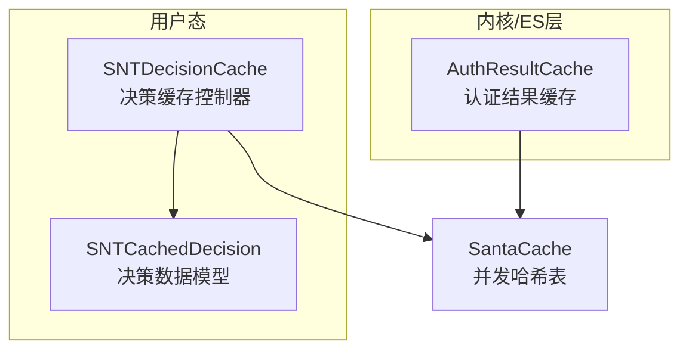
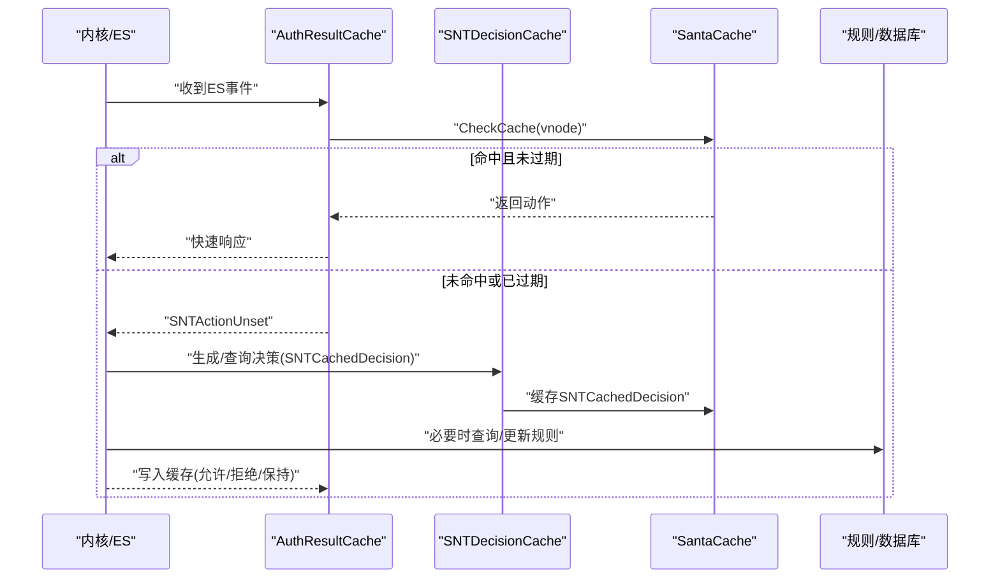
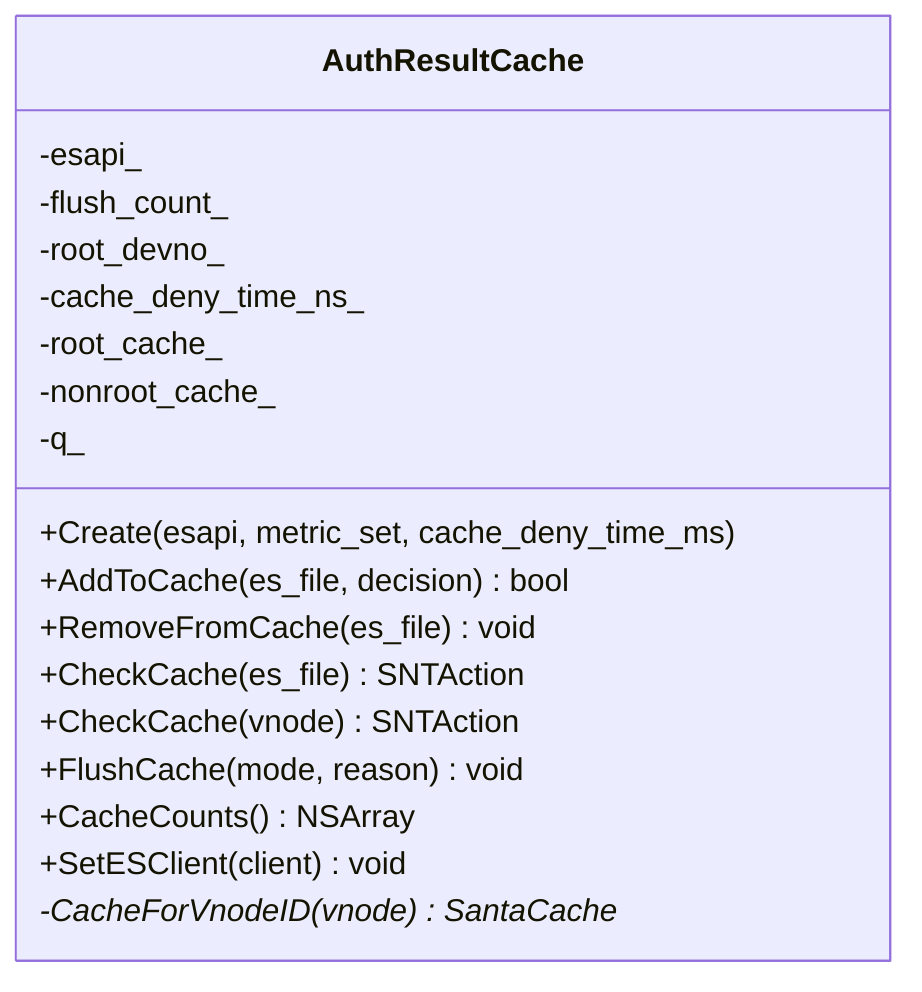
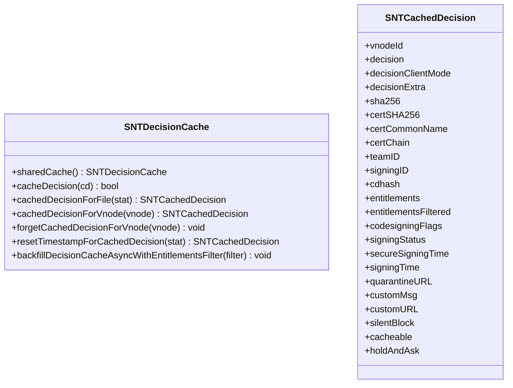
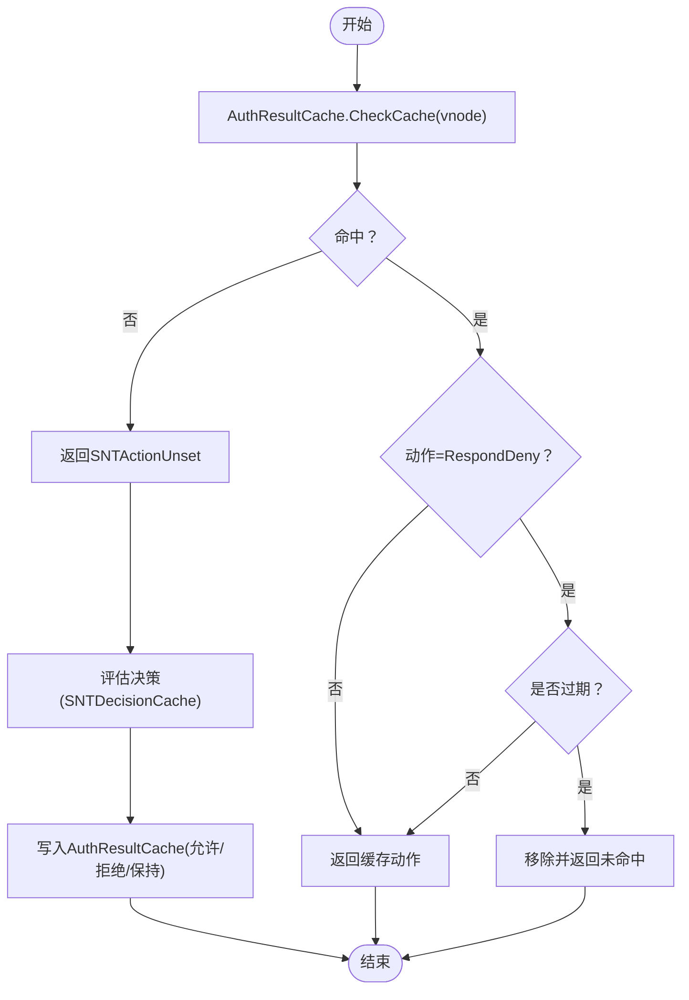
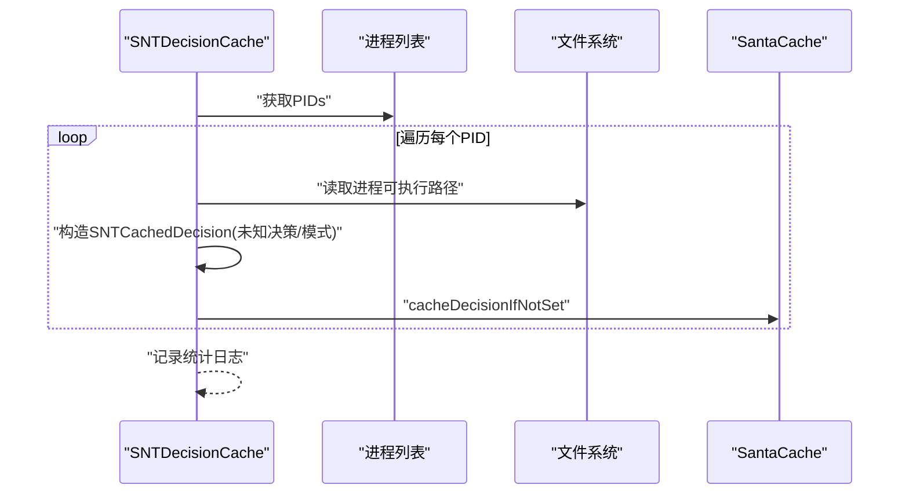
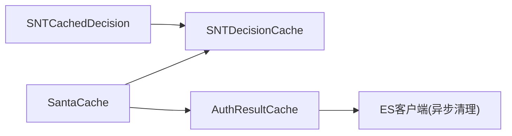

# 决策缓存系统

<cite>
**本文引用的文件**
- [SNTDecisionCache.h](file://Source/santad/SNTDecisionCache.h)
- [SNTDecisionCache.mm](file://Source/santad/SNTDecisionCache.mm)
- [SNTCachedDecision.h](file://Source/common/SNTCachedDecision.h)
- [SNTCachedDecision.mm](file://Source/common/SNTCachedDecision.mm)
- [AuthResultCache.h](file://Source/santad/EventProviders/AuthResultCache.h)
- [AuthResultCache.mm](file://Source/santad/EventProviders/AuthResultCache.mm)
- [SantaCache.h](file://Source/common/SantaCache.h)
- [SNTDecisionCacheTest.mm](file://Source/santad/SNTDecisionCacheTest.mm)
- [AuthResultCacheTest.mm](file://Source/santad/EventProviders/AuthResultCacheTest.mm)
- [Dynamic_DataSecurity_System_Design.md](file://Dynamic_DataSecurity_System_Design.md)
- [ES_Client_Architecture_Decision.md](file://ES_Client_Architecture_Decision.md)
</cite>

## 目录
1. [引言](#引言)
2. [项目结构](#项目结构)
3. [核心组件](#核心组件)
4. [架构总览](#架构总览)
5. [组件详解](#组件详解)
6. [依赖关系分析](#依赖关系分析)
7. [性能考量](#性能考量)
8. [故障排查指南](#故障排查指南)
9. [结论](#结论)

## 引言
本文件面向Santa守护进程的“决策缓存系统”，聚焦两类缓存：
- 认证结果缓存（AuthResultCache）：用于加速内核端ES事件的授权判定，避免重复计算与通信。
- 决策缓存（SNTDecisionCache + SNTCachedDecision）：用于在用户态记录与复用执行决策，支撑审计、规则更新与回填等流程。

文档将从系统架构、数据流、缓存策略与失效机制、并发与内存管理、性能优化与监控等方面进行深入解析，并结合测试与设计文档中的关键场景说明缓存与系统配置变更之间的关系。

## 项目结构
与决策缓存直接相关的模块分布如下：
- 用户态决策缓存：SNTDecisionCache（管理SNTCachedDecision对象），依赖SantaCache作为底层并发哈希表。
- 认证结果缓存：AuthResultCache（按根/非根卷分区），同样基于SantaCache实现并发存取。
- 公共数据模型：SNTCachedDecision（封装一次执行的决策与上下文信息）。
- 并发哈希表：SantaCache（模板类，提供桶级锁、容量上限与自动清空、遍历、计数等能力）。

图表来源
- [SNTDecisionCache.h](file://Source/santad/SNTDecisionCache.h#L1-L35)
- [SNTDecisionCache.mm](file://Source/santad/SNTDecisionCache.mm#L45-L71)
- [SNTCachedDecision.h](file://Source/common/SNTCachedDecision.h#L1-L61)
- [AuthResultCache.h](file://Source/santad/EventProviders/AuthResultCache.h#L50-L98)
- [SantaCache.h](file://Source/common/SantaCache.h#L48-L125)

章节来源
- [SNTDecisionCache.h](file://Source/santad/SNTDecisionCache.h#L1-L35)
- [SNTDecisionCache.mm](file://Source/santad/SNTDecisionCache.mm#L45-L71)
- [SNTCachedDecision.h](file://Source/common/SNTCachedDecision.h#L1-L61)
- [AuthResultCache.h](file://Source/santad/EventProviders/AuthResultCache.h#L50-L98)
- [SantaCache.h](file://Source/common/SantaCache.h#L48-L125)

## 核心组件
- SNTDecisionCache
  - 单例缓存控制器，负责将SNTCachedDecision按vnode键缓存，支持查询、删除、重置时间戳以及异步回填。
  - 使用SantaCache作为底层存储，内部维护一个时间戳重置映射，避免频繁更新数据库。
- SNTCachedDecision
  - 封装一次执行事件的决策与上下文（如vnode、决策状态、签名信息、证书链、团队ID、签名ID、cdhash、权限过滤结果、是否可缓存等）。
- AuthResultCache
  - 针对ES事件的认证结果缓存，区分根卷与非根卷两套缓存；支持按动作状态机写入、检查、过期剔除、全量/部分清空并异步通知内核清理。
  - 动作值采用位域编码，上8位保存动作，低56位保存时间戳，便于deny动作的过期控制。
- SantaCache
  - 模板并发哈希表，按桶锁实现高并发；达到容量上限时自动清空并重建，保证稳定内存占用与查询性能。

章节来源
- [SNTDecisionCache.h](file://Source/santad/SNTDecisionCache.h#L23-L35)
- [SNTDecisionCache.mm](file://Source/santad/SNTDecisionCache.mm#L45-L113)
- [SNTCachedDecision.h](file://Source/common/SNTCachedDecision.h#L23-L60)
- [SNTCachedDecision.mm](file://Source/common/SNTCachedDecision.mm#L18-L37)
- [AuthResultCache.h](file://Source/santad/EventProviders/AuthResultCache.h#L50-L98)
- [AuthResultCache.mm](file://Source/santad/EventProviders/AuthResultCache.mm#L40-L104)
- [SantaCache.h](file://Source/common/SantaCache.h#L48-L125)

## 架构总览
下图展示了认证结果缓存与决策缓存的协作关系及数据流向：

图表来源
- [AuthResultCache.mm](file://Source/santad/EventProviders/AuthResultCache.mm#L148-L171)
- [SNTDecisionCache.mm](file://Source/santad/SNTDecisionCache.mm#L73-L113)
- [SNTDecisionCache.mm](file://Source/santad/SNTDecisionCache.mm#L114-L205)

## 组件详解

### 认证结果缓存（AuthResultCache）
- 存储结构
  - 两套SantaCache：root_cache_（根卷）与nonroot_cache_（非根卷），依据vnode所在设备号选择。
  - 值采用位域编码：高8位保存SNTAction，低56位保存纳秒级时间戳（仅deny动作携带时间戳用于过期判断）。
- 写入策略
  - RequestBinary：作为初始状态写入，不带时间戳。
  - RespondAllow/RespondAllowCompiler/RespondDeny：写入对应动作；deny动作同时记录当前时间戳。
  - HoldAllowed/HoldDenied：作为过渡状态写入后立即移除该条目，确保后续执行需重新评估。
  - RespondAllowNoCache：不写入缓存。
- 查询与过期
  - 若命中且为RespondDeny，计算过期时间（当前时间 > 时间戳 + cache_deny_time_ns_）；过期则移除并返回未命中。
  - 否则返回缓存动作。
- 清理与失效
  - FlushCache(非根/全部)：清空对应缓存；当清空全部时，通过队列异步调用ES客户端清理内核缓存，避免阻塞。
  - 触发原因枚举：客户端模式切换、路径正则变化、规则变化、静态规则变化、显式命令、文件系统卸载、权限前缀/团队ID过滤器变化等。
- 并发与性能
  - 每个vnode键对应桶锁，减少锁竞争。
  - 使用专用队列（QoS较高）承载ES清理回调，避免死锁风险。
  - 提供CacheCounts统计两套缓存大小，便于监控。

图表来源
- [AuthResultCache.h](file://Source/santad/EventProviders/AuthResultCache.h#L50-L98)
- [AuthResultCache.mm](file://Source/santad/EventProviders/AuthResultCache.mm#L76-L104)
- [AuthResultCache.mm](file://Source/santad/EventProviders/AuthResultCache.mm#L111-L175)
- [AuthResultCache.mm](file://Source/santad/EventProviders/AuthResultCache.mm#L177-L206)

章节来源
- [AuthResultCache.h](file://Source/santad/EventProviders/AuthResultCache.h#L50-L98)
- [AuthResultCache.mm](file://Source/santad/EventProviders/AuthResultCache.mm#L40-L104)
- [AuthResultCache.mm](file://Source/santad/EventProviders/AuthResultCache.mm#L111-L171)
- [AuthResultCache.mm](file://Source/santad/EventProviders/AuthResultCache.mm#L177-L206)
- [AuthResultCacheTest.mm](file://Source/santad/EventProviders/AuthResultCacheTest.mm#L89-L167)

### 决策缓存（SNTDecisionCache + SNTCachedDecision）
- 数据模型
  - SNTCachedDecision封装执行事件的关键字段：vnode、决策状态、客户端模式、签名/证书/团队ID/签名ID/cdhash、权限过滤结果、是否可缓存、是否hold&ask等。
- 缓存控制器
  - 单例：sharedCache提供全局访问。
  - 核心接口：cacheDecision、cachedDecisionForFile、forgetCachedDecisionForVnode、resetTimestampForCachedDecision。
  - 回填：backfillDecisionCacheAsyncWithEntitlementsFilter，异步扫描运行中的进程，批量构建伪决策项（未知决策/模式），填充缓存以降低首次评估成本。
- 失效与更新
  - 对于“传递式允许”（transitive allow）的决策，使用timestampResetMap限制规则时间戳重置频率（默认1小时），避免频繁写库。
  - 支持按vnode删除缓存项。
- 并发与内存
  - 底层使用SantaCache，按桶锁保护，容量超限自动清空，维持稳定内存占用。
  - 回填过程在后台队列执行，QoS设置平衡完成时间与CPU占用。

图表来源
- [SNTDecisionCache.h](file://Source/santad/SNTDecisionCache.h#L23-L35)
- [SNTDecisionCache.mm](file://Source/santad/SNTDecisionCache.mm#L45-L113)
- [SNTCachedDecision.h](file://Source/common/SNTCachedDecision.h#L23-L60)
- [SNTCachedDecision.mm](file://Source/common/SNTCachedDecision.mm#L18-L37)

章节来源
- [SNTDecisionCache.h](file://Source/santad/SNTDecisionCache.h#L23-L35)
- [SNTDecisionCache.mm](file://Source/santad/SNTDecisionCache.mm#L45-L113)
- [SNTDecisionCache.mm](file://Source/santad/SNTDecisionCache.mm#L114-L205)
- [SNTCachedDecision.h](file://Source/common/SNTCachedDecision.h#L23-L60)
- [SNTCachedDecision.mm](file://Source/common/SNTCachedDecision.mm#L18-L37)
- [SNTDecisionCacheTest.mm](file://Source/santad/SNTDecisionCacheTest.mm#L55-L101)

### 缓存策略与失效机制
- AuthResultCache
  - 状态机：必须先有RequestBinary，才能进入RespondAllow/RespondDeny等终端动作；HoldAllowed/HoldDenied为过渡态，写入后立即移除。
  - 过期：RespondDeny带有时间戳，超过cache_deny_time_ns_后自动失效。
  - 分区：按vnode所在设备号选择root或nonroot缓存，提升命中率与隔离性。
  - 清理：根据触发原因（如客户端模式切换、路径正则变化、规则变化等）进行非根/全部清空；全部清空时异步通知内核清理ES缓存。
- SNTDecisionCache
  - 传递式允许的时间戳重置：每1小时最多一次，避免频繁写库。
  - 回填：异步扫描运行中进程，填充伪决策项，降低首次评估成本。
  - 删除：按vnode删除单个决策项。

图表来源
- [AuthResultCache.mm](file://Source/santad/EventProviders/AuthResultCache.mm#L148-L171)
- [SNTDecisionCache.mm](file://Source/santad/SNTDecisionCache.mm#L73-L113)

章节来源
- [AuthResultCache.mm](file://Source/santad/EventProviders/AuthResultCache.mm#L111-L171)
- [AuthResultCache.mm](file://Source/santad/EventProviders/AuthResultCache.mm#L177-L206)
- [SNTDecisionCache.mm](file://Source/santad/SNTDecisionCache.mm#L93-L113)
- [SNTDecisionCache.mm](file://Source/santad/SNTDecisionCache.mm#L114-L205)

### 缓存预填充（Backfill）
- 目标：在系统运行期间，提前将已运行进程的相关信息填充到决策缓存，减少首次评估延迟。
- 流程：获取PID快照，逐个进程构造SNTCachedDecision（决策未知、模式未知、不可缓存），尽可能填充签名/证书/权限等静态信息，然后尝试原子插入（若已被其他路径抢先插入则跳过）。
- 统计：输出回填数量、已存在数量、跳过数量与失败数量（进程退出等）。

图表来源
- [SNTDecisionCache.mm](file://Source/santad/SNTDecisionCache.mm#L125-L205)

章节来源
- [SNTDecisionCache.mm](file://Source/santad/SNTDecisionCache.mm#L125-L205)
- [SNTDecisionCacheTest.mm](file://Source/santad/SNTDecisionCacheTest.mm#L55-L101)

### 与系统配置变化的关系
- 客户端模式切换、路径正则变化、规则变化、静态规则变化、权限过滤器变化、显式命令、文件系统卸载等均会触发缓存刷新。
- 刷新策略：
  - 非根缓存：仅清空非根卷缓存，保留根卷缓存。
  - 全部缓存：清空根/非根缓存，并异步通知内核清理ES缓存，防止策略绕过。
- 设计警示：动态数据安全设计文档指出，新增监控路径后应清除缓存，否则可能导致新策略被旧缓存绕过。

章节来源
- [AuthResultCache.h](file://Source/santad/EventProviders/AuthResultCache.h#L34-L48)
- [AuthResultCache.mm](file://Source/santad/EventProviders/AuthResultCache.mm#L177-L197)
- [Dynamic_DataSecurity_System_Design.md](file://Dynamic_DataSecurity_System_Design.md#L918-L955)

## 依赖关系分析
- SNTDecisionCache依赖SantaCache进行并发存储，并依赖SNTCachedDecision封装决策上下文。
- AuthResultCache同样依赖SantaCache，按vnode所在设备号选择不同缓存实例。
- SantaCache提供桶级锁、容量上限、自动清空、遍历与计数等通用能力，是两类缓存的共同基础。

图表来源
- [SNTDecisionCache.h](file://Source/santad/SNTDecisionCache.h#L23-L35)
- [AuthResultCache.h](file://Source/santad/EventProviders/AuthResultCache.h#L81-L98)
- [SantaCache.h](file://Source/common/SantaCache.h#L48-L125)

章节来源
- [SNTDecisionCache.h](file://Source/santad/SNTDecisionCache.h#L23-L35)
- [AuthResultCache.h](file://Source/santad/EventProviders/AuthResultCache.h#L81-L98)
- [SantaCache.h](file://Source/common/SantaCache.h#L48-L125)

## 性能考量
- 并发与锁粒度
  - SantaCache按桶锁，减少热点冲突；写满自动清空，避免无限增长导致的锁争用与内存膨胀。
- 命中率优化
  - AuthResultCache按根/非根分区，提升命中率；SNTDecisionCache回填运行中进程，降低冷启动评估压力。
- I/O与数据库写入
  - 传递式允许的时间戳重置默认1小时一次，避免频繁写库。
- 资源与队列
  - 回填使用后台队列，QoS设置平衡吞吐与响应；ES清理回调异步执行，避免阻塞主流程。
- 监控指标
  - AuthResultCache提供flush_count计数器，按原因维度统计刷新次数，便于定位策略变更影响范围。

章节来源
- [SNTDecisionCache.mm](file://Source/santad/SNTDecisionCache.mm#L61-L71)
- [SNTDecisionCache.mm](file://Source/santad/SNTDecisionCache.mm#L93-L113)
- [SNTDecisionCache.mm](file://Source/santad/SNTDecisionCache.mm#L114-L205)
- [AuthResultCache.mm](file://Source/santad/EventProviders/AuthResultCache.mm#L76-L86)
- [AuthResultCache.mm](file://Source/santad/EventProviders/AuthResultCache.mm#L177-L197)

## 故障排查指南
- 缓存未命中/策略绕过
  - 现象：新增监控路径或切换模式后，旧缓存仍返回允许。
  - 处理：确认是否调用了清空缓存（非根/全部），并确保内核侧ES缓存同步清理。
- deny动作误过期
  - 现象：deny缓存过早失效导致频繁重新评估。
  - 处理：检查cache_deny_time_ms配置，适当增大以平衡及时性与性能。
- 回填失败/缺失
  - 现象：回填统计中“失败/跳过”较多。
  - 处理：检查进程是否存在、路径读取是否成功、是否被其他路径抢先插入。
- 性能退化
  - 现象：命中率下降、锁争用增加。
  - 处理：检查缓存容量与per_bucket参数、观察桶计数分布、评估回填频率与QoS设置。

章节来源
- [AuthResultCacheTest.mm](file://Source/santad/EventProviders/AuthResultCacheTest.mm#L122-L167)
- [AuthResultCacheTest.mm](file://Source/santad/EventProviders/AuthResultCacheTest.mm#L253-L277)
- [SNTDecisionCacheTest.mm](file://Source/santad/SNTDecisionCacheTest.mm#L55-L101)
- [Dynamic_DataSecurity_System_Design.md](file://Dynamic_DataSecurity_System_Design.md#L918-L955)
- [ES_Client_Architecture_Decision.md](file://ES_Client_Architecture_Decision.md#L368-L392)

## 结论
Santa的决策缓存系统通过两层缓存协同工作：内核侧的认证结果缓存（AuthResultCache）与用户态的决策缓存（SNTDecisionCache）。前者以状态机与过期策略保障快速、稳定的授权判定；后者以回填与时间戳重置策略降低评估成本并兼顾规则更新的时效性。SantaCache提供的桶级并发与容量上限机制，为两类缓存提供了稳健的底层支撑。配合明确的失效触发条件与异步清理流程，系统在性能、一致性与可观测性之间取得了良好平衡。