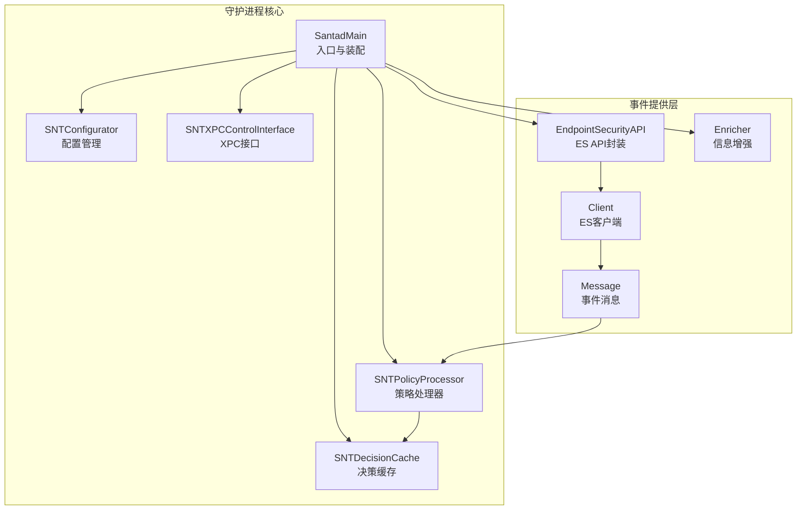
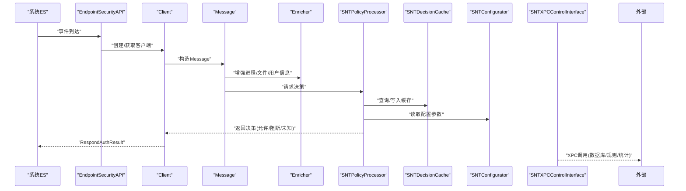
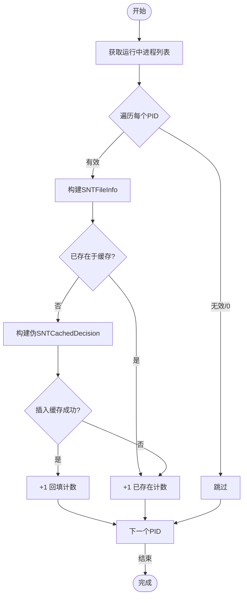
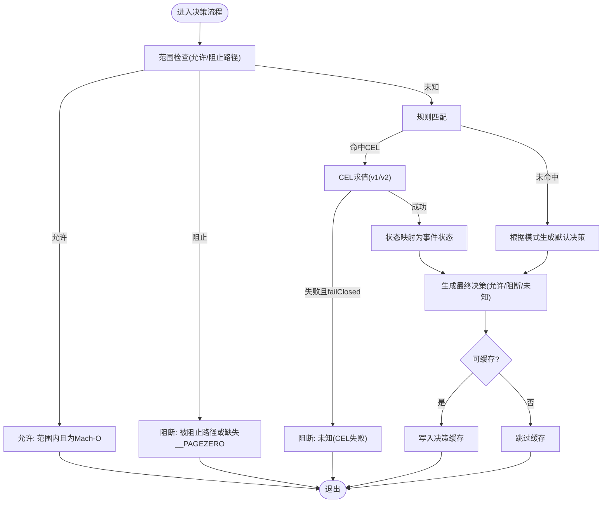
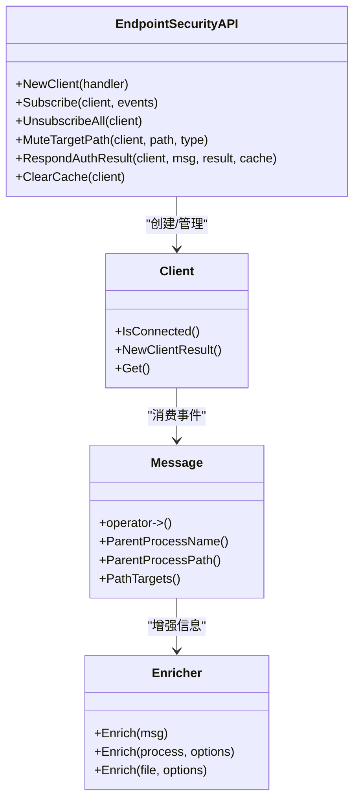
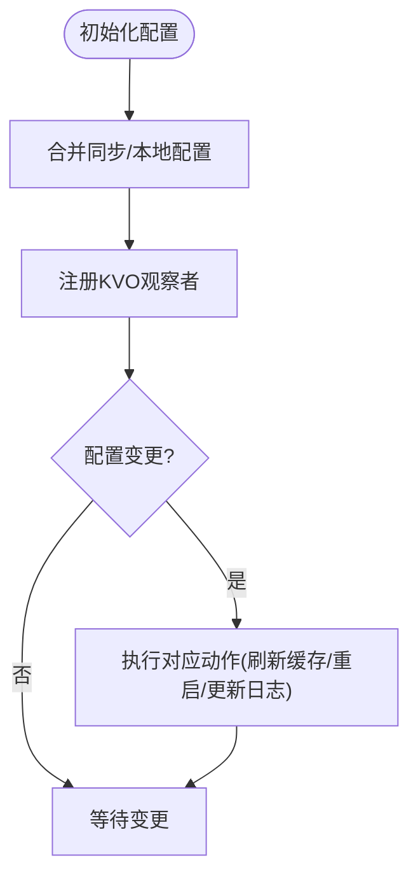
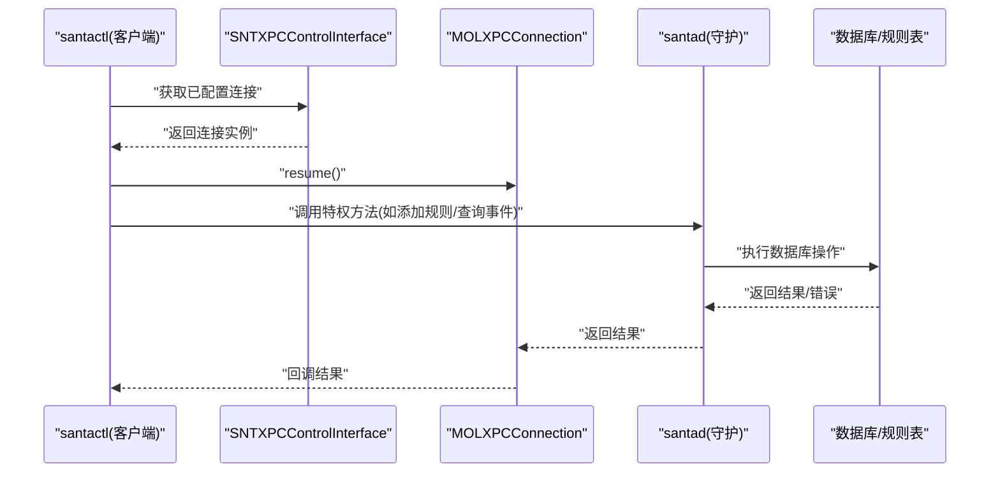
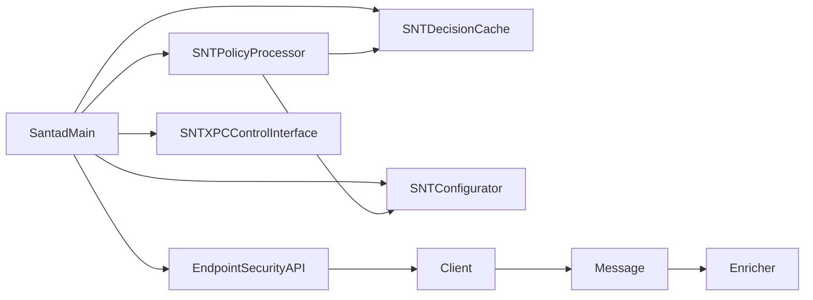

# 守护进程

<cite>
**本文引用的文件**
- [Santad.mm](file://Source/santad/Santad.mm)
- [Santad.h](file://Source/santad/Santad.h)
- [SNTDecisionCache.h](file://Source/santad/SNTDecisionCache.h)
- [SNTDecisionCache.mm](file://Source/santad/SNTDecisionCache.mm)
- [SNTPolicyProcessor.h](file://Source/santad/SNTPolicyProcessor.h)
- [SNTPolicyProcessor.mm](file://Source/santad/SNTPolicyProcessor.mm)
- [EndpointSecurityAPI.h](file://Source/santad/EventProviders/EndpointSecurity/EndpointSecurityAPI.h)
- [Enricher.h](file://Source/santad/EventProviders/EndpointSecurity/Enricher.h)
- [Client.h](file://Source/santad/EventProviders/EndpointSecurity/Client.h)
- [Message.h](file://Source/santad/EventProviders/EndpointSecurity/Message.h)
- [Message.mm](file://Source/santad/EventProviders/EndpointSecurity/Message.mm)
- [SNTConfigurator.h](file://Source/common/SNTConfigurator.h)
- [SNTConfigurator.mm](file://Source/common/SNTConfigurator.mm)
- [SNTXPCControlInterface.h](file://Source/common/SNTXPCControlInterface.h)
- [SNTXPCControlInterface.mm](file://Source/common/SNTXPCControlInterface.mm)
</cite>

## 目录
1. [引言](#引言)
2. [项目结构](#项目结构)
3. [核心组件](#核心组件)
4. [架构总览](#架构总览)
5. [详细组件分析](#详细组件分析)
6. [依赖关系分析](#依赖关系分析)
7. [性能考量](#性能考量)
8. [故障排查指南](#故障排查指南)
9. [结论](#结论)
10. [附录](#附录)

## 引言
本文件面向Santa守护进程（santad）的技术文档，聚焦其作为策略评估与决策中心的核心职责：执行决策缓存、策略处理器、进程控制与事件处理流程；阐述架构中的依赖注入、服务协调与资源管理；详解决策缓存的工作原理、缓存策略与性能优化；描述策略评估流程（规则匹配、优先级处理、决策生成）；解释与系统扩展的通信机制（XPC接口）、数据传输格式；并覆盖配置管理、运行时监控与故障恢复机制。

## 项目结构
- 守护进程入口与主循环位于 Santad.mm，负责装配各子系统并启动事件处理管线。
- 决策缓存 SNTDecisionCache 提供基于 vnode 的快速命中与回填能力。
- 策略处理器 SNTPolicyProcessor 负责从规则表中匹配规则、执行CEL表达式、生成最终决策。
- EndpointSecurity 集成通过 EndpointSecurityAPI、Client、Message 封装系统事件。
- 配置管理由 SNTConfigurator 提供，支持KVO监听与热更新。
- XPC 接口 SNTXPCControlInterface 暴露受控的特权操作给客户端工具。

图表来源
- [Santad.mm](file://Source/santad/Santad.mm#L73-L120)
- [SNTDecisionCache.h](file://Source/santad/SNTDecisionCache.h#L23-L35)
- [SNTPolicyProcessor.h](file://Source/santad/SNTPolicyProcessor.h#L40-L77)
- [EndpointSecurityAPI.h](file://Source/santad/EventProviders/EndpointSecurity/EndpointSecurityAPI.h#L30-L79)
- [Client.h](file://Source/santad/EventProviders/EndpointSecurity/Client.h#L24-L66)
- [Message.h](file://Source/santad/EventProviders/EndpointSecurity/Message.h#L30-L94)
- [Enricher.h](file://Source/santad/EventProviders/EndpointSecurity/Enricher.h#L35-L74)
- [SNTConfigurator.h](file://Source/common/SNTConfigurator.h#L31-L120)
- [SNTXPCControlInterface.h](file://Source/common/SNTXPCControlInterface.h#L25-L104)

章节来源
- [Santad.mm](file://Source/santad/Santad.mm#L73-L120)
- [Santad.h](file://Source/santad/Santad.h#L35-L51)

## 核心组件
- 决策缓存（SNTDecisionCache）
  - 单例共享缓存，以 vnode 为键存储 SNTCachedDecision，支持命中、写入、回填与时间戳重置。
  - 回填逻辑异步扫描运行中进程，预填充缓存条目，减少首次决策开销。
- 策略处理器（SNTPolicyProcessor）
  - 基于规则表匹配，支持二进制、证书、签名ID、团队ID等标识符。
  - 支持CEL v1/v2 表达式求值，结合激活对象生成可缓存或不可缓存的决策。
  - 处理静默阻断、编译器型白名单、转义规则等特殊状态。
- 配置管理（SNTConfigurator）
  - 单例配置源，支持同步服务器下发与本地mobileconfig合并。
  - 提供KVO属性集，覆盖模式切换、路径正则、USB/网络挂载、遥测导出、事件日志等。
- 事件提供层（EndpointSecurityAPI/Client/Message/Enricher）
  - 统一封装ES客户端生命周期、订阅/取消订阅、目标路径/进程静音、响应结果。
  - Message 抽象事件目标集合，Enricher 提供进程/文件/用户信息增强与本地缓存。
- XPC 控制接口（SNTXPCControlInterface）
  - 暴露特权操作（数据库、缓存、规则、统计、安装等），并提供已配置连接。

章节来源
- [SNTDecisionCache.h](file://Source/santad/SNTDecisionCache.h#L23-L35)
- [SNTDecisionCache.mm](file://Source/santad/SNTDecisionCache.mm#L45-L113)
- [SNTPolicyProcessor.h](file://Source/santad/SNTPolicyProcessor.h#L40-L77)
- [SNTPolicyProcessor.mm](file://Source/santad/SNTPolicyProcessor.mm#L95-L181)
- [SNTConfigurator.h](file://Source/common/SNTConfigurator.h#L31-L120)
- [EndpointSecurityAPI.h](file://Source/santad/EventProviders/EndpointSecurity/EndpointSecurityAPI.h#L30-L79)
- [Client.h](file://Source/santad/EventProviders/EndpointSecurity/Client.h#L24-L66)
- [Message.h](file://Source/santad/EventProviders/EndpointSecurity/Message.h#L30-L94)
- [Enricher.h](file://Source/santad/EventProviders/EndpointSecurity/Enricher.h#L35-L74)
- [SNTXPCControlInterface.h](file://Source/common/SNTXPCControlInterface.h#L25-L104)

## 架构总览
守护进程采用“事件驱动 + 策略评估 + 缓存加速”的架构。ES事件经封装后进入策略处理器，结合规则表与CEL表达式生成决策，并写入决策缓存；配置变更通过KVO触发，必要时刷新缓存或重启组件；XPC接口对外暴露受控管理能力。

图表来源
- [Santad.mm](file://Source/santad/Santad.mm#L120-L220)
- [EndpointSecurityAPI.h](file://Source/santad/EventProviders/EndpointSecurity/EndpointSecurityAPI.h#L30-L79)
- [Client.h](file://Source/santad/EventProviders/EndpointSecurity/Client.h#L24-L66)
- [Message.h](file://Source/santad/EventProviders/EndpointSecurity/Message.h#L30-L94)
- [Enricher.h](file://Source/santad/EventProviders/EndpointSecurity/Enricher.h#L35-L74)
- [SNTPolicyProcessor.mm](file://Source/santad/SNTPolicyProcessor.mm#L105-L181)
- [SNTDecisionCache.mm](file://Source/santad/SNTDecisionCache.mm#L73-L113)
- [SNTConfigurator.h](file://Source/common/SNTConfigurator.h#L31-L120)
- [SNTXPCControlInterface.mm](file://Source/common/SNTXPCControlInterface.mm#L82-L97)

## 详细组件分析

### 决策缓存（SNTDecisionCache）
- 结构与复杂度
  - 使用内部 SantaCache<SantaVnode, SNTCachedDecision*> 实现键值存储，提供 O(1) 级别的命中与写入。
  - 时间戳重置策略：对“转义允许”规则的使用进行定期数据库时间戳刷新，避免过于频繁写入。
- 回填策略
  - 异步扫描运行中进程，构建伪 SNTCachedDecision 并仅在未被其他路径写入时插入，降低竞争与重复工作。
- 性能优化
  - 使用后台队列执行回填，平衡完成时间与CPU占用。
  - NSCache 记录最近一次重置时间，限制写入频率。

图表来源
- [SNTDecisionCache.mm](file://Source/santad/SNTDecisionCache.mm#L125-L205)

章节来源
- [SNTDecisionCache.h](file://Source/santad/SNTDecisionCache.h#L23-L35)
- [SNTDecisionCache.mm](file://Source/santad/SNTDecisionCache.mm#L73-L113)
- [SNTDecisionCache.mm](file://Source/santad/SNTDecisionCache.mm#L125-L205)

### 策略处理器（SNTPolicyProcessor）
- 规则匹配与优先级
  - 依据 cdhash、sha256、签名ID、证书SHA256、团队ID等标识符查找规则。
  - 对于CEL规则，按 v1/v2 分别编译与求值，失败时根据 failClosed 决定阻断或放行。
  - 特殊状态处理：静默阻断（silentBlock）、编译器型白名单（allowCompiler）、转义白名单（allowTransitive）。
- 决策生成
  - 将规则类型与状态映射到最终事件状态，设置自定义消息与URL。
  - 根据配置决定是否缓存该决策。
- 签名与权限过滤
  - 从代码签名信息抽取证书链、签名ID、团队ID、签名时间等。
  - 通过 EntitlementsFilter 过滤权限字典，记录是否发生过滤。

图表来源
- [SNTPolicyProcessor.mm](file://Source/santad/SNTPolicyProcessor.mm#L183-L258)
- [SNTPolicyProcessor.mm](file://Source/santad/SNTPolicyProcessor.mm#L260-L304)
- [SNTPolicyProcessor.mm](file://Source/santad/SNTPolicyProcessor.mm#L305-L402)
- [SNTPolicyProcessor.mm](file://Source/santad/SNTPolicyProcessor.mm#L475-L517)

章节来源
- [SNTPolicyProcessor.h](file://Source/santad/SNTPolicyProcessor.h#L40-L77)
- [SNTPolicyProcessor.mm](file://Source/santad/SNTPolicyProcessor.mm#L95-L181)
- [SNTPolicyProcessor.mm](file://Source/santad/SNTPolicyProcessor.mm#L183-L258)
- [SNTPolicyProcessor.mm](file://Source/santad/SNTPolicyProcessor.mm#L305-L402)
- [SNTPolicyProcessor.mm](file://Source/santad/SNTPolicyProcessor.mm#L475-L517)

### 事件处理与ES集成
- 客户端与消息
  - Client 封装 ES 客户端生命周期与连接状态。
  - Message 抽象事件目标集合，按事件类型推导路径目标，避免越界访问。
- 增强器
  - Enricher 在不触发外部进程的前提下尽可能本地化增强进程/文件/用户信息，并维护轻量缓存。
- 响应与缓存
  - EndpointSecurityAPI 提供 RespondAuthResult/RespondFlagsResult 与 ClearCache 等能力，配合策略处理器输出决策。

图表来源
- [EndpointSecurityAPI.h](file://Source/santad/EventProviders/EndpointSecurity/EndpointSecurityAPI.h#L30-L79)
- [Client.h](file://Source/santad/EventProviders/EndpointSecurity/Client.h#L24-L66)
- [Message.h](file://Source/santad/EventProviders/EndpointSecurity/Message.h#L30-L94)
- [Enricher.h](file://Source/santad/EventProviders/EndpointSecurity/Enricher.h#L35-L74)

章节来源
- [Client.h](file://Source/santad/EventProviders/EndpointSecurity/Client.h#L24-L66)
- [Message.h](file://Source/santad/EventProviders/EndpointSecurity/Message.h#L30-L94)
- [Message.mm](file://Source/santad/EventProviders/EndpointSecurity/Message.mm#L110-L191)
- [Enricher.h](file://Source/santad/EventProviders/EndpointSecurity/Enricher.h#L35-L74)
- [EndpointSecurityAPI.h](file://Source/santad/EventProviders/EndpointSecurity/EndpointSecurityAPI.h#L30-L79)

### 配置管理与运行时监控
- 配置来源与合并
  - 同步服务器下发配置与本地 mobileconfig 合并，形成最终配置状态。
  - 提供大量KVO属性，覆盖模式、路径正则、USB/网络挂载、遥测导出、事件日志等。
- 运行时监控与热更新
  - 模式切换、路径正则变化、静态规则变化、事件日志类型变化等触发缓存刷新或进程重启。
  - 遥测导出开关、间隔、超时、批次阈值等动态调整，Enricher 与日志模块相应更新。

图表来源
- [SNTConfigurator.mm](file://Source/common/SNTConfigurator.mm#L397-L453)
- [Santad.mm](file://Source/santad/Santad.mm#L228-L590)
- [SNTConfigurator.h](file://Source/common/SNTConfigurator.h#L31-L120)

章节来源
- [SNTConfigurator.h](file://Source/common/SNTConfigurator.h#L31-L120)
- [SNTConfigurator.mm](file://Source/common/SNTConfigurator.mm#L397-L453)
- [Santad.mm](file://Source/santad/Santad.mm#L228-L590)

### XPC接口与系统扩展通信
- 服务标识与连接
  - 通过 SNTXPCControlInterface 获取服务ID与系统扩展ID，并配置已初始化的 MOLXPCConnection。
- 暴露能力
  - 数据库操作（规则增删改查、事件查询/清理）、缓存操作、配置更新、同步通知、进程终止、应用安装等。
- 数据传输格式
  - 使用 NSXPCInterface 明确参数与返回值类型，确保跨进程安全传递自定义对象（如规则、事件、错误数组）。

图表来源
- [SNTXPCControlInterface.mm](file://Source/common/SNTXPCControlInterface.mm#L82-L97)
- [SNTXPCControlInterface.h](file://Source/common/SNTXPCControlInterface.h#L25-L104)

章节来源
- [SNTXPCControlInterface.h](file://Source/common/SNTXPCControlInterface.h#L25-L104)
- [SNTXPCControlInterface.mm](file://Source/common/SNTXPCControlInterface.mm#L82-L97)

## 依赖关系分析
- 组件耦合与内聚
  - SantadMain 作为装配中心，将 ES、策略、缓存、配置、XPC 等模块解耦组合，通过接口与共享单例协作。
  - 策略处理器与决策缓存之间为弱耦合：前者负责决策生成，后者负责缓存命中与回填。
- 外部依赖与集成点
  - EndpointSecurity API 提供事件订阅与响应能力；Enricher 依赖进程树与少量系统调用。
  - 配置管理依赖 NSUserDefaults 与文件系统状态文件；XPC 依赖系统服务标识与签名。
- 循环依赖规避
  - ES 客户端与消息在头文件中通过前置声明避免循环包含；策略处理器与缓存通过对象持有与单例避免循环引用。

图表来源
- [Santad.mm](file://Source/santad/Santad.mm#L73-L120)
- [SNTPolicyProcessor.h](file://Source/santad/SNTPolicyProcessor.h#L40-L77)
- [SNTDecisionCache.h](file://Source/santad/SNTDecisionCache.h#L23-L35)
- [SNTConfigurator.h](file://Source/common/SNTConfigurator.h#L31-L120)
- [SNTXPCControlInterface.h](file://Source/common/SNTXPCControlInterface.h#L25-L104)
- [EndpointSecurityAPI.h](file://Source/santad/EventProviders/EndpointSecurity/EndpointSecurityAPI.h#L30-L79)
- [Client.h](file://Source/santad/EventProviders/EndpointSecurity/Client.h#L24-L66)
- [Message.h](file://Source/santad/EventProviders/EndpointSecurity/Message.h#L30-L94)
- [Enricher.h](file://Source/santad/EventProviders/EndpointSecurity/Enricher.h#L35-L74)

章节来源
- [Santad.mm](file://Source/santad/Santad.mm#L73-L120)
- [Santad.h](file://Source/santad/Santad.h#L35-L51)

## 性能考量
- 决策缓存
  - 使用轻量级哈希表实现快速命中；回填采用后台队列，避免主线程阻塞。
  - 对转义允许规则的时间戳刷新进行节流，降低数据库写入压力。
- 策略评估
  - CEL v1/v2 求值失败时可按 failClosed 决定阻断，避免长时间等待；对不可缓存决策直接跳过缓存写入。
- 事件处理
  - Message 的路径目标惰性计算与一次性分配，减少内存抖动；Enricher 的用户名/GID缓存降低重复查询成本。
- 配置变更
  - 通过 KVO 批量处理变更，必要时仅刷新相关缓存或重启组件，避免全量重建。

## 故障排查指南
- 缓存相关
  - 若出现频繁阻断或误判，检查缓存刷新策略与配置变更（如路径正则、模式切换）是否触发了缓存清空。
  - 关注回填日志，确认运行中进程是否成功预填充。
- 策略评估
  - CEL 表达式报错时，若启用 failClosed 则会阻断未知；可通过禁用 failClosed 或修正表达式解决。
  - 检查签名信息与权限过滤是否导致决策差异。
- ES事件
  - 确认 ES 客户端连接状态与订阅事件类型；检查消息目标路径是否被截断或未识别。
- XPC调用
  - 确认服务ID与系统扩展ID一致；检查 NSXPCInterface 参数类型配置是否正确。

章节来源
- [Santad.mm](file://Source/santad/Santad.mm#L228-L590)
- [SNTPolicyProcessor.mm](file://Source/santad/SNTPolicyProcessor.mm#L136-L147)
- [Message.mm](file://Source/santad/EventProviders/EndpointSecurity/Message.mm#L118-L191)
- [SNTXPCControlInterface.mm](file://Source/common/SNTXPCControlInterface.mm#L82-L97)

## 结论
Santa守护进程通过清晰的模块划分与依赖注入，实现了高可用的策略评估与决策中心。决策缓存显著降低了重复决策成本；策略处理器结合规则与CEL表达式提供了灵活的策略执行；配置管理与KVO使系统具备强大的运行时适应能力；XPC接口保证了与系统扩展的安全通信。整体架构在性能、可观测性与可维护性之间取得良好平衡。

## 附录
- 关键流程参考路径
  - 入口与装配：[SantadMain](file://Source/santad/Santad.mm#L73-L120)
  - 决策缓存回填：[backfillDecisionCacheWithEntitlementsFilterSerialized](file://Source/santad/SNTDecisionCache.mm#L125-L205)
  - 策略评估CEL求值：[CompileAndEvaluate](file://Source/santad/SNTPolicyProcessor.mm#L115-L147)
  - ES事件消息目标解析：[PopulatePathTargets](file://Source/santad/EventProviders/EndpointSecurity/Message.mm#L118-L191)
  - XPC接口初始化与连接：[controlInterface/configuredConnection](file://Source/common/SNTXPCControlInterface.mm#L82-L97)