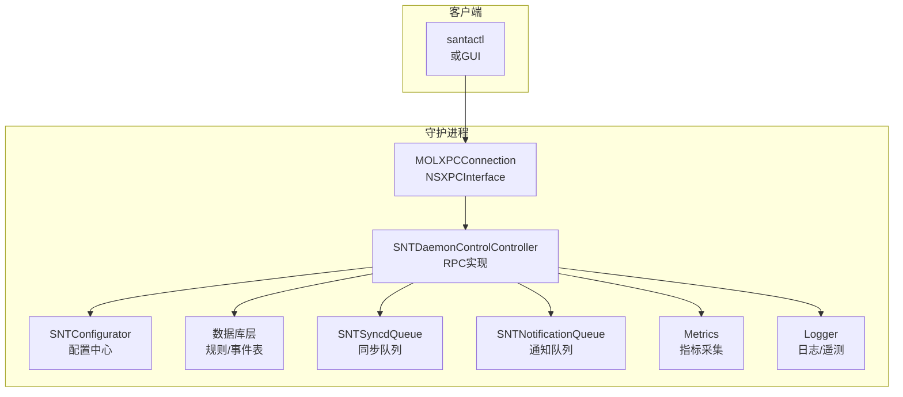
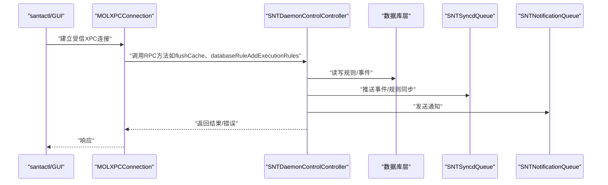
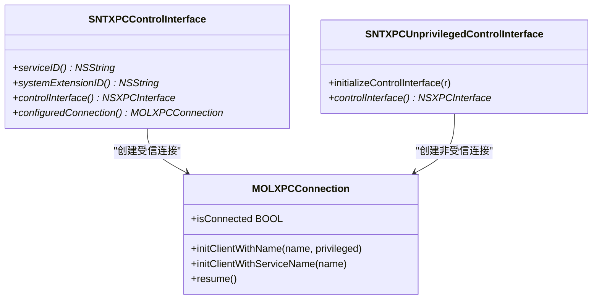
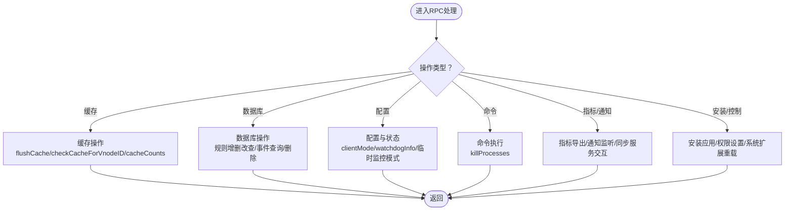
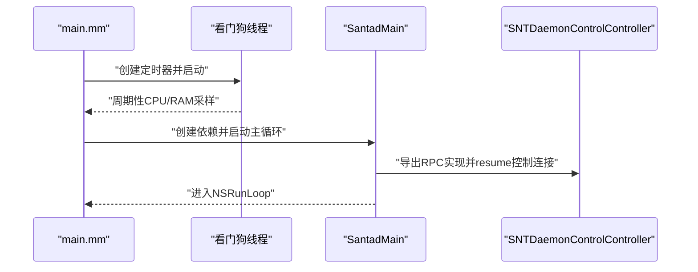
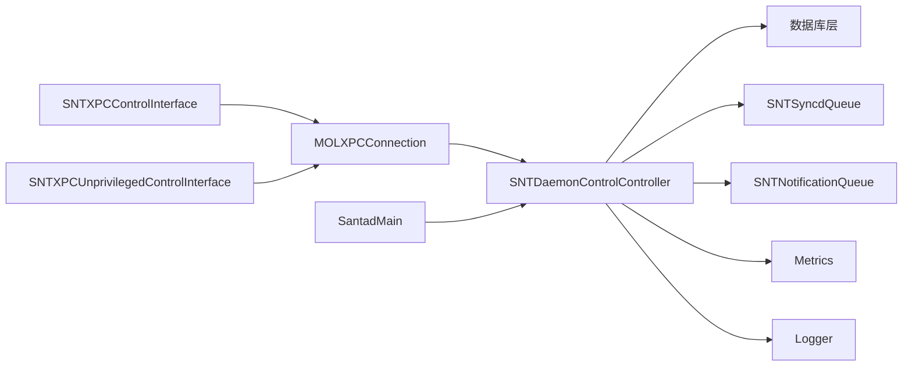

# 守护进程控制

<cite>
**本文引用的文件**
- [SNTDaemonControlController.h](file://Source/santad/SNTDaemonControlController.h)
- [SNTDaemonControlController.mm](file://Source/santad/SNTDaemonControlController.mm)
- [SNTXPCControlInterface.h](file://Source/common/SNTXPCControlInterface.h)
- [SNTXPCControlInterface.mm](file://Source/common/SNTXPCControlInterface.mm)
- [SNTXPCUnprivilegedControlInterface.mm](file://Source/common/SNTXPCUnprivilegedControlInterface.mm)
- [MOLXPCConnection.h](file://Source/common/MOLXPCConnection.h)
- [MOLXPCConnection.mm](file://Source/common/MOLXPCConnection.mm)
- [Santad.h](file://Source/santad/Santad.h)
- [Santad.mm](file://Source/santad/Santad.mm)
- [main.mm](file://Source/santad/main.mm)
- [SNTLogging.h](file://Source/common/SNTLogging.h)
- [Metrics.h](file://Source/santad/Metrics.h)
- [SNTApplicationCoreMetrics.mm](file://Source/santad/SNTApplicationCoreMetrics.mm)
- [SNTAppDelegate.mm](file://Source/gui/SNTAppDelegate.mm)
</cite>

## 目录
1. [引言](#引言)
2. [项目结构](#项目结构)
3. [核心组件](#核心组件)
4. [架构总览](#架构总览)
5. [详细组件分析](#详细组件分析)
6. [依赖关系分析](#依赖关系分析)
7. [性能考虑](#性能考虑)
8. [故障排除指南](#故障排除指南)
9. [结论](#结论)
10. [附录](#附录)

## 引言
本文件面向Santa守护进程（santad）的控制管理器，系统化梳理其控制接口、XPC通信协议、远程方法调用（RPC）、参数验证与生命周期管理。重点覆盖以下方面：
- 控制接口与XPC连接：如何建立受信/非受信连接、接口初始化与类注册、参数校验与错误传播
- 守护进程控制能力：缓存操作、数据库规则与事件、配置读取与更新、命令执行、指标导出、通知与同步服务交互
- 生命周期管理：初始化流程、运行期监控（看门狗）、优雅退出与重启策略
- 健康检查与自动恢复：看门狗CPU/RAM阈值告警、配置变更触发的重启与缓存刷新
- 配置管理与运行时调整：通过KVO监听配置变化并动态调整行为
- 监控与日志：指标采集与导出、日志输出与终端重定向、遥测开关与批处理参数约束

## 项目结构
围绕守护进程控制的关键代码主要分布在以下模块：
- 控制接口与XPC：SNTXPCControlInterface、SNTXPCUnprivilegedControlInterface、MOLXPCConnection
- 控制器实现：SNTDaemonControlController（对外RPC入口）
- 守护进程主流程：SantadMain、main入口、看门狗线程
- 日志与指标：SNTLogging、Metrics、SNTApplicationCoreMetrics
- GUI连接：SNTAppDelegate（用于通知回连）

图表来源
- [SNTDaemonControlController.mm](file://Source/santad/SNTDaemonControlController.mm#L1-L120)
- [SNTXPCControlInterface.mm](file://Source/common/SNTXPCControlInterface.mm#L82-L97)
- [MOLXPCConnection.mm](file://Source/common/MOLXPCConnection.mm#L84-L119)
- [Santad.mm](file://Source/santad/Santad.mm#L84-L120)

章节来源
- [Santad.mm](file://Source/santad/Santad.mm#L84-L120)
- [main.mm](file://Source/santad/main.mm#L104-L151)

## 核心组件
- SNTDaemonControlController：santad对外RPC的实现类，负责缓存、数据库、配置、命令、指标、通知、同步等操作
- SNTXPCControlInterface：受信控制接口的NSXPCInterface构建与MOLXPCConnection配置，支持特权调用
- SNTXPCUnprivilegedControlInterface：非受信控制接口的NSXPCInterface构建，用于GUI/非特权场景
- MOLXPCConnection：XPC连接封装，支持客户端/服务端模式、连接有效性与监听对象设置
- Metrics：指标采集与定时导出，支持启动/停止轮询与间隔调整
- SNTLogging：统一日志宏，支持系统日志与标准输出/错误输出重定向
- 看门狗：基于dispatch_source_t的定时器，周期性检查CPU/RAM使用并记录峰值与事件计数

章节来源
- [SNTDaemonControlController.h](file://Source/santad/SNTDaemonControlController.h#L1-L39)
- [SNTDaemonControlController.mm](file://Source/santad/SNTDaemonControlController.mm#L1-L120)
- [SNTXPCControlInterface.h](file://Source/common/SNTXPCControlInterface.h#L1-L104)
- [SNTXPCControlInterface.mm](file://Source/common/SNTXPCControlInterface.mm#L1-L97)
- [SNTXPCUnprivilegedControlInterface.mm](file://Source/common/SNTXPCUnprivilegedControlInterface.mm#L1-L41)
- [MOLXPCConnection.h](file://Source/common/MOLXPCConnection.h#L149-L163)
- [MOLXPCConnection.mm](file://Source/common/MOLXPCConnection.mm#L84-L119)
- [Metrics.h](file://Source/santad/Metrics.h#L1-L143)
- [SNTLogging.h](file://Source/common/SNTLogging.h#L1-L68)
- [main.mm](file://Source/santad/main.mm#L32-L88)

## 架构总览
守护进程启动后，通过SantadMain完成依赖注入与客户端启用，随后在控制连接上导出SNTDaemonControlController作为RPC入口。santactl/GUI通过SNTXPCControlInterface建立受信XPC连接，调用受控方法；非特权场景通过SNTXPCUnprivilegedControlInterface进行有限交互。

图表来源
- [Santad.mm](file://Source/santad/Santad.mm#L84-L120)
- [SNTDaemonControlController.mm](file://Source/santad/SNTDaemonControlController.mm#L105-L205)
- [SNTXPCControlInterface.mm](file://Source/common/SNTXPCControlInterface.mm#L82-L97)

## 详细组件分析

### 控制接口与XPC通信
- 受信控制接口（SNTXPCControlInterface）
  - 提供服务ID与系统扩展ID解析，确保与签名信息匹配
  - 初始化NSXPCInterface，注册自定义类（如数组、规则、错误等），保证跨进程序列化正确
  - 返回已配置的MOLXPCConnection，设置remoteInterface为受信协议
- 非受信控制接口（SNTXPCUnprivilegedControlInterface）
  - 为GUI等非特权场景提供受限接口，注册必要类以支持bundle事件同步
- 连接封装（MOLXPCConnection）
  - 支持客户端/服务端两种模式，可指定特权标志
  - 提供连接有效性属性与监听对象设置，便于回调与失效处理
- 参数验证
  - 在安装应用、路径校验等敏感操作前进行参数合法性检查，并记录错误日志

图表来源
- [SNTXPCControlInterface.h](file://Source/common/SNTXPCControlInterface.h#L1-L104)
- [SNTXPCControlInterface.mm](file://Source/common/SNTXPCControlInterface.mm#L1-L97)
- [SNTXPCUnprivilegedControlInterface.mm](file://Source/common/SNTXPCUnprivilegedControlInterface.mm#L1-L41)
- [MOLXPCConnection.h](file://Source/common/MOLXPCConnection.h#L149-L163)
- [MOLXPCConnection.mm](file://Source/common/MOLXPCConnection.mm#L84-L119)

章节来源
- [SNTXPCControlInterface.mm](file://Source/common/SNTXPCControlInterface.mm#L28-L97)
- [SNTXPCUnprivilegedControlInterface.mm](file://Source/common/SNTXPCUnprivilegedControlInterface.mm#L1-L41)
- [MOLXPCConnection.mm](file://Source/common/MOLXPCConnection.mm#L84-L119)

### 守护进程控制能力（RPC）
- 缓存操作
  - 获取缓存计数、显式清空缓存、按vnodeID查询决策
- 数据库操作
  - 规则计数统计、批量添加执行规则与文件访问规则、清理策略、删除事件、查询规则、导出规则哈希
- 配置与状态
  - 看门狗信息、监控项状态、客户端模式、同步时间、USB挂载策略、事件上传开关、临时监控模式请求与取消
- 命令执行
  - killProcesses异步执行，避免阻塞XPC消息处理
- 指标与通知
  - 导出指标字典、设置通知监听端点、与同步服务交互查询推送状态
- 安装与控制
  - 验证安装路径签名、设置权限、替换应用并触发系统扩展重载

图表来源
- [SNTDaemonControlController.mm](file://Source/santad/SNTDaemonControlController.mm#L105-L205)
- [SNTDaemonControlController.mm](file://Source/santad/SNTDaemonControlController.mm#L270-L428)
- [SNTDaemonControlController.mm](file://Source/santad/SNTDaemonControlController.mm#L439-L536)
- [SNTDaemonControlController.mm](file://Source/santad/SNTDaemonControlController.mm#L538-L661)

章节来源
- [SNTDaemonControlController.mm](file://Source/santad/SNTDaemonControlController.mm#L105-L205)
- [SNTDaemonControlController.mm](file://Source/santad/SNTDaemonControlController.mm#L270-L428)
- [SNTDaemonControlController.mm](file://Source/santad/SNTDaemonControlController.mm#L439-L536)
- [SNTDaemonControlController.mm](file://Source/santad/SNTDaemonControlController.mm#L538-L661)

### 生命周期管理与运行时监控
- 初始化流程
  - main入口安装系统服务脚本，启动看门狗定时器，创建SantadDeps并调用SantadMain
  - SantadMain中实例化SNTDaemonControlController并导出到控制连接，随后启用设备管理、录制、授权、防篡改等客户端
- 运行时监控
  - 看门狗线程每30秒采样CPU/RAM，超过阈值记录警告并累计事件计数，峰值持续跟踪
- 优雅关闭与重启
  - 配置变更（如事件日志类型）触发数据冲刷与守护进程退出，由系统立即重启
- KVO监听与动态调整
  - 监听客户端模式、正则表达式、USB策略、静态规则、遥测开关与批处理参数等，自动刷新缓存或重启组件

图表来源
- [main.mm](file://Source/santad/main.mm#L104-L151)
- [main.mm](file://Source/santad/main.mm#L32-L88)
- [Santad.mm](file://Source/santad/Santad.mm#L84-L120)

章节来源
- [main.mm](file://Source/santad/main.mm#L32-L88)
- [main.mm](file://Source/santad/main.mm#L104-L151)
- [Santad.mm](file://Source/santad/Santad.mm#L84-L120)
- [Santad.mm](file://Source/santad/Santad.mm#L228-L325)

### 健康检查与自动恢复
- 看门狗机制
  - CPU使用率百分比与RSS内存阈值告警，记录峰值与事件计数，便于定位异常
- 配置驱动的自动重启
  - 当事件日志类型等关键配置变更时，触发数据冲刷与守护进程退出，系统自动重启以应用新配置
- 缓存一致性保障
  - 客户端模式切换、路径正则变化、静态规则变化等均触发缓存清空，确保策略一致性

章节来源
- [main.mm](file://Source/santad/main.mm#L32-L88)
- [Santad.mm](file://Source/santad/Santad.mm#L228-L325)
- [Santad.mm](file://Source/santad/Santad.mm#L438-L452)

### 配置管理与运行时调整
- 配置读取与更新
  - 通过SNTConfigurator集中管理，SNTDaemonControlController提供读取与更新接口
  - 支持同步设置、模式转换、事件详情链接、导出配置等
- 运行时调整
  - 指标导出开关与间隔、遥测开关与批处理参数、静默TTY模式、机器ID装饰等均可热更新
  - 文件访问策略与速率限制参数动态生效

章节来源
- [SNTDaemonControlController.mm](file://Source/santad/SNTDaemonControlController.mm#L270-L428)
- [Santad.mm](file://Source/santad/Santad.mm#L310-L380)
- [Santad.mm](file://Source/santad/Santad.mm#L567-L620)
- [Santad.mm](file://Source/santad/Santad.mm#L620-L745)

### 监控工具、日志分析与遥测
- 指标导出
  - Metrics提供定时轮询与手动导出，支持事件处理耗时、丢弃计数、限流计数、FAA事件计数等
  - SNTApplicationCoreMetrics注册核心指标（如运行模式）
- 日志输出
  - 统一日志宏，支持系统日志与stdout/stderr重定向，便于CLI与GUI调试
- 遥测参数约束
  - 批量阈值、最大文件数、超时等参数存在边界约束，防止异常配置导致资源占用过高

章节来源
- [Metrics.h](file://Source/santad/Metrics.h#L1-L143)
- [SNTApplicationCoreMetrics.mm](file://Source/santad/SNTApplicationCoreMetrics.mm#L1-L34)
- [SNTLogging.h](file://Source/common/SNTLogging.h#L1-L68)
- [Santad.mm](file://Source/santad/Santad.mm#L567-L620)

## 依赖关系分析
- 控制接口对连接与协议的依赖
  - SNTXPCControlInterface依赖MOLXPCConnection与NSXPCInterface，确保受信RPC通道
  - SNTXPCUnprivilegedControlInterface仅用于非特权场景，注册必要类以支持事件同步
- 控制器对子系统的依赖
  - SNTDaemonControlController依赖数据库层、同步队列、通知队列、指标与日志组件
- 主流程对控制器的依赖
  - SantadMain在启动阶段注入并导出SNTDaemonControlController，随后启用各类EndpointSecurity客户端

图表来源
- [SNTXPCControlInterface.mm](file://Source/common/SNTXPCControlInterface.mm#L82-L97)
- [SNTDaemonControlController.mm](file://Source/santad/SNTDaemonControlController.mm#L1-L120)
- [Santad.mm](file://Source/santad/Santad.mm#L84-L120)

章节来源
- [SNTXPCControlInterface.mm](file://Source/common/SNTXPCControlInterface.mm#L82-L97)
- [SNTDaemonControlController.mm](file://Source/santad/SNTDaemonControlController.mm#L1-L120)
- [Santad.mm](file://Source/santad/Santad.mm#L84-L120)

## 性能考虑
- 异步命令执行
  - killProcesses在独立串行队列执行，避免阻塞RPC处理
- 指标导出与日志批处理
  - 指标轮询间隔可调，遥测批处理参数有上下限，防止高负载
- 缓存一致性与刷新
  - 关键配置变更触发缓存清空，减少不一致带来的重复计算与误判
- 看门狗采样频率
  - 固定周期采样，避免频繁开销影响系统性能

章节来源
- [SNTDaemonControlController.mm](file://Source/santad/SNTDaemonControlController.mm#L439-L446)
- [Santad.mm](file://Source/santad/Santad.mm#L310-L380)
- [Santad.mm](file://Source/santad/Santad.mm#L567-L620)
- [main.mm](file://Source/santad/main.mm#L32-L88)

## 故障排除指南
- XPC连接问题
  - 检查服务ID解析是否与签名匹配；确认NSXPCInterface已正确注册自定义类
  - 若连接失效，关注invalidationHandler回调并尝试重新连接
- RPC调用失败
  - 对于规则添加等操作，若返回错误数组，优先检查配置（如同步基地址或静态规则）是否阻止手动规则
  - 对于安装应用，确认路径校验与签名验证通过
- 指标与日志异常
  - 指标未导出：检查exportMetrics开关与轮询间隔；必要时手动触发导出
  - 日志输出异常：检查TEE_LOG宏使用与终端重定向；查看系统日志确认级别
- 配置变更未生效
  - 某些关键配置变更会触发守护进程退出并重启，等待系统自动恢复
  - 遥测参数需满足边界约束，否则会被裁剪至合法范围

章节来源
- [SNTXPCControlInterface.mm](file://Source/common/SNTXPCControlInterface.mm#L28-L97)
- [SNTDaemonControlController.mm](file://Source/santad/SNTDaemonControlController.mm#L159-L201)
- [SNTDaemonControlController.mm](file://Source/santad/SNTDaemonControlController.mm#L603-L633)
- [Santad.mm](file://Source/santad/Santad.mm#L438-L452)
- [Santad.mm](file://Source/santad/Santad.mm#L567-L620)
- [SNTLogging.h](file://Source/common/SNTLogging.h#L1-L68)

## 结论
本文从控制接口、XPC通信、RPC实现、生命周期与健康检查、配置管理与运行时调整、监控与日志等方面，系统化梳理了Santa守护进程控制管理器的设计与实现。通过严格的参数验证、KVO驱动的动态调整、看门狗监控与优雅重启机制，以及完善的指标与日志体系，守护进程能够在复杂运行环境中保持稳定与可观测性。

## 附录
- GUI侧回连机制
  - GUI通过匿名监听器建立回连，通知管理器接收端点并告知守护进程，随后守护进程建立反向通知连接
- 常用RPC清单（示例）
  - 缓存：flushCache、checkCacheForVnodeID、cacheCounts
  - 数据库：databaseRuleAddExecutionRules、databaseEventsPending、databaseRemoveEventsWithIDs
  - 配置：updateSyncSettings、clientMode、watchdogInfo、临时监控模式相关
  - 命令：killProcesses
  - 指标与通知：metrics、setNotificationListener、pushNotificationStatus

章节来源
- [SNTAppDelegate.mm](file://Source/gui/SNTAppDelegate.mm#L121-L151)
- [SNTDaemonControlController.mm](file://Source/santad/SNTDaemonControlController.mm#L105-L205)
- [SNTDaemonControlController.mm](file://Source/santad/SNTDaemonControlController.mm#L270-L428)
- [SNTDaemonControlController.mm](file://Source/santad/SNTDaemonControlController.mm#L439-L536)