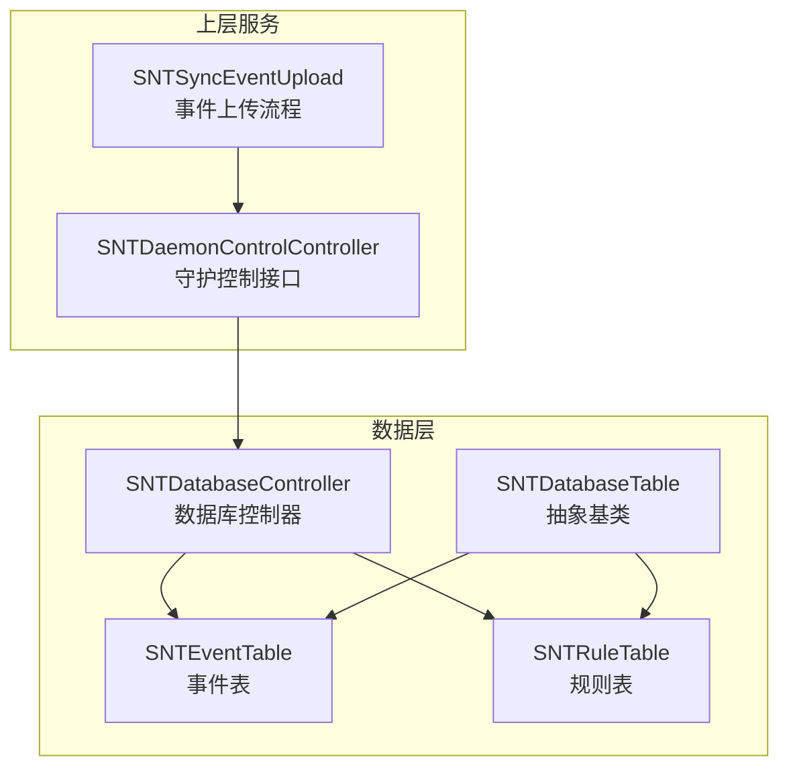
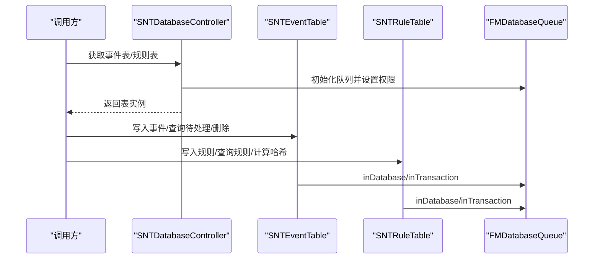
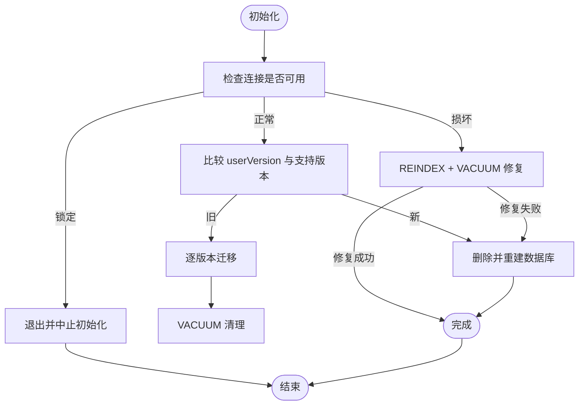
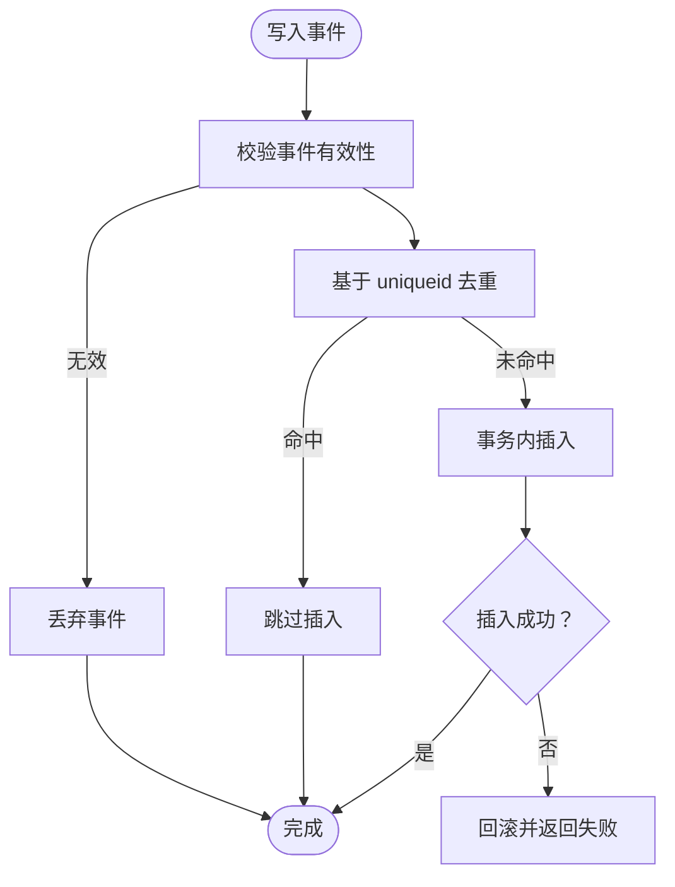
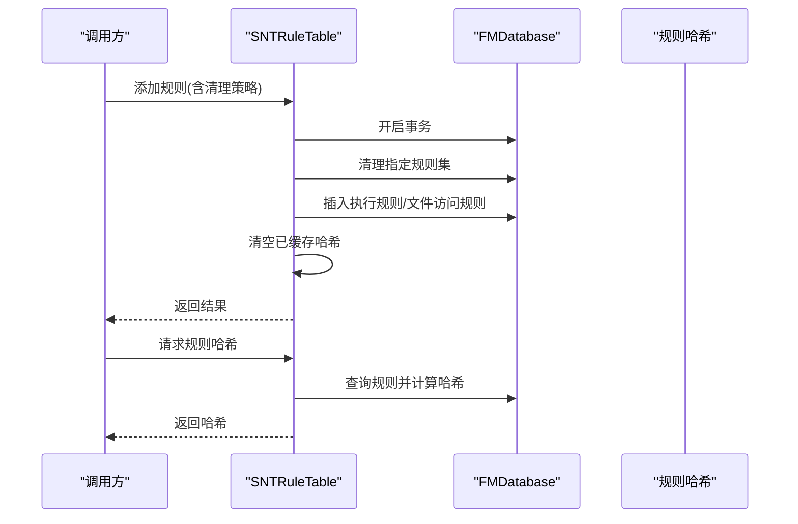
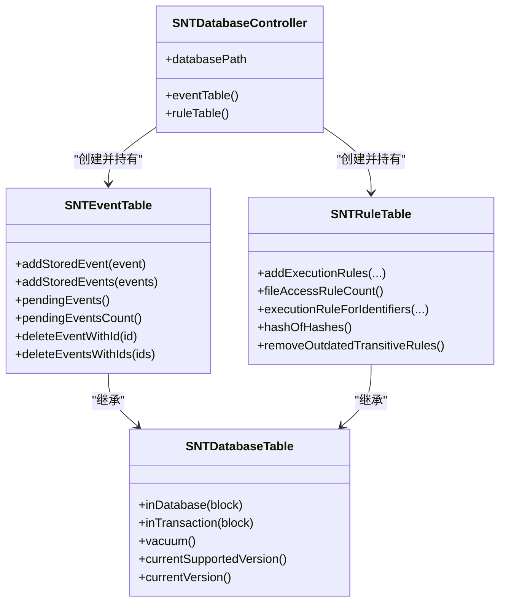

# 数据层管理

<cite>
**本文引用的文件**
- [SNTDatabaseController.h](file://Source/santad/SNTDatabaseController.h)
- [SNTDatabaseController.mm](file://Source/santad/SNTDatabaseController.mm)
- [SNTDatabaseTable.h](file://Source/santad/DataLayer/SNTDatabaseTable.h)
- [SNTDatabaseTable.mm](file://Source/santad/DataLayer/SNTDatabaseTable.mm)
- [SNTEventTable.h](file://Source/santad/DataLayer/SNTEventTable.h)
- [SNTEventTable.mm](file://Source/santad/DataLayer/SNTEventTable.mm)
- [SNTRuleTable.h](file://Source/santad/DataLayer/SNTRuleTable.h)
- [SNTRuleTable.mm](file://Source/santad/DataLayer/SNTRuleTable.mm)
- [SNTDaemonControlController.mm](file://Source/santad/SNTDaemonControlController.mm)
- [SNTSyncEventUpload.mm](file://Source/santasyncservice/SNTSyncEventUpload.mm)
- [databaseRemoveEventsWithIDs.mm](file://Fuzzing/santad/src/databaseRemoveEventsWithIDs.mm)
- [migration.sh](file://Conf/Package/migration.sh)
- [SNTError.h](file://Source/common/SNTError.h)
- [SantaCache.h](file://Source/common/SantaCache.h)
- [SNTXPCUnprivilegedControlInterface.h](file://Source/common/SNTXPCUnprivilegedControlInterface.h)
</cite>

## 目录
1. [简介](#简介)
2. [项目结构](#项目结构)
3. [核心组件](#核心组件)
4. [架构总览](#架构总览)
5. [详细组件分析](#详细组件分析)
6. [依赖关系分析](#依赖关系分析)
7. [性能考量](#性能考量)
8. [故障排查指南](#故障排查指南)
9. [结论](#结论)
10. [附录](#附录)

## 简介
本文件面向 Santa 守护进程的数据层管理系统，系统采用 FMDB/FMDatabaseQueue 提供的数据库访问能力，围绕“事件表(events)”和“规则表(execution_rules + file_access_rules)”构建数据持久化子系统。本文从架构设计、事务与连接池、表结构与索引、数据写入/读取/更新、性能优化、迁移与版本管理、完整性校验与异常恢复、监控与诊断等维度进行深入说明，并辅以图示帮助理解。

## 项目结构
数据层相关代码主要位于以下位置：
- 数据库控制器：负责数据库实例初始化、权限设置、路径管理
- 抽象基类：封装 FMDatabaseQueue 访问、事务、版本迁移、完整性检测与修复
- 事件表：负责事件的入库、去重、查询、删除
- 规则表：负责执行规则与文件访问规则的增删改查、哈希计算、过期清理、缓存与并发控制

图表来源
- [SNTDatabaseController.mm](file://Source/santad/SNTDatabaseController.mm#L34-L79)
- [SNTDatabaseTable.h](file://Source/santad/DataLayer/SNTDatabaseTable.h#L36-L58)
- [SNTEventTable.h](file://Source/santad/DataLayer/SNTEventTable.h#L22-L72)
- [SNTRuleTable.h](file://Source/santad/DataLayer/SNTRuleTable.h#L33-L172)
- [SNTDaemonControlController.mm](file://Source/santad/SNTDaemonControlController.mm#L254-L289)
- [SNTSyncEventUpload.mm](file://Source/santasyncservice/SNTSyncEventUpload.mm#L144-L177)

章节来源
- [SNTDatabaseController.h](file://Source/santad/SNTDatabaseController.h#L15-L40)
- [SNTDatabaseController.mm](file://Source/santad/SNTDatabaseController.mm#L26-L101)
- [SNTDatabaseTable.h](file://Source/santad/DataLayer/SNTDatabaseTable.h#L36-L58)
- [SNTDatabaseTable.mm](file://Source/santad/DataLayer/SNTDatabaseTable.mm#L32-L150)
- [SNTEventTable.h](file://Source/santad/DataLayer/SNTEventTable.h#L22-L72)
- [SNTEventTable.mm](file://Source/santad/DataLayer/SNTEventTable.mm#L42-L103)
- [SNTRuleTable.h](file://Source/santad/DataLayer/SNTRuleTable.h#L33-L172)
- [SNTRuleTable.mm](file://Source/santad/DataLayer/SNTRuleTable.mm#L208-L334)

## 核心组件
- 数据库控制器
  - 负责创建数据库目录、初始化 FMDatabaseQueue、设置权限、提供单例事件/规则表访问入口
- 抽象数据库表基类
  - 统一封装 inDatabase/inTransaction/vacuum
  - 版本迁移 initializeDatabase/fromVersion
  - 完整性检测与修复（损坏时尝试 REINDEX/VACUUM，失败则重建）
- 事件表
  - 事件入库（支持批量、冲突去重）、查询待处理事件、删除事件
  - 基于 uniqueid 的唯一索引，避免重复事件
  - 对“不可采取行动”的事件使用内存缓存进行退避，降低重复写入
- 规则表
  - 执行规则与文件访问规则的增删改查，支持事务一次性提交
  - 哈希计算用于同步一致性校验
  - 过期规则清理、静态规则缓存、决策缓存刷新判断

章节来源
- [SNTDatabaseController.mm](file://Source/santad/SNTDatabaseController.mm#L34-L79)
- [SNTDatabaseTable.mm](file://Source/santad/DataLayer/SNTDatabaseTable.mm#L32-L150)
- [SNTEventTable.mm](file://Source/santad/DataLayer/SNTEventTable.mm#L107-L160)
- [SNTRuleTable.mm](file://Source/santad/DataLayer/SNTRuleTable.mm#L518-L705)

## 架构总览
数据层通过“控制器-抽象基类-具体表”的分层组织，结合 FMDatabaseQueue 实现线程安全的数据库访问；事件与规则分别独立数据库文件，便于隔离与维护。

图表来源
- [SNTDatabaseController.mm](file://Source/santad/SNTDatabaseController.mm#L34-L79)
- [SNTEventTable.mm](file://Source/santad/DataLayer/SNTEventTable.mm#L107-L160)
- [SNTRuleTable.mm](file://Source/santad/DataLayer/SNTRuleTable.mm#L518-L705)
- [SNTDatabaseTable.h](file://Source/santad/DataLayer/SNTDatabaseTable.h#L36-L58)

## 详细组件分析

### 数据库控制器（SNTDatabaseController）
- 职责
  - 创建数据库目录并设置权限
  - 为事件与规则表分别创建 FMDatabaseQueue 并封装为表实例
  - 提供只读数据库路径常量
- 关键点
  - 使用 dispatch_once 确保单例
  - 设置数据库文件属主与权限，保证安全性
  - 在非调试构建中关闭底层错误日志，减少噪声

章节来源
- [SNTDatabaseController.h](file://Source/santad/SNTDatabaseController.h#L15-L40)
- [SNTDatabaseController.mm](file://Source/santad/SNTDatabaseController.mm#L26-L101)

### 抽象数据库表基类（SNTDatabaseTable）
- 职责
  - 封装 inDatabase/inTransaction/vacuum
  - 版本迁移：根据 userVersion 逐步升级到当前支持版本
  - 完整性检测：PRAGMA integrity_check；损坏时尝试 REINDEX/VACUUM；仍失败则重建
- 设计要点
  - 子类需实现 currentSupportedVersion/currentVersion
  - 初始化阶段对锁状态、版本、损坏情况进行统一处理

图表来源
- [SNTDatabaseTable.mm](file://Source/santad/DataLayer/SNTDatabaseTable.mm#L32-L150)

章节来源
- [SNTDatabaseTable.h](file://Source/santad/DataLayer/SNTDatabaseTable.h#L36-L58)
- [SNTDatabaseTable.mm](file://Source/santad/DataLayer/SNTDatabaseTable.mm#L32-L150)

### 事件表（SNTEventTable）
- 表结构与索引
  - 历史版本演进：从 filesha256 列到 uniqueid 列，建立唯一索引，确保去重
  - 当前版本：idx 主键、uniqueid 唯一索引、eventdata BLOB
- 写入逻辑
  - 支持单条与批量写入
  - 使用 INSERT ... ON CONFLICT(uniqueid) DO NOTHING 实现幂等去重
  - 对“不可采取行动”的事件使用内存缓存退避，避免短时间重复写入
- 读取与删除
  - 查询待处理事件总数与列表
  - 删除单条或多条事件

图表来源
- [SNTEventTable.mm](file://Source/santad/DataLayer/SNTEventTable.mm#L107-L160)
- [SNTEventTable.mm](file://Source/santad/DataLayer/SNTEventTable.mm#L162-L172)

章节来源
- [SNTEventTable.h](file://Source/santad/DataLayer/SNTEventTable.h#L22-L72)
- [SNTEventTable.mm](file://Source/santad/DataLayer/SNTEventTable.mm#L42-L103)
- [SNTEventTable.mm](file://Source/santad/DataLayer/SNTEventTable.mm#L107-L160)
- [SNTEventTable.mm](file://Source/santad/DataLayer/SNTEventTable.mm#L162-L172)

### 规则表（SNTRuleTable）
- 表结构与索引
  - 执行规则：execution_rules（identifier, state, type, custommsg, customurl, timestamp, comment, cel_expr），identifier+type 唯一索引
  - 文件访问规则：file_access_rules（name 主键, rule_data BLOB）
- 写入逻辑
  - 支持执行规则与文件访问规则的批量写入，统一在事务中提交
  - 支持多种清理策略（全量、仅非传递、仅执行规则、仅文件访问规则、无清理）
  - 写入后清空已缓存的规则哈希，确保后续一致性
- 查询与哈希
  - 按优先级顺序查询匹配规则（CDHash > Binary > SigningID > Certificate > TeamID）
  - 计算执行规则与文件访问规则的哈希，用于同步一致性校验
- 过期清理与缓存
  - 定期清理过期传递规则（超过阈值时间戳）
  - 静态规则缓存，加速决策路径
  - 决策缓存刷新判断：当新增阻断或覆盖编译器规则时触发

图表来源
- [SNTRuleTable.mm](file://Source/santad/DataLayer/SNTRuleTable.mm#L518-L705)
- [SNTRuleTable.mm](file://Source/santad/DataLayer/SNTRuleTable.mm#L888-L936)

章节来源
- [SNTRuleTable.h](file://Source/santad/DataLayer/SNTRuleTable.h#L33-L172)
- [SNTRuleTable.mm](file://Source/santad/DataLayer/SNTRuleTable.mm#L208-L334)
- [SNTRuleTable.mm](file://Source/santad/DataLayer/SNTRuleTable.mm#L518-L705)
- [SNTRuleTable.mm](file://Source/santad/DataLayer/SNTRuleTable.mm#L888-L936)

### 数据访问层抽象与事务管理
- 抽象基类提供统一的 inDatabase/inTransaction 包装，子类无需关心底层队列与锁细节
- 事务语义
  - 规则批量写入：要么全部成功，要么整体回滚
  - 事件批量写入：逐条插入，冲突去重，失败时逐条停止
- 连接池控制
  - 通过 FMDatabaseQueue 实现并发安全的串行化执行，避免锁竞争

章节来源
- [SNTDatabaseTable.h](file://Source/santad/DataLayer/SNTDatabaseTable.h#L36-L58)
- [SNTDatabaseTable.mm](file://Source/santad/DataLayer/SNTDatabaseTable.mm#L136-L148)
- [SNTRuleTable.mm](file://Source/santad/DataLayer/SNTRuleTable.mm#L651-L688)
- [SNTEventTable.mm](file://Source/santad/DataLayer/SNTEventTable.mm#L147-L159)

### 事件上传与删除联动
- 同步上传完成后，会调用守护端接口批量删除已上传事件，避免重复上报
- 该流程在上传批次达到阈值或最终一批时执行

章节来源
- [SNTSyncEventUpload.mm](file://Source/santasyncservice/SNTSyncEventUpload.mm#L144-L177)
- [databaseRemoveEventsWithIDs.mm](file://Fuzzing/santad/src/databaseRemoveEventsWithIDs.mm#L28-L51)

## 依赖关系分析
- 控制器依赖 FMDB/FMDatabaseQueue 提供的数据库访问能力
- 事件/规则表继承自抽象基类，复用版本迁移与完整性检测逻辑
- 上层服务通过 XPC 接口与守护交互，间接触发数据库操作
- 错误码集中定义，便于统一处理与诊断

图表来源
- [SNTDatabaseController.h](file://Source/santad/SNTDatabaseController.h#L15-L40)
- [SNTDatabaseTable.h](file://Source/santad/DataLayer/SNTDatabaseTable.h#L36-L58)
- [SNTEventTable.h](file://Source/santad/DataLayer/SNTEventTable.h#L22-L72)
- [SNTRuleTable.h](file://Source/santad/DataLayer/SNTRuleTable.h#L33-L172)

章节来源
- [SNTDatabaseController.h](file://Source/santad/SNTDatabaseController.h#L15-L40)
- [SNTDatabaseTable.h](file://Source/santad/DataLayer/SNTDatabaseTable.h#L36-L58)
- [SNTEventTable.h](file://Source/santad/DataLayer/SNTEventTable.h#L22-L72)
- [SNTRuleTable.h](file://Source/santad/DataLayer/SNTRuleTable.h#L33-L172)

## 性能考量
- 批量操作
  - 事件写入：批量归档为字典，事务内逐条插入，冲突去重
  - 规则写入：事务内统一清理与插入，避免部分失败导致的不一致
- 缓存机制
  - 事件层：对“不可采取行动”的事件使用内存缓存退避，降低重复写入
  - 规则层：静态规则缓存、规则哈希缓存、关键系统二进制预判
- 并发控制
  - 使用 FMDatabaseQueue 串行化执行，避免锁竞争
  - 事件写入使用唯一索引避免重复，减少无效写入
- 查询优化
  - 事件表：uniqueid 唯一索引，支持快速去重与定位
  - 规则表：identifier+type 唯一索引，查询时按优先级顺序命中
- 其他
  - 定期清理过期传递规则，控制规则表规模
  - 决策缓存刷新策略：在规则变更可能影响既有决策时触发

章节来源
- [SNTEventTable.mm](file://Source/santad/DataLayer/SNTEventTable.mm#L107-L160)
- [SNTEventTable.mm](file://Source/santad/DataLayer/SNTEventTable.mm#L162-L172)
- [SNTRuleTable.mm](file://Source/santad/DataLayer/SNTRuleTable.mm#L518-L705)
- [SNTRuleTable.mm](file://Source/santad/DataLayer/SNTRuleTable.mm#L783-L800)
- [SantaCache.h](file://Source/common/SantaCache.h#L73-L162)

## 故障排查指南
- 数据库损坏与修复
  - 初始化阶段检测 integrity_check，若损坏先尝试 REINDEX/VACUUM，仍失败则删除并重建
- 锁定与权限
  - 若数据库被其他进程锁定，记录警告并中止初始化
  - 数据库文件属主与权限由控制器统一设置，确保安全
- 错误码与诊断
  - 规则写入失败、删除失败、CEL 表达式非法等错误码集中定义，便于定位问题
  - 守护端 XPC 接口可查询规则数量、事件数量、规则哈希等，辅助诊断
- 事件重复与丢失
  - 事件写入使用唯一索引与去重逻辑；如出现重复上报，检查 uniqueid 生成与上传后删除流程

章节来源
- [SNTDatabaseTable.mm](file://Source/santad/DataLayer/SNTDatabaseTable.mm#L32-L150)
- [SNTDatabaseController.mm](file://Source/santad/SNTDatabaseController.mm#L34-L79)
- [SNTError.h](file://Source/common/SNTError.h#L32-L67)
- [SNTDaemonControlController.mm](file://Source/santad/SNTDaemonControlController.mm#L254-L289)

## 结论
Santa 的数据层以 FMDatabaseQueue 为核心，通过抽象基类统一处理版本迁移、完整性检测与修复，事件与规则表分别承担各自职责并通过事务保障一致性。系统在性能方面采用批量写入、缓存与索引优化，在可靠性方面具备完善的错误处理与异常恢复机制。配合 XPC 接口与监控指标，能够有效支撑生产环境下的稳定运行。

## 附录

### 数据表结构与索引策略
- 事件表（events）
  - 字段：idx（主键）、uniqueid（唯一索引）、eventdata（BLOB）
  - 索引：uniqueid 唯一索引，用于去重与快速定位
- 规则表（execution_rules）
  - 字段：identifier、state、type、custommsg、customurl、timestamp、comment、cel_expr
  - 索引：identifier+type 唯一索引，查询时按优先级命中
- 文件访问规则表（file_access_rules）
  - 字段：name（主键）、rule_data（BLOB）

章节来源
- [SNTEventTable.mm](file://Source/santad/DataLayer/SNTEventTable.mm#L52-L103)
- [SNTRuleTable.mm](file://Source/santad/DataLayer/SNTRuleTable.mm#L294-L334)
- [SNTRuleTable.mm](file://Source/santad/DataLayer/SNTRuleTable.mm#L404-L424)

### 数据持久化实现机制
- 写入
  - 事件：序列化对象为 BLOB，唯一索引去重，事务内插入
  - 规则：校验合法性，事务内清理与插入，失败回滚
- 读取
  - 事件：COUNT(*) 统计、全量扫描解档
  - 规则：按优先级查询匹配规则，或导出全部规则
- 更新
  - 规则：INSERT OR REPLACE 或 DELETE，保持原子性
  - 事件：通过唯一索引避免重复，必要时删除旧记录再插入

章节来源
- [SNTEventTable.mm](file://Source/santad/DataLayer/SNTEventTable.mm#L174-L203)
- [SNTRuleTable.mm](file://Source/santad/DataLayer/SNTRuleTable.mm#L562-L619)

### 数据迁移与版本管理
- 事件表版本演进
  - v1→v2：清空数据并重建
  - v3：去除 AUTOINCREMENT
  - v4：添加唯一索引并清理重复
  - v5：列名与索引调整为 uniqueid
- 规则表版本演进
  - 多次 ALTER/RENAME/ADD COLUMN，最终形成执行规则与文件访问规则双表结构
  - 引入 cel_expr、timestamp、comment 等字段，增强规则表达能力
- 迁移脚本
  - 包安装包中的迁移脚本用于从旧版 Santa 迁移到新版，确保系统扩展与数据文件的平滑切换

章节来源
- [SNTEventTable.mm](file://Source/santad/DataLayer/SNTEventTable.mm#L52-L103)
- [SNTRuleTable.mm](file://Source/santad/DataLayer/SNTRuleTable.mm#L212-L334)
- [migration.sh](file://Conf/Package/migration.sh#L1-L41)

### 数据完整性检查、错误处理与异常恢复
- 完整性检查：PRAGMA integrity_check；损坏时 REINDEX/VACUUM，仍失败则重建
- 锁定处理：检测 SQLITE_LOCKED，记录警告并中止初始化
- 错误码：规则写入、删除、CEL 表达式等错误码集中定义
- 异常恢复：初始化阶段统一处理版本不匹配、损坏数据库等情况

章节来源
- [SNTDatabaseTable.mm](file://Source/santad/DataLayer/SNTDatabaseTable.mm#L32-L150)
- [SNTError.h](file://Source/common/SNTError.h#L32-L67)

### 监控工具、性能分析与故障诊断
- XPC 接口
  - 提供规则数量、事件数量、规则哈希等查询能力，便于诊断
- 事件上传与删除联动
  - 上传成功后删除已上传事件，避免重复上报
- 诊断建议
  - 关注事件重复率与规则哈希变化，定位规则下发异常
  - 监控数据库文件大小与索引状态，定期执行 VACUUM

章节来源
- [SNTXPCUnprivilegedControlInterface.h](file://Source/common/SNTXPCUnprivilegedControlInterface.h#L39-L59)
- [SNTDaemonControlController.mm](file://Source/santad/SNTDaemonControlController.mm#L254-L289)
- [SNTSyncEventUpload.mm](file://Source/santasyncservice/SNTSyncEventUpload.mm#L144-L177)