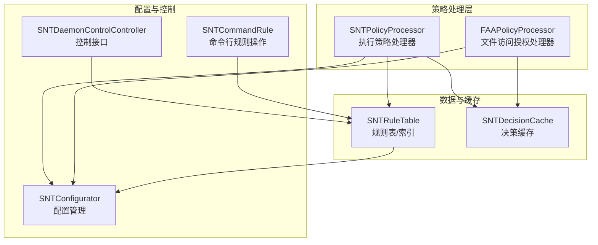
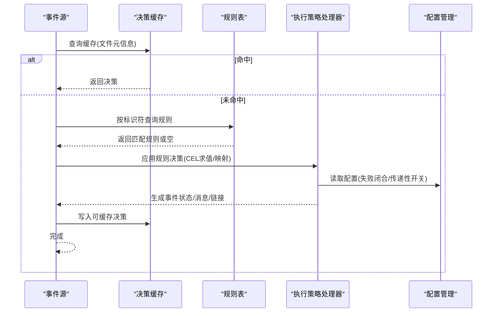
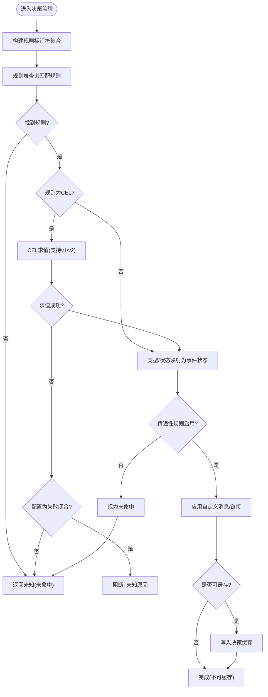
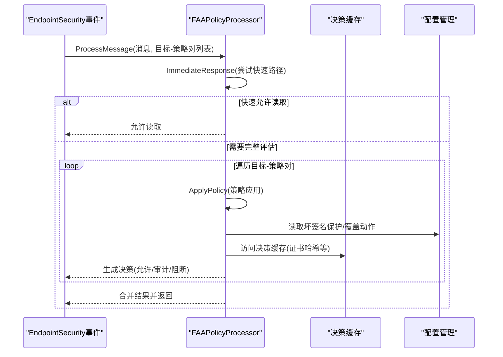
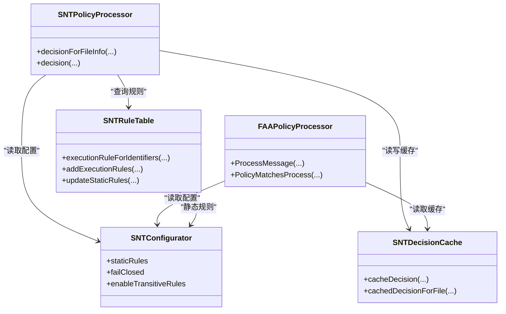
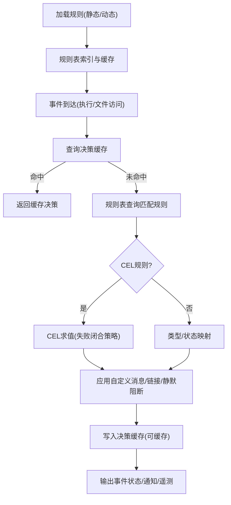

# 策略处理引擎

<cite>
**本文引用的文件**
- [SNTPolicyProcessor.h](file://Source/santad/SNTPolicyProcessor.h)
- [SNTPolicyProcessor.mm](file://Source/santad/SNTPolicyProcessor.mm)
- [FAAPolicyProcessor.h](file://Source/santad/EventProviders/FAAPolicyProcessor.h)
- [FAAPolicyProcessor.mm](file://Source/santad/EventProviders/FAAPolicyProcessor.mm)
- [SNTDecisionCache.h](file://Source/santad/SNTDecisionCache.h)
- [SNTDecisionCacheTest.mm](file://Source/santad/SNTDecisionCacheTest.mm)
- [SNTRuleTable.h](file://Source/santad/DataLayer/SNTRuleTable.h)
- [SNTRuleTable.mm](file://Source/santad/DataLayer/SNTRuleTable.mm)
- [SNTRuleTableTest.mm](file://Source/santad/DataLayer/SNTRuleTableTest.mm)
- [SNTConfigurator.h](file://Source/common/SNTConfigurator.h)
- [SNTCachedDecision.h](file://Source/common/SNTCachedDecision.h)
- [SNTRule.h](file://Source/common/SNTRule.h)
- [Santad.mm](file://Source/santad/Santad.mm)
- [SNTDaemonControlController.mm](file://Source/santad/SNTDaemonControlController.mm)
- [SNTCommandRule.mm](file://Source/santactl/Commands/SNTCommandRule.mm)
- [SNTExecutionController.mm](file://Source/santad/SNTExecutionController.mm)
- [Santacache Fuzzer main.cpp](file://Fuzzing/santacache/src/main.cpp)
</cite>

## 目录
1. [简介](#简介)
2. [项目结构](#项目结构)
3. [核心组件](#核心组件)
4. [架构总览](#架构总览)
5. [详细组件分析](#详细组件分析)
6. [依赖关系分析](#依赖关系分析)
7. [性能考量](#性能考量)
8. [故障排查指南](#故障排查指南)
9. [结论](#结论)
10. [附录](#附录)

## 简介
本文件面向Santa守护进程的策略处理引擎，系统化阐述其架构设计、规则匹配算法、优先级与决策生成流程，并覆盖静态规则、动态规则与FAA（文件访问授权）规则的处理机制。文档还解释了从规则加载到决策输出的完整执行流程，策略缓存与索引优化、查询性能提升技术，以及与配置管理系统的集成（含实时规则更新与策略热加载）。最后提供策略调试工具、规则测试方法与性能分析技术，以及规则编写指南与最佳实践。

## 项目结构
策略处理引擎主要由以下模块构成：
- 执行策略处理器：负责基于规则表与配置对执行事件进行决策，支持CEL表达式与编译器/传递性规则。
- 文件访问授权（FAA）策略处理器：负责文件读写访问事件的策略评估与即时响应。
- 决策缓存：缓存已计算的决策，避免重复计算并加速后续命中。
- 规则表：持久化与索引规则，支持静态规则、动态规则与清理策略。
- 配置管理：集中管理客户端模式、失败闭合、静态规则、路径正则等全局策略。
- 控制接口与命令行：提供规则增删查改、统计查询与热加载能力。

图表来源
- [SNTPolicyProcessor.h](file://Source/santad/SNTPolicyProcessor.h#L1-L77)
- [FAAPolicyProcessor.h](file://Source/santad/EventProviders/FAAPolicyProcessor.h#L1-L121)
- [SNTDecisionCache.h](file://Source/santad/SNTDecisionCache.h#L1-L35)
- [SNTRuleTable.h](file://Source/santad/DataLayer/SNTRuleTable.h#L1-L172)
- [SNTConfigurator.h](file://Source/common/SNTConfigurator.h#L1-L200)
- [SNTDaemonControlController.mm](file://Source/santad/SNTDaemonControlController.mm#L122-L157)
- [SNTCommandRule.mm](file://Source/santactl/Commands/SNTCommandRule.mm#L125-L155)

章节来源
- [SNTPolicyProcessor.h](file://Source/santad/SNTPolicyProcessor.h#L1-L77)
- [FAAPolicyProcessor.h](file://Source/santad/EventProviders/FAAPolicyProcessor.h#L1-L121)
- [SNTDecisionCache.h](file://Source/santad/SNTDecisionCache.h#L1-L35)
- [SNTRuleTable.h](file://Source/santad/DataLayer/SNTRuleTable.h#L1-L172)
- [SNTConfigurator.h](file://Source/common/SNTConfigurator.h#L1-L200)
- [SNTDaemonControlController.mm](file://Source/santad/SNTDaemonControlController.mm#L122-L157)
- [SNTCommandRule.mm](file://Source/santactl/Commands/SNTCommandRule.mm#L125-L155)

## 核心组件
- 执行策略处理器（SNTPolicyProcessor）
  - 负责根据规则类型与状态映射生成最终事件状态；支持CEL v1/v2表达式求值；处理静默阻断、传递性规则与编译器规则；应用自定义消息与链接。
- 文件访问授权处理器（FAAPolicyProcessor）
  - 面向文件读写事件，快速判定是否允许或审计；支持即时返回、速率限制、TTY通知与遥测记录；维护多类缓存以降低重复计算成本。
- 决策缓存（SNTDecisionCache）
  - 基于文件元信息缓存决策结果，支持重置时间戳、异步回填与按inode键查找。
- 规则表（SNTRuleTable）
  - 提供规则计数、索引查询、批量添加、清理策略、静态规则缓存与哈希校验；支持判断是否需要刷新内核决策缓存。
- 配置管理（SNTConfigurator）
  - 提供客户端模式、失败闭合、静态规则、路径正则、文件变更过滤、FAA日志速率限制等全局开关与阈值。
- 控制接口与命令行
  - 提供规则统计查询、手动规则增删（在未启用中心化管理时）、KVO监听静态规则变化并热更新。

章节来源
- [SNTPolicyProcessor.mm](file://Source/santad/SNTPolicyProcessor.mm#L105-L304)
- [FAAPolicyProcessor.mm](file://Source/santad/EventProviders/FAAPolicyProcessor.mm#L140-L339)
- [SNTDecisionCache.h](file://Source/santad/SNTDecisionCache.h#L1-L35)
- [SNTRuleTable.h](file://Source/santad/DataLayer/SNTRuleTable.h#L1-L172)
- [SNTConfigurator.h](file://Source/common/SNTConfigurator.h#L1-L200)
- [SNTDaemonControlController.mm](file://Source/santad/SNTDaemonControlController.mm#L122-L157)
- [SNTCommandRule.mm](file://Source/santactl/Commands/SNTCommandRule.mm#L125-L155)

## 架构总览
策略处理引擎采用“规则表驱动 + 缓存加速 + 配置控制”的分层架构：
- 输入：执行事件（二进制执行、签名信息、证书链、团队ID、签名ID、cdhash）与文件访问事件（读写、克隆、复制等）。
- 处理：先查缓存，未命中则通过规则表定位匹配规则；若为CEL规则则求值；根据规则类型/状态映射生成事件状态；应用自定义消息与链接；必要时设置静默阻断或要求TouchID。
- 输出：事件状态、是否可缓存、是否需要进一步处理（如等待用户确认）。

图表来源
- [SNTDecisionCache.h](file://Source/santad/SNTDecisionCache.h#L1-L35)
- [SNTRuleTable.h](file://Source/santad/DataLayer/SNTRuleTable.h#L1-L172)
- [SNTPolicyProcessor.mm](file://Source/santad/SNTPolicyProcessor.mm#L105-L304)
- [SNTConfigurator.h](file://Source/common/SNTConfigurator.h#L1-L200)

## 详细组件分析

### 执行策略处理器（SNTPolicyProcessor）
- 规则匹配与优先级
  - 依据RuleIdentifiers（二进制SHA256、证书SHA256、SigningID、TeamID、cdhash）与规则类型/状态进行匹配。
  - 类型/状态到事件状态的映射表确保一致且可预期的决策结果。
  - 传递性规则（AllowCompiler/AllowTransitive）受配置开关控制；禁用时视为未匹配。
  - 静默阻断（SilentBlock）标记后不弹窗通知。
- CEL表达式求值
  - 支持v1/v2两种激活对象；表达式求值失败时，若配置为失败闭合则阻断，否则不作决策。
  - 表达式返回值映射为允许/阻断/静默阻断等；REQUIRE_TOUCHID分支设置holdAndAsk并不可缓存。
- 决策生成
  - 应用自定义消息与链接；根据平台二进制状态修正SigningID/TeamID；对权限集进行过滤并记录是否被过滤。
- 性能与缓存
  - 通过决策缓存避免重复计算；CEL求值仅在需要时进行；类型/状态映射使用常量时间查找表。

图表来源
- [SNTPolicyProcessor.mm](file://Source/santad/SNTPolicyProcessor.mm#L105-L304)
- [SNTRuleTable.h](file://Source/santad/DataLayer/SNTRuleTable.h#L1-L172)
- [SNTConfigurator.h](file://Source/common/SNTConfigurator.h#L1-L200)

章节来源
- [SNTPolicyProcessor.h](file://Source/santad/SNTPolicyProcessor.h#L1-L77)
- [SNTPolicyProcessor.mm](file://Source/santad/SNTPolicyProcessor.mm#L105-L304)
- [SNTRule.h](file://Source/common/SNTRule.h#L1-L129)
- [SNTCachedDecision.h](file://Source/common/SNTCachedDecision.h#L1-L61)

### 文件访问授权处理器（FAAPolicyProcessor）
- 即时响应与快速路径
  - 对于允许读取的场景（如写操作但策略允许读取目标），可直接返回允许读取的结果，避免完整策略评估。
- 进程匹配与签名检查
  - 严格比对平台二进制、TeamID、SigningID（支持前后缀通配）、cdhash、证书SHA256与二进制路径等；未签名进程不得携带签名相关要求。
- 策略应用与覆盖
  - 若进程签名无效且启用“坏签名保护”，直接拒绝；随后根据策略决定允许、审计或阻断；支持全局覆盖动作（审计/禁用）。
- 缓存与速率限制
  - 维护读取历史、TTY消息去重、证书哈希缓存；支持修改日志速率限制参数；对遥测与TTY输出进行速率控制。
- 事件处理序列
  - 遍历每个目标-策略对，计算 FileAccessPolicyDecision；合并结果生成ES授权结果；记录遥测与TTY通知。

图表来源
- [FAAPolicyProcessor.h](file://Source/santad/EventProviders/FAAPolicyProcessor.h#L1-L242)
- [FAAPolicyProcessor.mm](file://Source/santad/EventProviders/FAAPolicyProcessor.mm#L140-L339)
- [SNTConfigurator.h](file://Source/common/SNTConfigurator.h#L1-L200)

章节来源
- [FAAPolicyProcessor.h](file://Source/santad/EventProviders/FAAPolicyProcessor.h#L1-L242)
- [FAAPolicyProcessor.mm](file://Source/santad/EventProviders/FAAPolicyProcessor.mm#L140-L339)

### 决策缓存（SNTDecisionCache）
- 功能要点
  - 以文件stat信息为键缓存SNTCachedDecision；支持删除、重置时间戳、异步回填。
  - 测试覆盖包括基本操作、时间戳重置逻辑与规则表交互。
- 性能意义
  - 显著减少重复规则查询与CEL求值开销；对高频执行事件尤为关键。

章节来源
- [SNTDecisionCache.h](file://Source/santad/SNTDecisionCache.h#L1-L35)
- [SNTDecisionCacheTest.mm](file://Source/santad/SNTDecisionCacheTest.mm#L40-L103)

### 规则表（SNTRuleTable）
- 功能要点
  - 提供执行规则与文件访问规则的增删改查、批量添加、清理策略与哈希校验；维护静态规则缓存；支持判断是否需要刷新内核决策缓存。
  - 对传递性规则的过期清理与时间戳重置；对大量新增阻断规则触发缓存刷新。
- 与配置的集成
  - 通过KVO监听静态规则变化，实时更新规则表中的静态规则缓存。

章节来源
- [SNTRuleTable.h](file://Source/santad/DataLayer/SNTRuleTable.h#L1-L172)
- [SNTRuleTable.mm](file://Source/santad/DataLayer/SNTRuleTable.mm#L37-L788)
- [Santad.mm](file://Source/santad/Santad.mm#L399-L416)
- [SNTRuleTableTest.mm](file://Source/santad/DataLayer/SNTRuleTableTest.mm#L631-L688)

### 配置管理（SNTConfigurator）
- 关键配置项
  - 客户端模式、失败闭合、静态规则、路径正则、文件变更前缀过滤、坏签名保护、FAA日志速率限制、传递性规则开关等。
- 与策略引擎的耦合
  - 执行策略处理器读取失败闭合与传递性开关；FAA处理器读取坏签名保护与覆盖动作；控制接口用于查询规则统计与导出规则。

章节来源
- [SNTConfigurator.h](file://Source/common/SNTConfigurator.h#L1-L200)
- [SNTDaemonControlController.mm](file://Source/santad/SNTDaemonControlController.mm#L122-L157)

### 控制接口与命令行
- 控制接口
  - 提供规则统计查询、静态规则数量、检索全部执行规则（在未启用中心化管理时）。
- 命令行规则操作
  - 在未设置同步基地址或静态规则时，禁止手动增删规则；DEBUG构建下可通过特定标志绕过限制。
- 执行控制器
  - 在独立模式下为新二进制自动添加允许规则并入库。

章节来源
- [SNTDaemonControlController.mm](file://Source/santad/SNTDaemonControlController.mm#L224-L256)
- [SNTCommandRule.mm](file://Source/santactl/Commands/SNTCommandRule.mm#L125-L155)
- [SNTExecutionController.mm](file://Source/santad/SNTExecutionController.mm#L543-L575)

## 依赖关系分析
- 组件耦合
  - SNTPolicyProcessor依赖SNTRuleTable、SNTDecisionCache与SNTConfigurator；FAAPolicyProcessor依赖SNTDecisionCache、SNTConfigurator与日志/指标组件。
  - SNTRuleTable与SNTConfigurator通过KVO联动，实现静态规则的热加载。
- 外部依赖
  - CEL表达式求值器（v1/v2）；SQLite数据库（通过规则表封装）；EndpointSecurity事件模型。
- 循环依赖
  - 当前实现未见循环依赖迹象；各模块职责清晰，接口边界明确。

图表来源
- [SNTPolicyProcessor.h](file://Source/santad/SNTPolicyProcessor.h#L1-L77)
- [FAAPolicyProcessor.h](file://Source/santad/EventProviders/FAAPolicyProcessor.h#L1-L121)
- [SNTRuleTable.h](file://Source/santad/DataLayer/SNTRuleTable.h#L1-L172)
- [SNTDecisionCache.h](file://Source/santad/SNTDecisionCache.h#L1-L35)
- [SNTConfigurator.h](file://Source/common/SNTConfigurator.h#L1-L200)

## 性能考量
- 缓存与索引
  - 决策缓存：以文件stat为键，避免重复规则匹配与CEL求值。
  - 证书哈希缓存：复用已有决策或代码签名检查结果，减少重复哈希计算。
  - 静态规则缓存：规则表内部缓存静态规则，避免频繁解析。
- 查询优化
  - 规则表提供按标识符的快速查询；传递性规则定期清理，防止规则膨胀影响查询。
  - 前缀树用于文件变更过滤，减少内核与用户态通信开销。
- 速率限制与日志节流
  - FAA日志速率限制可调，避免高并发下的日志风暴。
- 调试与压测
  - 提供SantaCache模糊测试入口，验证缓存一致性与性能边界。

章节来源
- [FAAPolicyProcessor.mm](file://Source/santad/EventProviders/FAAPolicyProcessor.mm#L140-L339)
- [SNTRuleTable.mm](file://Source/santad/DataLayer/SNTRuleTable.mm#L37-L788)
- [Santacache Fuzzer main.cpp](file://Fuzzing/santacache/src/main.cpp#L1-L43)

## 故障排查指南
- 规则未生效
  - 检查规则类型/标识符是否正确；确认传递性规则开关；核查CEL表达式是否可求值。
- 决策缓存异常
  - 使用缓存重置接口重置时间戳；确认规则表是否触发了缓存刷新逻辑。
- 静态规则未热加载
  - 确认KVO回调是否被触发；检查配置是否正确更新。
- 手动规则操作受限
  - 若设置了同步基地址或静态规则，则禁止手动增删规则；DEBUG构建下可使用特定标志进行测试。

章节来源
- [SNTDecisionCacheTest.mm](file://Source/santad/SNTDecisionCacheTest.mm#L40-L103)
- [SNTRuleTableTest.mm](file://Source/santad/DataLayer/SNTRuleTableTest.mm#L631-L688)
- [Santad.mm](file://Source/santad/Santad.mm#L399-L416)
- [SNTCommandRule.mm](file://Source/santactl/Commands/SNTCommandRule.mm#L125-L155)

## 结论
Santa的策略处理引擎通过“规则表 + 决策缓存 + 配置控制”的架构实现了高效、可扩展的策略评估。执行策略处理器与FAA处理器分别覆盖二进制执行与文件访问两大场景，结合CEL表达式、传递性规则与静默阻断等能力，满足复杂安全策略需求。通过缓存、索引与速率限制等优化手段，系统在高并发场景下仍能保持稳定性能。配置管理与热加载机制确保策略可随环境动态调整。

## 附录

### 策略评估执行流程（从规则加载到决策输出）

图表来源
- [SNTRuleTable.h](file://Source/santad/DataLayer/SNTRuleTable.h#L1-L172)
- [SNTPolicyProcessor.mm](file://Source/santad/SNTPolicyProcessor.mm#L105-L304)
- [FAAPolicyProcessor.mm](file://Source/santad/EventProviders/FAAPolicyProcessor.mm#L140-L339)

### 策略调试工具与规则测试方法
- 单元测试
  - 执行策略处理器测试覆盖规则匹配、传递性规则、CEL表达式求值与静默阻断等场景。
  - 决策缓存测试覆盖基本操作、时间戳重置与规则表交互。
  - 规则表测试覆盖大量阻断规则触发缓存刷新、编译器规则覆盖等。
- 命令行工具
  - 在未启用中心化管理时，可使用命令行进行规则增删与导出；DEBUG构建下可使用特定标志绕过限制以便测试。
- 模糊测试
  - 提供SantaCache模糊测试入口，验证缓存一致性与边界行为。

章节来源
- [SNTPolicyProcessorTest.mm](file://Source/santad/SNTPolicyProcessorTest.mm#L1-L98)
- [SNTDecisionCacheTest.mm](file://Source/santad/SNTDecisionCacheTest.mm#L40-L103)
- [SNTRuleTableTest.mm](file://Source/santad/DataLayer/SNTRuleTableTest.mm#L631-L688)
- [SNTCommandRule.mm](file://Source/santactl/Commands/SNTCommandRule.mm#L125-L155)
- [Santacache Fuzzer main.cpp](file://Fuzzing/santacache/src/main.cpp#L1-L43)

### 策略规则编写指南与最佳实践
- 规则类型选择
  - 二进制SHA256：精确控制单个二进制；适合关键系统工具或白名单。
  - 证书SHA256/SigningID/TeamID/cdhash：更灵活的范围控制；注意平台二进制与TeamID的组合约束。
- 传递性规则
  - 合理使用AllowCompiler/AllowTransitive；在生产环境谨慎开启，避免意外传播。
- CEL表达式
  - 使用v2表达式以获得更强能力；确保表达式健壮，避免失败闭合导致误阻断。
  - 对REQUIRE_TOUCHID场景，考虑用户体验与安全平衡。
- 自定义消息与链接
  - 提供清晰的阻断原因与自助处置指引，提升可观测性与可运维性。
- 静态规则
  - 作为中心化管理的补充或替代方案；通过KVO实现热加载，避免重启。
- 性能与稳定性
  - 避免过多细粒度规则；定期清理过期传递性规则；监控缓存命中率与CEL求值耗时。

章节来源
- [SNTRule.h](file://Source/common/SNTRule.h#L1-L129)
- [SNTConfigurator.h](file://Source/common/SNTConfigurator.h#L1-L200)
- [SNTRuleTable.mm](file://Source/santad/DataLayer/SNTRuleTable.mm#L37-L788)
- [Santad.mm](file://Source/santad/Santad.mm#L399-L416)