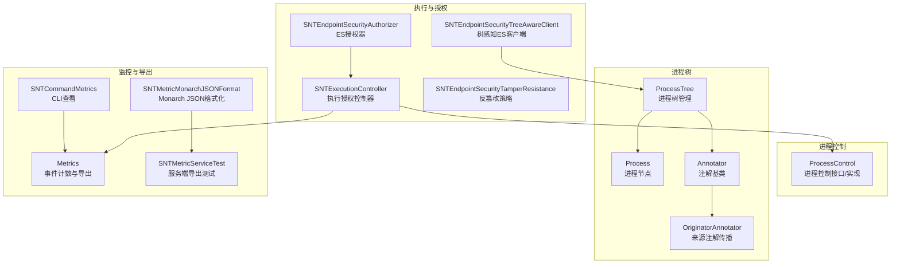
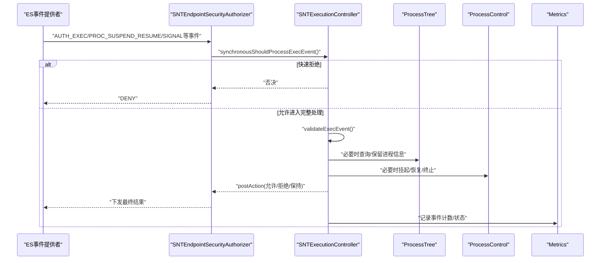
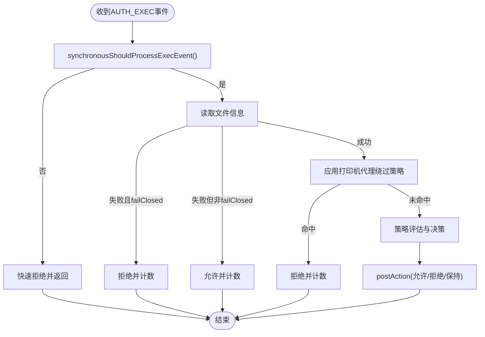
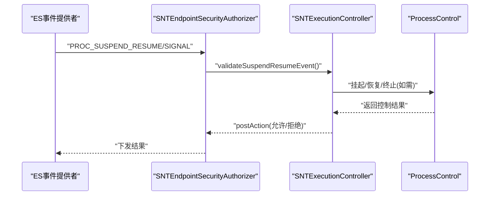
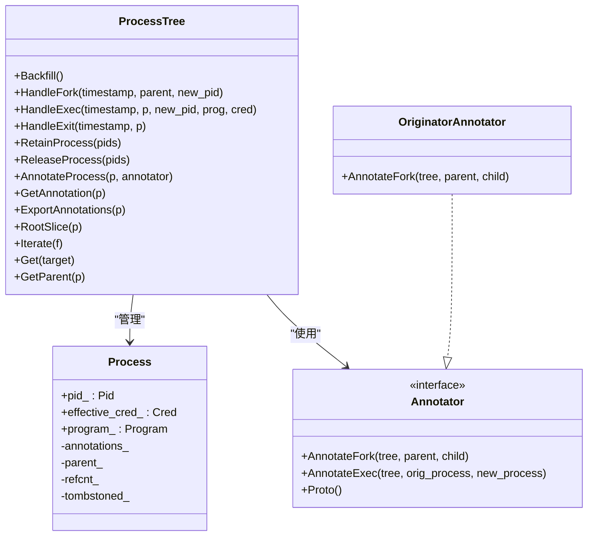
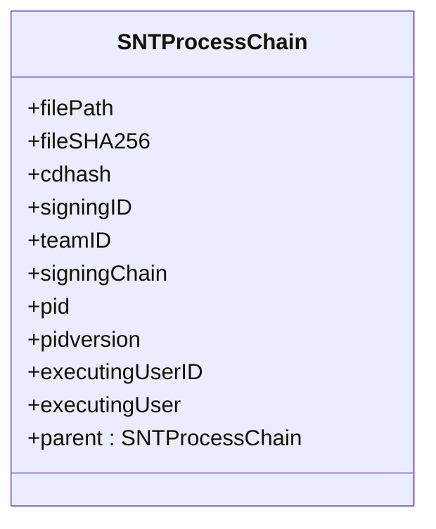
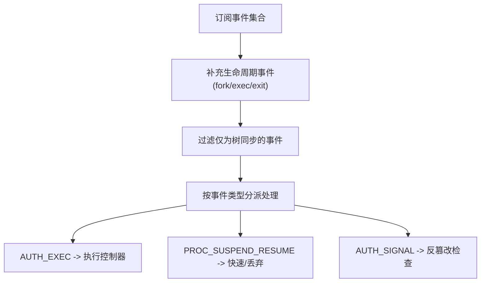
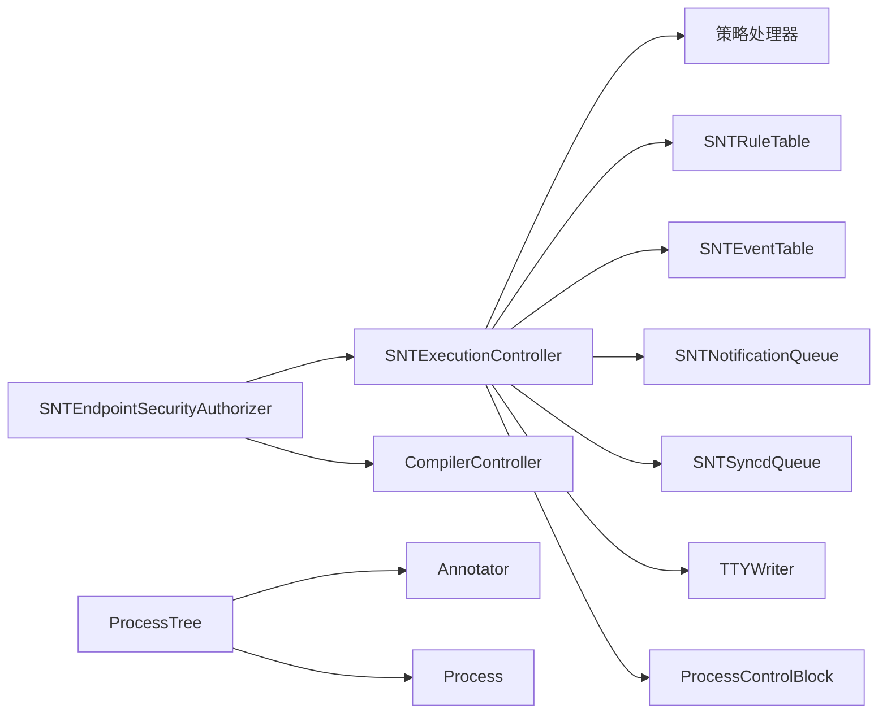

# 进程控制系统

<cite>
**本文引用的文件**
- [ProcessControl.h](file://Source/santad/ProcessControl.h)
- [ProcessControl.mm](file://Source/santad/ProcessControl.mm)
- [SNTExecutionController.h](file://Source/santad/SNTExecutionController.h)
- [SNTExecutionController.mm](file://Source/santad/SNTExecutionController.mm)
- [SNTEndpointSecurityAuthorizer.mm](file://Source/santad/EventProviders/SNTEndpointSecurityAuthorizer.mm)
- [SNTEndpointSecurityTreeAwareClient.mm](file://Source/santad/EventProviders/SNTEndpointSecurityTreeAwareClient.mm)
- [SNTEndpointSecurityTamperResistance.mm](file://Source/santad/EventProviders/SNTEndpointSecurityTamperResistance.mm)
- [process_tree.h](file://Source/santad/ProcessTree/process_tree.h)
- [process_tree.cc](file://Source/santad/ProcessTree/process_tree.cc)
- [process.h](file://Source/santad/ProcessTree/process.h)
- [annotator.h](file://Source/santad/ProcessTree/annotations/annotator.h)
- [originator.cc](file://Source/santad/ProcessTree/annotations/originator.cc)
- [SNTProcessChain.h](file://Source/common/SNTProcessChain.h)
- [SNTProcessChainTest.mm](file://Source/common/SNTProcessChainTest.mm)
- [Metrics.mm](file://Source/santad/Metrics.mm)
- [SNTMetricServiceTest.mm](file://Source/santametricservice/SNTMetricServiceTest.mm)
- [SNTMetricMonarchJSONFormat.mm](file://Source/santametricservice/Formats/SNTMetricMonarchJSONFormat.mm)
- [SNTCommandMetrics.mm](file://Source/santactl/Commands/SNTCommandMetrics.mm)
- [troubleshooting.md](file://docs/docs/deployment/troubleshooting.md)
- [binary-authorization.md](file://docs/docs/features/binary-authorization.md)
</cite>

## 目录
1. [引言](#引言)
2. [项目结构](#项目结构)
3. [核心组件](#核心组件)
4. [架构总览](#架构总览)
5. [详细组件分析](#详细组件分析)
6. [依赖分析](#依赖分析)
7. [性能考虑](#性能考虑)
8. [故障排除指南](#故障排除指南)
9. [结论](#结论)
10. [附录：配置与监控](#附录配置与监控)

## 引言
本技术文档聚焦Santa守护进程的“进程控制系统”，围绕以下目标展开：进程执行授权、进程树管理、进程信号与暂停/恢复处理、执行控制器的生命周期与权限决策、进程链追踪（父进程识别、关系建立、树构建）、与系统扩展（ES）的协作、安全机制（权限校验、反篡改、恶意行为检测）、监控与调试、性能优化以及配置与排障。文档在每个章节中均给出与仓库源码对应的“章节来源”和“图表来源”，确保可追溯性。

## 项目结构
Santa的进程控制相关代码主要分布在以下模块：
- 执行控制器：负责二进制执行授权、快速同步预判、决策下发与后续处理
- 进程控制：封装对进程的挂起/恢复/终止等操作
- 进程树：维护系统进程关系、注解传播、生命周期事件处理
- 系统扩展适配层：与Endpoint Security事件提供者交互，处理执行、暂停/恢复、信号等事件
- 安全与反篡改：针对特定路径、命令、信号、自身受保护等策略
- 监控与指标：事件计数、导出格式化、CLI查看与服务端导出
- 配置与排障：官方文档中的部署与排障指引

图表来源
- [SNTExecutionController.h](file://Source/santad/SNTExecutionController.h#L63-L106)
- [SNTEndpointSecurityAuthorizer.mm](file://Source/santad/EventProviders/SNTEndpointSecurityAuthorizer.mm#L152-L220)
- [SNTEndpointSecurityTreeAwareClient.mm](file://Source/santad/EventProviders/SNTEndpointSecurityTreeAwareClient.mm#L50-L72)
- [SNTEndpointSecurityTamperResistance.mm](file://Source/santad/EventProviders/SNTEndpointSecurityTamperResistance.mm#L81-L231)
- [ProcessControl.h](file://Source/santad/ProcessControl.h#L18-L30)
- [ProcessControl.mm](file://Source/santad/ProcessControl.mm#L27-L56)
- [process_tree.h](file://Source/santad/ProcessTree/process_tree.h#L34-L110)
- [process.h](file://Source/santad/ProcessTree/process.h#L30-L110)
- [annotator.h](file://Source/santad/ProcessTree/annotations/annotator.h#L23-L41)
- [originator.cc](file://Source/santad/ProcessTree/annotations/originator.cc#L30-L36)
- [Metrics.mm](file://Source/santad/Metrics.mm#L301-L337)
- [SNTCommandMetrics.mm](file://Source/santactl/Commands/SNTCommandMetrics.mm#L99-L132)
- [SNTMetricMonarchJSONFormat.mm](file://Source/santametricservice/Formats/SNTMetricMonarchJSONFormat.mm#L199-L248)
- [SNTMetricServiceTest.mm](file://Source/santametricservice/SNTMetricServiceTest.mm#L194-L233)

章节来源
- [SNTExecutionController.h](file://Source/santad/SNTExecutionController.h#L63-L106)
- [process_tree.h](file://Source/santad/ProcessTree/process_tree.h#L34-L110)

## 核心组件
- 执行控制器（SNTExecutionController）
  - 负责接收ES执行事件，进行快速同步预判，调用策略处理器生成决策，向内核下发结果，并在需要时持久化事件、通知GUI、触发用户交互或编译器透传。
  - 提供“轻量同步处理”接口，保证不阻塞线程，避免事件积压。
- 进程控制（ProcessControl）
  - 封装对进程的挂起/恢复/终止操作，优先使用系统提供的弱导入函数；若不可用则回退到发送致命信号的方式。
- 进程树（ProcessTree）
  - 维护进程父子关系、注解传播、生命周期事件（fork/exec/exit），支持保留/释放以应对异步处理场景。
- 系统扩展适配（SNTEndpointSecurityAuthorizer/Client）
  - 订阅必要的ES事件类型，处理执行授权、暂停/恢复、信号等事件，协调执行控制器与进程树。
- 反篡改（SNTEndpointSecurityTamperResistance）
  - 对特定路径、命令、信号、自身受保护等进行安全检查，防止恶意利用或自我攻击。
- 监控与导出（Metrics、CLI、格式化）
  - 汇总事件计数、序列化导出、CLI美化输出、服务端Monarch JSON格式化。

章节来源
- [SNTExecutionController.h](file://Source/santad/SNTExecutionController.h#L63-L106)
- [SNTExecutionController.mm](file://Source/santad/SNTExecutionController.mm#L183-L233)
- [ProcessControl.h](file://Source/santad/ProcessControl.h#L18-L30)
- [ProcessControl.mm](file://Source/santad/ProcessControl.mm#L27-L56)
- [process_tree.h](file://Source/santad/ProcessTree/process_tree.h#L34-L110)
- [SNTEndpointSecurityAuthorizer.mm](file://Source/santad/EventProviders/SNTEndpointSecurityAuthorizer.mm#L152-L220)
- [SNTEndpointSecurityTamperResistance.mm](file://Source/santad/EventProviders/SNTEndpointSecurityTamperResistance.mm#L81-L231)
- [Metrics.mm](file://Source/santad/Metrics.mm#L301-L337)
- [SNTCommandMetrics.mm](file://Source/santactl/Commands/SNTCommandMetrics.mm#L99-L132)
- [SNTMetricMonarchJSONFormat.mm](file://Source/santametricservice/Formats/SNTMetricMonarchJSONFormat.mm#L199-L248)

## 架构总览
下图展示从ES事件到执行决策、进程控制与进程树更新、再到监控导出的整体流程。

图表来源
- [SNTEndpointSecurityAuthorizer.mm](file://Source/santad/EventProviders/SNTEndpointSecurityAuthorizer.mm#L152-L220)
- [SNTExecutionController.mm](file://Source/santad/SNTExecutionController.mm#L183-L233)
- [ProcessControl.mm](file://Source/santad/ProcessControl.mm#L27-L56)
- [process_tree.h](file://Source/santad/ProcessTree/process_tree.h#L62-L100)
- [Metrics.mm](file://Source/santad/Metrics.mm#L301-L337)

## 详细组件分析

### 执行控制器：进程生命周期管理、权限检查与执行决策
- 生命周期管理
  - 接收ES执行事件，先进行“轻量同步处理”，决定是否进入完整处理，避免阻塞。
  - 在完整处理阶段，读取文件信息、应用工作绕过策略、调用策略处理器生成决策、缓存决策、持久化事件、通知GUI等。
- 权限检查
  - 文件信息读取失败时，依据配置采取“闭合/开放”策略，确保在异常情况下仍能维持安全边界。
  - 针对打印机代理等已知场景采用特殊处理逻辑。
- 执行决策
  - 决策结果通过回调传递给授权器，授权器再向ES下发允许/拒绝。
  - 对于编译器类进程，采用“允许编译器”策略并标记，避免重复缓存影响后续实例。

图表来源
- [SNTExecutionController.h](file://Source/santad/SNTExecutionController.h#L90-L106)
- [SNTExecutionController.mm](file://Source/santad/SNTExecutionController.mm#L183-L233)
- [SNTEndpointSecurityAuthorizer.mm](file://Source/santad/EventProviders/SNTEndpointSecurityAuthorizer.mm#L152-L220)

章节来源
- [SNTExecutionController.h](file://Source/santad/SNTExecutionController.h#L63-L106)
- [SNTExecutionController.mm](file://Source/santad/SNTExecutionController.mm#L183-L233)

### 进程控制：进程执行授权与信号处理
- 授权与控制
  - 通过统一的ProcessControlBlock接口封装挂起/恢复/终止操作，优先使用系统弱导入函数；不可用时回退到致命信号。
  - 在暂停/恢复事件中，根据事件类型决定是否允许或直接丢弃，避免不必要的处理。
- 信号处理
  - 反篡改模块对信号事件进行严格检查，例如禁止对自身进行挂起/恢复，阻止危险命令组合，防止恶意利用。

图表来源
- [ProcessControl.h](file://Source/santad/ProcessControl.h#L18-L30)
- [ProcessControl.mm](file://Source/santad/ProcessControl.mm#L27-L56)
- [SNTEndpointSecurityAuthorizer.mm](file://Source/santad/EventProviders/SNTEndpointSecurityAuthorizer.mm#L152-L220)
- [SNTEndpointSecurityTamperResistance.mm](file://Source/santad/EventProviders/SNTEndpointSecurityTamperResistance.mm#L215-L231)

章节来源
- [ProcessControl.h](file://Source/santad/ProcessControl.h#L18-L30)
- [ProcessControl.mm](file://Source/santad/ProcessControl.mm#L27-L56)
- [SNTEndpointSecurityAuthorizer.mm](file://Source/santad/EventProviders/SNTEndpointSecurityAuthorizer.mm#L152-L220)
- [SNTEndpointSecurityTamperResistance.mm](file://Source/santad/EventProviders/SNTEndpointSecurityTamperResistance.mm#L215-L231)

### 进程树：父进程识别、关系建立与树构建
- 关系建立
  - 通过fork/exec/exit事件逐步构建父子关系；exec会更新程序与凭证信息，fork会复制注解。
- 注解传播
  - 注解器Annotator定义了fork/exec时的注解传播接口；OriginatorAnnotator示例展示了如何将注解沿父到子传播。
- 生命周期与保留
  - 支持“保留进程”以应对异步处理场景；通过时间戳滚动窗口确保事件仅被处理一次，避免乱序带来的重复处理。

图表来源
- [process_tree.h](file://Source/santad/ProcessTree/process_tree.h#L34-L110)
- [process_tree.h](file://Source/santad/ProcessTree/process_tree.h#L110-L189)
- [process.h](file://Source/santad/ProcessTree/process.h#L30-L110)
- [annotator.h](file://Source/santad/ProcessTree/annotations/annotator.h#L23-L41)
- [originator.cc](file://Source/santad/ProcessTree/annotations/originator.cc#L30-L36)

章节来源
- [process_tree.h](file://Source/santad/ProcessTree/process_tree.h#L34-L110)
- [process_tree.cc](file://Source/santad/ProcessTree/process_tree.cc#L37-L68)
- [process.h](file://Source/santad/ProcessTree/process.h#L30-L110)
- [annotator.h](file://Source/santad/ProcessTree/annotations/annotator.h#L23-L41)
- [originator.cc](file://Source/santad/ProcessTree/annotations/originator.cc#L30-L36)

### 进程链追踪：父进程识别与进程树构建
- 进程链模型
  - SNTProcessChain用于序列化单个进程及其父级链路，包含可选的签名信息、用户信息、进程ID与版本等。
- 验证与编码
  - 单元测试覆盖了链路编码/解码、nil值处理、层级关系断言，确保链路完整性。

图表来源
- [SNTProcessChain.h](file://Source/common/SNTProcessChain.h#L19-L56)
- [SNTProcessChainTest.mm](file://Source/common/SNTProcessChainTest.mm#L130-L159)

章节来源
- [SNTProcessChain.h](file://Source/common/SNTProcessChain.h#L19-L56)
- [SNTProcessChainTest.mm](file://Source/common/SNTProcessChainTest.mm#L130-L159)

### 与系统扩展的协作：ES事件处理与进程状态同步
- 订阅与最小事件集
  - 树感知客户端自动补充必要的生命周期事件（fork/exec/exit），确保进程树一致性，同时过滤掉仅为树同步目的而订阅的事件。
- 授权与处理
  - 授权器按事件类型分派处理逻辑，执行事件进入执行控制器，暂停/恢复事件按类型快速响应或丢弃，其他事件进行安全检查。

图表来源
- [SNTEndpointSecurityTreeAwareClient.mm](file://Source/santad/EventProviders/SNTEndpointSecurityTreeAwareClient.mm#L50-L72)
- [SNTEndpointSecurityAuthorizer.mm](file://Source/santad/EventProviders/SNTEndpointSecurityAuthorizer.mm#L152-L220)
- [SNTEndpointSecurityTamperResistance.mm](file://Source/santad/EventProviders/SNTEndpointSecurityTamperResistance.mm#L215-L231)

章节来源
- [SNTEndpointSecurityTreeAwareClient.mm](file://Source/santad/EventProviders/SNTEndpointSecurityTreeAwareClient.mm#L50-L72)
- [SNTEndpointSecurityAuthorizer.mm](file://Source/santad/EventProviders/SNTEndpointSecurityAuthorizer.mm#L152-L220)
- [SNTEndpointSecurityTamperResistance.mm](file://Source/santad/EventProviders/SNTEndpointSecurityTamperResistance.mm#L215-L231)

### 安全机制：权限验证、沙箱限制与恶意进程检测
- 权限验证
  - 文件信息读取失败时，依据配置决定“闭合/开放”策略，避免因系统异常导致的过度放行。
- 沙箱限制
  - 对特定路径（如数据库、规则库、应用前缀）与命令（如launchctl）进行白名单/黑名单检查，防止越权操作。
- 恶意进程检测
  - 阻止对自身进行挂起/恢复，拦截危险参数组合，防止利用系统扩展API进行自我攻击或滥用。

章节来源
- [SNTExecutionController.mm](file://Source/santad/SNTExecutionController.mm#L204-L233)
- [SNTEndpointSecurityTamperResistance.mm](file://Source/santad/EventProviders/SNTEndpointSecurityTamperResistance.mm#L81-L231)

## 依赖分析
- 组件耦合
  - 执行控制器依赖策略处理器、规则表、事件表、通知队列、同步队列、TTY写入器与进程控制块。
  - 授权器依赖执行控制器与编译器控制器，负责事件分派与缓存策略。
  - 进程树依赖注解器，支持fork/exec时的状态传播。
- 外部依赖
  - Endpoint Security API、系统弱导入函数（pid_suspend/pid_resume）、日志与指标服务接口。

图表来源
- [SNTExecutionController.h](file://Source/santad/SNTExecutionController.h#L63-L106)
- [SNTEndpointSecurityAuthorizer.mm](file://Source/santad/EventProviders/SNTEndpointSecurityAuthorizer.mm#L152-L220)
- [process_tree.h](file://Source/santad/ProcessTree/process_tree.h#L34-L110)

章节来源
- [SNTExecutionController.h](file://Source/santad/SNTExecutionController.h#L63-L106)
- [process_tree.h](file://Source/santad/ProcessTree/process_tree.h#L34-L110)

## 性能考虑
- 快速同步预判
  - 执行控制器提供“轻量同步处理”接口，避免阻塞线程，降低事件积压风险。
- 缓存与注解
  - 决策缓存减少重复计算；注解传播避免重复解析，提升树遍历效率。
- 指标导出与批处理
  - 指标聚合后批量导出，减少频繁I/O；CLI与服务端格式化支持美化输出与标准化结构。

章节来源
- [SNTExecutionController.h](file://Source/santad/SNTExecutionController.h#L93-L106)
- [Metrics.mm](file://Source/santad/Metrics.mm#L301-L337)
- [SNTCommandMetrics.mm](file://Source/santactl/Commands/SNTCommandMetrics.mm#L99-L132)
- [SNTMetricMonarchJSONFormat.mm](file://Source/santametricservice/Formats/SNTMetricMonarchJSONFormat.mm#L199-L248)

## 故障排除指南
- 常见问题定位
  - 使用状态命令确认守护进程运行状态；启用医生命令检查配置与潜在问题。
  - 确认系统扩展已激活并启用；若处于“等待用户批准”，需在系统设置中开启。
  - 查看守护进程日志，定位启动失败或运行期错误。
- 企业部署
  - 通过MDM确认监督关系与配置文件生效；确保系统扩展与TCC/PPPC配置正确。
- 功能验证
  - 结合状态输出与日志、遥测理解实际行为；参考二进制授权文档了解规则优先级与决策流程。

章节来源
- [troubleshooting.md](file://docs/docs/deployment/troubleshooting.md#L1-L116)
- [binary-authorization.md](file://docs/docs/features/binary-authorization.md#L1-L448)

## 结论
Santa的进程控制系统通过“执行控制器+进程树+系统扩展适配+反篡改+监控导出”的协同，实现了对进程执行的精细化授权、对进程关系的可靠追踪、对信号与暂停/恢复的严格控制，以及在复杂场景下的安全与性能平衡。建议在生产环境中结合配置文档与监控工具持续观察事件分布与决策趋势，以优化规则与策略。

## 附录：配置与监控
- 规则与策略
  - 规则类型与优先级、作用域、客户端模式等详见官方文档。
- 指标与导出
  - CLI支持美化输出与JSON导出；服务端支持Monarch JSON格式化；指标服务通过XPC连接导出。
- 文档与实践
  - 参考二进制授权与部署排障文档，结合实际业务场景调整规则与阈值。

章节来源
- [binary-authorization.md](file://docs/docs/features/binary-authorization.md#L1-L448)
- [SNTCommandMetrics.mm](file://Source/santactl/Commands/SNTCommandMetrics.mm#L99-L132)
- [SNTMetricMonarchJSONFormat.mm](file://Source/santametricservice/Formats/SNTMetricMonarchJSONFormat.mm#L199-L248)
- [SNTMetricServiceTest.mm](file://Source/santametricservice/SNTMetricServiceTest.mm#L194-L233)
- [Metrics.mm](file://Source/santad/Metrics.mm#L301-L337)