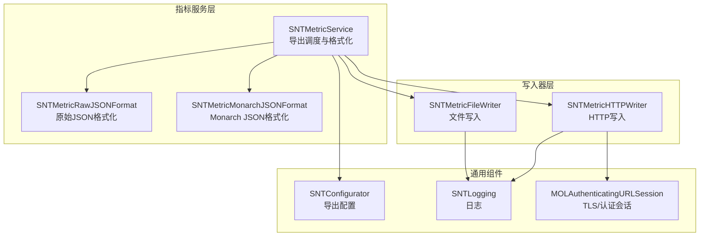
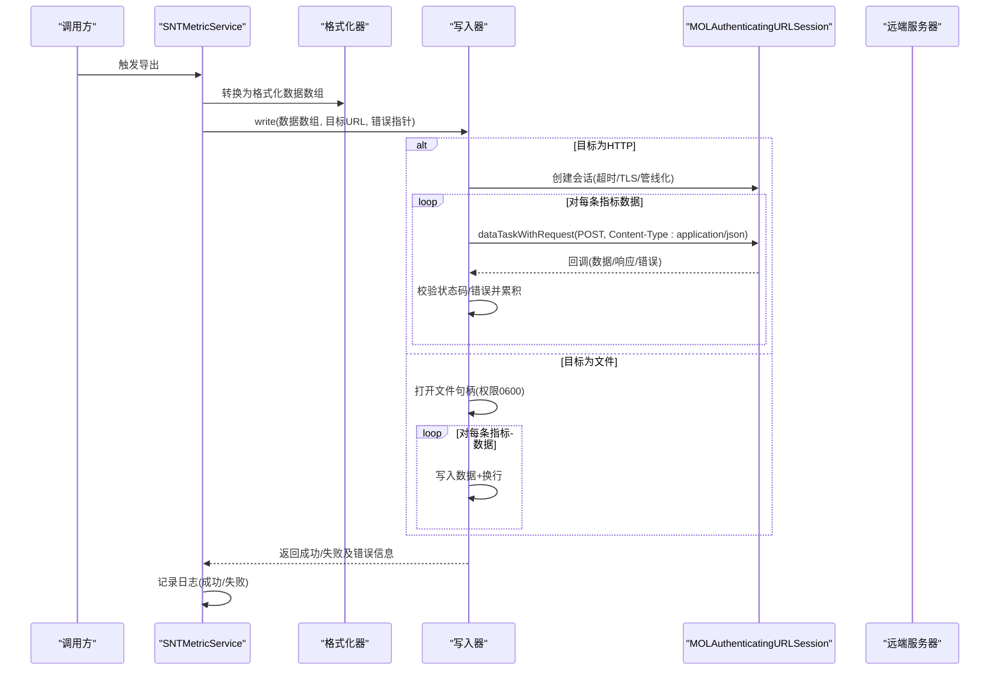
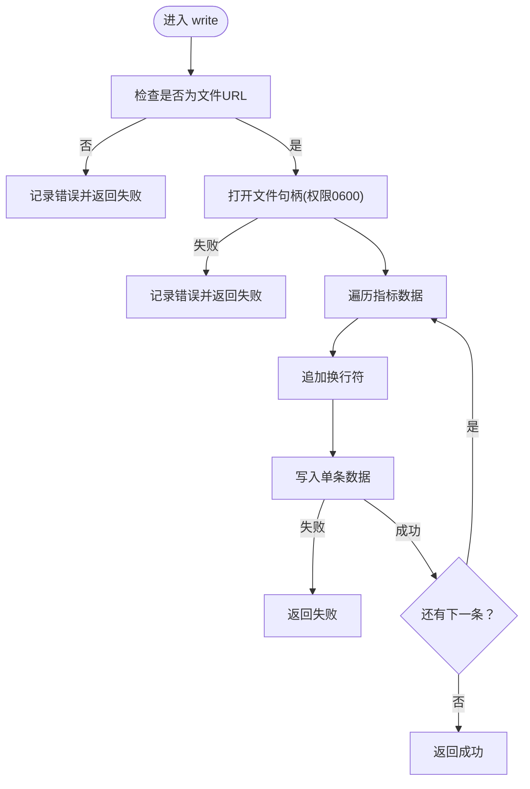
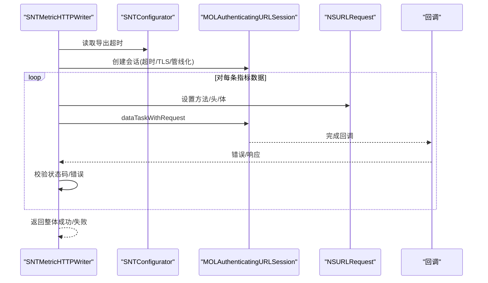
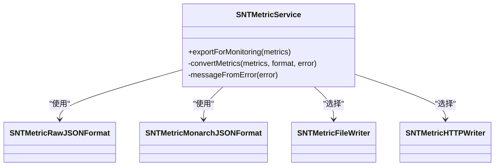
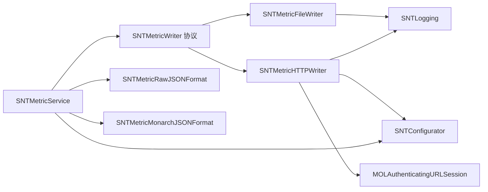

# 指标写入器

<cite>
**本文引用的文件**
- [SNTMetricWriter.h](file://Source/santametricservice/Writers/SNTMetricWriter.h)
- [SNTMetricFileWriter.h](file://Source/santametricservice/Writers/SNTMetricFileWriter.h)
- [SNTMetricFileWriter.mm](file://Source/santametricservice/Writers/SNTMetricFileWriter.mm)
- [SNTMetricHTTPWriter.h](file://Source/santametricservice/Writers/SNTMetricHTTPWriter.h)
- [SNTMetricHTTPWriter.mm](file://Source/santametricservice/Writers/SNTMetricHTTPWriter.mm)
- [SNTMetricService.h](file://Source/santametricservice/SNTMetricService.h)
- [SNTMetricService.mm](file://Source/santametricservice/SNTMetricService.mm)
- [SNTMetricRawJSONFormat.h](file://Source/santametricservice/Formats/SNTMetricRawJSONFormat.h)
- [SNTMetricMonarchJSONFormat.h](file://Source/santametricservice/Formats/SNTMetricMonarchJSONFormat.h)
- [SNTConfigurator.mm](file://Source/common/SNTConfigurator.mm)
- [MOLAuthenticatingURLSession.h](file://Source/common/MOLAuthenticatingURLSession.h)
- [MOLAuthenticatingURLSession.mm](file://Source/common/MOLAuthenticatingURLSession.mm)
- [SNTMetricHTTPWriterTest.mm](file://Source/santametricservice/Writers/SNTMetricHTTPWriterTest.mm)
- [SNTMetricFileWriterTest.mm](file://Source/santametricservice/Writers/SNTMetricFileWriterTest.mm)
- [SNTMetricServiceTest.mm](file://Source/santametricservice/SNTMetricServiceTest.mm)
</cite>

## 目录
1. [简介](#简介)
2. [项目结构](#项目结构)
3. [核心组件](#核心组件)
4. [架构总览](#架构总览)
5. [组件详解](#组件详解)
6. [依赖关系分析](#依赖关系分析)
7. [性能考量](#性能考量)
8. [故障排除指南](#故障排除指南)
9. [结论](#结论)
10. [附录](#附录)

## 简介
本文件为 Santa 指标写入器模块的技术文档，聚焦于指标导出的架构设计与接口规范，覆盖以下要点：
- SNTMetricWriter 协议的定义与实现要求
- 文件写入器（SNTMetricFileWriter）的文件系统操作、路径管理、权限处理与错误恢复机制
- HTTP 写入器（SNTMetricHTTPWriter）的实现，包括 HTTP 客户端配置、请求构建、响应处理与错误传播
- 写入器的异步处理、批量写入与背压控制现状与建议
- 配置项、安全考虑与性能调优
- 故障排除与监控策略

## 项目结构
指标写入器位于指标服务子系统中，围绕统一的写入协议 SNTMetricWriter 构建，支持“文件”和“HTTP”两种输出后端，并由指标服务在后台队列中按配置触发导出。

图表来源
- [SNTMetricService.mm](file://Source/santametricservice/SNTMetricService.mm#L33-L55)
- [SNTMetricRawJSONFormat.h](file://Source/santametricservice/Formats/SNTMetricRawJSONFormat.h#L1-L21)
- [SNTMetricMonarchJSONFormat.h](file://Source/santametricservice/Formats/SNTMetricMonarchJSONFormat.h#L1-L21)
- [SNTMetricFileWriter.mm](file://Source/santametricservice/Writers/SNTMetricFileWriter.mm#L36-L69)
- [SNTMetricHTTPWriter.mm](file://Source/santametricservice/Writers/SNTMetricHTTPWriter.mm#L37-L116)
- [SNTConfigurator.mm](file://Source/common/SNTConfigurator.mm#L1519-L1550)
- [MOLAuthenticatingURLSession.h](file://Source/common/MOLAuthenticatingURLSession.h#L15-L34)

章节来源
- [SNTMetricService.mm](file://Source/santametricservice/SNTMetricService.mm#L33-L55)
- [SNTMetricService.h](file://Source/santametricservice/SNTMetricService.h#L15-L21)

## 核心组件
- SNTMetricWriter 协议：定义统一的写入接口 write(data, toURL, error)，用于将序列化的指标数据输出到外部监控系统。
- SNTMetricFileWriter：实现将指标按行分隔的 JSON 写入本地文件，负责文件句柄打开、逐条写入与换行符追加。
- SNTMetricHTTPWriter：实现将指标按行分隔的 JSON 通过 HTTPS POST 提交至远端服务器，使用认证会话封装 TLS 与证书校验。
- SNTMetricService：负责从指标集合导出、格式化为指定格式（Raw JSON 或 Monarch JSON），并根据配置选择对应写入器进行输出。
- SNTConfigurator：提供导出开关、格式类型、目标 URL、导出间隔等配置项。
- MOLAuthenticatingURLSession：基于 NSURLSession 的认证型会话，支持 TLS 最低版本、管线化、用户代理与证书锚点等能力。

章节来源
- [SNTMetricWriter.h](file://Source/santametricservice/Writers/SNTMetricWriter.h#L15-L24)
- [SNTMetricFileWriter.h](file://Source/santametricservice/Writers/SNTMetricFileWriter.h#L1-L17)
- [SNTMetricHTTPWriter.h](file://Source/santametricservice/Writers/SNTMetricHTTPWriter.h#L1-L20)
- [SNTMetricService.mm](file://Source/santametricservice/SNTMetricService.mm#L33-L55)
- [SNTConfigurator.mm](file://Source/common/SNTConfigurator.mm#L1519-L1550)
- [MOLAuthenticatingURLSession.h](file://Source/common/MOLAuthenticatingURLSession.h#L15-L34)

## 架构总览
指标导出流程如下：指标服务在后台队列中导出指标字典，选择格式化器生成每条指标的二进制数据，再依据配置选择文件或 HTTP 写入器执行输出；HTTP 写入器内部使用认证会话建立 TLS 连接并逐条发送。

图表来源
- [SNTMetricService.mm](file://Source/santametricservice/SNTMetricService.mm#L94-L128)
- [SNTMetricHTTPWriter.mm](file://Source/santametricservice/Writers/SNTMetricHTTPWriter.mm#L51-L116)
- [SNTMetricFileWriter.mm](file://Source/santametricservice/Writers/SNTMetricFileWriter.mm#L36-L69)
- [MOLAuthenticatingURLSession.h](file://Source/common/MOLAuthenticatingURLSession.h#L15-L34)

## 组件详解

### SNTMetricWriter 协议
- 接口职责：接收已序列化的指标数据数组与目标 URL，返回布尔值表示是否全部成功写入，并通过错误指针返回最后一个失败原因。
- 实现要求：
  - 必须对输入参数进行校验（如 URL 类型、数据非空等）
  - 必须处理错误传播，确保错误指针不为空时写入者可设置错误对象
  - 必须保证幂等性与线程安全（若被多线程调用）

章节来源
- [SNTMetricWriter.h](file://Source/santametricservice/Writers/SNTMetricWriter.h#L15-L24)

### SNTMetricFileWriter 文件写入器
- 功能概述：
  - 仅接受文件 URL（isFileURL），否则直接返回失败并记录错误日志
  - 使用系统调用打开文件，权限模式为 0600，采用截断重写方式
  - 将每条指标数据后追加换行符后写入
- 关键行为：
  - 文件句柄打开失败时返回失败并记录错误
  - 写入过程中遇到错误立即返回失败
  - 支持传入 nil 或 NULL 的错误指针，避免崩溃
- 错误恢复：
  - 失败即终止当前批次写入，上层可根据错误信息重试或降级

图表来源
- [SNTMetricFileWriter.mm](file://Source/santametricservice/Writers/SNTMetricFileWriter.mm#L36-L69)
- [SNTMetricFileWriterTest.mm](file://Source/santametricservice/Writers/SNTMetricFileWriterTest.mm#L36-L105)

章节来源
- [SNTMetricFileWriter.mm](file://Source/santametricservice/Writers/SNTMetricFileWriter.mm#L20-L69)
- [SNTMetricFileWriterTest.mm](file://Source/santametricservice/Writers/SNTMetricFileWriterTest.mm#L36-L105)

### SNTMetricHTTPWriter HTTP 写入器
- 功能概述：
  - 基于 SNTConfigurator 获取导出超时时间，创建认证会话（TLS ≥ 1.2、启用管线化、资源超时）
  - 逐条构造 POST 请求（Content-Type: application/json），等待每个任务完成后再继续下一条
  - 校验 HTTP 状态码，非 200 时设置错误域与描述；传输层错误也作为错误返回
- 异步与背压：
  - 当前实现使用信号量阻塞等待每个任务完成，形成“串行+同步”的背压模型
  - 未实现并发或批量聚合，整体吞吐受限
- 错误处理：
  - 任一指标发送失败都会导致整体返回失败
  - 支持传入 nil/NULL 错误指针，避免崩溃

图表来源
- [SNTMetricHTTPWriter.mm](file://Source/santametricservice/Writers/SNTMetricHTTPWriter.mm#L37-L116)
- [SNTConfigurator.mm](file://Source/common/SNTConfigurator.mm#L1542-L1550)
- [MOLAuthenticatingURLSession.h](file://Source/common/MOLAuthenticatingURLSession.h#L15-L34)

章节来源
- [SNTMetricHTTPWriter.mm](file://Source/santametricservice/Writers/SNTMetricHTTPWriter.mm#L37-L116)
- [SNTMetricHTTPWriterTest.mm](file://Source/santametricservice/Writers/SNTMetricHTTPWriterTest.mm#L90-L229)

### 指标服务与格式化
- 导出流程：
  - 读取配置决定是否导出与格式类型
  - 选择对应格式化器（Raw JSON 或 Monarch JSON）将指标字典转换为数据数组
  - 根据目标 URL 的 scheme 选择写入器（file/http），调用 write 并记录日志
- 线程模型：
  - 指标服务初始化全局后台队列，导出过程在该队列中执行，避免阻塞主线程

图表来源
- [SNTMetricService.mm](file://Source/santametricservice/SNTMetricService.mm#L33-L55)
- [SNTMetricService.mm](file://Source/santametricservice/SNTMetricService.mm#L94-L128)

章节来源
- [SNTMetricService.mm](file://Source/santametricservice/SNTMetricService.mm#L33-L55)
- [SNTMetricService.mm](file://Source/santametricservice/SNTMetricService.mm#L94-L128)
- [SNTMetricServiceTest.mm](file://Source/santametricservice/SNTMetricServiceTest.mm#L109-L138)

## 依赖关系分析
- 写入器依赖：
  - SNTMetricWriter 协议：统一接口契约
  - SNTConfigurator：导出开关、格式类型、目标 URL、导出超时
  - MOLAuthenticatingURLSession：HTTP 客户端封装（TLS、管线化、证书校验）
  - SNTLogging：错误与调试日志
- 指标服务依赖：
  - 格式化器：Raw JSON 与 Monarch JSON
  - 写入器：文件与 HTTP
  - 配置器：导出开关与目标

图表来源
- [SNTMetricWriter.h](file://Source/santametricservice/Writers/SNTMetricWriter.h#L15-L24)
- [SNTMetricFileWriter.mm](file://Source/santametricservice/Writers/SNTMetricFileWriter.mm#L36-L69)
- [SNTMetricHTTPWriter.mm](file://Source/santametricservice/Writers/SNTMetricHTTPWriter.mm#L37-L116)
- [SNTMetricService.mm](file://Source/santametricservice/SNTMetricService.mm#L33-L55)
- [SNTConfigurator.mm](file://Source/common/SNTConfigurator.mm#L1519-L1550)
- [MOLAuthenticatingURLSession.h](file://Source/common/MOLAuthenticatingURLSession.h#L15-L34)

章节来源
- [SNTMetricService.mm](file://Source/santametricservice/SNTMetricService.mm#L33-L55)
- [SNTMetricHTTPWriter.mm](file://Source/santametricservice/Writers/SNTMetricHTTPWriter.mm#L37-L116)
- [SNTMetricFileWriter.mm](file://Source/santametricservice/Writers/SNTMetricFileWriter.mm#L36-L69)

## 性能考量
- 当前实现特性：
  - HTTP 写入器逐条发送并等待完成，形成串行背压，吞吐较低
  - 文件写入器逐条写入，无缓冲与批处理
- 可选优化方向（建议）：
  - HTTP：引入并发队列与批量聚合，结合指数退避与重试策略；在会话层启用更细粒度的超时与重试
  - 文件：增加行缓冲、批量写入与落盘策略，减少系统调用次数
  - 背压：在指标服务侧引入队列长度限制与丢弃策略，避免内存压力
- 安全与合规：
  - TLS 最低版本与管线化已在会话层配置，建议结合证书锚点与客户端证书策略
  - 文件权限保持 0600，避免敏感指标被其他用户读取

[本节为通用性能讨论，不直接分析具体文件]

## 故障排除指南
- 常见问题与定位：
  - HTTP 写入失败：检查状态码与错误域；确认目标 URL 正确、网络可达、TLS 版本满足要求
  - 文件写入失败：检查 URL 是否为文件 URL、目标路径是否存在且可写、权限是否正确
  - 导出未生效：确认配置项 exportMetrics 开关、metricFormat 与 metricURL 已正确设置
- 日志与诊断：
  - 写入器内部使用统一日志接口记录错误；可在指标服务层查看导出失败的错误消息
  - 测试用例覆盖了多种错误场景（非 200 状态、传输错误、超时、nil/NULL 错误指针），可参考其断言逻辑定位问题
- 建议排查步骤：
  - 先验证文件写入器能否正常写入本地文件
  - 再验证 HTTP 写入器在相同数据下的行为
  - 检查配置器中的导出开关、格式与 URL
  - 在测试环境中模拟不同状态码与错误，复现问题

章节来源
- [SNTMetricHTTPWriter.mm](file://Source/santametricservice/Writers/SNTMetricHTTPWriter.mm#L91-L116)
- [SNTMetricFileWriter.mm](file://Source/santametricservice/Writers/SNTMetricFileWriter.mm#L40-L69)
- [SNTConfigurator.mm](file://Source/common/SNTConfigurator.mm#L1519-L1550)
- [SNTMetricHTTPWriterTest.mm](file://Source/santametricservice/Writers/SNTMetricHTTPWriterTest.mm#L110-L229)
- [SNTMetricFileWriterTest.mm](file://Source/santametricservice/Writers/SNTMetricFileWriterTest.mm#L36-L105)

## 结论
- SNTMetricWriter 协议提供了清晰的抽象，使指标写入器可插拔扩展
- 文件写入器实现简单可靠，适合离线或本地监控场景
- HTTP 写入器具备 TLS 与认证能力，但当前实现偏向串行与同步，吞吐与弹性有待提升
- 建议在不破坏现有接口的前提下，引入并发、批量与重试机制，并完善背压与监控策略

[本节为总结性内容，不直接分析具体文件]

## 附录

### 配置项与默认值
- 导出开关：exportMetrics（当格式类型有效且 metricURL 非空时开启）
- 格式类型：metricFormat（支持 rawjson 与 monarchjson）
- 目标 URL：metricURL（scheme 决定写入器选择）
- 导出间隔：metricExportInterval（默认 30 秒）

章节来源
- [SNTConfigurator.mm](file://Source/common/SNTConfigurator.mm#L1519-L1550)

### 安全与合规要点
- HTTP 写入器使用认证会话，TLS 最低版本为 1.2，启用管线化
- 文件写入器默认权限 0600，降低敏感数据泄露风险
- 建议结合证书锚点与客户端证书策略，确保远端服务器可信

章节来源
- [MOLAuthenticatingURLSession.mm](file://Source/common/MOLAuthenticatingURLSession.mm#L47-L58)
- [SNTMetricHTTPWriter.mm](file://Source/santametricservice/Writers/SNTMetricHTTPWriter.mm#L37-L49)
- [SNTMetricFileWriter.mm](file://Source/santametricservice/Writers/SNTMetricFileWriter.mm#L46-L48)