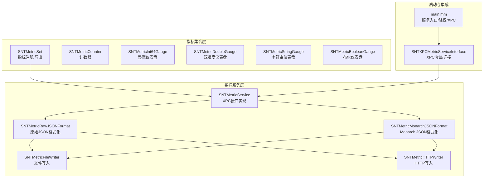
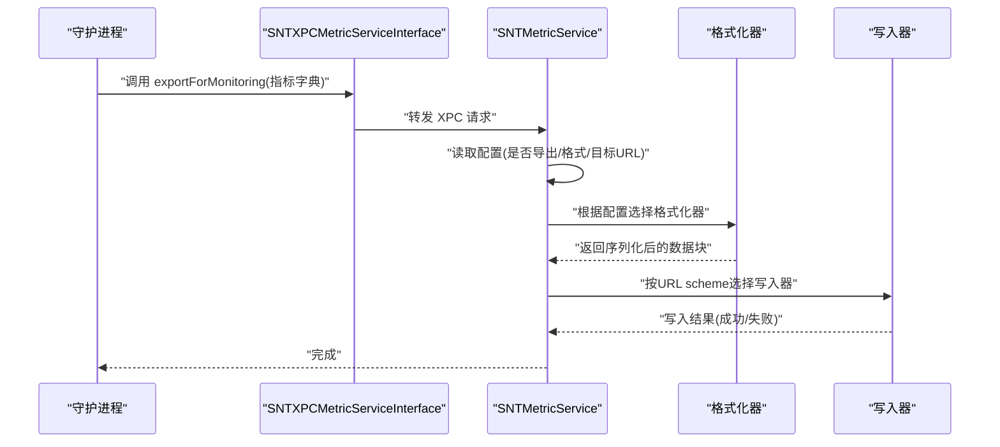
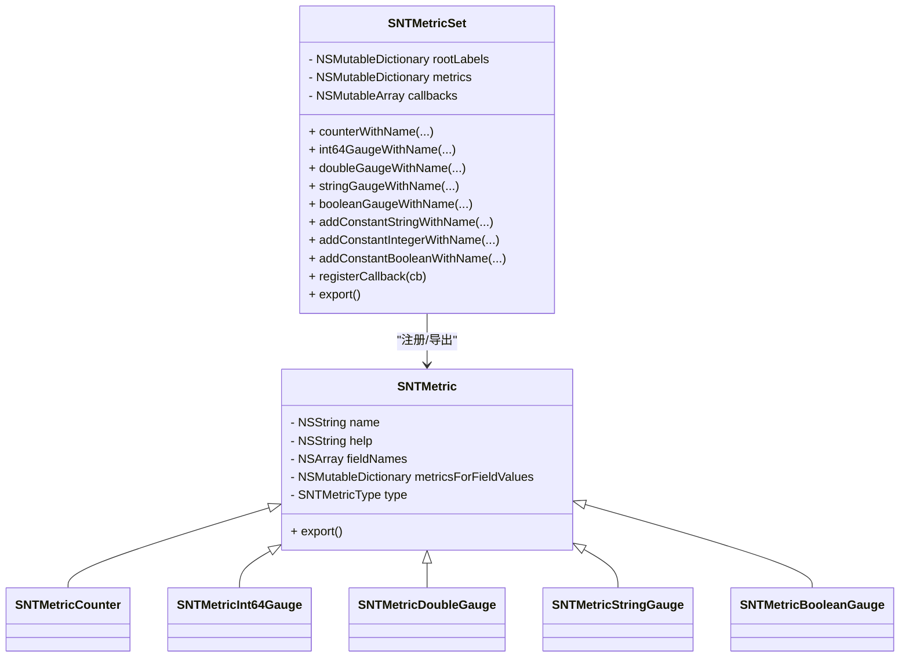
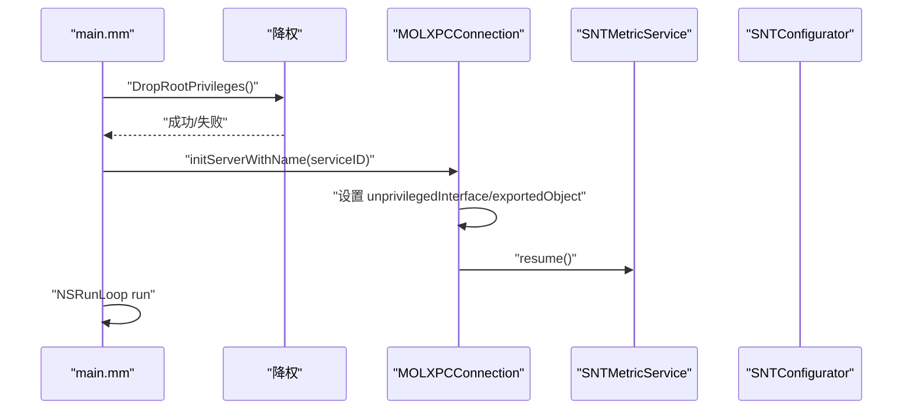
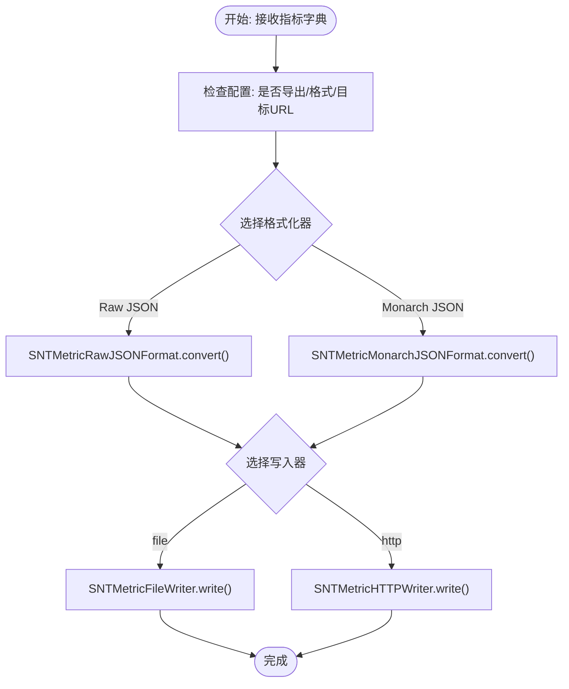
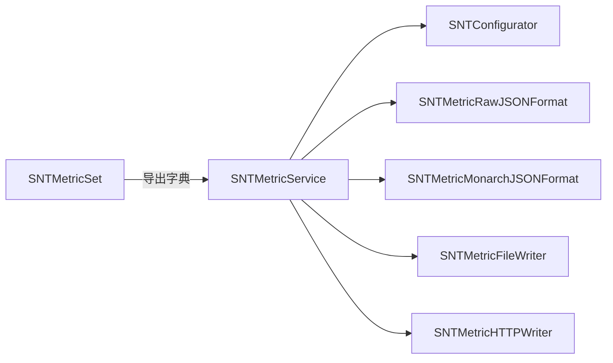

# 指标收集与管理

<cite>
**本文引用的文件**
- [SNTMetricSet.h](file://Source/common/SNTMetricSet.h)
- [SNTMetricSet.mm](file://Source/common/SNTMetricSet.mm)
- [SNTMetricService.h](file://Source/santametricservice/SNTMetricService.h)
- [SNTMetricService.mm](file://Source/santametricservice/SNTMetricService.mm)
- [main.mm](file://Source/santametricservice/main.mm)
- [SNTXPCMetricServiceInterface.h](file://Source/common/SNTXPCMetricServiceInterface.h)
- [SNTMetricFormat.h](file://Source/santametricservice/Formats/SNTMetricFormat.h)
- [SNTMetricMonarchJSONFormat.h](file://Source/santametricservice/Formats/SNTMetricMonarchJSONFormat.h)
- [SNTMetricMonarchJSONFormat.mm](file://Source/santametricservice/Formats/SNTMetricMonarchJSONFormat.mm)
- [SNTMetricRawJSONFormat.h](file://Source/santametricservice/Formats/SNTMetricRawJSONFormat.h)
- [SNTMetricRawJSONFormat.mm](file://Source/santametricservice/Formats/SNTMetricRawJSONFormat.mm)
- [SNTMetricWriter.h](file://Source/santametricservice/Writers/SNTMetricWriter.h)
- [SNTMetricFileWriter.h](file://Source/santametricservice/Writers/SNTMetricFileWriter.h)
- [SNTMetricFileWriter.mm](file://Source/santametricservice/Writers/SNTMetricFileWriter.mm)
- [SNTMetricHTTPWriter.h](file://Source/santametricservice/Writers/SNTMetricHTTPWriter.h)
</cite>

## 目录
1. [简介](#简介)
2. [项目结构](#项目结构)
3. [核心组件](#核心组件)
4. [架构总览](#架构总览)
5. [组件详解](#组件详解)
6. [依赖关系分析](#依赖关系分析)
7. [性能与资源](#性能与资源)
8. [调试与故障排除](#调试与故障排除)
9. [结论](#结论)
10. [附录：配置与参数](#附录配置与参数)

## 简介
本技术文档围绕 Santa 的“指标收集与管理系统”展开，重点解释指标集合（SNTMetricSet）的设计理念与实现，涵盖指标定义、分类、聚合与导出；并深入解析指标服务（SNTMetricService）的调度、格式转换与输出分发流程；同时给出生命周期管理、内存与缓存策略、持久化选项、配置参数、性能监控与优化建议，以及调试与排障指南。

## 项目结构
指标系统由三部分组成：
- 指标定义与集合层：SNTMetricSet 及其子类（计数器、整型/双精度/字符串/布尔仪表盘），负责指标注册、字段维度建模、值更新与导出。
- 指标服务层：SNTMetricService 通过 XPC 接口接收来自守护进程的指标导出请求，按配置选择格式化器与写入器，将指标写入本地文件或 HTTP 接收端。
- 启动与集成：服务入口 main.mm 负责降权、XPC 连接建立与事件循环，SNTXPCMetricServiceInterface 提供统一的 XPC 协议与连接配置。

图表来源
- [SNTMetricSet.h](file://Source/common/SNTMetricSet.h#L84-L192)
- [SNTMetricSet.mm](file://Source/common/SNTMetricSet.mm#L434-L668)
- [SNTMetricService.h](file://Source/santametricservice/SNTMetricService.h#L15-L21)
- [SNTMetricService.mm](file://Source/santametricservice/SNTMetricService.mm#L40-L130)
- [SNTMetricMonarchJSONFormat.h](file://Source/santametricservice/Formats/SNTMetricMonarchJSONFormat.h#L15-L21)
- [SNTMetricMonarchJSONFormat.mm](file://Source/santametricservice/Formats/SNTMetricMonarchJSONFormat.mm#L200-L249)
- [SNTMetricRawJSONFormat.h](file://Source/santametricservice/Formats/SNTMetricRawJSONFormat.h#L15-L21)
- [SNTMetricRawJSONFormat.mm](file://Source/santametricservice/Formats/SNTMetricRawJSONFormat.mm#L80-L107)
- [SNTMetricFileWriter.h](file://Source/santametricservice/Writers/SNTMetricFileWriter.h#L14-L18)
- [SNTMetricFileWriter.mm](file://Source/santametricservice/Writers/SNTMetricFileWriter.mm#L36-L72)
- [SNTMetricHTTPWriter.h](file://Source/santametricservice/Writers/SNTMetricHTTPWriter.h#L15-L21)
- [SNTXPCMetricServiceInterface.h](file://Source/common/SNTXPCMetricServiceInterface.h#L20-L52)
- [main.mm](file://Source/santametricservice/main.mm#L24-L42)

章节来源
- [SNTMetricSet.h](file://Source/common/SNTMetricSet.h#L18-L192)
- [SNTMetricSet.mm](file://Source/common/SNTMetricSet.mm#L434-L668)
- [SNTMetricService.mm](file://Source/santametricservice/SNTMetricService.mm#L40-L130)
- [SNTXPCMetricServiceInterface.h](file://Source/common/SNTXPCMetricServiceInterface.h#L20-L52)
- [main.mm](file://Source/santametricservice/main.mm#L24-L42)

## 核心组件
- 指标集合（SNTMetricSet）
  - 提供指标注册与导出能力，支持根标签（root_labels）、回调钩子、字段维度与多类型指标（常量/仪表盘/计数器）。
  - 导出字典包含指标类型、字段描述、帮助信息及每个字段值的时间戳与数据。
- 指标服务（SNTMetricService）
  - 通过 XPC 接口接收导出请求，读取配置决定格式化器与写入器，异步执行格式转换与输出。
- 格式化器（SNTMetricFormat 实现）
  - 原始 JSON：对时间戳进行标准化，保证可序列化。
  - Monarch JSON：将指标映射为 Monarch 所需的字段描述、流类型与值类型，并统一结束时间戳。
- 写入器（SNTMetricWriter 实现）
  - 文件写入：逐条写入 JSON 对象，每条以换行分隔，权限控制为仅所有者可读写。
  - HTTP 写入：通过 URL scheme 选择对应写入器，具体发送逻辑由实现文件承担。

章节来源
- [SNTMetricSet.h](file://Source/common/SNTMetricSet.h#L84-L192)
- [SNTMetricSet.mm](file://Source/common/SNTMetricSet.mm#L434-L668)
- [SNTMetricService.mm](file://Source/santametricservice/SNTMetricService.mm#L67-L128)
- [SNTMetricFormat.h](file://Source/santametricservice/Formats/SNTMetricFormat.h#L15-L22)
- [SNTMetricMonarchJSONFormat.mm](file://Source/santametricservice/Formats/SNTMetricMonarchJSONFormat.mm#L200-L249)
- [SNTMetricRawJSONFormat.mm](file://Source/santametricservice/Formats/SNTMetricRawJSONFormat.mm#L80-L107)
- [SNTMetricFileWriter.mm](file://Source/santametricservice/Writers/SNTMetricFileWriter.mm#L36-L72)
- [SNTMetricWriter.h](file://Source/santametricservice/Writers/SNTMetricWriter.h#L15-L24)

## 架构总览
下图展示从守护进程到指标服务再到输出的完整链路，包括 XPC 通信、格式化与写入路径。

图表来源
- [SNTXPCMetricServiceInterface.h](file://Source/common/SNTXPCMetricServiceInterface.h#L20-L52)
- [SNTMetricService.mm](file://Source/santametricservice/SNTMetricService.mm#L67-L128)
- [SNTMetricMonarchJSONFormat.mm](file://Source/santametricservice/Formats/SNTMetricMonarchJSONFormat.mm#L233-L249)
- [SNTMetricRawJSONFormat.mm](file://Source/santametricservice/Formats/SNTMetricRawJSONFormat.mm#L80-L107)
- [SNTMetricFileWriter.mm](file://Source/santametricservice/Writers/SNTMetricFileWriter.mm#L36-L72)
- [SNTMetricHTTPWriter.h](file://Source/santametricservice/Writers/SNTMetricHTTPWriter.h#L15-L21)

## 组件详解

### 指标集合（SNTMetricSet）设计与实现
- 设计理念
  - 将指标抽象为“名称 + 字段维度 + 类型 + 值容器”，支持常量与仪表盘（gauge）两类无时间序列属性，以及计数器（counter）的时间序列属性。
  - 通过根标签（root_labels）标识实体，便于跨系统聚合与关联。
  - 支持回调钩子，在每次导出前刷新动态值，确保导出数据最新。
- 数据结构与复杂度
  - 指标注册表：字典按名称索引，O(1) 查找与覆盖。
  - 字段键：数组拷贝后作为字典键，避免外部修改影响内部状态；字段值映射为线程安全对象，读写加锁。
  - 导出：遍历指标与字段，构造包含类型、描述、字段列表与数据的字典，整体 O(N)。
- 关键流程（导出）
  - 触发回调 → 复制回调列表 → 顺序执行 → 加锁构建导出字典 → 返回结果。

图表来源
- [SNTMetricSet.h](file://Source/common/SNTMetricSet.h#L84-L192)
- [SNTMetricSet.mm](file://Source/common/SNTMetricSet.mm#L434-L668)

章节来源
- [SNTMetricSet.h](file://Source/common/SNTMetricSet.h#L36-L192)
- [SNTMetricSet.mm](file://Source/common/SNTMetricSet.mm#L434-L668)

### 指标服务（SNTMetricService）功能与流程
- 功能职责
  - 接收来自守护进程的指标导出请求。
  - 依据配置决定是否导出、采用何种格式（原始 JSON 或 Monarch JSON）。
  - 选择写入器（文件或 HTTP），将格式化后的数据写入目标。
- 生命周期
  - 启动：降权、初始化格式化器与写入器、建立 XPC 服务器、进入主循环。
  - 运行：在后台队列处理导出请求，避免阻塞主线程。
  - 关闭：随进程退出自然停止（未见显式优雅关闭逻辑）。
- 错误处理
  - 配置检查、空指标字典、格式化错误、写入失败均记录日志并短路返回。

图表来源
- [main.mm](file://Source/santametricservice/main.mm#L24-L42)
- [SNTMetricService.mm](file://Source/santametricservice/SNTMetricService.mm#L40-L55)

章节来源
- [SNTMetricService.h](file://Source/santametricservice/SNTMetricService.h#L15-L21)
- [SNTMetricService.mm](file://Source/santametricservice/SNTMetricService.mm#L40-L128)
- [main.mm](file://Source/santametricservice/main.mm#L24-L42)

### 格式化器与写入器
- 原始 JSON 格式化（SNTMetricRawJSONFormat）
  - 将日期标准化为 ISO8601 字符串，递归处理嵌套结构，确保 JSON 可序列化。
  - 若输入不可序列化，返回错误。
- Monarch JSON 格式化（SNTMetricMonarchJSONFormat）
  - 将指标类型映射为 Monarch 的值类型与流类型（GAUGE/CUMULATIVE），并规范化字段描述与数据条目。
  - 统一结束时间戳为当前导出时间，开始时间为指标创建/更新时间。
- 写入器
  - 文件写入（SNTMetricFileWriter）：以换行分隔的 JSON Lines 写入，文件权限 0600。
  - HTTP 写入（SNTMetricHTTPWriter）：根据 URL scheme 选择写入器，具体发送逻辑由实现承担。

图表来源
- [SNTMetricService.mm](file://Source/santametricservice/SNTMetricService.mm#L67-L128)
- [SNTMetricRawJSONFormat.mm](file://Source/santametricservice/Formats/SNTMetricRawJSONFormat.mm#L80-L107)
- [SNTMetricMonarchJSONFormat.mm](file://Source/santametricservice/Formats/SNTMetricMonarchJSONFormat.mm#L233-L249)
- [SNTMetricFileWriter.mm](file://Source/santametricservice/Writers/SNTMetricFileWriter.mm#L36-L72)
- [SNTMetricHTTPWriter.h](file://Source/santametricservice/Writers/SNTMetricHTTPWriter.h#L15-L21)

章节来源
- [SNTMetricFormat.h](file://Source/santametricservice/Formats/SNTMetricFormat.h#L15-L22)
- [SNTMetricRawJSONFormat.mm](file://Source/santametricservice/Formats/SNTMetricRawJSONFormat.mm#L33-L107)
- [SNTMetricMonarchJSONFormat.mm](file://Source/santametricservice/Formats/SNTMetricMonarchJSONFormat.mm#L101-L249)
- [SNTMetricFileWriter.mm](file://Source/santametricservice/Writers/SNTMetricFileWriter.mm#L36-L72)
- [SNTMetricWriter.h](file://Source/santametricservice/Writers/SNTMetricWriter.h#L15-L24)

## 依赖关系分析
- 组件耦合
  - SNTMetricService 依赖配置器（读取导出开关、格式类型、目标 URL）、格式化器与写入器。
  - SNTMetricSet 与格式化器之间无直接耦合，仅通过导出字典交互。
- 外部依赖
  - Foundation（日期格式化、JSON 序列化、XPC 连接）。
  - 日志接口用于错误与调试信息输出。
- 潜在环路
  - 未发现循环导入；格式化器与写入器通过协议解耦。

图表来源
- [SNTMetricSet.mm](file://Source/common/SNTMetricSet.mm#L606-L668)
- [SNTMetricService.mm](file://Source/santametricservice/SNTMetricService.mm#L67-L128)
- [SNTMetricRawJSONFormat.mm](file://Source/santametricservice/Formats/SNTMetricRawJSONFormat.mm#L80-L107)
- [SNTMetricMonarchJSONFormat.mm](file://Source/santametricservice/Formats/SNTMetricMonarchJSONFormat.mm#L233-L249)
- [SNTMetricFileWriter.mm](file://Source/santametricservice/Writers/SNTMetricFileWriter.mm#L36-L72)
- [SNTMetricHTTPWriter.h](file://Source/santametricservice/Writers/SNTMetricHTTPWriter.h#L15-L21)

章节来源
- [SNTMetricService.mm](file://Source/santametricservice/SNTMetricService.mm#L67-L128)
- [SNTMetricSet.mm](file://Source/common/SNTMetricSet.mm#L606-L668)

## 性能与资源
- 线程模型
  - 导出处理在后台全局队列执行，避免阻塞主线程与 XPC 通信。
- 时间戳与序列化
  - 原始 JSON 使用 ISO8601 标准化日期，Monarch JSON 统一结束时间戳，减少下游解析成本。
- I/O 行为
  - 文件写入采用追加写并以换行分隔，便于流式消费与滚动清理。
- 内存与缓存
  - 指标值容器为线程安全对象，字段键深拷贝后作为字典键，避免并发冲突。
  - 导出时复制回调列表并在锁内执行，降低竞态风险。
- 建议
  - 控制字段数量与维度组合，避免导出字典过大。
  - 合理设置导出频率，避免频繁格式化与 I/O。
  - 对于高吞吐场景，考虑批量写入与压缩（如后续扩展）。

章节来源
- [SNTMetricService.mm](file://Source/santametricservice/SNTMetricService.mm#L40-L55)
- [SNTMetricSet.mm](file://Source/common/SNTMetricSet.mm#L100-L180)
- [SNTMetricRawJSONFormat.mm](file://Source/santametricservice/Formats/SNTMetricRawJSONFormat.mm#L33-L68)
- [SNTMetricMonarchJSONFormat.mm](file://Source/santametricservice/Formats/SNTMetricMonarchJSONFormat.mm#L120-L154)
- [SNTMetricFileWriter.mm](file://Source/santametricservice/Writers/SNTMetricFileWriter.mm#L36-L72)

## 调试与故障排除
- 常见问题定位
  - 未配置导出：服务会记录日志并跳过导出。
  - 空指标字典：记录错误并返回。
  - 格式化失败：记录错误原因并中止写入。
  - 写入失败：记录底层错误详情。
- 调试建议
  - 开启详细日志，观察导出路径与错误消息。
  - 在导出前注册回调，确保关键指标在导出前被刷新。
  - 使用原始 JSON 格式快速验证数据完整性与可序列化性。
- 故障排查清单
  - 检查配置项（导出开关、格式类型、目标 URL scheme）。
  - 确认文件路径存在且权限正确（0600）。
  - 确认网络可达与证书/鉴权（HTTP 写入）。
  - 核对 Monarch 字段描述与值类型映射是否符合预期。

章节来源
- [SNTMetricService.mm](file://Source/santametricservice/SNTMetricService.mm#L94-L128)
- [SNTMetricRawJSONFormat.mm](file://Source/santametricservice/Formats/SNTMetricRawJSONFormat.mm#L80-L107)
- [SNTMetricMonarchJSONFormat.mm](file://Source/santametricservice/Formats/SNTMetricMonarchJSONFormat.mm#L101-L154)
- [SNTMetricFileWriter.mm](file://Source/santametricservice/Writers/SNTMetricFileWriter.mm#L36-L72)

## 结论
Santa 的指标系统以 SNTMetricSet 为核心，提供简洁而强大的指标注册与导出能力；SNTMetricService 则通过 XPC 与格式化器/写入器解耦地完成数据转换与输出。该设计具备良好的扩展性与可维护性，适合在 macOS 平台上进行系统级指标采集与上报。

## 附录：配置与参数
- 导出开关与目标
  - 是否导出：由配置器决定。
  - 格式类型：原始 JSON 或 Monarch JSON。
  - 目标 URL：根据 scheme 选择写入器（file/http）。
- XPC 接口
  - 协议方法：exportForMonitoring(NSDictionary*)。
  - 服务 ID 与连接配置由接口提供。
- 文件写入权限
  - 默认权限 0600，仅所有者可读写。

章节来源
- [SNTMetricService.mm](file://Source/santametricservice/SNTMetricService.mm#L94-L128)
- [SNTXPCMetricServiceInterface.h](file://Source/common/SNTXPCMetricServiceInterface.h#L20-L52)
- [SNTMetricFileWriter.mm](file://Source/santametricservice/Writers/SNTMetricFileWriter.mm#L36-L72)