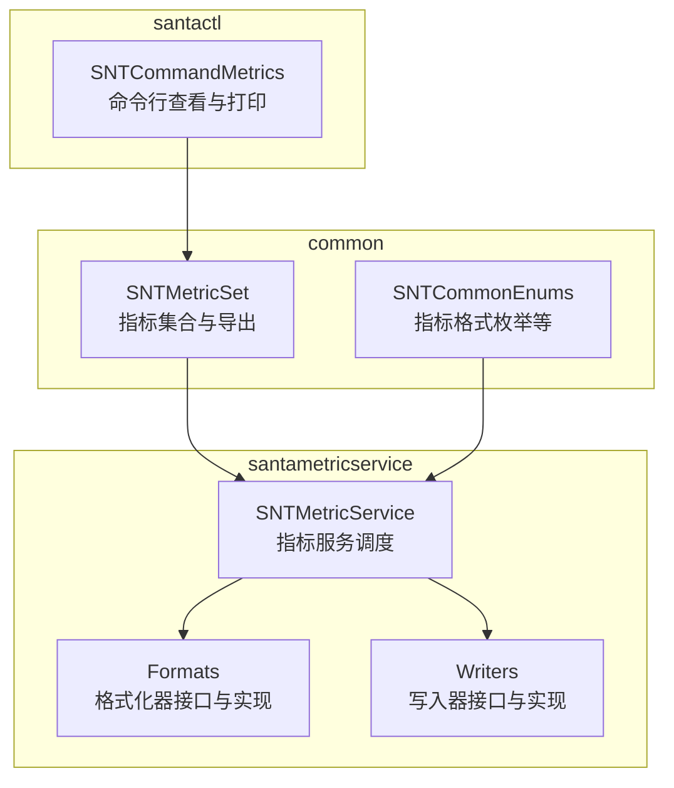
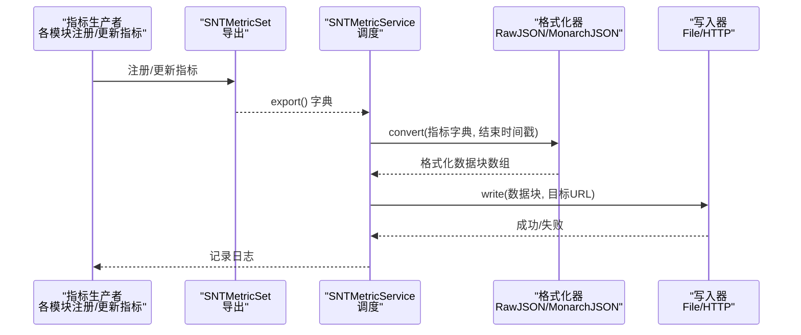
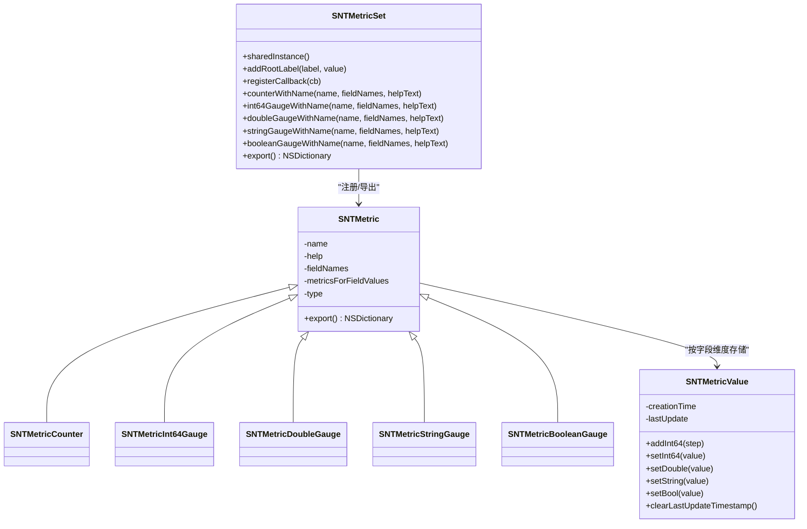
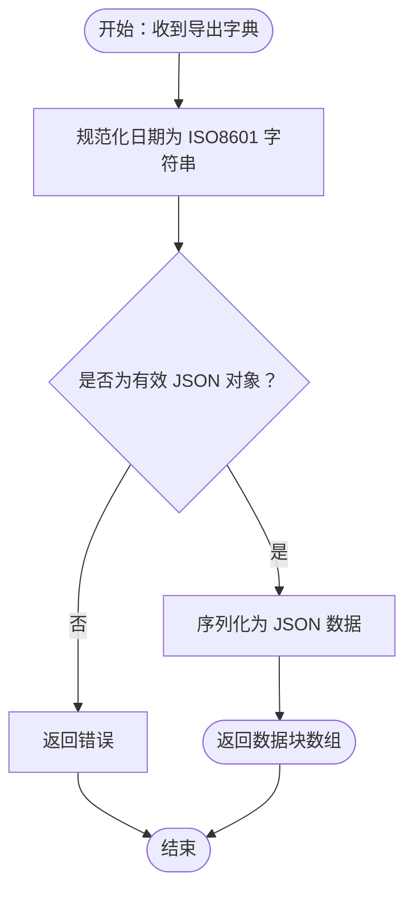
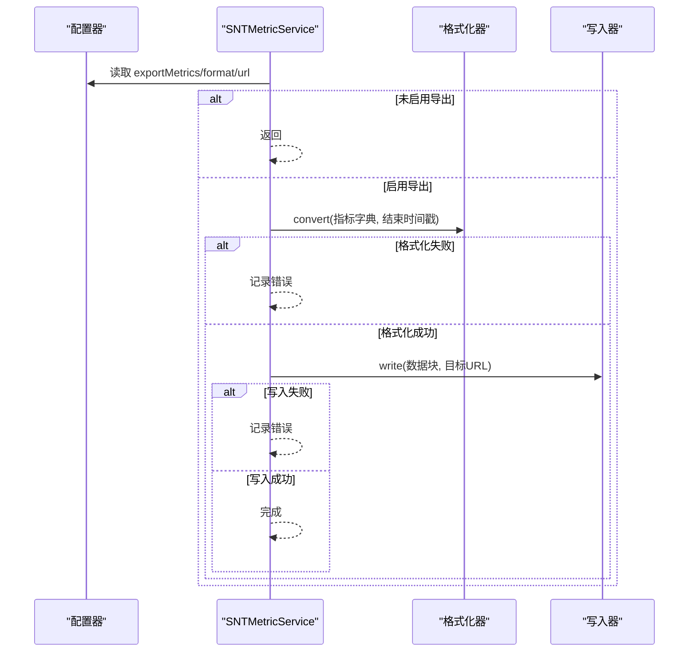
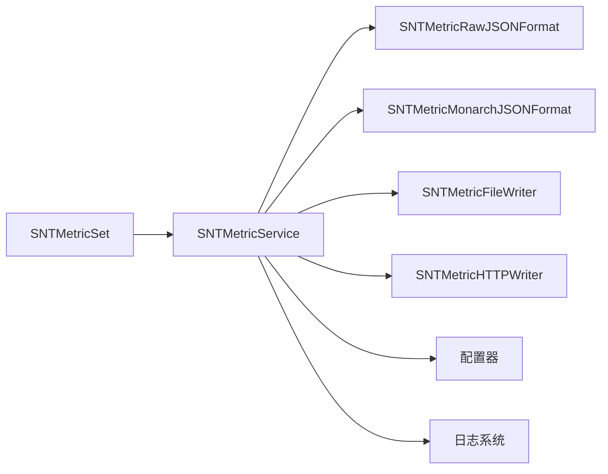

# 指标服务

<cite>
**本文引用的文件**
- [SNTMetricSet.h](file://Source/common/SNTMetricSet.h)
- [SNTMetricSet.mm](file://Source/common/SNTMetricSet.mm)
- [SNTCommonEnums.h](file://Source/common/SNTCommonEnums.h)
- [SNTMetricService.h](file://Source/santametricservice/SNTMetricService.h)
- [SNTMetricService.mm](file://Source/santametricservice/SNTMetricService.mm)
- [SNTMetricFormat.h](file://Source/santametricservice/Formats/SNTMetricFormat.h)
- [SNTMetricRawJSONFormat.h](file://Source/santametricservice/Formats/SNTMetricRawJSONFormat.h)
- [SNTMetricRawJSONFormat.mm](file://Source/santametricservice/Formats/SNTMetricRawJSONFormat.mm)
- [SNTMetricMonarchJSONFormat.h](file://Source/santametricservice/Formats/SNTMetricMonarchJSONFormat.h)
- [SNTMetricMonarchJSONFormat.mm](file://Source/santametricservice/Formats/SNTMetricMonarchJSONFormat.mm)
- [SNTMetricWriter.h](file://Source/santametricservice/Writers/SNTMetricWriter.h)
- [SNTMetricFileWriter.h](file://Source/santametricservice/Writers/SNTMetricFileWriter.h)
- [SNTMetricHTTPWriter.h](file://Source/santametricservice/Writers/SNTMetricHTTPWriter.h)
- [SNTCommandMetrics.mm](file://Source/santactl/Commands/SNTCommandMetrics.mm)
- [SNTMetricSetTest.mm](file://Source/common/SNTMetricSetTest.mm)
- [SNTApplicationCoreMetricsTest.mm](file://Source/santad/SNTApplicationCoreMetricsTest.mm)
- [SNTMetricServiceTest.mm](file://Source/santametricservice/SNTMetricServiceTest.mm)
</cite>

## 目录
1. [简介](#简介)
2. [项目结构](#项目结构)
3. [核心组件](#核心组件)
4. [架构总览](#架构总览)
5. [组件详解](#组件详解)
6. [依赖关系分析](#依赖关系分析)
7. [性能考量](#性能考量)
8. [故障排查指南](#故障排查指南)
9. [结论](#结论)
10. [附录](#附录)

## 简介
本文件为 Santa 指标服务的技术文档，聚焦于指标收集、格式化与输出机制。指标服务以 SNTMetricSet 为核心容器，抽象了多种指标类型（计数器、整型/双精度/布尔/字符串仪表盘），支持按字段维度进行聚合与导出；通过格式化器将导出的指标字典转换为原始 JSON 或 Monarch JSON；再由写入器将格式化后的数据写入文件或通过 HTTP 发送到外部系统。同时，文档涵盖配置项、监控仪表板集成与告警建议、性能优化与维护策略。

## 项目结构
指标服务位于 Source/common 与 Source/santametricservice 两个主要目录中：
- Source/common：指标模型与导出工具（SNTMetricSet、指标类型、日期标准化）
- Source/santametricservice：指标服务主流程（SNTMetricService）、格式化器（RawJSON、MonarchJSON）与写入器（File、HTTP）

图表来源
- [SNTMetricService.mm](file://Source/santametricservice/SNTMetricService.mm#L1-L130)
- [SNTMetricSet.mm](file://Source/common/SNTMetricSet.mm#L434-L668)
- [SNTCommonEnums.h](file://Source/common/SNTCommonEnums.h#L169-L173)
- [SNTCommandMetrics.mm](file://Source/santactl/Commands/SNTCommandMetrics.mm#L99-L181)

章节来源
- [SNTMetricService.mm](file://Source/santametricservice/SNTMetricService.mm#L1-L130)
- [SNTMetricSet.mm](file://Source/common/SNTMetricSet.mm#L434-L668)
- [SNTCommonEnums.h](file://Source/common/SNTCommonEnums.h#L169-L173)
- [SNTCommandMetrics.mm](file://Source/santactl/Commands/SNTCommandMetrics.mm#L99-L181)

## 核心组件
- 指标集合与类型
  - SNTMetricSet：全局单例，注册并管理指标，导出为字典；支持根标签、回调注入、线程安全值单元。
  - 指标类型：计数器、整型/双精度/布尔/字符串仪表盘，均支持按字段维度存储与导出。
- 指标格式化
  - SNTMetricFormat 协议：统一 convert 接口，接收导出字典与结束时间戳，返回格式化后的数据块数组。
  - 原始 JSON 格式化器：对日期进行标准化，生成可序列化字典并转为 JSON。
  - Monarch JSON 格式化器：将指标转换为 Monarch 可消费的数据集，包含字段描述、时间戳、度量名称与根标签。
- 指标写入
  - SNTMetricWriter 协议：统一 write 接口，按 URL scheme 选择具体写入器。
  - 文件写入器：将数据写入本地文件。
  - HTTP 写入器：将数据通过 HTTP 传输到远端系统。
- 指标服务
  - SNTMetricService：读取配置，调用格式化器，按配置目标选择写入器执行输出。

章节来源
- [SNTMetricSet.h](file://Source/common/SNTMetricSet.h#L39-L202)
- [SNTMetricSet.mm](file://Source/common/SNTMetricSet.mm#L182-L432)
- [SNTMetricFormat.h](file://Source/santametricservice/Formats/SNTMetricFormat.h#L15-L22)
- [SNTMetricRawJSONFormat.h](file://Source/santametricservice/Formats/SNTMetricRawJSONFormat.h#L15-L21)
- [SNTMetricRawJSONFormat.mm](file://Source/santametricservice/Formats/SNTMetricRawJSONFormat.mm#L1-L107)
- [SNTMetricMonarchJSONFormat.h](file://Source/santametricservice/Formats/SNTMetricMonarchJSONFormat.h#L15-L21)
- [SNTMetricMonarchJSONFormat.mm](file://Source/santametricservice/Formats/SNTMetricMonarchJSONFormat.mm#L101-L236)
- [SNTMetricWriter.h](file://Source/santametricservice/Writers/SNTMetricWriter.h#L15-L24)
- [SNTMetricFileWriter.h](file://Source/santametricservice/Writers/SNTMetricFileWriter.h#L14-L18)
- [SNTMetricHTTPWriter.h](file://Source/santametricservice/Writers/SNTMetricHTTPWriter.h#L15-L21)
- [SNTMetricService.mm](file://Source/santametricservice/SNTMetricService.mm#L1-L130)

## 架构总览
指标服务从 SNTMetricSet 导出指标字典，经格式化器转换为指定格式，再由写入器输出到目标系统（文件或 HTTP）。服务在后台队列中异步处理，避免阻塞主线程。

图表来源
- [SNTMetricService.mm](file://Source/santametricservice/SNTMetricService.mm#L76-L128)
- [SNTMetricRawJSONFormat.mm](file://Source/santametricservice/Formats/SNTMetricRawJSONFormat.mm#L80-L106)
- [SNTMetricMonarchJSONFormat.mm](file://Source/santametricservice/Formats/SNTMetricMonarchJSONFormat.mm#L205-L236)
- [SNTMetricFileWriter.h](file://Source/santametricservice/Writers/SNTMetricFileWriter.h#L14-L18)
- [SNTMetricHTTPWriter.h](file://Source/santametricservice/Writers/SNTMetricHTTPWriter.h#L15-L21)

## 组件详解

### 指标集合与类型（SNTMetricSet 与子类）
- 设计要点
  - 全局单例，提供根标签与回调注册能力，导出时触发回调以保证最新状态。
  - 指标值单元 SNTMetricValue：封装值与创建/更新时间戳，线程安全；支持清空上次更新时间以强制使用当前时间。
  - 指标基类 SNTMetric：保存名称、帮助文本、字段名列表、字段值映射及类型；导出时编码字段组合、创建/更新时间与数据。
  - 派生类型：计数器（递增）、整型/双精度/布尔/字符串仪表盘（设置值）。
- 数据结构与复杂度
  - 字段键采用 NSArray<NSString *> 作为字典键，导出时按字段名拼接为键；字段值集合随维度增长而线性扩展。
  - 导出操作遍历所有指标并编码，整体复杂度 O(M×F)，M 为指标数量，F 为每个指标的字段组合数量。
- 错误处理与边界
  - 字段数量不匹配会跳过该条目；未知类型不填充 data 字段。
  - 导出前执行回调，确保指标处于最新状态。

图表来源
- [SNTMetricSet.h](file://Source/common/SNTMetricSet.h#L39-L202)
- [SNTMetricSet.mm](file://Source/common/SNTMetricSet.mm#L182-L432)

章节来源
- [SNTMetricSet.h](file://Source/common/SNTMetricSet.h#L39-L202)
- [SNTMetricSet.mm](file://Source/common/SNTMetricSet.mm#L182-L432)
- [SNTMetricSetTest.mm](file://Source/common/SNTMetricSetTest.mm#L45-L618)

### 指标格式化器
- 原始 JSON 格式化器（SNTMetricRawJSONFormat）
  - 将导出字典中的日期标准化为 ISO8601 字符串，确保 JSON 可序列化。
  - 对整个字典进行递归规范化，再进行 JSON 序列化，返回单元素数据块数组。
- Monarch JSON 格式化器（SNTMetricMonarchJSONFormat）
  - 将指标字典转换为 Monarch 可消费的结构：包含度量名称、描述、字段描述（含字段名与类型）、数据条目（起止时间戳、字段值、数据）。
  - 对字段名与字段值进行逗号分隔解析，构建字段描述与数据条目；结束时间戳统一更新为当前时间。

图表来源
- [SNTMetricRawJSONFormat.mm](file://Source/santametricservice/Formats/SNTMetricRawJSONFormat.mm#L33-L106)

章节来源
- [SNTMetricFormat.h](file://Source/santametricservice/Formats/SNTMetricFormat.h#L15-L22)
- [SNTMetricRawJSONFormat.h](file://Source/santametricservice/Formats/SNTMetricRawJSONFormat.h#L15-L21)
- [SNTMetricRawJSONFormat.mm](file://Source/santametricservice/Formats/SNTMetricRawJSONFormat.mm#L1-L107)
- [SNTMetricMonarchJSONFormat.h](file://Source/santametricservice/Formats/SNTMetricMonarchJSONFormat.h#L15-L21)
- [SNTMetricMonarchJSONFormat.mm](file://Source/santametricservice/Formats/SNTMetricMonarchJSONFormat.mm#L101-L236)

### 指标写入器
- 写入器协议（SNTMetricWriter）
  - 统一 write 接口，接收格式化后的数据块数组与目标 URL，返回成功/失败。
- 文件写入器（SNTMetricFileWriter）
  - 依据 URL scheme 选择写入路径，将数据块写入文件。
- HTTP 写入器（SNTMetricHTTPWriter）
  - 依据 URL scheme 选择 HTTP 路径，将数据块通过 HTTP 传输到远端系统。

章节来源
- [SNTMetricWriter.h](file://Source/santametricservice/Writers/SNTMetricWriter.h#L15-L24)
- [SNTMetricFileWriter.h](file://Source/santametricservice/Writers/SNTMetricFileWriter.h#L14-L18)
- [SNTMetricHTTPWriter.h](file://Source/santametricservice/Writers/SNTMetricHTTPWriter.h#L15-L21)

### 指标服务（SNTMetricService）
- 配置读取与调度
  - 读取导出开关、格式类型、目标 URL；根据 scheme 选择对应写入器。
  - 在后台队列中执行格式化与写入，避免阻塞。
- 错误处理
  - 对格式化失败与写入失败记录日志并返回。

图表来源
- [SNTMetricService.mm](file://Source/santametricservice/SNTMetricService.mm#L76-L128)

章节来源
- [SNTMetricService.h](file://Source/santametricservice/SNTMetricService.h#L15-L21)
- [SNTMetricService.mm](file://Source/santametricservice/SNTMetricService.mm#L1-L130)
- [SNTCommonEnums.h](file://Source/common/SNTCommonEnums.h#L169-L173)

### 命令行查看与打印（santactl metrics）
- 功能
  - 从守护进程代理获取已导出指标，支持 JSON 打印与人类可读格式展示。
  - 展示服务器地址、格式类型、导出间隔以及根标签与指标明细。
- 过滤与展示
  - 支持按指标名前缀过滤；日期标准化后输出。

章节来源
- [SNTCommandMetrics.mm](file://Source/santactl/Commands/SNTCommandMetrics.mm#L99-L181)

## 依赖关系分析
- 组件耦合
  - SNTMetricService 依赖配置器、格式化器与写入器；通过 URL scheme 解耦不同输出目标。
  - SNTMetricSet 与格式化器无直接耦合，仅依赖导出字典结构。
- 外部依赖
  - Foundation（JSON 序列化、日期格式化、XPC 连接）。
  - 日志系统用于错误与调试信息输出。

图表来源
- [SNTMetricService.mm](file://Source/santametricservice/SNTMetricService.mm#L1-L130)
- [SNTMetricSet.mm](file://Source/common/SNTMetricSet.mm#L606-L668)

章节来源
- [SNTMetricService.mm](file://Source/santametricservice/SNTMetricService.mm#L1-L130)
- [SNTMetricSet.mm](file://Source/common/SNTMetricSet.mm#L606-L668)

## 性能考量
- 导出与格式化
  - 导出时遍历所有指标并编码，复杂度 O(M×F)；可通过减少字段组合与指标数量降低开销。
  - 原始 JSON 格式化器对整个字典进行递归规范化，注意大字典的内存占用。
- 并发与线程安全
  - 指标值单元内部使用同步块保护，避免竞态；导出前回调在服务内部队列执行，避免与业务线程竞争。
- I/O 与网络
  - 文件写入与 HTTP 传输为阻塞操作，建议批量输出或异步队列处理；合理设置导出间隔以平衡实时性与负载。
- 时间戳处理
  - 使用 ISO8601 标准化日期，避免跨语言/平台解析差异；Monarch 格式统一结束时间戳，便于下游聚合。

[本节为通用性能建议，无需特定文件引用]

## 故障排查指南
- 常见问题
  - 导出为空：确认已启用导出开关、配置格式类型与目标 URL；检查回调是否正确更新指标。
  - 格式化失败：检查导出字典中是否存在不可序列化对象；查看日志错误详情。
  - 写入失败：核对目标 URL scheme 是否匹配写入器；检查权限与网络连通性。
- 关键日志点
  - 未启用导出时的日志提示。
  - 格式化与写入过程中的错误消息。
- 测试参考
  - 指标集合导出与字段编码测试用例。
  - 应用核心指标导出与根标签替换测试。
  - 指标服务写入文件并校验 JSON 的测试。

章节来源
- [SNTMetricService.mm](file://Source/santametricservice/SNTMetricService.mm#L94-L128)
- [SNTMetricSetTest.mm](file://Source/common/SNTMetricSetTest.mm#L45-L618)
- [SNTApplicationCoreMetricsTest.mm](file://Source/santad/SNTApplicationCoreMetricsTest.mm#L214-L249)
- [SNTMetricServiceTest.mm](file://Source/santametricservice/SNTMetricServiceTest.mm#L194-L233)

## 结论
Santa 指标服务以 SNTMetricSet 为中心，提供了统一的指标注册、导出与格式化能力，并通过可插拔的格式化器与写入器适配多种输出场景。其设计兼顾可扩展性与易用性，适合接入各类监控系统与仪表板。通过合理的配置与优化，可在保证实时性的前提下控制资源消耗。

[本节为总结性内容，无需特定文件引用]

## 附录

### 指标类型与字段维度
- 类型定义：计数器、整型/双精度/布尔/字符串仪表盘。
- 字段维度：每个指标可定义多个字段名，导出时按字段组合存储与编码。
- 根标签：标识实体属性，如主机名、用户名、作业名、服务名等。

章节来源
- [SNTMetricSet.h](file://Source/common/SNTMetricSet.h#L39-L202)
- [SNTMetricSet.mm](file://Source/common/SNTMetricSet.mm#L434-L668)

### 配置选项（基于现有实现）
- 导出开关：决定是否进行指标导出。
- 输出格式：原始 JSON 或 Monarch JSON。
- 目标系统：通过 URL scheme 选择文件或 HTTP。
- 导出间隔：命令行展示导出间隔参数，实际调度逻辑由上层组件负责。

章节来源
- [SNTCommandMetrics.mm](file://Source/santactl/Commands/SNTCommandMetrics.mm#L112-L146)
- [SNTCommonEnums.h](file://Source/common/SNTCommonEnums.h#L169-L173)
- [SNTMetricService.mm](file://Source/santametricservice/SNTMetricService.mm#L94-L128)

### 监控仪表板与告警集成建议
- 仪表板集成：将 Monarch JSON 或原始 JSON 导入监控系统，利用根标签与指标名构建多维视图。
- 告警配置：基于计数器增量与仪表盘阈值设置告警规则；对异常波动与持续异常分别建模。

[本节为通用集成建议，无需特定文件引用]