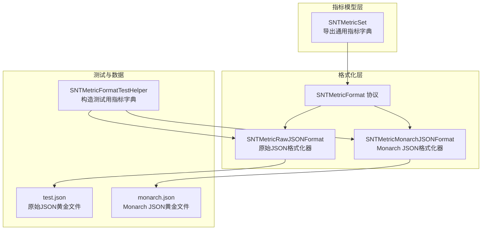
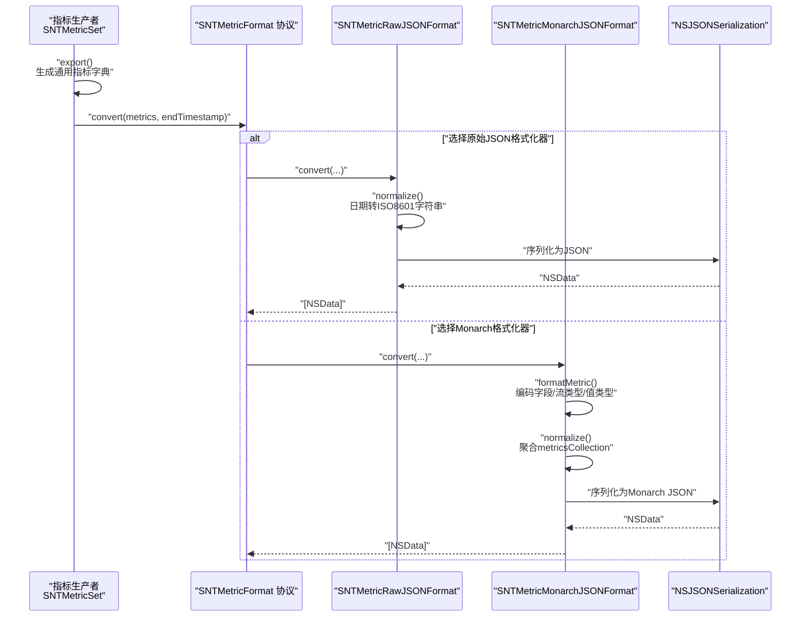
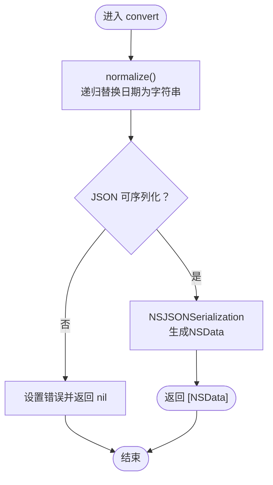
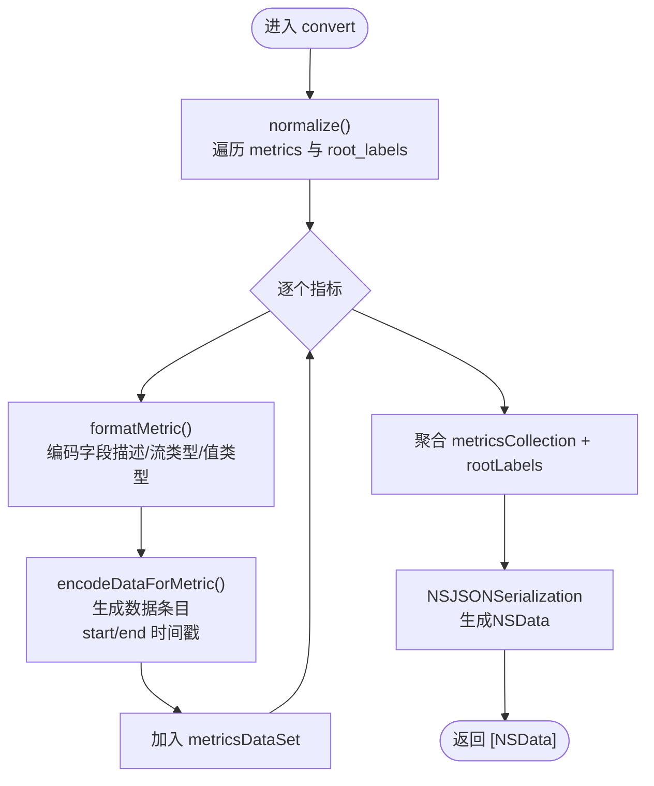
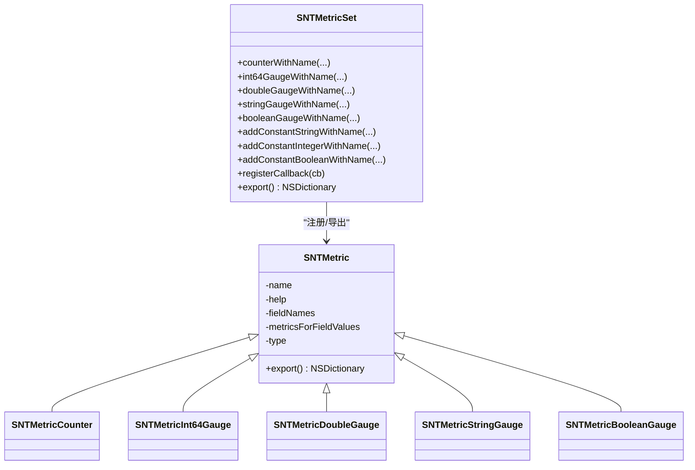
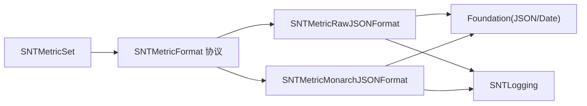

# 指标格式化

<cite>
**本文引用的文件**
- [SNTMetricFormat.h](file://Source/santametricservice/Formats/SNTMetricFormat.h)
- [SNTMetricRawJSONFormat.h](file://Source/santametricservice/Formats/SNTMetricRawJSONFormat.h)
- [SNTMetricRawJSONFormat.mm](file://Source/santametricservice/Formats/SNTMetricRawJSONFormat.mm)
- [SNTMetricMonarchJSONFormat.h](file://Source/santametricservice/Formats/SNTMetricMonarchJSONFormat.h)
- [SNTMetricMonarchJSONFormat.mm](file://Source/santametricservice/Formats/SNTMetricMonarchJSONFormat.mm)
- [SNTMetricFormatTestHelper.h](file://Source/santametricservice/Formats/SNTMetricFormatTestHelper.h)
- [SNTMetricFormatTestHelper.mm](file://Source/santametricservice/Formats/SNTMetricFormatTestHelper.mm)
- [SNTMetricRawJSONFormatTest.mm](file://Source/santametricservice/Formats/SNTMetricRawJSONFormatTest.mm)
- [SNTMetricMonarchJSONFormatTest.mm](file://Source/santametricservice/Formats/SNTMetricMonarchJSONFormatTest.mm)
- [SNTMetricSet.h](file://Source/common/SNTMetricSet.h)
- [SNTMetricSet.mm](file://Source/common/SNTMetricSet.mm)
- [test.json](file://Source/santametricservice/Formats/testdata/json/test.json)
- [monarch.json](file://Source/santametricservice/Formats/testdata/json/monarch.json)
</cite>

## 目录
1. [引言](#引言)
2. [项目结构](#项目结构)
3. [核心组件](#核心组件)
4. [架构总览](#架构总览)
5. [详细组件分析](#详细组件分析)
6. [依赖关系分析](#依赖关系分析)
7. [性能考虑](#性能考虑)
8. [故障排查指南](#故障排查指南)
9. [结论](#结论)
10. [附录：自定义格式化器开发指南](#附录自定义格式化器开发指南)

## 引言
本技术文档聚焦 Santa 指标格式化模块，系统性阐述指标数据从采集到序列化的完整链路，重点覆盖以下方面：
- SNTMetricFormat 协议的设计与扩展机制
- 原始 JSON 格式化器（SNTMetricRawJSONFormat）的序列化流程、字段映射与格式规范
- Monarch JSON 格式化器（SNTMetricMonarchJSONFormat）的专用用途、与 Monarch 系统的集成方式与数据转换规则
- 测试框架与验证机制（Golden File 对比）
- 性能优化策略、内存管理与错误处理
- 自定义格式化器的开发指南与最佳实践

## 项目结构
指标格式化模块位于 santametricservice 的 Formats 子目录中，围绕 SNTMetricSet 导出的通用指标字典进行二次格式化输出，分别生成面向通用消费的原始 JSON 以及面向 Google Monarch 工具链的专用 JSON。

图表来源
- [SNTMetricSet.h](file://Source/common/SNTMetricSet.h#L84-L192)
- [SNTMetricSet.mm](file://Source/common/SNTMetricSet.mm#L606-L668)
- [SNTMetricFormat.h](file://Source/santametricservice/Formats/SNTMetricFormat.h#L17-L21)
- [SNTMetricRawJSONFormat.h](file://Source/santametricservice/Formats/SNTMetricRawJSONFormat.h#L15-L21)
- [SNTMetricMonarchJSONFormat.h](file://Source/santametricservice/Formats/SNTMetricMonarchJSONFormat.h#L15-L21)
- [SNTMetricFormatTestHelper.h](file://Source/santametricservice/Formats/SNTMetricFormatTestHelper.h#L15-L21)
- [test.json](file://Source/santametricservice/Formats/testdata/json/test.json#L1-L119)
- [monarch.json](file://Source/santametricservice/Formats/testdata/json/monarch.json#L1-L165)

章节来源
- [SNTMetricFormat.h](file://Source/santametricservice/Formats/SNTMetricFormat.h#L17-L21)
- [SNTMetricRawJSONFormat.h](file://Source/santametricservice/Formats/SNTMetricRawJSONFormat.h#L15-L21)
- [SNTMetricMonarchJSONFormat.h](file://Source/santametricservice/Formats/SNTMetricMonarchJSONFormat.h#L15-L21)
- [SNTMetricSet.h](file://Source/common/SNTMetricSet.h#L84-L192)

## 核心组件
- SNTMetricFormat 协议：定义统一的 convert 接口，接收由 SNTMetricSet.export 输出的指标字典，并返回一组 NSData 序列化结果；同时支持传入 endTimestamp 用于下游系统的时间对齐。
- SNTMetricRawJSONFormat：将指标字典中的日期值标准化为 ISO8601 字符串，再进行 JSON 序列化，输出单个 JSON 文档。
- SNTMetricMonarchJSONFormat：将指标字典转换为 Monarch 工具链可消费的结构，包括字段描述、流类型（GAUGE/CUMULATIVE）、值类型（BOOL/INT64/STRING/DOUBLE）等，并统一 endTimestamp。
- SNTMetricSet：指标注册与导出的顶层容器，提供多种度量类型（计数器、整型/双精度/字符串/布尔仪表盘），并支持根标签、回调注入、时间戳规范化等能力。

章节来源
- [SNTMetricFormat.h](file://Source/santametricservice/Formats/SNTMetricFormat.h#L17-L21)
- [SNTMetricRawJSONFormat.mm](file://Source/santametricservice/Formats/SNTMetricRawJSONFormat.mm#L33-L106)
- [SNTMetricMonarchJSONFormat.mm](file://Source/santametricservice/Formats/SNTMetricMonarchJSONFormat.mm#L55-L248)
- [SNTMetricSet.h](file://Source/common/SNTMetricSet.h#L84-L192)
- [SNTMetricSet.mm](file://Source/common/SNTMetricSet.mm#L606-L668)

## 架构总览
下图展示了指标从采集到格式化的端到端流程，以及两种格式化器的差异化路径。

图表来源
- [SNTMetricSet.mm](file://Source/common/SNTMetricSet.mm#L606-L668)
- [SNTMetricFormat.h](file://Source/santametricservice/Formats/SNTMetricFormat.h#L17-L21)
- [SNTMetricRawJSONFormat.mm](file://Source/santametricservice/Formats/SNTMetricRawJSONFormat.mm#L80-L106)
- [SNTMetricMonarchJSONFormat.mm](file://Source/santametricservice/Formats/SNTMetricMonarchJSONFormat.mm#L202-L248)

## 详细组件分析

### SNTMetricFormat 协议与扩展机制
- 设计要点
  - 统一接口：所有格式化器均实现 convert: endTimestamp: error:，便于替换与扩展。
  - 错误传播：通过 NSError** 向调用方传递错误信息，便于上层统一处理。
  - 扩展性：新增格式化器只需遵循协议，无需改动上游调用逻辑。
- 使用建议
  - 在调用前确保传入的 metrics 字典来自 SNTMetricSet.export，且已通过 SNTMetricConvertDatesToISO8601Strings 或格式化器内部 normalize 进行日期规范化。
  - 对于需要时间对齐的下游系统（如 Monarch），务必传入统一的 endTimestamp。

章节来源
- [SNTMetricFormat.h](file://Source/santametricservice/Formats/SNTMetricFormat.h#L17-L21)

### 原始 JSON 格式化器（SNTMetricRawJSONFormat）
- 功能概述
  - 将指标字典中的日期对象递归替换为 ISO8601 字符串，保证 JSON 可序列化。
  - 调用 NSJSONSerialization 将字典序列化为 JSON 文本，返回包含一个 NSData 的数组。
- 关键流程
  - 初始化 ISO8601 日期格式器（UTC）。
  - 递归遍历字典与数组，将 NSDate 替换为字符串。
  - 校验 JSON 可序列化性，失败时设置错误并返回 nil。
  - 返回单一元素的 NSData 数组。
- 字段映射与格式规范
  - 日期字段：created、last_updated 统一为 ISO8601 字符串。
  - 数据字段：根据指标类型映射为对应数值或字符串。
  - 输出结构：单个 JSON 文档，便于直接写入文件或发送至任意 HTTP 接口。

图表来源
- [SNTMetricRawJSONFormat.mm](file://Source/santametricservice/Formats/SNTMetricRawJSONFormat.mm#L33-L106)

章节来源
- [SNTMetricRawJSONFormat.h](file://Source/santametricservice/Formats/SNTMetricRawJSONFormat.h#L15-L21)
- [SNTMetricRawJSONFormat.mm](file://Source/santametricservice/Formats/SNTMetricRawJSONFormat.mm#L33-L106)
- [test.json](file://Source/santametricservice/Formats/testdata/json/test.json#L1-L119)

### Monarch JSON 格式化器（SNTMetricMonarchJSONFormat）
- 专用用途
  - 面向 Google Monarch 工具链的数据格式，满足其字段描述、流类型（GAUGE/CUMULATIVE）、值类型（BOOL/INT64/STRING/DOUBLE）等要求。
- 数据转换规则
  - 指标类型到值类型与流类型的映射：常量/仪表盘类型映射到具体值类型；计数器映射为 CUMULATIVE，仪表盘映射为 GAUGE。
  - 字段描述：将逗号分隔的字段名列表转换为 fieldDescriptor 列表，字段类型统一为 STRING。
  - 数据条目：每个指标条目生成一条数据记录，包含 startTimestamp、endTimestamp、按字段名/值对组织的 field 数组，以及对应值字段（boolValue/int64Value/stringValue/doubleValue）。
  - 时间戳：所有数据记录的 endTimestamp 统一使用传入的 endTimestamp。
  - 根标签：将 root_labels 转换为 key-value 结构，值以 stringValue 形式存储。
- 输出结构
  - metricsCollection -> metricsDataSet（指标集合）+ rootLabels（根标签集合）的组合结构，便于 Monarch 端解析与入库。

图表来源
- [SNTMetricMonarchJSONFormat.mm](file://Source/santametricservice/Formats/SNTMetricMonarchJSONFormat.mm#L156-L248)

章节来源
- [SNTMetricMonarchJSONFormat.h](file://Source/santametricservice/Formats/SNTMetricMonarchJSONFormat.h#L15-L21)
- [SNTMetricMonarchJSONFormat.mm](file://Source/santametricservice/Formats/SNTMetricMonarchJSONFormat.mm#L55-L248)
- [monarch.json](file://Source/santametricservice/Formats/testdata/json/monarch.json#L1-L165)

### 指标模型与导出（SNTMetricSet）
- 指标类型
  - 计数器（Counter）、整型/双精度/字符串/布尔仪表盘（Int64Gauge/DoubleGauge/StringGauge/BooleanGauge）
  - 常量（ConstantBool/String/Int64/Double）
- 导出结构
  - 包含 root_labels（主机名、用户名等）与 metrics（指标名 -> 指标详情）两部分。
  - 指标详情包含 type、description、fields（字段名 -> 条目数组）。
  - 条目包含 created、last_updated、value（字段值拼接）、data（指标值）。
- 时间规范化
  - 提供 SNTMetricConvertDatesToISO8601Strings 工具函数，将导出字典中的日期统一转换为 ISO8601 字符串，避免序列化问题。

图表来源
- [SNTMetricSet.h](file://Source/common/SNTMetricSet.h#L39-L192)
- [SNTMetricSet.mm](file://Source/common/SNTMetricSet.mm#L182-L292)

章节来源
- [SNTMetricSet.h](file://Source/common/SNTMetricSet.h#L39-L192)
- [SNTMetricSet.mm](file://Source/common/SNTMetricSet.mm#L434-L668)

## 依赖关系分析
- 组件耦合
  - SNTMetricFormat 协议作为抽象层，被 SNTMetricRawJSONFormat 与 SNTMetricMonarchJSONFormat 实现，保持调用方与实现解耦。
  - 两个格式化器均依赖 SNTMetricSet 导出的通用指标字典结构。
- 外部依赖
  - Foundation（NSJSONSerialization、NSDateFormatter、NSISO8601DateFormatter）
  - 日志工具（SNTLogging）用于错误与异常日志记录
- 潜在循环依赖
  - 当前结构清晰，无循环导入迹象；格式化器仅依赖协议与通用字典结构。

图表来源
- [SNTMetricFormat.h](file://Source/santametricservice/Formats/SNTMetricFormat.h#L17-L21)
- [SNTMetricRawJSONFormat.mm](file://Source/santametricservice/Formats/SNTMetricRawJSONFormat.mm#L14-L32)
- [SNTMetricMonarchJSONFormat.mm](file://Source/santametricservice/Formats/SNTMetricMonarchJSONFormat.mm#L14-L21)

章节来源
- [SNTMetricFormat.h](file://Source/santametricservice/Formats/SNTMetricFormat.h#L17-L21)
- [SNTMetricRawJSONFormat.mm](file://Source/santametricservice/Formats/SNTMetricRawJSONFormat.mm#L14-L32)
- [SNTMetricMonarchJSONFormat.mm](file://Source/santametricservice/Formats/SNTMetricMonarchJSONFormat.mm#L14-L21)

## 性能考虑
- 序列化成本
  - 原始 JSON：单次 JSON 序列化，适合小规模指标集；若指标体量较大，建议分批或压缩。
  - Monarch JSON：需对每个指标条目进行字段拆分、类型映射与时间戳填充，整体开销高于原始 JSON。
- 日期处理
  - 递归 normalize 会遍历整个字典树，复杂度与键值数量线性相关；建议在导出前使用 SNTMetricConvertDatesToISO8601Strings 预先规范化，减少重复转换。
- 内存管理
  - 中间字典与数组均为可变副本，注意在高并发场景下的拷贝开销；必要时可考虑复用对象或延迟构建。
- 并发安全
  - SNTMetricSet 与 SNTMetricValue 在关键路径使用 @synchronized 保护，避免竞态；格式化器内部未做额外同步，建议在导出阶段串行化或确保外部同步。
- I/O 优化
  - 若目标为文件写入，建议使用流式写入或分块写入，避免一次性分配大块内存。

## 故障排查指南
- 常见错误与定位
  - JSON 不可序列化：原始 JSON 格式化器在检测到非法对象时设置错误并返回 nil；检查指标字典中是否包含不可序列化对象（如 NSDate 未转换）。
  - 指标类型未知：Monarch 格式化器遇到未知 SNTMetricType 时记录错误日志；确认指标类型枚举与映射规则一致。
  - 字段不匹配：当字段名与字段值数量不一致时，格式化器会跳过该条目并记录错误；检查导出字典的 value 与 fieldNames 是否一一对应。
- 测试与验证
  - 使用 SNTMetricFormatTestHelper 创建固定时间戳的测试字典，确保输出稳定可比。
  - 通过 Golden File 对比（test.json 与 monarch.json）验证输出一致性。
- 日志与诊断
  - 格式化器内部使用 SNTLogging 输出错误信息，可在调试模式下查看详细日志定位问题。

章节来源
- [SNTMetricRawJSONFormat.mm](file://Source/santametricservice/Formats/SNTMetricRawJSONFormat.mm#L80-L106)
- [SNTMetricMonarchJSONFormat.mm](file://Source/santametricservice/Formats/SNTMetricMonarchJSONFormat.mm#L55-L99)
- [SNTMetricRawJSONFormatTest.mm](file://Source/santametricservice/Formats/SNTMetricRawJSONFormatTest.mm#L11-L53)
- [SNTMetricMonarchJSONFormatTest.mm](file://Source/santametricservice/Formats/SNTMetricMonarchJSONFormatTest.mm#L12-L57)
- [SNTMetricFormatTestHelper.mm](file://Source/santametricservice/Formats/SNTMetricFormatTestHelper.mm#L21-L95)

## 结论
Santa 指标格式化模块通过 SNTMetricFormat 协议实现了对通用指标字典的灵活扩展，既能输出易于消费的原始 JSON，也能生成符合 Monarch 工具链规范的结构化 JSON。配合完善的测试与日志机制，能够在保证正确性的同时兼顾性能与可维护性。对于新业务需求，推荐遵循现有协议与测试模式，快速实现自定义格式化器。

## 附录：自定义格式化器开发指南
- 开发步骤
  - 定义类并实现 SNTMetricFormat 协议的 convert: endTimestamp: error: 方法。
  - 在初始化中准备必要的格式化器（如日期格式器、缓存等）。
  - 在 convert 中完成：
    - 输入校验（metrics 非空、结构合法）
    - 必要的字段映射与数据规整（如日期标准化、字段拆分、类型转换）
    - JSON 序列化（可选择 PrettyPrint 或紧凑格式）
    - 错误处理（设置 NSError 并返回 nil）
  - 编写单元测试，使用 SNTMetricFormatTestHelper 生成测试数据，对比 Golden File。
- 最佳实践
  - 明确 endTimestamp 的语义与来源，确保下游系统时间对齐。
  - 对日期字段进行预规范化，减少运行时转换成本。
  - 保持输出结构稳定，避免破坏性变更；如需变更，同步更新测试用例与消费者。
  - 注意线程安全与内存占用，在高并发场景下评估拷贝与锁粒度。
  - 使用日志记录关键路径与异常分支，便于排障。

章节来源
- [SNTMetricFormat.h](file://Source/santametricservice/Formats/SNTMetricFormat.h#L17-L21)
- [SNTMetricRawJSONFormat.mm](file://Source/santametricservice/Formats/SNTMetricRawJSONFormat.mm#L80-L106)
- [SNTMetricMonarchJSONFormat.mm](file://Source/santametricservice/Formats/SNTMetricMonarchJSONFormat.mm#L202-L248)
- [SNTMetricFormatTestHelper.h](file://Source/santametricservice/Formats/SNTMetricFormatTestHelper.h#L15-L21)
- [SNTMetricFormatTestHelper.mm](file://Source/santametricservice/Formats/SNTMetricFormatTestHelper.mm#L44-L95)
- [SNTMetricRawJSONFormatTest.mm](file://Source/santametricservice/Formats/SNTMetricRawJSONFormatTest.mm#L11-L53)
- [SNTMetricMonarchJSONFormatTest.mm](file://Source/santametricservice/Formats/SNTMetricMonarchJSONFormatTest.mm#L12-L57)