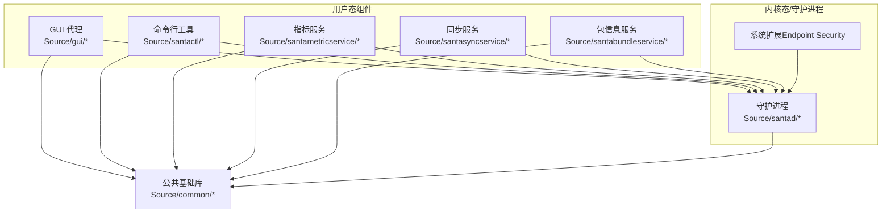
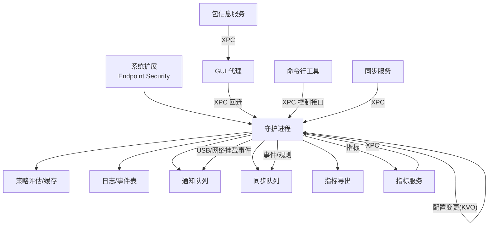
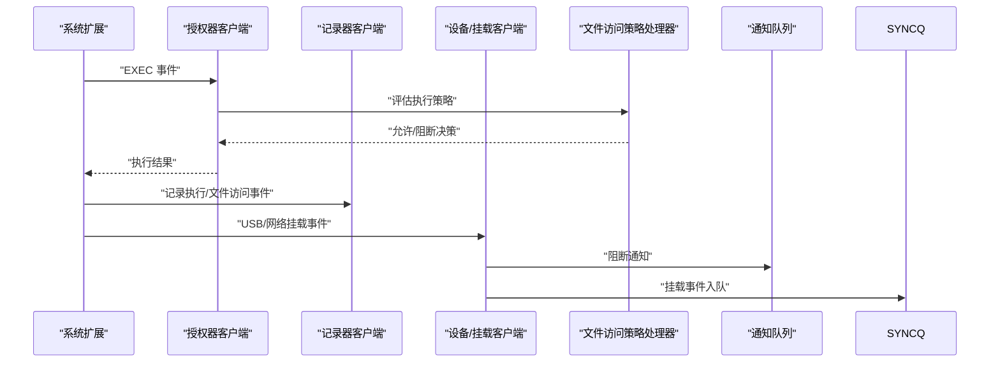
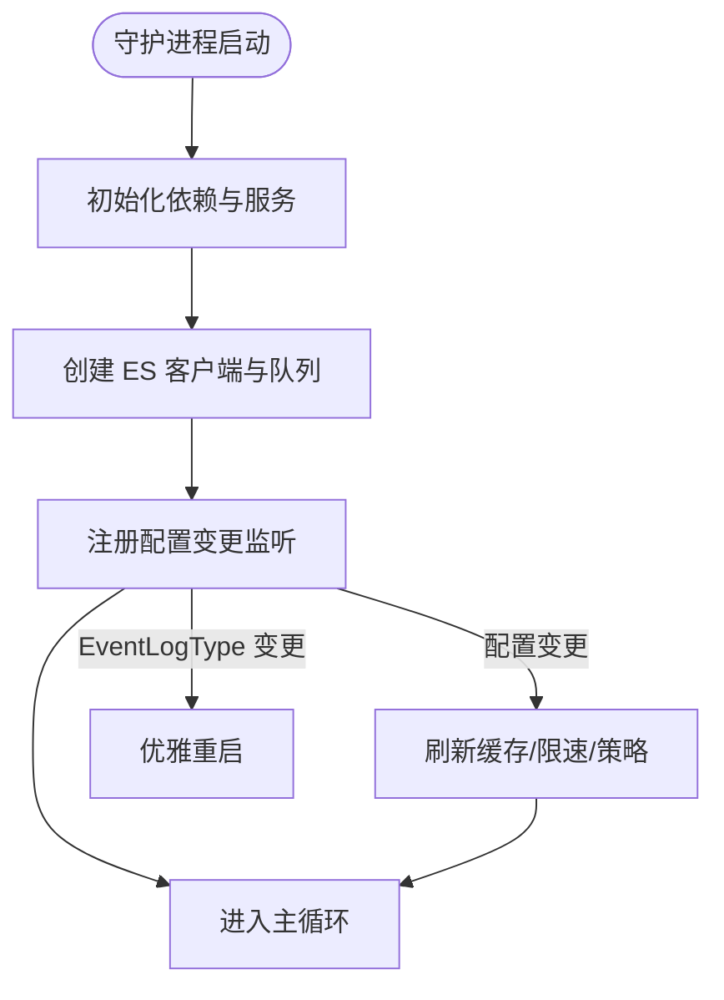
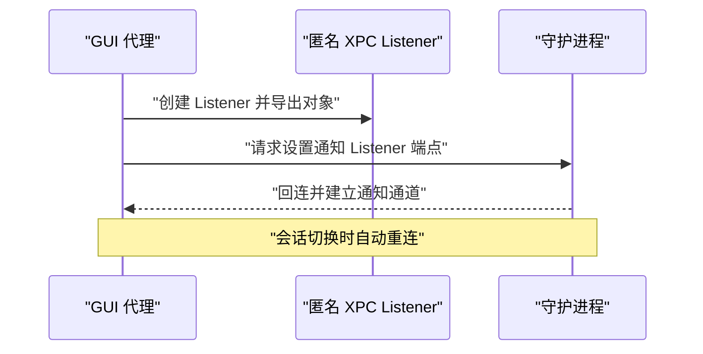
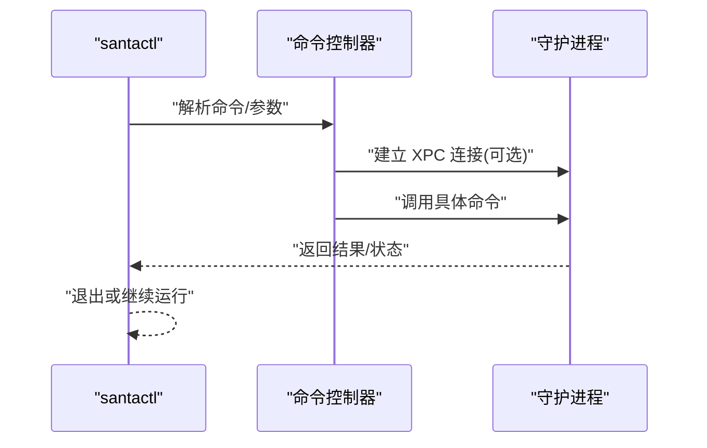
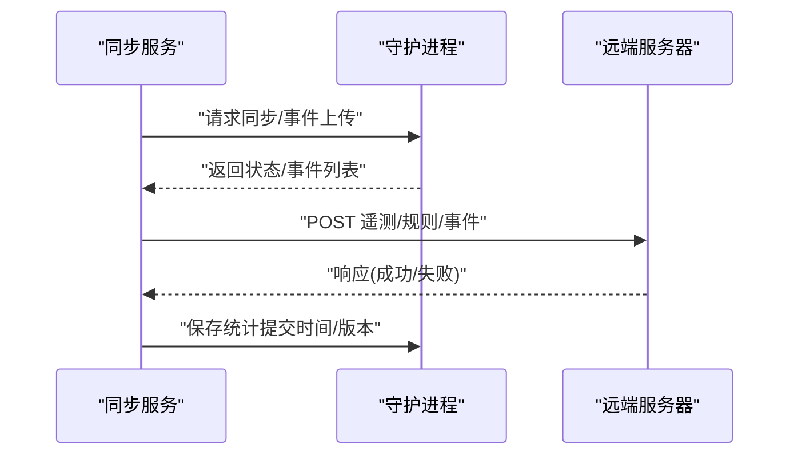
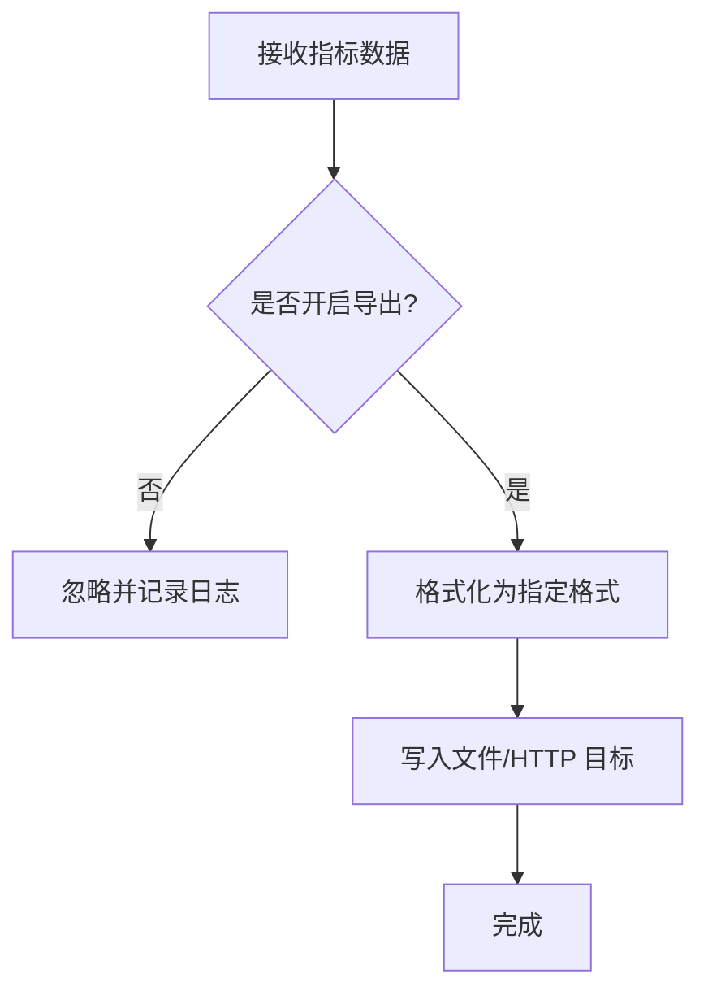
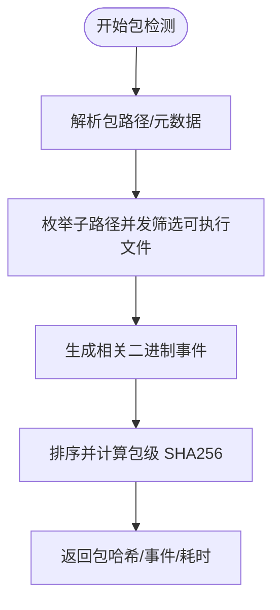
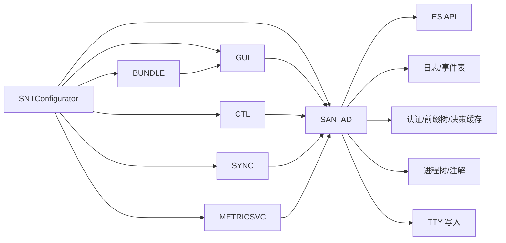

# 核心组件

<cite>
**本文引用的文件**
- [README.md](file://README.md)
- [Source/santad/main.mm](file://Source/santad/main.mm)
- [Source/santad/Santad.mm](file://Source/santad/Santad.mm)
- [Source/gui/main.mm](file://Source/gui/main.mm)
- [Source/gui/SNTAppDelegate.mm](file://Source/gui/SNTAppDelegate.mm)
- [Source/santactl/main.mm](file://Source/santactl/main.mm)
- [Source/santactl/SNTCommandController.mm](file://Source/santactl/SNTCommandController.mm)
- [Source/santasyncservice/main.mm](file://Source/santasyncservice/main.mm)
- [Source/santasyncservice/SNTSyncService.mm](file://Source/santasyncservice/SNTSyncService.mm)
- [Source/santametricservice/main.mm](file://Source/santametricservice/main.mm)
- [Source/santametricservice/SNTMetricService.mm](file://Source/santametricservice/SNTMetricService.mm)
- [Source/santabundleservice/main.mm](file://Source/santabundleservice/main.mm)
- [Source/santabundleservice/SNTBundleService.mm](file://Source/santabundleservice/SNTBundleService.mm)
- [Source/common/SNTXPCControlInterface.mm](file://Source/common/SNTXPCControlInterface.mm)
- [Source/common/SNTConfigurator.mm](file://Source/common/SNTConfigurator.mm)
</cite>

## 目录
1. [引言](#引言)
2. [项目结构](#项目结构)
3. [核心组件](#核心组件)
4. [架构总览](#架构总览)
5. [详细组件分析](#详细组件分析)
6. [依赖关系分析](#依赖关系分析)
7. [性能考虑](#性能考虑)
8. [故障排查指南](#故障排查指南)
9. [结论](#结论)
10. [附录](#附录)

## 引言
Santa 是一个面向 macOS 的二进制与文件访问授权系统，由内核级事件捕获与策略执行的守护进程、图形化 GUI 代理、命令行工具、同步服务、指标服务以及包信息服务组成。各组件通过 XPC 接口进行安全互信通信，并以配置中心（SNTConfigurator）统一驱动行为变更。

本技术文档聚焦于以下七个核心组件：系统扩展（事件捕获与内核级监控）、守护进程（策略评估与决策中心）、GUI 代理（用户交互与通知）、命令行工具（管理与诊断）、同步服务（远程策略管理）、指标服务（性能统计）与包信息服务（应用包检测）。文档将阐述它们的职责、架构设计、交互关系、生命周期管理、错误处理与性能优化策略，并给出配置项、运行参数与调试方法。

## 项目结构
Santa 的代码组织采用按功能模块划分的方式，核心组件分别位于独立目录中，公共能力集中在 Source/common 下，便于跨组件复用。

图表来源
- [Source/santad/main.mm](file://Source/santad/main.mm#L104-L151)
- [Source/gui/main.mm](file://Source/gui/main.mm#L56-L94)
- [Source/santactl/main.mm](file://Source/santactl/main.mm#L39-L84)
- [Source/santasyncservice/main.mm](file://Source/santasyncservice/main.mm#L22-L38)
- [Source/santametricservice/main.mm](file://Source/santametricservice/main.mm#L24-L42)
- [Source/santabundleservice/main.mm](file://Source/santabundleservice/main.mm#L23-L36)

章节来源
- [README.md](file://README.md#L13-L21)

## 核心组件
- 系统扩展（事件捕获与内核级监控）
  - 负责订阅并处理 Endpoint Security 事件，包括执行、文件访问、设备挂载与网络挂载等。
  - 作为守护进程的前端，将事件传递给策略评估与记录模块。
- 守护进程（策略评估与决策中心）
  - 统一协调事件捕获、策略评估、缓存、日志、通知、同步队列与执行控制。
  - 响应配置变更，动态调整行为（如模式切换、路径正则、USB 策略等）。
- GUI 代理（用户交互与通知）
  - 提供用户界面，展示阻断与状态信息；通过 XPC 与守护进程建立回连，保持会话活跃。
- 命令行工具（管理与诊断）
  - 将管理操作拆分为命令子集，统一入口解析与路由，必要时连接守护进程执行操作。
- 同步服务（远程策略管理）
  - 在获得远端配置后启动，负责规则下载、事件上传、遥测导出与推送通知状态查询。
- 指标服务（性能统计）
  - 将守护进程导出的指标格式化并写入文件或 HTTP 监控系统。
- 包信息服务（应用包检测）
  - 对被阻断的应用包进行二进制哈希聚合，生成包级哈希，辅助 GUI 展示与规则建议。

章节来源
- [README.md](file://README.md#L13-L21)
- [Source/santad/Santad.mm](file://Source/santad/Santad.mm#L73-L120)
- [Source/gui/SNTAppDelegate.mm](file://Source/gui/SNTAppDelegate.mm#L121-L164)
- [Source/santactl/SNTCommandController.mm](file://Source/santactl/SNTCommandController.mm#L114-L159)
- [Source/santasyncservice/SNTSyncService.mm](file://Source/santasyncservice/SNTSyncService.mm#L44-L106)
- [Source/santametricservice/SNTMetricService.mm](file://Source/santametricservice/SNTMetricService.mm#L40-L130)
- [Source/santabundleservice/SNTBundleService.mm](file://Source/santabundleservice/SNTBundleService.mm#L39-L116)

## 架构总览
下图展示了组件间通过 XPC 接口进行互信通信的整体架构，以及关键数据流（事件采集、策略评估、通知、同步与指标导出）。

图表来源
- [Source/santad/Santad.mm](file://Source/santad/Santad.mm#L120-L223)
- [Source/gui/SNTAppDelegate.mm](file://Source/gui/SNTAppDelegate.mm#L121-L164)
- [Source/santasyncservice/SNTSyncService.mm](file://Source/santasyncservice/SNTSyncService.mm#L108-L186)
- [Source/santametricservice/SNTMetricService.mm](file://Source/santametricservice/SNTMetricService.mm#L94-L129)
- [Source/santabundleservice/SNTBundleService.mm](file://Source/santabundleservice/SNTBundleService.mm#L49-L116)
- [Source/common/SNTXPCControlInterface.mm](file://Source/common/SNTXPCControlInterface.mm#L82-L96)

## 详细组件分析

### 系统扩展（事件捕获与内核级监控）
- 职责
  - 订阅 Endpoint Security 执行与文件访问事件，进行上下文丰富与速率限制。
  - 驱动 USB 设备管理与网络挂载事件处理，触发通知与同步队列。
- 关键流程
  - 初始化 ES 客户端，启用授权器与记录器，注册回调以分发事件到策略处理器与通知层。
  - 对文件访问类事件（数据/进程两类）分别交由对应的策略处理器评估。
- 性能与稳定性
  - 使用前向树与结果缓存降低重复计算成本。
  - 通过 KVO 监听配置变化，动态刷新缓存与限速策略。

图表来源
- [Source/santad/Santad.mm](file://Source/santad/Santad.mm#L120-L223)
- [Source/santad/Santad.mm](file://Source/santad/Santad.mm#L224-L320)

章节来源
- [Source/santad/Santad.mm](file://Source/santad/Santad.mm#L120-L223)

### 守护进程（策略评估与决策中心）
- 生命周期
  - 启动时安装看门狗线程监控 CPU/RAM；初始化依赖（日志、指标、配置、ES API、富化器、缓存、编译器、TTY 写入、进程树、权限过滤）。
  - 创建控制接口并通过 XPC 暴露给 GUI 与命令行使用。
  - 启动各类 ES 客户端（授权、记录、设备、文件访问策略），并注册配置变更监听。
- 配置变更响应
  - 监听 ClientMode、SyncBaseURL、EnableStatsCollection、静态规则、路径正则、USB 策略、事件日志类型、Telemetry、指标导出间隔等，动态刷新缓存与行为。
- 错误处理
  - 对关键配置变更（如 EventLogType）采取优雅重启以确保一致性。
  - 对 Telemetry 导出开关与批处理阈值进行边界校验与日志提示。

图表来源
- [Source/santad/main.mm](file://Source/santad/main.mm#L104-L151)
- [Source/santad/Santad.mm](file://Source/santad/Santad.mm#L320-L795)

章节来源
- [Source/santad/main.mm](file://Source/santad/main.mm#L104-L151)
- [Source/santad/Santad.mm](file://Source/santad/Santad.mm#L320-L795)

### GUI 代理（用户交互与通知）
- 职责
  - 在工作区会话激活/失活时自动重连守护进程；通过匿名 XPC Listener 提供回连端点，接收守护进程的通知。
  - 提供关于窗口、菜单与文件信息视图等 UI 能力。
- 通信机制
  - 先创建匿名 Listener 并暴露给守护进程，再请求守护进程回连，建立双向通信。
  - 断开时自动尝试重连，保证用户体验连续性。

图表来源
- [Source/gui/SNTAppDelegate.mm](file://Source/gui/SNTAppDelegate.mm#L121-L164)
- [Source/common/SNTXPCControlInterface.mm](file://Source/common/SNTXPCControlInterface.mm#L82-L96)

章节来源
- [Source/gui/main.mm](file://Source/gui/main.mm#L56-L94)
- [Source/gui/SNTAppDelegate.mm](file://Source/gui/SNTAppDelegate.mm#L121-L164)

### 命令行工具（管理与诊断）
- 职责
  - 将管理操作拆分为命令集合，统一入口解析命令名、别名与帮助信息。
  - 必要时通过 XPC 连接守护进程执行操作，并在完成后进入主循环等待。
- 错误处理
  - 对需要特权的命令进行权限检查；对无法连接守护进程的情况输出明确指引。

图表来源
- [Source/santactl/main.mm](file://Source/santactl/main.mm#L39-L84)
- [Source/santactl/SNTCommandController.mm](file://Source/santactl/SNTCommandController.mm#L114-L159)

章节来源
- [Source/santactl/main.mm](file://Source/santactl/main.mm#L39-L84)
- [Source/santactl/SNTCommandController.mm](file://Source/santactl/SNTCommandController.mm#L114-L159)

### 同步服务（远程策略管理）
- 生命周期
  - 在检测到远端配置可用后启动，优先降权运行，再初始化配置与同步管理器。
  - 启动定时任务周期性提交统计数据（受配置节流）。
- 功能
  - 事件上传、规则下载、遥测文件流式上传、推送通知状态查询与服务器地址获取。
  - 支持日志监听端点广播，将同步过程实时反馈给请求方。

图表来源
- [Source/santasyncservice/main.mm](file://Source/santasyncservice/main.mm#L22-L38)
- [Source/santasyncservice/SNTSyncService.mm](file://Source/santasyncservice/SNTSyncService.mm#L108-L186)
- [Source/santasyncservice/SNTSyncService.mm](file://Source/santasyncservice/SNTSyncService.mm#L187-L248)

章节来源
- [Source/santasyncservice/main.mm](file://Source/santasyncservice/main.mm#L22-L38)
- [Source/santasyncservice/SNTSyncService.mm](file://Source/santasyncservice/SNTSyncService.mm#L108-L186)
- [Source/santasyncservice/SNTSyncService.mm](file://Source/santasyncservice/SNTSyncService.mm#L187-L248)

### 指标服务（性能统计）
- 职责
  - 接收来自守护进程的指标数据，按配置选择格式（原始 JSON 或 Monarch JSON）并写入目标（文件或 HTTP）。
- 配置
  - 通过配置项控制导出开关、格式、目标 URL、导出间隔与超时等。

图表来源
- [Source/santametricservice/SNTMetricService.mm](file://Source/santametricservice/SNTMetricService.mm#L94-L129)
- [Source/santametricservice/main.mm](file://Source/santametricservice/main.mm#L24-L42)

章节来源
- [Source/santametricservice/main.mm](file://Source/santametricservice/main.mm#L24-L42)
- [Source/santametricservice/SNTMetricService.mm](file://Source/santametricservice/SNTMetricService.mm#L94-L129)

### 包信息服务（应用包检测）
- 职责
  - 对被阻断的应用包进行二进制扫描，生成相关二进制事件与包级 SHA256 哈希，支持进度回传与超时控制。
- 流程
  - 解析包信息，遍历子路径并发筛选可执行文件，生成事件字典，最终汇总计算包哈希。

图表来源
- [Source/santabundleservice/SNTBundleService.mm](file://Source/santabundleservice/SNTBundleService.mm#L117-L284)

章节来源
- [Source/santabundleservice/main.mm](file://Source/santabundleservice/main.mm#L23-L36)
- [Source/santabundleservice/SNTBundleService.mm](file://Source/santabundleservice/SNTBundleService.mm#L117-L284)

## 依赖关系分析
- 组件耦合
  - 守护进程为核心枢纽，依赖公共日志、指标、配置、ES API、富化器、缓存、编译器、TTY 写入、进程树与权限过滤。
  - GUI、命令行、同步、指标、包信息服务均通过 XPC 与守护进程交互，彼此低耦合。
- 外部依赖
  - Endpoint Security API、XPC、Foundation、dispatch、CommonCrypto 等。
- 配置中心
  - SNTConfigurator 作为单一配置源，提供 KVO 通知，驱动守护进程行为变更与服务重启。

图表来源
- [Source/common/SNTConfigurator.mm](file://Source/common/SNTConfigurator.mm#L397-L425)
- [Source/santad/Santad.mm](file://Source/santad/Santad.mm#L73-L120)
- [Source/common/SNTXPCControlInterface.mm](file://Source/common/SNTXPCControlInterface.mm#L82-L96)

章节来源
- [Source/common/SNTConfigurator.mm](file://Source/common/SNTConfigurator.mm#L397-L425)
- [Source/santad/Santad.mm](file://Source/santad/Santad.mm#L73-L120)

## 性能考虑
- 缓存与预热
  - 认证结果缓存与决策缓存预填充，减少首次订阅与高并发启动时的评估压力。
- 限速与节流
  - 文件访问全局速率限制与窗口大小配置，避免日志洪泛。
  - 指标导出间隔与 Telemetry 批量阈值可调，平衡可观测性与资源占用。
- 并发与异步
  - 包信息服务对大包扫描采用并发枚举与进度回传；同步服务使用异步上传与广播。
- 看门狗监控
  - 守护进程内置看门狗线程，定期采样 CPU/RAM，超过阈值发出警告并累计事件计数。

章节来源
- [Source/santad/main.mm](file://Source/santad/main.mm#L40-L89)
- [Source/santad/Santad.mm](file://Source/santad/Santad.mm#L727-L744)
- [Source/santabundleservice/SNTBundleService.mm](file://Source/santabundleservice/SNTBundleService.mm#L117-L200)
- [Source/santasyncservice/SNTSyncService.mm](file://Source/santasyncservice/SNTSyncService.mm#L187-L248)

## 故障排查指南
- 无法连接守护进程
  - 命令行工具在无法连接时会打印明确指引，建议检查守护进程运行状态与 Full Disk Access 权限。
- 配置变更未生效
  - 某些关键配置（如 EventLogType）会触发守护进程优雅重启；若未生效，检查配置文件与权限。
- 同步服务异常退出
  - 当无法与守护进程建立连接或守护进程崩溃时，同步服务会自旋关闭；确认远端配置与网络可达性。
- 指标导出失败
  - 检查导出格式、目标 URL、网络连通性与超时设置；查看服务日志定位错误原因。
- 包检测超时
  - 大型包扫描存在 10 分钟超时；若频繁超时，建议优化存储介质或减少同时扫描数量。

章节来源
- [Source/santactl/SNTCommandController.mm](file://Source/santactl/SNTCommandController.mm#L114-L159)
- [Source/santasyncservice/SNTSyncService.mm](file://Source/santasyncservice/SNTSyncService.mm#L44-L106)
- [Source/santametricservice/SNTMetricService.mm](file://Source/santametricservice/SNTMetricService.mm#L94-L129)
- [Source/santabundleservice/SNTBundleService.mm](file://Source/santabundleservice/SNTBundleService.mm#L108-L116)

## 结论
Santa 的核心组件围绕“内核事件捕获 + 守护进程策略中心 + 用户态服务”的架构展开，通过 XPC 实现强信任边界内的松耦合协作。配置中心统一驱动行为变更，保障策略一致性与可运维性。在性能方面，缓存、限速、并发与看门狗共同作用，确保系统在高负载场景下的稳定性与可观测性。

## 附录
- 组件生命周期与启动顺序
  - 守护进程启动后先安装看门狗，再创建并启用各类 ES 客户端，最后进入主循环。
  - GUI 与命令行在需要时通过 XPC 连接守护进程；同步与指标服务在配置满足时启动。
- 关键配置项（节选）
  - 客户端模式、路径正则、USB/网络挂载策略、事件日志类型、Telemetry 开关与批处理阈值、指标导出格式与目标、包检测开关等。
- 调试方法
  - 查看守护进程日志与看门狗告警；使用命令行工具进行诊断与状态查询；在 GUI 中观察通知与关于窗口信息。

章节来源
- [Source/santad/main.mm](file://Source/santad/main.mm#L104-L151)
- [Source/santad/Santad.mm](file://Source/santad/Santad.mm#L73-L120)
- [Source/common/SNTConfigurator.mm](file://Source/common/SNTConfigurator.mm#L191-L368)