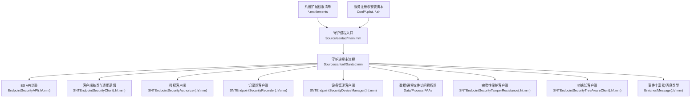
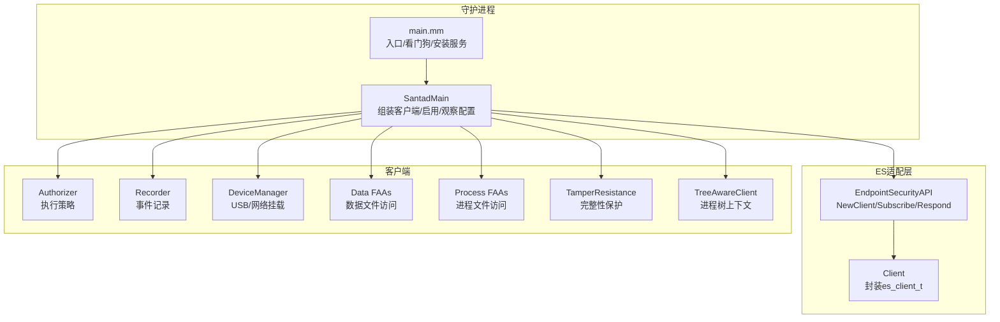
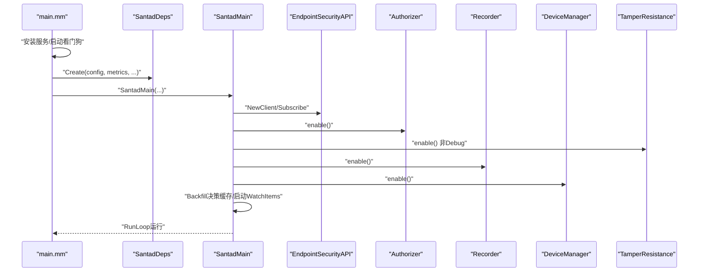
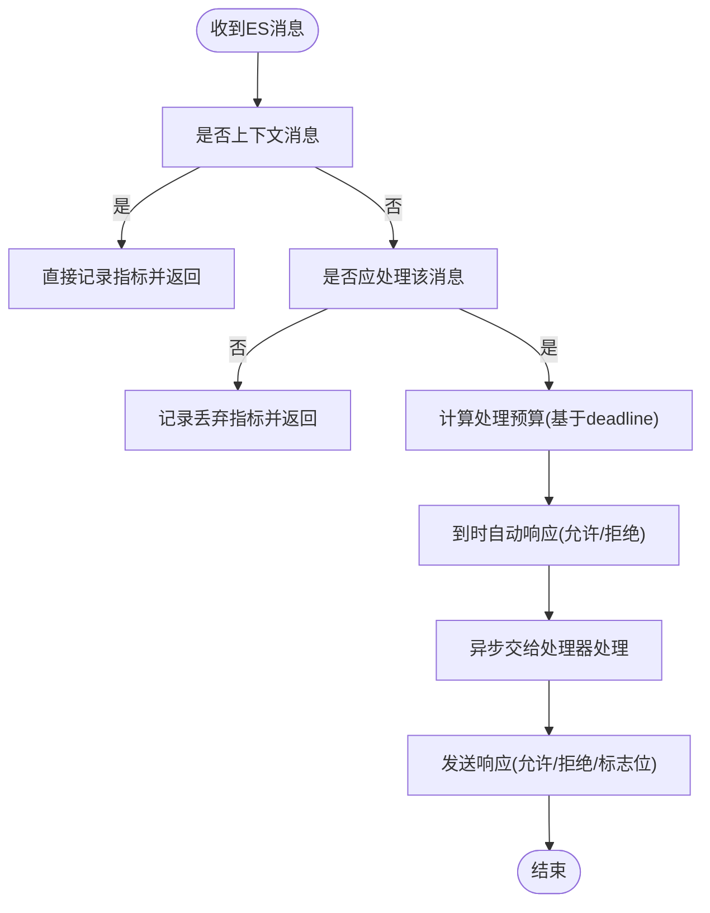
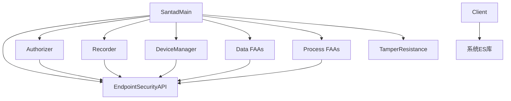

# 系统扩展

<cite>
**本文引用的文件**
- [Source/santad/main.mm](file://Source/santad/main.mm)
- [Source/santad/Santad.mm](file://Source/santad/Santad.mm)
- [Source/santad/EventProviders/EndpointSecurity/EndpointSecurityAPI.h](file://Source/santad/EventProviders/EndpointSecurity/EndpointSecurityAPI.h)
- [Source/santad/EventProviders/EndpointSecurity/EndpointSecurityAPI.mm](file://Source/santad/EventProviders/EndpointSecurity/EndpointSecurityAPI.mm)
- [Source/santad/EventProviders/EndpointSecurity/Client.h](file://Source/santad/EventProviders/EndpointSecurity/Client.h)
- [Source/santad/EventProviders/SNTEndpointSecurityClient.h](file://Source/santad/EventProviders/SNTEndpointSecurityClient.h)
- [Source/santad/EventProviders/SNTEndpointSecurityClient.mm](file://Source/santad/EventProviders/SNTEndpointSecurityClient.mm)
- [Source/santad/EventProviders/SNTEndpointSecurityAuthorizer.h](file://Source/santad/EventProviders/SNTEndpointSecurityAuthorizer.h)
- [Source/santad/EventProviders/SNTEndpointSecurityAuthorizer.mm](file://Source/santad/EventProviders/SNTEndpointSecurityAuthorizer.mm)
- [Source/santad/EventProviders/SNTEndpointSecurityRecorder.h](file://Source/santad/EventProviders/SNTEndpointSecurityRecorder.h)
- [Source/santad/EventProviders/SNTEndpointSecurityRecorder.mm](file://Source/santad/EventProviders/SNTEndpointSecurityRecorder.mm)
- [Source/santad/EventProviders/SNTEndpointSecurityDeviceManager.h](file://Source/santad/EventProviders/SNTEndpointSecurityDeviceManager.h)
- [Source/santad/EventProviders/SNTEndpointSecurityDeviceManager.mm](file://Source/santad/EventProviders/SNTEndpointSecurityDeviceManager.mm)
- [Source/santad/EventProviders/SNTEndpointSecurityDataFileAccessAuthorizer.h](file://Source/santad/EventProviders/SNTEndpointSecurityDataFileAccessAuthorizer.h)
- [Source/santad/EventProviders/SNTEndpointSecurityDataFileAccessAuthorizer.mm](file://Source/santad/EventProviders/SNTEndpointSecurityDataFileAccessAuthorizer.mm)
- [Source/santad/EventProviders/SNTEndpointSecurityProcessFileAccessAuthorizer.h](file://Source/santad/EventProviders/SNTEndpointSecurityProcessFileAccessAuthorizer.h)
- [Source/santad/EventProviders/SNTEndpointSecurityProcessFileAccessAuthorizer.mm](file://Source/santad/EventProviders/SNTEndpointSecurityProcessFileAccessAuthorizer.mm)
- [Source/santad/EventProviders/SNTEndpointSecurityTamperResistance.h](file://Source/santad/EventProviders/SNTEndpointSecurityTamperResistance.h)
- [Source/santad/EventProviders/SNTEndpointSecurityTamperResistance.mm](file://Source/santad/EventProviders/SNTEndpointSecurityTamperResistance.mm)
- [Source/santad/EventProviders/SNTEndpointSecurityTreeAwareClient.h](file://Source/santad/EventProviders/SNTEndpointSecurityTreeAwareClient.h)
- [Source/santad/EventProviders/SNTEndpointSecurityTreeAwareClient.mm](file://Source/santad/EventProviders/SNTEndpointSecurityTreeAwareClient.mm)
- [Source/santad/EventProviders/EndpointSecurity/Enricher.h](file://Source/santad/EventProviders/EndpointSecurity/Enricher.h)
- [Source/santad/EventProviders/EndpointSecurity/Enricher.mm](file://Source/santad/EventProviders/EndpointSecurity/Enricher.mm)
- [Source/santad/EventProviders/EndpointSecurity/Message.h](file://Source/santad/EventProviders/EndpointSecurity/Message.h)
- [Source/santad/EventProviders/EndpointSecurity/Message.mm](file://Source/santad/EventProviders/EndpointSecurity/Message.mm)
- [Source/santad/EventProviders/EndpointSecurity/EnrichedTypes.h](file://Source/santad/EventProviders/EndpointSecurity/EnrichedTypes.h)
- [Source/santad/EventProviders/EndpointSecurity/EnrichedTypes.mm](file://Source/santad/EventProviders/EndpointSecurity/EnrichedTypes.mm)
- [Source/santad/EventProviders/EndpointSecurity/MockEndpointSecurityAPI.h](file://Source/santad/EventProviders/EndpointSecurity/MockEndpointSecurityAPI.h)
- [Source/santad/EventProviders/EndpointSecurity/MockEnricher.h](file://Source/santad/EventProviders/EndpointSecurity/MockEnricher.h)
- [Source/santad/com.northpolesec.santa.daemon.systemextension-adhoc.entitlements](file://Source/santad/com.northpolesec.santa.daemon.systemextension-adhoc.entitlements)
- [Conf/com.northpolesec.santa.plist](file://Conf/com.northpolesec.santa.plist)
- [Conf/com.northpolesec.santa.bundleservice.plist](file://Conf/com.northpolesec.santa.bundleservice.plist)
- [Conf/com.northpolesec.santa.metricservice.plist](file://Conf/com.northpolesec.santa.metricservice.plist)
- [Conf/com.northpolesec.santa.syncservice.plist](file://Conf/com.northpolesec.santa.syncservice.plist)
- [Conf/com.northpolesec.santa.migration.plist](file://Conf/com.northpolesec.santa.migration.plist)
- [Conf/install_services.sh](file://Conf/install_services.sh)
- [Conf/install.sh](file://Conf/install.sh)
- [Conf/uninstall.sh](file://Conf/uninstall.sh)
</cite>

## 目录
1. [简介](#简介)
2. [项目结构](#项目结构)
3. [核心组件](#核心组件)
4. [架构总览](#架构总览)
5. [详细组件分析](#详细组件分析)
6. [依赖关系分析](#依赖关系分析)
7. [性能考量](#性能考量)
8. [故障排除指南](#故障排除指南)
9. [结论](#结论)
10. [附录](#附录)

## 简介
本技术文档面向Santa系统扩展（内核级组件），聚焦其在macOS上的职责与实现：通过Endpoint Security API捕获系统事件、在内核态执行安全策略、与用户态守护进程通信，并与macOS系统扩展框架集成。文档覆盖初始化流程、事件订阅机制、权限与沙箱限制、生命周期管理、错误处理策略、性能优化与调试监控方法。

## 项目结构
Santa系统扩展相关代码主要位于Source/santad目录下，围绕“守护进程入口”“ES适配层”“客户端集合”“设备与文件访问授权器”“记录器/审计器”“完整性保护”等模块组织。安装与服务注册由Conf目录中的plist与脚本完成。

图示来源
- [Source/santad/main.mm](file://Source/santad/main.mm#L104-L151)
- [Source/santad/Santad.mm](file://Source/santad/Santad.mm#L73-L150)
- [Source/santad/EventProviders/EndpointSecurity/EndpointSecurityAPI.h](file://Source/santad/EventProviders/EndpointSecurity/EndpointSecurityAPI.h#L28-L78)
- [Source/santad/EventProviders/SNTEndpointSecurityClient.mm](file://Source/santad/EventProviders/SNTEndpointSecurityClient.mm#L133-L179)
- [Source/santad/EventProviders/SNTEndpointSecurityAuthorizer.mm](file://Source/santad/EventProviders/SNTEndpointSecurityAuthorizer.mm)
- [Source/santad/EventProviders/SNTEndpointSecurityRecorder.mm](file://Source/santad/EventProviders/SNTEndpointSecurityRecorder.mm)
- [Source/santad/EventProviders/SNTEndpointSecurityDeviceManager.mm](file://Source/santad/EventProviders/SNTEndpointSecurityDeviceManager.mm)
- [Source/santad/EventProviders/SNTEndpointSecurityDataFileAccessAuthorizer.mm](file://Source/santad/EventProviders/SNTEndpointSecurityDataFileAccessAuthorizer.mm)
- [Source/santad/EventProviders/SNTEndpointSecurityProcessFileAccessAuthorizer.mm](file://Source/santad/EventProviders/SNTEndpointSecurityProcessFileAccessAuthorizer.mm)
- [Source/santad/EventProviders/SNTEndpointSecurityTamperResistance.mm](file://Source/santad/EventProviders/SNTEndpointSecurityTamperResistance.mm)
- [Source/santad/EventProviders/SNTEndpointSecurityTreeAwareClient.mm](file://Source/santad/EventProviders/SNTEndpointSecurityTreeAwareClient.mm)
- [Source/santad/EventProviders/EndpointSecurity/Enricher.mm](file://Source/santad/EventProviders/EndpointSecurity/Enricher.mm)
- [Source/santad/EventProviders/EndpointSecurity/Message.mm](file://Source/santad/EventProviders/EndpointSecurity/Message.mm)
- [Source/santad/com.northpolesec.santa.daemon.systemextension-adhoc.entitlements](file://Source/santad/com.northpolesec.santa.daemon.systemextension-adhoc.entitlements#L1-L9)
- [Conf/com.northpolesec.santa.plist](file://Conf/com.northpolesec.santa.plist)
- [Conf/install_services.sh](file://Conf/install_services.sh)

章节来源
- [Source/santad/main.mm](file://Source/santad/main.mm#L104-L151)
- [Source/santad/Santad.mm](file://Source/santad/Santad.mm#L73-L150)
- [Conf/install_services.sh](file://Conf/install_services.sh)

## 核心组件
- 守护进程入口与主循环
  - 负责启动看门狗线程、安装系统服务、构建依赖并调用守护进程主流程。
- ES API封装
  - 对macOS EndpointSecurity API进行薄封装，提供客户端创建、订阅、静音/反向静音、响应结果等能力。
- 客户端基类与通用逻辑
  - 统一处理ES消息接收、上下文消息、自静音、订阅/退订、响应、超时自动响应、队列与预算计算。
- 授权客户端
  - 首个启用的客户端，负责执行策略决策（如EXEC），并与策略处理器协作。
- 记录器客户端
  - 订阅并记录事件，支持前缀树与进程树增强。
- 设备管理客户端
  - 处理USB挂载/网络挂载等设备事件，回调通知与同步队列。
- 文件访问授权器（数据/进程）
  - 基于WatchItems与策略处理器，对数据/进程文件访问进行授权与阻断。
- 完整性保护客户端
  - 在非Debug构建中启用，防止被篡改。
- 树感知客户端
  - 与进程树结合，提供更完整的事件上下文。
- 事件丰富器与消息类型
  - 提供事件元数据丰富、令牌解析、序列化等。

章节来源
- [Source/santad/main.mm](file://Source/santad/main.mm#L104-L151)
- [Source/santad/Santad.mm](file://Source/santad/Santad.mm#L132-L223)
- [Source/santad/EventProviders/EndpointSecurity/EndpointSecurityAPI.h](file://Source/santad/EventProviders/EndpointSecurity/EndpointSecurityAPI.h#L28-L78)
- [Source/santad/EventProviders/EndpointSecurity/EndpointSecurityAPI.mm](file://Source/santad/EventProviders/EndpointSecurity/EndpointSecurityAPI.mm#L25-L173)
- [Source/santad/EventProviders/SNTEndpointSecurityClient.mm](file://Source/santad/EventProviders/SNTEndpointSecurityClient.mm#L133-L179)
- [Source/santad/EventProviders/SNTEndpointSecurityAuthorizer.mm](file://Source/santad/EventProviders/SNTEndpointSecurityAuthorizer.mm)
- [Source/santad/EventProviders/SNTEndpointSecurityRecorder.mm](file://Source/santad/EventProviders/SNTEndpointSecurityRecorder.mm)
- [Source/santad/EventProviders/SNTEndpointSecurityDeviceManager.mm](file://Source/santad/EventProviders/SNTEndpointSecurityDeviceManager.mm)
- [Source/santad/EventProviders/SNTEndpointSecurityDataFileAccessAuthorizer.mm](file://Source/santad/EventProviders/SNTEndpointSecurityDataFileAccessAuthorizer.mm)
- [Source/santad/EventProviders/SNTEndpointSecurityProcessFileAccessAuthorizer.mm](file://Source/santad/EventProviders/SNTEndpointSecurityProcessFileAccessAuthorizer.mm)
- [Source/santad/EventProviders/SNTEndpointSecurityTamperResistance.mm](file://Source/santad/EventProviders/SNTEndpointSecurityTamperResistance.mm)
- [Source/santad/EventProviders/SNTEndpointSecurityTreeAwareClient.mm](file://Source/santad/EventProviders/SNTEndpointSecurityTreeAwareClient.mm)
- [Source/santad/EventProviders/EndpointSecurity/Enricher.mm](file://Source/santad/EventProviders/EndpointSecurity/Enricher.mm)
- [Source/santad/EventProviders/EndpointSecurity/Message.mm](file://Source/santad/EventProviders/EndpointSecurity/Message.mm)

## 架构总览
系统扩展以守护进程为核心，通过ES API订阅内核事件，按职责拆分为多个客户端协同工作。授权客户端优先启用以确保执行策略正确生效；记录器与设备管理客户端分别负责审计与外设事件；文件访问授权器基于策略与WatchItems进行细粒度控制；完整性保护在发布构建中启用；树感知客户端提供进程树上下文。

图示来源
- [Source/santad/main.mm](file://Source/santad/main.mm#L104-L151)
- [Source/santad/Santad.mm](file://Source/santad/Santad.mm#L132-L223)
- [Source/santad/EventProviders/EndpointSecurity/EndpointSecurityAPI.h](file://Source/santad/EventProviders/EndpointSecurity/EndpointSecurityAPI.h#L28-L78)
- [Source/santad/EventProviders/EndpointSecurity/Client.h](file://Source/santad/EventProviders/EndpointSecurity/Client.h#L24-L66)
- [Source/santad/EventProviders/SNTEndpointSecurityAuthorizer.mm](file://Source/santad/EventProviders/SNTEndpointSecurityAuthorizer.mm)
- [Source/santad/EventProviders/SNTEndpointSecurityRecorder.mm](file://Source/santad/EventProviders/SNTEndpointSecurityRecorder.mm)
- [Source/santad/EventProviders/SNTEndpointSecurityDeviceManager.mm](file://Source/santad/EventProviders/SNTEndpointSecurityDeviceManager.mm)
- [Source/santad/EventProviders/SNTEndpointSecurityDataFileAccessAuthorizer.mm](file://Source/santad/EventProviders/SNTEndpointSecurityDataFileAccessAuthorizer.mm)
- [Source/santad/EventProviders/SNTEndpointSecurityProcessFileAccessAuthorizer.mm](file://Source/santad/EventProviders/SNTEndpointSecurityProcessFileAccessAuthorizer.mm)
- [Source/santad/EventProviders/SNTEndpointSecurityTamperResistance.mm](file://Source/santad/EventProviders/SNTEndpointSecurityTamperResistance.mm)
- [Source/santad/EventProviders/SNTEndpointSecurityTreeAwareClient.mm](file://Source/santad/EventProviders/SNTEndpointSecurityTreeAwareClient.mm)

## 详细组件分析

### 初始化流程与生命周期
- 入口与看门狗
  - 启动后安装系统服务，创建看门狗定时器监控CPU/RAM使用。
- 依赖注入与主流程
  - 构建SantadDeps，传入ESAPI、日志、指标、策略、缓存、编译器、通知队列、同步队列、执行控制器、前缀树、TTY写入器、进程树、权限过滤器。
- 客户端装配与启用顺序
  - 先启用授权客户端，再启用记录器、设备管理客户端；完整性保护在非Debug构建启用；预填充决策缓存；启动WatchItems定时器。
- 运行循环
  - 进入NSRunLoop保持运行。

图示来源
- [Source/santad/main.mm](file://Source/santad/main.mm#L104-L151)
- [Source/santad/Santad.mm](file://Source/santad/Santad.mm#L73-L150)
- [Source/santad/Santad.mm](file://Source/santad/Santad.mm#L758-L794)

章节来源
- [Source/santad/main.mm](file://Source/santad/main.mm#L104-L151)
- [Source/santad/Santad.mm](file://Source/santad/Santad.mm#L73-L150)
- [Source/santad/Santad.mm](file://Source/santad/Santad.mm#L758-L794)

### 事件订阅机制与消息处理
- 客户端建立与自静音
  - 创建ES客户端，失败则抛出异常；成功后静音自身进程避免回环。
- 消息分发与预算
  - 基于事件deadline计算处理预算，超时自动允许/拒绝，保证内核不会长时间等待。
- 订阅/退订与静音控制
  - 支持路径/进程静音、反向静音、全量解除静音等。

图示来源
- [Source/santad/EventProviders/SNTEndpointSecurityClient.mm](file://Source/santad/EventProviders/SNTEndpointSecurityClient.mm#L133-L179)
- [Source/santad/EventProviders/SNTEndpointSecurityClient.mm](file://Source/santad/EventProviders/SNTEndpointSecurityClient.mm#L286-L359)
- [Source/santad/EventProviders/EndpointSecurity/EndpointSecurityAPI.mm](file://Source/santad/EventProviders/EndpointSecurity/EndpointSecurityAPI.mm#L46-L124)

章节来源
- [Source/santad/EventProviders/SNTEndpointSecurityClient.mm](file://Source/santad/EventProviders/SNTEndpointSecurityClient.mm#L133-L179)
- [Source/santad/EventProviders/SNTEndpointSecurityClient.mm](file://Source/santad/EventProviders/SNTEndpointSecurityClient.mm#L286-L359)
- [Source/santad/EventProviders/EndpointSecurity/EndpointSecurityAPI.mm](file://Source/santad/EventProviders/EndpointSecurity/EndpointSecurityAPI.mm#L46-L124)

### 权限管理与安全边界
- 系统扩展权限
  - 使用系统扩展权限清单声明ES客户端权限。
- 运行条件
  - ES客户端创建可能因无全盘访问、未授权、非root、参数无效或客户端过多而失败。
- 自静音与互斥
  - 成功建立客户端后立即静音自身，避免重复处理；支持反向静音以精确控制监听范围。
- 完整性保护
  - 发布构建启用Tamper Resistance，防止被篡改。

章节来源
- [Source/santad/com.northpolesec.santa.daemon.systemextension-adhoc.entitlements](file://Source/santad/com.northpolesec.santa.daemon.systemextension-adhoc.entitlements#L1-L9)
- [Source/santad/EventProviders/SNTEndpointSecurityClient.mm](file://Source/santad/EventProviders/SNTEndpointSecurityClient.mm#L98-L109)
- [Source/santad/EventProviders/SNTEndpointSecurityClient.mm](file://Source/santad/EventProviders/SNTEndpointSecurityClient.mm#L181-L194)
- [Source/santad/EventProviders/SNTEndpointSecurityTamperResistance.mm](file://Source/santad/EventProviders/SNTEndpointSecurityTamperResistance.mm)

### 与macOS系统扩展框架的集成
- 服务注册
  - 通过plist定义守护进程、指标服务、同步服务、迁移服务等，配合安装脚本完成注册。
- 安装流程
  - 守护进程入口调用安装脚本，设置环境变量并执行bash脚本，完成服务安装。

图示来源
- [Conf/com.northpolesec.santa.plist](file://Conf/com.northpolesec.santa.plist)
- [Conf/com.northpolesec.santa.metricservice.plist](file://Conf/com.northpolesec.santa.metricservice.plist)
- [Conf/com.northpolesec.santa.syncservice.plist](file://Conf/com.northpolesec.santa.syncservice.plist)
- [Conf/com.northpolesec.santa.migration.plist](file://Conf/com.northpolesec.santa.migration.plist)
- [Conf/install_services.sh](file://Conf/install_services.sh)
- [Source/santad/main.mm](file://Source/santad/main.mm#L90-L103)

章节来源
- [Conf/com.northpolesec.santa.plist](file://Conf/com.northpolesec.santa.plist)
- [Conf/com.northpolesec.santa.metricservice.plist](file://Conf/com.northpolesec.santa.metricservice.plist)
- [Conf/com.northpolesec.santa.syncservice.plist](file://Conf/com.northpolesec.santa.syncservice.plist)
- [Conf/com.northpolesec.santa.migration.plist](file://Conf/com.northpolesec.santa.migration.plist)
- [Conf/install_services.sh](file://Conf/install_services.sh)
- [Source/santad/main.mm](file://Source/santad/main.mm#L90-L103)

### 内核级安全策略与与用户态通信
- 策略执行
  - 授权客户端在AUTH EXEC等事件上执行策略，结合决策缓存、规则表、编译器控制器与TTY写入器。
- 用户态通信
  - XPC接口用于控制、通知、指标、同步等；守护进程导出控制对象并通过连接对外提供服务。
- 设备与文件访问
  - 设备管理客户端处理USB/网络挂载事件并通知；文件访问授权器根据WatchItems与策略处理器决定放行或阻断。

章节来源
- [Source/santad/Santad.mm](file://Source/santad/Santad.mm#L132-L223)
- [Source/santad/EventProviders/SNTEndpointSecurityAuthorizer.mm](file://Source/santad/EventProviders/SNTEndpointSecurityAuthorizer.mm)
- [Source/santad/EventProviders/SNTEndpointSecurityDeviceManager.mm](file://Source/santad/EventProviders/SNTEndpointSecurityDeviceManager.mm)
- [Source/santad/EventProviders/SNTEndpointSecurityDataFileAccessAuthorizer.mm](file://Source/santad/EventProviders/SNTEndpointSecurityDataFileAccessAuthorizer.mm)
- [Source/santad/EventProviders/SNTEndpointSecurityProcessFileAccessAuthorizer.mm](file://Source/santad/EventProviders/SNTEndpointSecurityProcessFileAccessAuthorizer.mm)

## 依赖关系分析
- 组件耦合
  - 守护进程主流程聚合各客户端；客户端共享ES API与指标、日志、策略、缓存等依赖。
- 外部依赖
  - macOS EndpointSecurity框架、XPC、系统服务注册机制。
- 循环依赖规避
  - Client析构时直接调用es_delete_client，避免通过ES API间接引用导致循环。

图示来源
- [Source/santad/Santad.mm](file://Source/santad/Santad.mm#L73-L150)
- [Source/santad/EventProviders/EndpointSecurity/Client.h](file://Source/santad/EventProviders/EndpointSecurity/Client.h#L24-L66)

章节来源
- [Source/santad/Santad.mm](file://Source/santad/Santad.mm#L73-L150)
- [Source/santad/EventProviders/EndpointSecurity/Client.h](file://Source/santad/EventProviders/EndpointSecurity/Client.h#L24-L66)

## 性能考量
- 处理预算与超时
  - 基于事件deadline动态计算处理预算，最小/最大头寸限制确保紧急响应时间。
- 并发队列
  - 认证队列使用高优先级并发队列，通知队列使用低优先级并发队列，避免阻塞关键路径。
- 缓存与预热
  - 启动后预填充决策缓存，减少首次策略评估延迟。
- 观察者模式
  - 通过KVO监听配置变化，必要时刷新缓存或重启组件，避免频繁重启。

章节来源
- [Source/santad/EventProviders/SNTEndpointSecurityClient.mm](file://Source/santad/EventProviders/SNTEndpointSecurityClient.mm#L286-L359)
- [Source/santad/Santad.mm](file://Source/santad/Santad.mm#L73-L150)

## 故障排除指南
- ES客户端创建失败
  - 可能原因：未授予全盘访问、未授权、非root、参数无效、同时客户端过多。查看错误信息并检查系统扩展权限与安装状态。
- 事件未被处理
  - 检查客户端是否已启用、订阅事件类型是否正确、是否存在自静音导致的回环。
- 策略未生效
  - 确认授权客户端已优先启用；检查决策缓存与规则表更新；确认配置变更触发了缓存刷新。
- 完整性保护影响
  - 发布构建启用Tamper Resistance，若出现异常行为，检查完整性保护是否误判。
- 服务未注册
  - 确认安装脚本执行成功，plist已正确注册，系统服务可用。

章节来源
- [Source/santad/EventProviders/SNTEndpointSecurityClient.mm](file://Source/santad/EventProviders/SNTEndpointSecurityClient.mm#L98-L109)
- [Source/santad/Santad.mm](file://Source/santad/Santad.mm#L758-L794)
- [Conf/install_services.sh](file://Conf/install_services.sh)

## 结论
Santa系统扩展通过ES API在内核态捕获系统事件，在用户态执行安全策略并与用户态守护进程紧密协作。其设计强调可插拔客户端、严格的生命周期管理、完备的错误处理与性能保障。通过系统扩展权限与服务注册机制，系统实现了对执行、文件访问、设备事件的统一治理。

## 附录
- 关键实现位置参考
  - ES API封装与客户端基类：[EndpointSecurityAPI.h](file://Source/santad/EventProviders/EndpointSecurity/EndpointSecurityAPI.h#L28-L78)，[EndpointSecurityAPI.mm](file://Source/santad/EventProviders/EndpointSecurity/EndpointSecurityAPI.mm#L25-L173)，[SNTEndpointSecurityClient.h](file://Source/santad/EventProviders/SNTEndpointSecurityClient.h#L15-L21)，[SNTEndpointSecurityClient.mm](file://Source/santad/EventProviders/SNTEndpointSecurityClient.mm#L133-L179)
  - 守护进程主流程与客户端装配：[Santad.mm](file://Source/santad/Santad.mm#L73-L223)
  - 系统扩展权限清单：[systemextension-adhoc.entitlements](file://Source/santad/com.northpolesec.santa.daemon.systemextension-adhoc.entitlements#L1-L9)
  - 服务注册与安装脚本：[com.northpolesec.santa.plist](file://Conf/com.northpolesec.santa.plist)，[install_services.sh](file://Conf/install_services.sh)