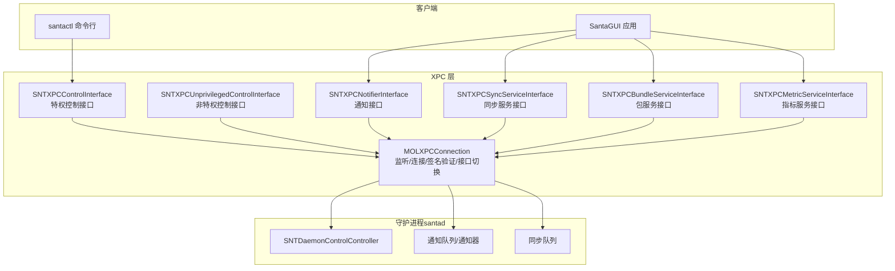
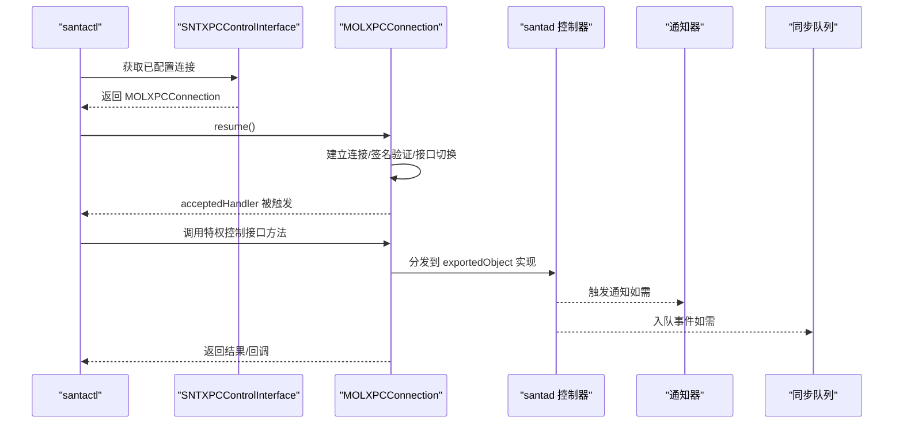
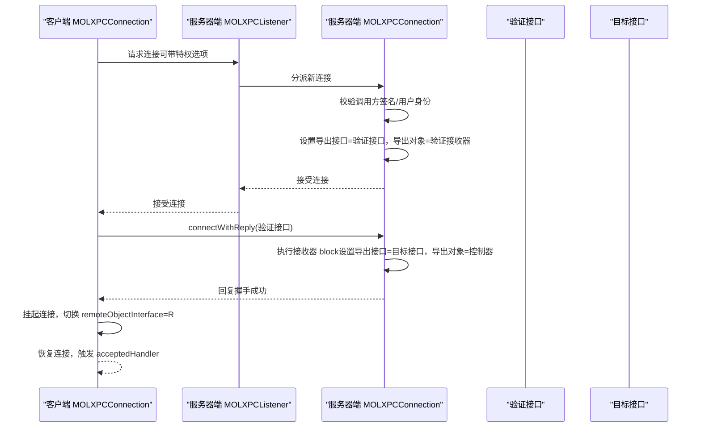
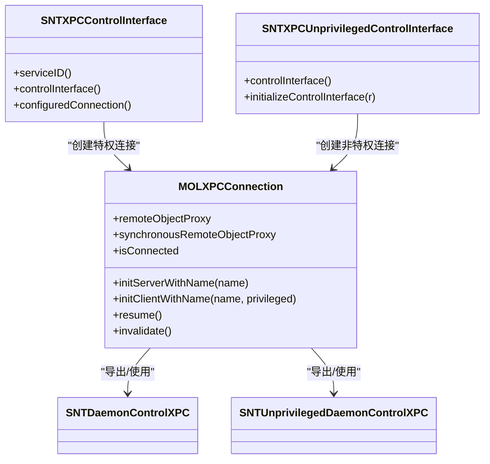
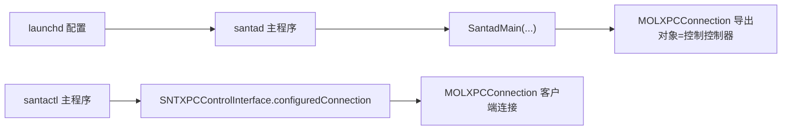

# 组件间通信

<cite>
**本文引用的文件**
- [MOLXPCConnection.h](file://Source/common/MOLXPCConnection.h)
- [MOLXPCConnection.mm](file://Source/common/MOLXPCConnection.mm)
- [SNTXPCControlInterface.h](file://Source/common/SNTXPCControlInterface.h)
- [SNTXPCControlInterface.mm](file://Source/common/SNTXPCControlInterface.mm)
- [SNTXPCUnprivilegedControlInterface.h](file://Source/common/SNTXPCUnprivilegedControlInterface.h)
- [SNTXPCNotifierInterface.h](file://Source/common/SNTXPCNotifierInterface.h)
- [SNTXPCSyncServiceInterface.h](file://Source/common/SNTXPCSyncServiceInterface.h)
- [SNTXPCBundleServiceInterface.h](file://Source/common/SNTXPCBundleServiceInterface.h)
- [SNTXPCMetricServiceInterface.h](file://Source/common/SNTXPCMetricServiceInterface.h)
- [Santad.mm](file://Source/santad/Santad.mm)
- [main.mm（santad）](file://Source/santad/main.mm)
- [main.mm（santactl）](file://Source/santactl/main.mm)
- [MOLXPCConnectionTest.mm](file://Source/common/MOLXPCConnectionTest.mm)
- [com.northpolesec.santa.plist](file://Conf/com.northpolesec.santa.plist)
</cite>

## 目录
1. [引言](#引言)
2. [项目结构](#项目结构)
3. [核心组件](#核心组件)
4. [架构总览](#架构总览)
5. [详细组件分析](#详细组件分析)
6. [依赖关系分析](#依赖关系分析)
7. [性能考虑](#性能考虑)
8. [故障排除指南](#故障排除指南)
9. [结论](#结论)

## 引言
本文件系统性梳理 Santa 的组件间通信机制，聚焦于基于 XPC 的进程间通信（IPC）。文档覆盖接口定义、连接管理、消息传递、特权与非特权控制接口差异、通信协议设计（含消息格式、异步与超时）、性能优化与故障恢复，并提供调试与监控建议。目标读者既包括需要快速上手的工程师，也包括希望深入理解实现细节的高级用户。

## 项目结构
Santa 的 XPC 通信围绕一组“接口类”和一个通用的连接封装器展开：
- 接口类：分别面向不同子系统的 XPC 协议与封装，如控制接口、通知接口、同步服务接口、包服务接口、指标服务接口。
- 连接封装器：MOLXPCConnection 提供统一的监听/连接、签名验证、接口切换、失效处理等能力。
- 服务端与客户端：santad 作为守护进程在启动时导出受控接口；santactl、GUI 等以客户端身份通过配置好的连接发起调用。

图表来源
- [Santad.mm](file://Source/santad/Santad.mm#L84-L120)
- [SNTXPCControlInterface.mm](file://Source/common/SNTXPCControlInterface.mm#L82-L96)
- [SNTXPCUnprivilegedControlInterface.h](file://Source/common/SNTXPCUnprivilegedControlInterface.h#L42-L118)
- [SNTXPCNotifierInterface.h](file://Source/common/SNTXPCNotifierInterface.h#L28-L47)
- [SNTXPCSyncServiceInterface.h](file://Source/common/SNTXPCSyncServiceInterface.h#L30-L71)
- [SNTXPCBundleServiceInterface.h](file://Source/common/SNTXPCBundleServiceInterface.h#L37-L56)
- [SNTXPCMetricServiceInterface.h](file://Source/common/SNTXPCMetricServiceInterface.h#L20-L31)

章节来源
- [Santad.mm](file://Source/santad/Santad.mm#L84-L120)
- [main.mm（santad）](file://Source/santad/main.mm#L104-L151)
- [main.mm（santactl）](file://Source/santactl/main.mm#L39-L84)

## 核心组件
- MOLXPCConnection：对 NSXPCListener/NSXPCConnection 的封装，提供强制连接建立、签名验证、接口动态切换、失效回调等能力。
- 各接口封装类：为特定子系统提供预配置的 NSXPCInterface 和便捷的连接获取方法，屏蔽 Mach 服务名、接口类型、参数类型注册等细节。

章节来源
- [MOLXPCConnection.h](file://Source/common/MOLXPCConnection.h#L54-L154)
- [MOLXPCConnection.mm](file://Source/common/MOLXPCConnection.mm#L55-L239)
- [SNTXPCControlInterface.mm](file://Source/common/SNTXPCControlInterface.mm#L82-L96)
- [SNTXPCUnprivilegedControlInterface.h](file://Source/common/SNTXPCUnprivilegedControlInterface.h#L119-L133)

## 架构总览
下图展示从客户端到守护进程的关键交互路径，以及各接口在整体架构中的定位。

图表来源
- [SNTXPCControlInterface.mm](file://Source/common/SNTXPCControlInterface.mm#L82-L96)
- [MOLXPCConnection.mm](file://Source/common/MOLXPCConnection.mm#L114-L157)
- [Santad.mm](file://Source/santad/Santad.mm#L84-L120)

## 详细组件分析

### MOLXPCConnection：连接建立、消息序列化与错误处理
- 初始化与角色
  - 服务器端：支持匿名监听器或指定 Mach 服务名；设置验证接口与最终导出接口。
  - 客户端：支持通过监听端点、服务名或特权选项建立连接；在 resume 阶段完成连接建立与接口切换。
- 连接建立流程
  - 客户端：先以验证接口远程代理发送握手消息，收到回复后挂起连接，再切换为目标接口并恢复，确保 remoteObjectProxy 可用且类型正确。
  - 服务器端：监听新连接，按调用方有效用户身份选择特权/非特权导出接口；进行代码签名匹配校验；接受连接后延迟设置导出对象与接口，随后恢复。
- 错误与失效处理
  - 客户端中断/失效处理器会清理 remoteObjectInterface 并触发 invalidationHandler。
  - 连接超时：若在限定时间内未完成握手，主动使连接失效，避免悬挂状态。
- 远程代理与同步代理
  - remoteObjectProxy：异步调用入口。
  - synchronousRemoteObjectProxy：同步调用入口，便于需要阻塞等待的场景。
- 状态判断
  - isConnected：仅当 remoteObjectInterface 已切换为目标接口时视为已建立。

图表来源
- [MOLXPCConnection.mm](file://Source/common/MOLXPCConnection.mm#L114-L157)
- [MOLXPCConnection.mm](file://Source/common/MOLXPCConnection.mm#L159-L202)
- [MOLXPCConnection.mm](file://Source/common/MOLXPCConnection.mm#L204-L226)

章节来源
- [MOLXPCConnection.h](file://Source/common/MOLXPCConnection.h#L54-L154)
- [MOLXPCConnection.mm](file://Source/common/MOLXPCConnection.mm#L55-L239)
- [MOLXPCConnectionTest.mm](file://Source/common/MOLXPCConnectionTest.mm#L109-L145)

### 控制接口：特权与非特权
- 特权控制接口（SNTDaemonControlXPC）
  - 由 SNTXPCControlInterface 封装，面向 santactl 等需要 root 权限的操作（如数据库写入、规则批量导入、杀进程、安装应用等）。
  - 通过 MOLXPCConnection 以特权模式连接，remoteInterface 使用控制接口。
- 非特权控制接口（SNTUnprivilegedDaemonControlXPC）
  - 由 SNTXPCUnprivilegedControlInterface 定义，面向普通用户态操作（缓存查询、统计信息、配置状态、临时监控模式等）。
  - 通过非特权连接建立，remoteInterface 使用非特权接口。
- 服务端导出
  - 服务器端将控制器对象导出为 exportedObject，并在握手阶段根据调用方身份选择相应接口。

图表来源
- [SNTXPCControlInterface.h](file://Source/common/SNTXPCControlInterface.h#L79-L104)
- [SNTXPCControlInterface.mm](file://Source/common/SNTXPCControlInterface.mm#L82-L96)
- [SNTXPCUnprivilegedControlInterface.h](file://Source/common/SNTXPCUnprivilegedControlInterface.h#L42-L118)
- [MOLXPCConnection.h](file://Source/common/MOLXPCConnection.h#L54-L154)

章节来源
- [SNTXPCControlInterface.h](file://Source/common/SNTXPCControlInterface.h#L23-L78)
- [SNTXPCControlInterface.mm](file://Source/common/SNTXPCControlInterface.mm#L28-L96)
- [SNTXPCUnprivilegedControlInterface.h](file://Source/common/SNTXPCUnprivilegedControlInterface.h#L40-L118)

### 通知接口：GUI 与守护进程的消息桥
- SNTNotifierXPC：由 SantaGUI 使用，向守护进程请求弹窗、临时监控授权等。
- 守护进程侧通过通知队列连接向 GUI 发送阻断通知、网络挂载通知等。
- 该接口通常以非特权方式使用，避免提升权限。

章节来源
- [SNTXPCNotifierInterface.h](file://Source/common/SNTXPCNotifierInterface.h#L28-L47)
- [Santad.mm](file://Source/santad/Santad.mm#L100-L121)

### 包服务接口：GUI 与包服务的协作
- SNTBundleServiceXPC：用于对应用包进行二进制哈希计算，支持进度回调与完成回调。
- 客户端通过 NSXPCListenerEndpoint 将进度监听器回传给包服务，实现双向通信。
- 该接口常用于 GUI 场景，帮助用户理解包内文件处理进度。

章节来源
- [SNTXPCBundleServiceInterface.h](file://Source/common/SNTXPCBundleServiceInterface.h#L37-L77)

### 同步服务接口：与远端服务器的通信
- SNTSyncServiceXPC：负责事件上报、包事件上报、遥测导出、手动触发同步、日志回传等。
- 支持排队与串行执行，避免并发冲突；提供日志接收端点协议以便用户触发同步时回传日志。
- 该接口通常以非特权方式使用，但涉及外部网络访问。

章节来源
- [SNTXPCSyncServiceInterface.h](file://Source/common/SNTXPCSyncServiceInterface.h#L30-L100)

### 指标服务接口：监控系统集成
- SNTMetricServiceXPC：将当前指标数据导出至监控系统。
- 通常由守护进程在启用指标导出时调用。

章节来源
- [SNTXPCMetricServiceInterface.h](file://Source/common/SNTXPCMetricServiceInterface.h#L20-L31)

## 依赖关系分析
- 服务端启动与导出
  - santad 在主程序中创建依赖集合并启动主循环，随后将控制控制器导出为 XPC 对象，设置特权/非特权接口并 resume。
- 客户端初始化与使用
  - 各接口封装类提供 serviceID 与预配置连接，客户端只需设置回调并 resume 即可开始通信。
- 配置与加载
  - 守护进程通过 launchd 配置加载，配置文件中包含程序路径与参数。

图表来源
- [main.mm（santad）](file://Source/santad/main.mm#L104-L151)
- [Santad.mm](file://Source/santad/Santad.mm#L84-L120)
- [SNTXPCControlInterface.mm](file://Source/common/SNTXPCControlInterface.mm#L82-L96)
- [main.mm（santactl）](file://Source/santactl/main.mm#L39-L84)
- [com.northpolesec.santa.plist](file://Conf/com.northpolesec.santa.plist#L1-L22)

章节来源
- [main.mm（santad）](file://Source/santad/main.mm#L104-L151)
- [Santad.mm](file://Source/santad/Santad.mm#L84-L120)
- [SNTXPCControlInterface.mm](file://Source/common/SNTXPCControlInterface.mm#L82-L96)
- [main.mm（santactl）](file://Source/santactl/main.mm#L39-L84)
- [com.northpolesec.santa.plist](file://Conf/com.northpolesec.santa.plist#L1-L22)

## 性能考虑
- 连接建立与握手
  - 客户端在 resume 阶段完成连接建立与接口切换，避免首次调用才建立连接导致的抖动。
  - 握手阶段采用信号量限制最大等待时间，超时则主动失效，防止资源悬挂。
- 异步消息处理
  - 所有消息默认在后台线程投递，避免阻塞主线程；必要时使用同步代理以满足阻塞式需求。
- 接口切换与类型安全
  - 通过验证接口先行握手，再切换到目标接口，确保 remoteObjectProxy 类型正确，减少运行期错误。
- 连接池与复用
  - 当前实现未见显式的连接池；建议在高频调用场景下对同一 Mach 服务复用连接实例，避免频繁创建销毁带来的开销。
- 超时与重试
  - 握手超时策略已内置；对于业务级超时（如规则下载、事件上报），可在上层调用处增加超时与重试逻辑，结合日志追踪失败原因。

章节来源
- [MOLXPCConnection.mm](file://Source/common/MOLXPCConnection.mm#L114-L157)
- [MOLXPCConnection.h](file://Source/common/MOLXPCConnection.h#L47-L53)

## 故障排除指南
- 连接无法建立
  - 检查服务端是否已 resume 并导出正确的 exportedObject 与接口。
  - 确认客户端使用的 Mach 服务名与特权选项与服务端一致。
  - 关注 invalidationHandler 是否被触发，排查签名验证失败或用户身份不匹配问题。
- 握手超时
  - 若 resume 返回但 acceptedHandler 未触发，检查服务端是否正确切换导出接口与对象。
  - 查看客户端日志中是否出现超时并触发了连接失效。
- 类型不匹配或调用失败
  - 确保 NSXPCInterface 中自定义类参数已正确注册（接口封装类已内置初始化逻辑）。
  - 检查 remoteObjectProxy 是否为 nil（连接未建立或已失效）。
- 日志与诊断
  - 使用 launchd 配置输出系统日志，结合守护进程与客户端的日志定位问题。
  - 对关键路径增加回调与错误处理，记录异常栈与上下文信息。

章节来源
- [MOLXPCConnection.mm](file://Source/common/MOLXPCConnection.mm#L114-L157)
- [MOLXPCConnection.mm](file://Source/common/MOLXPCConnection.mm#L159-L202)
- [MOLXPCConnectionTest.mm](file://Source/common/MOLXPCConnectionTest.mm#L109-L145)

## 结论
Santa 的 XPC 通信体系以 MOLXPCConnection 为核心，结合多套专用接口封装，实现了清晰的权限分层与职责分离。通过验证接口握手、签名校验与接口动态切换，既保证了安全性，又提升了可用性。建议在生产环境中进一步完善连接复用、业务级超时与重试策略，并持续优化日志与监控，以获得更稳健的通信体验。