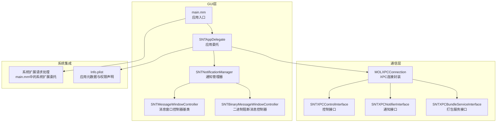
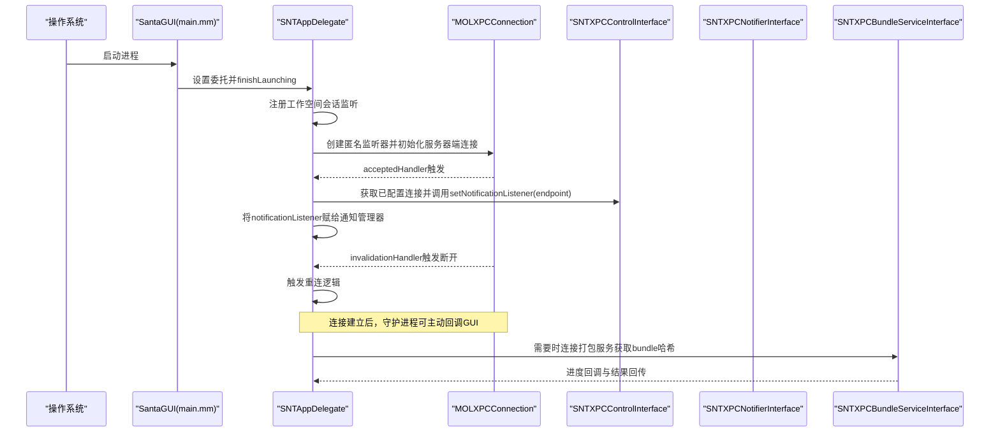
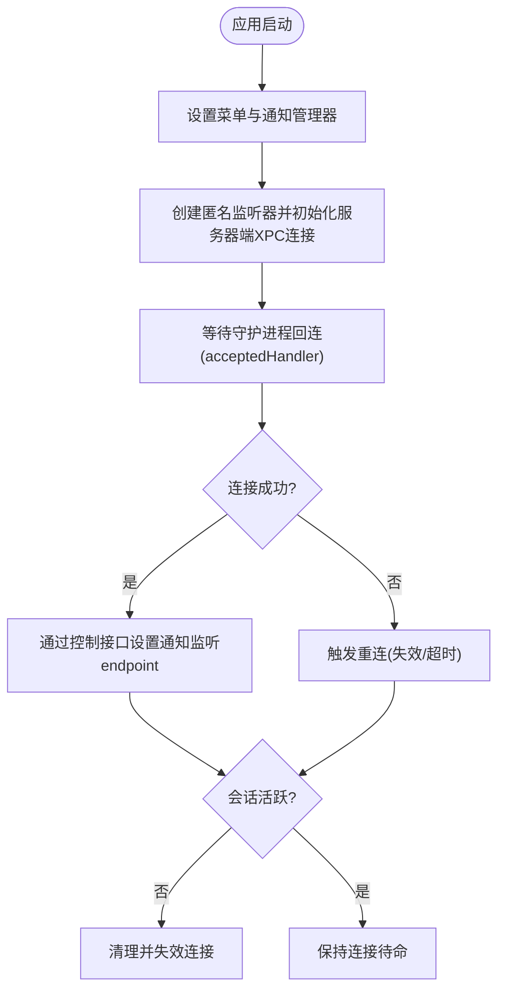
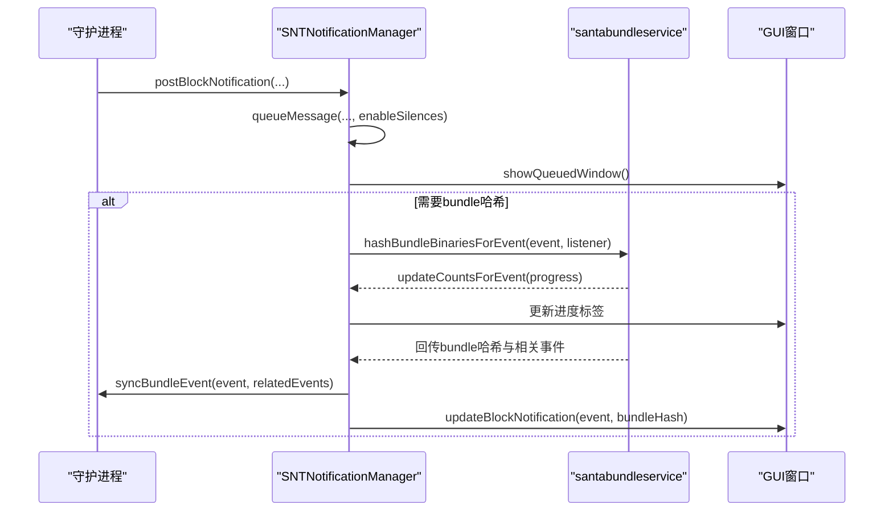
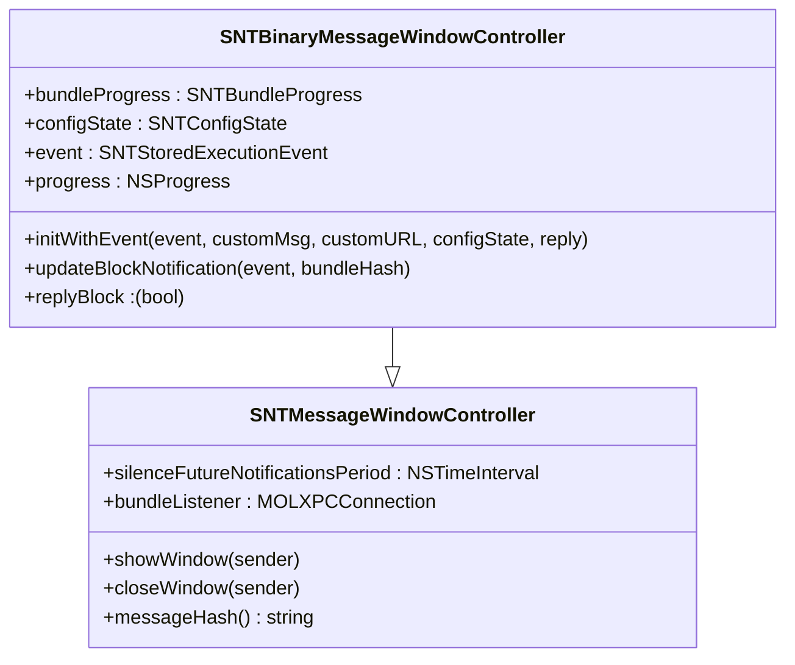
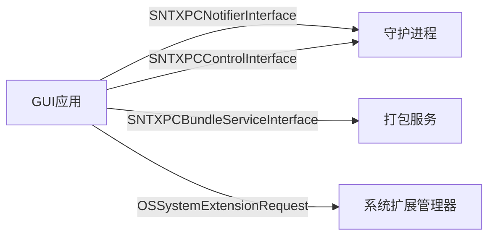
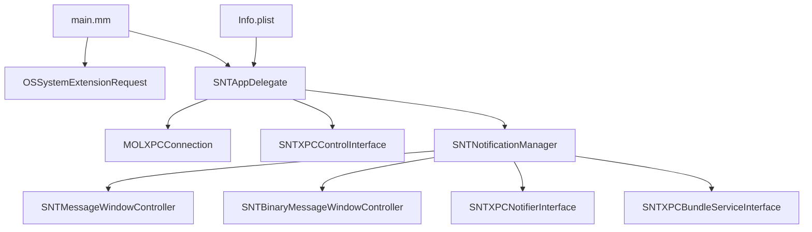

# GUI架构设计

<cite>
**本文引用的文件**
- [SNTAppDelegate.h](file://Source/gui/SNTAppDelegate.h)
- [SNTAppDelegate.mm](file://Source/gui/SNTAppDelegate.mm)
- [main.mm](file://Source/gui/main.mm)
- [Info.plist](file://Source/gui/Info.plist)
- [SNTNotificationManager.h](file://Source/gui/SNTNotificationManager.h)
- [SNTNotificationManager.mm](file://Source/gui/SNTNotificationManager.mm)
- [SNTMessageWindowController.h](file://Source/gui/SNTMessageWindowController.h)
- [SNTMessageWindowController.mm](file://Source/gui/SNTMessageWindowController.mm)
- [SNTBinaryMessageWindowController.h](file://Source/gui/SNTBinaryMessageWindowController.h)
- [SNTBinaryMessageWindowController.mm](file://Source/gui/SNTBinaryMessageWindowController.mm)
- [SNTXPCControlInterface.h](file://Source/common/SNTXPCControlInterface.h)
- [SNTXPCControlInterface.mm](file://Source/common/SNTXPCControlInterface.mm)
- [MOLXPCConnection.h](file://Source/common/MOLXPCConnection.h)
- [SNTXPCNotifierInterface.h](file://Source/common/SNTXPCNotifierInterface.h)
- [SNTXPCBundleServiceInterface.h](file://Source/common/SNTXPCBundleServiceInterface.h)
</cite>

## 目录
1. [简介](#简介)
2. [项目结构](#项目结构)
3. [核心组件](#核心组件)
4. [架构总览](#架构总览)
5. [详细组件分析](#详细组件分析)
6. [依赖关系分析](#依赖关系分析)
7. [性能考量](#性能考量)
8. [故障排查指南](#故障排查指南)
9. [结论](#结论)
10. [附录](#附录)

## 简介
本文件面向Santa项目的GUI架构设计，围绕SNTAppDelegate的应用程序委托职责展开，系统性阐述应用生命周期管理、与santad守护进程的连接建立、Main函数启动流程、初始化与资源管理策略；同时解析Info.plist在权限声明、系统扩展管理与应用元数据方面的角色，并深入说明GUI代理与系统扩展之间的交互方式、XPC通信机制以及进程间数据交换路径。最后给出GUI架构的扩展点与自定义开发指南，帮助开发者在不破坏现有契约的前提下进行二次开发。

## 项目结构
Santa的GUI位于Source/gui目录，核心入口为main.mm，应用委托为SNTAppDelegate，通知与消息展示由SNTNotificationManager及各类消息窗口控制器负责，底层通过MOLXPCConnection与SNTXPCControlInterface等接口实现与santad、santabundleservice等服务的XPC通信。

**图表来源**
- [main.mm](file://Source/gui/main.mm#L56-L93)
- [SNTAppDelegate.mm](file://Source/gui/SNTAppDelegate.mm#L40-L179)
- [SNTNotificationManager.mm](file://Source/gui/SNTNotificationManager.mm#L58-L147)
- [SNTMessageWindowController.mm](file://Source/gui/SNTMessageWindowController.mm#L23-L71)
- [SNTBinaryMessageWindowController.mm](file://Source/gui/SNTBinaryMessageWindowController.mm#L80-L100)
- [SNTXPCControlInterface.mm](file://Source/common/SNTXPCControlInterface.mm#L28-L96)
- [SNTXPCNotifierInterface.h](file://Source/common/SNTXPCNotifierInterface.h#L28-L56)
- [SNTXPCBundleServiceInterface.h](file://Source/common/SNTXPCBundleServiceInterface.h#L37-L77)
- [MOLXPCConnection.h](file://Source/common/MOLXPCConnection.h#L54-L155)
- [Info.plist](file://Source/gui/Info.plist#L1-L57)

**章节来源**
- [main.mm](file://Source/gui/main.mm#L56-L93)
- [Info.plist](file://Source/gui/Info.plist#L1-L57)

## 核心组件
- 应用委托SNTAppDelegate：负责应用生命周期回调、会话激活状态监听、与santad的XPC连接建立与重连、菜单设置、窗口关闭后的激活策略恢复等。
- 通知管理器SNTNotificationManager：统一排队与展示阻断通知，支持静默配置、分布式通知广播、与santabundleservice的打包哈希进度回调、向santad同步打包事件等。
- 消息窗口控制器体系：SNTMessageWindowController为基类，SNTBinaryMessageWindowController用于二进制执行阻断场景，负责UI展示、用户决策回调、与打包服务的进度联动。
- 控制接口与连接封装：SNTXPCControlInterface提供与santad通信的预配置连接；SNTXPCNotifierInterface定义从守护进程到GUI的通知协议；SNTXPCBundleServiceInterface定义与打包服务的协议；MOLXPCConnection封装XPC客户端/服务器端能力并提供强健的连接生命周期管理。
- 入口与系统扩展：main.mm负责应用启动、系统扩展激活/停用请求、以及作为普通应用的常规启动流程。

**章节来源**
- [SNTAppDelegate.h](file://Source/gui/SNTAppDelegate.h#L17-L22)
- [SNTAppDelegate.mm](file://Source/gui/SNTAppDelegate.mm#L40-L179)
- [SNTNotificationManager.h](file://Source/gui/SNTNotificationManager.h#L18-L30)
- [SNTNotificationManager.mm](file://Source/gui/SNTNotificationManager.mm#L58-L147)
- [SNTMessageWindowController.h](file://Source/gui/SNTMessageWindowController.h#L15-L43)
- [SNTBinaryMessageWindowController.h](file://Source/gui/SNTBinaryMessageWindowController.h#L16-L72)
- [SNTXPCControlInterface.h](file://Source/common/SNTXPCControlInterface.h#L25-L104)
- [SNTXPCControlInterface.mm](file://Source/common/SNTXPCControlInterface.mm#L28-L96)
- [SNTXPCNotifierInterface.h](file://Source/common/SNTXPCNotifierInterface.h#L28-L56)
- [SNTXPCBundleServiceInterface.h](file://Source/common/SNTXPCBundleServiceInterface.h#L37-L77)
- [MOLXPCConnection.h](file://Source/common/MOLXPCConnection.h#L54-L155)
- [main.mm](file://Source/gui/main.mm#L56-L93)

## 架构总览
下图展示了从应用启动到与守护进程建立双向通信的关键步骤，以及通知从守护进程到GUI的传递路径。

**图表来源**
- [main.mm](file://Source/gui/main.mm#L87-L93)
- [SNTAppDelegate.mm](file://Source/gui/SNTAppDelegate.mm#L121-L179)
- [SNTXPCControlInterface.mm](file://Source/common/SNTXPCControlInterface.mm#L89-L96)
- [SNTXPCNotifierInterface.h](file://Source/common/SNTXPCNotifierInterface.h#L28-L56)
- [SNTXPCBundleServiceInterface.h](file://Source/common/SNTXPCBundleServiceInterface.h#L37-L77)
- [MOLXPCConnection.h](file://Source/common/MOLXPCConnection.h#L54-L155)

## 详细组件分析

### 应用委托SNTAppDelegate
- 生命周期与会话管理
  - 在应用启动完成后设置菜单、初始化通知管理器，并注册工作空间会话成为活跃/非活跃的监听器。当会话变为非活跃时，清理并失效当前的守护进程监听连接；当会话恢复活跃时，触发重连尝试。
  - 监听窗口关闭通知，若无可见窗口则将应用激活策略切换为附件模式，避免无界面时占用焦点。
  - 处理应用重新打开请求，显示关于窗口。
  - 支持通过拖拽URL打开应用以展示文件信息窗口。
- 守护进程连接建立
  - 创建匿名监听器，初始化为服务器端的MOLXPCConnection，导出通知管理器对象，设置特权接口为通知协议，并在acceptedHandler中等待连接建立信号。
  - 将该监听器的endpoint通过SNTXPCControlInterface告知守护进程，使其回连至GUI。
  - 若等待连接超时或连接失效，触发重连流程，后台重新建立连接。
- 菜单管理
  - 创建一个包含编辑子菜单的主菜单，以便快捷键可用（如复制、全选），即便用户看不到菜单栏。

**图表来源**
- [SNTAppDelegate.mm](file://Source/gui/SNTAppDelegate.mm#L40-L179)
- [SNTXPCControlInterface.mm](file://Source/common/SNTXPCControlInterface.mm#L89-L96)
- [MOLXPCConnection.h](file://Source/common/MOLXPCConnection.h#L54-L155)

**章节来源**
- [SNTAppDelegate.mm](file://Source/gui/SNTAppDelegate.mm#L40-L179)

### 通知管理器SNTNotificationManager
- 通知队列与静默机制
  - 维护当前展示窗口与待展示队列，避免同一事件重复入队；支持基于消息哈希的静默配置，写入用户默认存储并在指定时间后自动清除。
  - 当GUI处于静默模式时，跳过所有通知展示。
- 分布式通知广播
  - 对于二进制执行阻断与文件访问阻断两类事件，向系统广播分布式通知，携带签名链、文件属性、执行者、时间戳、父子进程等关键信息，便于外部工具订阅与联动。
- 打包哈希与进度回调
  - 当需要计算bundle哈希时，连接santabundleservice，建立监听端点，接收进度回调，更新UI标签；完成后将事件与相关事件集合同步回守护进程。
- 用户通知推送
  - 基于UNUserNotificationCenter推送客户端模式变更与规则同步完成等通知，支持自定义文案与禁用行为。

**图表来源**
- [SNTNotificationManager.mm](file://Source/gui/SNTNotificationManager.mm#L149-L321)
- [SNTXPCBundleServiceInterface.h](file://Source/common/SNTXPCBundleServiceInterface.h#L37-L77)
- [SNTXPCControlInterface.mm](file://Source/common/SNTXPCControlInterface.mm#L89-L96)

**章节来源**
- [SNTNotificationManager.mm](file://Source/gui/SNTNotificationManager.mm#L58-L321)

### 消息窗口控制器体系
- 基类SNTMessageWindowController
  - 提供默认窗口样式、展示/关闭动作、窗口关闭时的静默回调委托、尺寸变化时居中等通用行为。
  - 定义messageHash抽象方法，派生类据此生成唯一键用于静默配置。
- SNTBinaryMessageWindowController
  - 负责二进制执行阻断场景的UI展示与用户决策回调；持有NSProgress树，将子进度转发至UI；支持bundle哈希计算完成后的UI更新与按钮启用。

**图表来源**
- [SNTMessageWindowController.h](file://Source/gui/SNTMessageWindowController.h#L15-L43)
- [SNTBinaryMessageWindowController.h](file://Source/gui/SNTBinaryMessageWindowController.h#L16-L72)

**章节来源**
- [SNTMessageWindowController.mm](file://Source/gui/SNTMessageWindowController.mm#L23-L71)
- [SNTBinaryMessageWindowController.mm](file://Source/gui/SNTBinaryMessageWindowController.mm#L80-L126)

### XPC通信与系统扩展交互
- XPC客户端/服务器封装
  - MOLXPCConnection提供服务器端初始化、客户端初始化、监听端点连接、连接生命周期管理、远程代理访问等能力，确保连接在resume完成后即刻可用或触发失效回调。
- 控制接口与通知接口
  - SNTXPCControlInterface负责生成服务ID、预配置NSXPCInterface并返回已配置的MOLXPCConnection，用于与守护进程通信。
  - SNTXPCNotifierInterface定义从守护进程到GUI的通知协议，包括阻断通知、USB阻断、网络挂载、文件访问阻断、客户端模式变更、规则同步完成、临时监控模式授权等。
- 打包服务接口
  - SNTXPCBundleServiceInterface定义与santabundleservice的协议，支持按事件计算bundle哈希、进度回调与结果回传。
- 系统扩展请求
  - main.mm中通过OSSystemExtensionRequest提交激活/停用请求，使用SNTSystemExtensionDelegate处理替换、用户审批、失败与完成回调，并在超时后退出RunLoop以避免阻塞。

**图表来源**
- [MOLXPCConnection.h](file://Source/common/MOLXPCConnection.h#L54-L155)
- [SNTXPCControlInterface.h](file://Source/common/SNTXPCControlInterface.h#L25-L104)
- [SNTXPCControlInterface.mm](file://Source/common/SNTXPCControlInterface.mm#L28-L96)
- [SNTXPCNotifierInterface.h](file://Source/common/SNTXPCNotifierInterface.h#L28-L56)
- [SNTXPCBundleServiceInterface.h](file://Source/common/SNTXPCBundleServiceInterface.h#L37-L77)
- [main.mm](file://Source/gui/main.mm#L22-L55)

**章节来源**
- [MOLXPCConnection.h](file://Source/common/MOLXPCConnection.h#L54-L155)
- [SNTXPCControlInterface.mm](file://Source/common/SNTXPCControlInterface.mm#L28-L96)
- [SNTXPCNotifierInterface.h](file://Source/common/SNTXPCNotifierInterface.h#L28-L56)
- [SNTXPCBundleServiceInterface.h](file://Source/common/SNTXPCBundleServiceInterface.h#L37-L77)
- [main.mm](file://Source/gui/main.mm#L22-L55)

## 依赖关系分析
- 组件耦合
  - SNTAppDelegate依赖MOLXPCConnection、SNTXPCControlInterface、SNTNotificationManager等，承担连接建立、会话监听与菜单设置职责。
  - SNTNotificationManager依赖多种事件模型、证书工具、配置器、XPC接口与窗口控制器，承担通知调度、静默与分布式通知广播。
  - SNTMessageWindowController家族负责UI展示与用户交互，向上承接通知管理器的调度。
  - main.mm对系统扩展管理器与应用委托有直接依赖。
- 外部依赖
  - Foundation、AppKit、UserNotifications、SystemExtensions等系统框架。
  - 通过Info.plist声明应用标识、图标、版本、最小系统版本、文档类型、UI元素等元数据。

**图表来源**
- [SNTAppDelegate.mm](file://Source/gui/SNTAppDelegate.mm#L40-L179)
- [SNTNotificationManager.mm](file://Source/gui/SNTNotificationManager.mm#L58-L147)
- [SNTMessageWindowController.mm](file://Source/gui/SNTMessageWindowController.mm#L23-L71)
- [SNTBinaryMessageWindowController.mm](file://Source/gui/SNTBinaryMessageWindowController.mm#L80-L126)
- [SNTXPCControlInterface.mm](file://Source/common/SNTXPCControlInterface.mm#L28-L96)
- [SNTXPCNotifierInterface.h](file://Source/common/SNTXPCNotifierInterface.h#L28-L56)
- [SNTXPCBundleServiceInterface.h](file://Source/common/SNTXPCBundleServiceInterface.h#L37-L77)
- [main.mm](file://Source/gui/main.mm#L56-L93)
- [Info.plist](file://Source/gui/Info.plist#L1-L57)

**章节来源**
- [SNTAppDelegate.mm](file://Source/gui/SNTAppDelegate.mm#L40-L179)
- [SNTNotificationManager.mm](file://Source/gui/SNTNotificationManager.mm#L58-L147)
- [SNTMessageWindowController.mm](file://Source/gui/SNTMessageWindowController.mm#L23-L71)
- [SNTBinaryMessageWindowController.mm](file://Source/gui/SNTBinaryMessageWindowController.mm#L80-L126)
- [SNTXPCControlInterface.mm](file://Source/common/SNTXPCControlInterface.mm#L28-L96)
- [SNTXPCNotifierInterface.h](file://Source/common/SNTXPCNotifierInterface.h#L28-L56)
- [SNTXPCBundleServiceInterface.h](file://Source/common/SNTXPCBundleServiceInterface.h#L37-L77)
- [main.mm](file://Source/gui/main.mm#L56-L93)
- [Info.plist](file://Source/gui/Info.plist#L1-L57)

## 性能考量
- 连接建立与重连
  - 使用信号量等待守护进程回连，设置超时阈值，避免长时间阻塞；连接失效时异步触发重连，降低主线程压力。
- UI更新与线程
  - 通知与进度更新均在主线程执行，保证UI一致性；后台队列执行耗时任务（如打包哈希）并通过进度树反馈。
- 静默与去重
  - 基于消息哈希的静默配置减少重复弹窗；队列去重避免同一事件多次展示。
- 进程间通信
  - 通过NSProgress与XPC回调传递进度，避免轮询带来的CPU消耗；合理设置超时与取消逻辑，防止资源泄露。

[本节为通用指导，无需列出具体文件来源]

## 故障排查指南
- 守护进程连接失败
  - 检查SNTAppDelegate中连接建立与acceptedHandler是否触发；确认SNTXPCControlInterface.serviceID与守护进程一致；观察invalidationHandler日志并触发重连。
- 通知未展示
  - 检查SNTNotificationManager的静默配置与队列状态；确认EnableSilentMode配置；验证分布式通知广播是否被外部工具拦截。
- 打包哈希超时
  - 查看SNTNotificationManager中对santabundleservice的连接与超时逻辑；确认匿名监听器与进度回调是否正确建立。
- 系统扩展激活问题
  - 检查main.mm中的系统扩展请求参数与委托回调；确认OSSystemExtensionRequest的超时与退出逻辑。

**章节来源**
- [SNTAppDelegate.mm](file://Source/gui/SNTAppDelegate.mm#L121-L179)
- [SNTNotificationManager.mm](file://Source/gui/SNTNotificationManager.mm#L249-L321)
- [main.mm](file://Source/gui/main.mm#L56-L93)

## 结论
Santa的GUI架构以SNTAppDelegate为核心，结合SNTNotificationManager与消息窗口控制器，通过MOLXPCConnection与多套XPC接口实现了与守护进程及打包服务的稳定通信。Info.plist提供了必要的应用元数据与系统扩展相关配置，main.mm负责系统扩展的激活/停用流程。整体设计强调连接生命周期管理、通知调度与UI线程安全，具备良好的扩展性与可维护性。

[本节为总结性内容，无需列出具体文件来源]

## 附录

### Info.plist配置要点
- 应用元数据
  - CFBundleIdentifier、CFBundleName、CFBundleShortVersionString、CFBundleVersion、LSMinimumSystemVersion等用于标识与版本管理。
- 图标与字体
  - CFBundleIconFile/CFBundleIconName、ATSApplicationFontsPath用于应用图标与字体资源。
- 运行环境
  - LSUIElement为true表示以菜单栏小部件形式运行；LSLaunchModifiers禁止加入最近使用列表。
- 文档类型
  - CFBundleDocumentTypes声明支持的文档类型（应用程序、可执行文件、应用包），允许作为查看器打开。
- 版权与主类
  - NSHumanReadableCopyright与NSPrincipalClass。

**章节来源**
- [Info.plist](file://Source/gui/Info.plist#L1-L57)

### GUI架构扩展点与自定义开发指南
- 新增通知类型
  - 在SNTXPCNotifierInterface中添加协议方法，在SNTNotificationManager中实现对应分发与UI展示；如需持久化，可在NSUserDefaults中新增键值。
- 自定义消息窗口
  - 继承SNTMessageWindowController，实现自定义视图工厂与事件绑定；在SNTNotificationManager中增加类型分支以调度新窗口。
- 扩展系统扩展管理
  - 在main.mm中根据业务需求扩展OSSystemExtensionRequest的处理逻辑，或引入新的委托回调以适配不同部署场景。
- XPC接口扩展
  - 如需与守护进程新增RPC，参考SNTXPCControlInterface的接口初始化与MOLXPCConnection配置方式，确保参数类型注册与特权/非特权接口分离。

[本节为通用指导，无需列出具体文件来源]