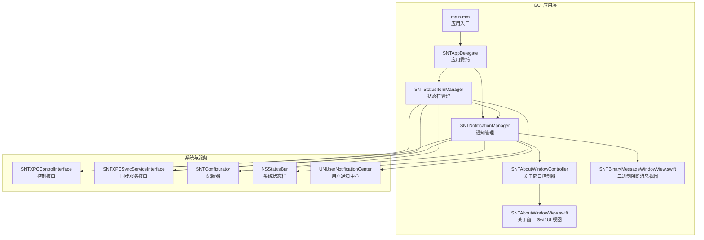
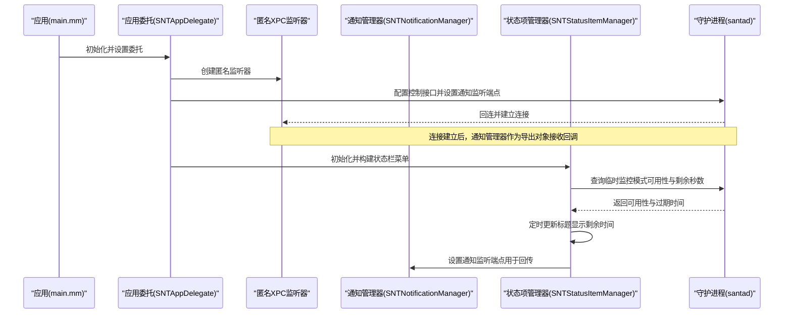
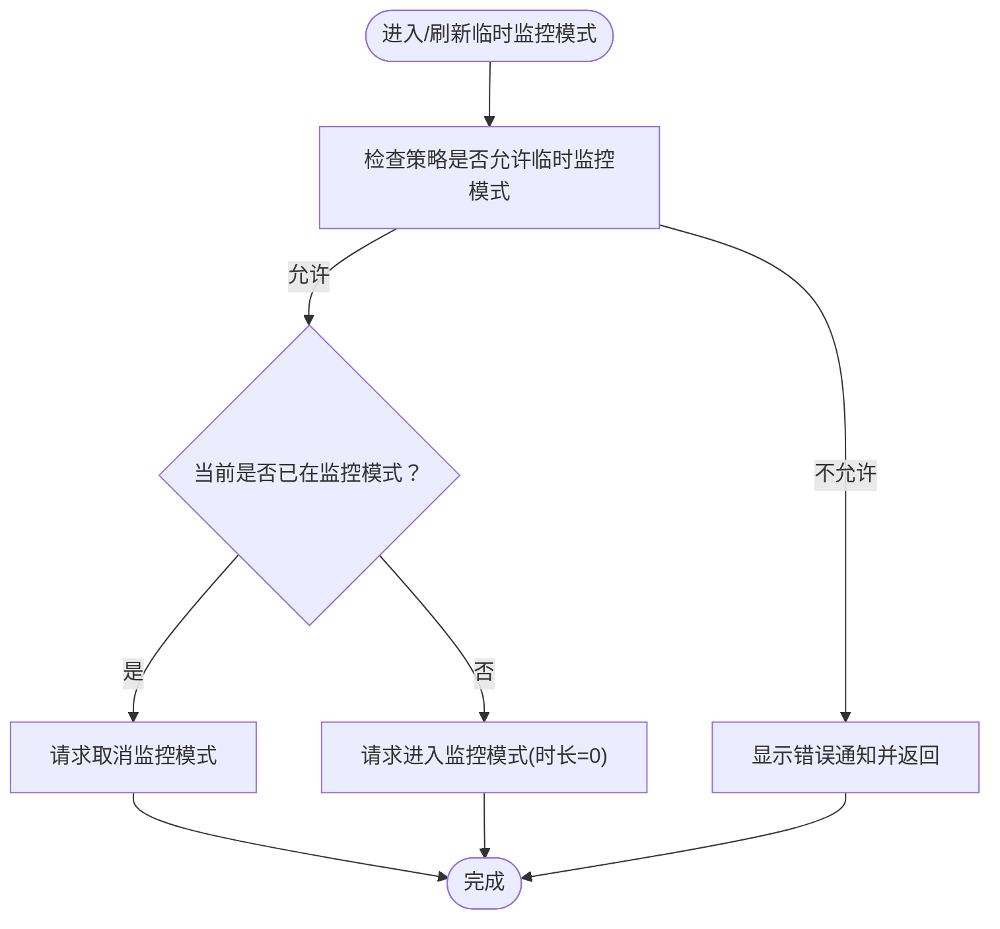
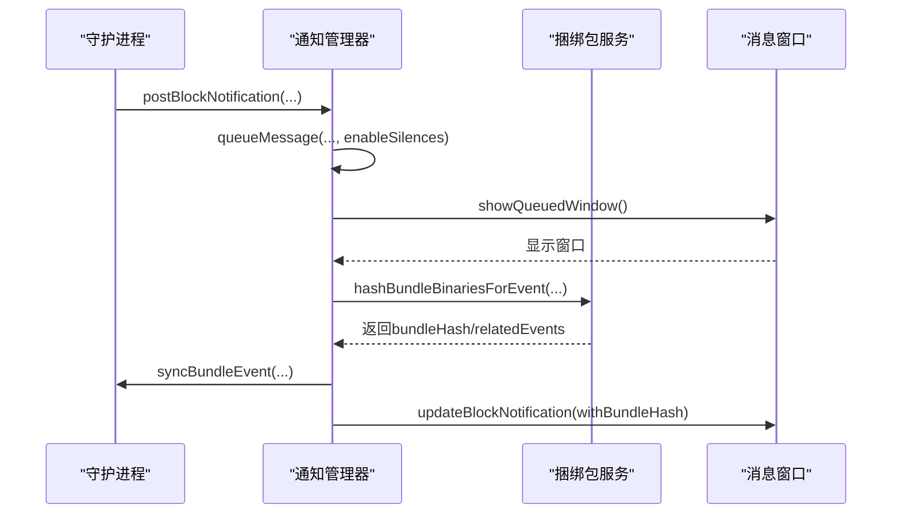
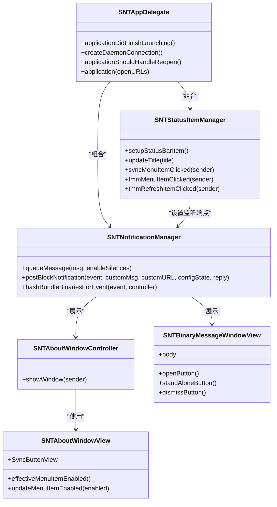

# GUI菜单栏项目管理

<cite>
**本文引用的文件**
- [SNTAppDelegate.h](file://Source/gui/SNTAppDelegate.h)
- [SNTAppDelegate.mm](file://Source/gui/SNTAppDelegate.mm)
- [SNTStatusItemManager.h](file://Source/gui/SNTStatusItemManager.h)
- [SNTStatusItemManager.mm](file://Source/gui/SNTStatusItemManager.mm)
- [SNTNotificationManager.h](file://Source/gui/SNTNotificationManager.h)
- [SNTNotificationManager.mm](file://Source/gui/SNTNotificationManager.mm)
- [SNTAboutWindowController.h](file://Source/gui/SNTAboutWindowController.h)
- [SNTAboutWindowController.mm](file://Source/gui/SNTAboutWindowController.mm)
- [SNTAboutWindowView.swift](file://Source/gui/SNTAboutWindowView.swift)
- [SNTBinaryMessageWindowView.swift](file://Source/gui/SNTBinaryMessageWindowView.swift)
- [main.mm](file://Source/gui/main.mm)
- [Info.plist](file://Source/gui/Info.plist)
- [MenuItem 图标资源](file://Source/gui/Resources/Assets.xcassets/MenuItem.imageset/Contents.json)
</cite>

## 目录
1. [简介](#简介)
2. [项目结构](#项目结构)
3. [核心组件](#核心组件)
4. [架构总览](#架构总览)
5. [详细组件分析](#详细组件分析)
6. [依赖关系分析](#依赖关系分析)
7. [性能考虑](#性能考虑)
8. [故障排查指南](#故障排查指南)
9. [结论](#结论)
10. [附录](#附录)

## 简介
本文件聚焦 Santa 项目中“GUI 菜单栏项目管理”的实现与使用，围绕菜单栏图标、状态项菜单、同步与临时监控模式入口、通知与弹窗展示、以及应用生命周期与系统扩展交互等关键能力进行系统化说明。目标读者既包括需要快速上手的使用者，也包括希望深入理解代码结构与交互流程的开发者。

## 项目结构
GUI 相关代码主要位于 Source/gui 目录，采用 Objective-C 与 Swift 混合开发：
- 应用入口与生命周期：main.mm、Info.plist
- 应用委托与连接管理：SNTAppDelegate.*
- 菜单栏状态项与菜单：SNTStatusItemManager.*
- 通知与消息窗口管理：SNTNotificationManager.*
- 关于窗口控制器与 SwiftUI 视图：SNTAboutWindowController.*、SNTAboutWindowView.swift、SNTBinaryMessageWindowView.swift
- 资源与图标：Assets.xcassets/MenuItem.imageset

图表来源
- [main.mm](file://Source/gui/main.mm#L56-L94)
- [SNTAppDelegate.mm](file://Source/gui/SNTAppDelegate.mm#L41-L127)
- [SNTStatusItemManager.mm](file://Source/gui/SNTStatusItemManager.mm#L109-L163)
- [SNTNotificationManager.mm](file://Source/gui/SNTNotificationManager.mm#L230-L252)
- [SNTAboutWindowController.mm](file://Source/gui/SNTAboutWindowController.mm#L26-L60)
- [SNTAboutWindowView.swift](file://Source/gui/SNTAboutWindowView.swift#L17-L47)
- [SNTBinaryMessageWindowView.swift](file://Source/gui/SNTBinaryMessageWindowView.swift#L238-L318)

章节来源
- [main.mm](file://Source/gui/main.mm#L56-L94)
- [Info.plist](file://Source/gui/Info.plist#L27-L33)

## 核心组件
- 应用委托（SNTAppDelegate）：负责应用启动、状态栏连接建立、会话激活/失活监听、窗口关闭后的激活策略调整、以及通过 XPC 与守护进程通信。
- 状态栏管理（SNTStatusItemManager）：创建/移除状态栏项、构建菜单、提供“同步”“进入/刷新临时监控模式”等入口，并根据配置动态显示/隐藏。
- 通知管理（SNTNotificationManager）：排队与展示阻断/USB/网络挂载/文件访问等消息窗口；支持静默配置、分布式通知广播、与捆绑包服务进度对接。
- 关于窗口（SNTAboutWindowController/View）：提供关于信息、更多链接、同步按钮、以及用户可开关的“显示菜单栏图标”设置。
- 二进制阻断消息视图（SNTBinaryMessageWindowView）：展示阻断详情、静默选项、进度指示、打开事件链接或授权执行等操作。

章节来源
- [SNTAppDelegate.mm](file://Source/gui/SNTAppDelegate.mm#L41-L127)
- [SNTStatusItemManager.h](file://Source/gui/SNTStatusItemManager.h#L18-L37)
- [SNTStatusItemManager.mm](file://Source/gui/SNTStatusItemManager.mm#L109-L163)
- [SNTNotificationManager.h](file://Source/gui/SNTNotificationManager.h#L18-L33)
- [SNTNotificationManager.mm](file://Source/gui/SNTNotificationManager.mm#L107-L151)
- [SNTAboutWindowController.h](file://Source/gui/SNTAboutWindowController.h#L15-L19)
- [SNTAboutWindowController.mm](file://Source/gui/SNTAboutWindowController.mm#L26-L60)
- [SNTAboutWindowView.swift](file://Source/gui/SNTAboutWindowView.swift#L17-L47)
- [SNTBinaryMessageWindowView.swift](file://Source/gui/SNTBinaryMessageWindowView.swift#L238-L318)

## 架构总览
GUI 通过匿名 NSXPCListener 建立回连通道，等待守护进程连接；状态栏菜单由状态项管理器动态构建，包含版本信息、关于、同步、临时监控模式入口；通知管理器负责消息队列与 UI 展示，并在需要时调用同步/控制接口。

图表来源
- [SNTAppDelegate.mm](file://Source/gui/SNTAppDelegate.mm#L131-L165)
- [SNTStatusItemManager.mm](file://Source/gui/SNTStatusItemManager.mm#L165-L181)
- [SNTNotificationManager.mm](file://Source/gui/SNTNotificationManager.mm#L327-L380)

## 详细组件分析

### 应用委托（SNTAppDelegate）
职责
- 启动阶段初始化通知管理器与状态栏管理器，设置主菜单（含编辑快捷键），监听工作区会话激活/失活以重连守护进程。
- 处理窗口关闭事件，按需恢复为附件式激活策略。
- 处理拖拽到 Dock 或关于窗口的可执行文件，打开文件信息窗口。
- 建立与守护进程的双向 XPC 连接，注册通知监听端点。

关键流程
- 连接建立：创建匿名监听器，导出通知管理器为回调对象，向守护进程发送回连端点。
- 重连机制：监听失效回调后异步重建连接。
- 菜单设置：即使用户看不到菜单，仍需保留包含“复制/全选”的菜单以启用快捷键。

章节来源
- [SNTAppDelegate.mm](file://Source/gui/SNTAppDelegate.mm#L41-L127)
- [SNTAppDelegate.mm](file://Source/gui/SNTAppDelegate.mm#L131-L165)
- [SNTAppDelegate.mm](file://Source/gui/SNTAppDelegate.mm#L167-L187)

### 状态栏管理（SNTStatusItemManager）
职责
- 动态创建/移除状态栏项，基于配置决定是否显示菜单栏图标。
- 构建菜单：版本信息、关于、同步、临时监控模式（进入/刷新）。
- 与守护进程交互：查询临时监控模式可用性与剩余秒数，进入/离开监控模式，定时更新标题。
- 同步菜单项：点击后异步触发同步服务，成功/失败分别以颜色提示与通知反馈。

实现要点
- KVO 监听配置变化，支持用户覆盖与管理员配置的优先级处理。
- 使用模板图像与着色实现“成功/失败”视觉反馈。
- 临时监控模式菜单项默认隐藏，待策略验证后再显示。

图表来源
- [SNTStatusItemManager.mm](file://Source/gui/SNTStatusItemManager.mm#L223-L292)

章节来源
- [SNTStatusItemManager.h](file://Source/gui/SNTStatusItemManager.h#L18-L37)
- [SNTStatusItemManager.mm](file://Source/gui/SNTStatusItemManager.mm#L109-L163)
- [SNTStatusItemManager.mm](file://Source/gui/SNTStatusItemManager.mm#L294-L358)
- [SNTStatusItemManager.mm](file://Source/gui/SNTStatusItemManager.mm#L360-L411)
- [SNTStatusItemManager.mm](file://Source/gui/SNTStatusItemManager.mm#L413-L417)

### 通知管理（SNTNotificationManager）
职责
- 维护消息队列，确保同一时刻仅展示一个消息窗口。
- 支持静默配置与用户静默记录，避免重复打扰。
- 分发系统范围的分布式通知，便于外部工具响应阻断事件。
- 与捆绑包服务协作，计算并回填捆绑包哈希，更新 UI 并触发同步。

实现要点
- 队列与去重：若相同哈希已存在则忽略新消息，避免重复弹窗。
- 分布式通知：对二进制阻断与文件访问阻断分别广播关键字段。
- 异步处理：在后台队列中进行哈希计算，主线程更新 UI。
- 用户静默：将静默截止时间写入用户偏好，到期自动清理。

图表来源
- [SNTNotificationManager.mm](file://Source/gui/SNTNotificationManager.mm#L107-L151)
- [SNTNotificationManager.mm](file://Source/gui/SNTNotificationManager.mm#L254-L325)
- [SNTNotificationManager.mm](file://Source/gui/SNTNotificationManager.mm#L407-L426)

章节来源
- [SNTNotificationManager.h](file://Source/gui/SNTNotificationManager.h#L18-L33)
- [SNTNotificationManager.mm](file://Source/gui/SNTNotificationManager.mm#L107-L151)
- [SNTNotificationManager.mm](file://Source/gui/SNTNotificationManager.mm#L171-L229)
- [SNTNotificationManager.mm](file://Source/gui/SNTNotificationManager.mm#L254-L325)

### 关于窗口（SNTAboutWindowController/View）
职责
- 提供关于信息、更多链接、同步按钮（支持普通/清洁同步）、以及“显示菜单栏图标”的用户开关。
- 支持拖放可执行文件到窗口，触发应用委托打开文件信息窗口。

实现要点
- SwiftUI 视图工厂：通过工厂类创建托管控制器，注入窗口引用。
- 用户偏好：读取/写入“显示菜单栏图标”的用户覆盖值。
- 同步按钮：通过 XPC 连接同步服务，失败时弹窗并支持复制日志。

章节来源
- [SNTAboutWindowController.h](file://Source/gui/SNTAboutWindowController.h#L15-L19)
- [SNTAboutWindowController.mm](file://Source/gui/SNTAboutWindowController.mm#L26-L60)
- [SNTAboutWindowView.swift](file://Source/gui/SNTAboutWindowView.swift#L17-L47)
- [SNTAboutWindowView.swift](file://Source/gui/SNTAboutWindowView.swift#L134-L146)
- [SNTAboutWindowView.swift](file://Source/gui/SNTAboutWindowView.swift#L166-L262)

### 二进制阻断消息视图（SNTBinaryMessageWindowView）
职责
- 展示阻断事件详情（应用名、发布者、用户、路径、签名信息、哈希等）。
- 提供“更多详情”“复制详情”“打开事件链接”“静默未来通知”等操作。
- 在需要时显示捆绑包哈希计算进度，并在完成后启用“打开事件”按钮。

实现要点
- 条件按钮：根据配置与状态决定显示“打开事件”或“授权执行（Touch ID）”。
- 进度与动画：使用线性进度样式与弹簧动画平滑过渡。
- 交互回调：将用户选择传递给 UI 状态回调与回复回调，随后关闭窗口。

章节来源
- [SNTBinaryMessageWindowView.swift](file://Source/gui/SNTBinaryMessageWindowView.swift#L238-L318)
- [SNTBinaryMessageWindowView.swift](file://Source/gui/SNTBinaryMessageWindowView.swift#L333-L427)

## 依赖关系分析
- 应用委托依赖状态栏管理器与通知管理器，同时通过 XPC 控制接口与同步服务接口与守护进程通信。
- 状态栏管理器依赖配置器、XPC 控制接口与同步服务接口，用于菜单项行为与状态更新。
- 通知管理器依赖配置器、XPC 控制接口与同步服务接口，以及捆绑包服务接口用于哈希计算。
- 关于窗口视图依赖配置器与同步服务接口，提供用户交互入口。
- 资源依赖：状态栏图标来自 Assets.xcassets/MenuItem.imageset。

图表来源
- [SNTAppDelegate.mm](file://Source/gui/SNTAppDelegate.mm#L41-L127)
- [SNTStatusItemManager.mm](file://Source/gui/SNTStatusItemManager.mm#L109-L163)
- [SNTNotificationManager.mm](file://Source/gui/SNTNotificationManager.mm#L107-L151)
- [SNTAboutWindowController.mm](file://Source/gui/SNTAboutWindowController.mm#L26-L60)
- [SNTAboutWindowView.swift](file://Source/gui/SNTAboutWindowView.swift#L17-L47)
- [SNTBinaryMessageWindowView.swift](file://Source/gui/SNTBinaryMessageWindowView.swift#L238-L318)

章节来源
- [SNTAppDelegate.mm](file://Source/gui/SNTAppDelegate.mm#L41-L127)
- [SNTStatusItemManager.mm](file://Source/gui/SNTStatusItemManager.mm#L109-L163)
- [SNTNotificationManager.mm](file://Source/gui/SNTNotificationManager.mm#L107-L151)
- [SNTAboutWindowController.mm](file://Source/gui/SNTAboutWindowController.mm#L26-L60)
- [SNTAboutWindowView.swift](file://Source/gui/SNTAboutWindowView.swift#L17-L47)
- [SNTBinaryMessageWindowView.swift](file://Source/gui/SNTBinaryMessageWindowView.swift#L238-L318)

## 性能考虑
- UI 更新与后台任务分离：通知管理器在后台队列进行哈希计算，主线程仅做 UI 切换，降低阻塞风险。
- 连接超时与降级：捆绑包服务连接等待超时后回退显示阻断事件，避免长时间无响应。
- 菜单项禁用与视觉反馈：同步过程中禁用菜单项并以颜色提示结果，减少无效点击。
- KVO 与用户覆盖：状态栏可见性变更通过 KVO 监听，避免频繁重建状态栏项带来的开销。

## 故障排查指南
常见问题与定位建议
- 无法连接守护进程
  - 现象：状态栏图标不亮、菜单项不可用、同步失败。
  - 排查：确认应用委托的 XPC 连接是否建立；查看连接失效回调与重连逻辑。
  - 参考
    - [SNTAppDelegate.mm](file://Source/gui/SNTAppDelegate.mm#L131-L165)
    - [SNTAppDelegate.mm](file://Source/gui/SNTAppDelegate.mm#L167-L187)
- 同步失败
  - 现象：同步菜单项变红、通知提示失败。
  - 排查：检查同步服务接口返回状态；查看日志监听端点是否有效。
  - 参考
    - [SNTStatusItemManager.mm](file://Source/gui/SNTStatusItemManager.mm#L294-L358)
- 临时监控模式不可用
  - 现象：菜单项隐藏或进入失败。
  - 排查：确认策略允许临时监控模式；检查守护进程返回的错误码并对应提示。
  - 参考
    - [SNTStatusItemManager.mm](file://Source/gui/SNTStatusItemManager.mm#L223-L292)
- 通知未弹窗
  - 现象：被静默或队列中已有相同消息。
  - 排查：检查配置器的静默开关与用户静默记录；确认消息哈希是否重复。
  - 参考
    - [SNTNotificationManager.mm](file://Source/gui/SNTNotificationManager.mm#L107-L151)
    - [SNTNotificationManager.mm](file://Source/gui/SNTNotificationManager.mm#L88-L99)

章节来源
- [SNTAppDelegate.mm](file://Source/gui/SNTAppDelegate.mm#L131-L165)
- [SNTStatusItemManager.mm](file://Source/gui/SNTStatusItemManager.mm#L294-L358)
- [SNTStatusItemManager.mm](file://Source/gui/SNTStatusItemManager.mm#L223-L292)
- [SNTNotificationManager.mm](file://Source/gui/SNTNotificationManager.mm#L107-L151)

## 结论
Santa 的 GUI 菜单栏项目管理以“状态栏项 + 菜单 + 通知管理器 + 关于窗口”为核心，结合 XPC 与守护进程实现可靠的消息与控制通道。通过配置驱动的可见性、静默机制与进度反馈，既保证了用户体验，又满足企业级管理需求。建议在部署中关注连接稳定性、同步状态反馈与临时监控模式策略的正确配置。

## 附录
- 应用入口与系统扩展交互
  - main.mm 中处理系统扩展加载/卸载请求，并设置应用委托与运行循环。
  - Info.plist 中声明 LSUIElement 使应用以菜单栏元素方式运行。
  - 参考
    - [main.mm](file://Source/gui/main.mm#L56-L94)
    - [Info.plist](file://Source/gui/Info.plist#L27-L33)
- 状态栏图标
  - 使用 Assets.xcassets/MenuItem.imageset 中的模板图标，支持着色以表示同步状态。
  - 参考
    - [MenuItem 图标资源](file://Source/gui/Resources/Assets.xcassets/MenuItem.imageset/Contents.json#L1-L22)