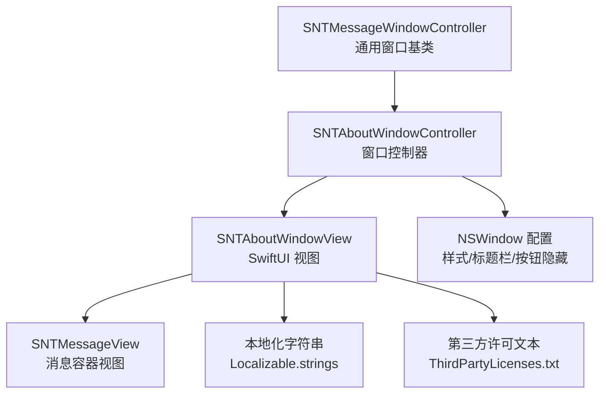
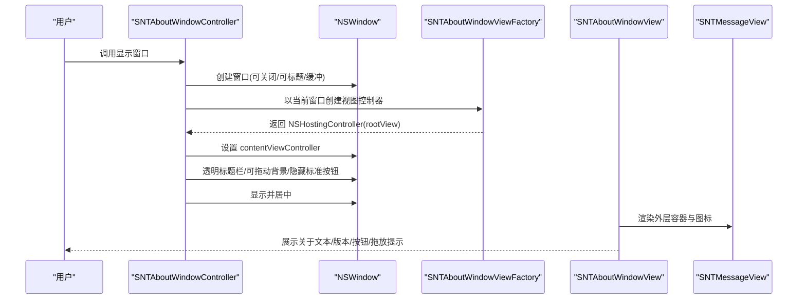
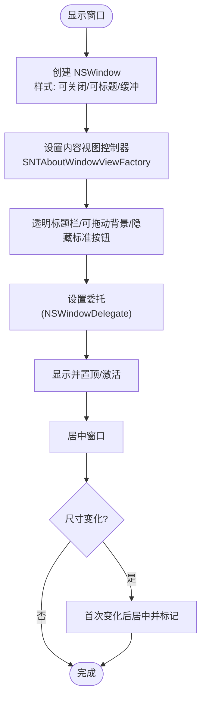
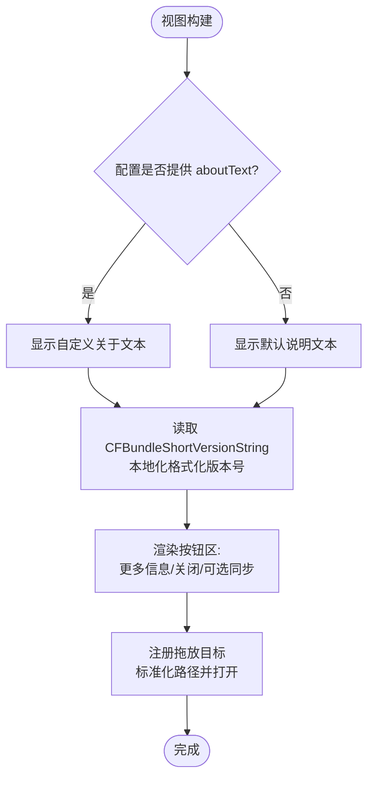
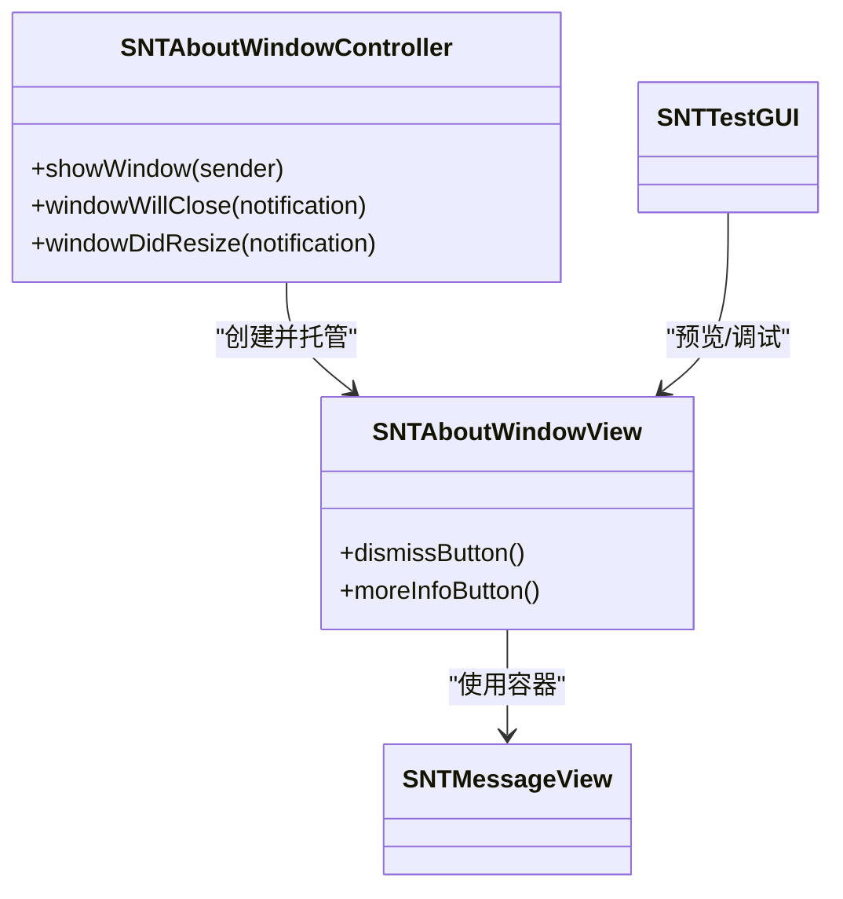

# 关于窗口

<cite>
**本文引用的文件**
- [SNTAboutWindowController.h](file://Source/gui/SNTAboutWindowController.h)
- [SNTAboutWindowController.mm](file://Source/gui/SNTAboutWindowController.mm)
- [SNTAboutWindowView.swift](file://Source/gui/SNTAboutWindowView.swift)
- [SNTMessageView.swift](file://Source/gui/SNTMessageView.swift)
- [en.lproj/Localizable.strings](file://Source/gui/Resources/en.lproj/Localizable.strings)
- [ThirdPartyLicenses.txt](file://Source/gui/Resources/ThirdPartyLicenses.txt)
- [SNTTestGUI.swift](file://Source/gui/SNTTestGUI.swift)
- [SNTMessageWindowController.mm](file://Source/gui/SNTMessageWindowController.mm)
</cite>

## 目录
1. [简介](#简介)
2. [项目结构](#项目结构)
3. [核心组件](#核心组件)
4. [架构总览](#架构总览)
5. [组件详解](#组件详解)
6. [依赖关系分析](#依赖关系分析)
7. [性能考量](#性能考量)
8. [故障排查指南](#故障排查指南)
9. [结论](#结论)
10. [附录](#附录)

## 简介
本篇文档围绕 Santa 的“关于窗口”进行系统化说明，覆盖 SNTAboutWindowController 的功能实现、窗口布局与交互逻辑；关于窗口的内容展示（含版本信息）、许可信息管理、Swift 视图组件实现细节、界面元素绑定与用户操作响应；可访问性支持、键盘导航与屏幕阅读器兼容性；定制化选项、品牌标识集成与信息更新机制；以及测试方法与维护指南。

## 项目结构
“关于窗口”由 Objective-C 控制器与 SwiftUI 视图共同构成，并通过通用消息视图容器统一风格。其关键文件如下：
- 控制器层：SNTAboutWindowController（负责窗口生命周期与布局）
- 视图层：SNTAboutWindowView（负责内容渲染、按钮交互、拖放处理）
- 共享视图：SNTMessageView（统一的外层容器与图标）
- 资源与本地化：Localizable.strings（文案与本地化）、ThirdPartyLicenses.txt（第三方许可）
- 测试辅助：SNTTestGUI.swift（用于预览与调试）

图表来源
- [SNTAboutWindowController.mm](file://Source/gui/SNTAboutWindowController.mm#L26-L60)
- [SNTAboutWindowView.swift](file://Source/gui/SNTAboutWindowView.swift#L1-L120)
- [SNTMessageView.swift](file://Source/gui/SNTMessageView.swift#L1-L40)
- [en.lproj/Localizable.strings](file://Source/gui/Resources/en.lproj/Localizable.strings#L1-L180)
- [ThirdPartyLicenses.txt](file://Source/gui/Resources/ThirdPartyLicenses.txt#L1-L320)
- [SNTMessageWindowController.mm](file://Source/gui/SNTMessageWindowController.mm#L23-L71)

章节来源
- [SNTAboutWindowController.h](file://Source/gui/SNTAboutWindowController.h#L1-L18)
- [SNTAboutWindowController.mm](file://Source/gui/SNTAboutWindowController.mm#L26-L60)
- [SNTAboutWindowView.swift](file://Source/gui/SNTAboutWindowView.swift#L1-L120)
- [SNTMessageView.swift](file://Source/gui/SNTMessageView.swift#L1-L40)
- [en.lproj/Localizable.strings](file://Source/gui/Resources/en.lproj/Localizable.strings#L1-L180)
- [ThirdPartyLicenses.txt](file://Source/gui/Resources/ThirdPartyLicenses.txt#L1-L320)
- [SNTMessageWindowController.mm](file://Source/gui/SNTMessageWindowController.mm#L23-L71)

## 核心组件
- SNTAboutWindowController：继承自 NSWindowController 并遵循 NSWindowDelegate 协议，负责创建并托管关于窗口，设置窗口外观与行为（透明标题栏、可拖动背景、隐藏标准按钮等），并在窗口关闭与尺寸变化时进行居中控制。
- SNTAboutWindowView：基于 SwiftUI 的视图，使用 SNTMessageView 作为外层容器，动态展示关于文本、版本号、更多详情按钮、关闭按钮、可选的同步按钮，以及拖放应用信息的交互。
- SNTMessageView：提供统一的外层布局、图标与可选的阻断消息内容区域，保证一致的视觉风格。
- 本地化与许可：通过 Localizable.strings 提供多语言文案，ThirdPartyLicenses.txt 提供第三方许可摘要。

章节来源
- [SNTAboutWindowController.h](file://Source/gui/SNTAboutWindowController.h#L1-L18)
- [SNTAboutWindowController.mm](file://Source/gui/SNTAboutWindowController.mm#L26-L60)
- [SNTAboutWindowView.swift](file://Source/gui/SNTAboutWindowView.swift#L1-L120)
- [SNTMessageView.swift](file://Source/gui/SNTMessageView.swift#L1-L40)
- [en.lproj/Localizable.strings](file://Source/gui/Resources/en.lproj/Localizable.strings#L1-L180)
- [ThirdPartyLicenses.txt](file://Source/gui/Resources/ThirdPartyLicenses.txt#L1-L320)

## 架构总览
下面的序列图展示了“关于窗口”的打开流程与交互链路：

图表来源
- [SNTAboutWindowController.mm](file://Source/gui/SNTAboutWindowController.mm#L26-L60)
- [SNTAboutWindowView.swift](file://Source/gui/SNTAboutWindowView.swift#L1-L120)
- [SNTMessageView.swift](file://Source/gui/SNTMessageView.swift#L1-L40)

## 组件详解

### SNTAboutWindowController：窗口生命周期与布局
- 窗口创建：在显示时创建新的 NSWindow，设置样式为可关闭且带标题栏，缓冲类型为缓冲式，禁用延迟创建。
- 内容控制器：将 SNTAboutWindowViewFactory 生成的 SwiftUI 视图包装为 NSHostingController，并设置为窗口内容控制器。
- 外观与交互：启用透明标题栏、允许通过窗口背景拖动移动、释放时关闭、隐藏缩放/关闭/最小化标准按钮。
- 委托回调：实现窗口关闭前重置居中状态；在窗口尺寸变化时仅在首次调整后进行居中，避免重复居中。

图表来源
- [SNTAboutWindowController.mm](file://Source/gui/SNTAboutWindowController.mm#L26-L60)

章节来源
- [SNTAboutWindowController.mm](file://Source/gui/SNTAboutWindowController.mm#L26-L60)

### SNTAboutWindowView：内容展示与用户交互
- 内容展示
  - 关于文本：优先读取配置中的 aboutText，否则显示默认说明文案。
  - 版本信息：从 Bundle 读取短版本号，使用本地化格式化字符串展示“Version **x.y.z**”。
  - 团队与致谢：显示作者与社区致谢文本，采用较小字号与次级颜色。
- 按钮与快捷键
  - 更多信息按钮：若配置存在 moreInfoURL，则显示按钮；点击后打开外部链接并关闭窗口。
  - 关闭按钮：默认动作快捷键绑定，点击关闭窗口。
  - 同步按钮：当配置存在 syncBaseURL 时显示，支持普通同步与按住 Option 的“清理同步”，并在完成后短暂提示成功状态。
- 拖放交互
  - 支持拖拽文件到窗口，标准化路径后通过 NSWorkspace 打开，触发应用的 openURLs 处理流程。
  - 拖拽时显示覆盖层提示，提升可感知性。

图表来源
- [SNTAboutWindowView.swift](file://Source/gui/SNTAboutWindowView.swift#L1-L120)

章节来源
- [SNTAboutWindowView.swift](file://Source/gui/SNTAboutWindowView.swift#L1-L120)

### SNTMessageView：统一容器与图标
- 作为所有消息类窗口的外层容器，提供统一的图标、内边距与布局结构，确保视觉一致性。
- 通过组合其他内容视图，实现“关于窗口”的外层框架。

章节来源
- [SNTMessageView.swift](file://Source/gui/SNTMessageView.swift#L1-L40)

### 本地化与许可信息
- 文案与本地化：通过 Localizable.strings 提供“版本”“更多信息”“关闭”“同步”等键值，支持多语言。
- 第三方许可：ThirdPartyLicenses.txt 提供第三方库的许可证摘要，便于合规与审计。

章节来源
- [en.lproj/Localizable.strings](file://Source/gui/Resources/en.lproj/Localizable.strings#L1-L180)
- [ThirdPartyLicenses.txt](file://Source/gui/Resources/ThirdPartyLicenses.txt#L1-L320)

### 可访问性、键盘导航与屏幕阅读器
- 键盘快捷键：关闭按钮绑定默认动作快捷键，便于键盘直达。
- 屏幕阅读器：视图采用标准 SwiftUI 组件与本地化文本，配合 NSWorkspace 打开链接，具备良好的可访问性基础。
- 窗口可拖动：通过窗口背景拖动提升可用性，减少鼠标操作依赖。

章节来源
- [SNTAboutWindowView.swift](file://Source/gui/SNTAboutWindowView.swift#L1-L120)
- [SNTMessageWindowController.mm](file://Source/gui/SNTMessageWindowController.mm#L23-L71)

### 定制化选项、品牌标识与信息更新
- 品牌标识：消息容器使用应用图标资源，确保品牌一致性。
- 关于文本与链接：通过配置注入 aboutText 与 moreInfoURL，实现品牌化说明与外部链接跳转。
- 版本信息：自动从 Bundle 读取短版本号，无需手动维护。
- 同步按钮：当配置提供 syncBaseURL 时启用，支持普通与清理同步，失败时弹窗并允许复制日志。

章节来源
- [SNTAboutWindowView.swift](file://Source/gui/SNTAboutWindowView.swift#L1-L120)
- [SNTMessageView.swift](file://Source/gui/SNTMessageView.swift#L1-L40)

## 依赖关系分析
- 控制器依赖
  - SNTAboutWindowController 依赖 SNTAboutWindowViewFactory 生成 SwiftUI 视图控制器，并通过 NSWindowDelegate 实现窗口行为控制。
- 视图依赖
  - SNTAboutWindowView 依赖 SNTConfigurator 获取配置（aboutText、moreInfoURL、syncBaseURL），依赖 Bundle 读取版本号，依赖 NSWorkspace 打开链接与拖放处理。
- 共享组件
  - SNTMessageView 作为通用容器，被多个消息窗口复用，降低重复代码与视觉不一致风险。
- 测试与预览
  - SNTTestGUI.swift 提供 About 视图的预览与日期覆盖能力，便于开发调试。

图表来源
- [SNTAboutWindowController.mm](file://Source/gui/SNTAboutWindowController.mm#L26-L60)
- [SNTAboutWindowView.swift](file://Source/gui/SNTAboutWindowView.swift#L1-L120)
- [SNTMessageView.swift](file://Source/gui/SNTMessageView.swift#L1-L40)
- [SNTTestGUI.swift](file://Source/gui/SNTTestGUI.swift#L240-L266)

章节来源
- [SNTAboutWindowController.mm](file://Source/gui/SNTAboutWindowController.mm#L26-L60)
- [SNTAboutWindowView.swift](file://Source/gui/SNTAboutWindowView.swift#L1-L120)
- [SNTMessageView.swift](file://Source/gui/SNTMessageView.swift#L1-L40)
- [SNTTestGUI.swift](file://Source/gui/SNTTestGUI.swift#L240-L266)

## 性能考量
- 视图渲染：SNTAboutWindowView 使用固定尺寸与轻量布局，避免复杂层级导致的重绘压力。
- 窗口创建：仅在显示时创建窗口，隐藏标准按钮与透明标题栏减少绘制开销。
- 拖放处理：标准化路径与一次性打开，避免频繁 IO 或阻塞主线程。
- 同步操作：异步调用同步服务接口，失败时弹窗提示并允许复制日志，避免阻塞 UI。

## 故障排查指南
- 窗口未居中或抖动
  - 检查窗口尺寸变化回调是否正确标记已居中，避免重复居中。
  - 参考：[SNTAboutWindowController.mm](file://Source/gui/SNTAboutWindowController.mm#L49-L60)
- 同步失败
  - 查看弹窗错误文案与日志复制功能，确认网络连接与服务端状态。
  - 参考：[SNTAboutWindowView.swift](file://Source/gui/SNTAboutWindowView.swift#L121-L235)
- 更多信息链接无法打开
  - 确认配置中的 moreInfoURL 是否有效，检查系统默认浏览器设置。
  - 参考：[SNTAboutWindowView.swift](file://Source/gui/SNTAboutWindowView.swift#L113-L118)
- 拖放无响应
  - 确认拖放目标已启用，路径标准化后是否能正确打开。
  - 参考：[SNTAboutWindowView.swift](file://Source/gui/SNTAboutWindowView.swift#L78-L96)

章节来源
- [SNTAboutWindowController.mm](file://Source/gui/SNTAboutWindowController.mm#L49-L60)
- [SNTAboutWindowView.swift](file://Source/gui/SNTAboutWindowView.swift#L121-L235)
- [SNTAboutWindowView.swift](file://Source/gui/SNTAboutWindowView.swift#L113-L118)
- [SNTAboutWindowView.swift](file://Source/gui/SNTAboutWindowView.swift#L78-L96)

## 结论
“关于窗口”通过清晰的分层设计实现了简洁而强大的功能：控制器负责窗口生命周期与外观，视图负责内容与交互，共享容器保证一致性。借助本地化与许可资源，窗口具备良好的国际化与合规性。通过键盘快捷键、可拖动窗口与屏幕阅读器友好设计，提升了可访问性与易用性。测试工具与预览视图为开发与维护提供了便利。

## 附录
- 测试方法
  - 使用 SNTTestGUI.swift 的 About 视图预览，验证不同日期下的外观与交互。
  - 参考：[SNTTestGUI.swift](file://Source/gui/SNTTestGUI.swift#L240-L266)
- 维护建议
  - 更新版本号时无需修改 UI，直接依赖 Bundle 短版本号。
  - 如需品牌化，通过配置注入 aboutText 与 moreInfoURL，保持 UI 不变。
  - 同步按钮依赖 syncBaseURL，确保配置正确以启用该功能。

章节来源
- [SNTTestGUI.swift](file://Source/gui/SNTTestGUI.swift#L240-L266)