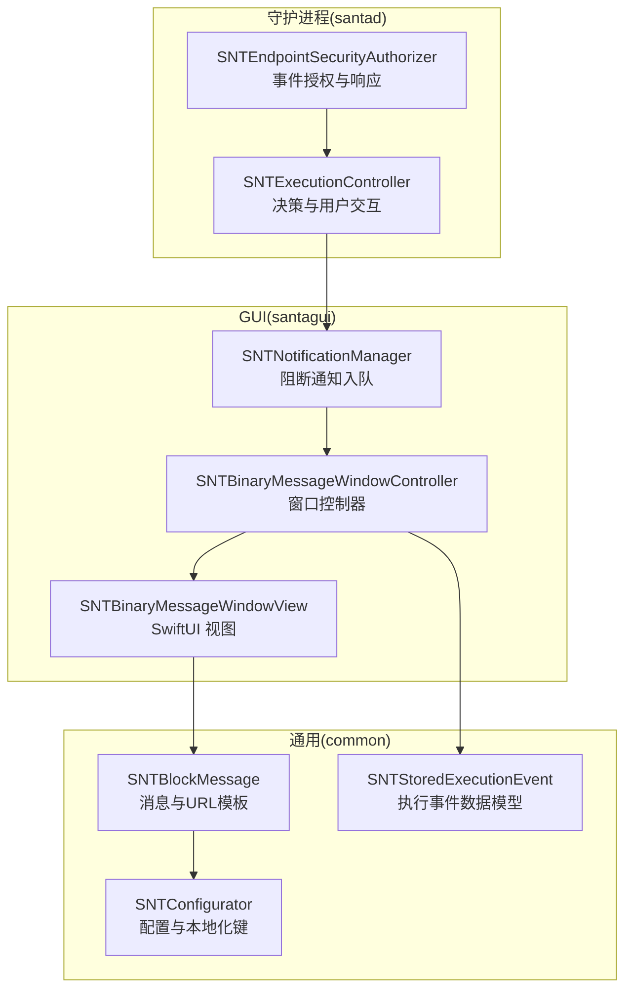
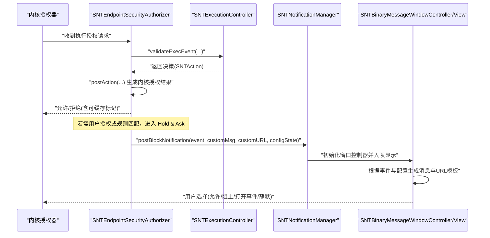
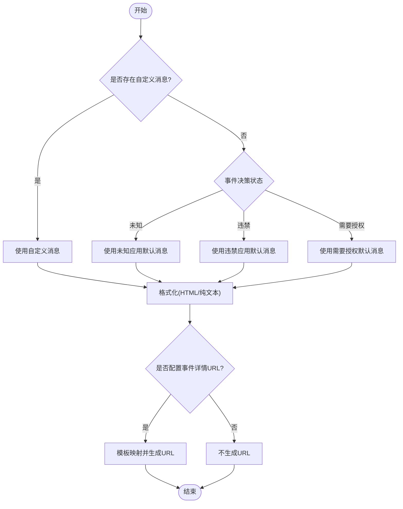
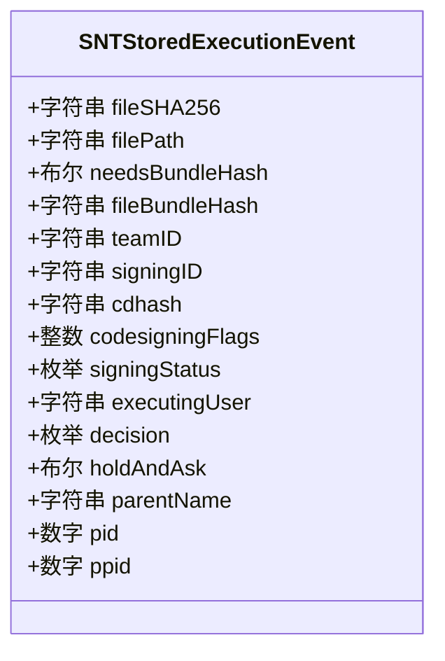
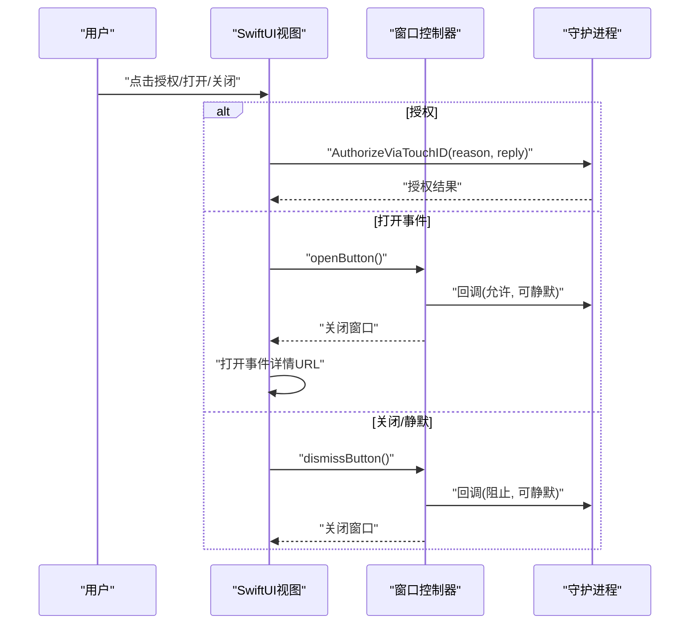
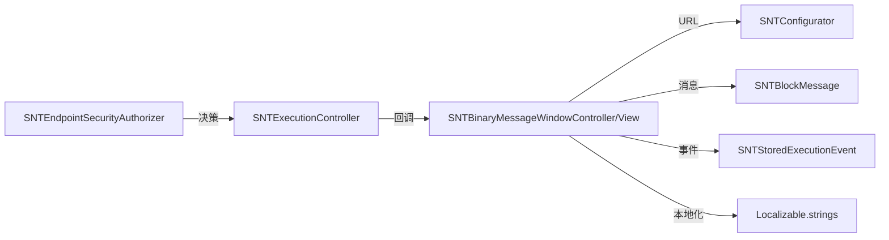

# 二进制阻止消息

<cite>
**本文引用的文件**
- [SNTBlockMessage.h](file://Source/common/SNTBlockMessage.h)
- [SNTBlockMessage.mm](file://Source/common/SNTBlockMessage.mm)
- [SNTBinaryMessageWindowController.h](file://Source/gui/SNTBinaryMessageWindowController.h)
- [SNTBinaryMessageWindowController.mm](file://Source/gui/SNTBinaryMessageWindowController.mm)
- [SNTBinaryMessageWindowView.swift](file://Source/gui/SNTBinaryMessageWindowView.swift)
- [SNTStoredExecutionEvent.h](file://Source/common/SNTStoredExecutionEvent.h)
- [SNTStoredExecutionEvent.mm](file://Source/common/SNTStoredExecutionEvent.mm)
- [SNTNotificationManager.mm](file://Source/gui/SNTNotificationManager.mm)
- [SNTExecutionController.mm](file://Source/santad/SNTExecutionController.mm)
- [SNTEndpointSecurityAuthorizer.mm](file://Source/santad/EventProviders/SNTEndpointSecurityAuthorizer.mm)
- [SNTConfigurator.h](file://Source/common/SNTConfigurator.h)
- [Localizable.strings（英语）](file://Source/gui/Resources/en.lproj/Localizable.strings)
- [Localizable.strings（德语）](file://Source/gui/Resources/de.lproj/Localizable.strings)
- [Localizable.strings（日语）](file://Source/gui/Resources/ja.lproj/Localizable.strings)
</cite>

## 目录
1. [简介](#简介)
2. [项目结构](#项目结构)
3. [核心组件](#核心组件)
4. [架构总览](#架构总览)
5. [详细组件分析](#详细组件分析)
6. [依赖关系分析](#依赖关系分析)
7. [性能考虑](#性能考虑)
8. [故障排查指南](#故障排查指南)
9. [结论](#结论)
10. [附录](#附录)

## 简介
本文件围绕“二进制阻止消息”展开，系统性说明其触发条件、生成机制、显示逻辑、阻止原因分析、用户决策流程、界面交互与反馈、配置项与自定义模板、以及多语言支持方法。目标是帮助开发者与管理员在理解 Santa 二进制执行授权与阻止流程的基础上，正确配置与扩展阻止消息体验。

## 项目结构
与二进制阻止消息直接相关的代码主要分布在以下模块：
- 通用消息与模板：SNTBlockMessage（消息格式化、URL 模板替换）
- GUI 展示层：SNTBinaryMessageWindowController（窗口控制器）、SNTBinaryMessageWindowView（SwiftUI 视图）
- 执行事件数据模型：SNTStoredExecutionEvent（事件属性、签名信息、决策状态）
- 守护进程授权链路：SNTExecutionController、SNTEndpointSecurityAuthorizer（决策与响应）
- 通知管理：SNTNotificationManager（阻断通知入队与展示）
- 配置与本地化：SNTConfigurator（消息模板、URL、按钮文案等）、Localizable.strings（多语言）

图表来源
- [SNTEndpointSecurityAuthorizer.mm](file://Source/santad/EventProviders/SNTEndpointSecurityAuthorizer.mm#L91-L220)
- [SNTExecutionController.mm](file://Source/santad/SNTExecutionController.mm#L257-L283)
- [SNTNotificationManager.mm](file://Source/gui/SNTNotificationManager.mm#L403-L421)
- [SNTBinaryMessageWindowController.mm](file://Source/gui/SNTBinaryMessageWindowController.mm#L80-L100)
- [SNTBinaryMessageWindowView.swift](file://Source/gui/SNTBinaryMessageWindowView.swift#L238-L427)
- [SNTBlockMessage.mm](file://Source/common/SNTBlockMessage.mm#L63-L126)
- [SNTStoredExecutionEvent.h](file://Source/common/SNTStoredExecutionEvent.h#L23-L142)
- [SNTConfigurator.h](file://Source/common/SNTConfigurator.h#L431-L510)

章节来源
- [SNTBlockMessage.mm](file://Source/common/SNTBlockMessage.mm#L63-L126)
- [SNTBinaryMessageWindowController.mm](file://Source/gui/SNTBinaryMessageWindowController.mm#L80-L100)
- [SNTBinaryMessageWindowView.swift](file://Source/gui/SNTBinaryMessageWindowView.swift#L238-L427)
- [SNTStoredExecutionEvent.h](file://Source/common/SNTStoredExecutionEvent.h#L23-L142)
- [SNTConfigurator.h](file://Source/common/SNTConfigurator.h#L431-L510)

## 核心组件
- SNTBlockMessage：负责根据事件类型与配置生成阻断消息文本与事件详情链接；支持 HTML 格式解析与纯文本剥离；提供 URL 模板映射与占位符替换。
- SNTBinaryMessageWindowController：承载单个阻断消息窗口，接收事件、自定义消息与 URL、配置状态，并将 UI 更新与回调传递给视图。
- SNTBinaryMessageWindowView：SwiftUI 视图，组合消息正文、事件详情、通知静默控制、进度条、按钮组（打开事件、授权、取消/关闭）等。
- SNTStoredExecutionEvent：封装被阻止二进制的文件哈希、路径、签名链、团队/签名ID、CDHash、执行用户、决策状态、是否需要打包扫描等。
- SNTExecutionController 与 SNTEndpointSecurityAuthorizer：在守护进程中完成策略评估、决策生成、与内核授权结果的桥接，必要时进入“Hold & Ask”等待用户授权。
- SNTNotificationManager：将阻断事件转换为 GUI 窗口并入队展示，支持静默期配置。
- SNTConfigurator：提供阻断消息模板键（未知/违禁）、事件详情 URL 及文案键（打开事件、关闭、静默等），并支持多语言资源。
- Localizable.strings：提供英文、德文、日文等多语言文案，覆盖按钮、提示与默认消息。

章节来源
- [SNTBlockMessage.h](file://Source/common/SNTBlockMessage.h#L26-L72)
- [SNTBlockMessage.mm](file://Source/common/SNTBlockMessage.mm#L63-L126)
- [SNTBinaryMessageWindowController.h](file://Source/gui/SNTBinaryMessageWindowController.h#L24-L36)
- [SNTBinaryMessageWindowController.mm](file://Source/gui/SNTBinaryMessageWindowController.mm#L42-L100)
- [SNTBinaryMessageWindowView.swift](file://Source/gui/SNTBinaryMessageWindowView.swift#L238-L427)
- [SNTStoredExecutionEvent.h](file://Source/common/SNTStoredExecutionEvent.h#L23-L142)
- [SNTStoredExecutionEvent.mm](file://Source/common/SNTStoredExecutionEvent.mm#L26-L48)
- [SNTExecutionController.mm](file://Source/santad/SNTExecutionController.mm#L257-L283)
- [SNTEndpointSecurityAuthorizer.mm](file://Source/santad/EventProviders/SNTEndpointSecurityAuthorizer.mm#L91-L220)
- [SNTNotificationManager.mm](file://Source/gui/SNTNotificationManager.mm#L403-L421)
- [SNTConfigurator.h](file://Source/common/SNTConfigurator.h#L431-L510)
- [Localizable.strings（英语）](file://Source/gui/Resources/en.lproj/Localizable.strings#L139-L161)
- [Localizable.strings（德语）](file://Source/gui/Resources/de.lproj/Localizable.strings#L155-L169)
- [Localizable.strings（日语）](file://Source/gui/Resources/ja.lproj/Localizable.strings#L155-L171)

## 架构总览
下图展示了从内核授权到 GUI 显示的完整链路，以及阻止消息的生成与展示：

图表来源
- [SNTEndpointSecurityAuthorizer.mm](file://Source/santad/EventProviders/SNTEndpointSecurityAuthorizer.mm#L91-L220)
- [SNTExecutionController.mm](file://Source/santad/SNTExecutionController.mm#L257-L283)
- [SNTNotificationManager.mm](file://Source/gui/SNTNotificationManager.mm#L403-L421)
- [SNTBinaryMessageWindowController.mm](file://Source/gui/SNTBinaryMessageWindowController.mm#L80-L100)
- [SNTBinaryMessageWindowView.swift](file://Source/gui/SNTBinaryMessageWindowView.swift#L238-L427)

## 详细组件分析

### 组件A：阻止消息生成与显示（SNTBlockMessage + SNTBinaryMessageWindowView）
- 消息生成策略
  - 若存在自定义消息，则优先使用；否则根据事件决策状态选择默认消息模板（未知/违禁/需要授权）。
  - 在 GUI 中，消息以富文本形式呈现；在守护端会剥离 HTML 并保留换行。
- URL 模板
  - 支持事件详情链接生成，内置占位符替换（如文件标识、签名ID、团队ID、主机信息等）。
  - 若配置为“null”，则不生成链接。
- 视图行为
  - 当事件需要打包扫描时，显示进度条与标签；完成后延迟收尾动画，避免闪烁。
  - 提供“更多详情”弹窗，复制剪贴板包含关键字段（路径、签名ID、CDHash、SHA-256、父进程等）。
  - 根据配置显示“打开事件”按钮（指向事件详情 URL）与“静默未来通知”开关。
  - 在 Standalone 模式且具备 TouchID 条件时，显示“授权执行”按钮，调用生物识别授权。

图表来源
- [SNTBlockMessage.mm](file://Source/common/SNTBlockMessage.mm#L63-L126)
- [SNTBlockMessage.mm](file://Source/common/SNTBlockMessage.mm#L252-L290)
- [SNTBinaryMessageWindowView.swift](file://Source/gui/SNTBinaryMessageWindowView.swift#L238-L427)

章节来源
- [SNTBlockMessage.mm](file://Source/common/SNTBlockMessage.mm#L63-L126)
- [SNTBlockMessage.mm](file://Source/common/SNTBlockMessage.mm#L252-L290)
- [SNTBinaryMessageWindowView.swift](file://Source/gui/SNTBinaryMessageWindowView.swift#L238-L427)

### 组件B：触发条件与阻止原因分析
- 触发条件
  - 内核授权请求到达，守护进程评估策略后决定阻止。
  - 决策来源可能包括：二进制哈希命中黑名单、团队ID/签名ID命中黑名单、证书校验失败、未知二进制在锁定模式下、或策略匹配导致的拒绝。
- 原因分析
  - 事件对象包含签名状态、团队ID、签名ID、CDHash、执行用户、父进程等，用于定位阻止原因与辅助决策。
  - 在 Standalone 模式中，若需要用户授权，将进入 Hold & Ask 流程，GUI 将显示 TouchID 授权入口。
- 决策状态枚举
  - 包括但不限于：阻断二进制、允许二进制、阻断团队ID、阻断签名ID、阻断证书、未知阻断、未知允许、编译器允许等。

图表来源
- [SNTStoredExecutionEvent.h](file://Source/common/SNTStoredExecutionEvent.h#L23-L142)
- [SNTStoredExecutionEvent.mm](file://Source/common/SNTStoredExecutionEvent.mm#L26-L48)

章节来源
- [SNTStoredExecutionEvent.h](file://Source/common/SNTStoredExecutionEvent.h#L23-L142)
- [SNTStoredExecutionEvent.mm](file://Source/common/SNTStoredExecutionEvent.mm#L26-L48)
- [SNTExecutionController.mm](file://Source/santad/SNTExecutionController.mm#L128-L150)

### 组件C：用户决策流程（允许/阻止/打开事件/静默）
- 允许
  - 用户点击“授权执行”（Standalone 模式）或“打开事件”（存在详情 URL）后，GUI 回调守护进程并关闭窗口；若存在详情 URL 则自动打开。
- 阻止
  - 用户点击“关闭/忽略”或“取消”，GUI 回调守护进程并关闭窗口；可选开启“静默未来通知”并记录静默周期。
- 添加规则
  - 通过“打开事件”跳转至事件详情页面，管理员可在服务端进行规则同步与下发（不在 GUI 中直接添加规则）。
- 交互细节
  - 当事件需要打包扫描时，“打开事件/静默”按钮处于禁用状态，直至扫描完成。
  - “更多详情”弹窗支持一键复制关键信息，便于审计与排障。

图表来源
- [SNTBinaryMessageWindowView.swift](file://Source/gui/SNTBinaryMessageWindowView.swift#L238-L427)
- [SNTBinaryMessageWindowController.mm](file://Source/gui/SNTBinaryMessageWindowController.mm#L80-L100)

章节来源
- [SNTBinaryMessageWindowView.swift](file://Source/gui/SNTBinaryMessageWindowView.swift#L238-L427)
- [SNTBinaryMessageWindowController.mm](file://Source/gui/SNTBinaryMessageWindowController.mm#L80-L100)

### 组件D：通知与展示（SNTNotificationManager + GUI）
- 通知入队
  - 守护进程将阻断事件交由通知管理器，按配置决定是否启用静默期。
- 窗口展示
  - 初始化二进制阻止消息窗口，注入事件、自定义消息/URL、配置状态与回调，随后显示。
- 进度与更新
  - 当事件需要打包扫描时，控制器观察进度并在完成后延迟收尾，避免界面闪烁。

章节来源
- [SNTNotificationManager.mm](file://Source/gui/SNTNotificationManager.mm#L403-L421)
- [SNTBinaryMessageWindowController.mm](file://Source/gui/SNTBinaryMessageWindowController.mm#L80-L100)
- [SNTBinaryMessageWindowController.mm](file://Source/gui/SNTBinaryMessageWindowController.mm#L108-L123)

## 依赖关系分析
- 决策与响应
  - 授权器根据策略评估生成 SNTAction，再转换为内核授权结果；其中“Hold & Ask”、“允许编译器”、“允许无缓存”等特殊动作影响缓存策略。
- 数据与配置
  - 事件模型提供签名与决策信息；配置键提供消息模板、事件详情 URL 与按钮文案；本地化资源提供多语言文案。
- GUI 与守护进程
  - GUI 仅负责展示与交互；最终决策与执行由守护进程完成，GUI 通过回调与 URL 打开实现闭环。

图表来源
- [SNTEndpointSecurityAuthorizer.mm](file://Source/santad/EventProviders/SNTEndpointSecurityAuthorizer.mm#L191-L220)
- [SNTExecutionController.mm](file://Source/santad/SNTExecutionController.mm#L257-L283)
- [SNTBinaryMessageWindowController.mm](file://Source/gui/SNTBinaryMessageWindowController.mm#L80-L100)
- [SNTBinaryMessageWindowView.swift](file://Source/gui/SNTBinaryMessageWindowView.swift#L238-L427)
- [SNTBlockMessage.mm](file://Source/common/SNTBlockMessage.mm#L63-L126)
- [SNTStoredExecutionEvent.h](file://Source/common/SNTStoredExecutionEvent.h#L23-L142)
- [SNTConfigurator.h](file://Source/common/SNTConfigurator.h#L431-L510)
- [Localizable.strings（英语）](file://Source/gui/Resources/en.lproj/Localizable.strings#L139-L161)

章节来源
- [SNTEndpointSecurityAuthorizer.mm](file://Source/santad/EventProviders/SNTEndpointSecurityAuthorizer.mm#L191-L220)
- [SNTExecutionController.mm](file://Source/santad/SNTExecutionController.mm#L257-L283)
- [SNTBinaryMessageWindowController.mm](file://Source/gui/SNTBinaryMessageWindowController.mm#L80-L100)
- [SNTBinaryMessageWindowView.swift](file://Source/gui/SNTBinaryMessageWindowView.swift#L238-L427)
- [SNTBlockMessage.mm](file://Source/common/SNTBlockMessage.mm#L63-L126)
- [SNTStoredExecutionEvent.h](file://Source/common/SNTStoredExecutionEvent.h#L23-L142)
- [SNTConfigurator.h](file://Source/common/SNTConfigurator.h#L431-L510)
- [Localizable.strings（英语）](file://Source/gui/Resources/en.lproj/Localizable.strings#L139-L161)

## 性能考虑
- 缓存策略
  - 内核 ES 缓存仅对特定动作可缓存；“Hold & Ask”、“允许编译器”、“允许无缓存”等均不缓存，确保策略变更后的正确性与安全性。
- 打包扫描
  - 对于需要打包扫描的事件，进度条采用确定/不确定混合样式；完成后延迟收尾，避免界面闪烁。
- 日志与上传
  - 事件决策状态在上传阶段进行标准化映射，保证远端统计与告警的一致性。

章节来源
- [SNTEndpointSecurityAuthorizer.mm](file://Source/santad/EventProviders/SNTEndpointSecurityAuthorizer.mm#L191-L220)
- [SNTBinaryMessageWindowView.swift](file://Source/gui/SNTBinaryMessageWindowView.swift#L272-L290)
- [SNTSyncEventUpload.mm](file://Source/santasyncservice/SNTSyncEventUpload.mm#L198-L214)

## 故障排查指南
- 无法生成事件详情 URL
  - 检查配置键是否为空或为“null”；确认模板占位符是否齐全；查看日志中关于 URL 生成失败的警告。
- 消息未显示或显示异常
  - 确认 GUI 是否启用通知静默；检查自定义消息是否包含非法 HTML；在守护端会剥离 HTML，GUI 侧保留富文本。
- 无法授权执行
  - Standalone 模式需 TouchID 条件满足；若不可用可启用密码回退；检查系统生物识别状态与权限。
- 事件详情按钮不可用
  - 当事件需要打包扫描且尚未完成时，按钮会被禁用；等待扫描完成后再试。

章节来源
- [SNTBlockMessage.mm](file://Source/common/SNTBlockMessage.mm#L252-L290)
- [SNTBinaryMessageWindowView.swift](file://Source/gui/SNTBinaryMessageWindowView.swift#L272-L290)
- [SNTConfigurator.h](file://Source/common/SNTConfigurator.h#L388-L418)

## 结论
二进制阻止消息在 Santa 中承担了“告知原因—引导决策—记录证据”的关键角色。通过清晰的触发条件、可定制的消息模板与 URL、直观的 GUI 交互与多语言支持，既保障了安全策略的有效执行，也提升了用户体验与可运维性。建议结合策略配置与本地化资源，持续优化阻止消息的可读性与可操作性。

## 附录

### 配置选项与自定义模板
- 消息模板键
  - 未知应用阻断消息键：unknownBlockMessage
  - 违禁应用阻断消息键：bannedBlockMessage
  - 文件访问阻断消息键：fileAccessBlockMessage
  - USB/网络挂载阻断消息键：bannedUSBBlockMessage、bannedNetworkMountBlockMessage
  - USB 强制重挂消息键：remountUSBBlockMessage
- 事件详情 URL 与文案
  - 事件详情 URL 模板键：eventDetailURL
  - 事件详情按钮文案键：eventDetailText
  - 关闭按钮文案键：dismissText
- 占位符映射（事件详情 URL）
  - 文件标识：file_sha、file_identifier、bundle_or_file_identifier
  - 应用元数据：file_bundle_id
  - 签名信息：team_id、signing_id、cdhash
  - 主机与用户：username、machine_id、hostname、uuid、serial

章节来源
- [SNTConfigurator.h](file://Source/common/SNTConfigurator.h#L431-L510)
- [SNTBlockMessage.mm](file://Source/common/SNTBlockMessage.mm#L182-L216)
- [SNTBlockMessage.mm](file://Source/common/SNTBlockMessage.mm#L235-L249)

### 多语言支持方法
- 本地化资源
  - 英文：en.lproj/Localizable.strings
  - 德文：de.lproj/Localizable.strings
  - 日文：ja.lproj/Localizable.strings
- 常用键
  - 默认阻断消息键：The following application has been blocked from executing...
  - 需要授权消息键：The following application requires authorization before it can be used
  - 打开事件按钮键：Open...
  - 关闭按钮键：Dismiss
  - 更多详情键：More Details
  - 复制详情键：Copy Details
- 使用建议
  - 在配置中提供多语言文案键值，确保不同语言环境下 UI 文案一致；避免在自定义消息中硬编码语言。

章节来源
- [Localizable.strings（英语）](file://Source/gui/Resources/en.lproj/Localizable.strings#L139-L161)
- [Localizable.strings（德语）](file://Source/gui/Resources/de.lproj/Localizable.strings#L155-L169)
- [Localizable.strings（日语）](file://Source/gui/Resources/ja.lproj/Localizable.strings#L155-L171)