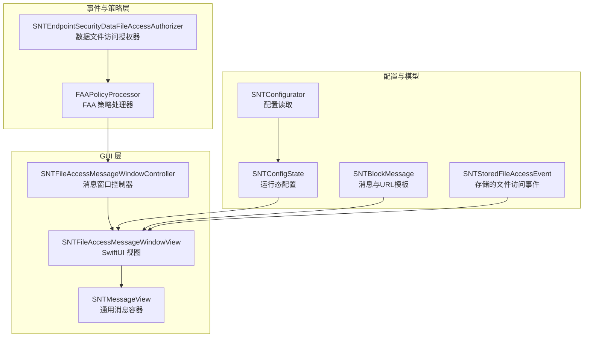
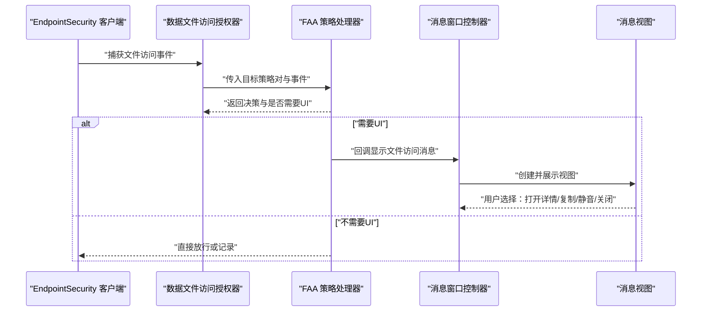
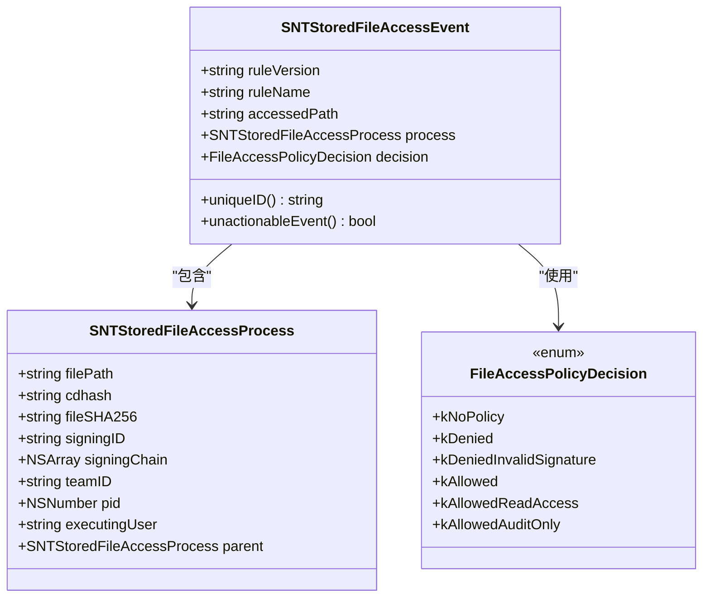
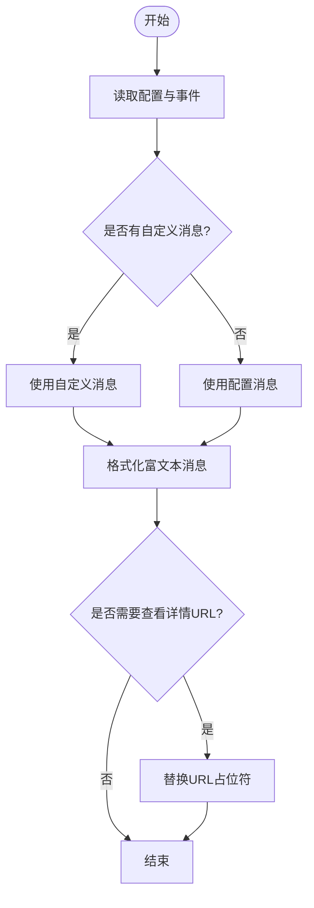
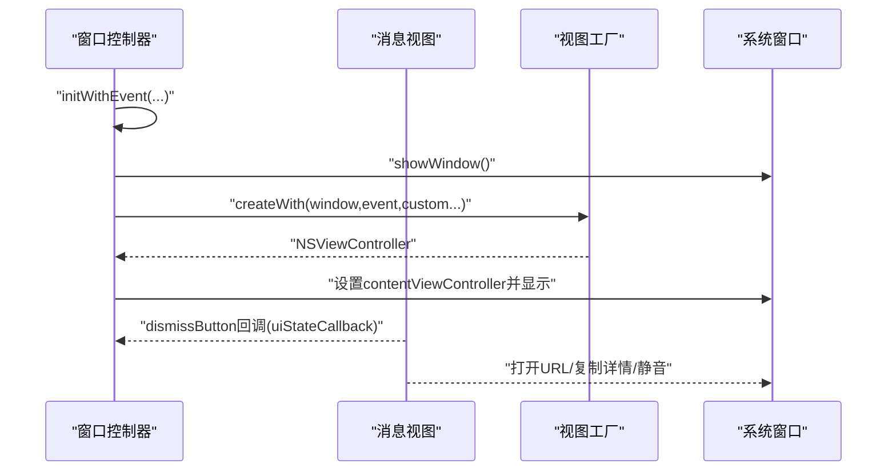
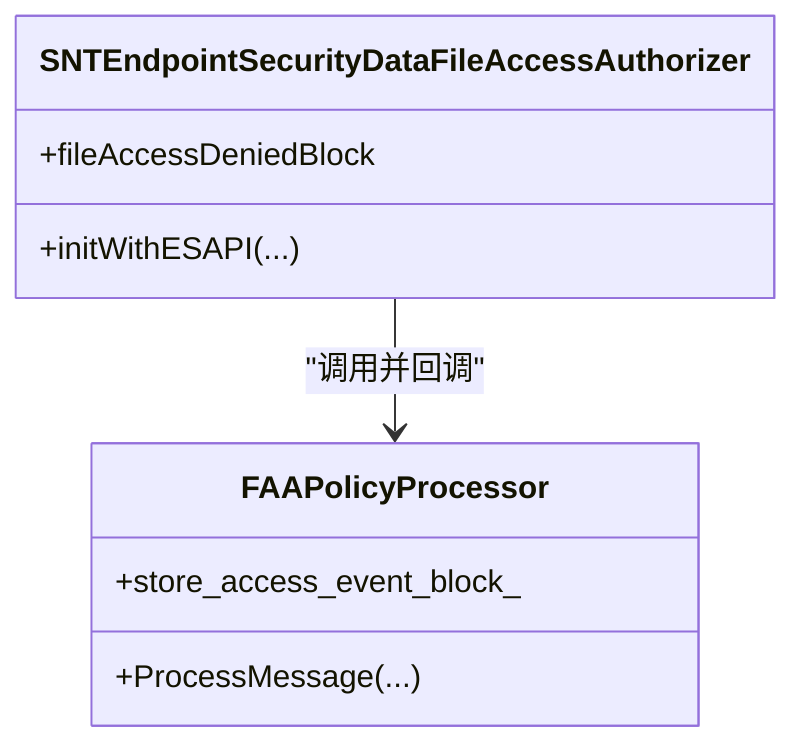
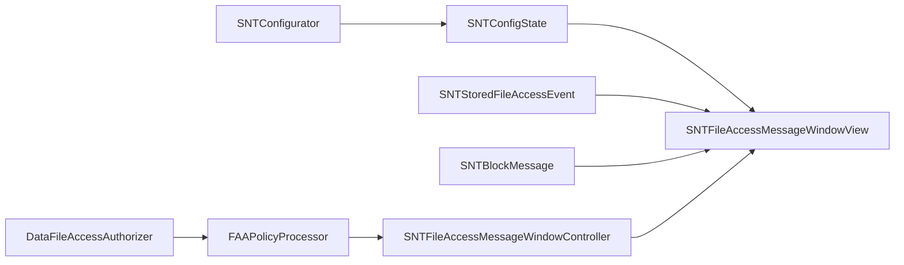

# 文件访问消息

<cite>
**本文引用的文件**
- [SNTFileAccessMessageWindowController.h](file://Source/gui/SNTFileAccessMessageWindowController.h)
- [SNTFileAccessMessageWindowController.mm](file://Source/gui/SNTFileAccessMessageWindowController.mm)
- [SNTFileAccessMessageWindowView.swift](file://Source/gui/SNTFileAccessMessageWindowView.swift)
- [SNTStoredFileAccessEvent.h](file://Source/common/SNTStoredFileAccessEvent.h)
- [SNTStoredFileAccessEvent.mm](file://Source/common/SNTStoredFileAccessEvent.mm)
- [SNTBlockMessage.h](file://Source/common/SNTBlockMessage.h)
- [SNTBlockMessage.mm](file://Source/common/SNTBlockMessage.mm)
- [SNTCommonEnums.h](file://Source/common/SNTCommonEnums.h)
- [SNTMessageView.swift](file://Source/gui/SNTMessageView.swift)
- [SNTConfigState.mm](file://Source/common/SNTConfigState.mm)
- [SNTConfigurator.h](file://Source/common/SNTConfigurator.h)
- [SNTConfigurator.mm](file://Source/common/SNTConfigurator.mm)
- [SNTEndpointSecurityDataFileAccessAuthorizer.h](file://Source/santad/EventProviders/SNTEndpointSecurityDataFileAccessAuthorizer.h)
- [SNTEndpointSecurityDataFileAccessAuthorizer.mm](file://Source/santad/EventProviders/SNTEndpointSecurityDataFileAccessAuthorizer.mm)
- [SNTEndpointSecurityProcessFileAccessAuthorizer.h](file://Source/santad/EventProviders/SNTEndpointSecurityProcessFileAccessAuthorizer.h)
- [FAAPolicyProcessor.mm](file://Source/santad/EventProviders/FAAPolicyProcessor.mm)
- [faa.md](file://docs/docs/features/faa.md)
- [faa 配置.md](file://docs/docs/configuration/faa.md)
- [Localizable.strings（英文）](file://Source/gui/Resources/en.lproj/Localizable.strings)
</cite>

## 目录
1. [简介](#简介)
2. [项目结构](#项目结构)
3. [核心组件](#核心组件)
4. [架构总览](#架构总览)
5. [详细组件分析](#详细组件分析)
6. [依赖关系分析](#依赖关系分析)
7. [性能考量](#性能考量)
8. [故障排查指南](#故障排查指南)
9. [结论](#结论)
10. [附录](#附录)

## 简介
本文件围绕 Santa 中“文件访问消息”能力进行系统化文档化，覆盖以下主题：
- 触发条件：哪些文件访问事件会触发用户消息提示
- 访问控制决策：如何基于规则与策略生成允许/拒绝/审计仅记录等决策
- 权限请求处理机制：消息展示、用户交互、静音策略与后续行为
- 数据文件访问 vs 进程文件访问：二者差异与处理流程
- 用户操作选项：临时允许、永久允许、静音等策略
- 界面设计与交互：消息文本、按钮、详情面板、复制信息
- 策略配置与消息定制：策略键、消息模板、URL 占位符、本地化
- 本地化支持：多语言文案与占位符替换

## 项目结构
文件访问消息涉及 GUI 层与内核事件处理层的协作：
- GUI 层负责消息窗口控制器与 SwiftUI 视图，展示阻断信息、打开详情链接、复制信息、静音通知等
- 事件与策略层负责从 EndpointSecurity 捕获文件访问事件，应用 FAA 策略计算决策，并在需要时回调 GUI 显示消息
- 配置层提供策略、消息模板、占位符替换、静音开关等

图表来源
- [SNTFileAccessMessageWindowController.mm](file://Source/gui/SNTFileAccessMessageWindowController.mm#L50-L71)
- [SNTFileAccessMessageWindowView.swift](file://Source/gui/SNTFileAccessMessageWindowView.swift#L23-L47)
- [SNTMessageView.swift](file://Source/gui/SNTMessageView.swift#L17-L75)
- [SNTEndpointSecurityDataFileAccessAuthorizer.h](file://Source/santad/EventProviders/SNTEndpointSecurityDataFileAccessAuthorizer.h#L31-L45)
- [FAAPolicyProcessor.mm](file://Source/santad/EventProviders/FAAPolicyProcessor.mm#L478-L495)
- [SNTConfigurator.h](file://Source/common/SNTConfigurator.h#L151-L157)
- [SNTConfigState.mm](file://Source/common/SNTConfigState.mm#L22-L30)
- [SNTBlockMessage.mm](file://Source/common/SNTBlockMessage.mm#L91-L100)
- [SNTStoredFileAccessEvent.h](file://Source/common/SNTStoredFileAccessEvent.h#L23-L41)

章节来源
- [SNTFileAccessMessageWindowController.h](file://Source/gui/SNTFileAccessMessageWindowController.h#L21-L37)
- [SNTFileAccessMessageWindowController.mm](file://Source/gui/SNTFileAccessMessageWindowController.mm#L34-L81)
- [SNTFileAccessMessageWindowView.swift](file://Source/gui/SNTFileAccessMessageWindowView.swift#L23-L47)
- [SNTMessageView.swift](file://Source/gui/SNTMessageView.swift#L17-L75)
- [SNTEndpointSecurityDataFileAccessAuthorizer.h](file://Source/santad/EventProviders/SNTEndpointSecurityDataFileAccessAuthorizer.h#L31-L45)
- [FAAPolicyProcessor.mm](file://Source/santad/EventProviders/FAAPolicyProcessor.mm#L478-L495)
- [SNTConfigurator.mm](file://Source/common/SNTConfigurator.mm#L144-L157)
- [SNTConfigState.mm](file://Source/common/SNTConfigState.mm#L22-L30)
- [SNTBlockMessage.mm](file://Source/common/SNTBlockMessage.mm#L91-L100)
- [SNTStoredFileAccessEvent.h](file://Source/common/SNTStoredFileAccessEvent.h#L23-L41)

## 核心组件
- 文件访问事件模型
  - SNTStoredFileAccessEvent：封装被阻断的文件访问事件，包含违规规则版本/名称、被访问路径、执行进程信息、决策结果等
  - SNTStoredFileAccessProcess：进程侧信息（可执行路径、签名哈希、SHA-256、团队ID、签名ID、父进程等）
- 消息与 URL 模板
  - SNTBlockMessage：根据策略与自定义消息生成富文本消息；根据配置与事件模板生成“查看详情”URL
- GUI 控制器与视图
  - SNTFileAccessMessageWindowController：初始化消息窗口、注入事件与配置、去重/静音逻辑
  - SNTFileAccessMessageWindowView：SwiftUI 视图，展示事件摘要、更多详情、复制信息、打开链接、静音开关
  - SNTMessageView：通用消息容器，承载富文本消息与底部操作区
- 策略与授权
  - SNTEndpointSecurityDataFileAccessAuthorizer：数据文件访问授权器，订阅 EndpointSecurity 事件，调用策略处理器
  - FAAPolicyProcessor：对事件进行策略匹配与决策，必要时回调 GUI 显示消息
- 配置与状态
  - SNTConfigurator：读取策略、消息模板、占位符、静音开关等配置键
  - SNTConfigState：运行态配置对象，暴露给 GUI 使用

章节来源
- [SNTStoredFileAccessEvent.h](file://Source/common/SNTStoredFileAccessEvent.h#L23-L41)
- [SNTStoredFileAccessEvent.mm](file://Source/common/SNTStoredFileAccessEvent.mm#L20-L52)
- [SNTBlockMessage.h](file://Source/common/SNTBlockMessage.h#L26-L51)
- [SNTBlockMessage.mm](file://Source/common/SNTBlockMessage.mm#L91-L100)
- [SNTFileAccessMessageWindowController.h](file://Source/gui/SNTFileAccessMessageWindowController.h#L21-L37)
- [SNTFileAccessMessageWindowController.mm](file://Source/gui/SNTFileAccessMessageWindowController.mm#L34-L81)
- [SNTFileAccessMessageWindowView.swift](file://Source/gui/SNTFileAccessMessageWindowView.swift#L23-L47)
- [SNTMessageView.swift](file://Source/gui/SNTMessageView.swift#L17-L75)
- [SNTEndpointSecurityDataFileAccessAuthorizer.h](file://Source/santad/EventProviders/SNTEndpointSecurityDataFileAccessAuthorizer.h#L31-L45)
- [FAAPolicyProcessor.mm](file://Source/santad/EventProviders/FAAPolicyProcessor.mm#L478-L495)
- [SNTConfigurator.h](file://Source/common/SNTConfigurator.h#L151-L157)
- [SNTConfigState.mm](file://Source/common/SNTConfigState.mm#L22-L30)

## 架构总览
下图展示了从 EndpointSecurity 事件到 GUI 消息呈现的端到端流程。

图表来源
- [SNTEndpointSecurityDataFileAccessAuthorizer.mm](file://Source/santad/EventProviders/SNTEndpointSecurityDataFileAccessAuthorizer.mm#L58-L73)
- [FAAPolicyProcessor.mm](file://Source/santad/EventProviders/FAAPolicyProcessor.mm#L478-L495)
- [SNTFileAccessMessageWindowController.mm](file://Source/gui/SNTFileAccessMessageWindowController.mm#L50-L71)
- [SNTFileAccessMessageWindowView.swift](file://Source/gui/SNTFileAccessMessageWindowView.swift#L23-L47)

## 详细组件分析

### 文件访问事件模型与决策枚举
- 事件模型
  - 字段：规则版本、规则名称、被访问路径、执行进程、决策结果
  - 唯一标识：用于事件聚合与上传的唯一键
  - 可处置性：某些审计仅记录决策被视为“不可处置”
- 决策枚举
  - FileAccessPolicyDecision：包含无策略、拒绝、无效签名拒绝、允许、只读允许、审计仅记录等

图表来源
- [SNTStoredFileAccessEvent.h](file://Source/common/SNTStoredFileAccessEvent.h#L23-L41)
- [SNTStoredFileAccessEvent.mm](file://Source/common/SNTStoredFileAccessEvent.mm#L20-L52)
- [SNTStoredFileAccessEvent.mm](file://Source/common/SNTStoredFileAccessEvent.mm#L59-L67)
- [SNTCommonEnums.h](file://Source/common/SNTCommonEnums.h#L220-L228)

章节来源
- [SNTStoredFileAccessEvent.h](file://Source/common/SNTStoredFileAccessEvent.h#L23-L41)
- [SNTStoredFileAccessEvent.mm](file://Source/common/SNTStoredFileAccessEvent.mm#L20-L52)
- [SNTStoredFileAccessEvent.mm](file://Source/common/SNTStoredFileAccessEvent.mm#L59-L67)
- [SNTCommonEnums.h](file://Source/common/SNTCommonEnums.h#L220-L228)

### 消息生成与 URL 模板
- 文案生成
  - 根据策略配置与事件，生成富文本消息；支持回退文案
- URL 模板
  - 支持规则版本、规则名、被访问路径、文件标识、用户名、团队ID、签名ID、CDHash、机器ID、主机名、UUID、序列号等占位符
  - 支持自定义“查看详情”URL 或禁用

图表来源
- [SNTBlockMessage.mm](file://Source/common/SNTBlockMessage.mm#L91-L100)
- [SNTBlockMessage.mm](file://Source/common/SNTBlockMessage.mm#L235-L249)
- [SNTBlockMessage.mm](file://Source/common/SNTBlockMessage.mm#L283-L289)

章节来源
- [SNTBlockMessage.h](file://Source/common/SNTBlockMessage.h#L26-L51)
- [SNTBlockMessage.mm](file://Source/common/SNTBlockMessage.mm#L91-L100)
- [SNTBlockMessage.mm](file://Source/common/SNTBlockMessage.mm#L235-L249)
- [SNTBlockMessage.mm](file://Source/common/SNTBlockMessage.mm#L283-L289)

### GUI 消息窗口与交互
- 窗口控制器
  - 初始化事件、自定义消息、自定义URL、自定义文本、配置状态
  - showWindow：创建默认窗口、注入视图工厂、设置委托、显示
  - messageHash：用于去重/静音的哈希组合
- 视图
  - 展示“已访问路径”“应用”“用户”“规则名”“规则版本”
  - 更多详情面板：显示二进制路径、签名ID、CDHash、SHA-256、父进程等
  - 复制详情到剪贴板
  - 打开“查看详情”链接
  - 静音通知：可选时间段（天/周/月）

图表来源
- [SNTFileAccessMessageWindowController.mm](file://Source/gui/SNTFileAccessMessageWindowController.mm#L34-L81)
- [SNTFileAccessMessageWindowView.swift](file://Source/gui/SNTFileAccessMessageWindowView.swift#L23-L47)
- [SNTMessageView.swift](file://Source/gui/SNTMessageView.swift#L79-L122)

章节来源
- [SNTFileAccessMessageWindowController.h](file://Source/gui/SNTFileAccessMessageWindowController.h#L21-L37)
- [SNTFileAccessMessageWindowController.mm](file://Source/gui/SNTFileAccessMessageWindowController.mm#L34-L81)
- [SNTFileAccessMessageWindowView.swift](file://Source/gui/SNTFileAccessMessageWindowView.swift#L174-L277)
- [SNTMessageView.swift](file://Source/gui/SNTMessageView.swift#L79-L122)

### 数据文件访问授权器与策略处理器
- 数据文件访问授权器
  - 订阅 EndpointSecurity 事件，调用策略处理器
  - 提供 fileAccessDeniedBlock 回调，用于触发 GUI 显示消息
- 策略处理器
  - 对事件进行策略匹配与决策
  - 若为阻断且需要 UI，则回调 GUI 显示消息；同时可记录日志

图表来源
- [SNTEndpointSecurityDataFileAccessAuthorizer.h](file://Source/santad/EventProviders/SNTEndpointSecurityDataFileAccessAuthorizer.h#L31-L45)
- [SNTEndpointSecurityDataFileAccessAuthorizer.mm](file://Source/santad/EventProviders/SNTEndpointSecurityDataFileAccessAuthorizer.mm#L58-L73)
- [FAAPolicyProcessor.mm](file://Source/santad/EventProviders/FAAPolicyProcessor.mm#L478-L495)

章节来源
- [SNTEndpointSecurityDataFileAccessAuthorizer.h](file://Source/santad/EventProviders/SNTEndpointSecurityDataFileAccessAuthorizer.h#L31-L45)
- [SNTEndpointSecurityDataFileAccessAuthorizer.mm](file://Source/santad/EventProviders/SNTEndpointSecurityDataFileAccessAuthorizer.mm#L58-L73)
- [FAAPolicyProcessor.mm](file://Source/santad/EventProviders/FAAPolicyProcessor.mm#L478-L495)

### 进程文件访问授权器（概念说明）
- 进程文件访问授权器负责对“进程访问文件”的场景进行策略评估与决策
- 与数据文件访问授权器共同构成完整的文件访问授权体系
- 具体实现细节以头文件接口为准

章节来源
- [SNTEndpointSecurityProcessFileAccessAuthorizer.h](file://Source/santad/EventProviders/SNTEndpointSecurityProcessFileAccessAuthorizer.h#L1-L39)

### 触发条件与访问控制决策
- 触发条件
  - EndpointSecurity 捕获到文件访问事件
  - 策略处理器匹配到对应 WatchItem 并产生阻断决策
- 决策类型
  - 允许、只读允许、审计仅记录、拒绝、无效签名拒绝
- 决策影响
  - 审计仅记录：事件被视为不可处置，不弹窗阻断
  - 阻断：若策略要求 UI，则触发消息展示

章节来源
- [SNTCommonEnums.h](file://Source/common/SNTCommonEnums.h#L220-L228)
- [SNTStoredFileAccessEvent.mm](file://Source/common/SNTStoredFileAccessEvent.mm#L65-L67)
- [FAAPolicyProcessor.mm](file://Source/santad/EventProviders/FAAPolicyProcessor.mm#L478-L495)

### 数据文件访问 vs 进程文件访问
- 数据文件访问
  - 关注“数据文件”被哪些进程访问，强调“数据为中心”的策略
  - 授权器：SNTEndpointSecurityDataFileAccessAuthorizer
- 进程文件访问
  - 关注“进程”对哪些文件进行访问，强调“进程为中心”的策略
  - 授权器：SNTEndpointSecurityProcessFileAccessAuthorizer
- 二者协同工作，分别处理不同维度的访问控制需求

章节来源
- [SNTEndpointSecurityDataFileAccessAuthorizer.h](file://Source/santad/EventProviders/SNTEndpointSecurityDataFileAccessAuthorizer.h#L31-L45)
- [SNTEndpointSecurityProcessFileAccessAuthorizer.h](file://Source/santad/EventProviders/SNTEndpointSecurityProcessFileAccessAuthorizer.h#L1-L39)

### 用户权限授予与拒绝操作
- 操作选项
  - 打开“查看详情”链接：查看规则详情或工单
  - 复制详情：一键复制事件关键信息到剪贴板
  - 静音未来通知：可选择时间段（天/周/月），避免重复打扰
  - 关闭：关闭消息窗口
- 策略与配置
  - 是否启用静音由配置决定
  - “查看详情”按钮文案与 URL 可通过配置定制

章节来源
- [SNTFileAccessMessageWindowView.swift](file://Source/gui/SNTFileAccessMessageWindowView.swift#L221-L277)
- [SNTMessageView.swift](file://Source/gui/SNTMessageView.swift#L79-L122)
- [SNTConfigState.mm](file://Source/common/SNTConfigState.mm#L22-L30)

### 界面设计与本地化
- 文案与按钮
  - 默认“访问被拒绝”消息
  - “更多详情”“复制详情”“打开”“关闭”等本地化字符串
- 本地化支持
  - 英文 Localizable.strings 提供键值映射
  - SwiftUI 与 Cocoa 组件均使用本地化键

章节来源
- [Localizable.strings（英文）](file://Source/gui/Resources/en.lproj/Localizable.strings#L1-L180)
- [SNTMessageView.swift](file://Source/gui/SNTMessageView.swift#L17-L75)

### 文件访问策略配置与消息定制
- 策略来源
  - 支持内联策略或独立 plist 文件，定期重载
- 根级键
  - Version、EventDetailURL、EventDetailText、WatchItems
- WatchItem 结构
  - Paths、Processes、Options（如 AllowReadAccess、AuditOnly、RuleType 等）
- 消息定制
  - FileAccessBlockMessage：文件访问阻断消息模板
  - EventDetailURL：支持变量替换（%rule_version%、%rule_name%、%accessed_path%、%file_identifier%、%username%、%team_id%、%signing_id%、%cdhash%、%machine_id%、%hostname%、%uuid%、%serial%）
  - EventDetailText：按钮文案
- 全局覆盖
  - OverrideFileAccessAction：全局覆盖策略（none、audit_only、disable）

章节来源
- [faa.md](file://docs/docs/features/faa.md#L1-L120)
- [faa 配置.md](file://docs/docs/configuration/faa.md#L1-L60)
- [SNTConfigurator.mm](file://Source/common/SNTConfigurator.mm#L144-L157)
- [SNTBlockMessage.mm](file://Source/common/SNTBlockMessage.mm#L235-L249)
- [SNTBlockMessage.mm](file://Source/common/SNTBlockMessage.mm#L283-L289)
- [santaconfig.ts](file://docs/src/lib/santaconfig.ts#L606-L635)

## 依赖关系分析
- 组件耦合
  - GUI 控制器依赖事件模型与配置状态
  - 视图依赖消息容器与配置状态
  - 授权器依赖策略处理器与配置
  - 策略处理器依赖配置与事件模型
- 外部依赖
  - EndpointSecurity API、系统窗口框架、本地化资源
- 潜在循环依赖
  - 未见直接循环；各模块职责清晰，通过回调与协议解耦

图表来源
- [SNTConfigurator.h](file://Source/common/SNTConfigurator.h#L151-L157)
- [SNTConfigState.mm](file://Source/common/SNTConfigState.mm#L22-L30)
- [SNTStoredFileAccessEvent.h](file://Source/common/SNTStoredFileAccessEvent.h#L23-L41)
- [SNTBlockMessage.mm](file://Source/common/SNTBlockMessage.mm#L91-L100)
- [SNTEndpointSecurityDataFileAccessAuthorizer.h](file://Source/santad/EventProviders/SNTEndpointSecurityDataFileAccessAuthorizer.h#L31-L45)
- [FAAPolicyProcessor.mm](file://Source/santad/EventProviders/FAAPolicyProcessor.mm#L478-L495)
- [SNTFileAccessMessageWindowController.mm](file://Source/gui/SNTFileAccessMessageWindowController.mm#L50-L71)

章节来源
- [SNTConfigurator.mm](file://Source/common/SNTConfigurator.mm#L144-L157)
- [SNTConfigState.mm](file://Source/common/SNTConfigState.mm#L22-L30)
- [SNTStoredFileAccessEvent.h](file://Source/common/SNTStoredFileAccessEvent.h#L23-L41)
- [SNTBlockMessage.mm](file://Source/common/SNTBlockMessage.mm#L91-L100)
- [SNTEndpointSecurityDataFileAccessAuthorizer.h](file://Source/santad/EventProviders/SNTEndpointSecurityDataFileAccessAuthorizer.h#L31-L45)
- [FAAPolicyProcessor.mm](file://Source/santad/EventProviders/FAAPolicyProcessor.mm#L478-L495)
- [SNTFileAccessMessageWindowController.mm](file://Source/gui/SNTFileAccessMessageWindowController.mm#L50-L71)

## 性能考量
- 策略更新频率
  - FileAccessPolicyUpdateIntervalSec：默认 600 秒，最小 15 秒
- 全局限制
  - FileAccessGlobalLogsPerSec：限制每秒日志量
  - FileAccessGlobalWindowSizeSec：统计窗口大小
- 建议
  - 合理设置更新间隔，避免频繁重载策略造成开销
  - 在大规模通配符策略场景中，关注日志量与性能影响

章节来源
- [santaconfig.ts](file://docs/src/lib/santaconfig.ts#L606-L635)
- [SNTConfigurator.mm](file://Source/common/SNTConfigurator.mm#L629-L683)

## 故障排查指南
- 无法看到文件访问消息
  - 检查策略是否启用 UI（审计仅记录不会弹窗）
  - 检查 OverrideFileAccessAction 是否被设为 disable
  - 检查 EnableNotificationSilences 与静音时间段
- 详情链接无法打开
  - 检查 EventDetailURL 是否正确配置，占位符是否可替换
  - 检查自定义 URL 是否为 null 或非法
- 事件未记录或日志过多
  - 调整 FileAccessGlobalLogsPerSec 与窗口大小
  - 检查策略是否过于宽泛导致噪声

章节来源
- [FAAPolicyProcessor.mm](file://Source/santad/EventProviders/FAAPolicyProcessor.mm#L478-L495)
- [SNTBlockMessage.mm](file://Source/common/SNTBlockMessage.mm#L283-L289)
- [santaconfig.ts](file://docs/src/lib/santaconfig.ts#L606-L635)

## 结论
文件访问消息在 Santa 中承担了“策略与用户沟通”的桥梁作用。通过 EndpointSecurity 的事件捕获、FAA 策略处理器的决策与 GUI 的消息呈现，实现了对数据文件访问与进程文件访问的精细化控制。配合灵活的策略配置、消息模板与本地化支持，既能满足安全管控需求，也能提升用户体验与可运维性。

## 附录
- 相关文档
  - 文件访问授权特性文档
  - 文件访问授权配置文档
- 关键配置键
  - FileAccessPolicy、FileAccessPolicyPlist、FileAccessBlockMessage、FileAccessPolicyUpdateIntervalSec、FileAccessGlobalLogsPerSec、FileAccessGlobalWindowSizeSec、OverrideFileAccessAction、EventDetailURL、EventDetailText

章节来源
- [faa.md](file://docs/docs/features/faa.md#L1-L120)
- [faa 配置.md](file://docs/docs/configuration/faa.md#L1-L60)
- [SNTConfigurator.mm](file://Source/common/SNTConfigurator.mm#L144-L157)