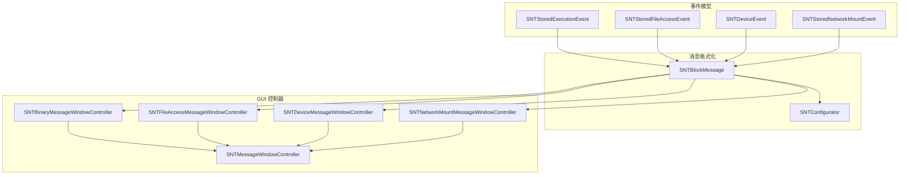
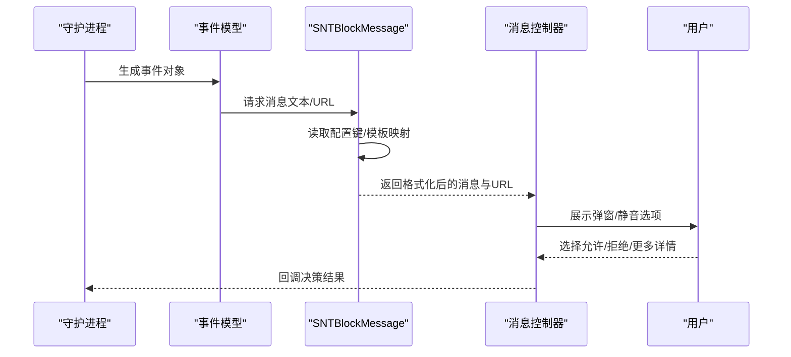
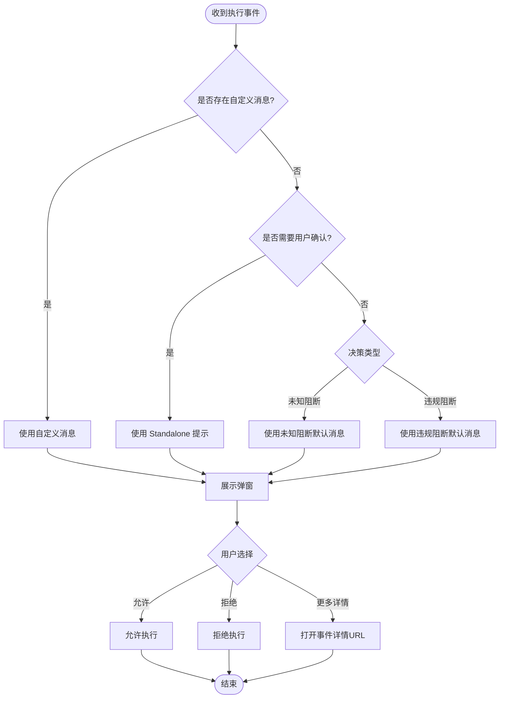
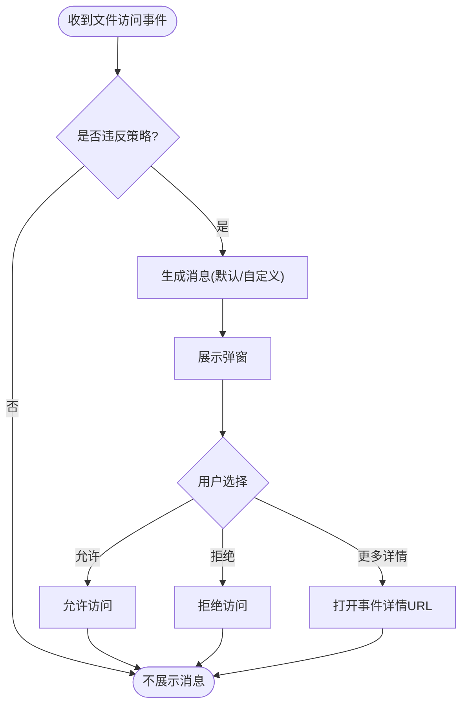
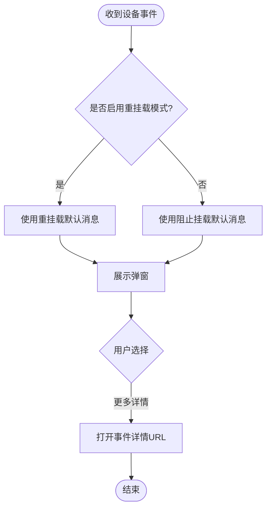
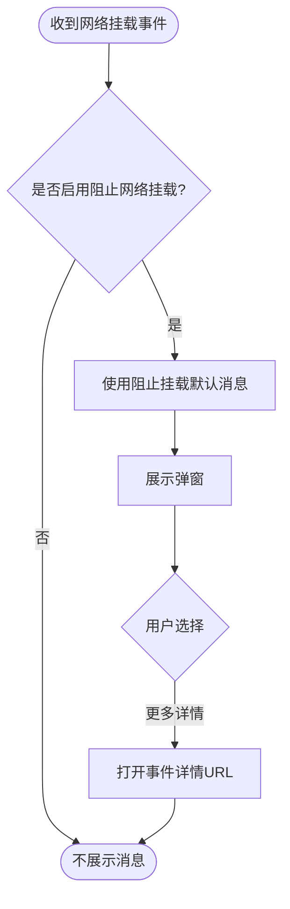
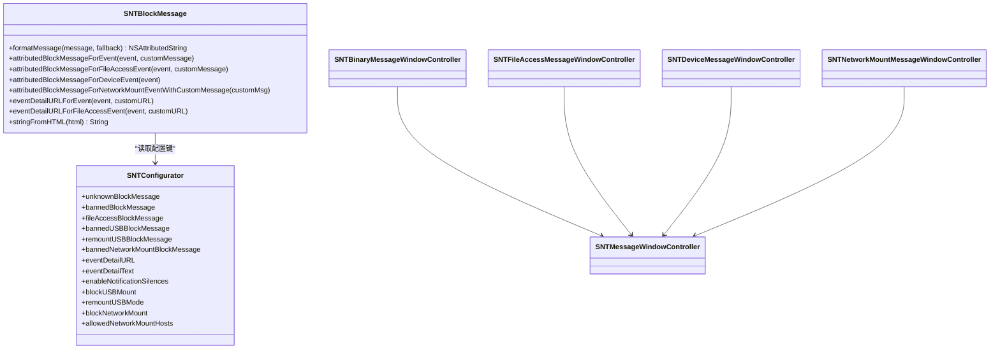

# 消息类型

<cite>
**本文引用的文件**
- [SNTBlockMessage.h](file://Source/common/SNTBlockMessage.h)
- [SNTBlockMessage.mm](file://Source/common/SNTBlockMessage.mm)
- [SNTBinaryMessageWindowController.h](file://Source/gui/SNTBinaryMessageWindowController.h)
- [SNTBinaryMessageWindowController.mm](file://Source/gui/SNTBinaryMessageWindowController.mm)
- [SNTFileAccessMessageWindowController.h](file://Source/gui/SNTFileAccessMessageWindowController.h)
- [SNTFileAccessMessageWindowController.mm](file://Source/gui/SNTFileAccessMessageWindowController.mm)
- [SNTDeviceMessageWindowController.h](file://Source/gui/SNTDeviceMessageWindowController.h)
- [SNTDeviceMessageWindowController.mm](file://Source/gui/SNTDeviceMessageWindowController.mm)
- [SNTNetworkMountMessageWindowController.h](file://Source/gui/SNTNetworkMountMessageWindowController.h)
- [SNTNetworkMountMessageWindowController.mm](file://Source/gui/SNTNetworkMountMessageWindowController.mm)
- [SNTMessageWindowController.h](file://Source/gui/SNTMessageWindowController.h)
- [SNTStoredExecutionEvent.h](file://Source/common/SNTStoredExecutionEvent.h)
- [SNTStoredFileAccessEvent.h](file://Source/common/SNTStoredFileAccessEvent.h)
- [SNTStoredNetworkMountEvent.h](file://Source/common/SNTStoredNetworkMountEvent.h)
- [SNTDeviceEvent.h](file://Source/common/SNTDeviceEvent.h)
- [SNTConfigurator.h](file://Source/common/SNTConfigurator.h)
- [SNTConfigurator.mm](file://Source/common/SNTConfigurator.mm)
- [Localizable.strings（英文）](file://Source/gui/Resources/en.lproj/Localizable.strings)
- [Localizable.strings（日文）](file://Source/gui/Resources/ja.lproj/Localizable.strings)
- [Localizable.strings（德文）](file://Source/gui/Resources/de.lproj/Localizable.strings)
- [Localizable.strings（俄文）](file://Source/gui/Resources/ru.lproj/Localizable.strings)
- [Localizable.strings（乌克兰语）](file://Source/gui/Resources/uk.lproj/Localizable.strings)
</cite>

## 目录
1. [简介](#简介)
2. [项目结构](#项目结构)
3. [核心组件](#核心组件)
4. [架构总览](#架构总览)
5. [详细组件分析](#详细组件分析)
6. [依赖关系分析](#依赖关系分析)
7. [性能考量](#性能考量)
8. [故障排查指南](#故障排查指南)
9. [结论](#结论)
10. [附录：消息模板与多语言配置](#附录消息模板与多语言配置)

## 简介
本文件系统性梳理 Santa 的“消息类型”体系，覆盖以下四类消息：
- 二进制阻止消息：用于阻止未知或违规二进制执行时的用户提示与交互。
- 文件访问消息：用于阻止或审计文件访问时的权限请求与反馈。
- 设备消息：用于 USB 设备挂载/重挂载的阻止与用户确认。
- 网络挂载消息：用于网络资源挂载的访问控制与授权决策。

文档重点说明每类消息的触发条件、显示逻辑、用户操作选项、消息模板与本地化配置，并给出关键流程图与时序图以便快速理解。

## 项目结构
消息系统由“事件模型 + 消息格式化 + GUI 控制器 + 配置驱动”的分层组成：
- 事件模型：承载具体事件上下文（执行、文件访问、设备、网络挂载）。
- 消息格式化：根据配置与事件动态生成可呈现的消息文本与链接。
- GUI 控制器：负责弹窗展示、用户交互、静音设置与回调。
- 配置驱动：通过配置键决定默认消息、URL 模板、USB/网络挂载策略等。

图表来源
- [SNTStoredExecutionEvent.h](file://Source/common/SNTStoredExecutionEvent.h#L1-L142)
- [SNTStoredFileAccessEvent.h](file://Source/common/SNTStoredFileAccessEvent.h#L1-L74)
- [SNTStoredNetworkMountEvent.h](file://Source/common/SNTStoredNetworkMountEvent.h#L1-L42)
- [SNTDeviceEvent.h](file://Source/common/SNTDeviceEvent.h#L1-L28)
- [SNTBlockMessage.h](file://Source/common/SNTBlockMessage.h#L1-L72)
- [SNTBlockMessage.mm](file://Source/common/SNTBlockMessage.mm#L63-L126)
- [SNTConfigurator.h](file://Source/common/SNTConfigurator.h#L430-L520)
- [SNTBinaryMessageWindowController.h](file://Source/gui/SNTBinaryMessageWindowController.h#L1-L72)
- [SNTFileAccessMessageWindowController.h](file://Source/gui/SNTFileAccessMessageWindowController.h#L1-L40)
- [SNTDeviceMessageWindowController.h](file://Source/gui/SNTDeviceMessageWindowController.h#L1-L34)
- [SNTNetworkMountMessageWindowController.h](file://Source/gui/SNTNetworkMountMessageWindowController.h#L1-L30)
- [SNTMessageWindowController.h](file://Source/gui/SNTMessageWindowController.h#L1-L43)

章节来源
- [SNTBlockMessage.h](file://Source/common/SNTBlockMessage.h#L1-L72)
- [SNTBlockMessage.mm](file://Source/common/SNTBlockMessage.mm#L63-L126)
- [SNTBinaryMessageWindowController.h](file://Source/gui/SNTBinaryMessageWindowController.h#L1-L72)
- [SNTFileAccessMessageWindowController.h](file://Source/gui/SNTFileAccessMessageWindowController.h#L1-L40)
- [SNTDeviceMessageWindowController.h](file://Source/gui/SNTDeviceMessageWindowController.h#L1-L34)
- [SNTNetworkMountMessageWindowController.h](file://Source/gui/SNTNetworkMountMessageWindowController.h#L1-L30)
- [SNTMessageWindowController.h](file://Source/gui/SNTMessageWindowController.h#L1-L43)
- [SNTStoredExecutionEvent.h](file://Source/common/SNTStoredExecutionEvent.h#L1-L142)
- [SNTStoredFileAccessEvent.h](file://Source/common/SNTStoredFileAccessEvent.h#L1-L74)
- [SNTStoredNetworkMountEvent.h](file://Source/common/SNTStoredNetworkMountEvent.h#L1-L42)
- [SNTDeviceEvent.h](file://Source/common/SNTDeviceEvent.h#L1-L28)
- [SNTConfigurator.h](file://Source/common/SNTConfigurator.h#L430-L520)

## 核心组件
- SNTBlockMessage：统一的消息格式化入口，依据事件类型与配置生成带样式的文本与链接；并提供事件详情 URL 的模板替换与生成。
- 各类消息控制器：分别封装二进制、文件访问、设备、网络挂载的弹窗展示、用户交互与静音控制。
- 事件模型：承载触发消息所需的上下文信息（如签名链、路径、进程信息、挂载参数等）。
- SNTConfigurator：集中管理消息模板、URL 模板、USB/网络挂载策略、静音开关等配置项。

章节来源
- [SNTBlockMessage.h](file://Source/common/SNTBlockMessage.h#L30-L70)
- [SNTBlockMessage.mm](file://Source/common/SNTBlockMessage.mm#L63-L126)
- [SNTBinaryMessageWindowController.h](file://Source/gui/SNTBinaryMessageWindowController.h#L24-L72)
- [SNTFileAccessMessageWindowController.h](file://Source/gui/SNTFileAccessMessageWindowController.h#L24-L40)
- [SNTDeviceMessageWindowController.h](file://Source/gui/SNTDeviceMessageWindowController.h#L21-L34)
- [SNTNetworkMountMessageWindowController.h](file://Source/gui/SNTNetworkMountMessageWindowController.h#L21-L30)
- [SNTStoredExecutionEvent.h](file://Source/common/SNTStoredExecutionEvent.h#L23-L142)
- [SNTStoredFileAccessEvent.h](file://Source/common/SNTStoredFileAccessEvent.h#L23-L74)
- [SNTStoredNetworkMountEvent.h](file://Source/common/SNTStoredNetworkMountEvent.h#L20-L42)
- [SNTDeviceEvent.h](file://Source/common/SNTDeviceEvent.h#L15-L28)
- [SNTConfigurator.h](file://Source/common/SNTConfigurator.h#L430-L520)

## 架构总览
消息从“事件产生”到“用户交互”的整体流程如下：

图表来源
- [SNTBlockMessage.mm](file://Source/common/SNTBlockMessage.mm#L63-L126)
- [SNTBinaryMessageWindowController.mm](file://Source/gui/SNTBinaryMessageWindowController.mm#L80-L100)
- [SNTFileAccessMessageWindowController.mm](file://Source/gui/SNTFileAccessMessageWindowController.mm#L50-L71)
- [SNTDeviceMessageWindowController.mm](file://Source/gui/SNTDeviceMessageWindowController.mm#L34-L44)
- [SNTNetworkMountMessageWindowController.mm](file://Source/gui/SNTNetworkMountMessageWindowController.mm#L31-L46)

## 详细组件分析

### 二进制阻止消息
- 触发条件
  - 执行事件发生，且决策为未知阻断或违规阻断。
  - 当配置启用“需要用户确认”时，会以交互方式呈现。
- 显示逻辑
  - 若存在自定义消息，则优先使用；否则根据决策类型选择默认消息。
  - 支持 Standalone 模式下的授权提示（如 TouchID/密码）。
  - 可选显示“事件详情”按钮，点击后打开经模板替换后的 URL。
- 用户操作
  - 允许执行、拒绝执行、查看事件详情、静音未来通知。
  - 支持在弹窗中计算包哈希（Bundle Hash），并在完成后更新 UI。
- 决策流程

图表来源
- [SNTBlockMessage.mm](file://Source/common/SNTBlockMessage.mm#L63-L89)
- [SNTBinaryMessageWindowController.mm](file://Source/gui/SNTBinaryMessageWindowController.mm#L80-L100)

章节来源
- [SNTStoredExecutionEvent.h](file://Source/common/SNTStoredExecutionEvent.h#L83-L115)
- [SNTBlockMessage.mm](file://Source/common/SNTBlockMessage.mm#L63-L89)
- [SNTBinaryMessageWindowController.mm](file://Source/gui/SNTBinaryMessageWindowController.mm#L80-L100)

### 文件访问消息
- 触发条件
  - 文件访问事件发生，违反当前文件访问策略。
- 显示逻辑
  - 使用配置中的默认消息或规则自定义消息。
  - 可选显示“更多详情”按钮，点击后打开经模板替换后的 URL。
- 用户操作
  - 允许/拒绝、查看事件详情、静音未来通知。
- 决策流程

图表来源
- [SNTBlockMessage.mm](file://Source/common/SNTBlockMessage.mm#L91-L100)
- [SNTFileAccessMessageWindowController.mm](file://Source/gui/SNTFileAccessMessageWindowController.mm#L50-L71)

章节来源
- [SNTStoredFileAccessEvent.h](file://Source/common/SNTStoredFileAccessEvent.h#L23-L41)
- [SNTBlockMessage.mm](file://Source/common/SNTBlockMessage.mm#L91-L100)
- [SNTFileAccessMessageWindowController.mm](file://Source/gui/SNTFileAccessMessageWindowController.mm#L50-L71)

### 设备消息（USB）
- 触发条件
  - USB 设备挂载/重挂载事件发生。
- 显示逻辑
  - 若启用了“重挂载模式”，则显示“已降低权限重新挂载”的消息；否则显示“阻止挂载”的消息。
  - 可选显示“更多详情”按钮，点击后打开经模板替换后的 URL。
- 用户操作
  - 查看事件详情、静音未来通知。
- 决策流程

图表来源
- [SNTBlockMessage.mm](file://Source/common/SNTBlockMessage.mm#L102-L117)
- [SNTDeviceMessageWindowController.mm](file://Source/gui/SNTDeviceMessageWindowController.mm#L34-L44)

章节来源
- [SNTDeviceEvent.h](file://Source/common/SNTDeviceEvent.h#L15-L28)
- [SNTBlockMessage.mm](file://Source/common/SNTBlockMessage.mm#L102-L117)
- [SNTDeviceMessageWindowController.mm](file://Source/gui/SNTDeviceMessageWindowController.mm#L34-L44)

### 网络挂载消息
- 触发条件
  - 网络资源挂载事件发生，且配置启用了“阻止网络挂载”。
- 显示逻辑
  - 显示“阻止挂载”的默认消息。
  - 可选显示“更多详情”按钮，点击后打开经模板替换后的 URL。
- 用户操作
  - 查看事件详情、静音未来通知。
- 决策流程

图表来源
- [SNTBlockMessage.mm](file://Source/common/SNTBlockMessage.mm#L119-L126)
- [SNTNetworkMountMessageWindowController.mm](file://Source/gui/SNTNetworkMountMessageWindowController.mm#L31-L46)

章节来源
- [SNTStoredNetworkMountEvent.h](file://Source/common/SNTStoredNetworkMountEvent.h#L20-L42)
- [SNTBlockMessage.mm](file://Source/common/SNTBlockMessage.mm#L119-L126)
- [SNTNetworkMountMessageWindowController.mm](file://Source/gui/SNTNetworkMountMessageWindowController.mm#L31-L46)

## 依赖关系分析
- SNTBlockMessage 依赖配置键与系统信息进行消息与 URL 的模板替换。
- 各消息控制器依赖 SNTMessageWindowController 提供统一的窗口生命周期与静音控制。
- 事件模型提供决策状态、签名信息、路径等上下文，影响消息生成与 URL 模板映射。

图表来源
- [SNTBlockMessage.h](file://Source/common/SNTBlockMessage.h#L30-L70)
- [SNTConfigurator.h](file://Source/common/SNTConfigurator.h#L430-L520)
- [SNTBinaryMessageWindowController.h](file://Source/gui/SNTBinaryMessageWindowController.h#L24-L72)
- [SNTFileAccessMessageWindowController.h](file://Source/gui/SNTFileAccessMessageWindowController.h#L24-L40)
- [SNTDeviceMessageWindowController.h](file://Source/gui/SNTDeviceMessageWindowController.h#L21-L34)
- [SNTNetworkMountMessageWindowController.h](file://Source/gui/SNTNetworkMountMessageWindowController.h#L21-L30)
- [SNTMessageWindowController.h](file://Source/gui/SNTMessageWindowController.h#L23-L43)

章节来源
- [SNTBlockMessage.mm](file://Source/common/SNTBlockMessage.mm#L182-L291)
- [SNTConfigurator.mm](file://Source/common/SNTConfigurator.mm#L116-L133)
- [SNTMessageWindowController.h](file://Source/gui/SNTMessageWindowController.h#L23-L43)

## 性能考量
- 消息生成与 URL 模板替换为轻量级字符串处理，开销主要来自 UI 展示与系统字体渲染。
- 包哈希计算在后台异步进行，并通过进度对象同步到 UI，避免界面闪烁。
- 建议：
  - 控制自定义消息长度，减少 UI 渲染压力。
  - 合理使用“静音未来通知”功能，降低重复弹窗带来的交互成本。

[本节为通用建议，无需列出章节来源]

## 故障排查指南
- 无法生成事件详情 URL
  - 检查配置键 EventDetailURL 是否为空或非法。
  - 确认模板映射字典中包含所需键值（如文件标识、主机名、序列号等）。
- HTML 消息显示异常
  - GUI 环境下保留 HTML 格式；非 GUI 环境会剥离 HTML 并将换行符转换为换行。
- USB/网络挂载策略不生效
  - 确认配置键 BlockUSBMount、RemountUSBMode、BlockNetworkMount、AllowedNetworkMountHosts 设置正确。
- 静音设置无效
  - 检查 EnableNotificationSilences 是否开启，以及 messageHash 的去重逻辑是否命中。

章节来源
- [SNTBlockMessage.mm](file://Source/common/SNTBlockMessage.mm#L252-L291)
- [SNTConfigurator.h](file://Source/common/SNTConfigurator.h#L430-L520)
- [SNTMessageWindowController.h](file://Source/gui/SNTMessageWindowController.h#L29-L41)

## 结论
Santa 的消息类型系统通过“事件模型 + 配置驱动 + 统一格式化 + GUI 控制器”的分层设计，实现了对二进制执行、文件访问、USB 设备与网络挂载的统一提示与交互。开发者可通过配置键灵活定制消息文本与 URL 模板，并结合多语言资源实现本地化。建议在生产环境中合理使用静音与 URL 模板，提升用户体验与安全性。

[本节为总结，无需列出章节来源]

## 附录：消息模板与多语言配置
- 消息模板键
  - 二进制阻止：UnknownBlockMessage、BannedBlockMessage、EventDetailURL、EventDetailText。
  - 文件访问：FileAccessBlockMessage。
  - USB：BannedUSBBlockMessage、RemountUSBBlockMessage。
  - 网络挂载：BannedNetworkMountBlockMessage。
- URL 模板变量
  - 二进制事件：文件 SHA、Bundle 或文件标识、Bundle ID、Team ID、Signing ID、CDHash、用户名、机器 ID、主机名、UUID、序列号。
  - 文件访问事件：规则版本、规则名称、被访问路径、执行者 SHA、用户名、Team ID、Signing ID、CDHash、机器 ID、主机名、UUID、序列号。
- 多语言支持
  - 在 GUI 资源目录下维护各语言的 Localizable.strings，SNTBlockMessage 在 GUI 环境下保留 HTML，在非 GUI 环境下剥离 HTML 并转换换行。

章节来源
- [SNTConfigurator.h](file://Source/common/SNTConfigurator.h#L430-L520)
- [SNTBlockMessage.mm](file://Source/common/SNTBlockMessage.mm#L182-L291)
- [Localizable.strings（英文）](file://Source/gui/Resources/en.lproj/Localizable.strings)
- [Localizable.strings（日文）](file://Source/gui/Resources/ja.lproj/Localizable.strings)
- [Localizable.strings（德文）](file://Source/gui/Resources/de.lproj/Localizable.strings)
- [Localizable.strings（俄文）](file://Source/gui/Resources/ru.lproj/Localizable.strings)
- [Localizable.strings（乌克兰语）](file://Source/gui/Resources/uk.lproj/Localizable.strings)