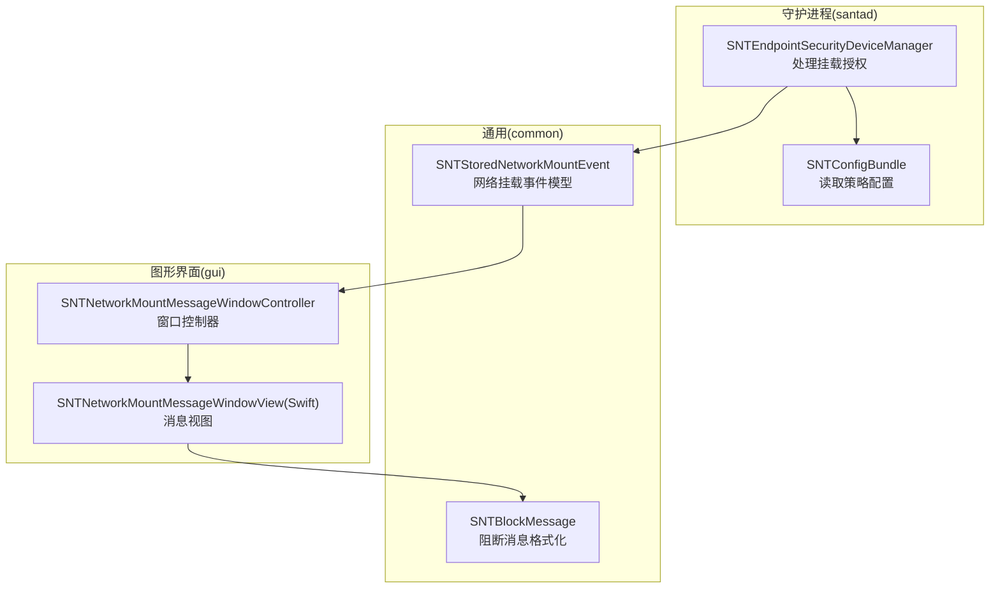
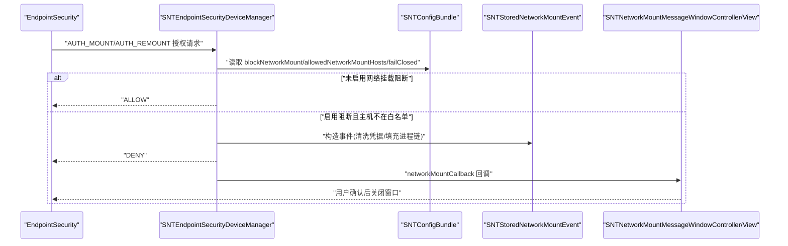
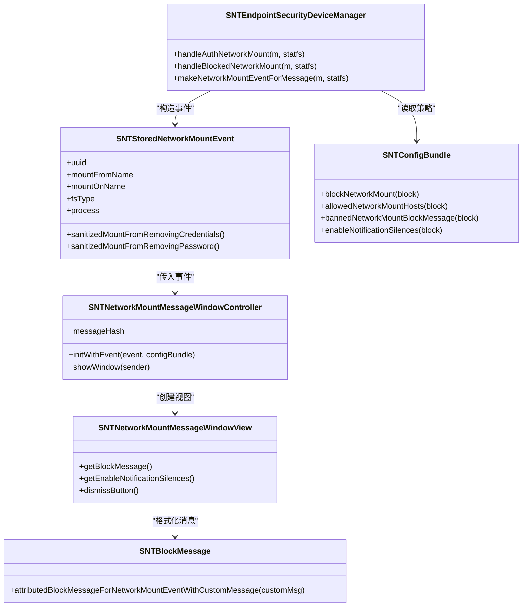
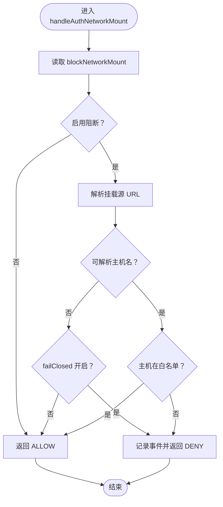

# 网络挂载消息

<cite>
**本文引用的文件**
- [SNTNetworkMountMessageWindowController.h](file://Source/gui/SNTNetworkMountMessageWindowController.h)
- [SNTNetworkMountMessageWindowController.mm](file://Source/gui/SNTNetworkMountMessageWindowController.mm)
- [SNTNetworkMountMessageWindowView.swift](file://Source/gui/SNTNetworkMountMessageWindowView.swift)
- [SNTStoredNetworkMountEvent.h](file://Source/common/SNTStoredNetworkMountEvent.h)
- [SNTStoredNetworkMountEvent.mm](file://Source/common/SNTStoredNetworkMountEvent.mm)
- [SNTConfigBundle.h](file://Source/common/SNTConfigBundle.h)
- [SNTConfigBundle.mm](file://Source/common/SNTConfigBundle.mm)
- [SNTBlockMessage.h](file://Source/common/SNTBlockMessage.h)
- [SNTBlockMessage.mm](file://Source/common/SNTBlockMessage.mm)
- [SNTEndpointSecurityDeviceManager.mm](file://Source/santad/EventProviders/SNTEndpointSecurityDeviceManager.mm)
- [EndpointSecurity_Research_Report.md](file://docs/EndpointSecurity_Research_Report.md)
- [EndpointSecurity-Research-Report.md](file://EndpointSecurity-Research-Report.md)
- [SNTNetworkMountMessageWindowControllerTest.mm](file://Source/santad/EventProviders/SNTEndpointSecurityDeviceManagerTest.mm)
</cite>

## 目录
1. [简介](#简介)
2. [项目结构](#项目结构)
3. [核心组件](#核心组件)
4. [架构总览](#架构总览)
5. [组件详解](#组件详解)
6. [依赖关系分析](#依赖关系分析)
7. [性能考量](#性能考量)
8. [故障排查指南](#故障排查指南)
9. [结论](#结论)
10. [附录](#附录)

## 简介
本文件围绕“网络挂载消息”主题，系统化梳理 Santa 在 macOS 上对网络挂载（如 SMB/NFS 等）的检测、授权与用户提示机制。内容涵盖：
- 触发条件与检测流程
- 网络资源访问控制与挂载权限验证
- 协议识别与挂载点验证
- 用户授权决策（允许/阻止）与策略配置
- 界面设计、网络信息展示与用户确认流程
- 策略配置、白名单管理与消息定制

## 项目结构
网络挂载消息涉及三层协同：
- 守护进程侧（santad）：接收 EndpointSecurity 授权事件，判定是否允许网络挂载，必要时生成并上报网络挂载事件
- 通用层（common）：定义网络挂载事件数据模型与配置读取接口
- GUI 层（gui）：将事件渲染为用户可读的消息窗口，支持复制详情、静默通知等

图表来源
- [SNTEndpointSecurityDeviceManager.mm](file://Source/santad/EventProviders/SNTEndpointSecurityDeviceManager.mm#L567-L644)
- [SNTStoredNetworkMountEvent.h](file://Source/common/SNTStoredNetworkMountEvent.h#L20-L42)
- [SNTStoredNetworkMountEvent.mm](file://Source/common/SNTStoredNetworkMountEvent.mm#L55-L108)
- [SNTConfigBundle.h](file://Source/common/SNTConfigBundle.h#L22-L48)
- [SNTConfigBundle.mm](file://Source/common/SNTConfigBundle.mm#L140-L155)
- [SNTNetworkMountMessageWindowController.h](file://Source/gui/SNTNetworkMountMessageWindowController.h#L21-L30)
- [SNTNetworkMountMessageWindowController.mm](file://Source/gui/SNTNetworkMountMessageWindowController.mm#L31-L52)
- [SNTNetworkMountMessageWindowView.swift](file://Source/gui/SNTNetworkMountMessageWindowView.swift#L206-L260)
- [SNTBlockMessage.h](file://Source/common/SNTBlockMessage.h#L52-L54)
- [SNTBlockMessage.mm](file://Source/common/SNTBlockMessage.mm#L119-L126)

章节来源
- [SNTEndpointSecurityDeviceManager.mm](file://Source/santad/EventProviders/SNTEndpointSecurityDeviceManager.mm#L567-L644)
- [SNTStoredNetworkMountEvent.h](file://Source/common/SNTStoredNetworkMountEvent.h#L20-L42)
- [SNTStoredNetworkMountEvent.mm](file://Source/common/SNTStoredNetworkMountEvent.mm#L55-L108)
- [SNTConfigBundle.h](file://Source/common/SNTConfigBundle.h#L22-L48)
- [SNTConfigBundle.mm](file://Source/common/SNTConfigBundle.mm#L140-L155)
- [SNTNetworkMountMessageWindowController.h](file://Source/gui/SNTNetworkMountMessageWindowController.h#L21-L30)
- [SNTNetworkMountMessageWindowController.mm](file://Source/gui/SNTNetworkMountMessageWindowController.mm#L31-L52)
- [SNTNetworkMountMessageWindowView.swift](file://Source/gui/SNTNetworkMountMessageWindowView.swift#L206-L260)
- [SNTBlockMessage.h](file://Source/common/SNTBlockMessage.h#L52-L54)
- [SNTBlockMessage.mm](file://Source/common/SNTBlockMessage.mm#L119-L126)

## 核心组件
- 网络挂载事件模型：封装挂载源、目标挂载点、文件系统类型、执行进程链等关键信息，并提供凭据清洗能力
- 配置读取器：提供网络挂载阻断开关、白名单主机集合、阻断消息模板、通知静默开关等策略键
- 授权处理器：基于 EndpointSecurity 授权事件，结合配置进行判定；若阻止则生成网络挂载事件并回调 GUI
- GUI 控制器与视图：负责窗口创建、消息渲染、用户交互（允许/阻止、复制详情、静默通知）

章节来源
- [SNTStoredNetworkMountEvent.h](file://Source/common/SNTStoredNetworkMountEvent.h#L20-L42)
- [SNTStoredNetworkMountEvent.mm](file://Source/common/SNTStoredNetworkMountEvent.mm#L55-L108)
- [SNTConfigBundle.h](file://Source/common/SNTConfigBundle.h#L22-L48)
- [SNTConfigBundle.mm](file://Source/common/SNTConfigBundle.mm#L140-L155)
- [SNTEndpointSecurityDeviceManager.mm](file://Source/santad/EventProviders/SNTEndpointSecurityDeviceManager.mm#L567-L644)
- [SNTNetworkMountMessageWindowController.h](file://Source/gui/SNTNetworkMountMessageWindowController.h#L21-L30)
- [SNTNetworkMountMessageWindowController.mm](file://Source/gui/SNTNetworkMountMessageWindowController.mm#L31-L52)
- [SNTNetworkMountMessageWindowView.swift](file://Source/gui/SNTNetworkMountMessageWindowView.swift#L206-L260)

## 架构总览
下图展示了从内核授权到用户提示的完整链路。

图表来源
- [SNTEndpointSecurityDeviceManager.mm](file://Source/santad/EventProviders/SNTEndpointSecurityDeviceManager.mm#L567-L644)
- [SNTStoredNetworkMountEvent.mm](file://Source/common/SNTStoredNetworkMountEvent.mm#L607-L639)
- [SNTNetworkMountMessageWindowController.mm](file://Source/gui/SNTNetworkMountMessageWindowController.mm#L31-L52)
- [SNTNetworkMountMessageWindowView.swift](file://Source/gui/SNTNetworkMountMessageWindowView.swift#L206-L260)

章节来源
- [SNTEndpointSecurityDeviceManager.mm](file://Source/santad/EventProviders/SNTEndpointSecurityDeviceManager.mm#L567-L644)
- [SNTNetworkMountMessageWindowController.mm](file://Source/gui/SNTNetworkMountMessageWindowController.mm#L31-L52)
- [SNTNetworkMountMessageWindowView.swift](file://Source/gui/SNTNetworkMountMessageWindowView.swift#L206-L260)

## 组件详解

### 网络挂载检测与协议识别
- 事件订阅：守护进程订阅 AUTH_MOUNT、AUTH_REMOUNT、NOTIFY_UNMOUNT 三类事件，用于挂载授权与卸载通知
- 协议识别（macOS 15+）：通过 ES 消息中的 disposition 字段区分网络挂载与本地挂载，确保在旧系统上不访问不存在字段
- 协议识别（通用）：当无法解析 URL 主机名时，依据 failClosed 策略决定放行或拦截

章节来源
- [EndpointSecurity_Research_Report.md](file://docs/EndpointSecurity_Research_Report.md#L687-L782)
- [EndpointSecurity-Research-Report.md](file://EndpointSecurity-Research-Report.md#L392-L424)
- [SNTEndpointSecurityDeviceManager.mm](file://Source/santad/EventProviders/SNTEndpointSecurityDeviceManager.mm#L567-L605)

### 授权判定与挂载权限验证
- 阻断开关：blockNetworkMount 为真时启用网络挂载阻断；为假时直接允许
- 白名单主机：allowedNetworkMountHosts 包含的主机直通放行
- 无效 URL 处理：无法解析主机名时，failClosed 为真则拦截，否则放行
- 事件生成：被拦截时构造 SNTStoredNetworkMountEvent，填充挂载源、目标、文件系统类型、进程链等信息

章节来源
- [SNTEndpointSecurityDeviceManager.mm](file://Source/santad/EventProviders/SNTEndpointSecurityDeviceManager.mm#L567-L644)
- [SNTStoredNetworkMountEvent.mm](file://Source/common/SNTStoredNetworkMountEvent.mm#L607-L639)
- [SNTConfigBundle.mm](file://Source/common/SNTConfigBundle.mm#L140-L155)

### 网络挂载事件模型与凭据清洗
- 字段：包含挂载源、目标挂载点、文件系统类型、进程链等
- 去敏感：提供移除凭据/密码的清洗方法，避免日志与存储泄露
- 去重：以挂载源作为唯一标识，便于退避缓存

章节来源
- [SNTStoredNetworkMountEvent.h](file://Source/common/SNTStoredNetworkMountEvent.h#L20-L42)
- [SNTStoredNetworkMountEvent.mm](file://Source/common/SNTStoredNetworkMountEvent.mm#L55-L108)

### GUI 界面与用户确认流程
- 窗口控制器：负责创建默认窗口、注入事件与配置、处理用户回调（静默通知周期）
- 视图渲染：展示网络共享源、目标挂载点、FS 类型、更多详情（含签名信息、父进程等）、复制详情按钮
- 消息定制：优先使用配置中的 bannedNetworkMountBlockMessage，否则回退到默认阻断消息
- 交互：提供“不再提醒”静默通知功能，支持选择静默周期

章节来源
- [SNTNetworkMountMessageWindowController.h](file://Source/gui/SNTNetworkMountMessageWindowController.h#L21-L30)
- [SNTNetworkMountMessageWindowController.mm](file://Source/gui/SNTNetworkMountMessageWindowController.mm#L31-L52)
- [SNTNetworkMountMessageWindowView.swift](file://Source/gui/SNTNetworkMountMessageWindowView.swift#L41-L62)
- [SNTNetworkMountMessageWindowView.swift](file://Source/gui/SNTNetworkMountMessageWindowView.swift#L166-L204)
- [SNTNetworkMountMessageWindowView.swift](file://Source/gui/SNTNetworkMountMessageWindowView.swift#L206-L260)
- [SNTBlockMessage.mm](file://Source/common/SNTBlockMessage.mm#L119-L126)

### 策略配置与白名单管理
- 关键配置键：
  - blockNetworkMount：启用/禁用网络挂载阻断
  - allowedNetworkMountHosts：网络挂载白名单主机列表
  - bannedNetworkMountBlockMessage：网络挂载阻断消息模板
  - enableNotificationSilences：启用通知静默
  - failClosed：当无法解析主机名时的缺省策略
- 配置读取：通过 SNTConfigBundle 的块式访问器读取上述键值

章节来源
- [SNTConfigBundle.h](file://Source/common/SNTConfigBundle.h#L22-L48)
- [SNTConfigBundle.mm](file://Source/common/SNTConfigBundle.mm#L140-L155)
- [SNTConfigBundle.mm](file://Source/common/SNTConfigBundle.mm#L222-L226)

### 网络挂载消息的界面设计要点
- 信息分层：主面板展示关键信息（网络共享、目标），更多详情弹窗展示完整上下文
- 可复制性：一键复制事件摘要至剪贴板，便于审计与工单
- 交互反馈：支持“不再提醒”并设定静默周期，减少重复打扰

章节来源
- [SNTNetworkMountMessageWindowView.swift](file://Source/gui/SNTNetworkMountMessageWindowView.swift#L166-L204)
- [SNTNetworkMountMessageWindowView.swift](file://Source/gui/SNTNetworkMountMessageWindowView.swift#L206-L260)

## 依赖关系分析

图表来源
- [SNTEndpointSecurityDeviceManager.mm](file://Source/santad/EventProviders/SNTEndpointSecurityDeviceManager.mm#L567-L644)
- [SNTStoredNetworkMountEvent.h](file://Source/common/SNTStoredNetworkMountEvent.h#L20-L42)
- [SNTStoredNetworkMountEvent.mm](file://Source/common/SNTStoredNetworkMountEvent.mm#L607-L639)
- [SNTConfigBundle.h](file://Source/common/SNTConfigBundle.h#L22-L48)
- [SNTNetworkMountMessageWindowController.h](file://Source/gui/SNTNetworkMountMessageWindowController.h#L21-L30)
- [SNTNetworkMountMessageWindowController.mm](file://Source/gui/SNTNetworkMountMessageWindowController.mm#L31-L52)
- [SNTNetworkMountMessageWindowView.swift](file://Source/gui/SNTNetworkMountMessageWindowView.swift#L206-L260)
- [SNTBlockMessage.h](file://Source/common/SNTBlockMessage.h#L52-L54)
- [SNTBlockMessage.mm](file://Source/common/SNTBlockMessage.mm#L119-L126)

章节来源
- [SNTEndpointSecurityDeviceManager.mm](file://Source/santad/EventProviders/SNTEndpointSecurityDeviceManager.mm#L567-L644)
- [SNTStoredNetworkMountEvent.h](file://Source/common/SNTStoredNetworkMountEvent.h#L20-L42)
- [SNTStoredNetworkMountEvent.mm](file://Source/common/SNTStoredNetworkMountEvent.mm#L607-L639)
- [SNTConfigBundle.h](file://Source/common/SNTConfigBundle.h#L22-L48)
- [SNTNetworkMountMessageWindowController.h](file://Source/gui/SNTNetworkMountMessageWindowController.h#L21-L30)
- [SNTNetworkMountMessageWindowController.mm](file://Source/gui/SNTNetworkMountMessageWindowController.mm#L31-L52)
- [SNTNetworkMountMessageWindowView.swift](file://Source/gui/SNTNetworkMountMessageWindowView.swift#L206-L260)
- [SNTBlockMessage.h](file://Source/common/SNTBlockMessage.h#L52-L54)
- [SNTBlockMessage.mm](file://Source/common/SNTBlockMessage.mm#L119-L126)

## 性能考量
- 授权路径轻量：仅在需要时进行 URL 解析与主机名校验，避免不必要的 I/O
- 事件序列化与日志分离：记录与授权解耦，降低授权队列延迟
- 缓存与退避：事件标记为可退避缓存，减少重复告警

章节来源
- [EndpointSecurity-Research-Report.md](file://EndpointSecurity-Research-Report.md#L392-L424)
- [SNTStoredNetworkMountEvent.mm](file://Source/common/SNTStoredNetworkMountEvent.mm#L55-L63)

## 故障排查指南
- 症状：网络挂载被阻止但无消息弹窗
  - 检查 blockNetworkMount 是否启用；检查 allowedNetworkMountHosts 是否包含目标主机
  - 确认 failClosed 与 URL 解析失败场景下的预期行为
- 症状：消息中出现明文凭据
  - 使用事件提供的清洗方法，确保挂载 URL 中的凭据被移除
- 症状：频繁重复告警
  - 调整 allowedNetworkMountHosts 或启用通知静默
- 症状：macOS 15+ 下网络挂载未按预期识别
  - 确认 ES 消息版本与 dispostion 字段可用性

章节来源
- [SNTEndpointSecurityDeviceManager.mm](file://Source/santad/EventProviders/SNTEndpointSecurityDeviceManager.mm#L567-L644)
- [SNTStoredNetworkMountEvent.mm](file://Source/common/SNTStoredNetworkMountEvent.mm#L70-L105)
- [SNTNetworkMountMessageWindowView.swift](file://Source/gui/SNTNetworkMountMessageWindowView.swift#L206-L260)
- [SNTNetworkMountMessageWindowControllerTest.mm](file://Source/santad/EventProviders/SNTEndpointSecurityDeviceManagerTest.mm#L596-L698)

## 结论
网络挂载消息在 Santa 中通过“守护进程授权 + 通用事件模型 + GUI 提示”的分层设计实现。其核心在于：
- 明确的触发与判定逻辑（阻断开关、白名单、failClosed）
- 完整的事件建模与凭据清洗
- 友好的用户界面与可定制消息
- 与系统安全框架（EndpointSecurity）的深度集成与兼容

## 附录

### 关键流程图：网络挂载授权判定

图表来源
- [SNTEndpointSecurityDeviceManager.mm](file://Source/santad/EventProviders/SNTEndpointSecurityDeviceManager.mm#L567-L605)