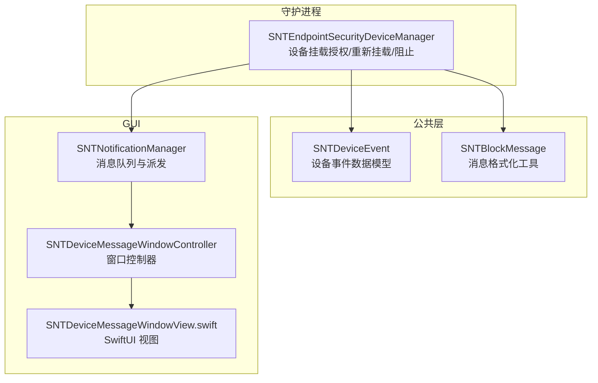
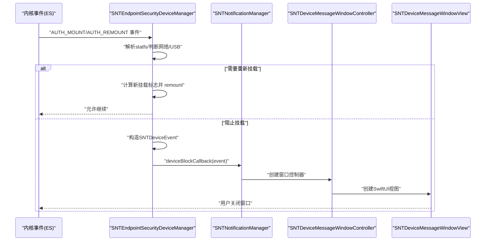
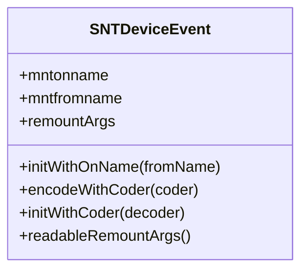
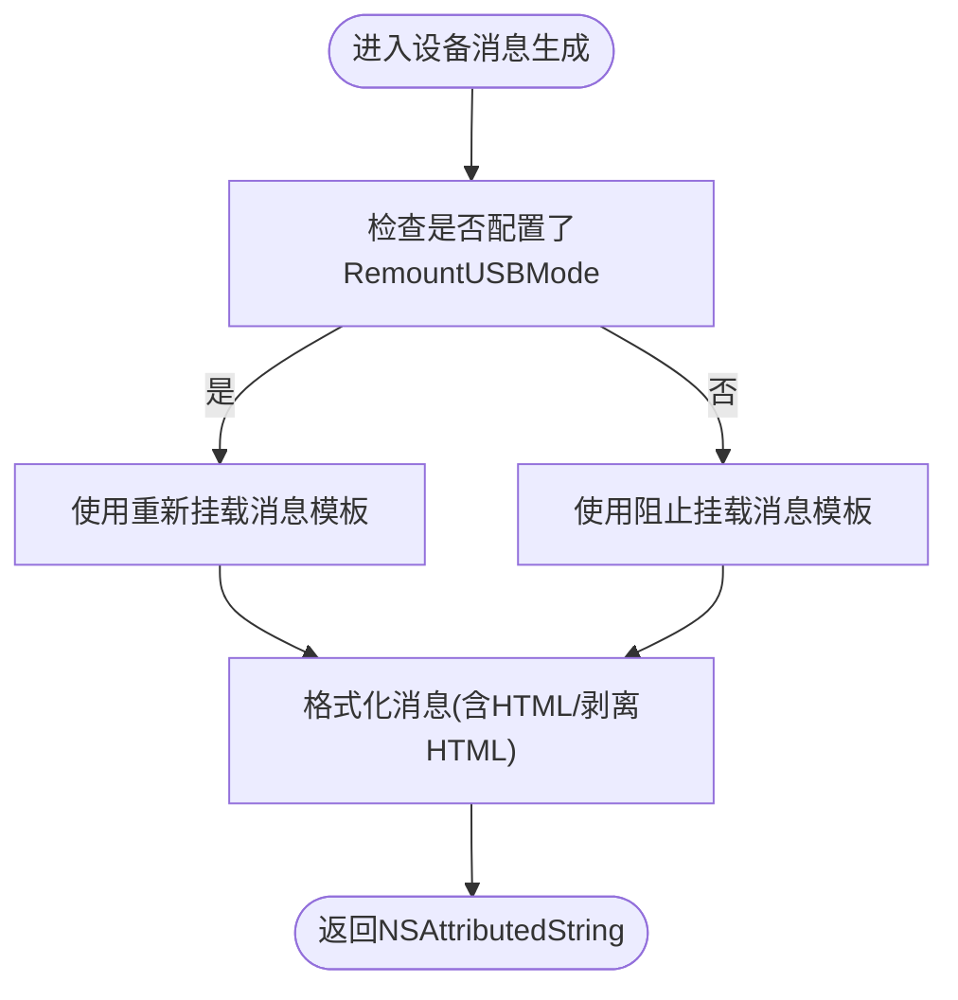
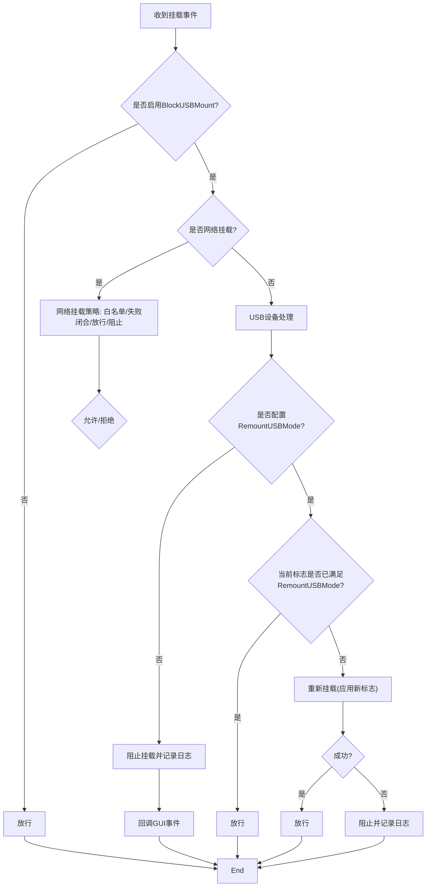
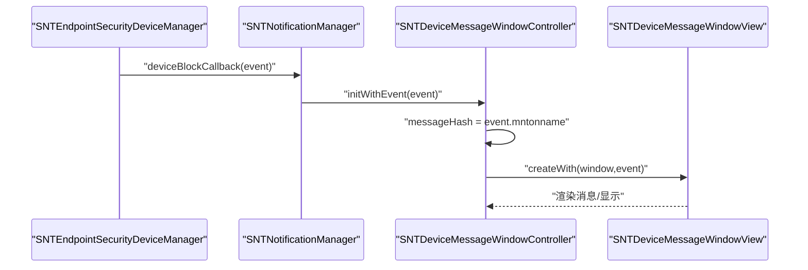
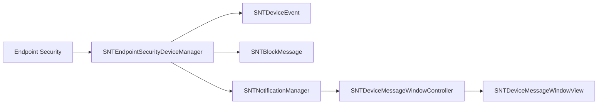

# 设备消息

<cite>
**本文引用的文件**
- [SNTDeviceEvent.h](file://Source/common/SNTDeviceEvent.h)
- [SNTDeviceEvent.mm](file://Source/common/SNTDeviceEvent.mm)
- [SNTBlockMessage.h](file://Source/common/SNTBlockMessage.h)
- [SNTBlockMessage.mm](file://Source/common/SNTBlockMessage.mm)
- [SNTDeviceMessageWindowController.h](file://Source/gui/SNTDeviceMessageWindowController.h)
- [SNTDeviceMessageWindowController.mm](file://Source/gui/SNTDeviceMessageWindowController.mm)
- [SNTDeviceMessageWindowView.swift](file://Source/gui/SNTDeviceMessageWindowView.swift)
- [SNTNotificationManager.mm](file://Source/gui/SNTNotificationManager.mm)
- [SNTEndpointSecurityDeviceManager.mm](file://Source/santad/EventProviders/SNTEndpointSecurityDeviceManager.mm)
- [Santad.mm](file://Source/santad/Santad.mm)
- [usb-sd-blocking.md](file://docs/docs/features/usb-sd-blocking.md)
- [santaconfig.ts](file://docs/src/lib/santaconfig.ts)
- [SNTTestGUI.swift](file://Source/gui/SNTTestGUI.swift)
</cite>

## 目录
1. [简介](#简介)
2. [项目结构](#项目结构)
3. [核心组件](#核心组件)
4. [架构总览](#架构总览)
5. [详细组件分析](#详细组件分析)
6. [依赖关系分析](#依赖关系分析)
7. [性能考量](#性能考量)
8. [故障排查指南](#故障排查指南)
9. [结论](#结论)
10. [附录](#附录)

## 简介
本文件围绕“设备消息”主题，系统性说明 Santa 中 USB 设备挂载拦截与提示流程。内容涵盖：
- 触发条件：设备插入检测、设备类型识别、策略匹配与权限验证。
- 策略与阻止决策：是否阻止、是否强制重新挂载及挂载标志更新。
- 用户确认流程：消息展示、信息呈现与交互逻辑（当前实现以通知为主，不包含允许/阻止/临时信任等交互按钮）。
- 界面设计与信息展示：消息窗口、设备路径与挂载参数显示。
- 配置与定制：USB 策略开关、重新挂载模式、启动时处理策略、消息文案定制。

## 项目结构
设备消息相关代码分布在三类模块中：
- 公共模型与消息格式化：SNTDeviceEvent、SNTBlockMessage。
- 守护进程策略执行：SNTEndpointSecurityDeviceManager（设备挂载授权、重新挂载、阻止回调）。
- GUI 展示层：SNTDeviceMessageWindowController、SNTDeviceMessageWindowView（SwiftUI）以及 SNTNotificationManager 的消息派发。

图表来源
- [SNTDeviceEvent.h](file://Source/common/SNTDeviceEvent.h#L1-L28)
- [SNTDeviceEvent.mm](file://Source/common/SNTDeviceEvent.mm#L1-L56)
- [SNTBlockMessage.h](file://Source/common/SNTBlockMessage.h#L1-L72)
- [SNTBlockMessage.mm](file://Source/common/SNTBlockMessage.mm#L102-L117)
- [SNTEndpointSecurityDeviceManager.mm](file://Source/santad/EventProviders/SNTEndpointSecurityDeviceManager.mm#L440-L537)
- [SNTNotificationManager.mm](file://Source/gui/SNTNotificationManager.mm#L420-L432)
- [SNTDeviceMessageWindowController.mm](file://Source/gui/SNTDeviceMessageWindowController.mm#L34-L50)
- [SNTDeviceMessageWindowView.swift](file://Source/gui/SNTDeviceMessageWindowView.swift#L30-L64)

章节来源
- [SNTDeviceEvent.h](file://Source/common/SNTDeviceEvent.h#L1-L28)
- [SNTDeviceEvent.mm](file://Source/common/SNTDeviceEvent.mm#L1-L56)
- [SNTBlockMessage.h](file://Source/common/SNTBlockMessage.h#L1-L72)
- [SNTBlockMessage.mm](file://Source/common/SNTBlockMessage.mm#L102-L117)
- [SNTEndpointSecurityDeviceManager.mm](file://Source/santad/EventProviders/SNTEndpointSecurityDeviceManager.mm#L440-L537)
- [SNTNotificationManager.mm](file://Source/gui/SNTNotificationManager.mm#L420-L432)
- [SNTDeviceMessageWindowController.mm](file://Source/gui/SNTDeviceMessageWindowController.mm#L34-L50)
- [SNTDeviceMessageWindowView.swift](file://Source/gui/SNTDeviceMessageWindowView.swift#L30-L64)

## 核心组件
- SNTDeviceEvent：封装一次设备挂载事件的关键信息，包括挂载源路径、目标挂载点以及可选的重新挂载参数列表；并提供可读化的参数描述。
- SNTBlockMessage：根据事件类型生成面向用户的富文本消息，支持从配置读取自定义消息模板，并在 GUI 与守护进程侧分别进行 HTML 处理。
- SNTEndpointSecurityDeviceManager：负责监听磁盘出现事件，判断是否对设备挂载进行授权、重新挂载或阻止；在阻止时构造 SNTDeviceEvent 并通过回调传递给 GUI。
- SNTNotificationManager：接收来自守护进程的设备阻止事件，入队并派发到 GUI 层的消息窗口控制器。
- SNTDeviceMessageWindowController/SNTDeviceMessageWindowView：创建并展示设备消息窗口，使用 SNTBlockMessage 生成消息正文，展示设备路径与重新挂载参数。

章节来源
- [SNTDeviceEvent.h](file://Source/common/SNTDeviceEvent.h#L17-L27)
- [SNTDeviceEvent.mm](file://Source/common/SNTDeviceEvent.mm#L41-L53)
- [SNTBlockMessage.mm](file://Source/common/SNTBlockMessage.mm#L102-L117)
- [SNTEndpointSecurityDeviceManager.mm](file://Source/santad/EventProviders/SNTEndpointSecurityDeviceManager.mm#L498-L537)
- [SNTNotificationManager.mm](file://Source/gui/SNTNotificationManager.mm#L420-L432)
- [SNTDeviceMessageWindowController.mm](file://Source/gui/SNTDeviceMessageWindowController.mm#L34-L50)
- [SNTDeviceMessageWindowView.swift](file://Source/gui/SNTDeviceMessageWindowView.swift#L30-L64)

## 架构总览
下图展示了从内核事件到用户提示的整体流程，包括策略判定、消息生成与窗口展示。

图表来源
- [SNTEndpointSecurityDeviceManager.mm](file://Source/santad/EventProviders/SNTEndpointSecurityDeviceManager.mm#L440-L537)
- [SNTNotificationManager.mm](file://Source/gui/SNTNotificationManager.mm#L420-L432)
- [SNTDeviceMessageWindowController.mm](file://Source/gui/SNTDeviceMessageWindowController.mm#L34-L50)
- [SNTDeviceMessageWindowView.swift](file://Source/gui/SNTDeviceMessageWindowView.swift#L30-L64)

## 详细组件分析

### 设备事件模型 SNTDeviceEvent
- 职责：承载一次设备挂载事件的必要字段，便于后续策略评估与消息展示。
- 关键属性：
  - 挂载源路径与目标路径。
  - 可选的重新挂载参数数组。
- 行为：
  - 提供安全编码支持。
  - 将内部参数转换为人类可读的描述字符串（如只读、禁止执行等）。

图表来源
- [SNTDeviceEvent.h](file://Source/common/SNTDeviceEvent.h#L17-L27)
- [SNTDeviceEvent.mm](file://Source/common/SNTDeviceEvent.mm#L20-L53)

章节来源
- [SNTDeviceEvent.h](file://Source/common/SNTDeviceEvent.h#L17-L27)
- [SNTDeviceEvent.mm](file://Source/common/SNTDeviceEvent.mm#L20-L53)

### 消息格式化 SNTBlockMessage
- 职责：根据事件类型生成用户可见的富文本消息；支持从配置读取自定义消息模板。
- 设备消息专用方法：
  - 当配置了重新挂载模式时，返回“已重新挂载”的默认消息或自定义消息；
  - 否则返回“被阻止挂载”的默认消息或自定义消息。
- HTML 处理：
  - 在 GUI 侧保留 HTML 格式；
  - 在守护进程侧剥离 HTML 并替换换行符。

图表来源
- [SNTBlockMessage.mm](file://Source/common/SNTBlockMessage.mm#L102-L117)
- [SNTBlockMessage.mm](file://Source/common/SNTBlockMessage.mm#L31-L61)

章节来源
- [SNTBlockMessage.h](file://Source/common/SNTBlockMessage.h#L38-L51)
- [SNTBlockMessage.mm](file://Source/common/SNTBlockMessage.mm#L102-L117)
- [SNTBlockMessage.mm](file://Source/common/SNTBlockMessage.mm#L31-L61)

### 设备挂载授权与阻止决策（守护进程）
- 订阅事件：守护进程订阅 AUTH_MOUNT、AUTH_REMOUNT、UNMOUNT 等事件。
- 判定逻辑：
  - 若未启用 USB 阻止，则直接放行；
  - 对于网络挂载，依据配置决定允许/拒绝；
  - 对于本地 USB 设备：
    - 若配置了重新挂载参数且当前挂载标志已满足要求，则放行；
    - 否则尝试重新挂载（应用新的挂载标志），若失败则阻止并记录日志；
    - 最终通过回调向 GUI 发送 SNTDeviceEvent。
- 启动时处理：根据 OnStartUSBOptions 决定对现有挂载的处理策略（忽略/卸载/强制卸载）。

图表来源
- [SNTEndpointSecurityDeviceManager.mm](file://Source/santad/EventProviders/SNTEndpointSecurityDeviceManager.mm#L440-L537)
- [SNTEndpointSecurityDeviceManager.mm](file://Source/santad/EventProviders/SNTEndpointSecurityDeviceManager.mm#L570-L605)
- [SNTEndpointSecurityDeviceManager.mm](file://Source/santad/EventProviders/SNTEndpointSecurityDeviceManager.mm#L539-L551)

章节来源
- [SNTEndpointSecurityDeviceManager.mm](file://Source/santad/EventProviders/SNTEndpointSecurityDeviceManager.mm#L440-L537)
- [SNTEndpointSecurityDeviceManager.mm](file://Source/santad/EventProviders/SNTEndpointSecurityDeviceManager.mm#L570-L605)
- [SNTEndpointSecurityDeviceManager.mm](file://Source/santad/EventProviders/SNTEndpointSecurityDeviceManager.mm#L539-L551)

### GUI 展示与交互
- SNTNotificationManager：接收设备阻止事件，创建 SNTDeviceMessageWindowController 并入队展示。
- SNTDeviceMessageWindowController：初始化窗口、设置内容视图（由工厂创建），并基于事件生成消息哈希用于去重。
- SNTDeviceMessageWindowView：使用 SNTBlockMessage 生成消息正文，展示设备路径与重新挂载参数；提供“关闭”按钮。

图表来源
- [SNTNotificationManager.mm](file://Source/gui/SNTNotificationManager.mm#L420-L432)
- [SNTDeviceMessageWindowController.mm](file://Source/gui/SNTDeviceMessageWindowController.mm#L26-L50)
- [SNTDeviceMessageWindowView.swift](file://Source/gui/SNTDeviceMessageWindowView.swift#L30-L64)

章节来源
- [SNTNotificationManager.mm](file://Source/gui/SNTNotificationManager.mm#L420-L432)
- [SNTDeviceMessageWindowController.h](file://Source/gui/SNTDeviceMessageWindowController.h#L21-L31)
- [SNTDeviceMessageWindowController.mm](file://Source/gui/SNTDeviceMessageWindowController.mm#L26-L50)
- [SNTDeviceMessageWindowView.swift](file://Source/gui/SNTDeviceMessageWindowView.swift#L30-L64)

### 用户确认流程与界面设计
- 当前实现：设备阻止时仅展示不可交互的通知窗口，不提供“允许/阻止/临时信任”等用户选择按钮。
- 界面元素：
  - 标题区域使用统一的消息视图组件；
  - 左侧显示“路径/重新挂载模式”等标签；
  - 右侧显示对应值（设备路径、可读化的重新挂载参数）；
  - 底部提供“关闭”按钮，用户点击后关闭窗口。
- 信息来源：消息文本由 SNTBlockMessage 基于配置生成；设备路径与参数来自 SNTDeviceEvent。

章节来源
- [SNTBlockMessage.mm](file://Source/common/SNTBlockMessage.mm#L102-L117)
- [SNTDeviceEvent.mm](file://Source/common/SNTDeviceEvent.mm#L41-L53)
- [SNTDeviceMessageWindowView.swift](file://Source/gui/SNTDeviceMessageWindowView.swift#L30-L64)

### 策略配置与消息定制
- 关键配置项（摘自配置文档与前端配置清单）：
  - BlockUSBMount：是否启用 USB 存储阻止。
  - RemountUSBMode：重新挂载时使用的挂载参数数组（如只读、禁执行、禁 SUID 等）。
  - OnStartUSBOptions：启动时对已有挂载的处理策略（忽略/卸载/强制卸载）。
  - RemountUSBBlockMessage / BannedUSBBlockMessage：重新挂载与阻止时的自定义消息模板。
- 配置生效路径：
  - 守护进程侧监听配置变更并更新内部状态；
  - GUI 侧通过 SNTBlockMessage 读取配置生成消息；
  - 文案可在测试 GUI 中覆盖以预览效果。

章节来源
- [usb-sd-blocking.md](file://docs/docs/features/usb-sd-blocking.md#L1-L33)
- [santaconfig.ts](file://docs/src/lib/santaconfig.ts#L652-L680)
- [Santad.mm](file://Source/santad/Santad.mm#L371-L397)
- [SNTBlockMessage.mm](file://Source/common/SNTBlockMessage.mm#L102-L117)
- [SNTTestGUI.swift](file://Source/gui/SNTTestGUI.swift#L216-L238)

## 依赖关系分析
- 组件耦合：
  - SNTEndpointSecurityDeviceManager 依赖 SNTDeviceEvent 与 SNTBlockMessage 生成事件与消息；
  - GUI 层通过 SNTNotificationManager 与 SNTDeviceMessageWindowController 解耦守护进程与界面；
  - SNTBlockMessage 在 GUI 与守护进程两侧分别处理 HTML，降低跨端差异。
- 外部依赖：
  - 通过 Disk Arbitration 与 Endpoint Security 获取磁盘与挂载事件；
  - 通过 XPC/回调机制与 GUI 通信。

图表来源
- [SNTEndpointSecurityDeviceManager.mm](file://Source/santad/EventProviders/SNTEndpointSecurityDeviceManager.mm#L440-L537)
- [SNTNotificationManager.mm](file://Source/gui/SNTNotificationManager.mm#L420-L432)
- [SNTDeviceMessageWindowController.mm](file://Source/gui/SNTDeviceMessageWindowController.mm#L34-L50)
- [SNTDeviceMessageWindowView.swift](file://Source/gui/SNTDeviceMessageWindowView.swift#L30-L64)

## 性能考量
- 事件处理路径尽量短路：当未启用策略或无需重新挂载时直接放行，减少系统调用与日志开销。
- 重新挂载采用一次性操作：在满足条件时立即 remount，避免重复授权循环。
- 日志记录按需：阻止与网络挂载失败时记录详细信息，其他情况保持低噪声。

## 故障排查指南
- 未触发设备消息：
  - 检查 BlockUSBMount 是否开启；
  - 确认设备为可移动/USB/SD 类型且非内部/虚拟；
  - 若配置了 RemountUSBMode，确认当前挂载标志是否已满足。
- 消息文案异常：
  - 检查 RemountUSBBlockMessage/BannedUSBBlockMessage 是否正确下发；
  - 在测试 GUI 中覆盖配置验证消息渲染。
- 窗口不显示：
  - 确认 SNTNotificationManager 是否收到 deviceBlockCallback；
  - 检查 SNTDeviceMessageWindowController 初始化与视图工厂创建流程。

章节来源
- [SNTEndpointSecurityDeviceManager.mm](file://Source/santad/EventProviders/SNTEndpointSecurityDeviceManager.mm#L440-L537)
- [SNTNotificationManager.mm](file://Source/gui/SNTNotificationManager.mm#L420-L432)
- [SNTDeviceMessageWindowController.mm](file://Source/gui/SNTDeviceMessageWindowController.mm#L34-L50)
- [SNTTestGUI.swift](file://Source/gui/SNTTestGUI.swift#L216-L238)

## 结论
Santa 的设备消息体系以“策略驱动 + 事件驱动”为核心：守护进程在挂载授权阶段完成策略判定与必要的重新挂载，随后通过回调将设备事件传递至 GUI，最终以不可交互的通知形式向用户展示。该设计在保障安全的同时，保持了较低的用户干扰；未来可在 GUI 层引入允许/阻止/临时信任等交互选项，进一步提升用户体验与可控性。

## 附录
- 相关配置键与说明可参考：
  - BlockUSBMount、RemountUSBMode、OnStartUSBOptions、RemountUSBBlockMessage、BannedUSBBlockMessage
- 功能特性文档：
  - USB/SD Blocking 介绍与截图示例

章节来源
- [santaconfig.ts](file://docs/src/lib/santaconfig.ts#L652-L680)
- [usb-sd-blocking.md](file://docs/docs/features/usb-sd-blocking.md#L1-L33)