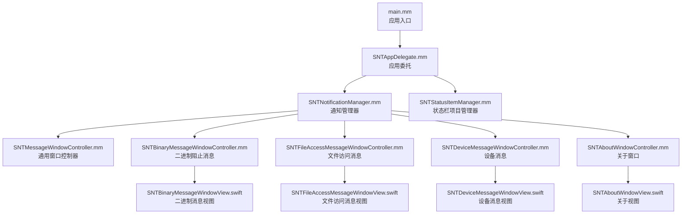
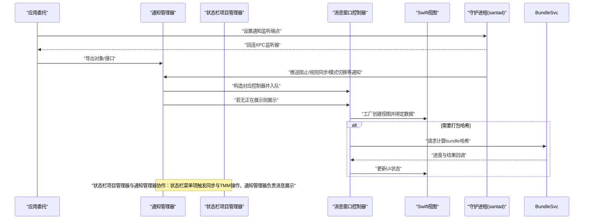
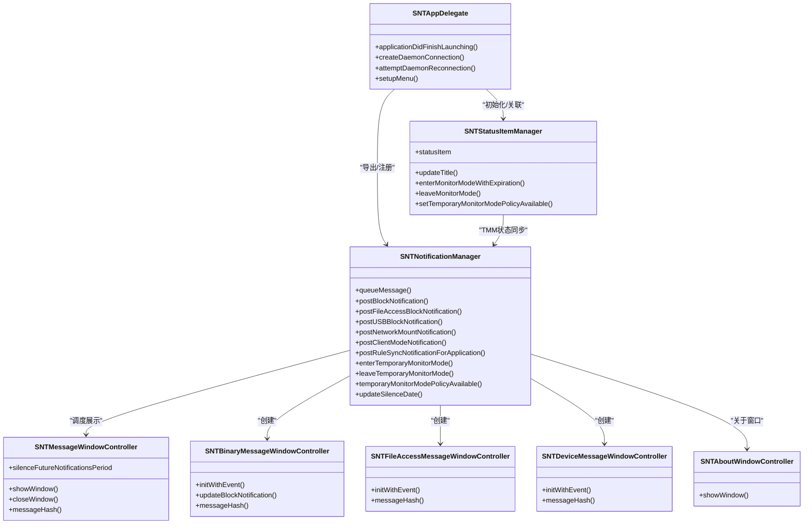

# 用户界面系统

<cite>
**本文引用的文件**
- [SNTAppDelegate.h](file://Source/gui/SNTAppDelegate.h)
- [SNTAppDelegate.mm](file://Source/gui/SNTAppDelegate.mm)
- [SNTNotificationManager.h](file://Source/gui/SNTNotificationManager.h)
- [SNTNotificationManager.mm](file://Source/gui/SNTNotificationManager.mm)
- [SNTStatusItemManager.h](file://Source/gui/SNTStatusItemManager.h)
- [SNTStatusItemManager.mm](file://Source/gui/SNTStatusItemManager.mm)
- [SNTMessageWindowController.h](file://Source/gui/SNTMessageWindowController.h)
- [SNTMessageWindowController.mm](file://Source/gui/SNTMessageWindowController.mm)
- [SNTBinaryMessageWindowController.h](file://Source/gui/SNTBinaryMessageWindowController.h)
- [SNTBinaryMessageWindowController.mm](file://Source/gui/SNTBinaryMessageWindowController.mm)
- [SNTFileAccessMessageWindowController.h](file://Source/gui/SNTFileAccessMessageWindowController.h)
- [SNTFileAccessMessageWindowController.mm](file://Source/gui/SNTFileAccessMessageWindowController.mm)
- [SNTDeviceMessageWindowController.h](file://Source/gui/SNTDeviceMessageWindowController.h)
- [SNTDeviceMessageWindowController.mm](file://Source/gui/SNTDeviceMessageWindowController.mm)
- [SNTAboutWindowController.h](file://Source/gui/SNTAboutWindowController.h)
- [SNTAboutWindowController.mm](file://Source/gui/SNTAboutWindowController.mm)
- [SNTAboutWindowView.swift](file://Source/gui/SNTAboutWindowView.swift)
- [SNTBinaryMessageWindowView.swift](file://Source/gui/SNTBinaryMessageWindowView.swift)
- [SNTFileAccessMessageWindowView.swift](file://Source/gui/SNTFileAccessMessageWindowView.swift)
- [SNTDeviceMessageWindowView.swift](file://Source/gui/SNTDeviceMessageWindowView.swift)
- [SNTFileInfoView.swift](file://Source/gui/SNTFileInfoView.swift)
- [SNTMessageView.swift](file://Source/gui/SNTMessageView.swift)
- [SNTNetworkMountMessageWindowView.swift](file://Source/gui/SNTNetworkMountMessageWindowView.swift)
- [Localizable.strings（英文）](file://Source/gui/Resources/en.lproj/Localizable.strings)
- [Localizable.strings（德文）](file://Source/gui/Resources/de.lproj/Localizable.strings)
- [Localizable.strings（日文）](file://Source/gui/Resources/ja.lproj/Localizable.strings)
- [Localizable.strings（俄文）](file://Source/gui/Resources/ru.lproj/Localizable.strings)
- [Localizable.strings（乌克兰语）](file://Source/gui/Resources/uk.lproj/Localizable.strings)
</cite>

## 目录
1. [简介](#简介)
2. [项目结构](#项目结构)
3. [核心组件](#核心组件)
4. [架构总览](#架构总览)
5. [详细组件分析](#详细组件分析)
6. [依赖关系分析](#依赖关系分析)
7. [性能考量](#性能考量)
8. [故障排查指南](#故障排查指南)
9. [结论](#结论)
10. [附录](#附录)

## 简介
本文件面向Santa的用户界面系统，系统性梳理GUI代理的应用架构、窗口控制器设计与用户交互流程；详解通知系统的机制、消息类型分类与自定义消息配置；解释二进制阻止消息、文件访问消息、设备消息等不同类型消息的显示逻辑与用户操作选项；阐述界面本地化支持、主题定制与可访问性功能；并提供界面扩展开发指南、自定义UI组件与用户体验优化建议，以及界面调试方法与常见问题解决方案。新增GUI菜单栏项目管理功能，包含状态栏图标、菜单项与临时监控模式管理。

## 项目结构
Santa GUI位于Source/gui目录，采用“应用委托 + 通知管理器 + 多种消息窗口控制器 + Swift视图工厂”的分层组织方式。应用入口通过main.mm启动，委托负责建立与守护进程的XPC连接、菜单与窗口生命周期管理；通知管理器统一调度消息队列、静音策略与分布式通知广播；各消息窗口控制器封装不同事件类型的UI与交互行为，并通过Swift工厂创建视图。新增状态栏项目管理器负责状态栏图标、菜单与临时监控模式状态展示。

图表来源
- [SNTAppDelegate.mm](file://Source/gui/SNTAppDelegate.mm#L41-L72)
- [SNTNotificationManager.mm](file://Source/gui/SNTNotificationManager.mm#L58-L504)
- [SNTStatusItemManager.mm](file://Source/gui/SNTStatusItemManager.mm#L109-L159)
- [SNTMessageWindowController.mm](file://Source/gui/SNTMessageWindowController.mm#L21-L78)
- [SNTBinaryMessageWindowController.mm](file://Source/gui/SNTBinaryMessageWindowController.mm#L40-L126)
- [SNTFileAccessMessageWindowController.mm](file://Source/gui/SNTFileAccessMessageWindowController.mm#L32-L83)
- [SNTDeviceMessageWindowController.mm](file://Source/gui/SNTDeviceMessageWindowController.mm#L24-L53)
- [SNTAboutWindowController.mm](file://Source/gui/SNTAboutWindowController.mm#L24-L61)

章节来源
- [SNTAppDelegate.mm](file://Source/gui/SNTAppDelegate.mm#L41-L72)
- [SNTStatusItemManager.mm](file://Source/gui/SNTStatusItemManager.mm#L109-L159)
- [SNTNotificationManager.mm](file://Source/gui/SNTNotificationManager.mm#L58-L504)

## 核心组件
- 应用委托（SNTAppDelegate）
  - 负责应用生命周期、菜单设置、与守护进程的XPC连接建立与重连、窗口关闭后的激活策略恢复。
- 通知管理器（SNTNotificationManager）
  - 统一排队与展示消息窗口，处理静音策略、分布式通知广播、与打包服务的进度回调。
- 状态栏项目管理器（SNTStatusItemManager）
  - 管理状态栏图标、菜单项（关于、同步、临时监控模式）与标题更新；支持临时监控模式计时与过期处理。
- 消息窗口控制器基类（SNTMessageWindowController）
  - 提供默认窗口样式、显示/关闭、静音期设置与消息哈希接口。
- 具体消息控制器
  - 二进制阻止消息：SNTBinaryMessageWindowController
  - 文件访问消息：SNTFileAccessMessageWindowController
  - 设备消息：SNTDeviceMessageWindowController
- 关于窗口控制器（SNTAboutWindowController）
  - 展示应用信息与版本等静态内容。
- 视图层（Swift工厂）
  - 通过各控制器的工厂方法创建对应Swift视图，承载UI渲染与用户交互。

章节来源
- [SNTAppDelegate.h](file://Source/gui/SNTAppDelegate.h#L16-L25)
- [SNTAppDelegate.mm](file://Source/gui/SNTAppDelegate.mm#L41-L72)
- [SNTNotificationManager.h](file://Source/gui/SNTNotificationManager.h#L24-L32)
- [SNTNotificationManager.mm](file://Source/gui/SNTNotificationManager.mm#L58-L504)
- [SNTStatusItemManager.h](file://Source/gui/SNTStatusItemManager.h#L17-L37)
- [SNTStatusItemManager.mm](file://Source/gui/SNTStatusItemManager.mm#L47-L108)
- [SNTMessageWindowController.h](file://Source/gui/SNTMessageWindowController.h#L15-L43)
- [SNTMessageWindowController.mm](file://Source/gui/SNTMessageWindowController.mm#L21-L78)
- [SNTBinaryMessageWindowController.h](file://Source/gui/SNTBinaryMessageWindowController.h#L16-L72)
- [SNTBinaryMessageWindowController.mm](file://Source/gui/SNTBinaryMessageWindowController.mm#L40-L126)
- [SNTFileAccessMessageWindowController.h](file://Source/gui/SNTFileAccessMessageWindowController.h#L15-L40)
- [SNTFileAccessMessageWindowController.mm](file://Source/gui/SNTFileAccessMessageWindowController.mm#L32-L83)
- [SNTDeviceMessageWindowController.h](file://Source/gui/SNTDeviceMessageWindowController.h#L14-L34)
- [SNTDeviceMessageWindowController.mm](file://Source/gui/SNTDeviceMessageWindowController.mm#L24-L53)
- [SNTAboutWindowController.h](file://Source/gui/SNTAboutWindowController.h#L14-L19)
- [SNTAboutWindowController.mm](file://Source/gui/SNTAboutWindowController.mm#L24-L61)

## 架构总览
GUI代理通过应用委托建立与守护进程的双向通信通道，使用XPC监听器作为回连端点，通知管理器在主线程串行展示消息，避免并发UI更新冲突。消息类型按事件来源分为二进制执行、文件访问、网络挂载与设备事件；同时支持静音策略与分布式通知广播，便于企业工具集成。新增状态栏项目管理器负责状态栏图标与菜单项，提供临时监控模式进入/刷新/离开与倒计时展示。

图表来源
- [SNTAppDelegate.mm](file://Source/gui/SNTAppDelegate.mm#L131-L165)
- [SNTNotificationManager.mm](file://Source/gui/SNTNotificationManager.mm#L149-L321)
- [SNTStatusItemManager.mm](file://Source/gui/SNTStatusItemManager.mm#L294-L358)

## 详细组件分析

### 应用委托（SNTAppDelegate）
职责
- 初始化菜单（复制/全选快捷键可用），确保键盘可用性。
- 建立匿名XPC监听器，导出通知管理器为受信接口，等待守护进程回连。
- 监听工作空间会话激活/失活，自动断开/重建连接。
- 管理窗口关闭后的激活策略，保持后台运行体验。
- 处理URL打开请求，展示文件信息窗口。
- 初始化状态栏项目管理器并与通知管理器关联。

章节来源
- [SNTAppDelegate.h](file://Source/gui/SNTAppDelegate.h#L16-L25)
- [SNTAppDelegate.mm](file://Source/gui/SNTAppDelegate.mm#L41-L72)
- [SNTAppDelegate.mm](file://Source/gui/SNTAppDelegate.mm#L131-L165)
- [SNTAppDelegate.mm](file://Source/gui/SNTAppDelegate.mm#L175-L188)

### 通知管理器（SNTNotificationManager）
职责
- 单例式消息调度：维护当前展示与待展示队列，保证同一时间仅一个消息窗口可见。
- 静音策略：基于用户选择与持久化静音表，过滤重复或短期静音的消息。
- 分布式通知广播：对二进制阻止与文件访问两类事件进行系统级广播，便于外部工具联动。
- 打包哈希计算：在二进制阻止消息中异步调用打包服务，计算bundle哈希并回填UI。
- 进度回调：接收打包服务的进度更新，驱动UI进度条与标签文本。
- 用户通知：通过UserNotifications发送客户端模式切换与规则同步完成等系统通知。
- 临时监控模式集成：接收TMM状态变更并转发至状态栏管理器。

消息类型与入口
- 二进制阻止：postBlockNotification(...)
- USB/设备阻止：postUSBBlockNotification(...)
- 网络挂载：postNetworkMountNotification(...)
- 文件访问阻止：postFileAccessBlockNotification(...)
- 客户端模式切换：postClientModeNotification(...)
- 规则同步完成：postRuleSyncNotificationForApplication(...)
- 临时监控模式：enterTemporaryMonitorMode(...)、leaveTemporaryMonitorMode(...)、temporaryMonitorModePolicyAvailable(...)

章节来源
- [SNTNotificationManager.h](file://Source/gui/SNTNotificationManager.h#L24-L32)
- [SNTNotificationManager.mm](file://Source/gui/SNTNotificationManager.mm#L58-L504)
- [SNTNotificationManager.mm](file://Source/gui/SNTNotificationManager.mm#L462-L490)

### 状态栏项目管理器（SNTStatusItemManager）
职责
- 管理状态栏图标与菜单：版本信息、关于、同步、临时监控模式进入/刷新/离开。
- 标题更新：在临时监控模式期间显示剩余时间。
- 临时监控模式状态：查询策略可用性、进入/离开模式、刷新模式、倒计时更新。
- 同步菜单项：发起同步、处理成功/失败状态、图标着色与通知。
- 配置与用户覆盖：监听enableMenuItem配置变化与用户覆盖，动态显示/隐藏菜单项。
- 关于窗口：点击“关于”打开关于窗口。

显示逻辑与用户操作
- 菜单项：
  - 同步：点击后禁用菜单项，异步执行同步；成功/失败分别以绿色/红色着色图标并短暂提示，随后恢复原色。
  - 临时监控模式：根据是否在模式内切换菜单标题；进入时启动每秒计时器，显示剩余时间；过期或取消时停止计时器并清空标题。
  - 刷新：重新请求临时监控模式，失败时通过系统通知提示具体错误码。
  - 关于：打开关于窗口。
- 标题更新：在临时监控模式期间，每秒更新状态栏按钮标题为剩余时间格式化字符串。
- 图标着色：同步成功/失败分别使用预设颜色短暂提示。

章节来源
- [SNTStatusItemManager.h](file://Source/gui/SNTStatusItemManager.h#L17-L37)
- [SNTStatusItemManager.mm](file://Source/gui/SNTStatusItemManager.mm#L109-L159)
- [SNTStatusItemManager.mm](file://Source/gui/SNTStatusItemManager.mm#L165-L181)
- [SNTStatusItemManager.mm](file://Source/gui/SNTStatusItemManager.mm#L294-L358)
- [SNTStatusItemManager.mm](file://Source/gui/SNTStatusItemManager.mm#L360-L411)
- [SNTStatusItemManager.mm](file://Source/gui/SNTStatusItemManager.mm#L413-L416)
- [SNTStatusItemManager.mm](file://Source/gui/SNTStatusItemManager.mm#L418-L423)
- [SNTStatusItemManager.mm](file://Source/gui/SNTStatusItemManager.mm#L424-L434)
- [SNTStatusItemManager.mm](file://Source/gui/SNTStatusItemManager.mm#L438-L456)

### 通用消息窗口控制器（SNTMessageWindowController）
职责
- 提供默认窗口样式与行为（透明标题栏、可拖拽背景、不可缩放等）。
- 统一显示/关闭流程，激活应用并居中显示。
- 通过协议回调向父级（通知管理器）报告静音期与消息哈希，用于去重与静音控制。
- 保留当前bundle监听连接，以便在窗口关闭时释放资源。

章节来源
- [SNTMessageWindowController.h](file://Source/gui/SNTMessageWindowController.h#L15-L43)
- [SNTMessageWindowController.mm](file://Source/gui/SNTMessageWindowController.mm#L21-L78)

### 二进制阻止消息窗口控制器（SNTBinaryMessageWindowController）
职责
- 接收执行事件、自定义消息、自定义URL与配置状态，构建二进制阻止消息。
- 在需要时启动打包哈希计算流程，展示进度与结果。
- 将用户决策（授权/拒绝）通过回调传递给守护进程。
- 提供消息哈希（以文件SHA256）用于静音与去重。

显示逻辑与用户操作
- 视图由工厂创建，绑定事件、自定义文案与URL、配置状态与进度对象。
- 支持“静音未来通知”选项，设置静音时间段。
- 当存在bundle信息时，展示bundle标识与哈希，延迟进度完成以避免闪烁。

章节来源
- [SNTBinaryMessageWindowController.h](file://Source/gui/SNTBinaryMessageWindowController.h#L16-L72)
- [SNTBinaryMessageWindowController.mm](file://Source/gui/SNTBinaryMessageWindowController.mm#L40-L126)

### 文件访问消息窗口控制器（SNTFileAccessMessageWindowController）
职责
- 接收文件访问事件、自定义消息、自定义URL与自定义文本，构建文件访问阻止消息。
- 提供消息哈希（规则版本|规则名|进程路径）用于静音与去重。
- 视图工厂负责渲染访问路径、规则名称与版本等上下文信息。

章节来源
- [SNTFileAccessMessageWindowController.h](file://Source/gui/SNTFileAccessMessageWindowController.h#L15-L40)
- [SNTFileAccessMessageWindowController.mm](file://Source/gui/SNTFileAccessMessageWindowController.mm#L32-L83)

### 设备消息窗口控制器（SNTDeviceMessageWindowController）
职责
- 接收设备事件（如USB/SD卡插入），构建设备阻止消息。
- 提供消息哈希（设备名称）用于静音与去重。
- 视图工厂负责渲染设备相关信息与阻止原因。

章节来源
- [SNTDeviceMessageWindowController.h](file://Source/gui/SNTDeviceMessageWindowController.h#L14-L34)
- [SNTDeviceMessageWindowController.mm](file://Source/gui/SNTDeviceMessageWindowController.mm#L24-L53)

### 关于窗口控制器（SNTAboutWindowController）
职责
- 创建关于窗口，加载Swift视图工厂生成的内容。
- 维护窗口居中与可拖拽行为，窗口关闭后复位状态。

章节来源
- [SNTAboutWindowController.h](file://Source/gui/SNTAboutWindowController.h#L14-L19)
- [SNTAboutWindowController.mm](file://Source/gui/SNTAboutWindowController.mm#L24-L61)

### 视图层（Swift工厂）
- 二进制消息视图：根据事件与配置渲染阻止详情、签名链、bundle信息与进度。
- 文件访问消息视图：渲染访问路径、规则信息与自定义提示。
- 设备消息视图：渲染设备名称与阻止原因。
- 关于视图：展示应用信息与版本。
- 通用消息视图：提供基础布局与交互框架。

章节来源
- [SNTBinaryMessageWindowView.swift](file://Source/gui/SNTBinaryMessageWindowView.swift)
- [SNTFileAccessMessageWindowView.swift](file://Source/gui/SNTFileAccessMessageWindowView.swift)
- [SNTDeviceMessageWindowView.swift](file://Source/gui/SNTDeviceMessageWindowView.swift)
- [SNTAboutWindowView.swift](file://Source/gui/SNTAboutWindowView.swift)
- [SNTMessageView.swift](file://Source/gui/SNTMessageView.swift)

## 依赖关系分析
- 应用委托依赖XPC控制接口与通知接口，建立与守护进程的回连通道。
- 通知管理器依赖多种事件模型（执行、文件访问、设备、网络挂载）、配置状态与打包服务接口。
- 状态栏项目管理器依赖配置与XPC控制接口，提供菜单项与TMM状态管理。
- 各消息控制器依赖对应的Swift视图工厂，形成“控制器-视图”解耦。
- 通知管理器通过分布式通知与UserNotifications实现跨进程与系统级通知。

图表来源
- [SNTAppDelegate.mm](file://Source/gui/SNTAppDelegate.mm#L41-L72)
- [SNTNotificationManager.mm](file://Source/gui/SNTNotificationManager.mm#L462-L490)
- [SNTStatusItemManager.mm](file://Source/gui/SNTStatusItemManager.mm#L165-L181)
- [SNTMessageWindowController.mm](file://Source/gui/SNTMessageWindowController.mm#L41-L78)
- [SNTBinaryMessageWindowController.mm](file://Source/gui/SNTBinaryMessageWindowController.mm#L42-L126)
- [SNTFileAccessMessageWindowController.mm](file://Source/gui/SNTFileAccessMessageWindowController.mm#L34-L83)
- [SNTDeviceMessageWindowController.mm](file://Source/gui/SNTDeviceMessageWindowController.mm#L26-L53)
- [SNTAboutWindowController.mm](file://Source/gui/SNTAboutWindowController.mm#L26-L61)

## 性能考量
- 主线程UI更新：所有窗口展示与UI更新均在主线程执行，避免并发UI异常。
- 异步打包哈希：二进制阻止消息的bundle哈希计算在后台队列执行，并限制超时，避免阻塞UI。
- 队列与去重：通知管理器维护待展示队列，基于消息哈希去重，减少重复渲染。
- 进度节流：在bundle扫描完成后延迟进度完成状态，降低视觉闪烁。
- 连接健壮性：工作空间会话切换时自动断开/重建XPC连接，提升稳定性。
- 状态栏计时：临时监控模式倒计时每秒触发一次，使用轻量定时器与格式化器，避免频繁GC。

章节来源
- [SNTNotificationManager.mm](file://Source/gui/SNTNotificationManager.mm#L226-L321)
- [SNTBinaryMessageWindowController.mm](file://Source/gui/SNTBinaryMessageWindowController.mm#L108-L126)
- [SNTMessageWindowController.mm](file://Source/gui/SNTMessageWindowController.mm#L65-L70)
- [SNTAppDelegate.mm](file://Source/gui/SNTAppDelegate.mm#L40-L60)
- [SNTStatusItemManager.mm](file://Source/gui/SNTStatusItemManager.mm#L360-L411)

## 故障排查指南
常见问题与定位
- 无法弹窗或弹窗不出现
  - 检查是否处于静默模式或被静音表过滤。
  - 确认通知管理器是否正确导出到XPC监听器。
  - 查看分布式通知是否被其他工具拦截。
- 二进制阻止消息未显示bundle信息
  - 检查打包服务连接是否超时或失败。
  - 确认控制器是否收到进度回调并更新UI。
- 窗口无法关闭或重复弹出
  - 检查消息哈希是否正确，避免去重逻辑误判。
  - 确认窗口关闭回调是否触发静音期更新。
- 会话切换后连接中断
  - 确认工作空间通知监听是否生效，重连逻辑是否执行。
- 自定义消息未生效
  - 检查配置项中的自定义消息字段是否为空字符串（空串将禁用通知）。
- 状态栏菜单不可见或异常
  - 检查enableMenuItem配置与用户覆盖设置，确认状态栏项目管理器是否被初始化。
  - 同步菜单项点击后图标未恢复颜色，检查同步回调与失效处理器。
  - 临时监控模式标题未更新，检查计时器与过期时间获取。

章节来源
- [SNTNotificationManager.mm](file://Source/gui/SNTNotificationManager.mm#L103-L147)
- [SNTNotificationManager.mm](file://Source/gui/SNTNotificationManager.mm#L167-L224)
- [SNTNotificationManager.mm](file://Source/gui/SNTNotificationManager.mm#L323-L401)
- [SNTBinaryMessageWindowController.mm](file://Source/gui/SNTBinaryMessageWindowController.mm#L241-L319)
- [SNTAppDelegate.mm](file://Source/gui/SNTAppDelegate.mm#L40-L60)
- [SNTStatusItemManager.mm](file://Source/gui/SNTStatusItemManager.mm#L109-L159)
- [SNTStatusItemManager.mm](file://Source/gui/SNTStatusItemManager.mm#L294-L358)
- [SNTStatusItemManager.mm](file://Source/gui/SNTStatusItemManager.mm#L360-L411)

## 结论
Santa的用户界面系统以应用委托为核心，通过通知管理器实现统一的消息调度与静音策略，并以多类型窗口控制器适配不同事件场景。新增状态栏项目管理器完善了GUI的菜单与状态展示能力，支持同步与临时监控模式管理。系统在性能上注重主线程安全与异步处理，在可扩展性上提供分布式通知与自定义消息能力。结合本地化与可访问性支持，能够满足企业级部署与用户体验需求。

## 附录

### 通知系统工作机制与消息类型
- 二进制阻止消息
  - 来源：执行事件
  - 显示：事件详情、签名链、可选bundle信息
  - 用户操作：授权/拒绝、静音未来通知
  - 分布式通知：系统级广播，携带文件/签名/时间等信息
- 文件访问消息
  - 来源：文件访问事件
  - 显示：访问路径、规则名称与版本
  - 用户操作：查看详情、静音未来通知
- 设备消息
  - 来源：设备插入/移除事件
  - 显示：设备名称与阻止原因
  - 用户操作：确认
- 客户端模式切换与规则同步
  - 通过UserNotifications发送系统通知，支持自定义消息与禁用
- 临时监控模式
  - 通过状态栏菜单项进入/刷新/离开；倒计时显示剩余时间

章节来源
- [SNTNotificationManager.mm](file://Source/gui/SNTNotificationManager.mm#L403-L466)
- [SNTNotificationManager.mm](file://Source/gui/SNTNotificationManager.mm#L323-L401)
- [SNTStatusItemManager.mm](file://Source/gui/SNTStatusItemManager.mm#L360-L411)

### 自定义消息配置
- 客户端模式切换消息
  - 支持为Monitor/Lockdown/Standalone三种模式分别配置自定义消息；若为空字符串则禁用该模式的通知。
- 文件访问/二进制阻止自定义消息与URL
  - 可在消息中注入HTML格式的自定义消息与跳转URL，增强引导与解释。

章节来源
- [SNTNotificationManager.mm](file://Source/gui/SNTNotificationManager.mm#L323-L376)
- [SNTFileAccessMessageWindowController.mm](file://Source/gui/SNTFileAccessMessageWindowController.mm#L34-L83)
- [SNTBinaryMessageWindowController.mm](file://Source/gui/SNTBinaryMessageWindowController.mm#L42-L61)

### 界面本地化、主题与可访问性
- 本地化
  - 提供多语言本地化字符串文件（英文、德文、日文、俄文、乌克兰语），覆盖常用UI文案。
- 主题与外观
  - 默认窗口采用透明标题栏与可拖拽背景，符合macOS风格；按钮隐藏策略与层级控制保证一致性。
- 可访问性
  - 菜单包含复制与全选快捷键，便于键盘操作与信息复制。

章节来源
- [Localizable.strings（英文）](file://Source/gui/Resources/en.lproj/Localizable.strings)
- [Localizable.strings（德文）](file://Source/gui/Resources/de.lproj/Localizable.strings)
- [Localizable.strings（日文）](file://Source/gui/Resources/ja.lproj/Localizable.strings)
- [Localizable.strings（俄文）](file://Source/gui/Resources/ru.lproj/Localizable.strings)
- [Localizable.strings（乌克兰语）](file://Source/gui/Resources/uk.lproj/Localizable.strings)
- [SNTAppDelegate.mm](file://Source/gui/SNTAppDelegate.mm#L175-L188)
- [SNTMessageWindowController.mm](file://Source/gui/SNTMessageWindowController.mm#L23-L39)

### 界面扩展开发指南
- 新增消息类型
  - 新建窗口控制器子类，实现初始化、视图工厂绑定与消息哈希。
  - 在通知管理器中添加对应推送入口，并在需要时接入打包服务或外部接口。
- 自定义UI组件
  - 使用Swift视图工厂创建新视图，遵循现有布局与交互规范。
  - 通过控制器的uiStateCallback与replyCallback与父级通信。
- 用户体验优化
  - 控制窗口层级与居中逻辑，避免遮挡重要UI。
  - 对长耗时任务增加进度反馈与最小完成时延，提升感知稳定性。

章节来源
- [SNTBinaryMessageWindowController.h](file://Source/gui/SNTBinaryMessageWindowController.h#L16-L72)
- [SNTBinaryMessageWindowController.mm](file://Source/gui/SNTBinaryMessageWindowController.mm#L80-L126)
- [SNTFileAccessMessageWindowController.h](file://Source/gui/SNTFileAccessMessageWindowController.h#L15-L40)
- [SNTFileAccessMessageWindowController.mm](file://Source/gui/SNTFileAccessMessageWindowController.mm#L50-L83)
- [SNTDeviceMessageWindowController.h](file://Source/gui/SNTDeviceMessageWindowController.h#L14-L34)
- [SNTDeviceMessageWindowController.mm](file://Source/gui/SNTDeviceMessageWindowController.mm#L34-L53)

### 界面调试方法
- 日志与错误输出
  - 使用统一日志接口记录通知静音、连接失效、超时等关键事件。
- 分布式通知验证
  - 监听系统级通知名称，确认二进制阻止与文件访问广播是否到达。
- XPC连接检查
  - 确认应用委托已导出通知管理器并设置监听端点，守护进程回连成功。
- UI线程与资源释放
  - 确保窗口关闭回调中释放bundle监听与静音期更新，避免内存泄漏。
- 状态栏调试
  - 检查enableMenuItem配置与用户覆盖，确认状态栏项目管理器初始化与菜单项可见性。
  - 验证同步菜单项点击后的图标着色与通知提示。
  - 验证临时监控模式进入/刷新/离开与倒计时标题更新。

章节来源
- [SNTNotificationManager.mm](file://Source/gui/SNTNotificationManager.mm#L72-L82)
- [SNTNotificationManager.mm](file://Source/gui/SNTNotificationManager.mm#L250-L321)
- [SNTAppDelegate.mm](file://Source/gui/SNTAppDelegate.mm#L131-L165)
- [SNTStatusItemManager.mm](file://Source/gui/SNTStatusItemManager.mm#L109-L159)
- [SNTStatusItemManager.mm](file://Source/gui/SNTStatusItemManager.mm#L294-L358)
- [SNTStatusItemManager.mm](file://Source/gui/SNTStatusItemManager.mm#L360-L411)