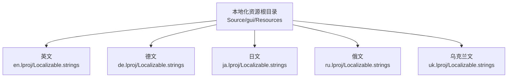
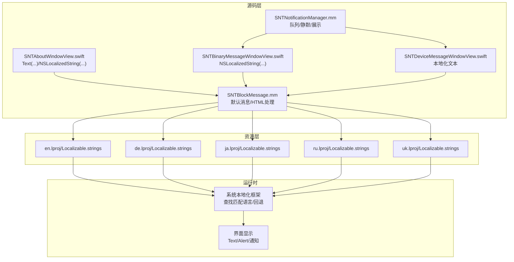
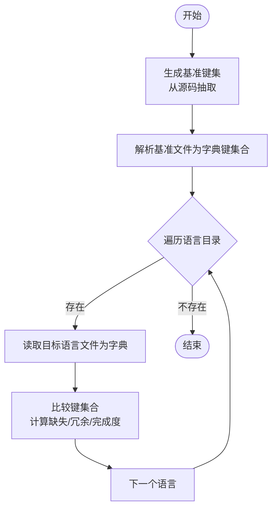
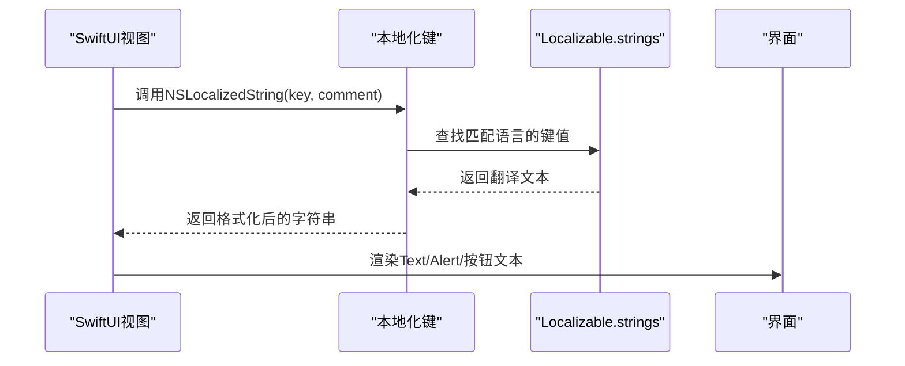
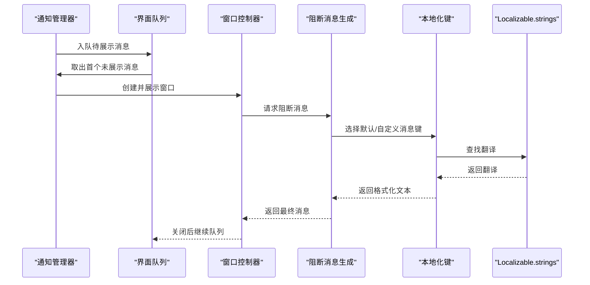
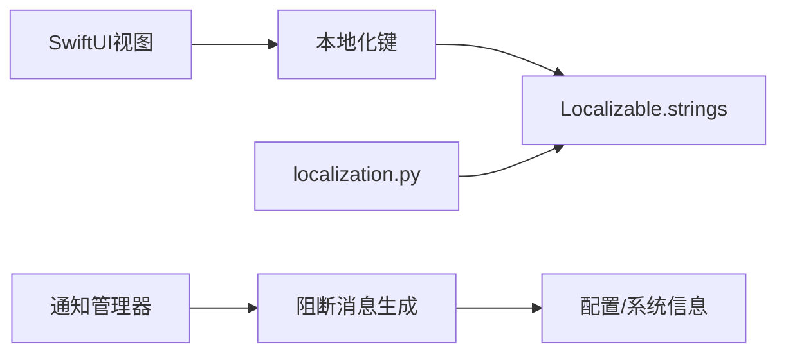

# 界面本地化

<cite>
**本文引用的文件**
- [Source/gui/Resources/de.lproj/Localizable.strings](file://Source/gui/Resources/de.lproj/Localizable.strings)
- [Source/gui/Resources/en.lproj/Localizable.strings](file://Source/gui/Resources/en.lproj/Localizable.strings)
- [Source/gui/Resources/ja.lproj/Localizable.strings](file://Source/gui/Resources/ja.lproj/Localizable.strings)
- [Source/gui/Resources/ru.lproj/Localizable.strings](file://Source/gui/Resources/ru.lproj/Localizable.strings)
- [Source/gui/Resources/uk.lproj/Localizable.strings](file://Source/gui/Resources/uk.lproj/Localizable.strings)
- [Testing/localization.py](file://Testing/localization.py)
- [Source/gui/SNTAboutWindowView.swift](file://Source/gui/SNTAboutWindowView.swift)
- [Source/gui/SNTBinaryMessageWindowView.swift](file://Source/gui/SNTBinaryMessageWindowView.swift)
- [Source/gui/SNTDeviceMessageWindowView.swift](file://Source/gui/SNTDeviceMessageWindowView.swift)
- [Source/gui/SNTNotificationManager.mm](file://Source/gui/SNTNotificationManager.mm)
- [Source/common/SNTBlockMessage.mm](file://Source/common/SNTBlockMessage.mm)
</cite>

## 目录
1. [简介](#简介)
2. [项目结构](#项目结构)
3. [核心组件](#核心组件)
4. [架构总览](#架构总览)
5. [详细组件分析](#详细组件分析)
6. [依赖关系分析](#依赖关系分析)
7. [性能考量](#性能考量)
8. [故障排查指南](#故障排查指南)
9. [结论](#结论)
10. [附录](#附录)

## 简介
本文件系统性梳理 Santa 的界面本地化体系，覆盖多语言支持机制、字符串资源管理、本地化文件组织、加载与回退策略、文本方向与排版、数字与日期时间格式化、语言切换与运行时行为、新增语言流程、质量保障与测试方法，以及最佳实践与常见问题。

## 项目结构
Santa 的界面本地化采用标准 macOS 本地化目录结构，资源位于 Source/gui/Resources 下，按语言分目录（如 en.lproj、de.lproj、ja.lproj、ru.lproj、uk.lproj），每个目录包含 Localizable.strings 文件，用于存储键值对形式的本地化字符串。

图表来源
- [Source/gui/Resources/en.lproj/Localizable.strings](file://Source/gui/Resources/en.lproj/Localizable.strings#L1-L180)
- [Source/gui/Resources/de.lproj/Localizable.strings](file://Source/gui/Resources/de.lproj/Localizable.strings#L1-L180)
- [Source/gui/Resources/ja.lproj/Localizable.strings](file://Source/gui/Resources/ja.lproj/Localizable.strings#L1-L180)
- [Source/gui/Resources/ru.lproj/Localizable.strings](file://Source/gui/Resources/ru.lproj/Localizable.strings#L1-L180)
- [Source/gui/Resources/uk.lproj/Localizable.strings](file://Source/gui/Resources/uk.lproj/Localizable.strings#L1-L180)

章节来源
- [Source/gui/Resources/en.lproj/Localizable.strings](file://Source/gui/Resources/en.lproj/Localizable.strings#L1-L180)
- [Source/gui/Resources/de.lproj/Localizable.strings](file://Source/gui/Resources/de.lproj/Localizable.strings#L1-L180)
- [Source/gui/Resources/ja.lproj/Localizable.strings](file://Source/gui/Resources/ja.lproj/Localizable.strings#L1-L180)
- [Source/gui/Resources/ru.lproj/Localizable.strings](file://Source/gui/Resources/ru.lproj/Localizable.strings#L1-L180)
- [Source/gui/Resources/uk.lproj/Localizable.strings](file://Source/gui/Resources/uk.lproj/Localizable.strings#L1-L180)

## 核心组件
- 字符串资源与键值管理：各语言的 Localizable.strings 文件以“键 = 值”形式维护，键名在 Swift/UI 层通过 NSLocalizedString 使用；值为对应语言的翻译文本。
- 生成与校验工具：Testing/localization.py 使用系统工具从源码抽取键并生成基准 Localizable.strings，随后与现有语言包对比，统计缺失与冗余键，确保翻译完整性。
- SwiftUI 视图层：SNTAboutWindowView.swift、SNTBinaryMessageWindowView.swift、SNTDeviceMessageWindowView.swift 等通过 Text(...) 和 NSLocalizedString(...) 使用本地化键。
- 通知与消息：SNTNotificationManager.mm 负责排队与展示阻断提示，并在需要时调用本地化键生成用户可见文本；SNTBlockMessage.mm 提供默认消息与 HTML 文本处理，配合本地化键输出最终消息。

章节来源
- [Testing/localization.py](file://Testing/localization.py#L1-L122)
- [Source/gui/SNTAboutWindowView.swift](file://Source/gui/SNTAboutWindowView.swift#L1-L262)
- [Source/gui/SNTBinaryMessageWindowView.swift](file://Source/gui/SNTBinaryMessageWindowView.swift#L1-L427)
- [Source/gui/SNTDeviceMessageWindowView.swift](file://Source/gui/SNTDeviceMessageWindowView.swift#L1-L70)
- [Source/gui/SNTNotificationManager.mm](file://Source/gui/SNTNotificationManager.mm#L1-L504)
- [Source/common/SNTBlockMessage.mm](file://Source/common/SNTBlockMessage.mm#L1-L292)

## 架构总览
下图展示从源码到本地化资源再到运行时显示的关键路径：

图表来源
- [Source/gui/SNTAboutWindowView.swift](file://Source/gui/SNTAboutWindowView.swift#L1-L262)
- [Source/gui/SNTBinaryMessageWindowView.swift](file://Source/gui/SNTBinaryMessageWindowView.swift#L1-L427)
- [Source/gui/SNTDeviceMessageWindowView.swift](file://Source/gui/SNTDeviceMessageWindowView.swift#L1-L70)
- [Source/gui/SNTNotificationManager.mm](file://Source/gui/SNTNotificationManager.mm#L1-L504)
- [Source/common/SNTBlockMessage.mm](file://Source/common/SNTBlockMessage.mm#L1-L292)
- [Source/gui/Resources/en.lproj/Localizable.strings](file://Source/gui/Resources/en.lproj/Localizable.strings#L1-L180)
- [Source/gui/Resources/de.lproj/Localizable.strings](file://Source/gui/Resources/de.lproj/Localizable.strings#L1-L180)
- [Source/gui/Resources/ja.lproj/Localizable.strings](file://Source/gui/Resources/ja.lproj/Localizable.strings#L1-L180)
- [Source/gui/Resources/ru.lproj/Localizable.strings](file://Source/gui/Resources/ru.lproj/Localizable.strings#L1-L180)
- [Source/gui/Resources/uk.lproj/Localizable.strings](file://Source/gui/Resources/uk.lproj/Localizable.strings#L1-L180)

## 详细组件分析

### 组件A：本地化键生成与完整性校验
- 键生成：脚本通过系统工具从 Swift 源与部分 Objective-C 源抽取本地化键，生成基准 Localizable.strings 并转换为 UTF-8。
- 完整性检查：遍历所有语言目录，读取 Localizable.strings，比较键集合，输出缺失与冗余键数量及完成度百分比，失败时退出码非零。
- 写回机制：支持将生成的基准写回 en.lproj/Localizable.strings，便于统一更新。

图表来源
- [Testing/localization.py](file://Testing/localization.py#L1-L122)

章节来源
- [Testing/localization.py](file://Testing/localization.py#L1-L122)

### 组件B：SwiftUI 视图中的本地化使用
- 关于窗口与版本信息：使用 NSLocalizedString 获取“版本”等键，支持富文本渲染与多行对齐。
- 阻断详情对话框：更多详情按钮、复制详情、关闭等使用本地化键。
- 同步按钮与错误提示：同步状态、网络错误、预检/事件上传/规则下载/后检失败、连接失败、未知错误等均来自本地化键。
- 授权执行：根据事件上下文选择不同格式化键，组合应用名称或签名标识。

图表来源
- [Source/gui/SNTAboutWindowView.swift](file://Source/gui/SNTAboutWindowView.swift#L1-L262)
- [Source/gui/SNTBinaryMessageWindowView.swift](file://Source/gui/SNTBinaryMessageWindowView.swift#L1-L427)

章节来源
- [Source/gui/SNTAboutWindowView.swift](file://Source/gui/SNTAboutWindowView.swift#L1-L262)
- [Source/gui/SNTBinaryMessageWindowView.swift](file://Source/gui/SNTBinaryMessageWindowView.swift#L1-L427)

### 组件C：通知与消息的本地化
- 通知队列与静默：SNTNotificationManager.mm 负责排队、去重、静默期判断与展示；静默期基于用户默认存储与消息哈希。
- 模式切换通知：根据当前模式（监控/锁定/独立）选择本地化键生成通知正文。
- 规则同步通知：根据已知/未知应用生成本地化键提示。
- 默认消息生成：SNTBlockMessage.mm 提供默认阻断消息与 HTML 处理，结合本地化键输出最终文本。

图表来源
- [Source/gui/SNTNotificationManager.mm](file://Source/gui/SNTNotificationManager.mm#L1-L504)
- [Source/common/SNTBlockMessage.mm](file://Source/common/SNTBlockMessage.mm#L1-L292)

章节来源
- [Source/gui/SNTNotificationManager.mm](file://Source/gui/SNTNotificationManager.mm#L1-L504)
- [Source/common/SNTBlockMessage.mm](file://Source/common/SNTBlockMessage.mm#L1-L292)

### 组件D：设备与网络挂载消息的本地化
- 设备挂载阻断：显示挂载点与是否需要重新挂载等信息，使用本地化键。
- 网络挂载阻断：显示网络共享挂载被阻止的信息，使用本地化键。

章节来源
- [Source/gui/SNTDeviceMessageWindowView.swift](file://Source/gui/SNTDeviceMessageWindowView.swift#L1-L70)

## 依赖关系分析
- 源码依赖：SwiftUI 视图直接依赖本地化键；通知管理器在展示前构造消息，依赖阻断消息生成模块；阻断消息生成模块依赖配置与系统信息。
- 资源依赖：运行时由系统本地化框架根据当前区域设置查找匹配语言，若无精确匹配则按回退策略选择可用翻译。
- 工具链依赖：localization.py 依赖系统工具进行键抽取、编码转换与 plist 解析。

图表来源
- [Source/gui/SNTAboutWindowView.swift](file://Source/gui/SNTAboutWindowView.swift#L1-L262)
- [Source/gui/SNTNotificationManager.mm](file://Source/gui/SNTNotificationManager.mm#L1-L504)
- [Source/common/SNTBlockMessage.mm](file://Source/common/SNTBlockMessage.mm#L1-L292)
- [Testing/localization.py](file://Testing/localization.py#L1-L122)

章节来源
- [Source/gui/SNTAboutWindowView.swift](file://Source/gui/SNTAboutWindowView.swift#L1-L262)
- [Source/gui/SNTNotificationManager.mm](file://Source/gui/SNTNotificationManager.mm#L1-L504)
- [Source/common/SNTBlockMessage.mm](file://Source/common/SNTBlockMessage.mm#L1-L292)
- [Testing/localization.py](file://Testing/localization.py#L1-L122)

## 性能考量
- 键生成与校验：localization.py 在本地执行，建议在 CI 中批量运行，避免在开发机上重复生成造成磁盘与 CPU 开销。
- 运行时查找：系统本地化框架对键查找具备缓存与高效匹配机制，通常无需额外优化。
- 界面渲染：大量文本渲染与富文本处理在 SwiftUI 中由系统优化，本地化键数量增加不会显著影响性能。

## 故障排查指南
- 翻译不完整
  - 现象：某语言缺少或多余键，导致界面显示占位或崩溃。
  - 排查：运行 localization.py，查看缺失与冗余键统计；修复对应语言的 Localizable.strings。
- 键冲突或重复
  - 现象：同一键在不同文件中出现，导致合并冲突。
  - 排查：统一键名，保持唯一性；使用脚本对比基准与现有语言包。
- 语言切换无效
  - 现象：切换系统语言后界面未更新。
  - 排查：确认应用打包包含所需 .lproj；重启应用或系统；检查 Bundle 本地化设置。
- HTML 消息渲染异常
  - 现象：富文本换行或样式不正确。
  - 排查：检查 SNTBlockMessage 的 HTML 处理逻辑与本地化键中的换行符；必要时调整模板。

章节来源
- [Testing/localization.py](file://Testing/localization.py#L1-L122)
- [Source/common/SNTBlockMessage.mm](file://Source/common/SNTBlockMessage.mm#L1-L292)

## 结论
Santa 的界面本地化体系以标准的 .lproj 与 Localizable.strings 为基础，结合 Swift 与 SwiftUI 的本地化 API，辅以自动化脚本进行键生成与完整性校验，形成从源码到资源再到运行时的闭环。通过明确的键命名规范、严格的校验流程与清晰的回退策略，能够稳定支撑多语言界面与通知展示。

## 附录

### 支持的语言列表
- 英语（en）
- 德语（de）
- 日语（ja）
- 俄语（ru）
- 乌克兰语（uk）

章节来源
- [Source/gui/Resources/en.lproj/Localizable.strings](file://Source/gui/Resources/en.lproj/Localizable.strings#L1-L180)
- [Source/gui/Resources/de.lproj/Localizable.strings](file://Source/gui/Resources/de.lproj/Localizable.strings#L1-L180)
- [Source/gui/Resources/ja.lproj/Localizable.strings](file://Source/gui/Resources/ja.lproj/Localizable.strings#L1-L180)
- [Source/gui/Resources/ru.lproj/Localizable.strings](file://Source/gui/Resources/ru.lproj/Localizable.strings#L1-L180)
- [Source/gui/Resources/uk.lproj/Localizable.strings](file://Source/gui/Resources/uk.lproj/Localizable.strings#L1-L180)

### 翻译文件格式与字符串键值管理
- 格式：UTF-8 编码的键值对文件，键与值之间以等号分隔，注释以斜杠加星号开头。
- 键命名：遵循语义化命名，配合 comment 便于翻译人员理解上下文。
- 更新流程：通过 localization.py 抽取键并生成基准，再与现有语言包对比，修复缺失与冗余键。

章节来源
- [Testing/localization.py](file://Testing/localization.py#L1-L122)
- [Source/gui/Resources/en.lproj/Localizable.strings](file://Source/gui/Resources/en.lproj/Localizable.strings#L1-L180)

### 本地化资源加载机制与回退策略
- 加载机制：运行时由系统本地化框架根据当前区域设置查找匹配语言；若无精确匹配，则按系统回退策略选择可用翻译。
- 回退顺序：通常优先选择语言-地区（如 zh-Hans-CN），其次语言（如 zh-Hans），最后英语（en）作为兜底。

[本节为通用机制说明，不直接分析具体文件，故无章节来源]

### 文本方向处理、数字格式化与日期时间本地化
- 文本方向：SwiftUI 与系统框架会依据语言自动选择从左到右或从右到左布局。
- 数字格式化：数值显示遵循系统区域设置；涉及百分比、计数等场景，建议使用系统提供的 NumberFormatter。
- 日期时间：使用系统 DateFormatter，自动适配本地化日期/时间格式。

[本节为通用机制说明，不直接分析具体文件，故无章节来源]

### 新语言添加流程
- 新增目录：在 Source/gui/Resources 下创建 {lang}.lproj 目录。
- 生成基准：运行 localization.py，将生成的基准写入 en.lproj/Localizable.strings。
- 翻译文件：将基准文件复制到新语言目录并逐条翻译。
- 校验：再次运行 localization.py，确保键集合一致。
- 验证：构建并运行应用，验证界面文本与通知显示正常。

章节来源
- [Testing/localization.py](file://Testing/localization.py#L1-L122)
- [Source/gui/Resources/en.lproj/Localizable.strings](file://Source/gui/Resources/en.lproj/Localizable.strings#L1-L180)

### 翻译质量保证与本地化测试方法
- 质量保证：使用 localization.py 对比键集合，确保覆盖率与一致性；鼓励在 PR 中附带翻译完整性报告。
- 测试方法：在不同语言环境下运行界面与通知，核对关键文案；对富文本与换行进行专项测试；对模式切换与同步失败等场景进行端到端验证。

章节来源
- [Testing/localization.py](file://Testing/localization.py#L1-L122)
- [Source/gui/SNTAboutWindowView.swift](file://Source/gui/SNTAboutWindowView.swift#L1-L262)
- [Source/gui/SNTNotificationManager.mm](file://Source/gui/SNTNotificationManager.mm#L1-L504)

### 最佳实践
- 键命名：语义化、唯一且可复用；为复杂文案提供 comment 说明上下文。
- 富文本：在本地化键中保留必要的换行与标签，交由 SNTBlockMessage 处理 HTML。
- 静默与去重：利用通知管理器的静默与去重机制，减少重复提示。
- 自动化：将 localization.py 集成至 CI，持续监控翻译完整性。

章节来源
- [Source/common/SNTBlockMessage.mm](file://Source/common/SNTBlockMessage.mm#L1-L292)
- [Source/gui/SNTNotificationManager.mm](file://Source/gui/SNTNotificationManager.mm#L1-L504)
- [Testing/localization.py](file://Testing/localization.py#L1-L122)