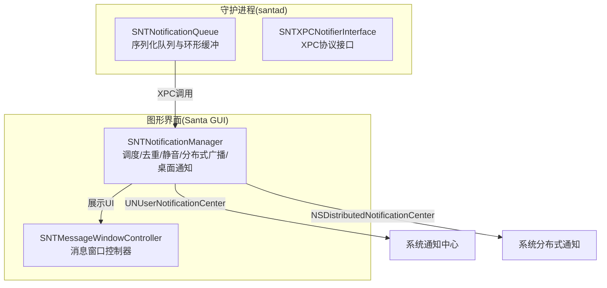
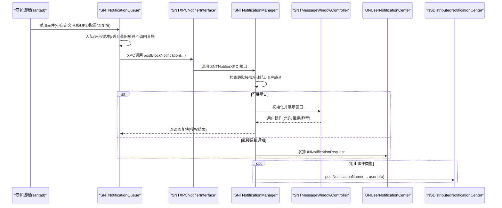
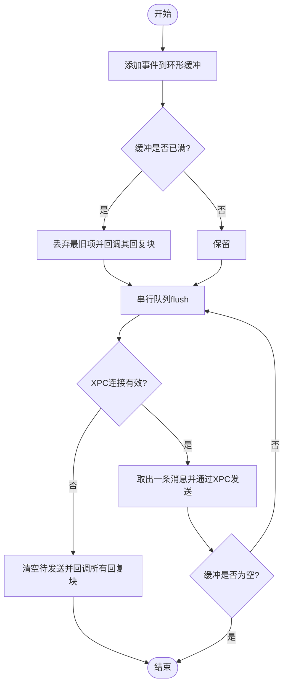
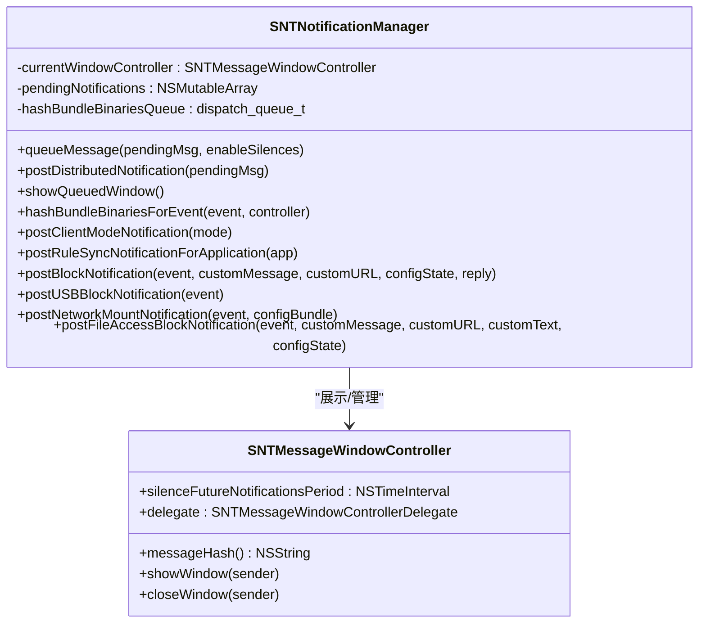
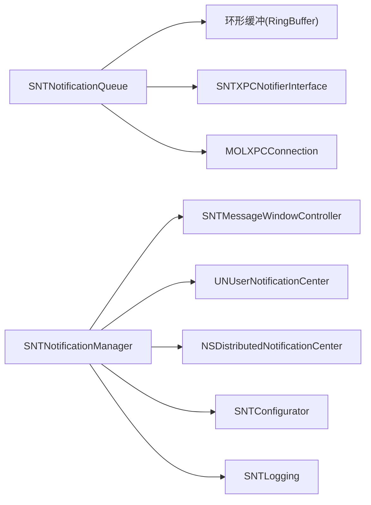

# 通知系统

<cite>
**本文引用的文件**
- [SNTNotificationManager.h](file://Source/gui/SNTNotificationManager.h)
- [SNTNotificationManager.mm](file://Source/gui/SNTNotificationManager.mm)
- [SNTNotificationQueue.h](file://Source/santad/SNTNotificationQueue.h)
- [SNTNotificationQueue.mm](file://Source/santad/SNTNotificationQueue.mm)
- [SNTXPCNotifierInterface.h](file://Source/common/SNTXPCNotifierInterface.h)
- [SNTXPCNotifierInterface.mm](file://Source/common/SNTXPCNotifierInterface.mm)
- [SNTMessageWindowController.h](file://Source/gui/SNTMessageWindowController.h)
- [SNTConfigurator.h](file://Source/common/SNTConfigurator.h)
- [SNTConfigurator.mm](file://Source/common/SNTConfigurator.mm)
- [SNTLogging.h](file://Source/common/SNTLogging.h)
</cite>

## 目录
1. [简介](#简介)
2. [项目结构](#项目结构)
3. [核心组件](#核心组件)
4. [架构总览](#架构总览)
5. [详细组件分析](#详细组件分析)
6. [依赖关系分析](#依赖关系分析)
7. [性能考量](#性能考量)
8. [故障排查指南](#故障排查指南)
9. [结论](#结论)
10. [附录](#附录)

## 简介
本文件面向Santa的“通知系统”，聚焦于SNTNotificationManager的通知调度机制、通知队列管理、用户交互流程与权限控制。文档将详细说明不同通知类型（二进制执行阻止、文件访问阻止、USB挂载阻止、网络挂载阻止、客户端模式切换、规则同步完成）的触发条件、显示时机与用户响应处理；解释通知权限管理、系统通知中心集成与桌面通知显示；阐述通知优先级排序、重复通知过滤与通知历史管理；并提供通知自定义配置、样式定制与用户体验优化建议，以及调试方法与常见问题解决方案。

## 项目结构
通知系统由两部分组成：
- 守护进程侧（santad）：负责事件收集与排队，通过XPC向GUI发送通知请求，并在连接失效时清理待处理回复块。
- 图形界面侧（Santa GUI）：负责接收通知请求、入队去重、展示窗口、更新静音状态、与系统UNUserNotificationCenter集成进行桌面通知。

图表来源
- [SNTNotificationQueue.mm](file://Source/santad/SNTNotificationQueue.mm#L1-L187)
- [SNTNotificationManager.mm](file://Source/gui/SNTNotificationManager.mm#L1-L504)
- [SNTXPCNotifierInterface.h](file://Source/common/SNTXPCNotifierInterface.h#L1-L57)

章节来源
- [SNTNotificationQueue.h](file://Source/santad/SNTNotificationQueue.h#L1-L47)
- [SNTNotificationQueue.mm](file://Source/santad/SNTNotificationQueue.mm#L1-L187)
- [SNTNotificationManager.h](file://Source/gui/SNTNotificationManager.h#L1-L30)
- [SNTNotificationManager.mm](file://Source/gui/SNTNotificationManager.mm#L1-L504)
- [SNTXPCNotifierInterface.h](file://Source/common/SNTXPCNotifierInterface.h#L1-L57)
- [SNTXPCNotifierInterface.mm](file://Source/common/SNTXPCNotifierInterface.mm#L1-L24)

## 核心组件
- SNTNotificationQueue：守护进程侧通知队列，使用环形缓冲存储待发送通知，串行队列保证顺序，连接失效或满载时丢弃最旧项并回调回复块，确保资源回收。
- SNTNotificationManager：GUI侧通知管理器，负责：
  - 将通知入队并去重（按消息哈希）
  - 处理用户静音（基于NSUserDefaults键值）
  - 分发系统范围分布式通知（用于企业工具监听）
  - 展示阻断事件UI（二进制、文件访问、USB、网络挂载）
  - 与UNUserNotificationCenter集成，推送客户端模式切换与规则同步完成等系统通知
  - 与SNTMessageWindowController交互，处理窗口关闭与静音期设置
- SNTMessageWindowController：消息窗口控制器，生成消息哈希用于静音过滤，暴露委托以回传静音期与间隔。
- SNTXPCNotifierInterface：SNTNotifierXPC协议的XPC接口封装，供santad调用GUI端通知API。
- SNTConfigurator：全局配置读取器，提供静默模式、通知静音开关、客户端模式切换通知文案、事件详情链接等配置项。

章节来源
- [SNTNotificationQueue.mm](file://Source/santad/SNTNotificationQueue.mm#L1-L187)
- [SNTNotificationManager.mm](file://Source/gui/SNTNotificationManager.mm#L1-L504)
- [SNTMessageWindowController.h](file://Source/gui/SNTMessageWindowController.h#L1-L43)
- [SNTXPCNotifierInterface.h](file://Source/common/SNTXPCNotifierInterface.h#L1-L57)
- [SNTConfigurator.h](file://Source/common/SNTConfigurator.h#L1-L961)
- [SNTConfigurator.mm](file://Source/common/SNTConfigurator.mm#L1-L800)

## 架构总览
通知从santad产生，经SNTNotificationQueue排队后通过XPC发送到GUI的SNTNotificationManager。GUI根据配置与静音策略决定是否展示UI或直接分发系统通知；同时，针对特定事件类型（二进制执行阻止、文件访问阻止）还会通过NSDistributedNotificationCenter广播系统范围通知，便于外部工具订阅。

图表来源
- [SNTNotificationQueue.mm](file://Source/santad/SNTNotificationQueue.mm#L50-L181)
- [SNTNotificationManager.mm](file://Source/gui/SNTNotificationManager.mm#L103-L224)
- [SNTNotificationManager.mm](file://Source/gui/SNTNotificationManager.mm#L323-L401)
- [SNTNotificationManager.mm](file://Source/gui/SNTNotificationManager.mm#L149-L224)

## 详细组件分析

### 组件A：SNTNotificationQueue（守护进程通知队列）
职责与行为
- 使用std::unique_ptr包裹的环形缓冲保存待发送通知字典，包含事件对象、自定义消息、URL、配置状态与回复块。
- 串行队列保证入队与出队顺序，避免并发竞争。
- 当缓冲满载时，丢弃最旧通知并调用其回复块，确保资源及时释放。
- 连接建立后自动flush队列，逐条通过XPC转发给GUI；连接失效时清空待发送列表并回调所有回复块。
- 对缺失回复块的情况进行兜底包装，保证后续不会出现空回调。

复杂度与性能
- 入队/出队均为O(1)，环形缓冲容量固定，内存占用稳定。
- 串行队列避免锁争用，适合高并发事件场景。

错误处理
- 连接无效时清空并回调，防止悬挂回调导致泄漏。
- 丢弃最旧项时记录日志，便于审计。

图表来源
- [SNTNotificationQueue.mm](file://Source/santad/SNTNotificationQueue.mm#L50-L181)

章节来源
- [SNTNotificationQueue.h](file://Source/santad/SNTNotificationQueue.h#L1-L47)
- [SNTNotificationQueue.mm](file://Source/santad/SNTNotificationQueue.mm#L1-L187)

### 组件B：SNTNotificationManager（GUI通知管理器）
职责与行为
- 队列管理：维护当前展示窗口与待处理队列，仅允许一个窗口展示；新到来的通知先入队，再在空闲时弹出。
- 去重与静音：
  - 按消息哈希检查是否已在队列中，避免重复UI。
  - 若启用通知静音且用户设置了静音期，则在静音期内丢弃该哈希对应的通知。
  - 支持用户在UI中选择“未来一段时间内静音”，写入NSUserDefaults键值并按到期清理。
- 分布式通知：对二进制执行阻止与文件访问阻止两类事件，通过NSDistributedNotificationCenter广播系统范围通知，携带关键事件信息，供企业工具订阅。
- 桌头通知：通过UNUserNotificationCenter推送客户端模式切换与规则同步完成等系统通知。
- UI展示：根据事件类型初始化对应的SNTMessageWindowController，必要时异步计算捆绑包哈希并更新UI进度与按钮可用性。
- XPC协议实现：实现SNTNotifierXPC协议，供santad调用；实现SNTBundleServiceProgressXPC协议，接收捆绑包扫描进度。

图表来源
- [SNTNotificationManager.h](file://Source/gui/SNTNotificationManager.h#L1-L30)
- [SNTNotificationManager.mm](file://Source/gui/SNTNotificationManager.mm#L1-L504)
- [SNTMessageWindowController.h](file://Source/gui/SNTMessageWindowController.h#L1-L43)

章节来源
- [SNTNotificationManager.mm](file://Source/gui/SNTNotificationManager.mm#L1-L504)
- [SNTMessageWindowController.h](file://Source/gui/SNTMessageWindowController.h#L1-L43)

### 组件C：SNTXPCNotifierInterface（XPC接口）
职责与行为
- 提供SNTNotifierXPC协议的NSXPCInterface，确保方法参数中的自定义类被正确注册，使santad可通过XPC调用GUI端通知API。

章节来源
- [SNTXPCNotifierInterface.h](file://Source/common/SNTXPCNotifierInterface.h#L1-L57)
- [SNTXPCNotifierInterface.mm](file://Source/common/SNTXPCNotifierInterface.mm#L1-L24)

### 组件D：SNTConfigurator（配置）
职责与行为
- 提供通知相关配置项：
  - enableSilentMode：全局静默模式，禁用GUI阻断通知展示。
  - enableNotificationSilences：允许用户在UI中设置短期静音。
  - modeNotificationMonitor/Lockdown/Standalone：客户端模式切换时的自定义通知文案。
  - eventDetailURL/eventDetailText：事件详情按钮文本与URL格式串。
  - 关于文本、更多链接、按钮文本等UI文案。
- 通过NSUserDefaults读取配置，支持KVO监听变化。

章节来源
- [SNTConfigurator.h](file://Source/common/SNTConfigurator.h#L1-L961)
- [SNTConfigurator.mm](file://Source/common/SNTConfigurator.mm#L1-L800)

## 依赖关系分析
- SNTNotificationQueue依赖：
  - 环形缓冲（RingBuffer）作为底层存储
  - MOLXPCConnection作为XPC通道
  - SNTXPCNotifierInterface提供的协议接口
- SNTNotificationManager依赖：
  - SNTMessageWindowController展示UI
  - UNUserNotificationCenter推送系统通知
  - NSDistributedNotificationCenter广播系统范围通知
  - SNTConfigurator读取配置
  - SNTLogging输出日志

图表来源
- [SNTNotificationQueue.mm](file://Source/santad/SNTNotificationQueue.mm#L1-L187)
- [SNTNotificationManager.mm](file://Source/gui/SNTNotificationManager.mm#L1-L504)
- [SNTConfigurator.h](file://Source/common/SNTConfigurator.h#L1-L961)
- [SNTLogging.h](file://Source/common/SNTLogging.h#L1-L68)

章节来源
- [SNTNotificationQueue.mm](file://Source/santad/SNTNotificationQueue.mm#L1-L187)
- [SNTNotificationManager.mm](file://Source/gui/SNTNotificationManager.mm#L1-L504)
- [SNTConfigurator.h](file://Source/common/SNTConfigurator.h#L1-L961)
- [SNTLogging.h](file://Source/common/SNTLogging.h#L1-L68)

## 性能考量
- 队列与去重：使用消息哈希快速判断重复，避免UI抖动与资源浪费。
- 串行队列：简化并发控制，降低锁开销。
- 环形缓冲：固定容量，内存占用可控，满载时丢弃最旧项，保障实时性。
- 异步捆绑包哈希：在专用串行队列中进行，避免阻塞UI主线程；超时则回退显示基础阻断事件。
- 日志：使用OS_LOG，避免频繁I/O影响性能。

## 故障排查指南
常见问题与定位
- 通知不显示
  - 检查全局静默模式是否开启（enableSilentMode）。
  - 检查用户静音设置（NSUserDefaults键值），确认静音期是否生效。
  - 查看日志输出，确认XPC连接是否有效。
- 重复通知
  - 确认消息哈希生成逻辑一致，避免同一事件被多次入队。
- 桌头通知未出现
  - 确认UNUserNotificationCenter权限已授予。
  - 检查客户端模式切换与规则同步通知的自定义文案是否为空字符串导致禁用。
- 分布式通知未被订阅
  - 确认事件类型为二进制执行阻止或文件访问阻止。
  - 检查系统范围通知名称与userInfo字段是否正确。
- 捆绑包哈希耗时过长
  - 观察超时路径日志，确认连接到捆绑包服务是否成功。
  - 调整UI进度显示，避免长时间无反馈。

章节来源
- [SNTNotificationManager.mm](file://Source/gui/SNTNotificationManager.mm#L103-L147)
- [SNTNotificationManager.mm](file://Source/gui/SNTNotificationManager.mm#L323-L401)
- [SNTNotificationManager.mm](file://Source/gui/SNTNotificationManager.mm#L250-L321)
- [SNTLogging.h](file://Source/common/SNTLogging.h#L1-L68)

## 结论
Santa的通知系统通过守护进程与GUI的清晰分工实现了高可靠、可扩展的通知调度与展示。队列采用环形缓冲与串行化处理，结合消息哈希去重与用户静音策略，兼顾了性能与用户体验。系统通知中心与分布式通知的双重集成，既满足终端用户即时反馈，又为上层管理工具提供了可观测性。配置中心统一管理通知文案与行为开关，便于企业级定制。

## 附录

### 通知类型与触发条件
- 二进制执行阻止
  - 触发：santad检测到阻止的二进制执行事件。
  - 显示：若未静默且未重复，展示阻断UI；同时广播系统范围通知。
- 文件访问阻止
  - 触发：文件访问策略违规。
  - 显示：若未静默且未重复，展示阻断UI；同时广播系统范围通知。
- USB挂载阻止
  - 触发：BlockUSBMount启用且设备挂载被阻止。
  - 显示：展示阻断UI。
- 网络挂载阻止
  - 触发：BlockNetworkMount启用且网络共享挂载被阻止。
  - 显示：展示阻断UI。
- 客户端模式切换
  - 触发：客户端模式从Monitor/Lockdown/Standalone切换。
  - 显示：系统通知（UNUserNotificationCenter）。
- 规则同步完成
  - 触发：已知应用被解封，规则同步完成。
  - 显示：系统通知（UNUserNotificationCenter）。

章节来源
- [SNTNotificationManager.mm](file://Source/gui/SNTNotificationManager.mm#L403-L466)
- [SNTNotificationManager.mm](file://Source/gui/SNTNotificationManager.mm#L323-L401)
- [SNTNotificationManager.mm](file://Source/gui/SNTNotificationManager.mm#L149-L224)

### 通知优先级与重复过滤
- 优先级：当前实现未显式设置优先级，但通过串行队列与去重保证了“最近一次有效通知优先展示”。
- 重复过滤：基于消息哈希去重，避免同一事件多次弹窗。

章节来源
- [SNTNotificationManager.mm](file://Source/gui/SNTNotificationManager.mm#L96-L147)

### 通知历史管理
- 历史：未见持久化的“历史列表”实现；静音期通过NSUserDefaults键值管理，到期自动清理。
- 建议：如需历史，可在NSUserDefaults中增加结构化存储与定期清理策略。

章节来源
- [SNTNotificationManager.mm](file://Source/gui/SNTNotificationManager.mm#L84-L94)

### 权限管理与系统通知中心集成
- 权限：需要UNUserNotificationCenter权限以推送系统通知。
- 集成：通过UNMutableNotificationContent与UNNotificationRequest完成推送。
- 分布式通知：通过NSDistributedNotificationCenter广播，供其他进程订阅。

章节来源
- [SNTNotificationManager.mm](file://Source/gui/SNTNotificationManager.mm#L323-L401)
- [SNTNotificationManager.mm](file://Source/gui/SNTNotificationManager.mm#L149-L224)

### 自定义配置与样式定制
- 文案与链接：通过SNTConfigurator的多处配置项定制UI文案与“查看详情”按钮。
- 静音开关：enableNotificationSilences控制是否允许用户静音。
- 静默模式：enableSilentMode全局禁用GUI通知展示。
- 样式：字体与节日主题等可通过配置项控制。

章节来源
- [SNTConfigurator.h](file://Source/common/SNTConfigurator.h#L1-L961)
- [SNTConfigurator.mm](file://Source/common/SNTConfigurator.mm#L1-L800)

### 用户体验优化建议
- 减少重复弹窗：确保消息哈希稳定，避免同一事件被多次入队。
- 异步处理：捆绑包哈希在后台队列进行，UI保持流畅。
- 清晰提示：系统通知与UI提示互补，避免信息冗余。
- 静音期合理：提供多种静音时长选项，避免误操作。

章节来源
- [SNTNotificationManager.mm](file://Source/gui/SNTNotificationManager.mm#L250-L321)
- [SNTNotificationManager.mm](file://Source/gui/SNTNotificationManager.mm#L103-L147)