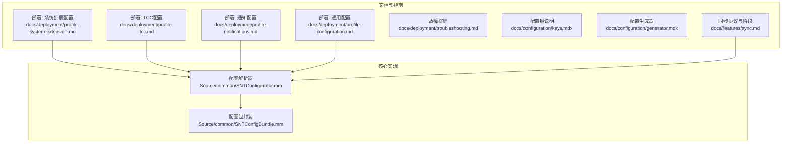
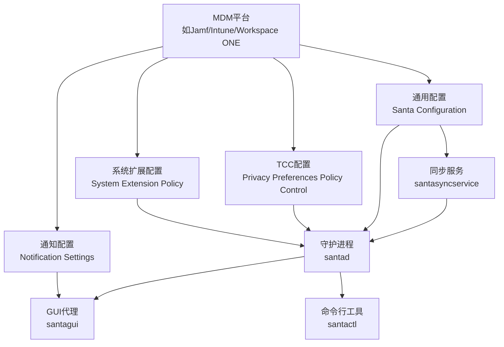
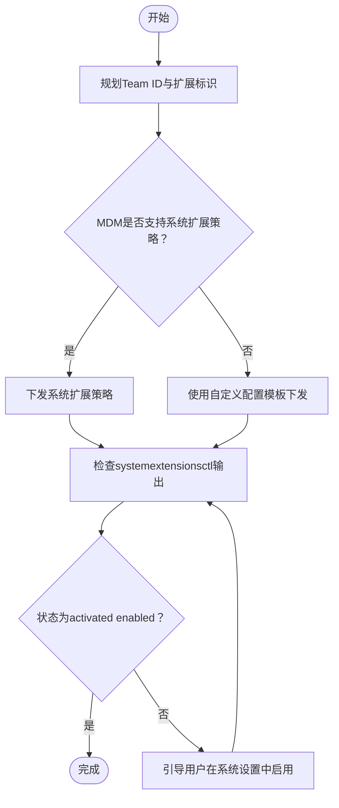
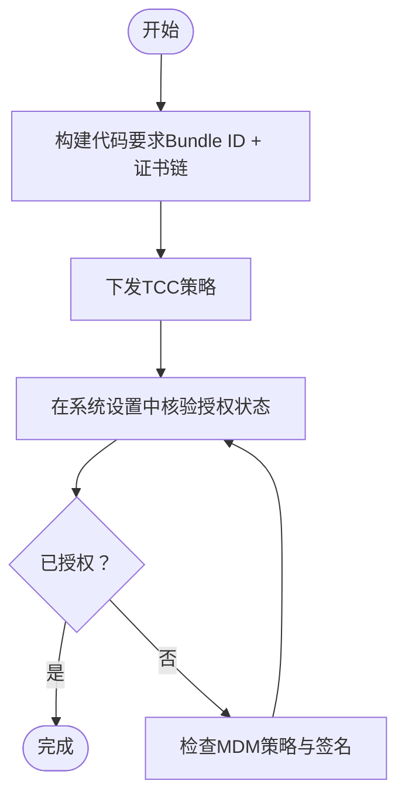
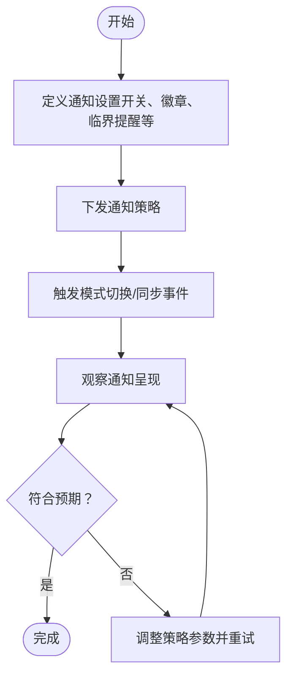
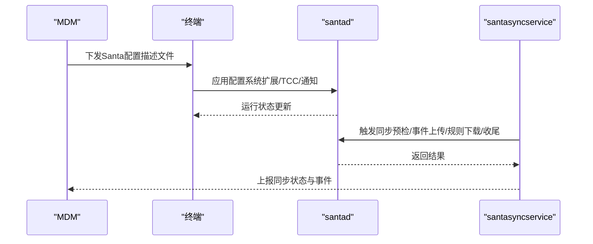
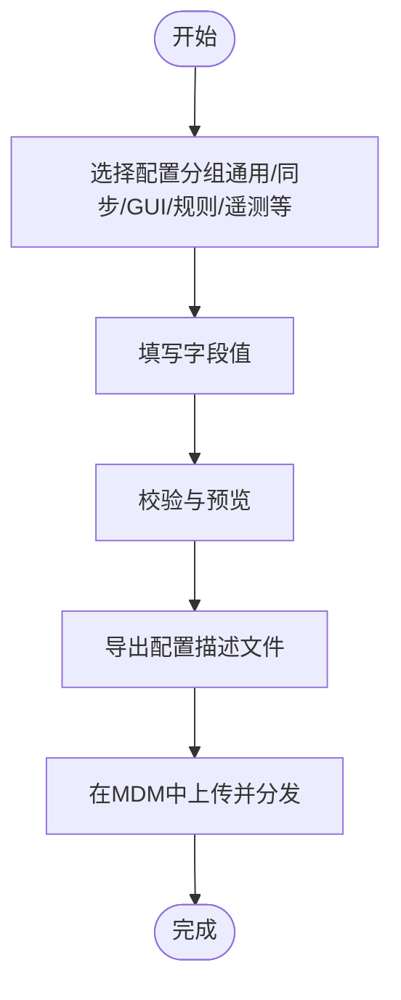
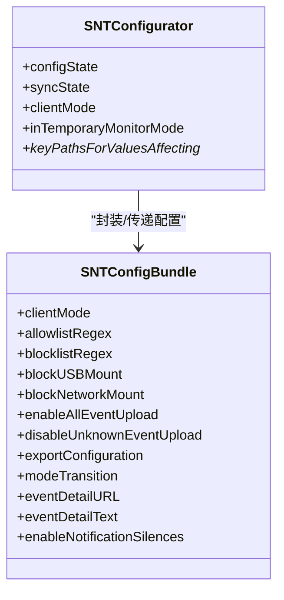
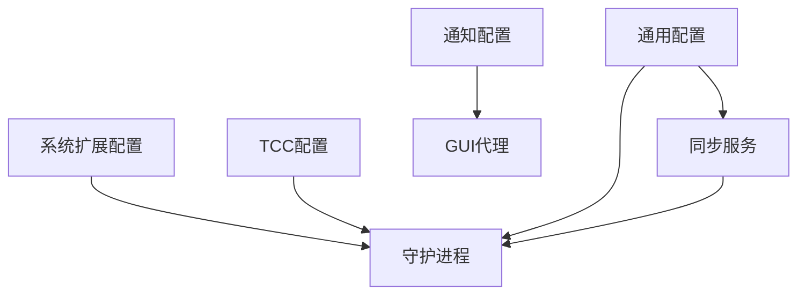

# MDM集成

<cite>
**本文引用的文件**
- [README.md](file://README.md)
- [docs/docs/deployment/profile-system-extension.md](file://docs/docs/deployment/profile-system-extension.md)
- [docs/docs/deployment/profile-tcc.md](file://docs/docs/deployment/profile-tcc.md)
- [docs/docs/deployment/profile-notifications.md](file://docs/docs/deployment/profile-notifications.md)
- [docs/docs/deployment/profile-configuration.md](file://docs/docs/deployment/profile-configuration.md)
- [docs/docs/deployment/troubleshooting.md](file://docs/docs/deployment/troubleshooting.md)
- [docs/docs/configuration/generator.mdx](file://docs/docs/configuration/generator.mdx)
- [docs/docs/configuration/keys.mdx](file://docs/docs/configuration/keys.mdx)
- [docs/docs/features/sync.md](file://docs/docs/features/sync.md)
- [Source/common/SNTConfigurator.mm](file://Source/common/SNTConfigurator.mm)
- [Source/common/SNTConfigBundle.mm](file://Source/common/SNTConfigBundle.mm)
</cite>

## 目录
1. [简介](#简介)
2. [项目结构](#项目结构)
3. [核心组件](#核心组件)
4. [架构总览](#架构总览)
5. [详细组件分析](#详细组件分析)
6. [依赖关系分析](#依赖关系分析)
7. [性能考量](#性能考量)
8. [故障排除指南](#故障排除指南)
9. [结论](#结论)
10. [附录](#附录)

## 简介
本指南面向在企业环境中通过MDM（移动设备管理）大规模部署Santa的工程与安全团队，目标是帮助您完成以下任务：
- 与主流MDM方案（如Jamf Pro、Microsoft Intune、VMware Workspace ONE等）的集成配置
- 创建、分发与管理配置描述文件（系统扩展、TCC、通知、通用配置）
- 自动化系统扩展权限、TCC权限与通知权限
- 使用配置生成器与自定义模板进行策略下发
- 实施批量配置推送、条件配置与动态配置策略
- 配置监控、报告与故障排除
- 提供集成验证步骤与最佳实践

Santa是一个基于系统扩展的macOS二进制授权与事件记录系统，由系统扩展、GUI代理、后台同步服务与命令行工具组成。其核心能力包括模式切换（监控/锁定/独立）、规则匹配（签名/路径/静态规则）、事件上传与遥测导出等。通过MDM下发配置描述文件，可实现对这些能力的集中控制与自动化运维。

章节来源
- file://README.md#L1-L152

## 项目结构
围绕MDM集成的关键文档与代码主要分布在以下位置：
- 文档：docs/docs/deployment 与 docs/docs/configuration、docs/docs/features 下的部署与配置说明
- 核心配置解析与状态管理：Source/common/SNTConfigurator.mm、Source/common/SNTConfigBundle.mm
- 同步协议与阶段：docs/docs/features/sync.md

图表来源
- [docs/docs/deployment/profile-system-extension.md](file://docs/docs/deployment/profile-system-extension.md#L1-L121)
- [docs/docs/deployment/profile-tcc.md](file://docs/docs/deployment/profile-tcc.md#L1-L141)
- [docs/docs/deployment/profile-notifications.md](file://docs/docs/deployment/profile-notifications.md#L1-L111)
- [docs/docs/deployment/profile-configuration.md](file://docs/docs/deployment/profile-configuration.md#L1-L118)
- [docs/docs/deployment/troubleshooting.md](file://docs/docs/deployment/troubleshooting.md#L1-L116)
- [docs/docs/configuration/keys.mdx](file://docs/docs/configuration/keys.mdx#L1-L72)
- [docs/docs/configuration/generator.mdx](file://docs/docs/configuration/generator.mdx#L1-L85)
- [docs/docs/features/sync.md](file://docs/docs/features/sync.md#L1-L170)
- [Source/common/SNTConfigurator.mm](file://Source/common/SNTConfigurator.mm#L1-L200)
- [Source/common/SNTConfigBundle.mm](file://Source/common/SNTConfigBundle.mm#L1-L120)

章节来源
- file://docs/docs/deployment/profile-system-extension.md#L1-L121
- file://docs/docs/deployment/profile-tcc.md#L1-L141
- file://docs/docs/deployment/profile-notifications.md#L1-L111
- file://docs/docs/deployment/profile-configuration.md#L1-L118
- file://docs/docs/deployment/troubleshooting.md#L1-L116
- file://docs/docs/configuration/keys.mdx#L1-L72
- file://docs/docs/configuration/generator.mdx#L1-L85
- file://docs/docs/features/sync.md#L1-L170
- file://Source/common/SNTConfigurator.mm#L1-L200
- file://Source/common/SNTConfigBundle.mm#L1-L120

## 核心组件
- 系统扩展配置（System Extension Policy）
  - 通过MDM下发“系统扩展”描述文件，允许指定Team ID与扩展类型（如Endpoint Security Extensions），并可设置不可移除选项以增强强制性。
- TCC配置（透明、同意与控制）
  - 通过隐私偏好配置文件授予Santa相关进程（如守护进程与包服务）全盘访问权限，确保系统扩展能正常执行授权决策。
- 通知配置（Notifications Settings）
  - 通过通知设置描述文件控制Santa应用的通知开关、徽章、临界提醒、锁屏显示等行为。
- 通用配置（Santa Configuration）
  - 通过自定义配置描述文件下发Santa运行参数、客户端模式、规则、事件上传策略、遥测与指标导出等。
- 配置生成器与键值说明
  - 在线生成器支持按组选择键值并导出配置；键说明文档提供所有可用键的分类与版本信息。
- 同步服务与协议
  - 通过同步服务周期性触发预检、事件上传、规则下载与收尾阶段，支持增量规则与失败重试机制。

章节来源
- file://docs/docs/deployment/profile-system-extension.md#L1-L121
- file://docs/docs/deployment/profile-tcc.md#L1-L141
- file://docs/docs/deployment/profile-notifications.md#L1-L111
- file://docs/docs/deployment/profile-configuration.md#L1-L118
- file://docs/docs/configuration/generator.mdx#L1-L85
- file://docs/docs/configuration/keys.mdx#L1-L72
- file://docs/docs/features/sync.md#L1-L170

## 架构总览
下图展示了通过MDM下发配置到终端后，Santa各组件之间的交互关系与职责划分。

图表来源
- [docs/docs/deployment/profile-system-extension.md](file://docs/docs/deployment/profile-system-extension.md#L1-L121)
- [docs/docs/deployment/profile-tcc.md](file://docs/docs/deployment/profile-tcc.md#L1-L141)
- [docs/docs/deployment/profile-notifications.md](file://docs/docs/deployment/profile-notifications.md#L1-L111)
- [docs/docs/deployment/profile-configuration.md](file://docs/docs/deployment/profile-configuration.md#L1-L118)
- [docs/docs/features/sync.md](file://docs/docs/features/sync.md#L1-L170)

## 详细组件分析

### 组件A：系统扩展权限（System Extension）
- 目标
  - 通过MDM自动批准Santa系统扩展加载，避免用户手动干预。
- 关键点
  - Team ID与扩展标识需与实际签名一致
  - 建议优先允许“特定系统扩展”，而非仅允许扩展类型
  - 可启用“不可移除”以防止用户或脚本绕过
- MDM适配要点
  - Jamf：使用“系统扩展”描述文件或自定义配置
  - Intune：使用“系统扩展策略”或自定义配置
  - Workspace ONE：使用“系统扩展”策略或自定义配置
- 验证步骤
  - 检查系统扩展状态与版本
  - 如处于“等待用户批准”，引导用户在系统设置中启用

图表来源
- [docs/docs/deployment/profile-system-extension.md](file://docs/docs/deployment/profile-system-extension.md#L1-L121)
- [docs/docs/deployment/troubleshooting.md](file://docs/docs/deployment/troubleshooting.md#L46-L76)

章节来源
- file://docs/docs/deployment/profile-system-extension.md#L1-L121
- file://docs/docs/deployment/troubleshooting.md#L46-L76

### 组件B：TCC权限（全盘访问）
- 目标
  - 自动授予Santa守护进程与包服务全盘访问权限，避免启动时弹窗。
- 关键点
  - 使用Bundle ID与代码要求（Code Requirement）精确匹配
  - 权限服务通常为“SystemPolicyAllFiles”或“Full-disk Access”
- MDM适配要点
  - Jamf：隐私偏好配置文件
  - Intune：隐私偏好策略
  - Workspace ONE：隐私偏好策略
- 验证步骤
  - 在系统设置中确认已授权
  - 若未授权，重新检查MDM策略与签名一致性

图表来源
- [docs/docs/deployment/profile-tcc.md](file://docs/docs/deployment/profile-tcc.md#L1-L141)

章节来源
- file://docs/docs/deployment/profile-tcc.md#L1-L141

### 组件C：通知权限（Notifications Settings）
- 目标
  - 控制Santa在模式切换或同步事件发生时向用户推送原生通知的行为。
- 关键点
  - Bundle ID为Santa应用标识
  - 可配置通知开关、徽章、临界提醒、锁屏显示等
- MDM适配要点
  - Jamf：通知设置策略
  - Intune：通知策略
  - Workspace ONE：通知策略
- 验证步骤
  - 触发模式切换或同步事件，观察通知呈现情况

图表来源
- [docs/docs/deployment/profile-notifications.md](file://docs/docs/deployment/profile-notifications.md#L1-L111)

章节来源
- file://docs/docs/deployment/profile-notifications.md#L1-L111

### 组件D：通用配置（Santa Configuration）
- 目标
  - 通过MDM下发Santa的运行参数、客户端模式、规则、事件上传策略、遥测与指标导出等。
- 关键点
  - 使用“自定义配置描述文件”形式
  - 可通过配置生成器在线生成并导出
  - 键值说明文档提供完整字段清单与版本信息
- MDM适配要点
  - Jamf：自定义配置描述文件
  - Intune：自定义配置描述文件
  - Workspace ONE：自定义配置描述文件
- 验证步骤
  - 使用santactl status与doctor命令检查运行状态与配置有效性

图表来源
- [docs/docs/deployment/profile-configuration.md](file://docs/docs/deployment/profile-configuration.md#L1-L118)
- [docs/docs/features/sync.md](file://docs/docs/features/sync.md#L1-L170)

章节来源
- file://docs/docs/deployment/profile-configuration.md#L1-L118
- file://docs/docs/features/sync.md#L1-L170

### 组件E：配置生成器与自定义模板
- 配置生成器
  - 在浏览器内生成有效配置，支持按组选择键值并导出
  - 数据完全在本地处理，不离开设备
- 自定义模板
  - 可参考示例模板，结合组织策略定制
  - 建议将常用参数固化为模板，便于批量复用
- 键值说明
  - 提供键分组与版本标注，支持被同步服务器覆盖的键会标注

图表来源
- [docs/docs/configuration/generator.mdx](file://docs/docs/configuration/generator.mdx#L1-L85)
- [docs/docs/configuration/keys.mdx](file://docs/docs/configuration/keys.mdx#L1-L72)

章节来源
- file://docs/docs/configuration/generator.mdx#L1-L85
- file://docs/docs/configuration/keys.mdx#L1-L72

### 组件F：同步与动态策略
- 协议概述
  - 基于HTTP与protobuf的消息格式，支持JSON与二进制传输
- 同步阶段
  - 预检：主机与配置信息上报，接收服务器侧策略
  - 事件上传：按批次上传被阻止或可能被阻止的执行事件
  - 规则下载：增量下载规则，支持游标分页与事务应用
  - 收尾：汇报成功完成的同步，记录最后成功时间
- 失败重试与回滚
  - 单请求最多重试若干次；若失败发生在收尾之前，将回滚部分设置；规则下载成功则不回滚

图表来源
- [docs/docs/features/sync.md](file://docs/docs/features/sync.md#L1-L170)

章节来源
- file://docs/docs/features/sync.md#L1-L170

### 组件G：配置状态与键值管理（代码级）
- 配置解析器
  - 维护同步状态与强制配置状态，区分哪些键可被同步服务器覆盖
  - 提供KVO依赖关系，确保键变更时正确传播
- 配置包封装
  - 将同步/强制配置序列化为可传输对象，便于跨组件传递

图表来源
- [Source/common/SNTConfigurator.mm](file://Source/common/SNTConfigurator.mm#L1-L200)
- [Source/common/SNTConfigBundle.mm](file://Source/common/SNTConfigBundle.mm#L1-L120)

章节来源
- file://Source/common/SNTConfigurator.mm#L1-L200
- file://Source/common/SNTConfigBundle.mm#L1-L120

## 依赖关系分析
- 组件耦合
  - 系统扩展与TCC配置是Santa运行的前提，必须先于通用配置生效
  - 通知配置影响用户体验，但不直接影响授权决策
  - 同步服务依赖通用配置中的同步URL与认证参数
- 外部依赖
  - MDM平台的描述文件支持能力差异较大，需根据厂商文档细化
  - 证书链与代码要求需与实际签名保持一致，否则策略无法应用

图表来源
- [docs/docs/deployment/profile-system-extension.md](file://docs/docs/deployment/profile-system-extension.md#L1-L121)
- [docs/docs/deployment/profile-tcc.md](file://docs/docs/deployment/profile-tcc.md#L1-L141)
- [docs/docs/deployment/profile-notifications.md](file://docs/docs/deployment/profile-notifications.md#L1-L111)
- [docs/docs/deployment/profile-configuration.md](file://docs/docs/deployment/profile-configuration.md#L1-L118)
- [docs/docs/features/sync.md](file://docs/docs/features/sync.md#L1-L170)

章节来源
- file://docs/docs/deployment/profile-system-extension.md#L1-L121
- file://docs/docs/deployment/profile-tcc.md#L1-L141
- file://docs/docs/deployment/profile-notifications.md#L1-L111
- file://docs/docs/deployment/profile-configuration.md#L1-L118
- file://docs/docs/features/sync.md#L1-L170

## 性能考量
- 事件上传批大小与频率
  - 通过预检响应中的批大小参数控制事件上传频率，减少带宽占用
- 二进制protobuf传输
  - 启用二进制protobuf传输可降低解析开销与带宽消耗
- 缓存与增量规则
  - 允许命中缓存的放行决策减少重复计算；增量规则下载避免全量同步
- 日志与遥测
  - 合理配置事件日志与遥测导出间隔，避免对系统造成压力

章节来源
- file://docs/docs/features/sync.md#L1-L170

## 故障排除指南
- 基础诊断
  - 使用santactl status与doctor命令快速定位问题
- 全盘访问
  - 确认已授予Santa相关进程全盘访问权限；必要时重新检查系统设置
- 系统扩展
  - 检查systemextensionsctl输出，确认扩展已激活且启用；如处于“等待用户批准”，引导用户在系统设置中启用
- 企业部署
  - 确认设备已受MDM监管（DEP/UAMDM），并核对系统扩展与TCC/PPPC策略是否下发
- 日志与遥测
  - 使用系统日志流查看守护进程日志；结合遥测与事件记录进行分析

章节来源
- file://docs/docs/deployment/troubleshooting.md#L1-L116

## 结论
通过MDM自动化下发系统扩展、TCC与通知配置，并结合通用配置与同步服务，Santa可在企业环境中实现高可靠、可审计的二进制授权与事件记录。建议以配置生成器与模板为基础，配合同步协议的动态策略能力，实现批量、条件与动态的策略下发与回滚保障。

## 附录
- 集成验证清单
  - 系统扩展：已允许且不可移除（如适用）
  - TCC：已授予全盘访问
  - 通知：已按需开启
  - 通用配置：键值正确、可被同步服务器覆盖的键已生效
  - 同步：预检/事件上传/规则下载/收尾阶段均成功
- 最佳实践
  - 使用“特定系统扩展”策略替代仅允许扩展类型
  - 将常用参数固化为模板，统一命名与版本管理
  - 启用二进制protobuf传输与合理批大小
  - 对关键键值启用同步覆盖并建立回滚策略