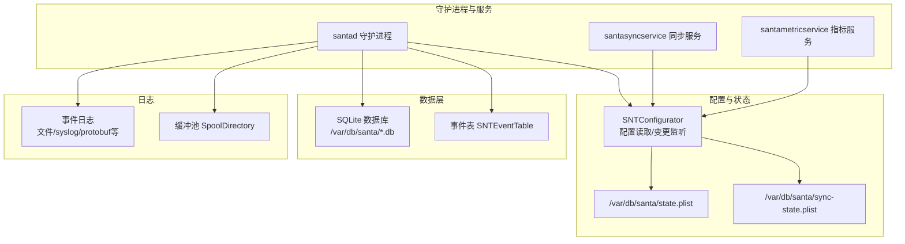
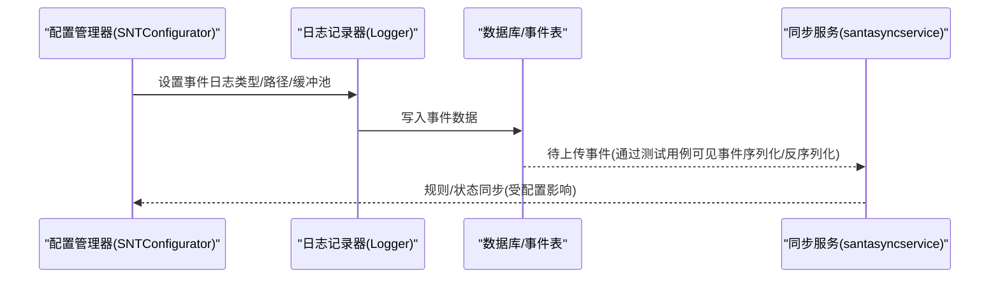
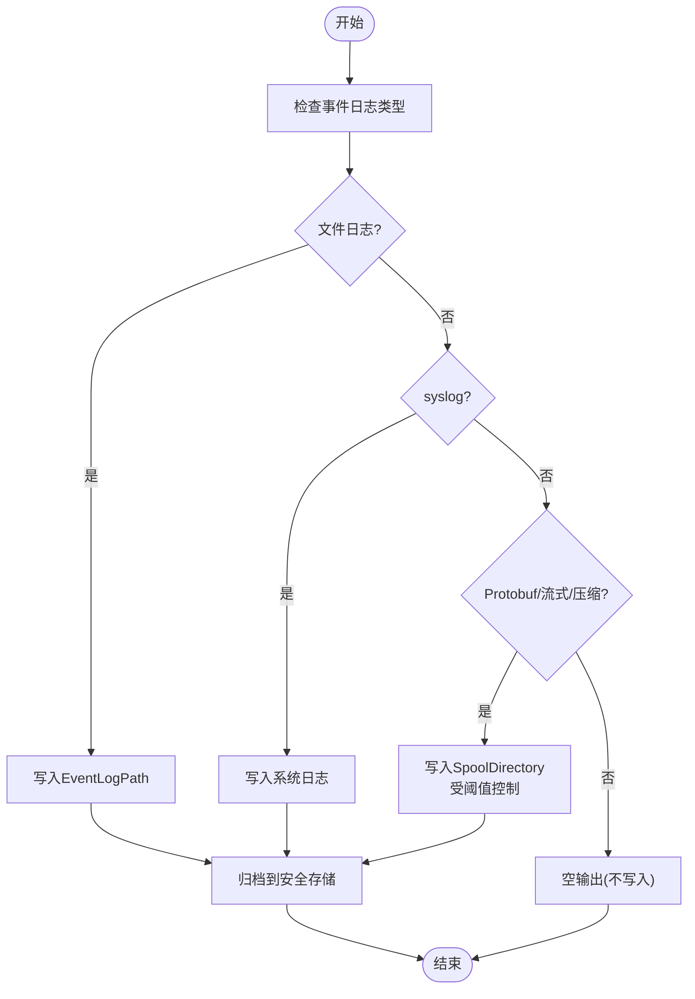
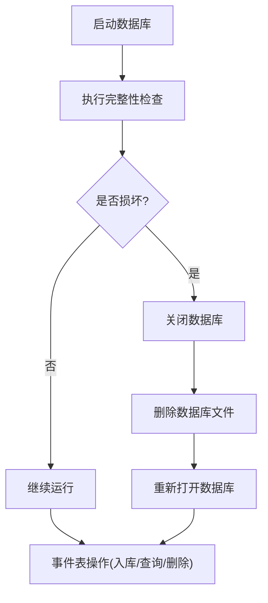

# 备份恢复

<cite>
**本文引用的文件**
- [README.md](file://README.md)
- [SNTConfigurator.h](file://Source/common/SNTConfigurator.h)
- [SNTConfigurator.mm](file://Source/common/SNTConfigurator.mm)
- [SantadDeps.mm](file://Source/santad/SantadDeps.mm)
- [Logger.mm](file://Source/santad/Logs/EndpointSecurity/Logger.mm)
- [SNTEventTable.h](file://Source/santad/DataLayer/SNTEventTable.h)
- [SNTDatabaseTable.mm](file://Source/santad/DataLayer/SNTDatabaseTable.mm)
- [SNTStoredEventTest.mm](file://Source/common/SNTStoredEventTest.mm)
- [SNTEventTableTest.mm](file://Source/santad/DataLayer/SNTEventTableTest.mm)
- [com.northpolesec.santa.plist](file://Conf/com.northpolesec.santa.plist)
- [com.northpolesec.santa.syncservice.plist](file://Conf/com.northpolesec.santa.syncservice.plist)
- [com.northpolesec.santa.metricservice.plist](file://Conf/com.northpolesec.santa.metricservice.plist)
- [migration.sh](file://Conf/Package/migration.sh)
- [preinstall](file://Conf/Package/preinstall)
- [santaconfig.ts](file://docs/src/lib/santaconfig.ts)
- [plist.ts](file://docs/src/components/ConfigGenerator/plist.ts)
- [SNTSyncTest.mm](file://Source/santasyncservice/SNTSyncTest.mm)
</cite>

## 目录
1. [简介](#简介)
2. [项目结构](#项目结构)
3. [核心组件](#核心组件)
4. [架构总览](#架构总览)
5. [详细组件分析](#详细组件分析)
6. [依赖关系分析](#依赖关系分析)
7. [性能考量](#性能考量)
8. [故障排查指南](#故障排查指南)
9. [结论](#结论)
10. [附录](#附录)

## 简介
本指南面向Santa在macOS环境下的备份与恢复实践，围绕数据库备份策略、配置文件备份与事件日志归档展开，解释全量/增量/差异备份的配置思路与落地方式；阐述备份存储位置选择、加密传输与访问控制建议；提供灾难恢复计划、数据恢复流程与系统重建步骤；解释备份验证、恢复测试与故障切换机制；并给出自动化脚本、监控告警与合规性要点。由于Santa本身未内置统一的“备份工具”，本指南以现有代码与配置能力为基础，提供可操作的工程化方案。

## 项目结构
Santa由系统扩展、守护进程、同步服务、指标服务与命令行工具组成，并通过配置状态文件与事件日志实现运行期数据持久化。与备份恢复直接相关的关键路径包括：
- 配置状态与同步状态：/var/db/santa/state.plist 与 /var/db/santa/sync-state.plist
- 事件数据库：默认位于/var/db/santa目录（具体路径由配置决定）
- 事件日志：支持文件、syslog、空输出与多种protobuf格式（批量/流式/压缩）
- 服务配置：LaunchDaemon/LaunchAgent的plist

图表来源
- [SantadDeps.mm](file://Source/santad/SantadDeps.mm#L138-L157)
- [Logger.mm](file://Source/santad/Logs/EndpointSecurity/Logger.mm#L72-L100)
- [SNTEventTable.h](file://Source/santad/DataLayer/SNTEventTable.h#L1-L72)
- [SNTConfigurator.mm](file://Source/common/SNTConfigurator.mm#L71-L115)

章节来源
- [README.md](file://README.md#L1-L152)
- [SNTConfigurator.mm](file://Source/common/SNTConfigurator.mm#L71-L115)
- [SantadDeps.mm](file://Source/santad/SantadDeps.mm#L138-L157)
- [Logger.mm](file://Source/santad/Logs/EndpointSecurity/Logger.mm#L72-L100)

## 核心组件
- 配置管理器（SNTConfigurator）：负责读取/合并/监听配置键值，维护本地状态与同步状态；关键键包括事件日志类型、事件日志路径、缓冲池目录及阈值、遥测导出参数等。
- 日志记录器（Logger）：根据配置选择事件日志输出类型（文件、syslog、protobuf等），并使用缓冲池进行批量写入。
- 事件表（SNTEventTable）：负责事件入库、查询待处理事件、按ID删除事件等。
- 数据库表基类（SNTDatabaseTable）：提供数据库版本管理、完整性检查、vacuum等能力。
- 服务配置（plist）：定义守护进程与服务的启动行为、关联包标识等。

章节来源
- [SNTConfigurator.h](file://Source/common/SNTConfigurator.h#L1-L80)
- [SNTConfigurator.mm](file://Source/common/SNTConfigurator.mm#L141-L169)
- [Logger.mm](file://Source/santad/Logs/EndpointSecurity/Logger.mm#L72-L100)
- [SNTEventTable.h](file://Source/santad/DataLayer/SNTEventTable.h#L1-L72)
- [SNTDatabaseTable.mm](file://Source/santad/DataLayer/SNTDatabaseTable.mm#L76-L114)
- [com.northpolesec.santa.plist](file://Conf/com.northpolesec.santa.plist#L1-L22)
- [com.northpolesec.santa.syncservice.plist](file://Conf/com.northpolesec.santa.syncservice.plist#L1-L27)
- [com.northpolesec.santa.metricservice.plist](file://Conf/com.northpolesec.santa.metricservice.plist#L1-L27)

## 架构总览
下图展示备份恢复相关的关键交互：配置驱动日志与数据库，日志落盘或缓冲池，事件表承载待上传事件，同步服务负责规则与事件的远端同步。

图表来源
- [SantadDeps.mm](file://Source/santad/SantadDeps.mm#L138-L157)
- [Logger.mm](file://Source/santad/Logs/EndpointSecurity/Logger.mm#L72-L100)
- [SNTEventTableTest.mm](file://Source/santad/DataLayer/SNTEventTableTest.mm#L390-L419)
- [SNTSyncTest.mm](file://Source/santasyncservice/SNTSyncTest.mm#L937-L956)

## 详细组件分析

### 组件A：配置与状态（备份范围与策略）
- 关键配置键（示例）：
  - 事件日志类型：EventLogType
  - 事件日志路径：EventLogPath
  - 缓冲池目录：SpoolDirectory
  - 缓冲池文件大小阈值：SpoolDirectoryFileSizeThresholdKB
  - 缓冲池目录大小阈值：SpoolDirectorySizeThresholdMB
  - 缓冲池最大刷新时间：SpoolDirectoryEventMaxFlushTimeSec
  - 遥测导出间隔/超时/批阈值/每批最大文件数：TelemetryExportIntervalSec/TelemetryExportTimeoutSec/TelemetryExportBatchThresholdSizeMB/TelemetryExportMaxFilesPerBatch
- 状态文件：
  - /var/db/santa/state.plist：统计/临时监控模式等状态
  - /var/db/santa/sync-state.plist：同步类型/上次成功时间等

备份策略建议（基于现有配置键）：
- 全量备份：周期性打包state.plist、sync-state.plist与事件日志目录（含缓冲池）。建议在低峰期执行，避免与日志写入冲突。
- 增量备份：仅对事件日志目录中新增/变更文件进行增量归档；或基于缓冲池阈值触发的批量文件进行增量归档。
- 差异备份：比较上次全量快照与当前状态文件差异，结合事件日志目录的差异文件生成差异集。

章节来源
- [SNTConfigurator.mm](file://Source/common/SNTConfigurator.mm#L141-L169)
- [SNTConfigurator.mm](file://Source/common/SNTConfigurator.mm#L573-L631)
- [SantadDeps.mm](file://Source/santad/SantadDeps.mm#L138-L157)
- [santaconfig.ts](file://docs/src/lib/santaconfig.ts#L296-L310)

### 组件B：事件日志与缓冲池（归档与保留）
- 日志类型：
  - 文件日志：写入指定路径
  - syslog：写入系统日志
  - Protobuf/流式/压缩：写入缓冲池目录，支持批量与流式写入
- 缓冲池阈值：
  - 目录大小/单文件大小/刷新超时：用于控制批量写入节奏与磁盘占用
- 归档策略：
  - 将缓冲池中的批量文件定期归档至安全存储
  - 对syslog输出的日志，配合系统日志轮转策略进行归档
  - 对文件日志，按日期/大小切分并归档

图表来源
- [Logger.mm](file://Source/santad/Logs/EndpointSecurity/Logger.mm#L72-L100)
- [SantadDeps.mm](file://Source/santad/SantadDeps.mm#L138-L157)

章节来源
- [Logger.mm](file://Source/santad/Logs/EndpointSecurity/Logger.mm#L72-L100)
- [SantadDeps.mm](file://Source/santad/SantadDeps.mm#L138-L157)

### 组件C：数据库与事件表（完整性与恢复）
- 数据库完整性检查：通过PRAGMA integrity_check判断是否损坏
- 损坏处理：关闭、删除数据库文件后重新打开
- 事件表能力：入库、批量入库、查询待处理事件、按ID删除事件
- 测试用例显示事件对象的归档/解档流程，可用于验证事件数据一致性

图表来源
- [SNTDatabaseTable.mm](file://Source/santad/DataLayer/SNTDatabaseTable.mm#L76-L114)
- [SNTEventTable.h](file://Source/santad/DataLayer/SNTEventTable.h#L1-L72)
- [SNTStoredEventTest.mm](file://Source/common/SNTStoredEventTest.mm#L95-L111)

章节来源
- [SNTDatabaseTable.mm](file://Source/santad/DataLayer/SNTDatabaseTable.mm#L76-L114)
- [SNTEventTable.h](file://Source/santad/DataLayer/SNTEventTable.h#L1-L72)
- [SNTStoredEventTest.mm](file://Source/common/SNTStoredEventTest.mm#L95-L111)

### 组件D：同步与配置生成（远程同步与配置分发）
- 同步服务：负责规则下载、事件上传等，受配置键影响
- 配置生成：通过配置键生成mobileconfig，部署到系统域

章节来源
- [SNTSyncTest.mm](file://Source/santasyncservice/SNTSyncTest.mm#L937-L956)
- [plist.ts](file://docs/src/components/ConfigGenerator/plist.ts#L1-L33)

## 依赖关系分析
- 配置管理器驱动日志记录器与数据库/事件表
- 日志记录器依赖缓冲池阈值与事件日志类型
- 事件表依赖数据库队列/事务
- 同步服务依赖配置状态与规则/事件数据

图表来源
- [SantadDeps.mm](file://Source/santad/SantadDeps.mm#L138-L157)
- [Logger.mm](file://Source/santad/Logs/EndpointSecurity/Logger.mm#L72-L100)
- [SNTEventTable.h](file://Source/santad/DataLayer/SNTEventTable.h#L1-L72)
- [SNTConfigurator.mm](file://Source/common/SNTConfigurator.mm#L573-L631)

章节来源
- [SantadDeps.mm](file://Source/santad/SantadDeps.mm#L138-L157)
- [Logger.mm](file://Source/santad/Logs/EndpointSecurity/Logger.mm#L72-L100)
- [SNTEventTable.h](file://Source/santad/DataLayer/SNTEventTable.h#L1-L72)
- [SNTConfigurator.mm](file://Source/common/SNTConfigurator.mm#L573-L631)

## 性能考量
- 缓冲池阈值调优：合理设置目录大小/文件大小/刷新超时，平衡I/O与延迟
- 日志类型选择：批量Protobuf适合高吞吐场景；syslog便于集中化采集
- 数据库维护：定期vacuum与完整性检查，避免碎片与损坏
- 导出参数：遥测导出间隔/超时/批阈值/每批最大文件数需结合网络与磁盘状况调整

章节来源
- [SantadDeps.mm](file://Source/santad/SantadDeps.mm#L138-L157)
- [Logger.mm](file://Source/santad/Logs/EndpointSecurity/Logger.mm#L72-L100)
- [SNTDatabaseTable.mm](file://Source/santad/DataLayer/SNTDatabaseTable.mm#L44-L50)

## 故障排查指南
- 数据库损坏：
  - 使用完整性检查定位问题
  - 若损坏则删除数据库文件并重新打开
- 事件日志异常：
  - 检查事件日志类型与路径配置
  - 校验缓冲池阈值是否导致写入失败
- 配置变更未生效：
  - 确认配置键是否正确
  - 检查KVO监听与状态文件权限
- 迁移清理：
  - 迁移脚本会清理旧服务与残留文件，确保新版本服务正常加载

章节来源
- [SNTDatabaseTable.mm](file://Source/santad/DataLayer/SNTDatabaseTable.mm#L76-L114)
- [Logger.mm](file://Source/santad/Logs/EndpointSecurity/Logger.mm#L72-L100)
- [SNTConfigurator.mm](file://Source/common/SNTConfigurator.mm#L573-L631)
- [migration.sh](file://Conf/Package/migration.sh#L1-L41)
- [preinstall](file://Conf/Package/preinstall#L1-L9)

## 结论
Santa的备份恢复应围绕配置状态、事件日志与数据库三要素展开。通过合理配置事件日志类型与缓冲池阈值、周期性归档日志与状态文件、定期校验数据库完整性，可构建稳健的备份体系。结合同步服务与配置生成能力，可在灾备场景快速重建与恢复。

## 附录

### A. 备份策略与实施清单
- 全量备份
  - 打包：state.plist、sync-state.plist、事件日志目录（含缓冲池）、数据库文件
  - 时间：业务低峰期
  - 存储：异地/离线介质
- 增量备份
  - 事件日志：仅归档新增/变更文件
  - 配置：对比配置键变化
- 差异备份
  - 以最近一次全量为基准，计算状态文件与日志目录差异

### B. 存储位置、加密传输与访问控制
- 存储位置：优先使用独立磁盘分区或网络存储，分离热数据与冷数据
- 加密传输：使用TLS/加密通道上传归档文件
- 访问控制：最小权限原则，限制对备份介质与配置文件的访问

### C. 灾难恢复计划与系统重建
- 快速恢复：停止服务，还原state.plist/sync-state.plist与数据库，重启服务
- 渐进恢复：先恢复日志与配置，再逐步恢复数据库
- 系统重建：迁移脚本可清理旧版本残留并安装新版本，随后加载系统扩展

章节来源
- [migration.sh](file://Conf/Package/migration.sh#L1-L41)
- [preinstall](file://Conf/Package/preinstall#L1-L9)

### D. 备份验证、恢复测试与故障切换
- 备份验证：校验归档完整性与可读性
- 恢复测试：在隔离环境执行还原与启动流程
- 故障切换：通过同步服务与配置生成实现快速切换与回滚

章节来源
- [SNTSyncTest.mm](file://Source/santasyncservice/SNTSyncTest.mm#L937-L956)
- [plist.ts](file://docs/src/components/ConfigGenerator/plist.ts#L1-L33)

### E. 自动化脚本与监控告警
- 自动化脚本：基于定时任务执行全量/增量归档，监控缓冲池与日志目录容量
- 监控告警：数据库完整性检查失败、日志写入异常、缓冲池阈值触发告警
- 合规性：遵循组织数据保留与销毁政策，确保备份介质与传输过程符合法规

### F. 不同场景下的恢复策略
- 数据损坏：执行数据库完整性检查，必要时删除并重建
- 系统故障：还原配置与日志，重启服务；若需要，使用迁移脚本重建
- 恶意攻击：隔离受影响节点，从最近可用备份恢复，加强访问控制与审计