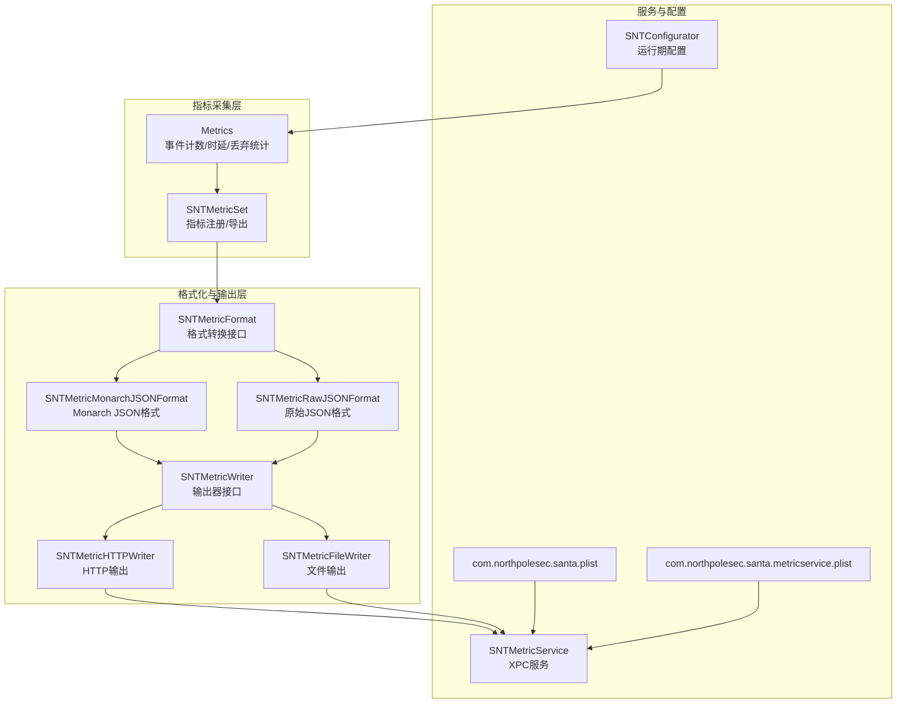
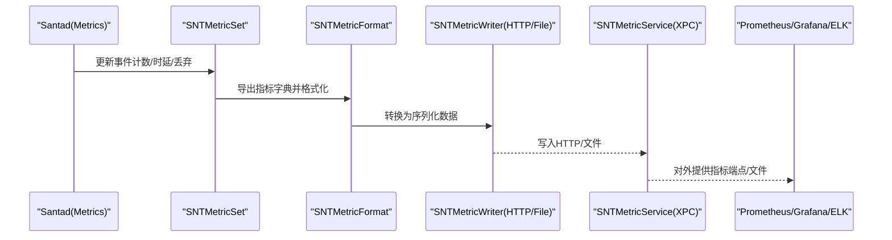
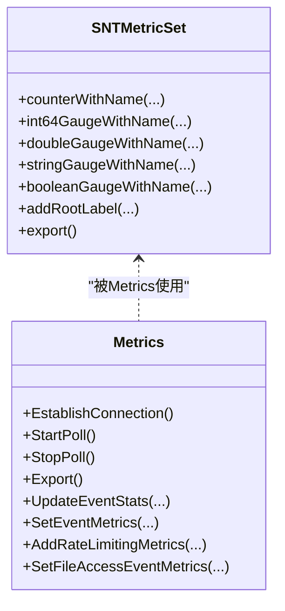
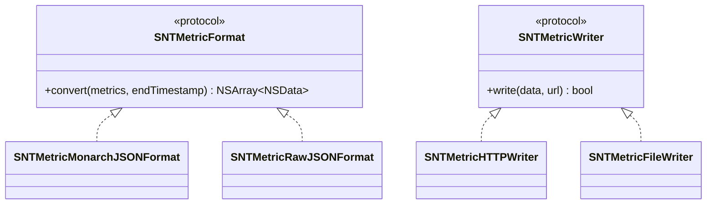
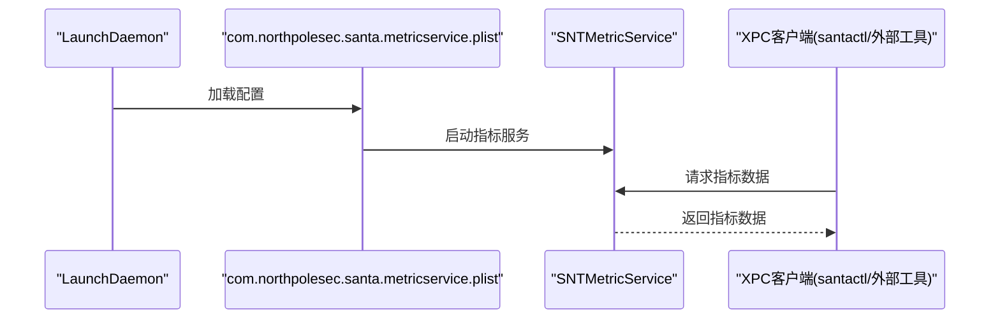
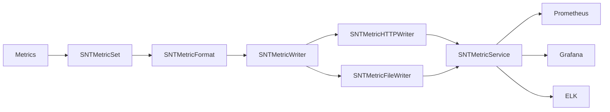

# 监控告警

<cite>
**本文引用的文件**
- [Source/common/SNTMetricSet.h](file://Source/common/SNTMetricSet.h)
- [Source/santametricservice/SNTMetricService.h](file://Source/santametricservice/SNTMetricService.h)
- [Source/santametricservice/Writers/SNTMetricWriter.h](file://Source/santametricservice/Writers/SNTMetricWriter.h)
- [Source/santametricservice/Writers/SNTMetricHTTPWriter.h](file://Source/santametricservice/Writers/SNTMetricHTTPWriter.h)
- [Source/santametricservice/Writers/SNTMetricFileWriter.h](file://Source/santametricservice/Writers/SNTMetricFileWriter.h)
- [Source/santametricservice/Formats/SNTMetricFormat.h](file://Source/santametricservice/Formats/SNTMetricFormat.h)
- [Source/santad/Metrics.h](file://Source/santad/Metrics.h)
- [Conf/com.northpolesec.santa.metricservice.plist](file://Conf/com.northpolesec.santa.metricservice.plist)
- [Conf/com.northpolesec.santa.plist](file://Conf/com.northpolesec.santa.plist)
- [Source/common/SNTConfigurator.h](file://Source/common/SNTConfigurator.h)
- [Source/santactl/Commands/SNTCommandMetrics.h](file://Source/santactl/Commands/SNTCommandMetrics.h)
- [Source/santactl/Commands/SNTCommandMetrics.mm](file://Source/santactl/Commands/SNTCommandMetrics.mm)
- [Source/santametricservice/Formats/SNTMetricMonarchJSONFormat.h](file://Source/santametricservice/Formats/SNTMetricMonarchJSONFormat.h)
- [Source/santametricservice/Formats/SNTMetricRawJSONFormat.h](file://Source/santametricservice/Formats/SNTMetricRawJSONFormat.h)
- [Source/santametricservice/Writers/SNTMetricHTTPWriter.mm](file://Source/santametricservice/Writers/SNTMetricHTTPWriter.mm)
- [Source/santametricservice/Writers/SNTMetricFileWriter.mm](file://Source/santametricservice/Writers/SNTMetricFileWriter.mm)
- [Source/santametricservice/Formats/SNTMetricMonarchJSONFormat.mm](file://Source/santametricservice/Formats/SNTMetricMonarchJSONFormat.mm)
- [Source/santametricservice/Formats/SNTMetricRawJSONFormat.mm](file://Source/santametricservice/Formats/SNTMetricRawJSONFormat.mm)
- [Source/santad/Metrics.mm](file://Source/santad/Metrics.mm)
- [Source/santametricservice/SNTMetricService.mm](file://Source/santametricservice/SNTMetricService.mm)
- [Source/common/SNTMetricSet.mm](file://Source/common/SNTMetricSet.mm)
</cite>

## 目录
1. [简介](#简介)
2. [项目结构](#项目结构)
3. [核心组件](#核心组件)
4. [架构总览](#架构总览)
5. [详细组件分析](#详细组件分析)
6. [依赖关系分析](#依赖关系分析)
7. [性能考量](#性能考量)
8. [故障排查指南](#故障排查指南)
9. [结论](#结论)
10. [附录](#附录)

## 简介
本实施指南面向Santa监控告警系统，聚焦于指标采集配置、监控数据导出、告警规则设置以及与Prometheus、Grafana、ELK Stack等外部监控系统的集成方法。文档还涵盖关键性能指标（CPU使用率、内存占用、事件处理延迟）的监控配置思路、告警阈值设定、通知渠道与故障自动恢复机制、日志聚合与异常检测、趋势分析、仪表板设计与报告生成、合规性审计配置，以及监控系统的维护策略与性能优化建议。

## 项目结构
Santa监控体系由三部分组成：
- 指标采集与缓存：SNTMetricSet负责指标注册与导出；Metrics类负责事件计数、处理时延、丢弃统计等核心指标的采集与周期性导出。
- 指标格式化与输出：SNTMetricFormat定义统一格式转换接口；SNTMetricMonarchJSONFormat与SNTMetricRawJSONFormat提供具体格式实现；SNTMetricWriter抽象输出器，SNTMetricHTTPWriter与SNTMetricFileWriter分别对接HTTP与文件输出。
- 服务与配置：SNTMetricService通过XPC暴露指标服务；com.northpolesec.santa.metricservice.plist定义指标服务的启动参数与关联包标识；SNTConfigurator提供运行期配置项，包括事件日志类型、遥测导出开关与批处理参数等。

图表来源
- [Source/common/SNTMetricSet.h](file://Source/common/SNTMetricSet.h#L84-L192)
- [Source/santad/Metrics.h](file://Source/santad/Metrics.h#L69-L141)
- [Source/santametricservice/Formats/SNTMetricFormat.h](file://Source/santametricservice/Formats/SNTMetricFormat.h#L17-L21)
- [Source/santametricservice/Formats/SNTMetricMonarchJSONFormat.h](file://Source/santametricservice/Formats/SNTMetricMonarchJSONFormat.h)
- [Source/santametricservice/Formats/SNTMetricRawJSONFormat.h](file://Source/santametricservice/Formats/SNTMetricRawJSONFormat.h)
- [Source/santametricservice/Writers/SNTMetricWriter.h](file://Source/santametricservice/Writers/SNTMetricWriter.h#L17-L23)
- [Source/santametricservice/Writers/SNTMetricHTTPWriter.h](file://Source/santametricservice/Writers/SNTMetricHTTPWriter.h#L15-L20)
- [Source/santametricservice/Writers/SNTMetricFileWriter.h](file://Source/santametricservice/Writers/SNTMetricFileWriter.h#L14-L17)
- [Source/santametricservice/SNTMetricService.h](file://Source/santametricservice/SNTMetricService.h#L17-L20)
- [Conf/com.northpolesec.santa.plist](file://Conf/com.northpolesec.santa.plist#L1-L22)
- [Conf/com.northpolesec.santa.metricservice.plist](file://Conf/com.northpolesec.santa.metricservice.plist#L1-L27)
- [Source/common/SNTConfigurator.h](file://Source/common/SNTConfigurator.h#L211-L317)

章节来源
- [Source/common/SNTMetricSet.h](file://Source/common/SNTMetricSet.h#L84-L192)
- [Source/santad/Metrics.h](file://Source/santad/Metrics.h#L69-L141)
- [Source/santametricservice/Formats/SNTMetricFormat.h](file://Source/santametricservice/Formats/SNTMetricFormat.h#L17-L21)
- [Source/santametricservice/Writers/SNTMetricWriter.h](file://Source/santametricservice/Writers/SNTMetricWriter.h#L17-L23)
- [Source/santametricservice/Writers/SNTMetricHTTPWriter.h](file://Source/santametricservice/Writers/SNTMetricHTTPWriter.h#L15-L20)
- [Source/santametricservice/Writers/SNTMetricFileWriter.h](file://Source/santametricservice/Writers/SNTMetricFileWriter.h#L14-L17)
- [Source/santametricservice/SNTMetricService.h](file://Source/santametricservice/SNTMetricService.h#L17-L20)
- [Conf/com.northpolesec.santa.plist](file://Conf/com.northpolesec.santa.plist#L1-L22)
- [Conf/com.northpolesec.santa.metricservice.plist](file://Conf/com.northpolesec.santa.metricservice.plist#L1-L27)
- [Source/common/SNTConfigurator.h](file://Source/common/SNTConfigurator.h#L211-L317)

## 核心组件
- 指标集合与导出
  - SNTMetricSet提供计数器、整型/双精度/布尔/字符串量表等指标类型注册与导出能力，并支持根标签、回调注册与时间戳标准化。
  - 关键接口路径参考：[SNTMetricSet.h](file://Source/common/SNTMetricSet.h#L84-L192)、[SNTMetricSet.mm](file://Source/common/SNTMetricSet.mm)

- 事件与性能指标采集
  - Metrics类负责事件序列统计、速率限制计数、文件访问事件计数、事件处理时延等核心指标的采集与缓存，并周期性导出。
  - 关键接口路径参考：[Metrics.h](file://Source/santad/Metrics.h#L69-L141)、[Metrics.mm](file://Source/santad/Metrics.mm)

- 指标格式化
  - SNTMetricFormat定义格式转换接口；SNTMetricMonarchJSONFormat与SNTMetricRawJSONFormat分别实现不同输出格式。
  - 关键接口路径参考：[SNTMetricFormat.h](file://Source/santametricservice/Formats/SNTMetricFormat.h#L17-L21)、[SNTMetricMonarchJSONFormat.h](file://Source/santametricservice/Formats/SNTMetricMonarchJSONFormat.h)、[SNTMetricRawJSONFormat.h](file://Source/santametricservice/Formats/SNTMetricRawJSONFormat.h)

- 指标输出器
  - SNTMetricWriter抽象输出接口；SNTMetricHTTPWriter与SNTMetricFileWriter分别对接HTTP与文件输出。
  - 关键接口路径参考：[SNTMetricWriter.h](file://Source/santametricservice/Writers/SNTMetricWriter.h#L17-L23)、[SNTMetricHTTPWriter.h](file://Source/santametricservice/Writers/SNTMetricHTTPWriter.h#L15-L20)、[SNTMetricFileWriter.h](file://Source/santametricservice/Writers/SNTMetricFileWriter.h#L14-L17)

- 指标服务
  - SNTMetricService通过XPC暴露指标服务，供外部消费。
  - 关键接口路径参考：[SNTMetricService.h](file://Source/santametricservice/SNTMetricService.h#L17-L20)、[SNTMetricService.mm](file://Source/santametricservice/SNTMetricService.mm)

- 运行期配置
  - SNTConfigurator提供事件日志类型、遥测导出开关与批处理参数等配置项，影响日志与遥测行为。
  - 关键接口路径参考：[SNTConfigurator.h](file://Source/common/SNTConfigurator.h#L211-L317)

章节来源
- [Source/common/SNTMetricSet.h](file://Source/common/SNTMetricSet.h#L84-L192)
- [Source/santad/Metrics.h](file://Source/santad/Metrics.h#L69-L141)
- [Source/santametricservice/Formats/SNTMetricFormat.h](file://Source/santametricservice/Formats/SNTMetricFormat.h#L17-L21)
- [Source/santametricservice/Writers/SNTMetricWriter.h](file://Source/santametricservice/Writers/SNTMetricWriter.h#L17-L23)
- [Source/santametricservice/SNTMetricService.h](file://Source/santametricservice/SNTMetricService.h#L17-L20)
- [Source/common/SNTConfigurator.h](file://Source/common/SNTConfigurator.h#L211-L317)

## 架构总览
下图展示Santa监控告警系统从指标采集到外部监控系统的关键交互路径：

图表来源
- [Source/santad/Metrics.h](file://Source/santad/Metrics.h#L69-L141)
- [Source/common/SNTMetricSet.h](file://Source/common/SNTMetricSet.h#L188-L192)
- [Source/santametricservice/Formats/SNTMetricFormat.h](file://Source/santametricservice/Formats/SNTMetricFormat.h#L17-L21)
- [Source/santametricservice/Writers/SNTMetricWriter.h](file://Source/santametricservice/Writers/SNTMetricWriter.h#L17-L23)
- [Source/santametricservice/SNTMetricService.h](file://Source/santametricservice/SNTMetricService.h#L17-L20)

## 详细组件分析

### 组件A：指标采集与导出（SNTMetricSet 与 Metrics）
- 设计要点
  - SNTMetricSet提供多种指标类型（计数器、整型/双精度/布尔/字符串量表），支持字段维度与根标签，便于多维分析。
  - Metrics在事件处理路径中更新事件计数、处理时延、丢弃统计等，并通过定时器周期性导出。
- 数据流
  - 事件发生 → Metrics更新内部缓存 → 定时触发导出 → SNTMetricSet汇总 → 格式化 → 输出器写入 → XPC服务对外提供。
- 复杂度与性能
  - 指标更新采用原子或队列隔离，避免导出过程阻塞事件采集。
  - 缓存减少频繁导出开销，导出间隔可配置以平衡实时性与资源消耗。

图表来源
- [Source/common/SNTMetricSet.h](file://Source/common/SNTMetricSet.h#L84-L192)
- [Source/santad/Metrics.h](file://Source/santad/Metrics.h#L69-L141)

章节来源
- [Source/common/SNTMetricSet.h](file://Source/common/SNTMetricSet.h#L84-L192)
- [Source/santad/Metrics.h](file://Source/santad/Metrics.h#L69-L141)

### 组件B：指标格式化与输出（SNTMetricFormat 与 SNTMetricWriter）
- 设计要点
  - SNTMetricFormat定义统一转换接口，确保不同格式（如Monarch JSON、原始JSON）的一致性。
  - SNTMetricWriter抽象输出器，HTTP与文件两种实现满足不同导出场景。
- 集成点
  - Prometheus可通过HTTP抓取端点获取指标；Grafana可作为Prometheus数据源进行可视化；ELK可消费文件输出的日志/指标数据。

图表来源
- [Source/santametricservice/Formats/SNTMetricFormat.h](file://Source/santametricservice/Formats/SNTMetricFormat.h#L17-L21)
- [Source/santametricservice/Formats/SNTMetricMonarchJSONFormat.h](file://Source/santametricservice/Formats/SNTMetricMonarchJSONFormat.h)
- [Source/santametricservice/Formats/SNTMetricRawJSONFormat.h](file://Source/santametricservice/Formats/SNTMetricRawJSONFormat.h)
- [Source/santametricservice/Writers/SNTMetricWriter.h](file://Source/santametricservice/Writers/SNTMetricWriter.h#L17-L23)
- [Source/santametricservice/Writers/SNTMetricHTTPWriter.h](file://Source/santametricservice/Writers/SNTMetricHTTPWriter.h#L15-L20)
- [Source/santametricservice/Writers/SNTMetricFileWriter.h](file://Source/santametricservice/Writers/SNTMetricFileWriter.h#L14-L17)

章节来源
- [Source/santametricservice/Formats/SNTMetricFormat.h](file://Source/santametricservice/Formats/SNTMetricFormat.h#L17-L21)
- [Source/santametricservice/Writers/SNTMetricWriter.h](file://Source/santametricservice/Writers/SNTMetricWriter.h#L17-L23)
- [Source/santametricservice/Writers/SNTMetricHTTPWriter.h](file://Source/santametricservice/Writers/SNTMetricHTTPWriter.h#L15-L20)
- [Source/santametricservice/Writers/SNTMetricFileWriter.h](file://Source/santametricservice/Writers/SNTMetricFileWriter.h#L14-L17)

### 组件C：指标服务与系统集成（SNTMetricService 与 LaunchDaemons）
- 设计要点
  - SNTMetricService通过XPC提供指标服务；LaunchDaemon配置确保服务随系统启动并保持常驻。
  - com.northpolesec.santa.plist与com.northpolesec.santa.metricservice.plist分别管理主守护进程与指标服务。
- 集成点
  - Prometheus可通过HTTP抓取端点；Grafana可作为Prometheus数据源；ELK可消费文件输出；也可结合外部同步服务进行集中管理。

图表来源
- [Conf/com.northpolesec.santa.metricservice.plist](file://Conf/com.northpolesec.santa.metricservice.plist#L1-L27)
- [Source/santametricservice/SNTMetricService.h](file://Source/santametricservice/SNTMetricService.h#L17-L20)
- [Source/santametricservice/SNTMetricService.mm](file://Source/santametricservice/SNTMetricService.mm)

章节来源
- [Conf/com.northpolesec.santa.metricservice.plist](file://Conf/com.northpolesec.santa.metricservice.plist#L1-L27)
- [Conf/com.northpolesec.santa.plist](file://Conf/com.northpolesec.santa.plist#L1-L22)
- [Source/santametricservice/SNTMetricService.h](file://Source/santametricservice/SNTMetricService.h#L17-L20)

### 组件D：关键性能指标监控配置
- CPU使用率与内存占用
  - 可通过系统级指标采集（如系统资源指标）与应用内指标（如事件处理时延）共同评估。
  - 建议在SNTMetricSet中注册相应量表指标，并在Metrics中按需更新。
- 事件处理延迟
  - Metrics提供事件处理时延指标，可用于计算P50/P95/P99延迟，作为告警阈值依据。
- 丢弃与限速
  - 通过丢弃计数与限速计数指标识别系统压力与潜在瓶颈。

章节来源
- [Source/santad/Metrics.h](file://Source/santad/Metrics.h#L69-L141)
- [Source/common/SNTMetricSet.h](file://Source/common/SNTMetricSet.h#L126-L173)

### 组件E：告警规则与阈值设定
- 规则建议
  - 事件处理延迟超过阈值持续一段时间触发“高延迟”告警。
  - 丢弃计数在短时间内显著上升触发“事件丢失”告警。
  - 限速计数异常升高触发“系统过载”告警。
- 阈值设定
  - 延迟阈值：基于历史P95/P99分位与时长窗口设定。
  - 丢弃/限速阈值：基于系统容量与历史基线设定。
- 自动恢复
  - 当指标回落至阈值以下持续一段时间后自动恢复；或结合外部控制接口触发降级/扩容策略。

[本节为通用实践建议，不直接分析具体文件，故无章节来源]

### 组件F：日志聚合、异常检测与趋势分析
- 日志聚合
  - 使用SNTConfigurator中的事件日志类型配置（syslog/file/protobuf等）与遥测导出参数，配合ELK进行日志采集与聚合。
- 异常检测
  - 基于指标统计分布（均值、标准差、分位数）与滑动窗口检测异常波动。
- 趋势分析
  - 结合时间序列模型对指标进行趋势拟合与预测，提前预警容量与性能问题。

章节来源
- [Source/common/SNTConfigurator.h](file://Source/common/SNTConfigurator.h#L211-L317)

### 组件G：监控仪表板设计与报告生成
- 仪表板设计
  - 使用Grafana面板展示事件处理延迟、丢弃/限速计数、系统资源指标等。
- 报告生成
  - 基于Prometheus查询与Grafana快照/导出功能生成定期报告。
- 合规性审计
  - 保留事件日志与遥测数据，满足合规要求；通过SNTConfigurator配置日志存储与导出策略。

[本节为通用实践建议，不直接分析具体文件，故无章节来源]

## 依赖关系分析
- 组件耦合
  - Metrics依赖SNTMetricSet进行指标注册与导出；SNTMetricSet依赖格式化模块进行数据转换；输出器负责落地或网络传输。
- 外部依赖
  - Prometheus/Grafana用于指标抓取与可视化；ELK用于日志聚合；外部同步服务用于集中配置下发与状态同步。

图表来源
- [Source/santad/Metrics.h](file://Source/santad/Metrics.h#L69-L141)
- [Source/common/SNTMetricSet.h](file://Source/common/SNTMetricSet.h#L84-L192)
- [Source/santametricservice/Formats/SNTMetricFormat.h](file://Source/santametricservice/Formats/SNTMetricFormat.h#L17-L21)
- [Source/santametricservice/Writers/SNTMetricWriter.h](file://Source/santametricservice/Writers/SNTMetricWriter.h#L17-L23)
- [Source/santametricservice/Writers/SNTMetricHTTPWriter.h](file://Source/santametricservice/Writers/SNTMetricHTTPWriter.h#L15-L20)
- [Source/santametricservice/Writers/SNTMetricFileWriter.h](file://Source/santametricservice/Writers/SNTMetricFileWriter.h#L14-L17)
- [Source/santametricservice/SNTMetricService.h](file://Source/santametricservice/SNTMetricService.h#L17-L20)

## 性能考量
- 导出频率与批量
  - 通过SNTConfigurator中的遥测导出间隔与批处理阈值参数，平衡导出频率与I/O开销。
- 指标缓存与队列
  - Metrics内部缓存与独立事件队列降低导出过程对事件采集的影响。
- 日志与存储
  - 合理选择事件日志类型与文件大小/数量阈值，避免磁盘压力过大。

章节来源
- [Source/common/SNTConfigurator.h](file://Source/common/SNTConfigurator.h#L272-L317)
- [Source/santad/Metrics.h](file://Source/santad/Metrics.h#L112-L138)

## 故障排查指南
- 指标未导出
  - 检查SNTMetricService是否正常启动（LaunchDaemon配置与XPC连接）。
  - 确认SNTMetricSet导出回调已注册且未被异常中断。
- 导出失败
  - 若使用HTTP输出，检查目标端点可达性与认证配置；若使用文件输出，检查文件权限与磁盘空间。
- 指标异常
  - 通过santactl命令查看当前指标状态，定位异常指标类型与数值范围。

章节来源
- [Conf/com.northpolesec.santa.metricservice.plist](file://Conf/com.northpolesec.santa.metricservice.plist#L1-L27)
- [Source/santametricservice/SNTMetricService.h](file://Source/santametricservice/SNTMetricService.h#L17-L20)
- [Source/common/SNTMetricSet.h](file://Source/common/SNTMetricSet.h#L188-L192)
- [Source/santactl/Commands/SNTCommandMetrics.h](file://Source/santactl/Commands/SNTCommandMetrics.h)
- [Source/santactl/Commands/SNTCommandMetrics.mm](file://Source/santactl/Commands/SNTCommandMetrics.mm)

## 结论
Santa监控告警系统通过SNTMetricSet与Metrics实现细粒度的事件与性能指标采集，借助SNTMetricFormat与SNTMetricWriter完成灵活的格式化与输出，再由SNTMetricService对外提供指标服务。结合Prometheus/Grafana/ELK等外部系统，可构建完善的监控、告警与可视化体系。通过合理的阈值设定、自动恢复机制、日志聚合与趋势分析，能够有效保障系统稳定性与安全性，并满足合规性审计需求。

## 附录
- 实施步骤建议
  - 在SNTMetricSet中注册所需指标（计数器/量表），并在Metrics中按事件路径更新。
  - 配置SNTMetricFormat与SNTMetricWriter，选择HTTP或文件输出方式。
  - 启用SNTMetricService并通过LaunchDaemon确保服务常驻。
  - 在Prometheus中配置抓取任务，在Grafana中创建仪表板；在ELK中配置日志采集。
  - 制定告警规则与阈值，建立自动恢复与通知流程。
  - 定期审查日志与指标，优化导出频率与存储策略。

[本节为通用实践建议，不直接分析具体文件，故无章节来源]