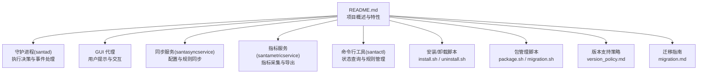
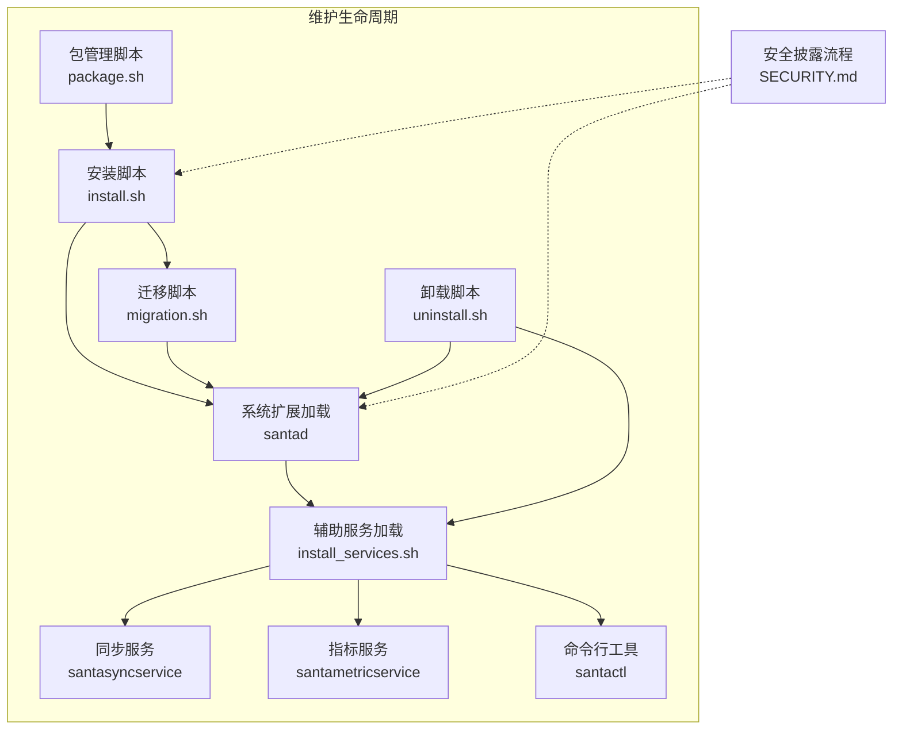
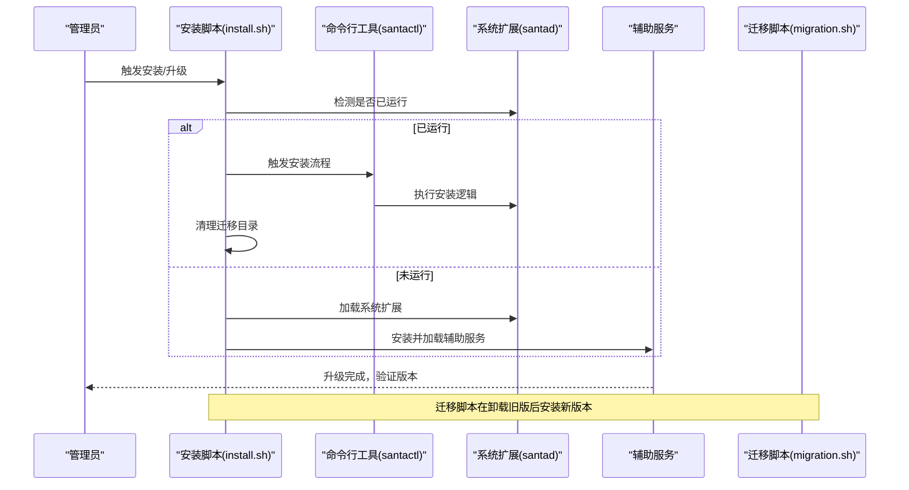
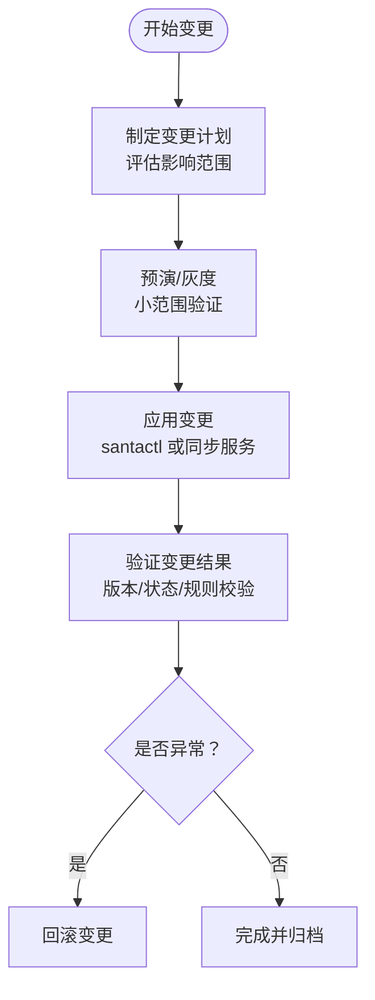
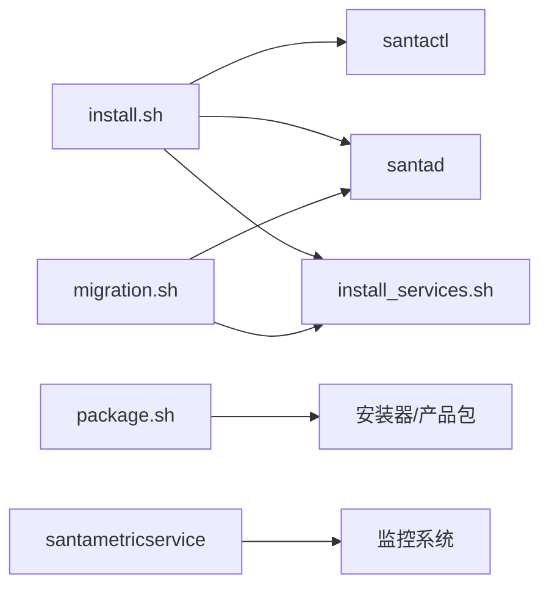

# 维护策略

<cite>
**本文引用的文件**
- [README.md](file://README.md)
- [SECURITY.md](file://SECURITY.md)
- [docs/docs/development/version_policy.md](file://docs/docs/development/version_policy.md)
- [docs/docs/deployment/migration.md](file://docs/docs/deployment/migration.md)
- [Conf/install.sh](file://Conf/install.sh)
- [Conf/Package/package.sh](file://Conf/Package/package.sh)
- [Conf/Package/migration.sh](file://Conf/Package/migration.sh)
- [Conf/uninstall.sh](file://Conf/uninstall.sh)
- [Conf/install_services.sh](file://Conf/install_services.sh)
- [Source/santametricservice/SNTMetricServiceTest.mm](file://Source/santametricservice/SNTMetricServiceTest.mm)
- [Source/common/SNTMetricSet.mm](file://Source/common/SNTMetricSet.mm)
- [Source/santad/SNTApplicationCoreMetrics.mm](file://Source/santad/SNTApplicationCoreMetrics.mm)
</cite>

## 目录
1. [引言](#引言)
2. [项目结构](#项目结构)
3. [核心组件](#核心组件)
4. [架构总览](#架构总览)
5. [详细组件分析](#详细组件分析)
6. [依赖关系分析](#依赖关系分析)
7. [性能考量](#性能考量)
8. [故障排查指南](#故障排查指南)
9. [结论](#结论)
10. [附录](#附录)

## 引言
本维护策略面向 Santa 的运维与平台工程团队，围绕版本升级流程、补丁与迁移管理、向后兼容性、配置变更管理、发布周期与变更影响评估、定期维护与健康检查、性能优化、维护窗口规划与业务连续性、安全更新与合规、维护日志与审计、维护自动化与监控告警、以及团队职责与应急响应进行系统化说明。文档以仓库内现有实现与文档为依据，结合可操作的脚本与服务清单，形成可落地的维护实践。

## 项目结构
Santa 由多组件构成：系统扩展（守护进程）、GUI 代理、同步服务、指标服务、命令行工具，以及打包与安装/卸载脚本。维护工作主要涉及以下方面：
- 版本与支持策略：参考版本支持政策文档
- 迁移与升级：从旧版或第三方实现平滑过渡
- 安装与卸载：系统扩展与辅助服务的加载/卸载
- 包管理：打包、签名、分发与开发包构建
- 指标与监控：事件、规则、运行模式等指标导出
- 安全披露与合规：漏洞报告与处理流程

图表来源
- [README.md](file://README.md#L13-L90)
- [docs/docs/development/version_policy.md](file://docs/docs/development/version_policy.md#L1-L32)
- [docs/docs/deployment/migration.md](file://docs/docs/deployment/migration.md#L1-L99)
- [Conf/install.sh](file://Conf/install.sh#L1-L68)
- [Conf/Package/package.sh](file://Conf/Package/package.sh#L1-L77)
- [Conf/Package/migration.sh](file://Conf/Package/migration.sh#L1-L41)
- [Conf/uninstall.sh](file://Conf/uninstall.sh#L1-L42)
- [Conf/install_services.sh](file://Conf/install_services.sh#L1-L64)

章节来源
- [README.md](file://README.md#L13-L90)
- [docs/docs/development/version_policy.md](file://docs/docs/development/version_policy.md#L1-L32)
- [docs/docs/deployment/migration.md](file://docs/docs/deployment/migration.md#L1-L99)

## 核心组件
- 守护进程（santad）：负责端点安全事件监听、决策缓存、数据库事件与规则表管理、临时监控模式、进程树与事件序列化等。
- 同步服务（santasyncservice）：与远端服务器进行预检、规则下载、事件上传、推送通知等。
- 指标服务（santametricservice）：将指标格式化并写入文件或通过 HTTP 导出。
- 命令行工具（santactl）：用于版本查询、状态查看、规则增删、缓存清理、安装触发等。
- 安装与卸载脚本：在系统扩展生命周期内完成服务加载/卸载、冲突清理、迁移支持等。
- 包管理脚本：打包应用与配置、生成产品包、处理重定位与覆盖行为、签名与公证工具链集成。

章节来源
- [README.md](file://README.md#L13-L90)
- [Conf/install.sh](file://Conf/install.sh#L1-L68)
- [Conf/uninstall.sh](file://Conf/uninstall.sh#L1-L42)
- [Conf/Package/package.sh](file://Conf/Package/package.sh#L1-L77)
- [Conf/Package/migration.sh](file://Conf/Package/migration.sh#L1-L41)
- [Conf/install_services.sh](file://Conf/install_services.sh#L1-L64)

## 架构总览
Santa 的维护涉及“安装/升级/卸载”、“迁移”、“指标导出”、“安全披露”四大闭环。下图展示维护相关组件与控制流：

图表来源
- [Conf/Package/package.sh](file://Conf/Package/package.sh#L1-L77)
- [Conf/install.sh](file://Conf/install.sh#L1-L68)
- [Conf/install_services.sh](file://Conf/install_services.sh#L1-L64)
- [Conf/Package/migration.sh](file://Conf/Package/migration.sh#L1-L41)
- [Conf/uninstall.sh](file://Conf/uninstall.sh#L1-L42)
- [SECURITY.md](file://SECURITY.md#L1-L10)

## 详细组件分析

### 版本升级与补丁管理
- 版本支持策略：遵循“最新 3 个 macOS 主版本”的支持范围，并对新 OS 特性采用条件启用方式；对超过 1 年的版本提供有限支持。
- 补丁与升级路径：
  - 使用安装脚本触发更新流程，若检测到正在运行的 Santa，会通过命令行工具触发安装流程并清理迁移目录。
  - 对特定版本（如 2024.10/2024.11）在锁定模式下自动添加允许规则以避免升级阻断。
- 升级窗口建议：优先在业务低峰时段进行，利用系统扩展的“无中断”能力与迁移脚本的无缝切换。

图表来源
- [Conf/install.sh](file://Conf/install.sh#L1-L68)
- [Conf/Package/migration.sh](file://Conf/Package/migration.sh#L1-L41)

章节来源
- [docs/docs/development/version_policy.md](file://docs/docs/development/version_policy.md#L1-L32)
- [Conf/install.sh](file://Conf/install.sh#L1-L68)

### 配置变更管理
- 变更入口：通过命令行工具进行规则增删改查、状态查询与模式切换；也可通过同步服务从远端拉取配置。
- 变更影响评估：
  - 在锁定模式下进行升级时，安装脚本会自动添加允许规则以避免自阻断。
  - 迁移过程中会清理旧版残留服务与配置，确保新旧配置隔离。
- 变更验证：使用版本与状态命令核对组件版本与当前模式。

图表来源
- [Conf/install.sh](file://Conf/install.sh#L1-L68)
- [Conf/install_services.sh](file://Conf/install_services.sh#L1-L64)

章节来源
- [Conf/install.sh](file://Conf/install.sh#L1-L68)
- [Conf/install_services.sh](file://Conf/install_services.sh#L1-L64)

### 发布周期与变更影响评估
- 发布节奏：以 GitHub Releases 为准，配合文档与版本策略。
- 影响评估要点：
  - 新功能可能在旧 OS 上禁用，需在版本策略中明确标注。
  - 迁移指南强调双授权窗口与最小停机时间，避免安全覆盖空档。

章节来源
- [README.md](file://README.md#L1-L20)
- [docs/docs/development/version_policy.md](file://docs/docs/development/version_policy.md#L1-L32)
- [docs/docs/deployment/migration.md](file://docs/docs/deployment/migration.md#L1-L99)

### 定期维护任务与健康检查
- 健康检查清单：
  - 系统扩展状态：确认守护进程已激活且未处于终止等待卸载状态。
  - 服务状态：确认各辅助服务已加载。
  - 日志轮转：检查日志配置与轮转文件是否存在。
  - 指标导出：验证指标服务是否按配置导出至文件或 HTTP。
- 性能优化建议：
  - 利用缓存机制减少重复决策开销。
  - 合理设置规则粒度，避免过度正则导致匹配成本上升。
  - 控制事件上传频率与批大小，降低网络与磁盘压力。

章节来源
- [docs/docs/deployment/migration.md](file://docs/docs/deployment/migration.md#L70-L99)
- [Conf/uninstall.sh](file://Conf/uninstall.sh#L1-L42)
- [Source/santametricservice/SNTMetricServiceTest.mm](file://Source/santametricservice/SNTMetricServiceTest.mm#L109-L138)
- [Source/common/SNTMetricSet.mm](file://Source/common/SNTMetricSet.mm#L554-L667)
- [Source/santad/SNTApplicationCoreMetrics.mm](file://Source/santad/SNTApplicationCoreMetrics.mm#L36-L58)

### 维护窗口规划与业务连续性
- 窗口规划：
  - 选择业务低峰时段，提前进行预演与回滚演练。
  - 利用迁移脚本与安装脚本的“无缝切换”，在移除旧版后快速加载新版。
- 业务连续性保障：
  - 迁移指南强调“双授权窗口”与“最小停机时间”，避免安全覆盖空档。
  - 升级前在锁定模式下自动放行新版组件，防止自阻断。

章节来源
- [docs/docs/deployment/migration.md](file://docs/docs/deployment/migration.md#L20-L99)
- [Conf/install.sh](file://Conf/install.sh#L40-L60)

### 安全更新、漏洞修复与合规
- 漏洞披露流程：通过私有渠道提交，90 天或发布新版本前公开披露。
- 合规与审计：
  - 保留安装/卸载/迁移日志，便于审计与追溯。
  - 使用指标服务导出运行状态与事件统计，满足合规报告需求。

章节来源
- [SECURITY.md](file://SECURITY.md#L1-L10)
- [Conf/uninstall.sh](file://Conf/uninstall.sh#L1-L42)
- [Conf/Package/package.sh](file://Conf/Package/package.sh#L1-L77)
- [Source/santametricservice/SNTMetricServiceTest.mm](file://Source/santametricservice/SNTMetricServiceTest.mm#L109-L138)

### 维护日志记录、变更跟踪与审计
- 日志与轮转：
  - 通过安装脚本与迁移脚本维护日志配置文件，确保升级前后日志策略一致。
- 变更跟踪：
  - 使用版本号与状态命令核对变更生效情况。
  - 记录安装/卸载/迁移步骤与时间窗，纳入变更管理流程。

章节来源
- [Conf/uninstall.sh](file://Conf/uninstall.sh#L1-L42)
- [Conf/Package/migration.sh](file://Conf/Package/migration.sh#L1-L41)
- [docs/docs/deployment/migration.md](file://docs/docs/deployment/migration.md#L70-L99)

### 维护自动化工具、监控告警与故障预防
- 自动化工具：
  - 安装/卸载/迁移脚本标准化维护动作。
  - 包管理脚本统一打包、签名与产品包生成。
- 监控与告警：
  - 指标服务支持导出原始 JSON 或通过 HTTP 推送，便于接入监控系统。
  - 关键指标包括事件计数、规则数量、运行模式、是否使用端点安全框架等。
- 故障预防：
  - 锁定模式下的自阻断防护：安装脚本在特定版本中自动放行新版组件。
  - 迁移脚本清理旧版残留，避免冲突。

章节来源
- [Conf/Package/package.sh](file://Conf/Package/package.sh#L1-L77)
- [Conf/install.sh](file://Conf/install.sh#L1-L68)
- [Source/santametricservice/SNTMetricServiceTest.mm](file://Source/santametricservice/SNTMetricServiceTest.mm#L109-L138)
- [Source/common/SNTMetricSet.mm](file://Source/common/SNTMetricSet.mm#L554-L667)
- [Source/santad/SNTApplicationCoreMetrics.mm](file://Source/santad/SNTApplicationCoreMetrics.mm#L36-L58)

### 团队职责分工、培训要求与应急响应
- 职责分工：
  - 平台工程团队：负责打包、分发、安装/卸载与迁移脚本维护。
  - 运维团队：负责日常巡检、健康检查、指标监控与告警处置。
  - 安全团队：负责漏洞披露与修复流程、合规审计。
- 培训要求：
  - 熟悉版本策略、迁移流程与维护脚本。
  - 掌握指标导出与监控对接方法。
- 应急响应：
  - 制定回滚预案与最小停机方案。
  - 明确漏洞披露与修复时限。

## 依赖关系分析
- 安装脚本依赖系统扩展加载与命令行工具；在锁定模式下对特定版本自动放行新版组件。
- 迁移脚本依赖系统扩展状态检测与旧版服务清理。
- 包管理脚本依赖打包工具链与权限设置，确保签名与重定位策略正确。
- 指标服务依赖配置与导出格式，输出供监控系统消费。

图表来源
- [Conf/install.sh](file://Conf/install.sh#L1-L68)
- [Conf/Package/package.sh](file://Conf/Package/package.sh#L1-L77)
- [Conf/Package/migration.sh](file://Conf/Package/migration.sh#L1-L41)
- [Conf/install_services.sh](file://Conf/install_services.sh#L1-L64)
- [Source/santametricservice/SNTMetricServiceTest.mm](file://Source/santametricservice/SNTMetricServiceTest.mm#L109-L138)

章节来源
- [Conf/install.sh](file://Conf/install.sh#L1-L68)
- [Conf/Package/package.sh](file://Conf/Package/package.sh#L1-L77)
- [Conf/Package/migration.sh](file://Conf/Package/migration.sh#L1-L41)
- [Conf/install_services.sh](file://Conf/install_services.sh#L1-L64)
- [Source/santametricservice/SNTMetricServiceTest.mm](file://Source/santametricservice/SNTMetricServiceTest.mm#L109-L138)

## 性能考量
- 决策缓存：利用缓存减少重复决策开销，提升执行效率。
- 规则设计：合理使用代码签名规则与路径规则，避免过度正则导致匹配成本上升。
- 事件处理：控制事件上传频率与批大小，平衡实时性与资源消耗。
- 指标导出：根据监控需求选择合适格式与目标，避免频繁 I/O。

## 故障排查指南
- 系统扩展未激活或处于终止等待卸载状态：检查安装/卸载脚本执行情况与迁移脚本是否完成。
- 服务未加载：确认安装脚本是否正确复制并加载 LaunchDaemon/LaunchAgent。
- 升级后无法启动：检查安装脚本在锁定模式下的自放行逻辑是否生效。
- 指标未导出：核对指标服务配置与导出格式，确认监控系统可达性。

章节来源
- [docs/docs/deployment/migration.md](file://docs/docs/deployment/migration.md#L70-L99)
- [Conf/uninstall.sh](file://Conf/uninstall.sh#L1-L42)
- [Conf/install.sh](file://Conf/install.sh#L1-L68)
- [Conf/install_services.sh](file://Conf/install_services.sh#L1-L64)

## 结论
通过规范的版本策略、严谨的迁移与升级流程、完善的健康检查与监控、以及清晰的职责分工与应急响应，Santa 的维护可以实现高可靠与低停机。建议将本文策略固化为标准作业程序（SOP），并持续基于实际运行反馈迭代优化。

## 附录
- 版本支持策略与迁移指南链接：参见对应文档文件路径
- 指标导出示例与格式：参见指标服务测试与指标集合实现文件路径