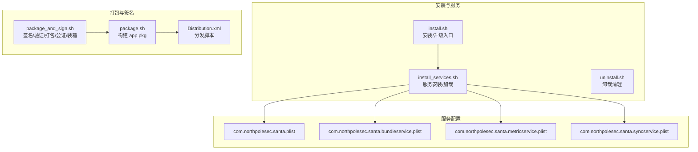
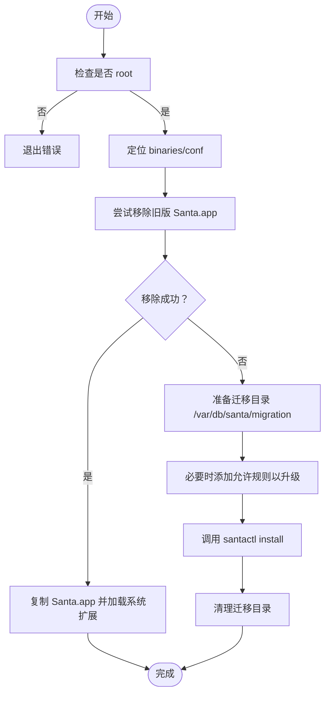
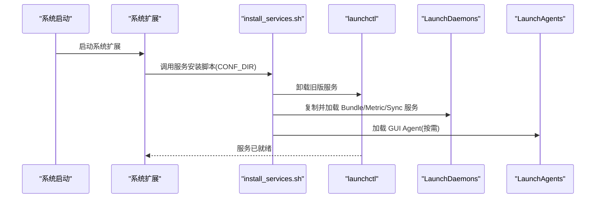
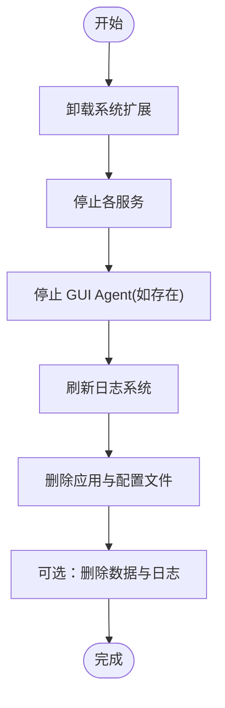
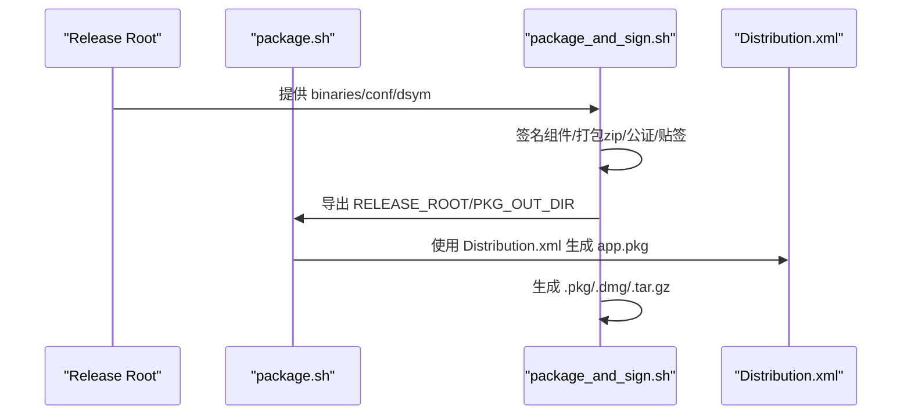
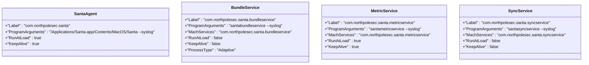
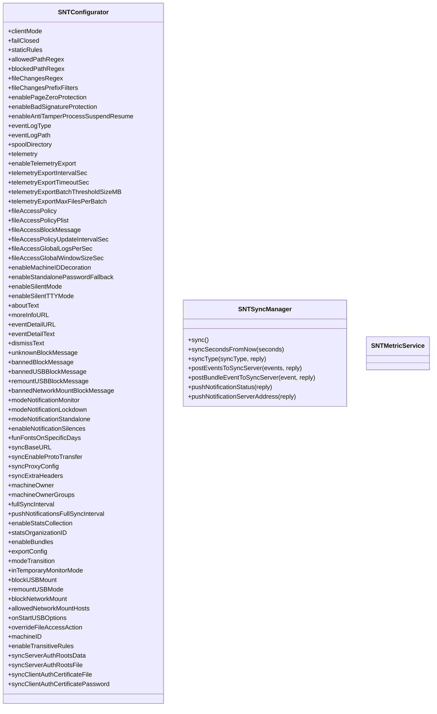
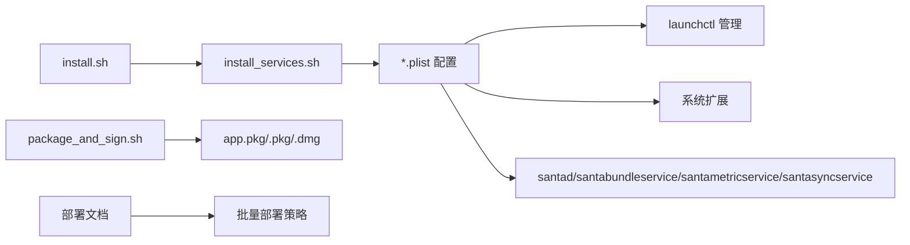

# 部署方案设计

<cite>
**本文引用的文件**
- [Conf/install.sh](file://Conf/install.sh)
- [Conf/install_services.sh](file://Conf/install_services.sh)
- [Conf/uninstall.sh](file://Conf/uninstall.sh)
- [Conf/Package/package.sh](file://Conf/Package/package.sh)
- [Conf/Package/package_and_sign.sh](file://Conf/Package/package_and_sign.sh)
- [Conf/Package/Distribution.xml](file://Conf/Package/Distribution.xml)
- [Conf/com.northpolesec.santa.plist](file://Conf/com.northpolesec.santa.plist)
- [Conf/com.northpolesec.santa.bundleservice.plist](file://Conf/com.northpolesec.santa.bundleservice.plist)
- [Conf/com.northpolesec.santa.metricservice.plist](file://Conf/com.northpolesec.santa.metricservice.plist)
- [Conf/com.northpolesec.santa.syncservice.plist](file://Conf/com.northpolesec.santa.syncservice.plist)
- [Source/common/SNTConfigurator.h](file://Source/common/SNTConfigurator.h)
- [Source/santasyncservice/SNTSyncManager.h](file://Source/santasyncservice/SNTSyncManager.h)
- [Source/santametricservice/SNTMetricService.h](file://Source/santametricservice/SNTMetricService.h)
- [docs/docs/deployment/getting-started.md](file://docs/docs/deployment/getting-started.md)
- [docs/docs/deployment/install-package.md](file://docs/docs/deployment/install-package.md)
</cite>

## 目录
1. [引言](#引言)
2. [项目结构](#项目结构)
3. [核心组件](#核心组件)
4. [架构总览](#架构总览)
5. [详细组件分析](#详细组件分析)
6. [依赖分析](#依赖分析)
7. [性能考虑](#性能考虑)
8. [故障排查指南](#故障排查指南)
9. [结论](#结论)
10. [附录](#附录)

## 引言
本指南面向不同规模组织（小型企业、中型企业、大型企业、超大规模）的 Santa 部署需求，提供从系统要求、硬件资源规划、网络拓扑设计到安装包配置、批量部署策略、滚动更新机制、多环境配置与管理、部署验证、性能基准与容量规划的完整方案。Santa 在 macOS 上通过系统扩展与多个辅助服务协同工作，实现二进制授权、事件采集与同步、指标导出等能力。本文基于仓库中的安装脚本、打包签名脚本、LaunchDaemon/LaunchAgent 配置以及核心配置接口与同步/指标服务接口进行系统化梳理，并结合官方部署文档给出可操作的落地建议。

## 项目结构
Santa 的部署相关代码主要集中在以下位置：
- 安装与卸载：Conf/install.sh、Conf/uninstall.sh、Conf/install_services.sh
- 包与签名：Conf/Package/package.sh、Conf/Package/package_and_sign.sh、Conf/Package/Distribution.xml
- 服务配置：Conf/*.plist（com.northpolesec.santa*.plist）
- 核心配置接口：Source/common/SNTConfigurator.h
- 同步与指标服务：Source/santasyncservice/SNTSyncManager.h、Source/santametricservice/SNTMetricService.h
- 官方部署文档：docs/docs/deployment/*



图表来源
- [Conf/install.sh](file://Conf/install.sh#L1-L68)
- [Conf/install_services.sh](file://Conf/install_services.sh#L1-L64)
- [Conf/uninstall.sh](file://Conf/uninstall.sh#L1-L42)
- [Conf/Package/package.sh](file://Conf/Package/package.sh#L1-L77)
- [Conf/Package/package_and_sign.sh](file://Conf/Package/package_and_sign.sh#L1-L153)
- [Conf/Package/Distribution.xml](file://Conf/Package/Distribution.xml#L1-L17)
- [Conf/com.northpolesec.santa.plist](file://Conf/com.northpolesec.santa.plist#L1-L22)
- [Conf/com.northpolesec.santa.bundleservice.plist](file://Conf/com.northpolesec.santa.bundleservice.plist#L1-L33)
- [Conf/com.northpolesec.santa.metricservice.plist](file://Conf/com.northpolesec.santa.metricservice.plist#L1-L27)
- [Conf/com.northpolesec.santa.syncservice.plist](file://Conf/com.northpolesec.santa.syncservice.plist#L1-L27)

章节来源
- [Conf/install.sh](file://Conf/install.sh#L1-L68)
- [Conf/install_services.sh](file://Conf/install_services.sh#L1-L64)
- [Conf/uninstall.sh](file://Conf/uninstall.sh#L1-L42)
- [Conf/Package/package.sh](file://Conf/Package/package.sh#L1-L77)
- [Conf/Package/package_and_sign.sh](file://Conf/Package/package_and_sign.sh#L1-L153)
- [Conf/Package/Distribution.xml](file://Conf/Package/Distribution.xml#L1-L17)
- [Conf/com.northpolesec.santa.plist](file://Conf/com.northpolesec.santa.plist#L1-L22)
- [Conf/com.northpolesec.santa.bundleservice.plist](file://Conf/com.northpolesec.santa.bundleservice.plist#L1-L33)
- [Conf/com.northpolesec.santa.metricservice.plist](file://Conf/com.northpolesec.santa.metricservice.plist#L1-L27)
- [Conf/com.northpolesec.santa.syncservice.plist](file://Conf/com.northpolesec.santa.syncservice.plist#L1-L27)

## 核心组件
- 安装入口与升级流程：install.sh 负责检测当前安装状态、尝试移除旧版本、加载系统扩展、在运行中时通过 santactl 触发迁移安装，并清理迁移缓存目录。
- 服务安装与加载：install_services.sh 在系统扩展启动前卸载旧版服务、清理残留、复制新配置并使用 launchctl 加载 LaunchDaemon/LaunchAgent。
- 卸载清理：uninstall.sh 卸载系统扩展、停止服务、删除应用与配置文件、刷新日志系统。
- 打包与签名：package.sh 构建 app.pkg，设置组件属性与脚本；package_and_sign.sh 对组件签名、验证、公证、装箱 DMG 并输出发布归档。
- 服务配置：四个 plist 定义了主守护进程、Bundle 服务、指标服务、同步服务的启动参数、生命周期与关联标识。
- 配置接口：SNTConfigurator.h 提供模式、规则、路径正则、事件日志、遥测、USB/网络挂载、服务器认证等大量配置项的只读访问与同步下发能力。
- 同步与指标：SNTSyncManager.h 管理推送与周期性同步；SNTMetricService.h 提供指标服务接口。

章节来源
- [Conf/install.sh](file://Conf/install.sh#L1-L68)
- [Conf/install_services.sh](file://Conf/install_services.sh#L1-L64)
- [Conf/uninstall.sh](file://Conf/uninstall.sh#L1-L42)
- [Conf/Package/package.sh](file://Conf/Package/package.sh#L1-L77)
- [Conf/Package/package_and_sign.sh](file://Conf/Package/package_and_sign.sh#L1-L153)
- [Conf/com.northpolesec.santa.plist](file://Conf/com.northpolesec.santa.plist#L1-L22)
- [Conf/com.northpolesec.santa.bundleservice.plist](file://Conf/com.northpolesec.santa.bundleservice.plist#L1-L33)
- [Conf/com.northpolesec.santa.metricservice.plist](file://Conf/com.northpolesec.santa.metricservice.plist#L1-L27)
- [Conf/com.northpolesec.santa.syncservice.plist](file://Conf/com.northpolesec.santa.syncservice.plist#L1-L27)
- [Source/common/SNTConfigurator.h](file://Source/common/SNTConfigurator.h#L1-L961)
- [Source/santasyncservice/SNTSyncManager.h](file://Source/santasyncservice/SNTSyncManager.h#L1-L78)
- [Source/santametricservice/SNTMetricService.h](file://Source/santametricservice/SNTMetricService.h#L1-L21)

## 架构总览
Santa 在 macOS 上由系统扩展驱动内核决策，配合多个用户态服务协同工作：
- 主守护进程（santad）负责执行决策、事件记录与数据库维护
- Bundle 服务处理应用包级事件
- 指标服务负责指标格式化与导出
- 同步服务负责与远端服务器的规则与事件同步
- 客户端通过 santactl 进行状态查询、规则管理与安装升级

```mermaid
graph TB
subgraph "客户端"
CLI["santactl 命令行"]
GUI["SantaGUI 应用"]
end
subgraph "内核与系统扩展"
SYSX["系统扩展<br/>com.northpolesec.santa.daemon.systemextension"]
end
subgraph "用户态服务"
D["santad 主守护进程"]
BS["santabundleservice"]
MS["santametricservice"]
SS["santasyncservice"]
end
subgraph "远端"
POL["同步服务器"]
MET["指标接收端"]
end
CLI --> D
GUI --> D
D <- --> SYSX
D --> BS
D --> MS
D --> SS
SS --> POL
MS --> MET
```

图表来源
- [Conf/com.northpolesec.santa.plist](file://Conf/com.northpolesec.santa.plist#L1-L22)
- [Conf/com.northpolesec.santa.bundleservice.plist](file://Conf/com.northpolesec.santa.bundleservice.plist#L1-L33)
- [Conf/com.northpolesec.santa.metricservice.plist](file://Conf/com.northpolesec.santa.metricservice.plist#L1-L27)
- [Conf/com.northpolesec.santa.syncservice.plist](file://Conf/com.northpolesec.santa.syncservice.plist#L1-L27)
- [Source/santasyncservice/SNTSyncManager.h](file://Source/santasyncservice/SNTSyncManager.h#L1-L78)
- [Source/santametricservice/SNTMetricService.h](file://Source/santametricservice/SNTMetricService.h#L1-L21)

## 详细组件分析

### 安装与升级流程（install.sh）
- 权限检查：必须以 root 运行
- 自动定位 binaries 与 conf 目录，支持 conf 目录内或上级目录两种布局
- 尝试移除旧版 Santa.app；若成功则直接复制并加载系统扩展；若失败则写入 /var/db/santa/migration 并通过 santactl 触发安装
- 版本兼容处理：针对特定版本在非 Monitor 模式下创建允许规则以保证升级
- 清理迁移缓存



图表来源
- [Conf/install.sh](file://Conf/install.sh#L1-L68)

章节来源
- [Conf/install.sh](file://Conf/install.sh#L1-L68)

### 服务安装与加载（install_services.sh）
- 必须设置 CONF_DIR 指向包含配置 plist 的目录
- 卸载旧版相关服务与 LaunchAgent/LaunchDaemon
- 复制新配置到系统目录并加载
- 支持在用户登录后以该用户身份加载 GUI Agent



图表来源
- [Conf/install_services.sh](file://Conf/install_services.sh#L1-L64)
- [Conf/com.northpolesec.santa.plist](file://Conf/com.northpolesec.santa.plist#L1-L22)
- [Conf/com.northpolesec.santa.bundleservice.plist](file://Conf/com.northpolesec.santa.bundleservice.plist#L1-L33)
- [Conf/com.northpolesec.santa.metricservice.plist](file://Conf/com.northpolesec.santa.metricservice.plist#L1-L27)
- [Conf/com.northpolesec.santa.syncservice.plist](file://Conf/com.northpolesec.santa.syncservice.plist#L1-L27)

章节来源
- [Conf/install_services.sh](file://Conf/install_services.sh#L1-L64)

### 卸载流程（uninstall.sh）
- 卸载系统扩展（阻塞最多 60 秒）
- 停止各服务，按需停止 GUI Agent
- 刷新日志系统配置
- 删除应用与配置文件、符号链接、历史残留
- 可选：删除 /var/db/santa 与日志文件



图表来源
- [Conf/uninstall.sh](file://Conf/uninstall.sh#L1-L42)

章节来源
- [Conf/uninstall.sh](file://Conf/uninstall.sh#L1-L42)

### 打包与签名（package.sh、package_and_sign.sh、Distribution.xml）
- package.sh：准备 app.pkg 的根目录、迁移目录、日志配置，复制 Santa.app 与迁移脚本，生成 component.plist 并构建 app.pkg；可选生成 dev 分发包
- package_and_sign.sh：对组件逐个签名、打包 zip、公证、装箱 DMG、生成发布 tarball；校验签名与包签名；对包与 DMG 进行公证与贴签
- Distribution.xml：定义分发界面、主机架构限制与安装包映射



图表来源
- [Conf/Package/package.sh](file://Conf/Package/package.sh#L1-L77)
- [Conf/Package/package_and_sign.sh](file://Conf/Package/package_and_sign.sh#L1-L153)
- [Conf/Package/Distribution.xml](file://Conf/Package/Distribution.xml#L1-L17)

章节来源
- [Conf/Package/package.sh](file://Conf/Package/package.sh#L1-L77)
- [Conf/Package/package_and_sign.sh](file://Conf/Package/package_and_sign.sh#L1-L153)
- [Conf/Package/Distribution.xml](file://Conf/Package/Distribution.xml#L1-L17)

### 服务配置（四个 *.plist）
- com.northpolesec.santa.plist：GUI Agent，随系统加载，保持常驻
- com.northpolesec.santa.bundleservice.plist：Bundle 服务，按需自适应启动
- com.northpolesec.santa.metricservice.plist：指标服务，随系统加载
- com.northpolesec.santa.syncservice.plist：同步服务，按需启动



图表来源
- [Conf/com.northpolesec.santa.plist](file://Conf/com.northpolesec.santa.plist#L1-L22)
- [Conf/com.northpolesec.santa.bundleservice.plist](file://Conf/com.northpolesec.santa.bundleservice.plist#L1-L33)
- [Conf/com.northpolesec.santa.metricservice.plist](file://Conf/com.northpolesec.santa.metricservice.plist#L1-L27)
- [Conf/com.northpolesec.santa.syncservice.plist](file://Conf/com.northpolesec.santa.syncservice.plist#L1-L27)

章节来源
- [Conf/com.northpolesec.santa.plist](file://Conf/com.northpolesec.santa.plist#L1-L22)
- [Conf/com.northpolesec.santa.bundleservice.plist](file://Conf/com.northpolesec.santa.bundleservice.plist#L1-L33)
- [Conf/com.northpolesec.santa.metricservice.plist](file://Conf/com.northpolesec.santa.metricservice.plist#L1-L27)
- [Conf/com.northpolesec.santa.syncservice.plist](file://Conf/com.northpolesec.santa.syncservice.plist#L1-L27)

### 配置接口与同步/指标服务
- SNTConfigurator.h：提供运行模式、静态规则、路径正则、事件日志类型与路径、遥测导出、USB/网络挂载、服务器/客户端认证、统计收集、临时监控模式等配置项的只读访问与同步下发能力
- SNTSyncManager.h：提供立即同步、延时同步、带类型的同步队列、事件上传、推送状态查询等接口
- SNTMetricService.h：提供指标服务的 XPC 接口



图表来源
- [Source/common/SNTConfigurator.h](file://Source/common/SNTConfigurator.h#L1-L961)
- [Source/santasyncservice/SNTSyncManager.h](file://Source/santasyncservice/SNTSyncManager.h#L1-L78)
- [Source/santametricservice/SNTMetricService.h](file://Source/santametricservice/SNTMetricService.h#L1-L21)

章节来源
- [Source/common/SNTConfigurator.h](file://Source/common/SNTConfigurator.h#L1-L961)
- [Source/santasyncservice/SNTSyncManager.h](file://Source/santasyncservice/SNTSyncManager.h#L1-L78)
- [Source/santametricservice/SNTMetricService.h](file://Source/santametricservice/SNTMetricService.h#L1-L21)

## 依赖分析
- 安装脚本依赖 launchctl、santactl、系统扩展加载器
- 服务配置依赖 LaunchDaemon/LaunchAgent 的正确安装与加载顺序
- 打包签名脚本依赖签名工具、公证工具、hdiutil、pkgutil
- 配置接口与同步/指标服务通过 XPC 通信，受系统扩展与守护进程状态影响



图表来源
- [Conf/install.sh](file://Conf/install.sh#L1-L68)
- [Conf/install_services.sh](file://Conf/install_services.sh#L1-L64)
- [Conf/com.northpolesec.santa.plist](file://Conf/com.northpolesec.santa.plist#L1-L22)
- [Conf/Package/package_and_sign.sh](file://Conf/Package/package_and_sign.sh#L1-L153)
- [docs/docs/deployment/install-package.md](file://docs/docs/deployment/install-package.md#L1-L196)

章节来源
- [Conf/install.sh](file://Conf/install.sh#L1-L68)
- [Conf/install_services.sh](file://Conf/install_services.sh#L1-L64)
- [Conf/com.northpolesec.santa.plist](file://Conf/com.northpolesec.santa.plist#L1-L22)
- [Conf/Package/package_and_sign.sh](file://Conf/Package/package_and_sign.sh#L1-L153)
- [docs/docs/deployment/install-package.md](file://docs/docs/deployment/install-package.md#L1-L196)

## 性能考虑
- 事件日志与缓冲：可通过事件日志类型、文件大小阈值、总大小阈值、最大刷新时间等参数控制磁盘占用与写放大
- 文件变更过滤：使用前缀过滤减少内核层事件生成，降低整体开销
- 遥测导出批处理：通过批大小与文件数量上限控制导出批次，避免单次导出过大
- 同步频率：全量同步间隔与推送场景下的间隔可调，平衡实时性与网络负载
- USB/网络挂载策略：在高并发场景下谨慎开启强制卸载/重挂载，避免对用户工作流造成干扰

章节来源
- [Source/common/SNTConfigurator.h](file://Source/common/SNTConfigurator.h#L1-L961)
- [Source/santasyncservice/SNTSyncManager.h](file://Source/santasyncservice/SNTSyncManager.h#L1-L78)

## 故障排查指南
- 安装失败或无法升级：确认以 root 运行；检查安装脚本对旧版本移除与迁移目录清理逻辑；必要时手动清理 /var/db/santa/migration
- 服务未加载：检查 install_services.sh 是否正确复制并加载 plist；确认 GUI 用户存在且可被 asuser 访问
- 卸载残留：使用 uninstall.sh 的清理步骤；如需彻底清除数据与日志，可按注释取消相应删除命令
- 验证安装：参考官方部署文档，使用 santactl 查看版本与状态，确认守护进程、缓存、数据库、同步信息与推送连接状态

章节来源
- [Conf/install.sh](file://Conf/install.sh#L1-L68)
- [Conf/install_services.sh](file://Conf/install_services.sh#L1-L64)
- [Conf/uninstall.sh](file://Conf/uninstall.sh#L1-L42)
- [docs/docs/deployment/install-package.md](file://docs/docs/deployment/install-package.md#L1-L196)

## 结论
Santa 的部署围绕“系统扩展 + 多服务 + 配置同步”的架构展开。通过规范化的安装/升级脚本、严格的打包签名流程与服务配置，可在不同规模组织中实现稳定、可控、可审计的部署。结合配置接口与同步/指标服务，可实现从策略下发到行为观测的闭环管理。建议在生产环境中采用 MDM 或软件分发工具进行批量部署，并建立滚动更新与回滚预案，确保业务连续性与安全性。

## 附录

### 不同规模组织的部署架构选择与最佳实践
- 小型企业（几十到几百台）
  - 使用 MDM 或 Munki 进行集中分发，优先采用“审计与强制”模式保障合规
  - 采用 app.pkg 直接安装，简化流程；必要时使用 homebrew 作为快速验证手段
  - 通过临时监控模式进行渐进式推广，逐步切换至锁定模式
- 中型企业（数百到数千台）
  - 建立多环境（开发/测试/生产）隔离，使用不同的同步服务器与导出目标
  - 采用滚动更新策略，按部门/业务线分批升级，保留回滚点
  - 强化 USB/网络挂载策略与路径正则，减少误报与漏报
- 大型企业（数千到数万台）
  - 采用分层部署：先核心业务线，再通用终端；引入灰度发布与 A/B 测试
  - 建立自动化验收与回归测试，结合性能基准与容量规划
  - 优化事件日志与遥测导出参数，避免对存储与网络造成压力
- 超大规模部署
  - 与网络与安全团队协作，设计冗余与高可用的同步服务器拓扑
  - 实施严格的签名与公证流程，确保供应链安全
  - 建立完善的监控与告警体系，覆盖安装成功率、升级失败率、事件积压与系统资源占用

### 系统要求、硬件资源规划与网络拓扑设计
- 系统要求：遵循官方部署文档的前置条件，确保系统扩展与 GUI Agent 正常加载
- 硬件资源：根据终端数量与事件量估算磁盘空间（事件日志与缓冲）、内存峰值（决策与缓存），预留足够的 CPU 缓冲以应对突发事件
- 网络拓扑：为同步服务器与指标接收端规划就近接入，减少跨域延迟；对公网访问启用 TLS 与证书校验；必要时配置代理与额外请求头

### 部署前准备清单、环境检查与预配置步骤
- 准备清单：签名证书与密钥链、公证工具、发布归档、MDM/Munki 凭据、同步服务器地址与凭据
- 环境检查：确认系统版本、架构（x86_64/arm64）、系统扩展权限、日志与配置目录权限
- 预配置：在开发/测试环境先行配置路径正则、静态规则、事件日志类型与阈值、遥测导出参数，验证后再推广至生产

### 多环境部署（开发、测试、生产）的配置差异与管理策略
- 开发环境：更宽松的路径正则与日志级别，便于快速迭代；可启用临时监控模式进行演练
- 测试环境：接近生产的规则集与日志策略，进行小范围灰度验证
- 生产环境：严格锁定模式，启用 USB/网络挂载策略，强化统计与遥测导出，建立变更审批与回滚机制

### 部署验证方法、性能基准测试与容量规划建议
- 部署验证：使用官方文档提供的 santactl 命令检查版本、状态、缓存、数据库、同步与推送状态
- 性能基准：在相同负载下对比事件日志类型（文件/protobuf/protobufstream 等）对磁盘与网络的影响；测量同步间隔与推送场景下的延迟
- 容量规划：基于事件积压、日志文件增长速率与导出批次大小，计算存储与带宽需求；评估升级窗口与回滚窗口对业务的影响

章节来源
- [docs/docs/deployment/getting-started.md](file://docs/docs/deployment/getting-started.md#L1-L21)
- [docs/docs/deployment/install-package.md](file://docs/docs/deployment/install-package.md#L1-L196)
- [Source/common/SNTConfigurator.h](file://Source/common/SNTConfigurator.h#L1-L961)