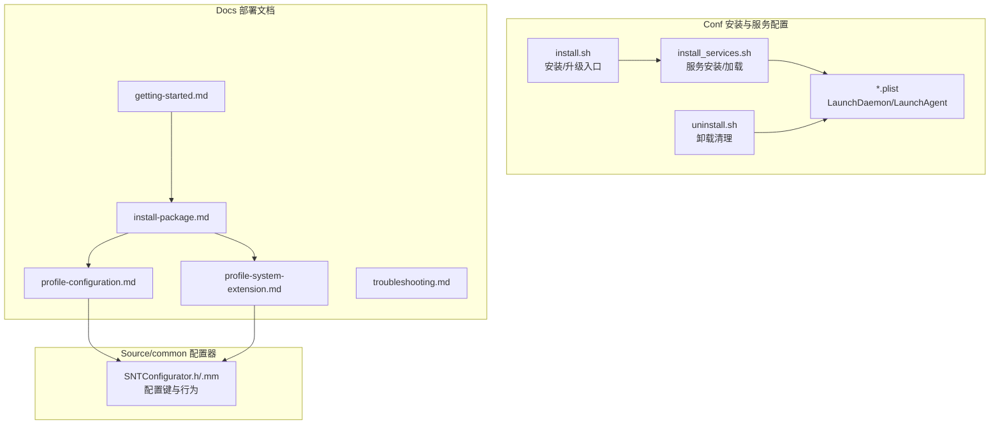
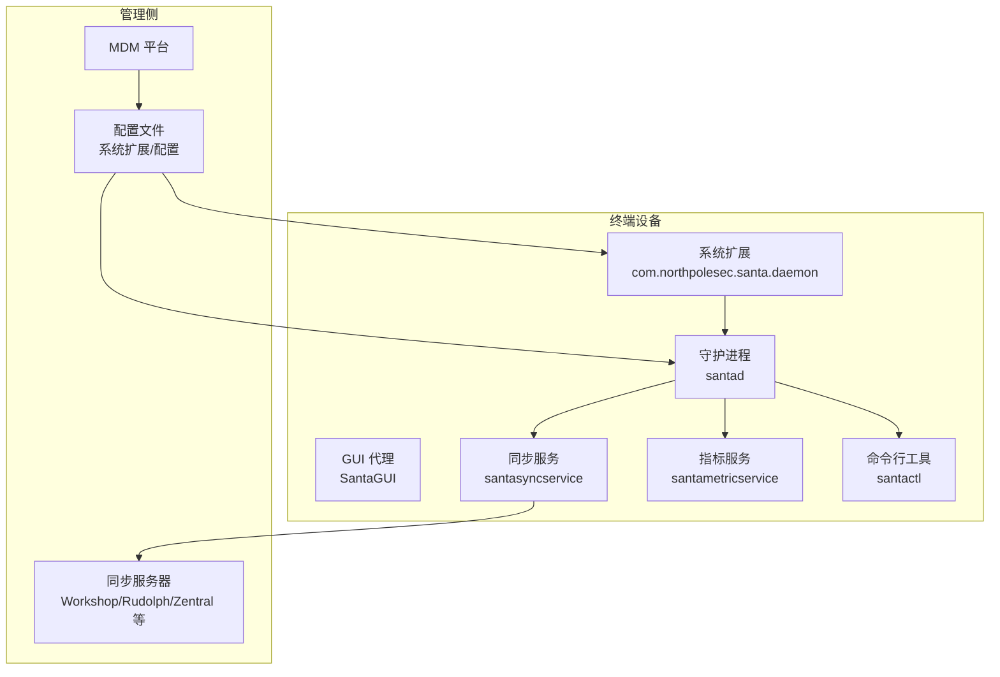
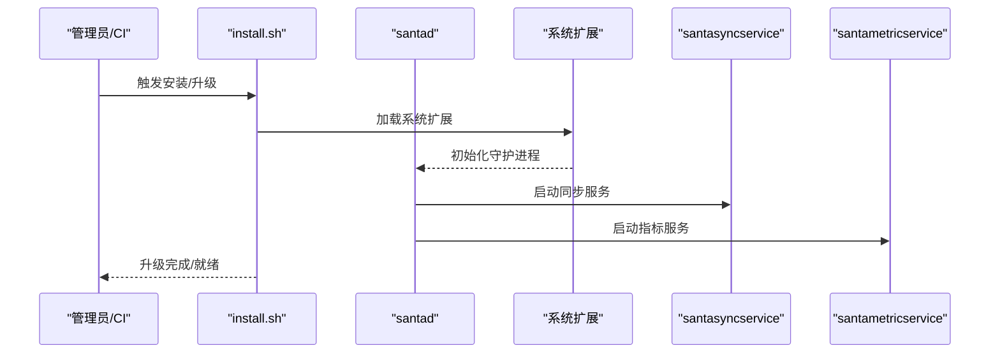
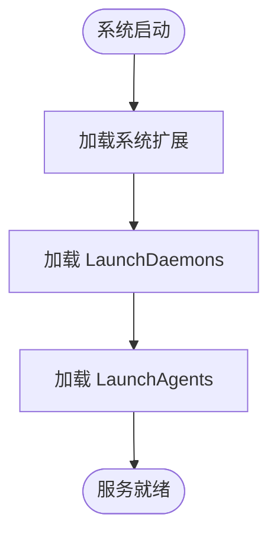
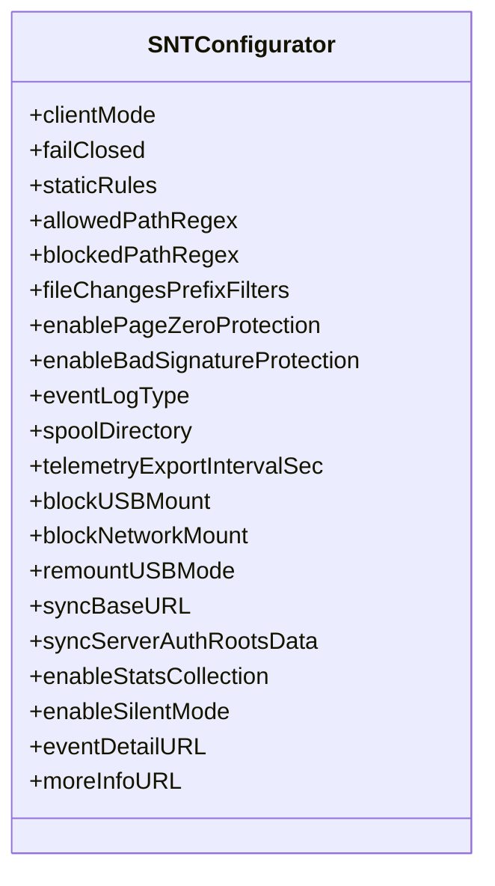
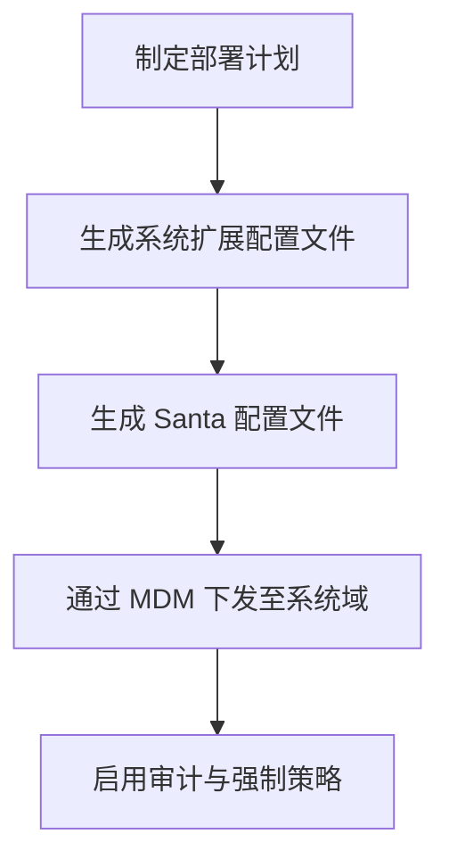

# 部署最佳实践

<cite>
**本文引用的文件**
- [README.md](file://README.md)
- [Conf/com.northpolesec.santa.plist](file://Conf/com.northpolesec.santa.plist)
- [Conf/com.northpolesec.santa.bundleservice.plist](file://Conf/com.northpolesec.santa.bundleservice.plist)
- [Conf/com.northpolesec.santa.metricservice.plist](file://Conf/com.northpolesec.santa.metricservice.plist)
- [Conf/com.northpolesec.santa.syncservice.plist](file://Conf/com.northpolesec.santa.syncservice.plist)
- [Conf/install.sh](file://Conf/install.sh)
- [Conf/install_services.sh](file://Conf/install_services.sh)
- [Conf/uninstall.sh](file://Conf/uninstall.sh)
- [docs/docs/deployment/getting-started.md](file://docs/docs/deployment/getting-started.md)
- [docs/docs/deployment/install-package.md](file://docs/docs/deployment/install-package.md)
- [docs/docs/deployment/profile-configuration.md](file://docs/docs/deployment/profile-configuration.md)
- [docs/docs/deployment/profile-system-extension.md](file://docs/docs/deployment/profile-system-extension.md)
- [docs/docs/deployment/troubleshooting.md](file://docs/docs/deployment/troubleshooting.md)
- [Source/common/SNTConfigurator.h](file://Source/common/SNTConfigurator.h)
- [Source/common/SNTConfigurator.mm](file://Source/common/SNTConfigurator.mm)
</cite>

## 目录
1. [简介](#简介)
2. [项目结构](#项目结构)
3. [核心组件](#核心组件)
4. [架构总览](#架构总览)
5. [详细组件分析](#详细组件分析)
6. [依赖关系分析](#依赖关系分析)
7. [性能考虑](#性能考虑)
8. [故障排查指南](#故障排查指南)
9. [结论](#结论)
10. [附录](#附录)

## 简介
本指南面向企业级部署 Santa 的工程团队与平台工程师，围绕“企业级部署方案、MDM 集成策略、自动化部署流程、配置文件管理、批量部署与滚动更新、监控告警、备份恢复与灾难恢复、合规与安全加固、部署验证与回滚、维护与版本升级”等主题，结合仓库中的安装脚本、LaunchDaemon/LaunchAgent 配置、文档页面与配置器源码，给出可落地的最佳实践。

Santa 是一个基于系统扩展的二进制与文件访问授权系统，由系统扩展（Endpoint Security）负责拦截与决策，配合守护进程、指标服务、同步服务与命令行工具协同工作。其特性包括多模式运行（监控/锁定/独立）、规则体系（签名、路径正则、静态规则）、事件日志与遥测导出、USB/网络挂载阻断、推送通知与远程同步等。

## 项目结构
仓库中与部署直接相关的目录与文件包括：
- Conf：安装与服务配置、LaunchDaemon/LaunchAgent plist、安装/卸载脚本
- docs/docs/deployment：官方部署文档（入门、包安装、配置/系统扩展配置文件、故障排查）
- Source/common：配置器接口与实现，定义了大量可由 MDM/同步服务器下发的配置键



图表来源
- [Conf/install.sh](file://Conf/install.sh#L1-L68)
- [Conf/install_services.sh](file://Conf/install_services.sh#L1-L64)
- [Conf/uninstall.sh](file://Conf/uninstall.sh#L1-L42)
- [docs/docs/deployment/getting-started.md](file://docs/docs/deployment/getting-started.md#L1-L21)
- [docs/docs/deployment/install-package.md](file://docs/docs/deployment/install-package.md#L1-L196)
- [docs/docs/deployment/profile-configuration.md](file://docs/docs/deployment/profile-configuration.md#L1-L118)
- [docs/docs/deployment/profile-system-extension.md](file://docs/docs/deployment/profile-system-extension.md#L1-L121)
- [docs/docs/deployment/troubleshooting.md](file://docs/docs/deployment/troubleshooting.md#L1-L116)
- [Source/common/SNTConfigurator.h](file://Source/common/SNTConfigurator.h#L1-L200)
- [Source/common/SNTConfigurator.mm](file://Source/common/SNTConfigurator.mm#L1-L120)

章节来源
- [Conf/install.sh](file://Conf/install.sh#L1-L68)
- [Conf/install_services.sh](file://Conf/install_services.sh#L1-L64)
- [Conf/uninstall.sh](file://Conf/uninstall.sh#L1-L42)
- [docs/docs/deployment/getting-started.md](file://docs/docs/deployment/getting-started.md#L1-L21)
- [docs/docs/deployment/install-package.md](file://docs/docs/deployment/install-package.md#L1-L196)
- [docs/docs/deployment/profile-configuration.md](file://docs/docs/deployment/profile-configuration.md#L1-L118)
- [docs/docs/deployment/profile-system-extension.md](file://docs/docs/deployment/profile-system-extension.md#L1-L121)
- [docs/docs/deployment/troubleshooting.md](file://docs/docs/deployment/troubleshooting.md#L1-L116)
- [Source/common/SNTConfigurator.h](file://Source/common/SNTConfigurator.h#L1-L200)
- [Source/common/SNTConfigurator.mm](file://Source/common/SNTConfigurator.mm#L1-L120)

## 核心组件
- 系统扩展（Endpoint Security）：负责拦截执行与文件访问事件，依据本地数据库与规则做出允许/拒绝决策。
- 守护进程（santad）：与系统扩展交互，维护决策缓存、事件数据库、规则下载与同步、文件访问策略等。
- GUI 代理（SantaGUI）：在阻断时向用户展示提示信息。
- 同步服务（santasyncservice）：从远端同步配置、规则与推送通知。
- 指标服务（santametricservice）：按配置导出指标到文件或 HTTP。
- 打包与安装脚本：提供静默安装、无缝升级、迁移支持与卸载清理。
- 配置器（SNTConfigurator）：统一读取与应用来自 MDM/同步服务器的配置键，控制运行模式、日志、USB/网络挂载、遥测导出等。

章节来源
- [README.md](file://README.md#L13-L21)
- [docs/docs/deployment/install-package.md](file://docs/docs/deployment/install-package.md#L1-L196)
- [Source/common/SNTConfigurator.h](file://Source/common/SNTConfigurator.h#L1-L200)

## 架构总览
下图展示了企业部署场景下的组件交互与数据流：



图表来源
- [docs/docs/deployment/profile-system-extension.md](file://docs/docs/deployment/profile-system-extension.md#L1-L121)
- [docs/docs/deployment/profile-configuration.md](file://docs/docs/deployment/profile-configuration.md#L1-L118)
- [docs/docs/deployment/install-package.md](file://docs/docs/deployment/install-package.md#L1-L196)
- [README.md](file://README.md#L113-L135)

## 详细组件分析

### 组件一：安装与升级流程（install.sh 与 install_services.sh）
- 升级策略要点
  - 若当前已安装且受防篡改保护，脚本通过创建迁移目录并调用命令行工具触发系统扩展完成升级，避免直接删除应用导致的冲突。
  - 对特定版本在锁定模式下进行临时放行（通过沙箱策略与规则添加），确保升级链路可用。
  - 升级后清理迁移缓存目录，保证干净状态。
- 服务安装流程
  - 在系统扩展启动前，通过 install_services.sh 卸载旧版服务与残留项，移除历史遗留配置，再安装新的 LaunchDaemon/LaunchAgent 并加载。
  - 支持在有图形用户登录时，以该用户身份卸载/加载 GUI 代理，确保一致性。



图表来源
- [Conf/install.sh](file://Conf/install.sh#L1-L68)
- [Conf/install_services.sh](file://Conf/install_services.sh#L1-L64)

章节来源
- [Conf/install.sh](file://Conf/install.sh#L1-L68)
- [Conf/install_services.sh](file://Conf/install_services.sh#L1-L64)

### 组件二：服务清单与生命周期（*.plist）
- LaunchDaemon
  - com.northpolesec.santa.bundleservice.plist：随需启动的 XPC 服务，用于打包与分发。
  - com.northpolesec.santa.metricservice.plist：常驻指标服务，按配置导出指标。
  - com.northpolesec.santa.syncservice.plist：随需启动的同步服务。
- LaunchAgent
  - com.northpolesec.santa.plist：用户态 GUI 代理，开机随用户登录加载。



图表来源
- [Conf/com.northpolesec.santa.plist](file://Conf/com.northpolesec.santa.plist#L1-L22)
- [Conf/com.northpolesec.santa.bundleservice.plist](file://Conf/com.northpolesec.santa.bundleservice.plist#L1-L33)
- [Conf/com.northpolesec.santa.metricservice.plist](file://Conf/com.northpolesec.santa.metricservice.plist#L1-L27)
- [Conf/com.northpolesec.santa.syncservice.plist](file://Conf/com.northpolesec.santa.syncservice.plist#L1-L27)

章节来源
- [Conf/com.northpolesec.santa.plist](file://Conf/com.northpolesec.santa.plist#L1-L22)
- [Conf/com.northpolesec.santa.bundleservice.plist](file://Conf/com.northpolesec.santa.bundleservice.plist#L1-L33)
- [Conf/com.northpolesec.santa.metricservice.plist](file://Conf/com.northpolesec.santa.metricservice.plist#L1-L27)
- [Conf/com.northpolesec.santa.syncservice.plist](file://Conf/com.northpolesec.santa.syncservice.plist#L1-L27)

### 组件三：配置器与配置键（SNTConfigurator）
- 运行模式与安全
  - 客户端模式（监控/锁定/独立）、失败关闭（FailClosed）等，影响系统在异常情况下的行为。
  - 路径白/黑名单正则、文件变更前缀过滤、签名与编译器透传规则等，决定授权与审计范围。
- 日志与遥测
  - 事件日志类型（syslog/file/protobuf 等）、缓冲目录与阈值、机器 ID 装饰、遥测导出间隔与批处理参数等。
- USB/网络挂载阻断
  - USB 挂载阻断、强制重挂载选项、网络挂载阻断与允许主机列表等。
- 同步与认证
  - 同步基础地址、协议传输开关、代理与额外请求头、客户端/服务端证书认证根。
- GUI 与通知
  - 关闭静默模式、禁用 TTY 提示、关于文本、更多详情链接与按钮文案等。



图表来源
- [Source/common/SNTConfigurator.h](file://Source/common/SNTConfigurator.h#L1-L200)
- [Source/common/SNTConfigurator.mm](file://Source/common/SNTConfigurator.mm#L1-L120)

章节来源
- [Source/common/SNTConfigurator.h](file://Source/common/SNTConfigurator.h#L1-L200)
- [Source/common/SNTConfigurator.mm](file://Source/common/SNTConfigurator.mm#L1-L120)

### 组件四：MDM 配置文件（系统扩展与配置）
- 系统扩展配置
  - 允许的 Team Identifier、扩展类型（Endpoint Security Extensions）与具体扩展标识，以及禁止移除策略，确保企业可控与抗绕过。
- 配置文件（Configuration Profile）
  - 包含客户端模式、事件详情链接、文件变更正则、机器标识映射、静默模式、遥测导出开关等键，通过 MDM 下发至系统域。



图表来源
- [docs/docs/deployment/profile-system-extension.md](file://docs/docs/deployment/profile-system-extension.md#L1-L121)
- [docs/docs/deployment/profile-configuration.md](file://docs/docs/deployment/profile-configuration.md#L1-L118)

章节来源
- [docs/docs/deployment/profile-system-extension.md](file://docs/docs/deployment/profile-system-extension.md#L1-L121)
- [docs/docs/deployment/profile-configuration.md](file://docs/docs/deployment/profile-configuration.md#L1-L118)

### 组件五：批量部署与滚动更新策略
- 包安装与 MDM
  - 使用 MDM 的“安装程序包”能力部署 PKG；推荐使用“审计与强制”模式，确保安装与不可移除。
  - Munki 可作为补充，将 Santa 纳入 managed_installs，并利用其强制安装与回滚能力。
- 滚动更新
  - 利用安装脚本的升级逻辑与系统扩展的迁移通道，在锁定模式下对升级组件添加临时放行规则，降低升级中断风险。
  - 建议按部门/业务分批滚动，结合临时监控模式与推送通知，缩短全量生效时间。

章节来源
- [docs/docs/deployment/install-package.md](file://docs/docs/deployment/install-package.md#L1-L196)
- [Conf/install.sh](file://Conf/install.sh#L1-L68)

### 组件六：监控告警与日志
- 日志输出
  - syslog/file/protobuf 等多种格式；可配置缓冲目录大小、单文件阈值与最大刷新时间，平衡实时性与磁盘占用。
- 遥测导出
  - 开启遥测导出后，可按间隔与批次阈值聚合上传，便于集中分析与告警。
- 告警建议
  - 基于事件日志与遥测指标建立阈值告警（如未知执行数、阻断率、同步失败次数、USB/网络挂载异常）。

章节来源
- [Source/common/SNTConfigurator.h](file://Source/common/SNTConfigurator.h#L200-L360)
- [Source/common/SNTConfigurator.mm](file://Source/common/SNTConfigurator.mm#L120-L360)

### 组件七：备份恢复与灾难恢复
- 卸载脚本
  - 卸载系统扩展、服务与应用，清理 LaunchDaemon/LaunchAgent 配置与符号链接；保留日志与配置以便审计。
- 备份建议
  - 定期备份 /var/db/santa 下的状态与规则数据、日志与遥测文件，以及 MDM 配置文件模板。
- 灾难恢复
  - 通过相同 MDM 配置快速重建；若系统扩展被禁用，使用命令行强制加载并检查状态。

章节来源
- [Conf/uninstall.sh](file://Conf/uninstall.sh#L1-L42)
- [docs/docs/deployment/troubleshooting.md](file://docs/docs/deployment/troubleshooting.md#L1-L116)

### 组件八：合规性、安全加固与审计
- 合规与最小权限
  - 仅允许必要扩展类型与扩展标识，启用“不可移除”策略，减少绕过风险。
- 安全加固
  - 启用签名与坏签保护、禁止 SUSPEND/RESUME 抗篡改（如仍启用）、合理设置日志与遥测。
- 审计跟踪
  - 通过事件日志与遥测导出记录决策与异常，结合机器 ID 与用户信息进行关联分析。

章节来源
- [docs/docs/deployment/profile-system-extension.md](file://docs/docs/deployment/profile-system-extension.md#L1-L121)
- [Source/common/SNTConfigurator.h](file://Source/common/SNTConfigurator.h#L160-L220)
- [Source/common/SNTConfigurator.mm](file://Source/common/SNTConfigurator.mm#L360-L520)

### 组件九：部署验证、性能测试与回滚
- 部署验证
  - 使用命令行工具查看版本、状态与同步信息，确认各服务已加载、日志与遥测正常。
- 性能测试
  - 评估规则数量、路径正则复杂度、文件变更前缀过滤与事件缓冲参数对 CPU/内存的影响。
- 回滚机制
  - 卸载脚本可一键卸载并保留配置；在升级失败时，可通过 MDM 重新下发旧配置或降级包。

章节来源
- [docs/docs/deployment/install-package.md](file://docs/docs/deployment/install-package.md#L148-L196)
- [docs/docs/deployment/troubleshooting.md](file://docs/docs/deployment/troubleshooting.md#L1-L116)
- [Conf/uninstall.sh](file://Conf/uninstall.sh#L1-L42)

### 组件十：部署后维护、版本升级与配置变更管理
- 版本升级
  - 使用官方 PKG 或 MDM/Munki 推送新版本；升级脚本自动处理迁移与临时放行。
- 配置变更
  - 通过 MDM 下发配置文件，优先采用系统扩展与配置文件双轨；变更前先在小范围灰度验证。
- 变更管理
  - 记录每次变更的配置键、生效时间与影响范围；结合临时监控模式与推送通知，降低变更风险。

章节来源
- [docs/docs/deployment/install-package.md](file://docs/docs/deployment/install-package.md#L1-L196)
- [docs/docs/deployment/profile-configuration.md](file://docs/docs/deployment/profile-configuration.md#L1-L118)

## 依赖关系分析
- 组件耦合
  - 系统扩展与守护进程强耦合，守护进程依赖同步服务与指标服务；GUI 代理依赖守护进程状态。
- 外部依赖
  - MDM 平台用于下发系统扩展与配置文件；同步服务器用于规则与推送。
- 潜在环路
  - 配置键通过 KVO 影响运行态，注意避免在回调中引发重复写入。

```mermaid
graph LR
Sysx["系统扩展"] --> Daemon["守护进程"]
Daemon --> Sync["同步服务"]
Daemon --> Metrics["指标服务"]
Daemon --> GUI["GUI 代理"]
MDM["MDM"] --> Sysx
MDM --> Daemon
Sync <- --> Server["同步服务器"]
```

图表来源
- [docs/docs/deployment/profile-system-extension.md](file://docs/docs/deployment/profile-system-extension.md#L1-L121)
- [docs/docs/deployment/install-package.md](file://docs/docs/deployment/install-package.md#L1-L196)
- [README.md](file://README.md#L113-L135)

章节来源
- [docs/docs/deployment/profile-system-extension.md](file://docs/docs/deployment/profile-system-extension.md#L1-L121)
- [docs/docs/deployment/install-package.md](file://docs/docs/deployment/install-package.md#L1-L196)
- [README.md](file://README.md#L113-L135)

## 性能考虑
- 文件变更日志
  - 使用前缀过滤减少内核层日志生成，避免过度消耗内存与 I/O。
- 事件缓冲
  - 合理设置缓冲目录大小与刷新时间，兼顾延迟与磁盘占用。
- 正则匹配
  - 路径正则应简洁明确，避免回溯开销；必要时使用前缀过滤替代。
- 规则数量
  - 控制签名/路径规则数量，定期清理无效规则，保持决策路径短路。

章节来源
- [Source/common/SNTConfigurator.h](file://Source/common/SNTConfigurator.h#L120-L170)
- [Source/common/SNTConfigurator.h](file://Source/common/SNTConfigurator.h#L230-L320)

## 故障排查指南
- 常见问题定位
  - 使用命令行工具查看状态与医生诊断；检查系统扩展是否激活；确认 Full Disk Access 已授予。
- 企业环境
  - 确认 MDM 监督关系与配置文件下发成功；核对系统扩展与 TCC/PPPC 配置是否一致。
- 日志与遥测
  - 使用系统日志流查看调试信息；结合遥测导出来定位异常。

章节来源
- [docs/docs/deployment/troubleshooting.md](file://docs/docs/deployment/troubleshooting.md#L1-L116)

## 结论
通过 MDM 下发系统扩展与配置文件、使用 PKG/Munki 实现批量安装与滚动升级、借助安装脚本与守护进程的协同、结合配置器的丰富键值实现精细化管控，Santa 可在企业环境中实现高可靠、可审计、可回滚的部署与运维。建议将“最小权限、不可移除、审计与告警”作为默认策略，并以灰度与临时监控模式保障变更安全。

## 附录
- 不同规模组织的部署建议
  - 小型组织：使用 MDM 的安装程序包能力，集中管理配置文件；通过 Homebrew 或手动安装进行试点。
  - 中型企业：引入 Munki 作为补充，结合审计与强制策略；按部门分批滚动升级。
  - 大型企业：采用 MDM 主导，系统扩展与配置文件双轨下发；建立变更评审与回滚预案。
- 资源规划与成本优化
  - 合理设置日志与遥测参数，避免过度磁盘与网络开销；利用推送通知减少全量同步频率。
- 合规与安全
  - 严格限制系统扩展类型与扩展标识；启用不可移除策略；定期审计日志与规则有效性。