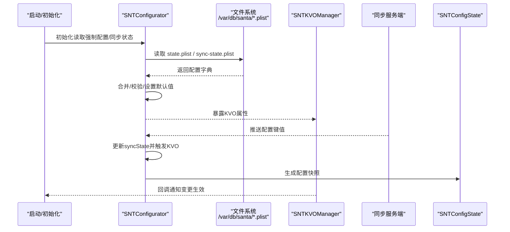
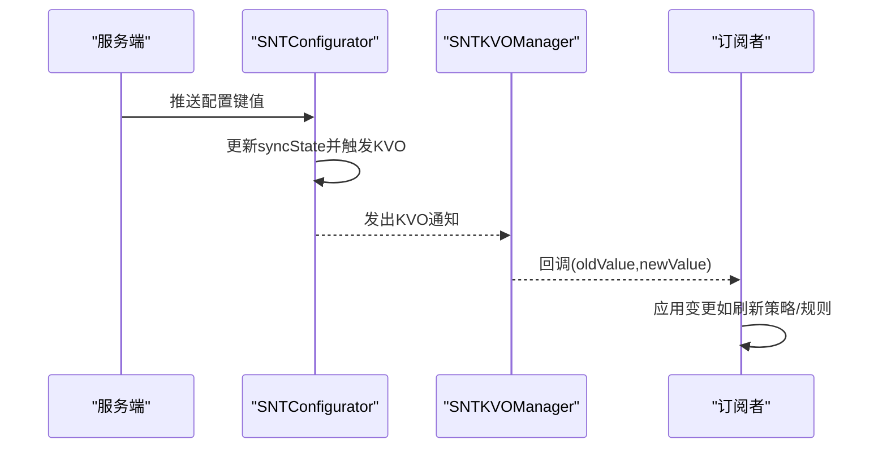
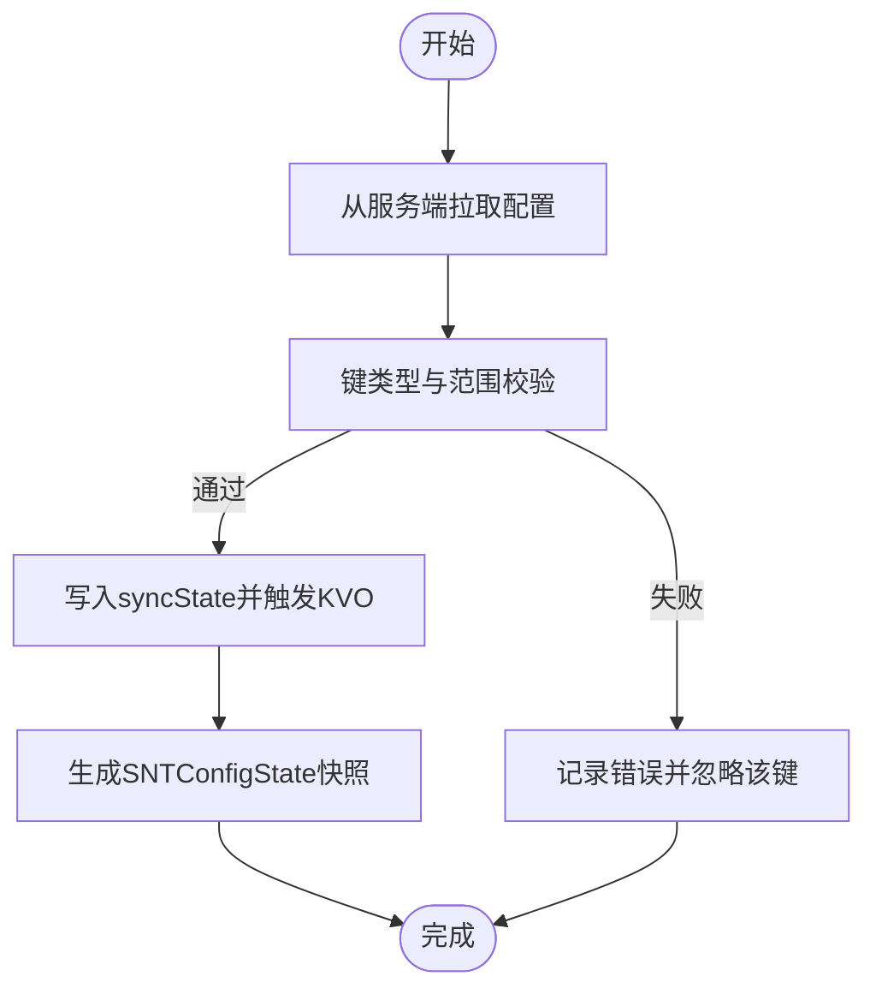
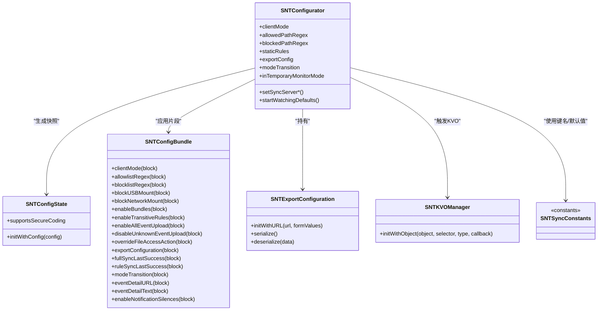

# 运行时配置

<cite>
**本文引用的文件**
- [SNTConfigurator.h](file://Source/common/SNTConfigurator.h)
- [SNTConfigurator.mm](file://Source/common/SNTConfigurator.mm)
- [SNTConfigState.h](file://Source/common/SNTConfigState.h)
- [SNTConfigState.mm](file://Source/common/SNTConfigState.mm)
- [SNTConfigBundle.h](file://Source/common/SNTConfigBundle.h)
- [SNTConfigBundle.mm](file://Source/common/SNTConfigBundle.mm)
- [SNTExportConfiguration.h](file://Source/common/SNTExportConfiguration.h)
- [SNTExportConfiguration.mm](file://Source/common/SNTExportConfiguration.mm)
- [SNTKVOManager.h](file://Source/common/SNTKVOManager.h)
- [SNTKVOManager.mm](file://Source/common/SNTKVOManager.mm)
- [SNTSyncConstants.h](file://Source/common/SNTSyncConstants.h)
- [SNTSyncConstants.mm](file://Source/common/SNTSyncConstants.mm)
- [com.northpolesec.santa.plist](file://Conf/com.northpolesec.santa.plist)
</cite>

## 目录
1. [简介](#简介)
2. [项目结构](#项目结构)
3. [核心组件](#核心组件)
4. [架构总览](#架构总览)
5. [组件详解](#组件详解)
6. [依赖关系分析](#依赖关系分析)
7. [性能考量](#性能考量)
8. [故障排查指南](#故障排查指南)
9. [结论](#结论)
10. [附录](#附录)

## 简介
本文件面向Santa运行时配置管理，系统化阐述配置的动态更新机制、优先级与继承关系、加载顺序、覆盖与冲突解决策略、变更通知（KVO）、实时生效项、配置验证与错误处理、回滚机制、热重载与同步、备份与恢复，以及调试与诊断流程。目标是帮助开发者与运维人员在不深入源码的前提下，理解并正确使用Santa的配置体系。

## 项目结构
Santa的运行时配置主要由以下模块构成：
- 配置读取与聚合：SNTConfigurator负责从多来源读取配置、维护状态、暴露KVO属性，并定义键类型与默认值。
- 配置快照：SNTConfigState用于对某一时刻的配置进行安全编码，便于持久化或跨组件传递。
- 配置包：SNTConfigBundle封装可序列化的配置片段，支持按字段回调式应用。
- 导出配置：SNTExportConfiguration描述外部导出目标及表单参数，支持序列化与反序列化。
- KVO监听：SNTKVOManager提供统一的KVO观察器注册与回调分发。
- 同步常量：SNTSyncConstants定义与服务端交互的键名、默认值与行为约束。
- 配置来源：系统通过mobileconfig与plist注入初始配置；守护进程启动后读取磁盘状态文件。

```mermaid
graph TB
subgraph "配置来源"
MC["mobileconfig 键集<br/>域 com.northpolesec.santa"]
Plist["/var/db/santa/*.plist<br/>state/sync-state"]
end
subgraph "配置聚合层"
Cfg["SNTConfigurator<br/>读取/合并/暴露KVO属性"]
State["SNTConfigState<br/>配置快照"]
Bundle["SNTConfigBundle<br/>配置片段"]
Export["SNTExportConfiguration<br/>导出配置"]
end
subgraph "监听与通知"
KVO["SNTKVOManager<br/>KVO观察器"]
end
subgraph "同步与服务端"
SyncConst["SNTSyncConstants<br/>键名/默认值/协议常量"]
Srv["同步服务端"]
end
MC --> Cfg
Plist --> Cfg
Cfg --> State
Cfg --> Bundle
Cfg --> Export
Cfg --> KVO
Cfg <- --> Srv
SyncConst --> Cfg
```

图表来源
- [SNTConfigurator.mm](file://Source/common/SNTConfigurator.mm#L233-L395)
- [SNTConfigState.mm](file://Source/common/SNTConfigState.mm#L22-L50)
- [SNTConfigBundle.mm](file://Source/common/SNTConfigBundle.mm#L45-L101)
- [SNTExportConfiguration.mm](file://Source/common/SNTExportConfiguration.mm#L27-L52)
- [SNTKVOManager.mm](file://Source/common/SNTKVOManager.mm#L28-L70)
- [SNTSyncConstants.mm](file://Source/common/SNTSyncConstants.mm#L18-L63)

章节来源
- [SNTConfigurator.mm](file://Source/common/SNTConfigurator.mm#L233-L395)
- [SNTSyncConstants.mm](file://Source/common/SNTSyncConstants.mm#L18-L63)

## 核心组件
- SNTConfigurator：单例配置中心，负责：
  - 初始化与KVO绑定
  - 读取强制配置（forced config）与同步状态（sync state）
  - 维护configState/syncState/state三类状态
  - 定义键类型映射与默认值
  - 提供KVO依赖关系与派生属性
- SNTConfigState：对当前配置的快照，支持NSSecureCoding。
- SNTConfigBundle：可序列化的配置片段，按字段回调应用。
- SNTExportConfiguration：导出目标与表单参数的序列化对象。
- SNTKVOManager：通用KVO观察器，自动清理。
- SNTSyncConstants：同步协议键名、默认值与行为常量。

章节来源
- [SNTConfigurator.h](file://Source/common/SNTConfigurator.h#L24-L120)
- [SNTConfigurator.mm](file://Source/common/SNTConfigurator.mm#L233-L395)
- [SNTConfigState.h](file://Source/common/SNTConfigState.h#L15-L32)
- [SNTConfigState.mm](file://Source/common/SNTConfigState.mm#L22-L50)
- [SNTConfigBundle.h](file://Source/common/SNTConfigBundle.h#L15-L48)
- [SNTConfigBundle.mm](file://Source/common/SNTConfigBundle.mm#L45-L101)
- [SNTExportConfiguration.h](file://Source/common/SNTExportConfiguration.h#L15-L28)
- [SNTExportConfiguration.mm](file://Source/common/SNTExportConfiguration.mm#L27-L52)
- [SNTKVOManager.h](file://Source/common/SNTKVOManager.h#L15-L35)
- [SNTKVOManager.mm](file://Source/common/SNTKVOManager.mm#L28-L70)
- [SNTSyncConstants.h](file://Source/common/SNTSyncConstants.h#L15-L63)
- [SNTSyncConstants.mm](file://Source/common/SNTSyncConstants.mm#L18-L63)

## 架构总览
配置生命周期与交互如下：



图表来源
- [SNTConfigurator.mm](file://Source/common/SNTConfigurator.mm#L233-L395)
- [SNTKVOManager.mm](file://Source/common/SNTKVOManager.mm#L28-L70)
- [SNTConfigState.mm](file://Source/common/SNTConfigState.mm#L22-L50)

## 组件详解

### 配置优先级与继承关系
- 来源与优先级（从高到低）：
  1) 同步状态（syncState）：来自服务端推送的配置片段，覆盖强制配置。
  2) 强制配置（forced config）：来自mobileconfig与plist注入的初始配置。
  3) 临时监控模式（inTemporaryMonitorMode）：若启用，会强制客户端模式为监控模式，覆盖其他来源。
- 典型继承关系：
  - 客户端模式（clientMode）：优先取自syncState中的数值，其次取自configState，最后受临时监控模式影响。
  - 路径正则（allowlist/blocklist）：优先取自syncState，其次取自configState。
  - USB/网络挂载策略：优先取自syncState，其次取自configState。
  - 导出配置（exportConfig）、模式切换（modeTransition）：来自syncState。
- KVO依赖：
  - 多个属性的keyPath依赖于syncStateSet与configStateSet，确保变更能正确传播。

章节来源
- [SNTConfigurator.mm](file://Source/common/SNTConfigurator.mm#L454-L784)
- [SNTConfigurator.h](file://Source/common/SNTConfigurator.h#L33-L120)

### 加载顺序与覆盖机制
- 启动阶段：
  1) 初始化默认域与suite。
  2) 读取强制配置（forced config）。
  3) 读取同步状态（syncState），必要时迁移旧键。
  4) 若允许访问，读取状态文件（state）并迁移旧路径。
  5) 开始监听NSUserDefaults变化。
- 覆盖策略：
  - 同步状态键与强制配置键分别维护类型映射，仅当类型匹配时才覆盖。
  - 对于某些键（如事件日志、遥测等），注释明确指出应在启动时读取，避免运行时更改。
  - 临时监控模式会强制覆盖客户端模式，直到离开该模式。

章节来源
- [SNTConfigurator.mm](file://Source/common/SNTConfigurator.mm#L233-L395)
- [SNTConfigurator.h](file://Source/common/SNTConfigurator.h#L190-L240)

### 冲突解决策略
- 类型校验：键类型映射严格限定，非预期类型会被忽略，避免错误覆盖。
- 默认值：未设置时采用合理默认，减少冲突。
- 临时模式：临时监控模式优先级最高，确保在特定窗口内强制宽松策略。
- 服务端与本地配置冲突时，以服务端为准（syncState），但需满足类型与范围约束。

章节来源
- [SNTConfigurator.mm](file://Source/common/SNTConfigurator.mm#L247-L368)
- [SNTConfigurator.mm](file://Source/common/SNTConfigurator.mm#L787-L800)

### 变更通知机制、KVO监听与实时生效
- KVO实现：
  - SNTConfigurator公开所有配置属性为KVO合规。
  - 通过keyPathsForValuesAffectingXxx方法声明依赖，保证派生属性正确更新。
  - SNTKVOManager提供统一观察器注册与回调，自动移除观察者。
- 实时生效：
  - 客户端模式、路径正则、USB/网络挂载策略等在KVO回调中即时生效。
  - 部分属性（如事件日志类型、路径等）注释提示应在启动时读取，避免运行时更改带来的不可控副作用。



图表来源
- [SNTConfigurator.mm](file://Source/common/SNTConfigurator.mm#L454-L784)
- [SNTKVOManager.mm](file://Source/common/SNTKVOManager.mm#L28-L70)

章节来源
- [SNTConfigurator.mm](file://Source/common/SNTConfigurator.mm#L454-L784)
- [SNTKVOManager.h](file://Source/common/SNTKVOManager.h#L15-L35)
- [SNTKVOManager.mm](file://Source/common/SNTKVOManager.mm#L28-L70)

### 配置验证、错误处理与回滚
- 验证：
  - 键类型映射：仅接受预期类型，非预期类型被忽略。
  - 值范围约束：部分键有最小/最大值限制（如遥测导出间隔、超时等）。
- 错误处理：
  - 导出配置序列化失败时记录错误日志。
  - KVO观察器注册前检查对象是否响应选择器，否则记录错误并返回nil。
- 回滚：
  - 代码未实现显式“回滚”逻辑；建议通过重新拉取服务端配置或恢复强制配置文件实现回滚。

章节来源
- [SNTConfigurator.mm](file://Source/common/SNTConfigurator.mm#L247-L368)
- [SNTExportConfiguration.mm](file://Source/common/SNTExportConfiguration.mm#L58-L86)
- [SNTKVOManager.mm](file://Source/common/SNTKVOManager.mm#L35-L42)

### 热重载、配置同步与备份恢复
- 热重载：
  - 通过KVO与同步状态实时更新，无需重启即可生效。
  - 对于需要启动时读取的属性，应结合重启或特殊流程触发。
- 同步：
  - 服务端键名与默认值集中定义于SNTSyncConstants。
  - 支持二进制protobuf传输开关、代理配置、额外请求头等。
- 备份与恢复：
  - 强制配置与同步状态分别存储于/var/db/santa目录下的plist文件。
  - 可通过备份这些文件实现配置恢复。



图表来源
- [SNTConfigurator.mm](file://Source/common/SNTConfigurator.mm#L247-L368)
- [SNTConfigState.mm](file://Source/common/SNTConfigState.mm#L22-L50)
- [SNTSyncConstants.mm](file://Source/common/SNTSyncConstants.mm#L18-L63)

章节来源
- [SNTConfigurator.mm](file://Source/common/SNTConfigurator.mm#L233-L395)
- [SNTSyncConstants.h](file://Source/common/SNTSyncConstants.h#L15-L63)
- [SNTSyncConstants.mm](file://Source/common/SNTSyncConstants.mm#L18-L63)

### 配置调试与诊断
- 关键调试点：
  - 查看KVO回调是否触发（确认观察器注册成功）。
  - 检查syncState与configState的差异，定位覆盖关系。
  - 校验键类型映射与默认值，确认未被忽略。
  - 观察临时监控模式是否生效。
- 常见诊断步骤：
  - 确认/var/db/santa/state.plist与sync-state.plist存在且可读。
  - 检查服务端推送的键是否在SNTSyncConstants中定义。
  - 如导出失败，查看导出配置序列化日志。

章节来源
- [SNTKVOManager.mm](file://Source/common/SNTKVOManager.mm#L28-L70)
- [SNTConfigurator.mm](file://Source/common/SNTConfigurator.mm#L233-L395)
- [SNTExportConfiguration.mm](file://Source/common/SNTExportConfiguration.mm#L58-L86)

## 依赖关系分析



图表来源
- [SNTConfigurator.h](file://Source/common/SNTConfigurator.h#L24-L120)
- [SNTConfigurator.mm](file://Source/common/SNTConfigurator.mm#L454-L784)
- [SNTConfigState.h](file://Source/common/SNTConfigState.h#L15-L32)
- [SNTConfigState.mm](file://Source/common/SNTConfigState.mm#L22-L50)
- [SNTConfigBundle.h](file://Source/common/SNTConfigBundle.h#L15-L48)
- [SNTConfigBundle.mm](file://Source/common/SNTConfigBundle.mm#L103-L229)
- [SNTExportConfiguration.h](file://Source/common/SNTExportConfiguration.h#L15-L28)
- [SNTExportConfiguration.mm](file://Source/common/SNTExportConfiguration.mm#L27-L52)
- [SNTKVOManager.h](file://Source/common/SNTKVOManager.h#L15-L35)
- [SNTSyncConstants.h](file://Source/common/SNTSyncConstants.h#L15-L63)

章节来源
- [SNTConfigurator.h](file://Source/common/SNTConfigurator.h#L24-L120)
- [SNTConfigurator.mm](file://Source/common/SNTConfigurator.mm#L454-L784)
- [SNTConfigBundle.mm](file://Source/common/SNTConfigBundle.mm#L103-L229)
- [SNTExportConfiguration.mm](file://Source/common/SNTExportConfiguration.mm#L27-L52)
- [SNTKVOManager.mm](file://Source/common/SNTKVOManager.mm#L28-L70)
- [SNTSyncConstants.mm](file://Source/common/SNTSyncConstants.mm#L18-L63)

## 性能考量
- 正则与前缀过滤：
  - 文件变更前缀过滤（fileChangesPrefixFilters）在内核侧生效，减少用户态开销；注意节点总数限制与UTF-8编码对节点数的影响。
- 日志与遥测：
  - 事件日志类型与缓冲区大小、阈值、刷新时间等参数影响I/O与内存占用。
  - 遥测导出批次大小与文件数量限制影响上传吞吐与磁盘压力。
- KVO与回调：
  - 频繁变更可能引发大量回调，建议订阅者内部做去抖/节流。

章节来源
- [SNTConfigurator.h](file://Source/common/SNTConfigurator.h#L118-L166)
- [SNTConfigurator.h](file://Source/common/SNTConfigurator.h#L211-L270)
- [SNTConfigurator.h](file://Source/common/SNTConfigurator.h#L271-L317)

## 故障排查指南
- KVO未触发：
  - 检查对象是否响应对应选择器；确认观察器已注册并在有效生命周期内。
- 配置未生效：
  - 确认键类型匹配；检查是否被临时监控模式覆盖；核对syncState与configState的优先级。
- 导出失败：
  - 查看导出配置序列化/反序列化错误日志。
- 同步异常：
  - 核对SNTSyncConstants中的键名与默认值；检查代理、额外头部与证书链配置。

章节来源
- [SNTKVOManager.mm](file://Source/common/SNTKVOManager.mm#L35-L42)
- [SNTExportConfiguration.mm](file://Source/common/SNTExportConfiguration.mm#L58-L86)
- [SNTSyncConstants.mm](file://Source/common/SNTSyncConstants.mm#L18-L63)

## 结论
Santa的运行时配置通过SNTConfigurator统一聚合与分发，结合SNTConfigBundle与SNTExportConfiguration实现灵活的片段化配置与导出能力。KVO机制确保配置变更的实时性，同时通过严格的键类型映射与默认值保障稳定性。对于需要启动时读取的属性，应遵循设计约束；对于需要回滚的场景，可通过恢复强制配置或重新拉取服务端配置实现。配合日志与调试步骤，可高效定位与解决问题。

## 附录
- 配置来源示例（守护进程启动）：
  - 通过系统服务配置文件启动守护进程，守护进程再加载/var/db/santa下的状态与同步状态文件。

章节来源
- [com.northpolesec.santa.plist](file://Conf/com.northpolesec.santa.plist#L1-L22)