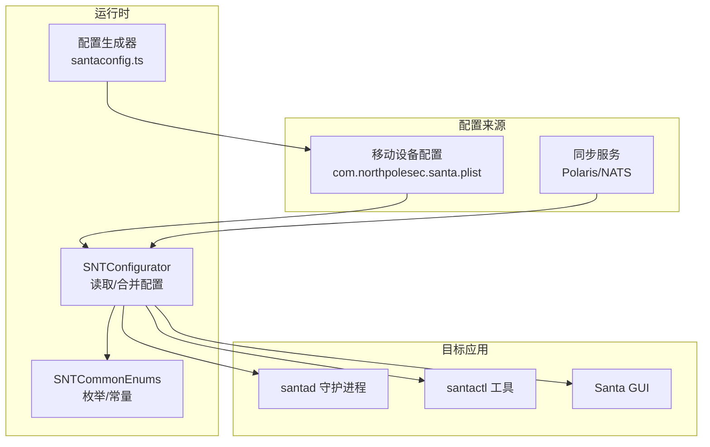
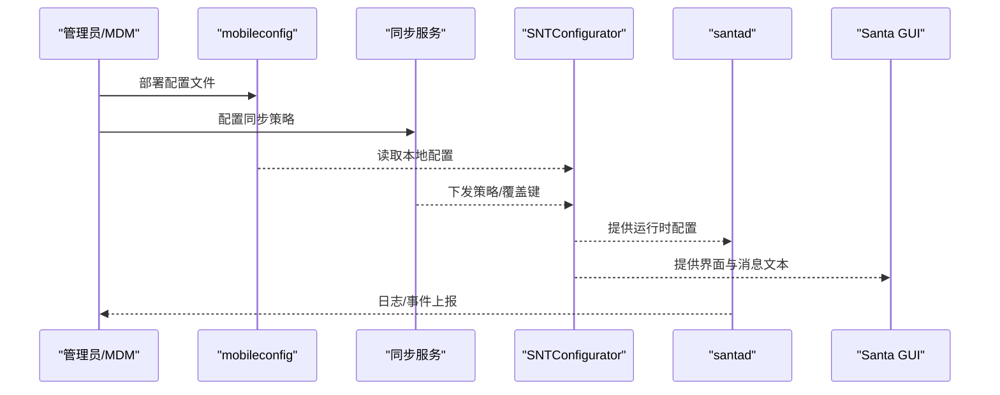
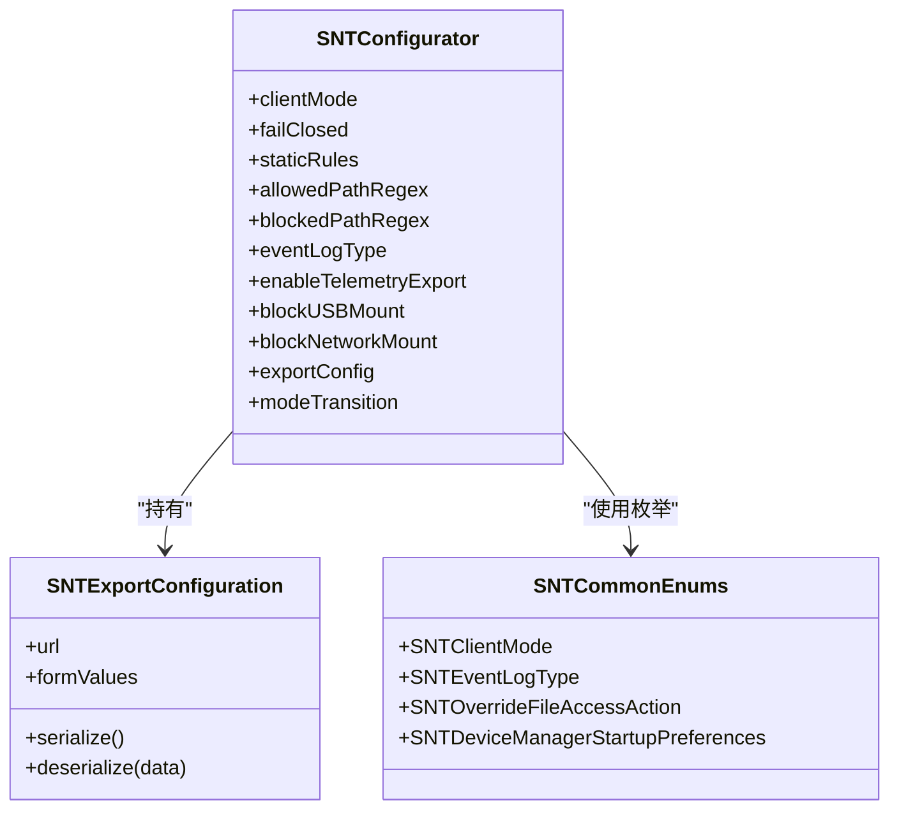

# 配置文件格式

<cite>
**本文引用的文件**
- [SNTConfigurator.h](file://Source/common/SNTConfigurator.h)
- [SNTConfigurator.mm](file://Source/common/SNTConfigurator.mm)
- [SNTCommonEnums.h](file://Source/common/SNTCommonEnums.h)
- [santaconfig.ts](file://docs/src/lib/santaconfig.ts)
- [keys.mdx](file://docs/docs/configuration/keys.mdx)
- [generator.mdx](file://docs/docs/configuration/generator.mdx)
- [com.northpolesec.santa.plist](file://Conf/com.northpolesec.santa.plist)
- [sync_preflight_request.json](file://Source/santasyncservice/testdata/sync_preflight_request.json)
- [sync_preflight_lockdown.json](file://Source/santasyncservice/testdata/sync_preflight_lockdown.json)
- [sync_preflight_standalone.json](file://Source/santasyncservice/testdata/sync_preflight_standalone.json)
- [sync_preflight_turn_off_blockusb.json](file://Source/santasyncservice/testdata/sync_preflight_turn_off_blockusb.json)
- [sync_preflight_turn_on_blockusb.json](file://Source/santasyncservice/testdata/sync_preflight_turn_on_blockusb.json)
- [SNTExportConfiguration.h](file://Source/common/SNTExportConfiguration.h)
- [SNTExportConfiguration.mm](file://Source/common/SNTExportConfiguration.mm)
</cite>

## 目录
1. [简介](#简介)
2. [项目结构](#项目结构)
3. [核心组件](#核心组件)
4. [架构总览](#架构总览)
5. [详细组件分析](#详细组件分析)
6. [依赖关系分析](#依赖关系分析)
7. [性能考量](#性能考量)
8. [故障排查指南](#故障排查指南)
9. [结论](#结论)
10. [附录](#附录)

## 简介
本文件系统性阐述 Santa 的配置文件格式与配置键语义，覆盖 plist 结构、语法与字段定义；详解客户端模式、路径规则、日志与遥测、USB 挂载控制、网络挂载控制、指标导出、同步与认证等关键配置项。文档同时提供配置键参考手册（含作用、数据类型、默认值、取值范围、是否可被同步服务器覆盖）、配置示例来源、验证方法与常见错误排查建议，帮助管理员在不同部署场景下安全、稳定地使用 Santa。

## 项目结构
Santa 的配置由两部分组成：
- 运行时配置：通过移动设备配置（mobileconfig）注入到 com.northpolesec.santa 域，由 SNTConfigurator 统一读取与管理。
- 同步下发配置：通过同步服务（Polaris/NATS）下发的策略与状态，覆盖或补充运行时配置。

**图表来源**
- [SNTConfigurator.mm](file://Source/common/SNTConfigurator.mm#L233-L368)
- [SNTCommonEnums.h](file://Source/common/SNTCommonEnums.h#L84-L145)
- [santaconfig.ts](file://docs/src/lib/santaconfig.ts#L69-L136)
- [com.northpolesec.santa.plist](file://Conf/com.northpolesec.santa.plist#L1-L22)

**章节来源**
- [SNTConfigurator.mm](file://Source/common/SNTConfigurator.mm#L233-L368)
- [com.northpolesec.santa.plist](file://Conf/com.northpolesec.santa.plist#L1-L22)

## 核心组件
- SNTConfigurator：单例配置管理器，负责从 mobileconfig 与同步状态中读取配置，维护强制配置与同步配置集合，并暴露 KVO 可观察属性供各模块使用。
- SNTCommonEnums：集中定义客户端模式、事件日志类型、文件访问策略决策、USB 启动行为等枚举，确保配置与实现一致。
- 配置生成器（santaconfig.ts + 文档页面）：提供交互式配置生成与校验，输出符合规范的配置字典，便于打包为 mobileconfig。

关键职责与关系：
- 键类型映射：SNTConfigurator 在初始化时建立“同步键类型”和“强制配置键类型”的映射，确保类型正确性与兼容性。
- 同步覆盖：当同步服务下发配置时，会覆盖部分可被覆盖的键；未覆盖的键回退到本地 mobileconfig。
- 枚举一致性：配置中的整数型枚举值与内部枚举一一对应，避免运行期不一致。

**章节来源**
- [SNTConfigurator.h](file://Source/common/SNTConfigurator.h#L31-L120)
- [SNTConfigurator.mm](file://Source/common/SNTConfigurator.mm#L247-L368)
- [SNTCommonEnums.h](file://Source/common/SNTCommonEnums.h#L84-L145)
- [santaconfig.ts](file://docs/src/lib/santaconfig.ts#L69-L136)

## 架构总览
下图展示配置从输入到生效的关键流程：mobileconfig 与同步下发配置经 SNTConfigurator 合并后，驱动 santad、santactl 与 GUI 的行为。

**图表来源**
- [SNTConfigurator.mm](file://Source/common/SNTConfigurator.mm#L233-L368)
- [keys.mdx](file://docs/docs/configuration/keys.mdx#L1-L72)

**章节来源**
- [SNTConfigurator.mm](file://Source/common/SNTConfigurator.mm#L233-L368)
- [keys.mdx](file://docs/docs/configuration/keys.mdx#L1-L72)

## 详细组件分析

### 通用配置（General）
- ClientMode（整数枚举）：Monitor=1、Lockdown=2、Standalone=3。支持被同步服务器覆盖。
- FailClosed（布尔）：仅在 Lockdown 模式下生效，错误时拒绝执行，默认 false。
- EnableStandalonePasswordFallback（布尔）：Standalone 模式下允许密码替代指纹，默认 true。
- IgnoreOtherEndpointSecurityClients（布尔）：忽略其他 EndpointSecurity 客户端事件，默认 false。
- EnableStatsCollection（布尔）：启用统计上报，默认 false。
- StatsOrganizationID（字符串）：组织标识，用于统计上报。

默认值与取值范围以配置生成器为准，且部分键支持被同步服务器覆盖。

**章节来源**
- [SNTConfigurator.h](file://Source/common/SNTConfigurator.h#L31-L60)
- [SNTConfigurator.mm](file://Source/common/SNTConfigurator.mm#L247-L368)
- [santaconfig.ts](file://docs/src/lib/santaconfig.ts#L69-L136)

### 同步配置（Sync）
- SyncBaseURL（字符串）：同步服务器基础地址。
- SyncEnableProtoTransfer（布尔）：传输使用二进制 protobuf，默认 false。
- SyncProxyConfiguration（字典）：代理设置，透传给 NSURLSession。
- SyncExtraHeaders（字典）：额外请求头，字符串键值对。
- EnableCleanSyncEventUpload（布尔）：清理事件上传开关。
- ClientAuthCertificateFile（字符串）：客户端证书文件路径。
- ClientAuthCertificatePassword（字符串）：客户端证书密码。
- ClientAuthCertificateCN/Iusser（字符串）：证书 CN 或签发者 CN。
- ServerAuthRootsData/File（数据/字符串）：服务端根证书 PEM 数据或文件路径。
- EnablePushNotifications（布尔）：启用推送通知。
- FCMProject/Entity/APIKey（字符串）：FCM 相关配置。
- EnableBundles（布尔）：启用捆绑事件检测。
- ExportConfiguration（数据）：序列化后的导出配置对象。
- ModeTransition（数据）：模式切换配置对象。
- 其他：FullSyncLastSuccess、RuleSyncLastSuccess、SyncTypeRequired 等时间与状态键。

注意：
- SyncBaseURL、SyncEnableProtoTransfer、SyncProxyConfiguration、SyncExtraHeaders、ClientAuth、ServerAuthRoots 等键属于“强制配置键”，通常来自 mobileconfig。
- ClientMode、AllowedPathRegex、BlockedPathRegex、BlockUSBMount、RemountUSBMode、BlockNetworkMount、AllowedNetworkMountHosts、OverrideFileAccessAction、EnableBundles、ExportConfiguration、ModeTransition 等键属于“同步键”，可被同步服务器覆盖。

**章节来源**
- [SNTConfigurator.mm](file://Source/common/SNTConfigurator.mm#L247-L368)
- [SNTConfigurator.h](file://Source/common/SNTConfigurator.h#L543-L680)
- [SNTExportConfiguration.h](file://Source/common/SNTExportConfiguration.h#L15-L28)
- [SNTExportConfiguration.mm](file://Source/common/SNTExportConfiguration.mm#L15-L89)

### 图形界面配置（GUI）
- EnableSilentMode（布尔）：禁用 GUI 通知，默认 false。
- EnableSilentTTYMode（布尔）：禁用 TTY 通知，默认 false。
- AboutText（字符串）：打开 Santa.app 时显示的文本。
- MoreInfoURL（字符串）：点击“更多信息”打开的 URL。
- EventDetailURL/Text（字符串）：阻断事件详情按钮的 URL 模板与文案。
- DismissText（字符串）：取消按钮文案。
- UnknownBlockMessage/BannedBlockMessage（字符串）：未知/规则阻断提示信息。
- ModeNotificationMonitor/Lockdown/Standalone（字符串）：进入各模式的通知文本。
- BannedUSBBlockMessage/RemountUSBBlockMessage（字符串）：USB 阻断/重挂载提示。
- FileAccessBlockMessage（字符串）：文件访问阻断提示。
- EnableNotificationSilences（布尔）：允许静音通知，默认 true。

**章节来源**
- [SNTConfigurator.h](file://Source/common/SNTConfigurator.h#L386-L542)
- [santaconfig.ts](file://docs/src/lib/santaconfig.ts#L137-L251)

### 文件访问授权（FAA）
- FileAccessPolicyPlist（字符串）：外部 plist 路径；若设置 FileAccessPolicy 则忽略前者。
- FileAccessPolicy（字典）：内嵌策略，包含 Version、EventDetailURL/Text、WatchItems（名称 -> Paths/Options/Processes）、全局与规则级 Override。
- FileAccessPolicyUpdateIntervalSec（整数）：策略重载间隔，默认 600 秒。
- OverrideFileAccessAction（字符串）：全局覆盖策略 AUDIT_ONLY/DISABLE/none，默认 none。
- FileAccessGlobalLogsPerSec/WindowSizeSec（整数）：全局日志速率限制与窗口大小，默认 60/15。

策略要点：
- WatchItems 中的 Paths 支持 Path 与 IsPrefix；Options 支持 AllowReadAccess、AuditOnly、RuleType（新增）、EnableSilentMode/TTYMode、Rule 级 EventDetailURL/Text。
- Processes 支持 BinaryPath、TeamID、CertificateSha256、CDHash、SigningID（含通配符）、PlatformBinary。

**章节来源**
- [SNTConfigurator.h](file://Source/common/SNTConfigurator.h#L318-L385)
- [santaconfig.ts](file://docs/src/lib/santaconfig.ts#L398-L651)

### 规则与路径控制（Rules）
- AllowedPathRegex/BlockedPathRegex（字符串）：ICU 正则，支持 IXSM 标志；未以 ^ 开头时自动补全。
- EnableBadSignatureProtection（布尔）：启用坏签名保护，默认 false。
- EnablePageZeroProtection（布尔）：启用 PageZero 保护，默认 true。
- EnableTransitiveRules（布尔）：启用编译器规则传递，默认 false。
- StaticRules（数组字典）：静态规则集，优先于同步下发规则；影响本地 santactl rule 命令可用性。

**章节来源**
- [SNTConfigurator.h](file://Source/common/SNTConfigurator.h#L78-L120)
- [SNTConfigurator.mm](file://Source/common/SNTConfigurator.mm#L247-L368)
- [santaconfig.ts](file://docs/src/lib/santaconfig.ts#L742-L807)

### 遥测与日志（Telemetry）
- Telemetry（字符串数组）：事件类别集合，如 Everything、Execution、Fork、Exit、Close、Rename、Unlink、Link、ExchangeData、Disk、Bundle、Allowlist、FileAccess、CodesigningInvalidated、LoginWindowSession、LoginLogout、ScreenSharing、OpenSSH、Authentication、Clone、Copyfile、GatekeeperOverride、LaunchItem、TCCModification、XProtect、None。
- FileChangesRegex（字符串）：文件变更日志正则。
- FileChangesPrefixFilters（字符串数组）：前缀过滤列表，更高效地抑制大目录树日志。
- EventLogType（字符串）：syslog/file/json/protobuf/null；默认 file。
- EventLogPath（字符串）：当 EventLogType=file/json 时的日志路径，默认 /var/db/santa/santa.log。
- SpoolDirectory（字符串）：当 EventLogType=protobuf 时的邮件目录风格基路径，默认 /var/db/santa/spool。
- SpoolDirectoryFileSizeThresholdKB/SizeThresholdMB/EventMaxFlushTimeSec（整数）：protobuf 日志缓冲阈值与时限。
- EnableMachineIDDecoration（布尔）：为每条日志追加机器 ID。
- EntitlementsPrefixFilter/TeamIDFilter（字符串数组）：过滤特定权限前缀或团队 ID 的事件。

**章节来源**
- [SNTConfigurator.h](file://Source/common/SNTConfigurator.h#L191-L270)
- [SNTCommonEnums.h](file://Source/common/SNTCommonEnums.h#L135-L145)
- [santaconfig.ts](file://docs/src/lib/santaconfig.ts#L252-L397)

### USB 挂载控制（USB）
- BlockUSBMount（布尔）：启用 USB 大容量存储阻断，默认 false。
- RemountUSBMode（字符串数组）：挂载参数集合，如 rdonly、noexec、nosuid、nobrowse、noowners、nodev、async、-j。
- OnStartUSBOptions（字符串）：启动时对现有挂载的处理，可选 Unmount/ForceUnmount/Remount/ForceRemount。
- BannedUSBBlockMessage/RemountUSBBlockMessage（字符串）：阻断/重挂载提示。

注意：Remount 行为先卸载再挂载；若当前挂载标志已是 RemountUSBMode 的超集，则保持不变。

**章节来源**
- [SNTConfigurator.h](file://Source/common/SNTConfigurator.h#L686-L762)
- [SNTCommonEnums.h](file://Source/common/SNTCommonEnums.h#L181-L188)
- [santaconfig.ts](file://docs/src/lib/santaconfig.ts#L652-L694)

### 网络挂载控制（Network Mount）
- BlockNetworkMount（布尔）：启用网络挂载阻断（macOS 15+），默认 false。
- AllowedNetworkMountHosts（字符串数组）：允许挂载的主机白名单。
- BannedNetworkMountBlockMessage（字符串）：网络挂载阻断提示。
- 同步键支持：BlockNetworkMount、AllowedNetworkMountHosts 可被同步服务器覆盖。

**章节来源**
- [SNTConfigurator.h](file://Source/common/SNTConfigurator.h#L704-L724)
- [SNTConfigurator.mm](file://Source/common/SNTConfigurator.mm#L247-L273)

### 指标导出（Metrics）
- MetricFormat（字符串）：rawjson/monarchjson。
- MetricURL（字符串）：导出目标 URL。
- MetricExportInterval/MetricExportTimeout（整数）：导出间隔与超时。
- MetricExtraLabels（字典）：附加标签，支持覆盖或移除已有键。

**章节来源**
- [santaconfig.ts](file://docs/src/lib/santaconfig.ts#L695-L741)

### 配置键参考手册（摘要）
以下为常用键的摘要（完整键清单请参见“配置键参考”文档页与配置生成器）：
- 通用：ClientMode、FailClosed、EnableStandalonePasswordFallback、IgnoreOtherEndpointSecurityClients、EnableStatsCollection、StatsOrganizationID
- 同步：SyncBaseURL、SyncEnableProtoTransfer、SyncProxyConfiguration、SyncExtraHeaders、ClientAuthCertificateFile/Password/CN、ServerAuthRootsData/File、EnablePushNotifications、FCMProject/Entity/APIKey、EnableBundles、ExportConfiguration、ModeTransition、FullSyncLastSuccess、RuleSyncLastSuccess、SyncTypeRequired
- GUI：EnableSilentMode、EnableSilentTTYMode、AboutText、MoreInfoURL、EventDetailURL/Text、DismissText、UnknownBlockMessage、BannedBlockMessage、ModeNotificationMonitor/Lockdown/Standalone、BannedUSBBlockMessage、RemountUSBBlockMessage、FileAccessBlockMessage、EnableNotificationSilences
- 规则：AllowedPathRegex、BlockedPathRegex、EnableBadSignatureProtection、EnablePageZeroProtection、EnableTransitiveRules、StaticRules
- 遥测：Telemetry、FileChangesRegex、FileChangesPrefixFilters、EventLogType、EventLogPath、SpoolDirectory、SpoolDirectoryFileSizeThresholdKB/SizeThresholdMB/EventMaxFlushTimeSec、EnableMachineIDDecoration、EntitlementsPrefixFilter/TeamIDFilter
- USB：BlockUSBMount、RemountUSBMode、OnStartUSBOptions、BannedUSBBlockMessage、RemountUSBBlockMessage
- 网络挂载：BlockNetworkMount、AllowedNetworkMountHosts、BannedNetworkMountBlockMessage
- 指标：MetricFormat、MetricURL、MetricExportInterval、MetricExportTimeout、MetricExtraLabels

**章节来源**
- [keys.mdx](file://docs/docs/configuration/keys.mdx#L1-L72)
- [santaconfig.ts](file://docs/src/lib/santaconfig.ts#L69-L741)

## 依赖关系分析
- 配置来源耦合：mobileconfig 与同步服务共同决定最终配置；SNTConfigurator 将两者合并，优先使用同步下发的可覆盖键。
- 类型与枚举约束：SNTConfigurator 在初始化阶段建立键类型映射，保证配置合法；SNTCommonEnums 提供运行时枚举值，确保配置与实现一致。
- 导出配置对象：ExportConfiguration 作为 NSSecureCoding 对象，通过序列化/反序列化在同步与本地之间传递。

**图表来源**
- [SNTConfigurator.h](file://Source/common/SNTConfigurator.h#L31-L120)
- [SNTExportConfiguration.h](file://Source/common/SNTExportConfiguration.h#L15-L28)
- [SNTCommonEnums.h](file://Source/common/SNTCommonEnums.h#L84-L145)

**章节来源**
- [SNTConfigurator.h](file://Source/common/SNTConfigurator.h#L31-L120)
- [SNTExportConfiguration.h](file://Source/common/SNTExportConfiguration.h#L15-L28)
- [SNTCommonEnums.h](file://Source/common/SNTCommonEnums.h#L84-L145)

## 性能考量
- 文件变更日志抑制：使用 FileChangesPrefixFilters 可显著降低内核层日志生成压力；注意前缀去重与节点上限（MAXPATHLEN 约束）。
- 事件日志缓冲：protobuf 模式下通过文件大小阈值、目录总大小阈值与最大刷新时间控制内存占用与磁盘写入频率。
- 日志速率限制：FAA 全局日志速率限制可在高并发场景下减少噪声，同时不影响审计/阻断逻辑。
- 正则匹配：AllowedPathRegex/BlockedPathRegex 使用 ICU 正则，建议尽量精确以减少匹配开销。

[本节为通用指导，无需列出具体文件来源]

## 故障排查指南
- 配置未生效
  - 检查 mobileconfig 是否正确安装到 com.northpolesec.santa 域。
  - 确认同步服务已下发目标键，且键名与类型正确。
  - 使用配置生成器进行在线校验，确保键值符合预期。
- 日志异常
  - 若 EventLogType=protobuf，检查 SpoolDirectory 及阈值设置是否合理。
  - 若日志过多，启用 FileAccessGlobalLogsPerSec 并调整窗口大小。
- USB/网络挂载问题
  - BlockUSBMount/BlockNetworkMount 生效需重启或触发相应动作；确认 OnStartUSBOptions 与 RemountUSBMode 设置。
  - 网络挂载阻断仅在 macOS 15+ 生效，且 AllowedNetworkMountHosts 白名单需正确配置。
- 同步失败
  - 检查 SyncBaseURL、代理与证书链配置；必要时开启同步调试日志。
  - 关注 FullSyncLastSuccess/RuleSyncLastSuccess 更新情况。

**章节来源**
- [generator.mdx](file://docs/docs/configuration/generator.mdx#L1-L85)
- [santaconfig.ts](file://docs/src/lib/santaconfig.ts#L252-L397)
- [SNTConfigurator.mm](file://Source/common/SNTConfigurator.mm#L233-L368)

## 结论
Santa 的配置体系通过 mobileconfig 与同步服务协同工作，SNTConfigurator 提供统一的读取、合并与校验机制。借助配置生成器与详尽的键参考，管理员可以在 Monitor/Lockdown/Standalone 模式间灵活切换，并针对路径规则、文件访问授权、USB/网络挂载、日志与遥测、指标导出等场景进行精细化管控。遵循本文档的键参考、验证与排错建议，可有效提升部署稳定性与可观测性。

[本节为总结性内容，无需列出具体文件来源]

## 附录

### 配置文件示例来源
- 移动设备配置样例：com.northpolesec.santa.plist
- 同步预检请求样例：sync_preflight_request.json、sync_preflight_lockdown.json、sync_preflight_standalone.json、sync_preflight_turn_on_blockusb.json、sync_preflight_turn_off_blockusb.json

这些样例展示了：
- 预检请求中包含客户端模式、版本、主机名、序列号、规则哈希等字段。
- 不同模式（MONITOR/LOCKDOWN/STANDALONE）下的差异。
- USB 挂载控制开关与 Remount 参数在预检中的体现。

**章节来源**
- [com.northpolesec.santa.plist](file://Conf/com.northpolesec.santa.plist#L1-L22)
- [sync_preflight_request.json](file://Source/santasyncservice/testdata/sync_preflight_request.json#L1-L1)
- [sync_preflight_lockdown.json](file://Source/santasyncservice/testdata/sync_preflight_lockdown.json#L1-L2)
- [sync_preflight_standalone.json](file://Source/santasyncservice/testdata/sync_preflight_standalone.json#L1-L2)
- [sync_preflight_turn_on_blockusb.json](file://Source/santasyncservice/testdata/sync_preflight_turn_on_blockusb.json#L1-L2)
- [sync_preflight_turn_off_blockusb.json](file://Source/santasyncservice/testdata/sync_preflight_turn_off_blockusb.json#L1-L2)

### 配置验证方法
- 在线配置生成器：在文档站点使用配置生成器，输入各项键值，自动生成并下载配置，确保键名、类型与默认值正确。
- 键参考文档：对照 keys.mdx 逐项核对键的分组、描述、默认值与可覆盖性。
- 同步预检：通过预检请求样例理解同步下发的键与值如何影响客户端行为。

**章节来源**
- [generator.mdx](file://docs/docs/configuration/generator.mdx#L1-L85)
- [keys.mdx](file://docs/docs/configuration/keys.mdx#L1-L72)