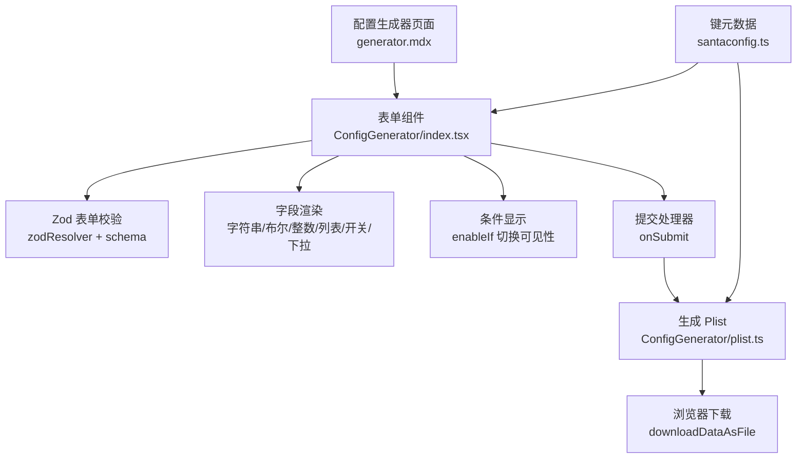
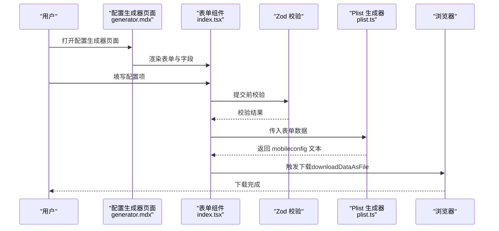
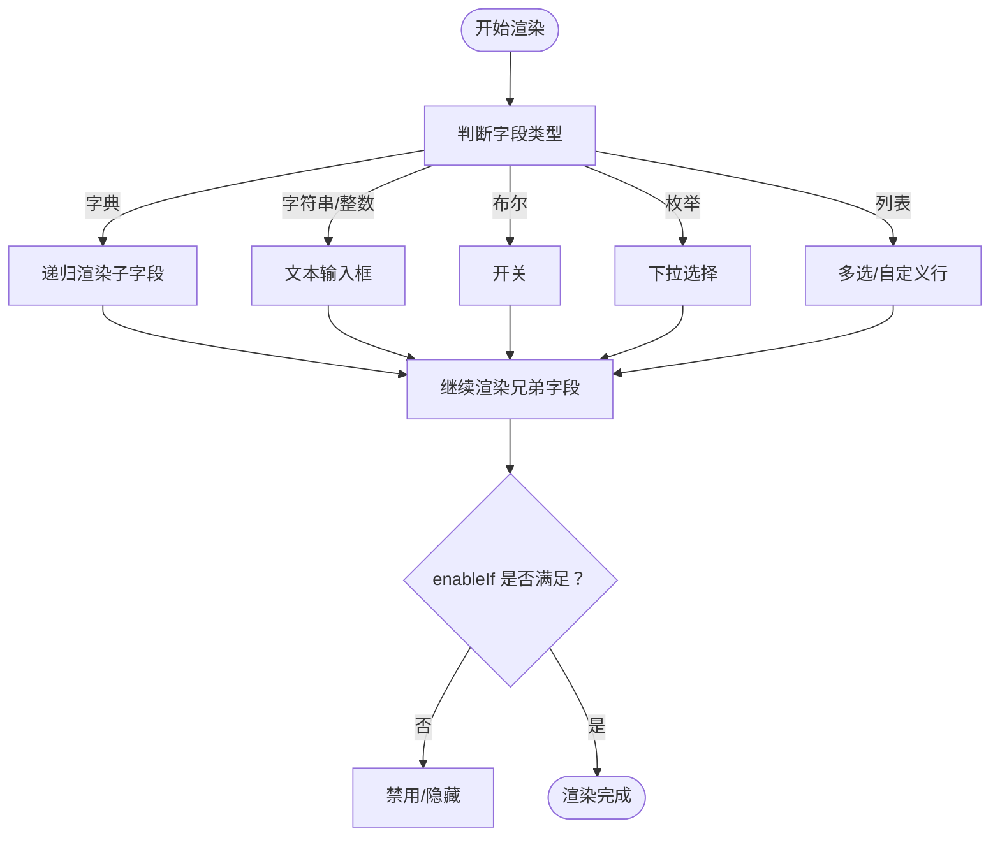
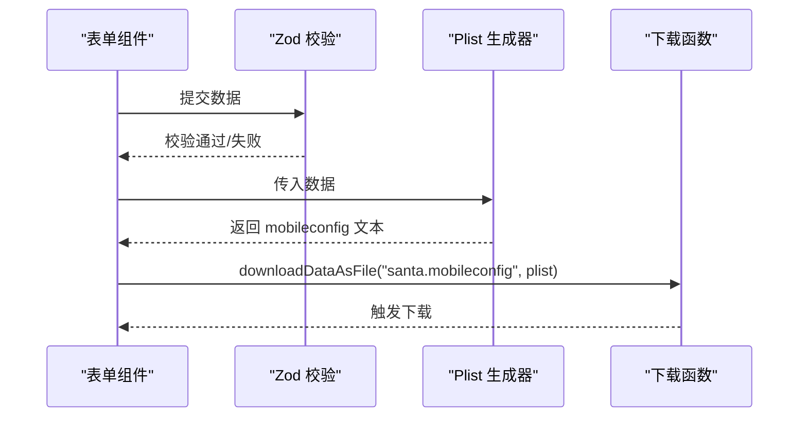
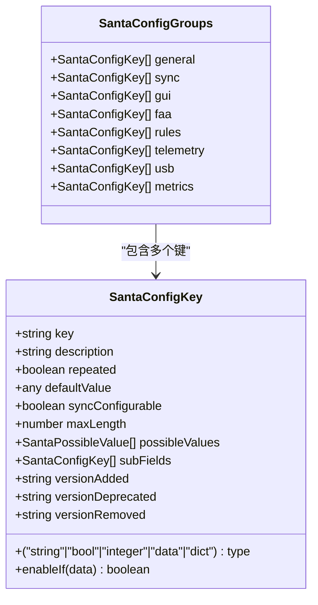
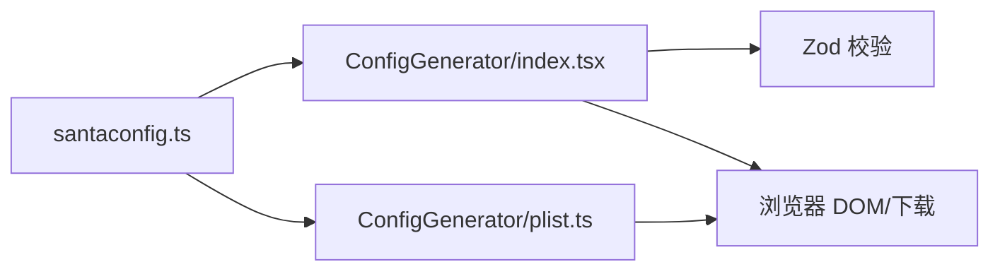

# 配置生成工具

<cite>
**本文引用的文件**
- [generator.mdx](file://docs/docs/configuration/generator.mdx)
- [keys.mdx](file://docs/docs/configuration/keys.mdx)
- [ConfigGenerator/index.tsx](file://docs/src/components/ConfigGenerator/index.tsx)
- [ConfigGenerator/plist.ts](file://docs/src/components/ConfigGenerator/plist.ts)
- [santaconfig.ts](file://docs/src/lib/santaconfig.ts)
</cite>

## 目录
1. [简介](#简介)
2. [项目结构](#项目结构)
3. [核心组件](#核心组件)
4. [架构总览](#架构总览)
5. [详细组件分析](#详细组件分析)
6. [依赖关系分析](#依赖关系分析)
7. [性能考虑](#性能考虑)
8. [故障排除指南](#故障排除指南)
9. [结论](#结论)
10. [附录](#附录)

## 简介
本文件为 Santa 配置生成工具的详细使用文档，面向终端用户与平台工程团队，覆盖以下主题：
- 使用方法：在浏览器中通过表单填写配置项，一键生成并下载 mobileconfig（即配置描述文件）
- 参数选项：字段类型、默认值、可选值、启用条件与分组说明
- 输出格式：生成的配置描述文件结构与字段映射规则
- 模板与变量：配置键的“模板化”结构、默认值与条件显示逻辑
- 校验与错误处理：前端表单校验、默认值过滤与提示
- 自动化与集成：如何在 CI/CD 中复用生成流程
- 版本管理与变更追踪：如何基于配置键元数据进行版本演进
- 故障排除与性能优化：常见问题定位与前端渲染性能建议

## 项目结构
配置生成工具位于文档站点前端，采用 React + Zod 表单校验与浏览器原生下载能力实现：
- 文档页面入口：配置生成器页面与键列表页面
- 组件层：表单渲染、字段类型适配、条件显示、提交下载
- 数据层：配置键元数据（类型、默认值、可选值、启用条件等）

图表来源
- [generator.mdx](file://docs/docs/configuration/generator.mdx#L1-L85)
- [ConfigGenerator/index.tsx](file://docs/src/components/ConfigGenerator/index.tsx#L245-L298)
- [ConfigGenerator/plist.ts](file://docs/src/components/ConfigGenerator/plist.ts#L1-L111)
- [santaconfig.ts](file://docs/src/lib/santaconfig.ts#L1-L120)

章节来源
- [generator.mdx](file://docs/docs/configuration/generator.mdx#L1-L85)
- [keys.mdx](file://docs/docs/configuration/keys.mdx#L1-L72)

## 核心组件
- 配置生成器表单组件
  - 负责渲染各配置键字段、应用默认值、执行 Zod 校验、处理提交并触发下载
  - 关键行为：根据键类型选择输入控件；根据 enableIf 动态显示/禁用字段；提交时生成 mobileconfig
- Plist 生成器
  - 将表单数据转换为 Apple 配置描述文件（mobileconfig）文本
  - 过滤默认值与空值，按类型映射为 plist 基本类型
- 键元数据
  - 定义所有配置键的类型、默认值、可选值、启用条件、版本信息等
  - 提供分组（general/sync/gui/faa/rules/telemetry/usb/metrics）

章节来源
- [ConfigGenerator/index.tsx](file://docs/src/components/ConfigGenerator/index.tsx#L1-L298)
- [ConfigGenerator/plist.ts](file://docs/src/components/ConfigGenerator/plist.ts#L1-L111)
- [santaconfig.ts](file://docs/src/lib/santaconfig.ts#L1-L120)

## 架构总览
从用户交互到输出文件的完整流程如下：

图表来源
- [generator.mdx](file://docs/docs/configuration/generator.mdx#L1-L85)
- [ConfigGenerator/index.tsx](file://docs/src/components/ConfigGenerator/index.tsx#L245-L298)
- [ConfigGenerator/plist.ts](file://docs/src/components/ConfigGenerator/plist.ts#L1-L111)

## 详细组件分析

### 表单渲染与字段类型
- 字段类型映射
  - 字符串/整数：文本输入框（整数类型自动转为数字）
  - 布尔：开关控件
  - 列表（repeated）：多选或自定义输入行，支持增删
  - 枚举：下拉选择
  - 字典（dict）：递归渲染子字段
- 条件显示与禁用
  - 通过 enableIf 函数根据当前表单状态决定是否显示/可用
- 默认值与隐藏
  - 初始化时填充默认值
  - 提交时过滤掉与默认值一致的字段，避免冗余

图表来源
- [ConfigGenerator/index.tsx](file://docs/src/components/ConfigGenerator/index.tsx#L39-L209)

章节来源
- [ConfigGenerator/index.tsx](file://docs/src/components/ConfigGenerator/index.tsx#L39-L209)

### 提交与下载流程
- 提交处理
  - 使用 Zod schema 对表单数据进行强类型校验
  - 收集数据后调用 Plist 生成器
- Plist 生成
  - 生成顶层配置描述文件（PayloadContent 内含 com.northpolesec.santa 的 payload）
  - 过滤空值与默认值，按类型映射为 plist 基本类型
- 浏览器下载
  - 使用 data URL 与 <a> 元素触发下载，文件名为 santa.mobileconfig

图表来源
- [ConfigGenerator/index.tsx](file://docs/src/components/ConfigGenerator/index.tsx#L245-L298)
- [ConfigGenerator/plist.ts](file://docs/src/components/ConfigGenerator/plist.ts#L1-L111)

章节来源
- [ConfigGenerator/index.tsx](file://docs/src/components/ConfigGenerator/index.tsx#L245-L298)
- [ConfigGenerator/plist.ts](file://docs/src/components/ConfigGenerator/plist.ts#L1-L111)

### 配置键元数据与模板结构
- 键元数据定义
  - 字段键名、描述、类型（string/bool/integer/data/dict）、是否重复（repeated）
  - 默认值、最大长度、可选值集合、子字段（用于 dict）
  - 版本信息（添加/弃用/移除）、同步可配置标记
  - 启用条件函数 enableIf，用于动态控制字段显示
- 分组组织
  - general/sync/gui/faa/rules/telemetry/usb/metrics 八个分组
- 模板化结构
  - 生成器以键元数据为“模板”，驱动表单渲染与默认值注入
  - 生成的 mobileconfig 严格对应键元数据的键名与类型

图表来源
- [santaconfig.ts](file://docs/src/lib/santaconfig.ts#L1-L120)

章节来源
- [santaconfig.ts](file://docs/src/lib/santaconfig.ts#L1-L120)

### 输出格式与默认值过滤
- 输出结构
  - 顶层为配置描述文件（mobileconfig），包含 PayloadContent 数组
  - 数组内嵌 com.northpolesec.santa 的 payload，键名与值类型一一对应
- 类型映射
  - 字符串/整数/布尔分别映射为 plist 的 string/integer/true/false
  - 列表映射为 plist array<string>
- 默认值策略
  - 若字段值与默认值一致，则在输出中省略该键，保持配置简洁
  - 特殊键（如 Telemetry）即使默认也会强制输出，以提升易用性

章节来源
- [ConfigGenerator/plist.ts](file://docs/src/components/ConfigGenerator/plist.ts#L1-L111)

### 条件生成机制
- enableIf
  - 通过键元数据中的 enableIf(data) 控制字段的显示与可用状态
  - 例如：当 EventLogType 为 "protobuf" 时才显示与 spool 相关的阈值字段
- 字段级联动
  - 例如：设置 ClientAuthCertificateFile 后，密码字段才显示
  - 例如：开启 BlockUSBMount 后，RemountUSBMode/OnStartUSBOptions 才显示

章节来源
- [santaconfig.ts](file://docs/src/lib/santaconfig.ts#L335-L377)
- [santaconfig.ts](file://docs/src/lib/santaconfig.ts#L652-L694)
- [santaconfig.ts](file://docs/src/lib/santaconfig.ts#L840-L845)

### 验证、格式检查与错误报告
- 前端表单校验
  - 使用 Zod schema 对每个键进行类型约束（字符串、布尔、整数、数组等）
  - 列表字段支持默认值与可选值集合
- 用户反馈
  - 表单项下方显示校验错误消息
  - 通过表单上下文集中展示错误，便于修正
- 生成阶段
  - 仅输出非空且非默认值的键，减少无效配置
  - 生成的 mobileconfig 由浏览器直接下载，不上传至任何服务器

章节来源
- [ConfigGenerator/index.tsx](file://docs/src/components/ConfigGenerator/index.tsx#L267-L298)
- [ConfigGenerator/plist.ts](file://docs/src/components/ConfigGenerator/plist.ts#L70-L111)

### 使用示例与场景
- 快速生成基础配置
  - 在“通用（General）”、“GUI”、“规则（Rules）”、“遥测（Telemetry）”等分组中按需勾选/填写
  - 点击“生成”按钮，下载 santa.mobileconfig
- 场景一：监控模式 + 基础 GUI 文案
  - 设置 ClientMode 为 Monitor，配置 AboutText/MoreInfoURL/EventDetailURL 等
- 场景二：锁定模式 + USB 禁止挂载
  - 设置 ClientMode 为 Lockdown，开启 BlockUSBMount，并配置 RemountUSBMode
- 场景三：启用遥测并指定日志路径
  - 设置 Telemetry 包含需要的日志事件，配置 EventLogType 与 EventLogPath
- 场景四：启用指标导出
  - 设置 MetricFormat、MetricURL、MetricExportInterval 等

章节来源
- [generator.mdx](file://docs/docs/configuration/generator.mdx#L1-L85)
- [keys.mdx](file://docs/docs/configuration/keys.mdx#L1-L72)

### 自动化集成与 CI/CD
- 浏览器侧生成
  - 生成过程完全在浏览器中执行，无需网络传输
- 可集成方式
  - 在 CI 步骤中打开页面并自动填写表单（如通过测试框架或 headless 浏览器），随后触发下载
  - 将下载的 santa.mobileconfig 作为制品存档，配合签名与分发流程
- 版本管理策略
  - 将键元数据视为“配置 API”，关注版本添加/弃用/移除
  - 通过 enableIf 与 defaultValue 保证向后兼容，避免破坏性变更
  - 在发布说明中标注配置键的版本变化，便于用户迁移

章节来源
- [generator.mdx](file://docs/docs/configuration/generator.mdx#L1-L85)
- [santaconfig.ts](file://docs/src/lib/santaconfig.ts#L1-L120)

## 依赖关系分析
- 组件耦合
  - 表单组件依赖键元数据（SantaConfigKeyGroups/SantaConfigAllKeys）
  - Plist 生成器依赖键元数据以判断默认值与类型映射
- 外部依赖
  - Zod：表单校验
  - 浏览器 API：crypto.randomUUID、URL.createObjectURL、<a> 下载
- 潜在循环依赖
  - 当前结构为单向依赖（组件 -> 元数据），无循环

图表来源
- [santaconfig.ts](file://docs/src/lib/santaconfig.ts#L1-L120)
- [ConfigGenerator/index.tsx](file://docs/src/components/ConfigGenerator/index.tsx#L245-L298)
- [ConfigGenerator/plist.ts](file://docs/src/components/ConfigGenerator/plist.ts#L1-L111)

章节来源
- [santaconfig.ts](file://docs/src/lib/santaconfig.ts#L1-L120)
- [ConfigGenerator/index.tsx](file://docs/src/components/ConfigGenerator/index.tsx#L245-L298)
- [ConfigGenerator/plist.ts](file://docs/src/components/ConfigGenerator/plist.ts#L1-L111)

## 性能考虑
- 渲染性能
  - 字段数量较多时，建议按分组懒加载或虚拟化长列表
  - 复杂字典字段（如 FAA/静态规则）可通过折叠面板减少初始渲染压力
- 校验性能
  - Zod schema 在提交时一次性校验，避免频繁重算
  - enableIf 仅在字段状态变化时重新评估
- 生成性能
  - Plist 生成为纯内存操作，复杂度与键数量线性相关
  - 建议在大配置场景下限制列表字段长度，减少数组序列化成本

## 故障排除指南
- 无法下载文件
  - 检查浏览器弹窗拦截设置，允许当前页面触发下载
  - 确认已点击“生成”按钮并等待下载触发
- 字段不可见或禁用
  - 检查上游字段是否满足 enableIf 条件（如 EventLogType 为 "protobuf" 时才会显示 spool 相关字段）
- 字段值未出现在输出
  - 若值与默认值一致，生成器会自动过滤，属预期行为
  - 特殊键（如 Telemetry）即使默认也会输出
- 校验失败
  - 查看表单项下方的错误提示，修正类型或必填项
- 生成的配置无法部署
  - 确认生成的 mobileconfig 未包含空值或无效键
  - 如需包含默认值，请手动调整字段或在后续流程中补充

章节来源
- [ConfigGenerator/index.tsx](file://docs/src/components/ConfigGenerator/index.tsx#L245-L298)
- [ConfigGenerator/plist.ts](file://docs/src/components/ConfigGenerator/plist.ts#L70-L111)

## 结论
Santa 配置生成工具以键元数据为核心模板，结合前端表单与浏览器原生能力，实现了安全、可验证、可自动化的配置生成流程。通过 enableIf 与默认值过滤，既能保证配置简洁，又能覆盖复杂场景。建议在 CI/CD 中将其作为配置制品流水线的一部分，并结合版本管理策略确保长期可维护性。

## 附录
- 键列表页面：提供所有配置键的分类浏览与版本标注，便于查找与对比
- 键元数据参考：包含类型、默认值、可选值、启用条件与版本信息

章节来源
- [keys.mdx](file://docs/docs/configuration/keys.mdx#L1-L72)
- [santaconfig.ts](file://docs/src/lib/santaconfig.ts#L1-L120)