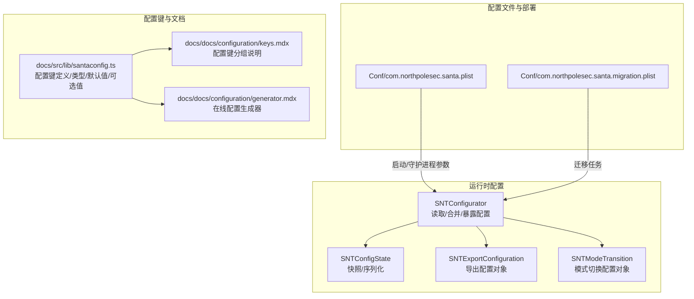
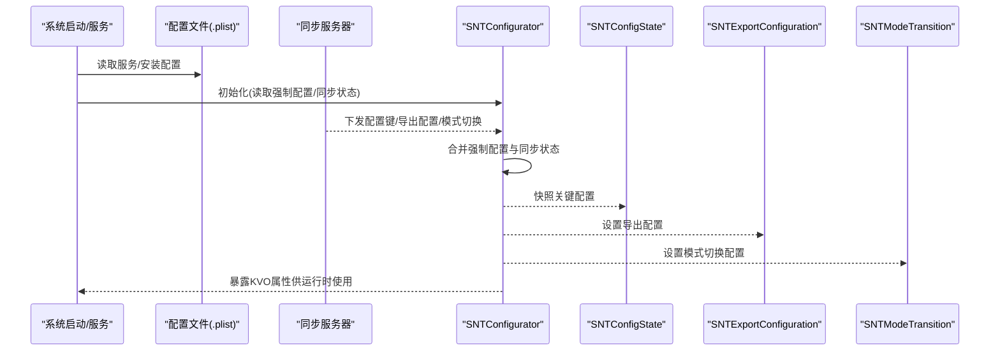
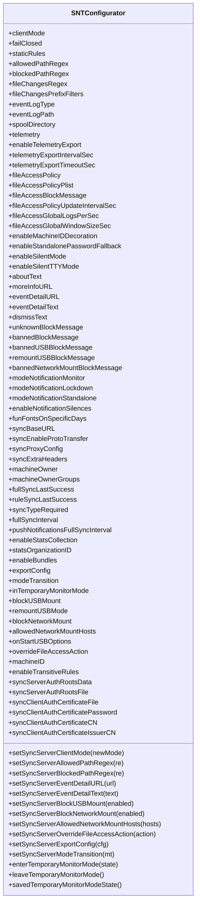
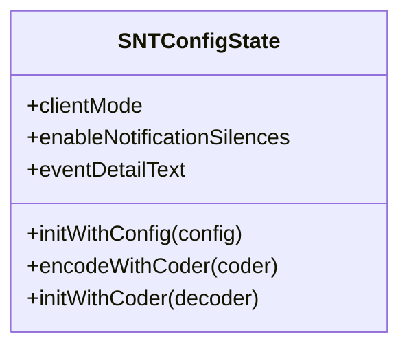
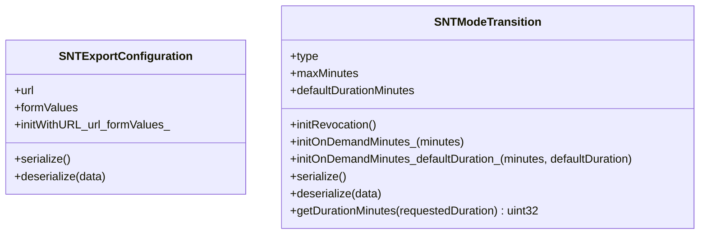
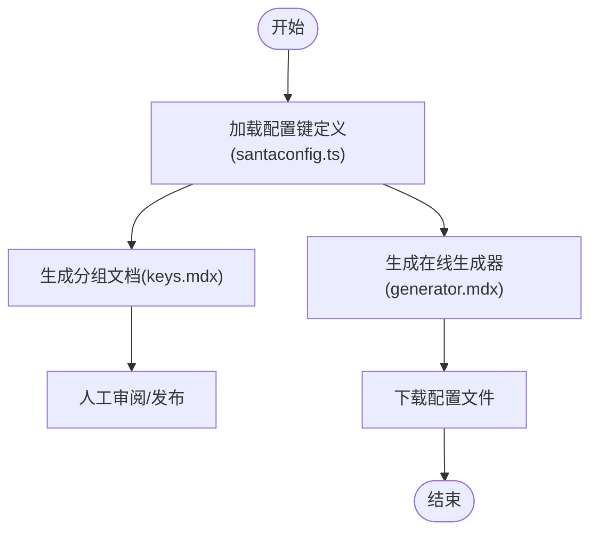
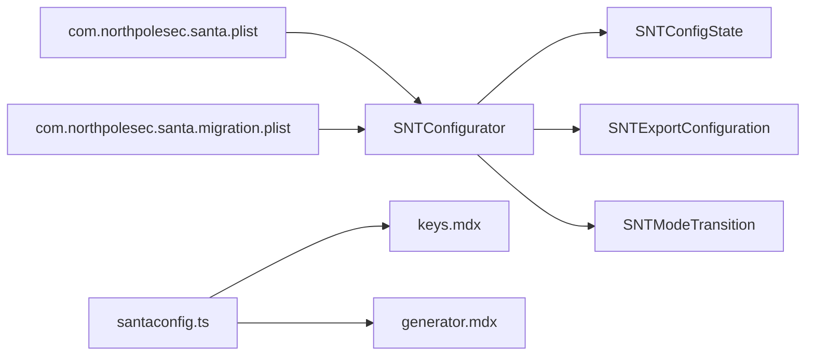

# 配置管理

<cite>
**本文引用的文件**
- [Conf/com.northpolesec.santa.plist](file://Conf/com.northpolesec.santa.plist)
- [Conf/com.northpolesec.santa.migration.plist](file://Conf/com.northpolesec.santa.migration.plist)
- [Source/common/SNTConfigurator.h](file://Source/common/SNTConfigurator.h)
- [Source/common/SNTConfigurator.mm](file://Source/common/SNTConfigurator.mm)
- [Source/common/SNTConfigState.h](file://Source/common/SNTConfigState.h)
- [Source/common/SNTConfigState.mm](file://Source/common/SNTConfigState.mm)
- [Source/common/SNTExportConfiguration.h](file://Source/common/SNTExportConfiguration.h)
- [Source/common/SNTModeTransition.h](file://Source/common/SNTModeTransition.h)
- [docs/docs/configuration/keys.mdx](file://docs/docs/configuration/keys.mdx)
- [docs/docs/configuration/generator.mdx](file://docs/docs/configuration/generator.mdx)
- [docs/src/lib/santaconfig.ts](file://docs/src/lib/santaconfig.ts)
</cite>

## 目录
1. [简介](#简介)
2. [项目结构](#项目结构)
3. [核心组件](#核心组件)
4. [架构总览](#架构总览)
5. [详细组件分析](#详细组件分析)
6. [依赖分析](#依赖分析)
7. [性能考虑](#性能考虑)
8. [故障排查指南](#故障排查指南)
9. [结论](#结论)
10. [附录](#附录)

## 简介
本文件面向Santa配置管理系统，系统性梳理配置文件格式（plist）、运行时配置机制、静态规则与动态配置更新、配置键参考、生成工具、验证与错误处理、优先级与覆盖规则、模板示例、最佳实践、常见场景、迁移与备份恢复以及版本管理策略。目标是帮助读者在不深入源码的情况下，也能高效理解并正确使用Santa的配置能力。

## 项目结构
Santa的配置体系由“运行时配置读取器”“同步状态与持久化”“配置键定义与校验”“配置生成器与文档”等部分组成，并通过服务启动项与系统集成进行部署。

**图表来源**
- [Conf/com.northpolesec.santa.plist](file://Conf/com.northpolesec.santa.plist#L1-L22)
- [Conf/com.northpolesec.santa.migration.plist](file://Conf/com.northpolesec.santa.migration.plist#L1-L21)
- [Source/common/SNTConfigurator.h](file://Source/common/SNTConfigurator.h#L1-L200)
- [Source/common/SNTConfigurator.mm](file://Source/common/SNTConfigurator.mm#L1-L120)
- [Source/common/SNTConfigState.h](file://Source/common/SNTConfigState.h#L1-L32)
- [Source/common/SNTExportConfiguration.h](file://Source/common/SNTExportConfiguration.h#L1-L28)
- [Source/common/SNTModeTransition.h](file://Source/common/SNTModeTransition.h#L1-L47)
- [docs/src/lib/santaconfig.ts](file://docs/src/lib/santaconfig.ts#L1-L120)
- [docs/docs/configuration/keys.mdx](file://docs/docs/configuration/keys.mdx#L1-L72)
- [docs/docs/configuration/generator.mdx](file://docs/docs/configuration/generator.mdx#L1-L85)

**章节来源**
- [Conf/com.northpolesec.santa.plist](file://Conf/com.northpolesec.santa.plist#L1-L22)
- [Conf/com.northpolesec.santa.migration.plist](file://Conf/com.northpolesec.santa.migration.plist#L1-L21)
- [Source/common/SNTConfigurator.h](file://Source/common/SNTConfigurator.h#L1-L200)
- [Source/common/SNTConfigurator.mm](file://Source/common/SNTConfigurator.mm#L1-L120)
- [docs/src/lib/santaconfig.ts](file://docs/src/lib/santaconfig.ts#L1-L120)
- [docs/docs/configuration/keys.mdx](file://docs/docs/configuration/keys.mdx#L1-L72)
- [docs/docs/configuration/generator.mdx](file://docs/docs/configuration/generator.mdx#L1-L85)

## 核心组件
- 运行时配置读取与合并：SNTConfigurator负责从多处来源读取配置、建立键类型映射、维护同步状态与本地强制配置，并通过KVO暴露属性供其他模块使用。
- 配置状态快照：SNTConfigState对某一时刻的关键配置进行快照与安全编码，便于持久化或跨模块传递。
- 导出与模式切换配置：SNTExportConfiguration与SNTModeTransition分别承载“导出配置对象”和“模式切换配置对象”，用于同步下发与运行态控制。
- 配置键定义与文档：docs/src/lib/santaconfig.ts集中描述所有配置键的类型、默认值、可选值、是否可被同步服务器覆盖、启用条件等；配套keys.mdx与generator.mdx提供分组说明与在线生成器。

**章节来源**
- [Source/common/SNTConfigurator.h](file://Source/common/SNTConfigurator.h#L1-L200)
- [Source/common/SNTConfigurator.mm](file://Source/common/SNTConfigurator.mm#L1-L120)
- [Source/common/SNTConfigState.h](file://Source/common/SNTConfigState.h#L1-L32)
- [Source/common/SNTConfigState.mm](file://Source/common/SNTConfigState.mm#L1-L53)
- [Source/common/SNTExportConfiguration.h](file://Source/common/SNTExportConfiguration.h#L1-L28)
- [Source/common/SNTModeTransition.h](file://Source/common/SNTModeTransition.h#L1-L47)
- [docs/src/lib/santaconfig.ts](file://docs/src/lib/santaconfig.ts#L1-L120)

## 架构总览
下图展示配置从“配置文件/同步服务器/强制配置”到“运行时属性”的流向与优先级关系。

**图表来源**
- [Conf/com.northpolesec.santa.plist](file://Conf/com.northpolesec.santa.plist#L1-L22)
- [Source/common/SNTConfigurator.mm](file://Source/common/SNTConfigurator.mm#L200-L420)
- [Source/common/SNTConfigState.mm](file://Source/common/SNTConfigState.mm#L1-L53)
- [Source/common/SNTExportConfiguration.h](file://Source/common/SNTExportConfiguration.h#L1-L28)
- [Source/common/SNTModeTransition.h](file://Source/common/SNTModeTransition.h#L1-L47)

## 详细组件分析

### 组件A：SNTConfigurator（配置读取与合并）
- 职责
  - 读取强制配置（来自mobileconfig/本地强制键）与同步状态（来自同步服务器），合并为最终运行时配置。
  - 建立“同步服务器可覆盖键”与“强制键”的类型映射，确保类型一致性与默认值。
  - 提供KVO属性，供其他模块订阅配置变化。
- 关键点
  - 强制配置域与同步状态域分离，前者优先于后者；临时监控模式会覆盖客户端模式。
  - 读取路径与迁移逻辑：同步状态文件、旧状态文件迁移、状态文件访问授权。
  - 键类型映射：区分仅同步可覆盖键与强制键，避免误用。
  - 临时监控模式：支持进入/离开临时监控模式及持久化状态。

**图表来源**
- [Source/common/SNTConfigurator.h](file://Source/common/SNTConfigurator.h#L1-L800)
- [Source/common/SNTConfigurator.mm](file://Source/common/SNTConfigurator.mm#L200-L420)

**章节来源**
- [Source/common/SNTConfigurator.h](file://Source/common/SNTConfigurator.h#L1-L800)
- [Source/common/SNTConfigurator.mm](file://Source/common/SNTConfigurator.mm#L1-L200)

### 组件B：SNTConfigState（配置快照）
- 职责
  - 对当前配置中的关键字段进行快照，支持安全编码/解码，便于持久化或跨模块传递。
- 关键点
  - 仅包含少量常用字段，避免过度序列化。

**图表来源**
- [Source/common/SNTConfigState.h](file://Source/common/SNTConfigState.h#L1-L32)
- [Source/common/SNTConfigState.mm](file://Source/common/SNTConfigState.mm#L1-L53)

**章节来源**
- [Source/common/SNTConfigState.h](file://Source/common/SNTConfigState.h#L1-L32)
- [Source/common/SNTConfigState.mm](file://Source/common/SNTConfigState.mm#L1-L53)

### 组件C：SNTExportConfiguration 与 SNTModeTransition（同步下发对象）
- 职责
  - SNTExportConfiguration：封装导出目标URL与表单参数，支持序列化/反序列化。
  - SNTModeTransition：封装模式切换类型、最大时长、默认时长等，支持序列化/反序列化与时长裁剪。
- 关键点
  - 两者均实现NSSecureCoding，保证跨进程/持久化安全。

**图表来源**
- [Source/common/SNTExportConfiguration.h](file://Source/common/SNTExportConfiguration.h#L1-L28)
- [Source/common/SNTModeTransition.h](file://Source/common/SNTModeTransition.h#L1-L47)

**章节来源**
- [Source/common/SNTExportConfiguration.h](file://Source/common/SNTExportConfiguration.h#L1-L28)
- [Source/common/SNTModeTransition.h](file://Source/common/SNTModeTransition.h#L1-L47)

### 组件D：配置键定义与生成器（docs/src/lib/santaconfig.ts）
- 职责
  - 定义所有配置键的类型、默认值、可选值、是否可被同步覆盖、启用条件、版本信息等。
  - 与keys.mdx配合，按“通用/GUI/遥测/USB/指标/规则/FAA/同步”分组展示。
  - 与generator.mdx配合，提供在线配置生成器，浏览器内生成有效配置并下载。
- 关键点
  - 支持复杂字典型键（如FileAccessPolicy、ExportConfiguration、ModeTransition）的子字段定义。
  - 提供占位符说明（如EventDetailURL中支持的占位符）。

**图表来源**
- [docs/src/lib/santaconfig.ts](file://docs/src/lib/santaconfig.ts#L1-L200)
- [docs/docs/configuration/keys.mdx](file://docs/docs/configuration/keys.mdx#L1-L72)
- [docs/docs/configuration/generator.mdx](file://docs/docs/configuration/generator.mdx#L1-L85)

**章节来源**
- [docs/src/lib/santaconfig.ts](file://docs/src/lib/santaconfig.ts#L1-L200)
- [docs/docs/configuration/keys.mdx](file://docs/docs/configuration/keys.mdx#L1-L72)
- [docs/docs/configuration/generator.mdx](file://docs/docs/configuration/generator.mdx#L1-L85)

## 依赖分析
- 组件耦合
  - SNTConfigurator依赖SNTConfigState（快照）、SNTExportConfiguration（导出配置）、SNTModeTransition（模式切换）。
  - 配置键定义与文档相互依赖，生成器依赖键定义。
- 外部依赖
  - 服务启动项（com.northpolesec.santa.plist）控制守护进程启动参数与关联包标识。
  - 迁移任务（com.northpolesec.santa.migration.plist）在特定场景执行迁移脚本。
- 可能的循环依赖
  - 当前结构以“读取器-对象-文档”分层，未见直接循环依赖迹象。

**图表来源**
- [Conf/com.northpolesec.santa.plist](file://Conf/com.northpolesec.santa.plist#L1-L22)
- [Conf/com.northpolesec.santa.migration.plist](file://Conf/com.northpolesec.santa.migration.plist#L1-L21)
- [Source/common/SNTConfigurator.h](file://Source/common/SNTConfigurator.h#L1-L200)
- [Source/common/SNTConfigState.h](file://Source/common/SNTConfigState.h#L1-L32)
- [Source/common/SNTExportConfiguration.h](file://Source/common/SNTExportConfiguration.h#L1-L28)
- [Source/common/SNTModeTransition.h](file://Source/common/SNTModeTransition.h#L1-L47)
- [docs/src/lib/santaconfig.ts](file://docs/src/lib/santaconfig.ts#L1-L120)
- [docs/docs/configuration/keys.mdx](file://docs/docs/configuration/keys.mdx#L1-L72)
- [docs/docs/configuration/generator.mdx](file://docs/docs/configuration/generator.mdx#L1-L85)

**章节来源**
- [Conf/com.northpolesec.santa.plist](file://Conf/com.northpolesec.santa.plist#L1-L22)
- [Conf/com.northpolesec.santa.migration.plist](file://Conf/com.northpolesec.santa.migration.plist#L1-L21)
- [Source/common/SNTConfigurator.h](file://Source/common/SNTConfigurator.h#L1-L200)
- [docs/src/lib/santaconfig.ts](file://docs/src/lib/santaconfig.ts#L1-L120)

## 性能考虑
- 文件变更忽略前缀（FileChangesPrefixFilters）：内核侧过滤，避免大量事件进入用户态，减少日志压力；注意前缀树节点上限与Unicode字符占用。
- 日志缓冲与阈值（EventLogType=protobuf）：通过文件大小、目录总大小与最大驻留时间限制，平衡内存占用与写盘频率。
- 遥测批量导出：批量阈值大小与最大文件数限制，降低网络与磁盘压力。
- 临时监控模式：在紧急情况下短暂放宽策略，避免大规模阻断。

[本节为通用指导，无需具体文件分析]

## 故障排查指南
- 配置未生效
  - 检查是否位于正确的域（mobileconfig域）且键名拼写正确。
  - 确认是否被同步服务器覆盖（某些键支持被同步覆盖）。
- 同步失败
  - 校验同步代理与额外请求头设置；检查证书链与客户端认证配置。
- 日志异常
  - 检查EventLogType与路径配置；确认protobuf相关阈值设置合理。
- USB/网络挂载问题
  - 校验BlockUSBMount、RemountUSBMode、OnStartUSBOptions与AllowedNetworkMountHosts组合。
- 临时监控模式
  - 使用进入/离开接口与状态保存方法，确认模式切换是否按预期执行。

**章节来源**
- [Source/common/SNTConfigurator.h](file://Source/common/SNTConfigurator.h#L540-L760)
- [Source/common/SNTConfigurator.mm](file://Source/common/SNTConfigurator.mm#L200-L420)

## 结论
Santa的配置管理以SNTConfigurator为核心，结合强制配置与同步状态，形成“强制优先、可覆盖键受控”的配置模型。通过完善的配置键定义、在线生成器与文档，用户可以快速构建并验证配置；通过快照与对象化配置（导出/模式切换），系统实现了灵活的运行时控制与可观测性。

[本节为总结，无需具体文件分析]

## 附录

### A. 配置键参考手册（摘要）
- 通用（General）
  - ClientMode、FailClosed、EnableStandalonePasswordFallback、IgnoreOtherEndpointSecurityClients、EnableStatsCollection、StatsOrganizationID
- GUI
  - EnableSilentMode、EnableSilentTTYMode、AboutText、MoreInfoURL、EventDetailURL、EventDetailText、DismissText、UnknownBlockMessage、BannedBlockMessage、ModeNotificationMonitor/Lockdown/Standalone、EnableNotificationSilences、FunFontsOnSpecificDays
- 遥测（Telemetry）
  - FileChangesRegex、FileChangesPrefixFilters、Telemetry（事件集合）、EventLogType、EventLogPath、SpoolDirectory、SpoolDirectoryFileSizeThresholdKB、SpoolDirectorySizeThresholdMB、SpoolDirectoryEventMaxFlushTimeSec、EnableMachineIDDecoration、EntitlementsPrefixFilter、EntitlementsTeamIDFilter
- 文件访问授权（FAA）
  - FileAccessPolicyPlist、FileAccessPolicy（含WatchItems/Options/Processes等子字段）、FileAccessBlockMessage、FileAccessPolicyUpdateIntervalSec、OverrideFileAccessAction、FileAccessGlobalLogsPerSec、FileAccessGlobalWindowSizeSec
- 规则（Rules）
  - AllowedPathRegex、BlockedPathRegex、EnableBadSignatureProtection、EnablePageZeroProtection、EnableTransitiveRules、StaticRules（数组，每项含identifier、rule_type、policy等）
- USB
  - BlockUSBMount、RemountUSBMode（数组）、OnStartUSBOptions
- 指标（Metrics）
  - MetricFormat、MetricURL、MetricExportInterval、MetricExportTimeout、MetricExtraLabels
- 同步（Sync）
  - SyncBaseURL、SyncEnableProtoTransfer、SyncProxyConfiguration、SyncExtraHeaders、EnableAllEventUpload、DisableUnknownEventUpload、FCMProject/Entity/APIKey、EnablePushNotifications、EnableNATS、EnableCleanSyncEventUpload、SyncTypeRequired、FullSyncInterval、PushNotificationsFullSyncInterval、FullSyncLastSuccess、RuleSyncLastSuccess、ExportConfiguration（二进制）、ModeTransition（二进制）

**章节来源**
- [docs/src/lib/santaconfig.ts](file://docs/src/lib/santaconfig.ts#L1-L971)
- [docs/docs/configuration/keys.mdx](file://docs/docs/configuration/keys.mdx#L1-L72)

### B. 配置文件格式与部署
- plist格式
  - 使用标准Apple PropertyList格式，键名与类型需与键定义一致。
- 部署方式
  - 通过mobileconfig分发至系统域；服务启动项通过com.northpolesec.santa.plist指定守护进程路径与参数。
  - 迁移任务通过com.northpolesec.santa.migration.plist触发。

**章节来源**
- [Conf/com.northpolesec.santa.plist](file://Conf/com.northpolesec.santa.plist#L1-L22)
- [Conf/com.northpolesec.santa.migration.plist](file://Conf/com.northpolesec.santa.migration.plist#L1-L21)
- [docs/docs/configuration/keys.mdx](file://docs/docs/configuration/keys.mdx#L1-L72)

### C. 动态配置更新与优先级
- 来源优先级
  - 临时监控模式 > 同步状态（同步服务器下发） > 强制配置（mobileconfig/本地强制键）。
- 可覆盖键
  - 文档中带“可被同步覆盖”标记的键，可在同步时被服务器下发覆盖。
- KVO与变更传播
  - SNTConfigurator通过KVO暴露属性，其他模块订阅后自动响应配置变化。

**章节来源**
- [Source/common/SNTConfigurator.h](file://Source/common/SNTConfigurator.h#L780-L800)
- [Source/common/SNTConfigurator.mm](file://Source/common/SNTConfigurator.mm#L420-L520)
- [docs/src/lib/santaconfig.ts](file://docs/src/lib/santaconfig.ts#L1-L120)

### D. 配置生成工具使用
- 在线生成器
  - 打开generator.mdx页面，按分组填写配置项，点击生成按钮下载配置文件。
  - 生成过程完全在浏览器端完成，数据不会离开设备。
- 验证与错误处理
  - 生成器基于santaconfig.ts的键定义进行类型与默认值校验；对于复杂字典键，建议先阅读对应分组说明。

**章节来源**
- [docs/docs/configuration/generator.mdx](file://docs/docs/configuration/generator.mdx#L1-L85)
- [docs/src/lib/santaconfig.ts](file://docs/src/lib/santaconfig.ts#L1-L200)

### E. 最佳实践与常见场景
- 最小权限原则：仅开启必要功能，如仅在需要时启用USB挂载阻断。
- 分层治理：将“全局规则”放在强制配置，“动态策略”通过同步下发。
- 事件与日志：根据环境选择合适的EventLogType与阈值，避免日志风暴。
- 迁移与回滚：使用临时监控模式作为应急手段，同步完成后恢复锁定模式。

[本节为通用指导，无需具体文件分析]

### F. 迁移、备份与版本管理
- 迁移
  - 使用com.northpolesec.santa.migration.plist触发迁移脚本，确保状态文件与配置的平滑过渡。
- 备份与恢复
  - 备份关键配置文件与状态文件（如/var/db/santa/sync-state.plist、state.plist），恢复时按原路径还原。
- 版本管理
  - 通过santaconfig.ts中的版本标注了解键的新增/废弃/移除历史，升级前对照文档调整配置。

**章节来源**
- [Conf/com.northpolesec.santa.migration.plist](file://Conf/com.northpolesec.santa.migration.plist#L1-L21)
- [docs/src/lib/santaconfig.ts](file://docs/src/lib/santaconfig.ts#L1-L120)