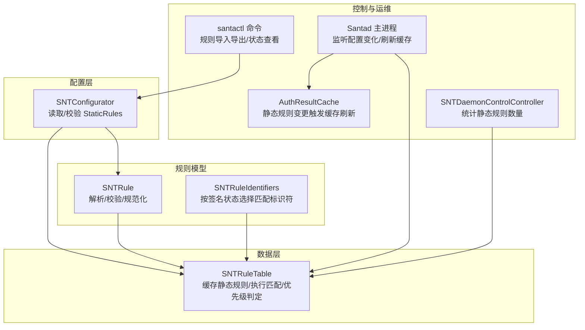
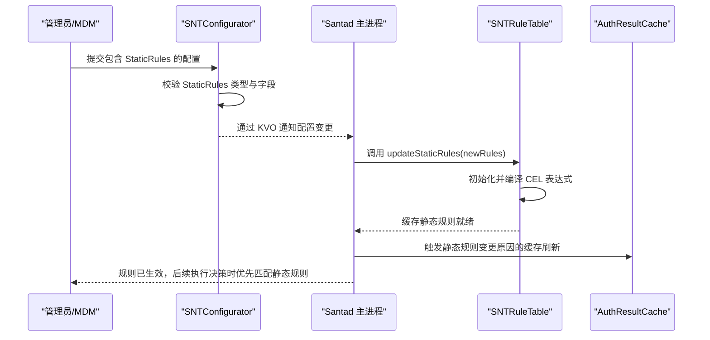
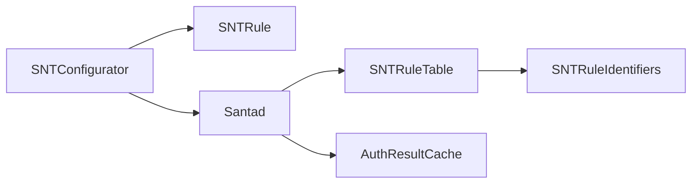
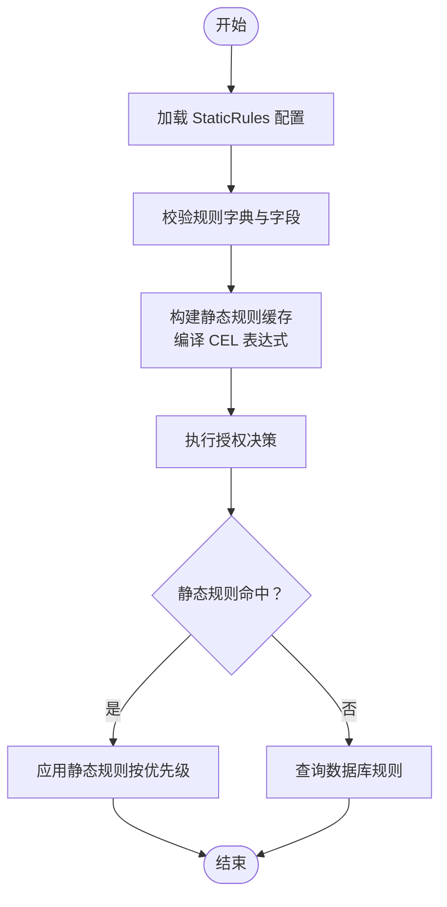

# 静态规则配置

<cite>
**本文引用的文件**
- [SNTConfigurator.mm](file://Source/common/SNTConfigurator.mm)
- [SNTConfigurator.h](file://Source/common/SNTConfigurator.h)
- [SNTRule.mm](file://Source/common/SNTRule.mm)
- [SNTRuleIdentifiers.mm](file://Source/common/SNTRuleIdentifiers.mm)
- [SNTRuleTable.mm](file://Source/santad/DataLayer/SNTRuleTable.mm)
- [SNTCommandRule.mm](file://Source/santactl/Commands/SNTCommandRule.mm)
- [Santad.mm](file://Source/santad/Santad.mm)
- [AuthResultCache.mm](file://Source/santad/EventProviders/AuthResultCache.mm)
- [SNTDaemonControlController.mm](file://Source/santad/SNTDaemonControlController.mm)
</cite>

## 目录
1. [简介](#简介)
2. [项目结构](#项目结构)
3. [核心组件](#核心组件)
4. [架构总览](#架构总览)
5. [详细组件分析](#详细组件分析)
6. [依赖关系分析](#依赖关系分析)
7. [性能考量](#性能考量)
8. [故障排查指南](#故障排查指南)
9. [结论](#结论)
10. [附录](#附录)

## 简介
本文件系统化阐述 Santa 中“静态规则（StaticRules）”的配置与运行机制，覆盖以下方面：
- StaticRules 配置项的结构与语法
- 规则类型（二进制、证书、团队ID、签名ID、CDHash）的定义与标识符格式
- 匹配流程与优先级计算
- 部署方式、MDM 集成与批量管理策略
- 规则模板示例、优化建议与冲突处理
- 规则验证工具使用、性能影响分析与最佳实践

## 项目结构
围绕静态规则的关键代码分布在如下模块：
- 配置层：负责读取、校验并暴露 StaticRules
- 规则模型：负责解析、规范化与校验规则字典
- 数据层：负责缓存静态规则、执行匹配与优先级判定
- 控制器与命令行：负责状态更新、变更通知与运维操作

图表来源
- [SNTConfigurator.mm](file://Source/common/SNTConfigurator.mm#L91-L110)
- [SNTRule.mm](file://Source/common/SNTRule.mm#L253-L365)
- [SNTRuleIdentifiers.mm](file://Source/common/SNTRuleIdentifiers.mm#L42-L71)
- [SNTRuleTable.mm](file://Source/santad/DataLayer/SNTRuleTable.mm#L83-L100)
- [Santad.mm](file://Source/santad/Santad.mm#L415-L420)
- [AuthResultCache.mm](file://Source/santad/EventProviders/AuthResultCache.mm#L29-L61)
- [SNTDaemonControlController.mm](file://Source/santad/SNTDaemonControlController.mm#L136-L170)
- [SNTCommandRule.mm](file://Source/santactl/Commands/SNTCommandRule.mm#L107-L134)

章节来源
- [SNTConfigurator.mm](file://Source/common/SNTConfigurator.mm#L91-L110)
- [SNTRule.mm](file://Source/common/SNTRule.mm#L253-L365)
- [SNTRuleTable.mm](file://Source/santad/DataLayer/SNTRuleTable.mm#L83-L100)

## 核心组件
- 配置键与类型声明
  - StaticRules 键名在配置器中被声明为数组类型，用于承载一组规则字典。
  - 配置器提供对 StaticRules 的键路径依赖、读取与校验逻辑。

- 规则模型
  - SNTRule 支持从字典初始化，自动规范化键大小写与策略值，并校验标识符格式与长度。
  - 对不同规则类型（二进制、证书、团队ID、签名ID、CDHash）施加不同的大小写与长度约束。
  - 支持将规则标记为“静态规则”，并在字符串化输出中标注。

- 规则标识符选择
  - SNTRuleIdentifiers 根据签名状态（生产/开发/adhoc/无效/未签名）按“最宽松到最严格”的顺序生成匹配标识符集，确保优先使用更具体的信息进行匹配。

- 规则表与匹配
  - SNTRuleTable 维护静态规则缓存；在执行决策时，先检查静态规则缓存，再查询数据库规则。
  - 匹配顺序为：CDHash > 二进制 > 签名ID > 证书 > 团队ID，以保证最具体规则优先。

章节来源
- [SNTConfigurator.h](file://Source/common/SNTConfigurator.h#L55-L63)
- [SNTConfigurator.mm](file://Source/common/SNTConfigurator.mm#L307-L310)
- [SNTRule.mm](file://Source/common/SNTRule.mm#L42-L186)
- [SNTRuleIdentifiers.mm](file://Source/common/SNTRuleIdentifiers.mm#L42-L71)
- [SNTRuleTable.mm](file://Source/santad/DataLayer/SNTRuleTable.mm#L438-L516)

## 架构总览
静态规则从配置加载到生效的端到端流程如下：

图表来源
- [SNTConfigurator.mm](file://Source/common/SNTConfigurator.mm#L1968-L1995)
- [Santad.mm](file://Source/santad/Santad.mm#L415-L420)
- [SNTRuleTable.mm](file://Source/santad/DataLayer/SNTRuleTable.mm#L836-L866)
- [AuthResultCache.mm](file://Source/santad/EventProviders/AuthResultCache.mm#L29-L61)

## 详细组件分析

### 静态规则配置项与语法
- 键名与类型
  - 键名：StaticRules
  - 类型：数组（数组元素为规则字典）
  - 该键由配置器声明为受管键，支持通过强制配置或移动设备配置下发。

- 规则字典字段
  - 必填字段：identifier 或 sha256（identifier 优先）
  - 策略（policy）：允许白名单、静默黑名单、移除、CEL 等
  - 类型（type）：二进制、证书、团队ID、签名ID、CDHash
  - 可选字段：customMsg、customURL、comment、cel_expr（当策略为 CEL 时必填）

- 字段规范化
  - 键名统一转小写
  - 策略与类型值统一转大写，便于比较与存储

章节来源
- [SNTConfigurator.mm](file://Source/common/SNTConfigurator.mm#L307-L310)
- [SNTRule.mm](file://Source/common/SNTRule.mm#L237-L252)
- [SNTRule.mm](file://Source/common/SNTRule.mm#L253-L365)

### 规则类型与标识符格式
- 二进制规则（Binary）
  - 标识符：二进制 SHA-256（小写十六进制）
  - 长度：64
  - 大小写：强制小写

- 证书规则（Certificate）
  - 标识符：证书 SHA-256（小写十六进制）
  - 长度：64
  - 大小写：强制小写

- 团队ID规则（TeamID）
  - 标识符：10 位字母数字
  - 大小写：强制大写

- 签名ID规则（SigningID）
  - 格式：TeamID:SigningID（TeamID 大写，SigningID 保持原样）
  - TeamID：10 位字母数字（除非为平台特殊值）
  - 签名校验失败时，会返回对应错误信息

- CDHash 规则（CDHash）
  - 标识符：CDHash（小写十六进制）
  - 长度：常量长度（根据平台常量确定）

章节来源
- [SNTRule.mm](file://Source/common/SNTRule.mm#L63-L168)
- [SNTRule.mm](file://Source/common/SNTRule.mm#L169-L186)

### 匹配规则与优先级计算
- 匹配顺序（静态规则缓存命中后）
  - CDHash → 二进制 → 签名ID → 证书 → 团队ID
  - 该顺序与数据库查询的“多条件 OR + LIMIT 1”一致，确保最具体规则优先

- 签名状态与标识符选择
  - 按“生产 > 开发 > adhoc > 无效 > 未签名”的顺序生成候选标识符集合，优先使用更具体信息
  - 例如：生产签名下同时具备签名ID与团队ID；开发签名下仅证书哈希可用

- 特殊放行
  - 若未匹配到规则且证书为系统引导证书，则放行（避免误拦截系统关键进程）

章节来源
- [SNTRuleTable.mm](file://Source/santad/DataLayer/SNTRuleTable.mm#L438-L516)
- [SNTRuleIdentifiers.mm](file://Source/common/SNTRuleIdentifiers.mm#L42-L71)
- [SNTRuleTable.mm](file://Source/santad/DataLayer/SNTRuleTable.mm#L507-L516)

### 部署方式、MDM 集成与批量管理
- 部署方式
  - 通过强制配置键（forced config）或移动设备配置（mobileconfig）下发 StaticRules
  - 配置器会对键名进行校验与类型检查，非法键或类型会被记录为错误

- MDM 集成
  - 当配置中设置了同步基地址或启用 StaticRules 时，命令行提示规则由中央管理
  - 配置变更通过 KVO 传播至守护进程，守护进程更新规则缓存并刷新相关缓存

- 批量管理策略
  - 使用命令行工具导入/导出规则，结合配置文件进行批量下发
  - 通过清理策略（如清理非传递规则、仅保留传递规则等）控制规则规模

章节来源
- [SNTConfigurator.mm](file://Source/common/SNTConfigurator.mm#L1927-L1976)
- [SNTCommandRule.mm](file://Source/santactl/Commands/SNTCommandRule.mm#L107-L134)
- [Santad.mm](file://Source/santad/Santad.mm#L415-L420)
- [SNTRuleTable.mm](file://Source/santad/DataLayer/SNTRuleTable.mm#L631-L705)

### 规则模板示例与最佳实践
- 模板要点
  - 明确指定 identifier 与 type，避免依赖回退字段
  - 对于 CEL 规则，提供完整且可编译的表达式
  - 合理使用策略：优先使用白名单，必要时使用静默黑名单
  - 团队ID/签名ID规则建议明确 TeamID 大写与 SigningID 结构

- 最佳实践
  - 将高命中率的最具体规则（如二进制/签名ID）置于 StaticRules，减少数据库查询
  - 控制 StaticRules 数量，避免过度膨胀导致缓存与编译开销上升
  - 定期清理过期传递规则，维持规则表健康

（本节为概念性指导，不直接分析具体文件）

### 冲突处理与优先级
- 静态规则优先于数据库规则
- 在同一标识符下，优先采用更具体的规则类型（CDHash > 二进制 > 签名ID > 证书 > 团队ID）
- 若策略发生变更（如从允许改为阻断），系统会触发缓存刷新以确保新策略生效

章节来源
- [SNTRuleTable.mm](file://Source/santad/DataLayer/SNTRuleTable.mm#L438-L516)
- [AuthResultCache.mm](file://Source/santad/EventProviders/AuthResultCache.mm#L29-L61)

## 依赖关系分析
- 配置层依赖
  - SNTConfigurator 依赖 SNTRule 进行规则字典校验
  - 静态规则变更通过 KVO 通知守护进程

- 守护进程依赖
  - Santad 依赖 SNTRuleTable 更新静态规则缓存
  - SNTRuleTable 依赖 SNTRuleIdentifiers 生成候选标识符

- 缓存与刷新
  - AuthResultCache 根据静态规则变更原因触发缓存刷新

图表来源
- [SNTConfigurator.mm](file://Source/common/SNTConfigurator.mm#L1968-L1995)
- [SNTRule.mm](file://Source/common/SNTRule.mm#L253-L365)
- [SNTRuleTable.mm](file://Source/santad/DataLayer/SNTRuleTable.mm#L836-L866)
- [AuthResultCache.mm](file://Source/santad/EventProviders/AuthResultCache.mm#L29-L61)

章节来源
- [SNTConfigurator.mm](file://Source/common/SNTConfigurator.mm#L1968-L1995)
- [SNTRuleTable.mm](file://Source/santad/DataLayer/SNTRuleTable.mm#L836-L866)
- [AuthResultCache.mm](file://Source/santad/EventProviders/AuthResultCache.mm#L29-L61)

## 性能考量
- 静态规则缓存
  - SNTRuleTable 维护静态规则字典缓存，按标识符快速命中，避免频繁数据库访问
  - 缓存构建时会编译 CEL 表达式，失败将跳过该规则并记录日志

- 匹配顺序优化
  - 查询采用“多条件 OR + LIMIT 1”，并明确优先级顺序，减少不必要的索引扫描

- 规则规模控制
  - 对传递规则设置阈值与过期时间，定期清理过期条目，降低数据库体积

- 缓存刷新策略
  - 当新增/删除规则或策略变更时，系统会评估是否需要刷新决策缓存，避免旧缓存影响新策略

章节来源
- [SNTRuleTable.mm](file://Source/santad/DataLayer/SNTRuleTable.mm#L836-L866)
- [SNTRuleTable.mm](file://Source/santad/DataLayer/SNTRuleTable.mm#L438-L516)
- [SNTRuleTable.mm](file://Source/santad/DataLayer/SNTRuleTable.mm#L707-L769)

## 故障排查指南
- 配置校验失败
  - 检查 StaticRules 是否为数组类型，数组元素是否为字典
  - 检查每个规则字典的键名是否规范（小写）、策略与类型是否合法
  - 若为 CEL 规则，确认表达式可编译

- 规则未生效
  - 确认配置是否通过强制配置或移动设备配置下发
  - 查看守护进程日志，确认静态规则缓存是否成功更新
  - 如策略发生变更，确认是否触发了缓存刷新

- 匹配异常
  - 检查签名状态与候选标识符生成是否符合预期
  - 确认匹配顺序是否被其他更高优先级规则覆盖

章节来源
- [SNTConfigurator.mm](file://Source/common/SNTConfigurator.mm#L1927-L1995)
- [SNTRuleTable.mm](file://Source/santad/DataLayer/SNTRuleTable.mm#L836-L866)
- [Santad.mm](file://Source/santad/Santad.mm#L415-L420)

## 结论
StaticRules 为 Santa 提供了稳定、可控且高性能的本地规则能力。通过严格的标识符格式校验、清晰的匹配优先级与完善的缓存机制，能够在大规模部署场景中保持稳定的执行性能。配合 MDM 与命令行工具，组织可以实现规则的集中治理与高效运维。

## 附录
- 关键流程图：静态规则匹配与优先级

图表来源
- [SNTConfigurator.mm](file://Source/common/SNTConfigurator.mm#L1968-L1995)
- [SNTRuleTable.mm](file://Source/santad/DataLayer/SNTRuleTable.mm#L438-L516)
- [SNTRuleTable.mm](file://Source/santad/DataLayer/SNTRuleTable.mm#L836-L866)