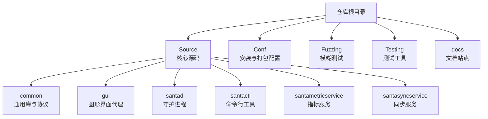
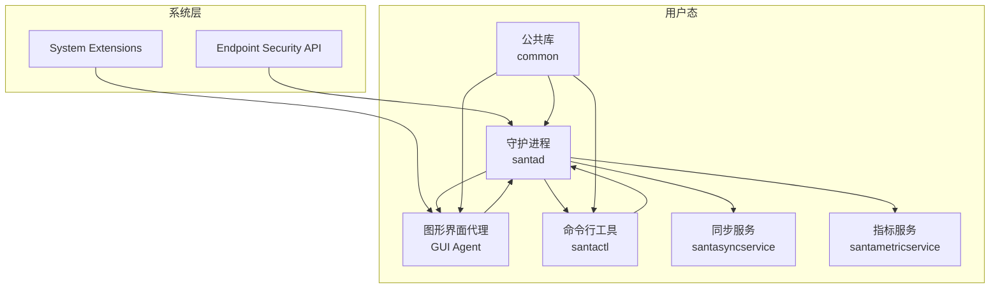
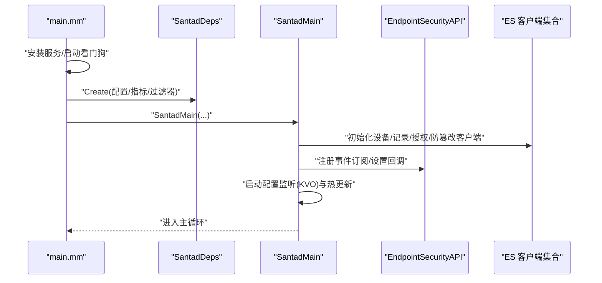
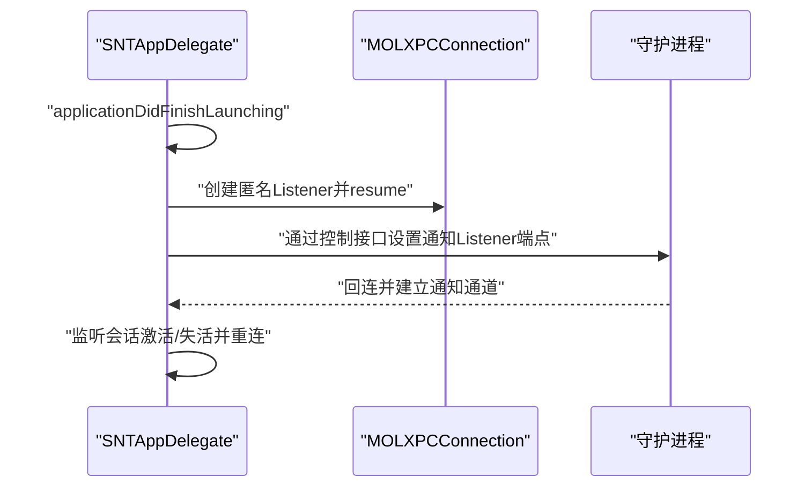
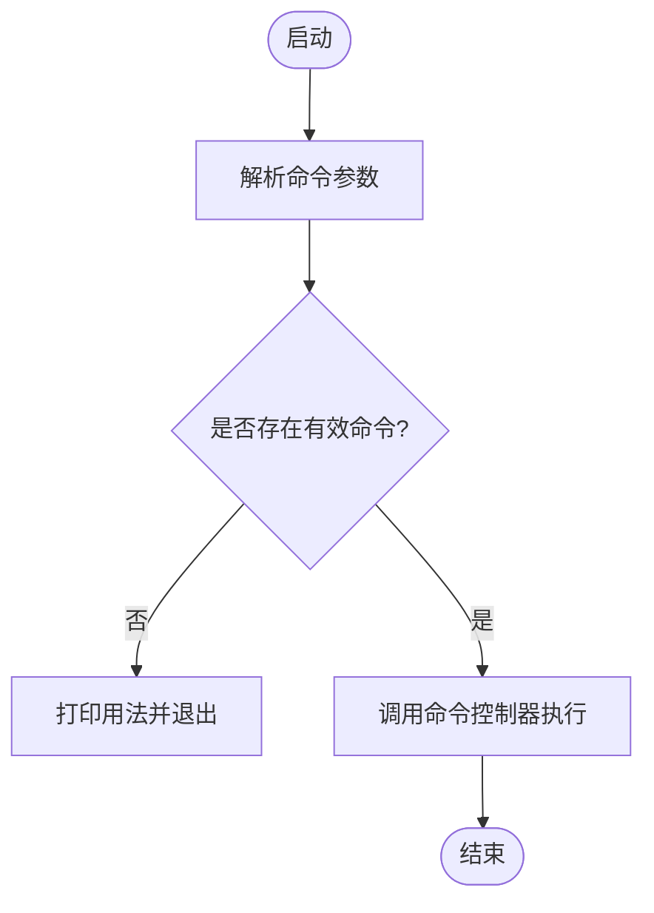
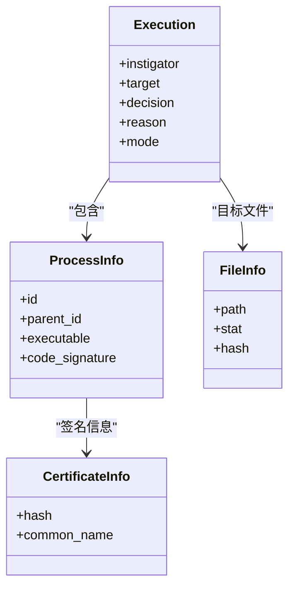
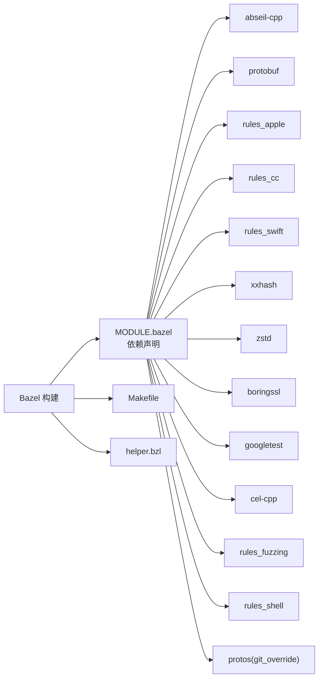

# 技术栈说明

<cite>
**本文引用的文件**
- [README.md](file://README.md)
- [MODULE.bazel](file://MODULE.bazel)
- [BUILD](file://BUILD)
- [Makefile](file://Makefile)
- [helper.bzl](file://helper.bzl)
- [Source/common/santa.proto](file://Source/common/santa.proto)
- [Source/common/BUILD](file://Source/common/BUILD)
- [Source/santad/EventProviders/EndpointSecurity/EndpointSecurityAPI.h](file://Source/santad/EventProviders/EndpointSecurity/EndpointSecurityAPI.h)
- [Source/santad/main.mm](file://Source/santad/main.mm)
- [Source/santad/Santad.mm](file://Source/santad/Santad.mm)
- [Source/gui/main.mm](file://Source/gui/main.mm)
- [Source/gui/SNTAppDelegate.mm](file://Source/gui/SNTAppDelegate.mm)
- [Source/santactl/main.mm](file://Source/santactl/main.mm)
</cite>

## 目录
1. [引言](#引言)
2. [项目结构](#项目结构)
3. [核心组件](#核心组件)
4. [架构总览](#架构总览)
5. [详细组件分析](#详细组件分析)
6. [依赖关系分析](#依赖关系分析)
7. [性能考量](#性能考量)
8. [故障排查指南](#故障排查指南)
9. [结论](#结论)
10. [附录](#附录)

## 引言
Santa 是一个为 macOS 设计的二进制与文件访问授权系统，由系统扩展、守护进程、图形界面代理、同步服务以及命令行工具组成。其目标是在默认监控模式下允许大多数可执行文件运行并记录事件，在锁定模式下仅允许白名单中的程序运行。Santa 通过 Endpoint Security API 捕获执行与文件访问事件，并结合本地数据库与远程同步策略进行决策。

本技术栈说明聚焦于以下方面：
- 编程语言与混合语言使用策略（Objective-C++、Swift、C++）
- 构建系统（Bazel）与构建流程
- 关键框架与系统能力（Foundation、Cocoa、SystemExtensions、Endpoint Security API）
- 第三方依赖与版本管理
- 开发环境搭建、编译配置与依赖管理方式
- 技术选型理由与优势
- 技术演进与未来规划方向
- 学习资源与背景知识

## 项目结构
Santa 采用模块化目录组织，围绕“Source”“Conf”“Fuzzing”“Testing”“docs”等目录划分功能域。其中：
- Source：核心源码，按功能拆分为 common、gui、santad、santactl、santametricservice、santasyncservice 等子模块
- Conf：安装脚本、plist 配置、打包与签名脚本
- Fuzzing：模糊测试相关代码与规则
- Testing：测试工具链与脚本
- docs：官方文档站点源码

章节来源
- [README.md](file://README.md#L13-L30)

## 核心组件
- 守护进程（santad）：负责 Endpoint Security 事件订阅、策略评估、缓存与日志、设备与网络挂载事件处理、与同步队列交互等
- 图形界面代理（gui）：提供用户通知、关于窗口、文件信息查看、与守护进程通过 XPC 通信
- 命令行工具（santactl）：提供规则管理、状态查询、日志打印、缓存清理、诊断等功能
- 同步服务（santasyncservice）：与远端服务器交互，拉取规则与推送事件
- 指标服务（santametricservice）：指标采集与导出
- 公共库（common）：跨模块共享的数据模型、工具类、协议定义、缓存与序列化等

章节来源
- [README.md](file://README.md#L13-L30)
- [Source/santad/main.mm](file://Source/santad/main.mm#L104-L151)
- [Source/gui/main.mm](file://Source/gui/main.mm#L56-L94)
- [Source/santactl/main.mm](file://Source/santactl/main.mm#L39-L84)

## 架构总览
Santa 的整体架构以系统扩展为核心事件源，守护进程在内核态事件与用户态组件之间建立桥梁，公共库提供跨模块共享能力，各用户态组件通过 XPC 协作。

图表来源
- [Source/santad/main.mm](file://Source/santad/main.mm#L104-L151)
- [Source/gui/main.mm](file://Source/gui/main.mm#L56-L94)
- [Source/santactl/main.mm](file://Source/santactl/main.mm#L39-L84)

## 详细组件分析

### 守护进程（santad）
- 职责
  - 初始化并启动多个 Endpoint Security 客户端（设备管理、记录器、授权器、防篡改等）
  - 维护配置监听与热更新（KVO），根据配置变更刷新缓存与行为
  - 管理执行控制器、决策缓存、前缀树、TTY 写入器、进程树、权限过滤器等
  - 与同步队列、通知队列、指标系统协作
- 关键流程
  - 启动时安装服务、启动看门狗线程、创建依赖注入容器并调用主流程
  - 主流程中优先启用授权客户端以确保执行事件订阅顺序正确
  - 在调试构建中禁用篡改防护，发布构建启用

图表来源
- [Source/santad/main.mm](file://Source/santad/main.mm#L104-L151)
- [Source/santad/Santad.mm](file://Source/santad/Santad.mm#L73-L120)

章节来源
- [Source/santad/main.mm](file://Source/santad/main.mm#L104-L151)
- [Source/santad/Santad.mm](file://Source/santad/Santad.mm#L73-L120)
- [Source/santad/Santad.mm](file://Source/santad/Santad.mm#L224-L263)

### 图形界面代理（gui）
- 职责
  - 提供菜单、关于窗口、文件信息视图等 Cocoa UI
  - 通过匿名 XPC Listener 接收守护进程回连，建立通知通道
  - 处理会话激活/失活、窗口关闭等生命周期事件
- 关键流程
  - 启动时创建通知监听器，向守护进程发送回连端点
  - 会话激活时尝试重连，失活时失效连接并等待重连

图表来源
- [Source/gui/SNTAppDelegate.mm](file://Source/gui/SNTAppDelegate.mm#L121-L164)
- [Source/gui/main.mm](file://Source/gui/main.mm#L56-L94)

章节来源
- [Source/gui/SNTAppDelegate.mm](file://Source/gui/SNTAppDelegate.mm#L121-L164)
- [Source/gui/main.mm](file://Source/gui/main.mm#L56-L94)

### 命令行工具（santactl）
- 职责
  - 解析命令参数，路由到具体命令实现
  - 提供帮助、版本、规则管理、状态查询、日志打印、缓存操作等
- 关键流程
  - 解析第一个参数作为命令名，若无效则输出用法
  - 调用对应命令控制器执行并返回结果

图表来源
- [Source/santactl/main.mm](file://Source/santactl/main.mm#L39-L84)

章节来源
- [Source/santactl/main.mm](file://Source/santactl/main.mm#L39-L84)

### 同步服务（santasyncservice）与指标服务（santametricservice）
- 同步服务：负责与远端服务器交互，拉取规则、上传事件、处理推送通知等
- 指标服务：负责指标采集、格式化与导出（文件或 HTTP）

章节来源
- [README.md](file://README.md#L113-L135)

### 公共库（common）
- 职责
  - 定义跨模块共享的数据模型与协议（如执行事件、文件访问事件、证书信息等）
  - 提供缓存、工具类、序列化、日志、配置、规则、文件信息、KVO 管理等
- 关键数据模型
  - 执行事件、进程信息、文件信息、磁盘事件、登录事件、SSH 登录事件等

图表来源
- [Source/common/santa.proto](file://Source/common/santa.proto#L268-L347)
- [Source/common/santa.proto](file://Source/common/santa.proto#L155-L205)
- [Source/common/santa.proto](file://Source/common/santa.proto#L101-L123)
- [Source/common/santa.proto](file://Source/common/santa.proto#L238-L245)

章节来源
- [Source/common/santa.proto](file://Source/common/santa.proto#L1-L1223)
- [Source/common/BUILD](file://Source/common/BUILD#L14-L38)

## 依赖关系分析
- 构建系统与工具链
  - 使用 Bazel 作为构建系统，通过 MODULE.bazel 声明第三方依赖与覆盖
  - Makefile 提供常用构建、测试、打包与重载命令
  - helper.bzl 定义通用规则与最小系统版本约束
- 第三方依赖
  - abseil-cpp、protobuf、rules_apple、rules_cc、rules_swift、xxhash、zstd、boringssl、googletest、cel-cpp、rules_fuzzing、rules_shell 等
  - 通过 git_override 对 protos 进行自定义版本管理
- 依赖管理方式
  - 通过 MODULE.bazel 声明依赖与版本，deps/BUILD 与非模块依赖仓库管理（如 FMDB、OCMock、nats_c）
  - 使用 refresh_compile_commands 规则生成 compile_commands.json 以便编辑器与静态分析工具使用

图表来源
- [MODULE.bazel](file://MODULE.bazel#L1-L42)
- [BUILD](file://BUILD#L251-L260)
- [Makefile](file://Makefile#L1-L40)
- [helper.bzl](file://helper.bzl#L8-L10)

章节来源
- [MODULE.bazel](file://MODULE.bazel#L1-L42)
- [BUILD](file://BUILD#L251-L260)
- [Makefile](file://Makefile#L1-L40)
- [helper.bzl](file://helper.bzl#L8-L10)

## 性能考量
- 缓存策略
  - 决策缓存与认证结果缓存减少重复计算与系统调用
  - 前缀树用于路径匹配优化
- 日志与事件流
  - 事件写入器支持批量与压缩（zstd），降低 I/O 压力
  - 文件访问授权（FAA）策略处理器具备速率限制与窗口控制
- 资源监控
  - 看门狗线程监控 CPU/内存使用，超阈值发出警告并统计事件次数
- 并发与锁
  - 多处使用 absl 同步原语与无锁哈希结构，提升并发性能

章节来源
- [Source/santad/Santad.mm](file://Source/santad/Santad.mm#L73-L120)
- [Source/common/BUILD](file://Source/common/BUILD#L81-L116)
- [Source/common/BUILD](file://Source/common/BUILD#L577-L582)

## 故障排查指南
- 系统扩展加载/卸载
  - GUI 提供命令行入口用于请求系统扩展的激活/停用，失败时记录错误码并退出
- 守护进程健康检查
  - 看门狗线程周期性检查 CPU/内存使用，异常时记录警告并增加事件计数
- 服务安装与重载
  - Makefile 提供 load/reload/release 等命令，便于快速验证构建产物
- 日志与诊断
  - 命令行工具提供打印日志、状态查询、规则管理等命令，便于定位问题

章节来源
- [Source/gui/main.mm](file://Source/gui/main.mm#L56-L94)
- [Source/santad/main.mm](file://Source/santad/main.mm#L45-L90)
- [Makefile](file://Makefile#L1-L40)
- [Source/santactl/main.mm](file://Source/santactl/main.mm#L39-L84)

## 结论
Santa 的技术栈围绕 macOS 原生能力与现代构建工具展开：以 Bazel 为统一构建入口，结合丰富的第三方库与协议定义，形成稳定高效的跨模块协作体系；在语言层面采用 Objective-C++ 与 Swift 的混合方案，既发挥 C++ 的高性能与底层控制，又利用 Swift 的现代特性与 Cocoa 生态完善 UI 体验；在系统能力上充分利用 SystemExtensions 与 Endpoint Security API，确保对执行与文件访问事件的实时捕获与响应。该技术选型兼顾性能、可维护性与可扩展性，适合大规模部署与持续演进。

## 附录

### 开发环境搭建与编译配置
- 构建系统
  - 使用 Bazel 作为构建系统，建议参考 Makefile 中的常用目标（构建、测试、打包、重载）
- 最小系统版本
  - helper.bzl 中定义了最低 macOS 版本要求
- 依赖安装
  - 通过 MODULE.bazel 声明的依赖自动解析，必要时可使用 refresh_compile_commands 生成 compile_commands.json
- 构建类型与标志
  - 支持 release/adhoc/debugger 构建类型与优化编译选项（如启用 dSYM、多架构切片）

章节来源
- [Makefile](file://Makefile#L1-L40)
- [helper.bzl](file://helper.bzl#L8-L10)
- [BUILD](file://BUILD#L251-L260)

### 技术选型与优势
- 语言组合
  - Objective-C++：继承 Foundation/Cocoa 生态，便于与系统框架深度集成
  - Swift：用于 GUI 视图层，提升开发效率与类型安全
- 构建工具
  - Bazel：提供可重现构建、增量编译与多平台支持，适合大型工程
- 框架与系统能力
  - Foundation/Cocoa：统一的跨组件基础库与 UI 框架
  - SystemExtensions：系统级扩展能力，满足授权与拦截需求
  - Endpoint Security API：内核态事件源，提供细粒度执行与文件访问事件
- 第三方库
  - abseil-cpp：高性能 C++ 库，提供并发、容器与哈希等基础设施
  - protobuf：跨模块数据交换与持久化
  - xxhash/zstd：高性能哈希与压缩算法
  - boringssl：加密与安全相关能力
  - googletest/cel-cpp：测试与表达式求值能力

章节来源
- [MODULE.bazel](file://MODULE.bazel#L1-L42)
- [Source/santad/EventProviders/EndpointSecurity/EndpointSecurityAPI.h](file://Source/santad/EventProviders/EndpointSecurity/EndpointSecurityAPI.h#L18-L27)
- [Source/gui/main.mm](file://Source/gui/main.mm#L15-L17)

### 依赖管理方式
- MODULE.bazel 声明依赖与版本，git_override 对 protos 进行定制化版本管理
- deps/BUILD 与 non_module_deps.bzl 管理非模块依赖（如 FMDB、OCMock、nats_c）
- 使用 use_repo 将依赖注入到构建图中

章节来源
- [MODULE.bazel](file://MODULE.bazel#L17-L31)
- [MODULE.bazel](file://MODULE.bazel#L25-L30)

### 学习资源与背景知识
- macOS 系统扩展与授权机制
- Endpoint Security API 事件模型与订阅流程
- Cocoa 与 XPC 通信机制
- Bazel 构建规则与依赖管理
- Protocol Buffers 数据序列化与跨语言支持

章节来源
- [README.md](file://README.md#L13-L30)
- [Source/santad/EventProviders/EndpointSecurity/EndpointSecurityAPI.h](file://Source/santad/EventProviders/EndpointSecurity/EndpointSecurityAPI.h#L18-L27)