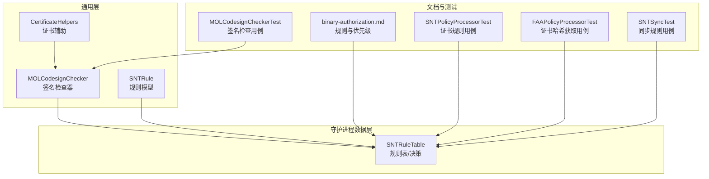
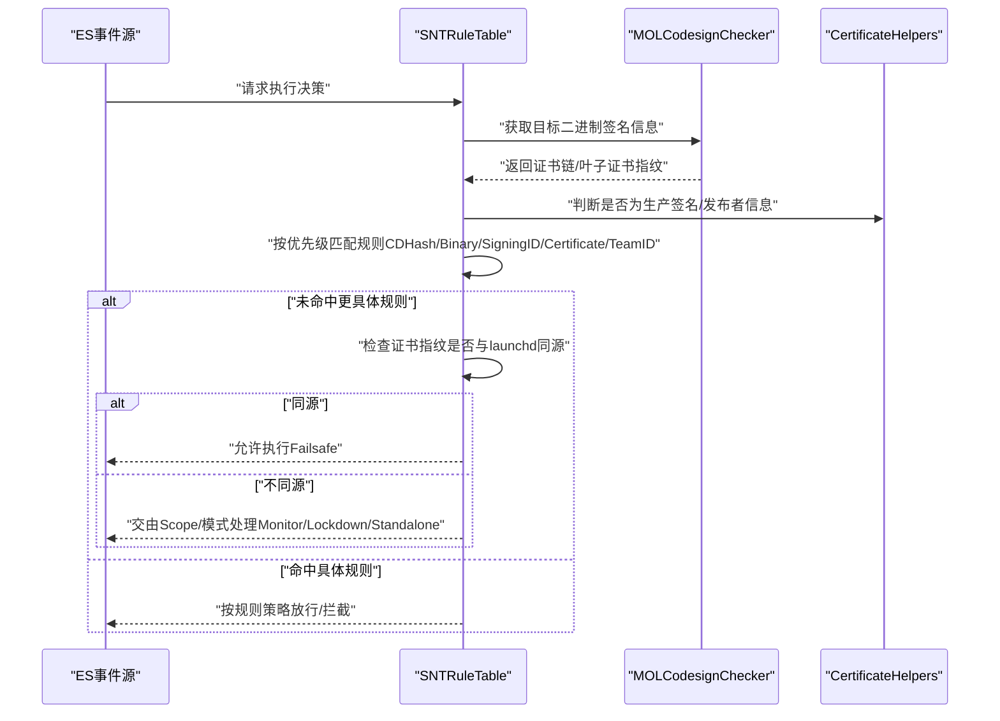
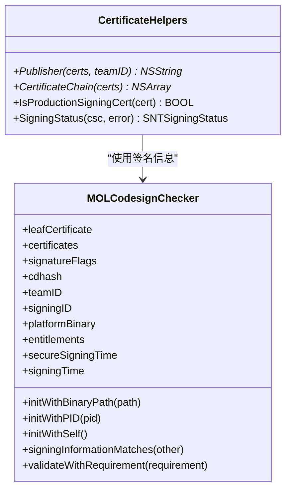
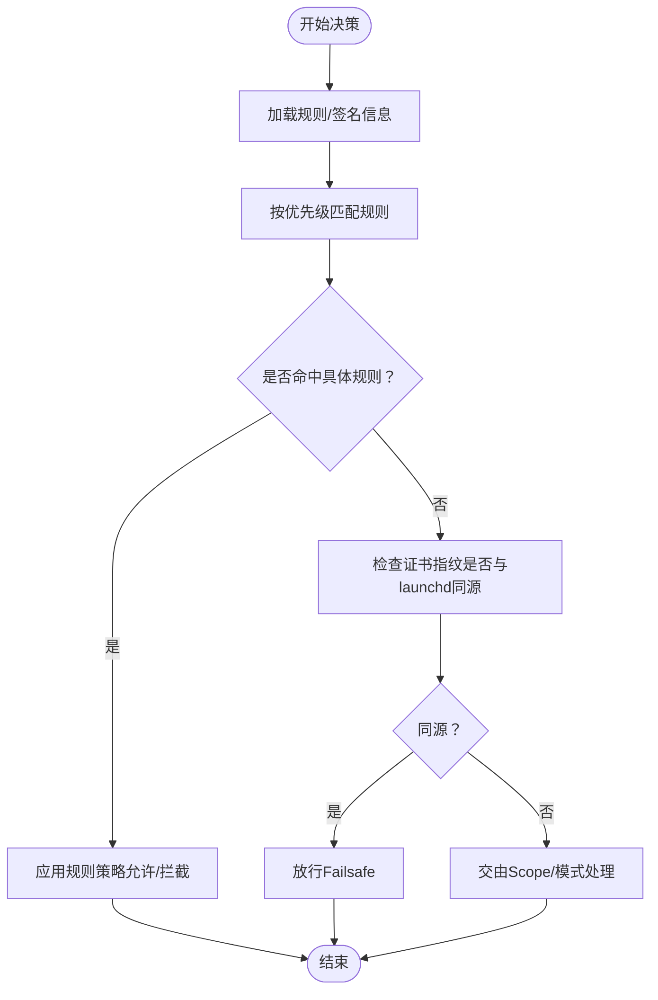
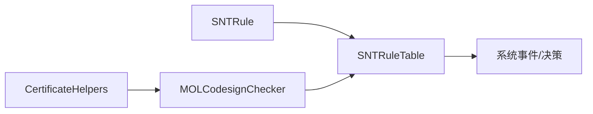

# Failsafe证书规则

<cite>
**本文引用的文件**
- [Source/common/CertificateHelpers.h](file://Source/common/CertificateHelpers.h)
- [Source/common/CertificateHelpers.mm](file://Source/common/CertificateHelpers.mm)
- [Source/common/MOLCodesignChecker.h](file://Source/common/MOLCodesignChecker.h)
- [Source/common/MOLCodesignChecker.mm](file://Source/common/MOLCodesignChecker.mm)
- [Source/common/SNTRule.mm](file://Source/common/SNTRule.mm)
- [Source/santad/DataLayer/SNTRuleTable.mm](file://Source/santad/DataLayer/SNTRuleTable.mm)
- [Source/santad/SNTPolicyProcessorTest.mm](file://Source/santad/SNTPolicyProcessorTest.mm)
- [docs/docs/features/binary-authorization.md](file://docs/docs/features/binary-authorization.md)
- [Source/santad/EventProviders/FAAPolicyProcessorTest.mm](file://Source/santad/EventProviders/FAAPolicyProcessorTest.mm)
- [Source/common/MOLCodesignCheckerTest.mm](file://Source/common/MOLCodesignCheckerTest.mm)
- [Source/santasyncservice/SNTSyncTest.mm](file://Source/santasyncservice/SNTSyncTest.mm)
- [Conf/com.northpolesec.santa.plist](file://Conf/com.northpolesec.santa.plist)
</cite>

## 目录
1. [引言](#引言)
2. [项目结构](#项目结构)
3. [核心组件](#核心组件)
4. [架构总览](#架构总览)
5. [详细组件分析](#详细组件分析)
6. [依赖关系分析](#依赖关系分析)
7. [性能考量](#性能考量)
8. [故障排查指南](#故障排查指南)
9. [结论](#结论)
10. [附录](#附录)

## 引言
本技术文档聚焦Santa的“Failsafe证书规则”，即通过证书层面对关键系统进程（尤其是launchd）与Santa自身进行保护，确保在任何情况下都不会因规则或同步问题导致系统关键路径被阻断。该机制以“证书指纹（SHA-256）”为标识，采用“白名单优先”的策略：当未命中其他更具体的规则时，若二进制由与系统引导签名相同的证书链签发，则自动放行，从而避免误伤系统核心组件。

## 项目结构
围绕Failsafe证书规则的关键代码分布在以下模块：
- 通用证书与签名工具：用于解析证书链、判断生产签名状态、提取签名信息等
- 规则表与决策：负责加载、匹配与缓存规则，以及在无匹配时执行Failsafe逻辑
- 文档与测试：规则类型说明、行为验证与边界场景覆盖

图表来源
- [Source/common/CertificateHelpers.mm](file://Source/common/CertificateHelpers.mm#L1-L104)
- [Source/common/MOLCodesignChecker.mm](file://Source/common/MOLCodesignChecker.mm#L1-L220)
- [Source/common/SNTRule.mm](file://Source/common/SNTRule.mm#L1-L120)
- [Source/santad/DataLayer/SNTRuleTable.mm](file://Source/santad/DataLayer/SNTRuleTable.mm#L300-L520)
- [docs/docs/features/binary-authorization.md](file://docs/docs/features/binary-authorization.md#L43-L66)
- [Source/santad/SNTPolicyProcessorTest.mm](file://Source/santad/SNTPolicyProcessorTest.mm#L318-L389)
- [Source/common/MOLCodesignCheckerTest.mm](file://Source/common/MOLCodesignCheckerTest.mm#L23-L40)
- [Source/santad/EventProviders/FAAPolicyProcessorTest.mm](file://Source/santad/EventProviders/FAAPolicyProcessorTest.mm#L495-L561)
- [Source/santasyncservice/SNTSyncTest.mm](file://Source/santasyncservice/SNTSyncTest.mm#L1057-L1082)

章节来源
- [Source/common/CertificateHelpers.mm](file://Source/common/CertificateHelpers.mm#L1-L104)
- [Source/common/MOLCodesignChecker.mm](file://Source/common/MOLCodesignChecker.mm#L1-L220)
- [Source/common/SNTRule.mm](file://Source/common/SNTRule.mm#L1-L120)
- [Source/santad/DataLayer/SNTRuleTable.mm](file://Source/santad/DataLayer/SNTRuleTable.mm#L300-L520)
- [docs/docs/features/binary-authorization.md](file://docs/docs/features/binary-authorization.md#L43-L66)

## 核心组件
- 证书与签名工具
  - 提供发布者信息提取、证书链转换、生产签名判定、签名状态评估等能力，支撑对证书指纹与签名状态的准确判断
- 规则模型与规则表
  - 规则模型支持多种规则类型（含证书），并强制规范化标识符格式；规则表负责规则加载、优先级匹配、Failsafe放行逻辑与缓存
- 决策流程
  - 在未命中更具体规则时，若二进制由与系统引导签名相同的叶子证书签发，则自动放行，保障系统关键路径不被阻断

章节来源
- [Source/common/CertificateHelpers.h](file://Source/common/CertificateHelpers.h#L1-L68)
- [Source/common/CertificateHelpers.mm](file://Source/common/CertificateHelpers.mm#L1-L104)
- [Source/common/MOLCodesignChecker.h](file://Source/common/MOLCodesignChecker.h#L1-L210)
- [Source/common/MOLCodesignChecker.mm](file://Source/common/MOLCodesignChecker.mm#L1-L220)
- [Source/common/SNTRule.mm](file://Source/common/SNTRule.mm#L1-L120)
- [Source/santad/DataLayer/SNTRuleTable.mm](file://Source/santad/DataLayer/SNTRuleTable.mm#L300-L520)

## 架构总览
下图展示了从事件触发到最终决策的总体流程，重点标注了Failsafe证书规则的生效点。

图表来源
- [Source/santad/DataLayer/SNTRuleTable.mm](file://Source/santad/DataLayer/SNTRuleTable.mm#L438-L516)
- [Source/common/MOLCodesignChecker.mm](file://Source/common/MOLCodesignChecker.mm#L258-L327)
- [Source/common/CertificateHelpers.mm](file://Source/common/CertificateHelpers.mm#L1-L104)
- [docs/docs/features/binary-authorization.md](file://docs/docs/features/binary-authorization.md#L43-L66)

## 详细组件分析

### 组件A：证书与签名工具
- 职责
  - 从证书链中提取发布者信息，便于用户理解
  - 将证书数组转换为底层SecCertificateRef列表
  - 判断证书是否为生产签名（基于OID）
  - 基于签名标志与平台属性综合判定签名状态
- 设计要点
  - 对证书链的使用仅限于叶子证书指纹，避免中间证书影响
  - 生产签名判定为运行时辅助，非安全关键校验
  - 签名检查器在静态与运行态采用不同标志，兼顾性能与准确性

图表来源
- [Source/common/CertificateHelpers.h](file://Source/common/CertificateHelpers.h#L1-L68)
- [Source/common/CertificateHelpers.mm](file://Source/common/CertificateHelpers.mm#L1-L104)
- [Source/common/MOLCodesignChecker.h](file://Source/common/MOLCodesignChecker.h#L1-L210)
- [Source/common/MOLCodesignChecker.mm](file://Source/common/MOLCodesignChecker.mm#L1-L220)

章节来源
- [Source/common/CertificateHelpers.mm](file://Source/common/CertificateHelpers.mm#L1-L104)
- [Source/common/MOLCodesignChecker.mm](file://Source/common/MOLCodesignChecker.mm#L1-L220)

### 组件B：规则表与Failsafe逻辑
- 职责
  - 初始化数据库、加载规则、计算规则哈希、清理过期规则
  - 在规则匹配阶段，若未命中更具体规则，检查证书指纹是否与系统引导签名一致，一致则放行
  - 缓存关键系统二进制的签名信息，避免重复计算
- 关键流程
  - 启动时保存自身与系统引导进程的签名信息
  - 查询规则时先尝试静态规则，再查询数据库；最后在无匹配时应用Failsafe
  - 对新增规则进行缓存刷新策略控制，保证新规则及时生效

图表来源
- [Source/santad/DataLayer/SNTRuleTable.mm](file://Source/santad/DataLayer/SNTRuleTable.mm#L300-L520)

章节来源
- [Source/santad/DataLayer/SNTRuleTable.mm](file://Source/santad/DataLayer/SNTRuleTable.mm#L300-L520)

### 组件C：证书规则的匹配与测试
- 行为验证
  - 证书规则支持普通阻断与静默阻断两种策略
  - 测试覆盖了证书规则命中、静默阻断、允许等场景
- 配置要点
  - 证书规则的标识符为叶子证书SHA-256指纹，大小写规范化
  - 支持通过命令行工具添加/检查证书规则

章节来源
- [Source/santad/SNTPolicyProcessorTest.mm](file://Source/santad/SNTPolicyProcessorTest.mm#L318-L389)
- [docs/docs/features/binary-authorization.md](file://docs/docs/features/binary-authorization.md#L135-L152)
- [Source/common/SNTRule.mm](file://Source/common/SNTRule.mm#L63-L80)

### 组件D：动态证书更新与缓存
- 动态更新
  - 新增/删除规则时，根据规则类型与数量决定是否清空决策缓存，确保新规则立即生效
  - 定期清理过期的“传递式规则”，降低数据库膨胀
- 缓存策略
  - 对关键系统二进制签名信息进行缓存，减少重复签名检查开销
  - 计算规则哈希，用于快速检测规则变更

章节来源
- [Source/santad/DataLayer/SNTRuleTable.mm](file://Source/santad/DataLayer/SNTRuleTable.mm#L707-L769)
- [Source/santad/DataLayer/SNTRuleTable.mm](file://Source/santad/DataLayer/SNTRuleTable.mm#L800-L937)

### 组件E：证书哈希获取与缓存
- 场景
  - 在某些路径下，若无法从签名信息直接获取证书哈希，将使用缓存值或回退策略
- 目的
  - 在签名检查失败或不可用时，仍能稳定地提供证书指纹，避免阻塞

章节来源
- [Source/santad/EventProviders/FAAPolicyProcessorTest.mm](file://Source/santad/EventProviders/FAAPolicyProcessorTest.mm#L495-L561)

## 依赖关系分析
- 模块耦合
  - 规则表依赖签名检查器与证书辅助，用于获取与判断证书指纹
  - 规则模型统一了规则标识符格式与策略表达
- 外部依赖
  - macOS安全框架（签名与证书链）
  - 数据库（规则持久化与哈希计算）

图表来源
- [Source/common/SNTRule.mm](file://Source/common/SNTRule.mm#L1-L120)
- [Source/santad/DataLayer/SNTRuleTable.mm](file://Source/santad/DataLayer/SNTRuleTable.mm#L300-L520)
- [Source/common/MOLCodesignChecker.mm](file://Source/common/MOLCodesignChecker.mm#L1-L220)
- [Source/common/CertificateHelpers.mm](file://Source/common/CertificateHelpers.mm#L1-L104)

章节来源
- [Source/common/SNTRule.mm](file://Source/common/SNTRule.mm#L1-L120)
- [Source/santad/DataLayer/SNTRuleTable.mm](file://Source/santad/DataLayer/SNTRuleTable.mm#L300-L520)
- [Source/common/MOLCodesignChecker.mm](file://Source/common/MOLCodesignChecker.mm#L1-L220)
- [Source/common/CertificateHelpers.mm](file://Source/common/CertificateHelpers.mm#L1-L104)

## 性能考量
- 签名检查优化
  - 静态签名检查禁用资源验证并启用嵌套代码检查，避免网络访问，显著提升性能
- 规则匹配顺序
  - 优先命中更具体的规则（CDHash/Binary/SigningID），减少后续匹配成本
- 缓存与清理
  - 对关键系统二进制签名信息进行缓存，降低重复计算
  - 定期清理过期传递式规则，保持数据库规模可控

章节来源
- [Source/common/MOLCodesignChecker.mm](file://Source/common/MOLCodesignChecker.mm#L31-L63)
- [docs/docs/features/binary-authorization.md](file://docs/docs/features/binary-authorization.md#L43-L66)
- [Source/santad/DataLayer/SNTRuleTable.mm](file://Source/santad/DataLayer/SNTRuleTable.mm#L783-L804)

## 故障排查指南
- 常见问题
  - 证书规则未生效：确认标识符为叶子证书SHA-256且已小写规范化
  - 系统关键进程被阻断：检查是否命中Failsafe逻辑（与launchd同源证书）
  - 签名检查失败：关注签名标志与平台二进制属性，必要时回退到缓存值
- 排查步骤
  - 使用签名检查器验证二进制签名信息与证书链
  - 核对规则优先级与匹配结果
  - 查看规则哈希与缓存刷新日志，确认规则变更已生效

章节来源
- [Source/common/MOLCodesignCheckerTest.mm](file://Source/common/MOLCodesignCheckerTest.mm#L23-L40)
- [Source/santad/EventProviders/FAAPolicyProcessorTest.mm](file://Source/santad/EventProviders/FAAPolicyProcessorTest.mm#L495-L561)
- [Source/santasyncservice/SNTSyncTest.mm](file://Source/santasyncservice/SNTSyncTest.mm#L1057-L1082)

## 结论
Failsafe证书规则通过“同源放行”机制，在不牺牲安全性的前提下，有效避免了对系统关键进程与Santa自身的误阻断。其设计强调：
- 以叶子证书指纹为核心标识，覆盖范围广且稳定
- 在规则未命中时，优先保障系统关键路径可用
- 严格的性能与缓存策略，确保系统响应与一致性

## 附录

### 配置示例与最佳实践
- 添加证书规则
  - 使用命令行工具添加证书SHA-256规则，标识符需为小写十六进制
  - 可结合自定义消息与URL，便于审计与用户提示
- 自定义证书管理
  - 通过同步服务批量下发规则，注意规则哈希与缓存刷新策略
  - 对关键系统二进制与Santa自身，建议采用“同源放行”而非硬编码阻断
- 合规与审计
  - 记录规则变更与决策日志，定期核对规则哈希
  - 对静默阻断与高风险策略进行严格审批与最小化使用

章节来源
- [docs/docs/features/binary-authorization.md](file://docs/docs/features/binary-authorization.md#L135-L152)
- [Source/common/SNTRule.mm](file://Source/common/SNTRule.mm#L63-L80)
- [Source/santasyncservice/SNTSyncTest.mm](file://Source/santasyncservice/SNTSyncTest.mm#L1057-L1082)

### 兼容性与版本变化
- 规则类型与优先级
  - 规则优先级顺序（CDHash → Binary → SigningID → Certificate → TeamID）在多版本SQLite中保持稳定
- 系统关键路径
  - ES默认静默集包含部分系统关键路径，Santa在此基础上补充自定义关键路径集合，确保跨版本兼容
- 运行时签名检查
  - 静态与运行态签名检查标志差异，需在性能与准确性间权衡

章节来源
- [docs/docs/features/binary-authorization.md](file://docs/docs/features/binary-authorization.md#L43-L66)
- [Source/santad/DataLayer/SNTRuleTable.mm](file://Source/santad/DataLayer/SNTRuleTable.mm#L101-L153)
- [Source/common/MOLCodesignChecker.mm](file://Source/common/MOLCodesignChecker.mm#L31-L63)