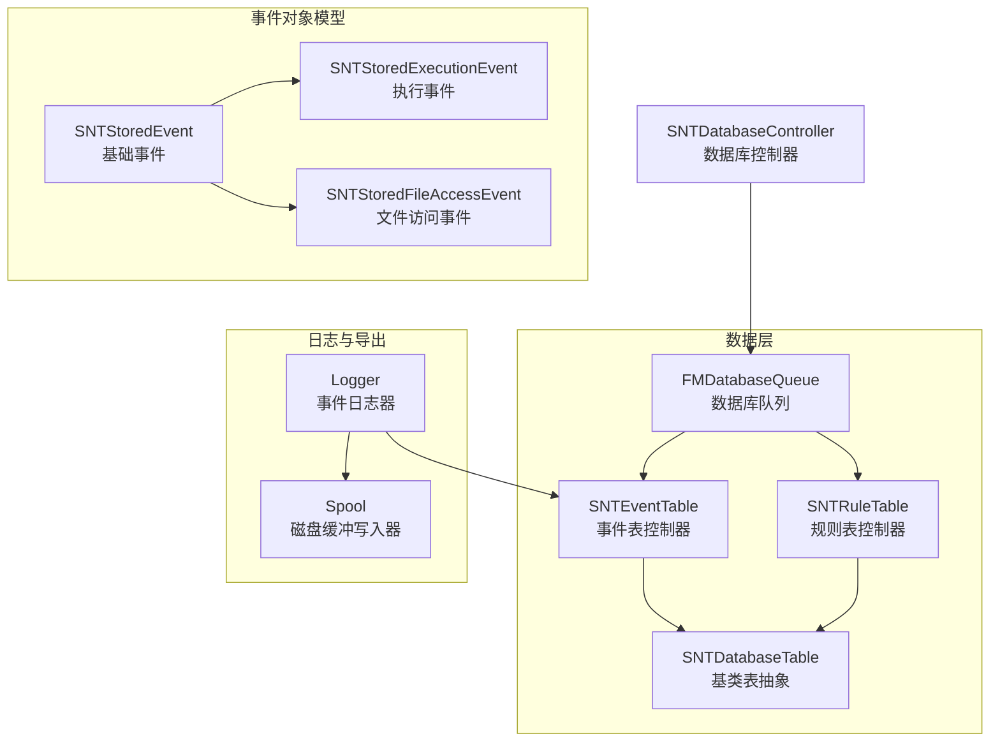
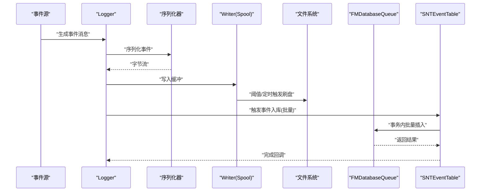
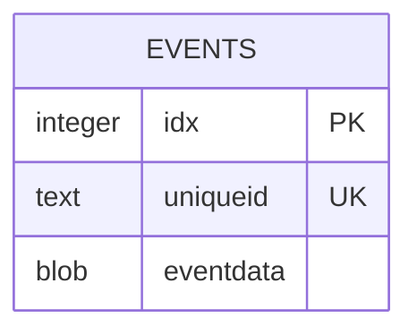
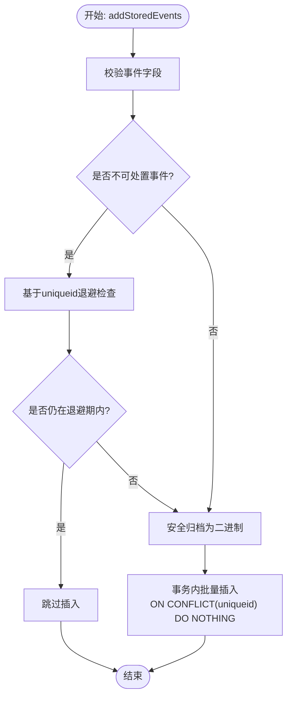
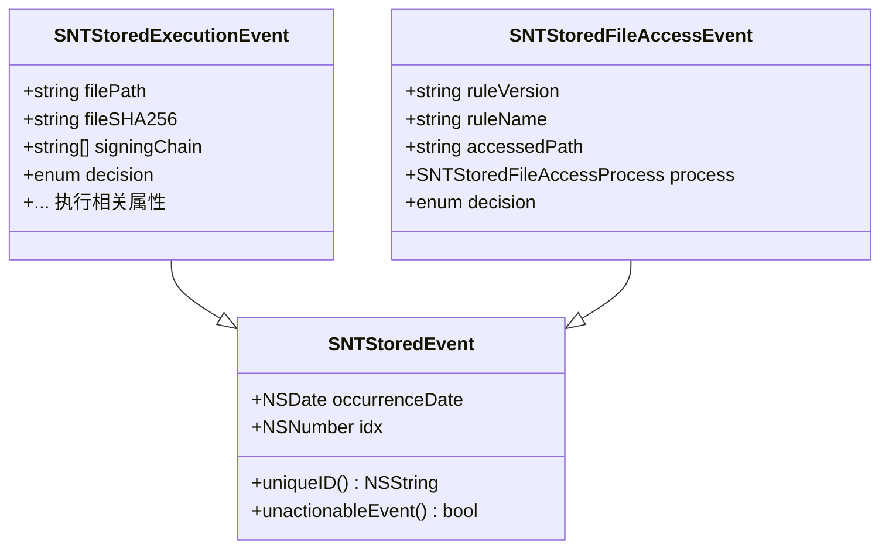
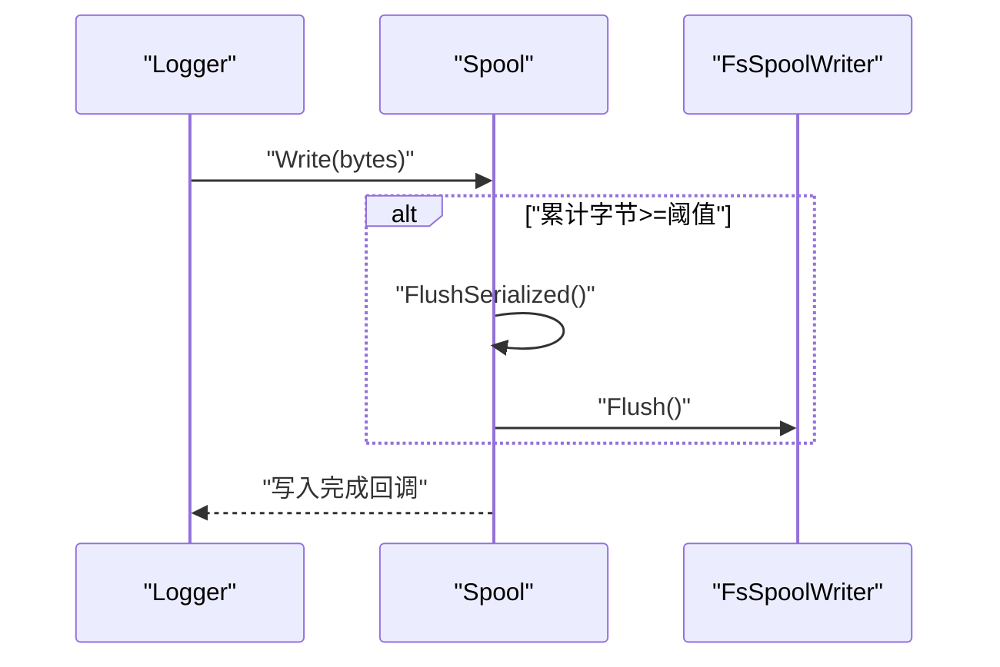
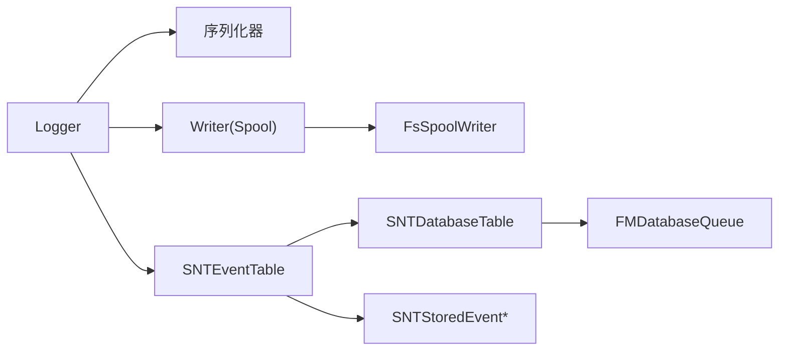

# 事件存储设计

<cite>
**本文引用的文件**
- [SNTEventTable.h](file://Source/santad/DataLayer/SNTEventTable.h)
- [SNTEventTable.mm](file://Source/santad/DataLayer/SNTEventTable.mm)
- [SNTDatabaseTable.h](file://Source/santad/DataLayer/SNTDatabaseTable.h)
- [SNTDatabaseTable.mm](file://Source/santad/DataLayer/SNTDatabaseTable.mm)
- [SNTDatabaseController.h](file://Source/santad/SNTDatabaseController.h)
- [SNTDatabaseController.mm](file://Source/santad/SNTDatabaseController.mm)
- [SNTStoredEvent.h](file://Source/common/SNTStoredEvent.h)
- [SNTStoredEvent.mm](file://Source/common/SNTStoredEvent.mm)
- [SNTStoredExecutionEvent.h](file://Source/common/SNTStoredExecutionEvent.h)
- [SNTStoredFileAccessEvent.h](file://Source/common/SNTStoredFileAccessEvent.h)
- [Logger.h](file://Source/santad/Logs/EndpointSecurity/Logger.h)
- [Spool.h](file://Source/santad/Logs/EndpointSecurity/Writers/Spool.h)
- [SNTEventTableTest.mm](file://Source/santad/DataLayer/SNTEventTableTest.mm)
- [SNTSyncConstants.mm](file://Source/common/SNTSyncConstants.mm)
- [SNTSyncConfigBundle.mm](file://Source/santasyncservice/SNTSyncConfigBundle.mm)
</cite>

## 目录
1. [简介](#简介)
2. [项目结构](#项目结构)
3. [核心组件](#核心组件)
4. [架构总览](#架构总览)
5. [组件详解](#组件详解)
6. [依赖关系分析](#依赖关系分析)
7. [性能考量](#性能考量)
8. [故障排除指南](#故障排除指南)
9. [结论](#结论)
10. [附录](#附录)

## 简介
本文件面向Santa事件存储子系统，围绕事件数据库架构、表结构设计与索引策略进行系统化技术说明；深入解析SNTEventTable的实现细节、数据持久化机制与事务处理；阐述事件存储的生命周期管理、数据清理策略与存储空间优化；并提供数据库性能调优建议、备份恢复方案与容量规划指导，以及存储相关的故障排除方法与监控指标。

## 项目结构
事件存储位于守护进程模块中，采用“数据层控制器 + 表控制器 + 基类表抽象 + 事件对象模型”的分层组织方式，并通过数据库控制器统一初始化与权限设置。日志侧写入路径与落盘策略由日志器与Spool组件负责，事件上传与批量导出由同步服务与配置项控制。

图表来源
- [SNTDatabaseController.mm](file://Source/santad/SNTDatabaseController.mm#L26-L79)
- [SNTDatabaseTable.h](file://Source/santad/DataLayer/SNTDatabaseTable.h#L22-L59)
- [SNTEventTable.h](file://Source/santad/DataLayer/SNTEventTable.h#L22-L71)
- [SNTStoredEvent.h](file://Source/common/SNTStoredEvent.h#L16-L36)
- [Logger.h](file://Source/santad/Logs/EndpointSecurity/Logger.h#L47-L115)
- [Spool.h](file://Source/santad/Logs/EndpointSecurity/Writers/Spool.h#L45-L120)

章节来源
- [SNTDatabaseController.mm](file://Source/santad/SNTDatabaseController.mm#L26-L79)
- [SNTDatabaseTable.h](file://Source/santad/DataLayer/SNTDatabaseTable.h#L22-L59)
- [SNTEventTable.h](file://Source/santad/DataLayer/SNTEventTable.h#L22-L71)
- [SNTStoredEvent.h](file://Source/common/SNTStoredEvent.h#L16-L36)
- [Logger.h](file://Source/santad/Logs/EndpointSecurity/Logger.h#L47-L115)
- [Spool.h](file://Source/santad/Logs/EndpointSecurity/Writers/Spool.h#L45-L120)

## 核心组件
- 数据库控制器：负责事件数据库与规则数据库的初始化、权限设置与单例获取。
- 事件表控制器：封装事件表的建表、迁移、插入、查询、删除与去重逻辑。
- 数据库表基类：提供FMDB队列封装、事务包装、版本管理与vacuum等通用能力。
- 事件对象模型：定义可安全归档的基础事件与具体事件类型（执行、文件访问等）。
- 日志器与Spool：负责事件序列化、缓冲写入、周期性刷新与导出追踪。

章节来源
- [SNTDatabaseController.mm](file://Source/santad/SNTDatabaseController.mm#L26-L79)
- [SNTEventTable.mm](file://Source/santad/DataLayer/SNTEventTable.mm#L42-L103)
- [SNTDatabaseTable.h](file://Source/santad/DataLayer/SNTDatabaseTable.h#L22-L59)
- [SNTStoredEvent.h](file://Source/common/SNTStoredEvent.h#L16-L36)
- [SNTStoredExecutionEvent.h](file://Source/common/SNTStoredExecutionEvent.h#L23-L142)
- [SNTStoredFileAccessEvent.h](file://Source/common/SNTStoredFileAccessEvent.h#L23-L41)
- [Logger.h](file://Source/santad/Logs/EndpointSecurity/Logger.h#L47-L115)
- [Spool.h](file://Source/santad/Logs/EndpointSecurity/Writers/Spool.h#L91-L121)

## 架构总览
事件存储采用SQLite + FMDB队列的异步并发访问模型，事件表通过唯一索引uniqueid实现跨事件类型的去重；日志侧通过Spool将事件序列化后写入磁盘缓冲，支持阈值触发与定时刷新，避免瞬时高负载导致丢弃；数据库控制器统一管理目录权限与文件权限，确保安全性与一致性。

图表来源
- [Logger.h](file://Source/santad/Logs/EndpointSecurity/Logger.h#L78-L115)
- [Spool.h](file://Source/santad/Logs/EndpointSecurity/Writers/Spool.h#L91-L121)
- [SNTEventTable.mm](file://Source/santad/DataLayer/SNTEventTable.mm#L147-L159)

## 组件详解

### 事件表架构与表结构设计
- 存储位置与命名：事件数据库位于/var/db/santa/events.db，由数据库控制器统一初始化与权限设置。
- 表结构演进：
  - 初始版本：包含自增主键idx、文件哈希字段filesha256与事件二进制blob字段eventdata。
  - 版本2：清空数据以规避历史不一致。
  - 版本3：移除AUTOINCREMENT，改用普通主键。
  - 版本4：在filesha256上建立唯一索引，先清理重复行再创建索引。
  - 版本5：列名从filesha256重命名为uniqueid，重建唯一索引。
- 唯一性策略：使用uniqueid作为去重键，覆盖不同事件类型（执行、文件访问、临时监控审计等），避免重复上报与冗余存储。
- 索引策略：对uniqueid建立唯一索引，加速去重与查询；对历史版本的filesha256列保留兼容逻辑。

图表来源
- [SNTEventTable.mm](file://Source/santad/DataLayer/SNTEventTable.mm#L52-L103)

章节来源
- [SNTDatabaseController.mm](file://Source/santad/SNTDatabaseController.mm#L26-L56)
- [SNTEventTable.mm](file://Source/santad/DataLayer/SNTEventTable.mm#L46-L103)

### SNTEventTable实现细节与事务处理
- 初始化与版本迁移：在initializeDatabase中按版本号顺序执行DDL变更，确保向后兼容与数据一致性。
- 插入流程：
  - 输入校验：对不同事件类型进行字段完整性校验。
  - 去重与退避：对不可处置事件（unactionableEvent）基于uniqueid进行缓存退避，避免频繁重复入库。
  - 序列化：使用安全归档将事件对象编码为二进制数据。
  - 批量事务：在单个事务中批量插入，使用ON CONFLICT(uniqueid) DO NOTHING保证幂等。
- 查询与删除：
  - 计数：COUNT(*)统计待处理事件数量。
  - 拉取：全表扫描读取，解码失败则自动删除脏数据。
  - 删除：支持单条与多条ID删除。

图表来源
- [SNTEventTable.mm](file://Source/santad/DataLayer/SNTEventTable.mm#L111-L159)

章节来源
- [SNTEventTable.mm](file://Source/santad/DataLayer/SNTEventTable.mm#L111-L159)
- [SNTEventTable.mm](file://Source/santad/DataLayer/SNTEventTable.mm#L174-L243)
- [SNTEventTableTest.mm](file://Source/santad/DataLayer/SNTEventTableTest.mm#L123-L225)

### 事件对象模型与生命周期
- 基类SNTStoredEvent：定义occurrenceDate与idx，要求子类实现uniqueID与unactionableEvent。
- 执行事件SNTStoredExecutionEvent：包含文件路径、签名链、决策状态、进程信息、隔离区数据等。
- 文件访问事件SNTStoredFileAccessEvent：包含规则版本/名称、被访问路径、进程信息与决策。
- 生命周期管理：
  - 创建：随机idx与发生时间。
  - 归档/解档：通过NSSecureCoding实现跨进程持久化。
  - 上报：经日志器序列化后写入Spool，最终批量入库。

图表来源
- [SNTStoredEvent.h](file://Source/common/SNTStoredEvent.h#L16-L36)
- [SNTStoredExecutionEvent.h](file://Source/common/SNTStoredExecutionEvent.h#L23-L142)
- [SNTStoredFileAccessEvent.h](file://Source/common/SNTStoredFileAccessEvent.h#L23-L41)

章节来源
- [SNTStoredEvent.h](file://Source/common/SNTStoredEvent.h#L16-L36)
- [SNTStoredEvent.mm](file://Source/common/SNTStoredEvent.mm#L20-L73)
- [SNTStoredExecutionEvent.h](file://Source/common/SNTStoredExecutionEvent.h#L23-L142)
- [SNTStoredFileAccessEvent.h](file://Source/common/SNTStoredFileAccessEvent.h#L23-L41)

### 日志侧写入与缓冲策略
- 写入器Spool：基于FSSpool实现磁盘缓冲，支持阈值触发与定时刷新；累计字节数超过阈值或定时器到期时Flush。
- 日志器Logger：根据配置决定导出类型与批大小，维护导出文件跟踪状态，周期性导出并确认已处理文件。

图表来源
- [Spool.h](file://Source/santad/Logs/EndpointSecurity/Writers/Spool.h#L91-L121)
- [Spool.h](file://Source/santad/Logs/EndpointSecurity/Writers/Spool.h#L192-L215)
- [Logger.h](file://Source/santad/Logs/EndpointSecurity/Logger.h#L101-L115)

章节来源
- [Spool.h](file://Source/santad/Logs/EndpointSecurity/Writers/Spool.h#L91-L121)
- [Logger.h](file://Source/santad/Logs/EndpointSecurity/Logger.h#L101-L115)

### 数据库控制器与安全初始化
- 路径与权限：统一在/var/db/santa创建目录并设置属主与权限；事件数据库文件权限为0600。
- 单例获取：通过dispatch_once保证线程安全的单例初始化；DEBUG与非DEBUG模式下对错误日志开关进行差异化处理。

章节来源
- [SNTDatabaseController.mm](file://Source/santad/SNTDatabaseController.mm#L26-L79)

## 依赖关系分析
- 组件耦合：
  - SNTEventTable依赖SNTDatabaseTable提供的事务封装与版本管理。
  - 事件入库依赖事件对象模型的NSSecureCoding能力。
  - 日志侧写入依赖序列化器与Spool写入器，最终通过SNTEventTable入库。
- 外部依赖：
  - FMDB队列用于并发安全的数据库访问。
  - FSSpool用于磁盘缓冲与批量刷盘。
- 循环依赖：未发现循环依赖迹象。

图表来源
- [Logger.h](file://Source/santad/Logs/EndpointSecurity/Logger.h#L78-L115)
- [Spool.h](file://Source/santad/Logs/EndpointSecurity/Writers/Spool.h#L91-L121)
- [SNTEventTable.mm](file://Source/santad/DataLayer/SNTEventTable.mm#L147-L159)
- [SNTDatabaseTable.h](file://Source/santad/DataLayer/SNTDatabaseTable.h#L22-L59)

章节来源
- [SNTEventTable.mm](file://Source/santad/DataLayer/SNTEventTable.mm#L147-L159)
- [SNTDatabaseTable.h](file://Source/santad/DataLayer/SNTDatabaseTable.h#L22-L59)
- [Logger.h](file://Source/santad/Logs/EndpointSecurity/Logger.h#L78-L115)
- [Spool.h](file://Source/santad/Logs/EndpointSecurity/Writers/Spool.h#L91-L121)

## 性能考量
- 并发与事务：
  - 使用FMDatabaseQueue串行化SQL执行，避免锁竞争；事务内批量插入减少提交开销。
  - 唯一索引uniqueid确保幂等插入，降低重复写入成本。
- 缓冲与刷盘：
  - Spool阈值触发与定时刷新平衡吞吐与延迟；合理设置阈值可避免瞬时峰值导致丢弃。
- 查询与清理：
  - 全量拉取用于导出场景，建议配合分页或游标策略以降低内存占用。
  - 对异常/损坏事件自动删除，保持表整洁。
- 空间优化：
  - 定期执行vacuum回收碎片；结合业务周期性清理历史事件。
- 配置调优：
  - 同步批次大小、导出批大小与超时参数需结合硬件与网络状况调整。

章节来源
- [SNTEventTable.mm](file://Source/santad/DataLayer/SNTEventTable.mm#L174-L243)
- [Spool.h](file://Source/santad/Logs/EndpointSecurity/Writers/Spool.h#L91-L121)
- [SNTDatabaseTable.h](file://Source/santad/DataLayer/SNTDatabaseTable.h#L44-L46)

## 故障排除指南
- 插入失败：
  - 检查事件字段完整性与类型匹配；确认uniqueid唯一性与退避策略。
  - 查看事务回滚原因与日志器写入状态。
- 查询异常：
  - 若出现脏数据，确认eventFromResultSet解档失败时会自动删除对应行。
  - 使用pendingEventsCount核对实际待处理数量。
- 导出问题：
  - 检查Spool Flush失败日志与磁盘空间；确认导出文件跟踪状态。
  - 核对导出批大小与超时配置，避免批量过大导致超时。
- 权限与路径：
  - 确认/var/db/santa目录属主与权限正确；事件数据库文件权限为0600。

章节来源
- [SNTEventTable.mm](file://Source/santad/DataLayer/SNTEventTable.mm#L174-L243)
- [SNTEventTableTest.mm](file://Source/santad/DataLayer/SNTEventTableTest.mm#L371-L388)
- [Spool.h](file://Source/santad/Logs/EndpointSecurity/Writers/Spool.h#L111-L118)
- [SNTDatabaseController.mm](file://Source/santad/SNTDatabaseController.mm#L26-L56)

## 结论
事件存储通过清晰的表结构演进、严格的唯一性去重与事务化入库、以及日志侧缓冲与定时刷盘策略，在保证高可靠性的同时兼顾了性能与可维护性。配合合理的容量规划与监控告警，可满足生产环境下的长期稳定运行。

## 附录

### 数据库版本迁移要点
- 版本1到版本2：清空数据以规避历史不一致风险。
- 版本3：移除AUTOINCREMENT，提升主键管理灵活性。
- 版本4：建立uniqueid唯一索引前先清理重复行。
- 版本5：列名重命名为uniqueid，适配多事件类型去重需求。

章节来源
- [SNTEventTable.mm](file://Source/santad/DataLayer/SNTEventTable.mm#L46-L103)

### 事件上传与批处理配置
- 默认事件批大小：参考默认批大小常量。
- 同步间隔与退避：全量同步、规则同步与配置同步的默认间隔与退避策略。
- 导出配置：日志器根据配置块动态更新导出参数。

章节来源
- [SNTSyncConstants.mm](file://Source/common/SNTSyncConstants.mm#L145-L159)
- [SNTSyncConfigBundle.mm](file://Source/santasyncservice/SNTSyncConfigBundle.mm#L17-L46)
- [Logger.h](file://Source/santad/Logs/EndpointSecurity/Logger.h#L101-L115)