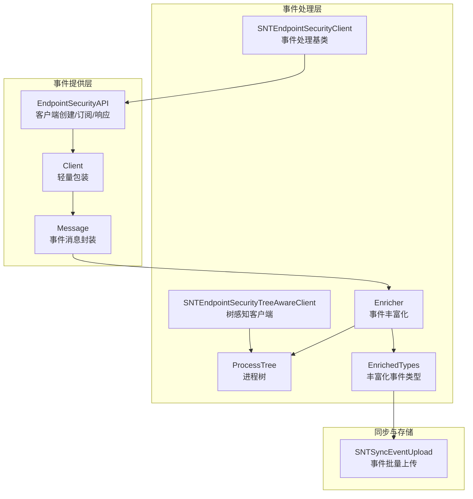
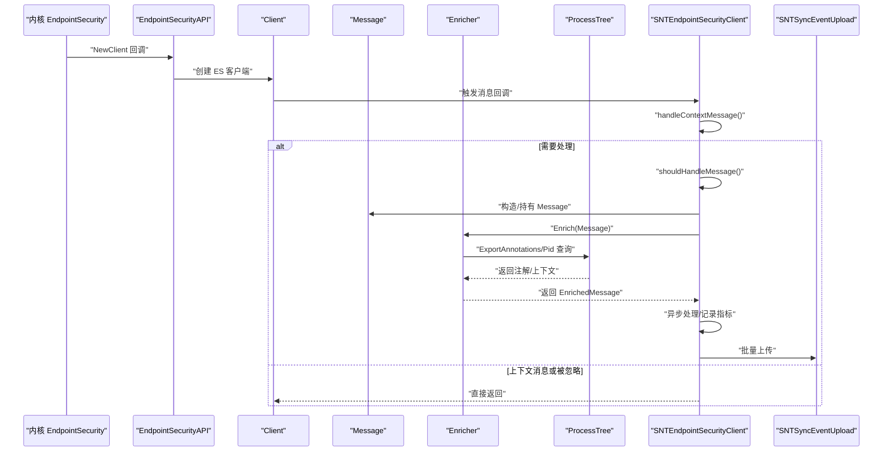
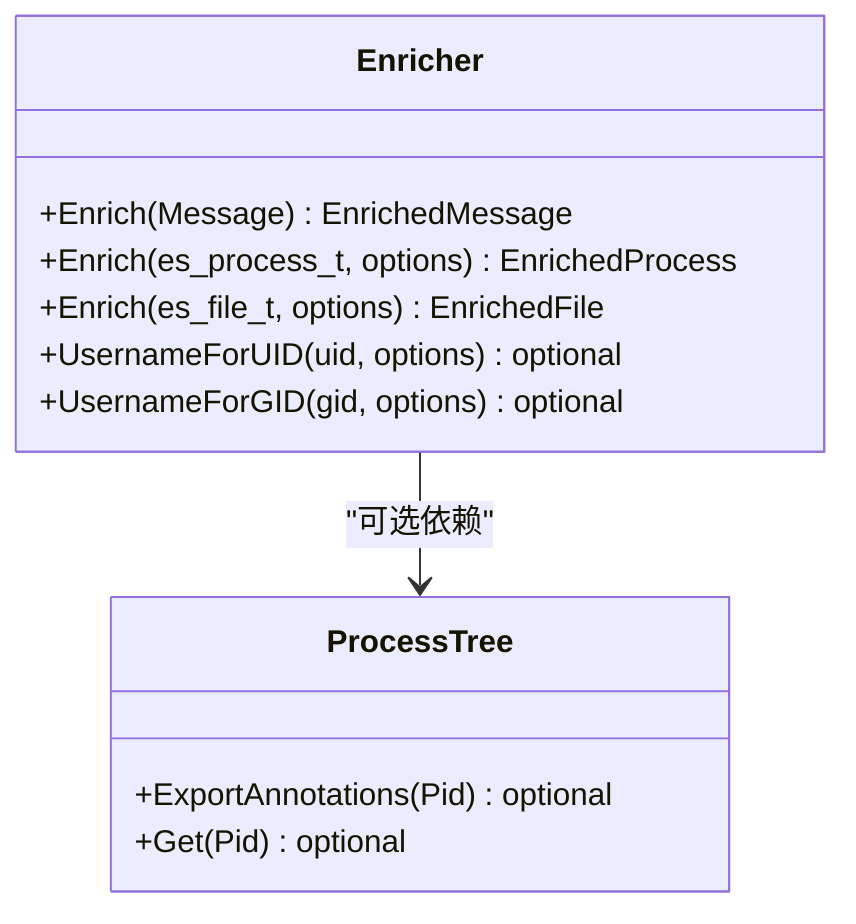
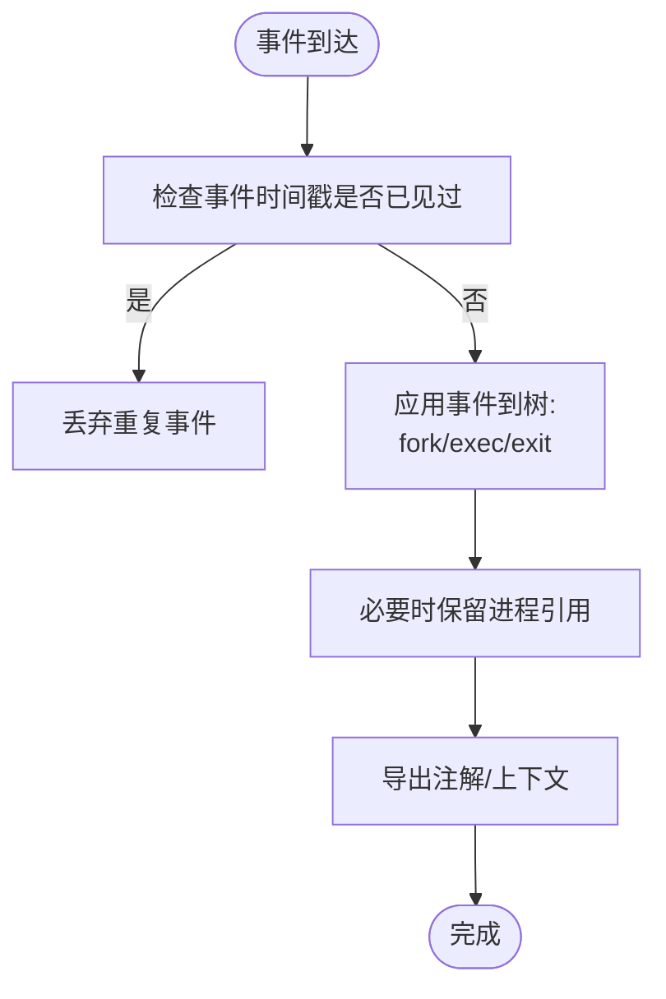
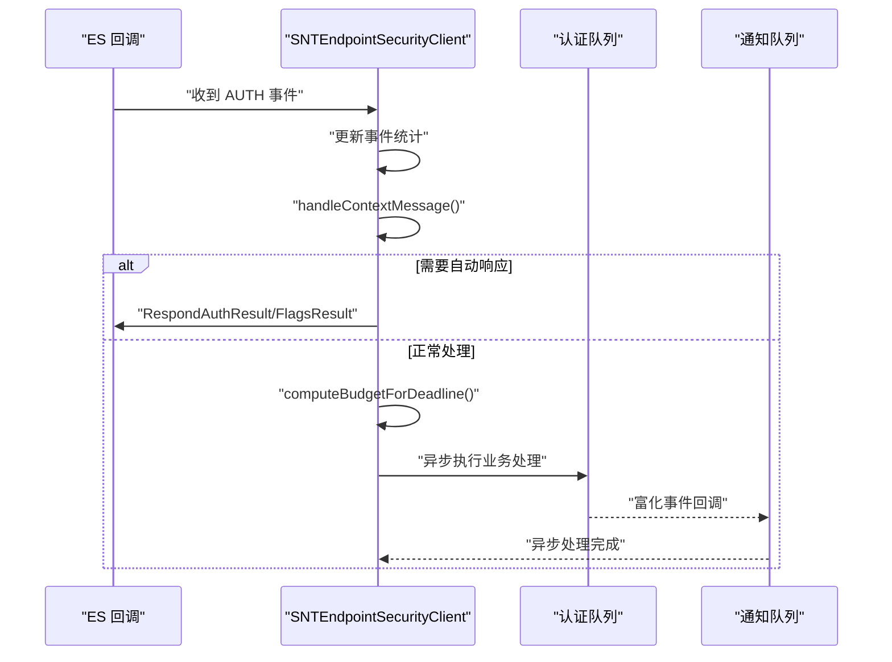
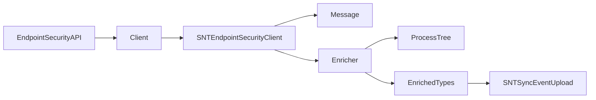

# 事件捕获与处理

<cite>
**本文引用的文件**
- [EndpointSecurityAPI.h](file://Source/santad/EventProviders/EndpointSecurity/EndpointSecurityAPI.h)
- [Client.h](file://Source/santad/EventProviders/EndpointSecurity/Client.h)
- [Message.h](file://Source/santad/EventProviders/EndpointSecurity/Message.h)
- [Message.mm](file://Source/santad/EventProviders/EndpointSecurity/Message.mm)
- [Enricher.h](file://Source/santad/EventProviders/EndpointSecurity/Enricher.h)
- [Enricher.mm](file://Source/santad/EventProviders/EndpointSecurity/Enricher.mm)
- [EnrichedTypes.h](file://Source/santad/EventProviders/EndpointSecurity/EnrichedTypes.h)
- [SNTEndpointSecurityClient.h](file://Source/santad/EventProviders/SNTEndpointSecurityClient.h)
- [SNTEndpointSecurityClient.mm](file://Source/santad/EventProviders/SNTEndpointSecurityClient.mm)
- [SNTEndpointSecurityTreeAwareClient.h](file://Source/santad/EventProviders/SNTEndpointSecurityTreeAwareClient.h)
- [process_tree.h](file://Source/santad/ProcessTree/process_tree.h)
- [process_tree.cc](file://Source/santad/ProcessTree/process_tree.cc)
- [SNTSyncEventUpload.mm](file://Source/santasyncservice/SNTSyncEventUpload.mm)
</cite>

## 目录
1. [引言](#引言)
2. [项目结构](#项目结构)
3. [核心组件](#核心组件)
4. [架构总览](#架构总览)
5. [详细组件分析](#详细组件分析)
6. [依赖关系分析](#依赖关系分析)
7. [性能考虑](#性能考虑)
8. [故障排查指南](#故障排查指南)
9. [结论](#结论)
10. [附录](#附录)

## 引言
本技术文档围绕 Santa 的“事件捕获与处理”流程展开，重点覆盖以下方面：
- 使用 Apple Endpoint Security API 捕获系统内核事件并进行授权与响应。
- 事件捕获机制、消息封装与生命周期管理。
- 事件丰富化（Enricher）的作用、进程树构建与事件上下文信息提取。
- 事件处理管道的完整流程图、错误处理策略与重试机制。
- 性能优化、并发控制与内存管理最佳实践。

## 项目结构
事件相关代码主要集中在以下模块：
- 事件提供层：EndpointSecurity 包装、消息封装、客户端桥接。
- 事件处理层：事件丰富化、进程树、处理器接口。
- 同步与上传：事件批量上传与数据库清理。

图表来源
- [EndpointSecurityAPI.h](file://Source/santad/EventProviders/EndpointSecurity/EndpointSecurityAPI.h#L30-L75)
- [Client.h](file://Source/santad/EventProviders/EndpointSecurity/Client.h#L24-L65)
- [Message.h](file://Source/santad/EventProviders/EndpointSecurity/Message.h#L30-L90)
- [Enricher.h](file://Source/santad/EventProviders/EndpointSecurity/Enricher.h#L35-L73)
- [process_tree.h](file://Source/santad/ProcessTree/process_tree.h#L34-L109)
- [EnrichedTypes.h](file://Source/santad/EventProviders/EndpointSecurity/EnrichedTypes.h#L137-L169)
- [SNTEndpointSecurityClient.h](file://Source/santad/EventProviders/SNTEndpointSecurityClient.h#L15-L21)
- [SNTEndpointSecurityTreeAwareClient.h](file://Source/santad/EventProviders/SNTEndpointSecurityTreeAwareClient.h#L15-L29)
- [SNTSyncEventUpload.mm](file://Source/santasyncservice/SNTSyncEventUpload.mm#L144-L177)

章节来源
- [EndpointSecurityAPI.h](file://Source/santad/EventProviders/EndpointSecurity/EndpointSecurityAPI.h#L30-L75)
- [Client.h](file://Source/santad/EventProviders/EndpointSecurity/Client.h#L24-L65)
- [Message.h](file://Source/santad/EventProviders/EndpointSecurity/Message.h#L30-L90)
- [Enricher.h](file://Source/santad/EventProviders/EndpointSecurity/Enricher.h#L35-L73)
- [process_tree.h](file://Source/santad/ProcessTree/process_tree.h#L34-L109)
- [EnrichedTypes.h](file://Source/santad/EventProviders/EndpointSecurity/EnrichedTypes.h#L137-L169)
- [SNTEndpointSecurityClient.h](file://Source/santad/EventProviders/SNTEndpointSecurityClient.h#L15-L21)
- [SNTEndpointSecurityTreeAwareClient.h](file://Source/santad/EventProviders/SNTEndpointSecurityTreeAwareClient.h#L15-L29)
- [SNTSyncEventUpload.mm](file://Source/santasyncservice/SNTSyncEventUpload.mm#L144-L177)

## 核心组件
- EndpointSecurityAPI：对 Apple EndpointSecurity 的 C 接口进行抽象，提供客户端创建、订阅、取消静音、响应结果等能力；同时提供执行参数、环境变量、文件描述符等访问方法。
- Client：对底层 es_client_t 的轻量包装，负责生命周期管理与连接状态判断。
- Message：对 es_message_t 的安全封装，负责路径目标解析、父进程名/路径查询、生命周期持有与释放。
- Enricher：根据事件类型将原始 ES 事件转换为富化事件对象，补充用户/组名、可选的进程注解与文件元数据。
- ProcessTree：维护系统进程树，支持 fork/exec/exit 等事件驱动的树更新，并提供注解导出与根切片遍历。
- EnrichedTypes：定义所有富化事件类型的统一接口与具体变体，便于序列化与后续处理。
- SNTEndpointSecurityClient：事件处理基类，负责建立 ES 客户端、处理授权超时、记录指标、分发到处理队列。
- SNTEndpointSecurityTreeAwareClient：在基类基础上注入进程树，用于事件上下文增强。
- SNTSyncEventUpload：事件批量上传与数据库清理逻辑。

章节来源
- [EndpointSecurityAPI.h](file://Source/santad/EventProviders/EndpointSecurity/EndpointSecurityAPI.h#L30-L75)
- [Client.h](file://Source/santad/EventProviders/EndpointSecurity/Client.h#L24-L65)
- [Message.h](file://Source/santad/EventProviders/EndpointSecurity/Message.h#L30-L90)
- [Message.mm](file://Source/santad/EventProviders/EndpointSecurity/Message.mm#L50-L191)
- [Enricher.h](file://Source/santad/EventProviders/EndpointSecurity/Enricher.h#L35-L73)
- [Enricher.mm](file://Source/santad/EventProviders/EndpointSecurity/Enricher.mm#L40-L195)
- [process_tree.h](file://Source/santad/ProcessTree/process_tree.h#L34-L109)
- [process_tree.cc](file://Source/santad/ProcessTree/process_tree.cc#L70-L113)
- [EnrichedTypes.h](file://Source/santad/EventProviders/EndpointSecurity/EnrichedTypes.h#L137-L169)
- [SNTEndpointSecurityClient.h](file://Source/santad/EventProviders/SNTEndpointSecurityClient.h#L15-L21)
- [SNTEndpointSecurityClient.mm](file://Source/santad/EventProviders/SNTEndpointSecurityClient.mm#L133-L179)
- [SNTEndpointSecurityTreeAwareClient.h](file://Source/santad/EventProviders/SNTEndpointSecurityTreeAwareClient.h#L15-L29)
- [SNTSyncEventUpload.mm](file://Source/santasyncservice/SNTSyncEventUpload.mm#L144-L177)

## 架构总览
下图展示了从 ES 客户端回调到事件富化、上下文提取、处理与上传的整体流程。

图表来源
- [SNTEndpointSecurityClient.mm](file://Source/santad/EventProviders/SNTEndpointSecurityClient.mm#L133-L179)
- [Message.mm](file://Source/santad/EventProviders/EndpointSecurity/Message.mm#L50-L191)
- [Enricher.mm](file://Source/santad/EventProviders/EndpointSecurity/Enricher.mm#L40-L195)
- [process_tree.cc](file://Source/santad/ProcessTree/process_tree.cc#L195-L206)
- [SNTSyncEventUpload.mm](file://Source/santasyncservice/SNTSyncEventUpload.mm#L144-L177)

## 详细组件分析

### EndpointSecurity API 使用与事件捕获
- 客户端建立：通过 EndpointSecurityAPI::NewClient 创建 ES 客户端，传入回调闭包以接收事件消息。
- 订阅与静音：使用 Subscribe 指定感兴趣的事件集合；通过 UnmuteAllPaths/UnmuteAllTargetPaths、InvertProcessMuting/InvertTargetPathMuting 等接口实现细粒度静音控制。
- 响应与缓存：对授权事件使用 RespondAuthResult 或 RespondFlagsResult 进行响应；必要时 ClearCache 清理内部缓存。
- 执行上下文：提供 ExecArg/Env/FD 系列方法读取 exec 事件的参数、环境与 FD 列表。

章节来源
- [EndpointSecurityAPI.h](file://Source/santad/EventProviders/EndpointSecurity/EndpointSecurityAPI.h#L34-L75)
- [Client.h](file://Source/santad/EventProviders/EndpointSecurity/Client.h#L24-L65)
- [SNTEndpointSecurityClient.mm](file://Source/santad/EventProviders/SNTEndpointSecurityClient.mm#L181-L232)
- [SNTEndpointSecurityClient.mm](file://Source/santad/EventProviders/SNTEndpointSecurityClient.mm#L256-L269)

### 事件消息封装与生命周期
- Message 负责对 es_message_t 的安全封装，提供 Retain/Release 生命周期管理，避免回调结束后的悬垂访问。
- 提供 PathTargets 解析，按事件类型收集目标路径，避免路径截断导致的数据缺失。
- 提供父进程名与路径查询，辅助事件上下文构建。

章节来源
- [Message.h](file://Source/santad/EventProviders/EndpointSecurity/Message.h#L30-L90)
- [Message.mm](file://Source/santad/EventProviders/EndpointSecurity/Message.mm#L50-L191)

### 事件丰富化（Enricher）
- Enricher 将原始 ES 事件转换为 EnrichedMessage，覆盖多种事件类型（如 EXEC、FORK、EXIT、RENAME、AUTHENTICATION 等），并补充：
  - 用户/组名：通过本地查找缓存（用户名/组名缓存）减少外部调用开销。
  - 可选的进程注解：当存在进程树时，导出合并后的 Annotations。
  - 文件元数据：补充文件属主/属组等信息。
- EnrichOptions 支持 kLocalOnly 选项，限制仅使用本地信息，避免触发外部进程工作。

图表来源
- [Enricher.h](file://Source/santad/EventProviders/EndpointSecurity/Enricher.h#L35-L73)
- [Enricher.mm](file://Source/santad/EventProviders/EndpointSecurity/Enricher.mm#L40-L195)
- [process_tree.h](file://Source/santad/ProcessTree/process_tree.h#L84-L109)

章节来源
- [Enricher.h](file://Source/santad/EventProviders/EndpointSecurity/Enricher.h#L35-L73)
- [Enricher.mm](file://Source/santad/EventProviders/EndpointSecurity/Enricher.mm#L40-L195)
- [EnrichedTypes.h](file://Source/santad/EventProviders/EndpointSecurity/EnrichedTypes.h#L137-L169)

### 进程树构建与事件上下文提取
- ProcessTree 支持 HandleFork/HandleExec/HandleExit 三类事件驱动的树更新，保证事件时间戳有序性与幂等处理。
- 通过 ExportAnnotations 导出合并后的注解，供 Enricher 注入到 EnrichedProcess 中。
- 提供 RootSlice 获取自事件进程向上至根的进程链，便于审计与溯源。

图表来源
- [process_tree.cc](file://Source/santad/ProcessTree/process_tree.cc#L114-L158)
- [process_tree.cc](file://Source/santad/ProcessTree/process_tree.cc#L160-L180)
- [process_tree.cc](file://Source/santad/ProcessTree/process_tree.cc#L195-L206)

章节来源
- [process_tree.h](file://Source/santad/ProcessTree/process_tree.h#L34-L109)
- [process_tree.cc](file://Source/santad/ProcessTree/process_tree.cc#L70-L113)
- [process_tree.cc](file://Source/santad/ProcessTree/process_tree.cc#L114-L158)
- [process_tree.cc](file://Source/santad/ProcessTree/process_tree.cc#L160-L180)
- [process_tree.cc](file://Source/santad/ProcessTree/process_tree.cc#L195-L206)

### 事件处理管道与授权超时
- 建立 ES 客户端后，回调中先更新事件统计，再尝试处理上下文消息；若非上下文消息则进入授权处理。
- 对 AUTH 类事件采用双队列并发模型：
  - 认证队列（用户交互优先级）：处理业务逻辑。
  - 通知队列（工具队列）：异步分发富化后的事件。
- 授权超时预算：根据事件截止时间计算处理预算，确保在截止前完成响应，避免阻塞系统授权。
- 自动静音自身进程，防止事件回环。

图表来源
- [SNTEndpointSecurityClient.mm](file://Source/santad/EventProviders/SNTEndpointSecurityClient.mm#L133-L179)
- [SNTEndpointSecurityClient.mm](file://Source/santad/EventProviders/SNTEndpointSecurityClient.mm#L271-L284)
- [SNTEndpointSecurityClient.mm](file://Source/santad/EventProviders/SNTEndpointSecurityClient.mm#L286-L302)
- [SNTEndpointSecurityClient.mm](file://Source/santad/EventProviders/SNTEndpointSecurityClient.mm#L304-L356)

章节来源
- [SNTEndpointSecurityClient.mm](file://Source/santad/EventProviders/SNTEndpointSecurityClient.mm#L133-L179)
- [SNTEndpointSecurityClient.mm](file://Source/santad/EventProviders/SNTEndpointSecurityClient.mm#L271-L284)
- [SNTEndpointSecurityClient.mm](file://Source/santad/EventProviders/SNTEndpointSecurityClient.mm#L286-L302)
- [SNTEndpointSecurityClient.mm](file://Source/santad/EventProviders/SNTEndpointSecurityClient.mm#L304-L356)

### 错误处理策略与重试机制
- 客户端建立失败：根据返回码映射错误信息，记录日志并抛出异常，避免继续运行。
- 事件类型校验：非 AUTH 事件进入处理流程会触发异常，防止误处理。
- 超时自动响应：根据 fail-closed 配置决定默认允许/拒绝，确保在截止时间到达时仍能及时响应。
- 数据库清理：上传成功后移除已发送事件 ID，避免重复上传。

章节来源
- [SNTEndpointSecurityClient.mm](file://Source/santad/EventProviders/SNTEndpointSecurityClient.mm#L98-L109)
- [SNTEndpointSecurityClient.mm](file://Source/santad/EventProviders/SNTEndpointSecurityClient.mm#L304-L310)
- [SNTEndpointSecurityClient.mm](file://Source/santad/EventProviders/SNTEndpointSecurityClient.mm#L333-L345)
- [SNTSyncEventUpload.mm](file://Source/santasyncservice/SNTSyncEventUpload.mm#L144-L177)

### 事件处理性能优化、并发控制与内存管理
- 并发模型：
  - 认证队列：高优先级，承载授权决策与响应。
  - 通知队列：低优先级，承载富化事件的异步处理。
- 预算控制：基于事件截止时间动态计算处理预算，限制最长处理时间，保障系统响应性。
- 内存管理：
  - Message 对 es_message_t 进行持有与释放，避免悬垂指针。
  - Enricher 使用本地缓存（用户名/组名）降低系统调用频率。
  - ProcessTree 使用引用计数与墓碑标记，在异步处理期间保留进程快照，结束后回收。
- 资源清理：Client 在析构时删除 ES 客户端，避免资源泄漏。

章节来源
- [SNTEndpointSecurityClient.mm](file://Source/santad/EventProviders/SNTEndpointSecurityClient.mm#L57-L96)
- [SNTEndpointSecurityClient.mm](file://Source/santad/EventProviders/SNTEndpointSecurityClient.mm#L286-L302)
- [Message.mm](file://Source/santad/EventProviders/EndpointSecurity/Message.mm#L50-L59)
- [Enricher.mm](file://Source/santad/EventProviders/EndpointSecurity/Enricher.mm#L225-L269)
- [process_tree.cc](file://Source/santad/ProcessTree/process_tree.cc#L160-L180)
- [Client.h](file://Source/santad/EventProviders/EndpointSecurity/Client.h#L31-L36)

## 依赖关系分析
- 组件耦合：
  - SNTEndpointSecurityClient 依赖 EndpointSecurityAPI 与 Metrics，负责事件入口与指标记录。
  - Enricher 依赖 ProcessTree 与 Message，负责上下文增强。
  - EnrichedTypes 作为富化事件的统一载体，贯穿上传与存储阶段。
- 外部依赖：
  - Apple EndpointSecurity、libproc、bsm 等系统库。
  - Google Protocol Buffers（用于注解导出与序列化）。

图表来源
- [EndpointSecurityAPI.h](file://Source/santad/EventProviders/EndpointSecurity/EndpointSecurityAPI.h#L30-L75)
- [Client.h](file://Source/santad/EventProviders/EndpointSecurity/Client.h#L24-L65)
- [SNTEndpointSecurityClient.mm](file://Source/santad/EventProviders/SNTEndpointSecurityClient.mm#L133-L179)
- [Enricher.mm](file://Source/santad/EventProviders/EndpointSecurity/Enricher.mm#L40-L195)
- [process_tree.cc](file://Source/santad/ProcessTree/process_tree.cc#L195-L206)
- [EnrichedTypes.h](file://Source/santad/EventProviders/EndpointSecurity/EnrichedTypes.h#L773-L792)
- [SNTSyncEventUpload.mm](file://Source/santasyncservice/SNTSyncEventUpload.mm#L144-L177)

章节来源
- [EndpointSecurityAPI.h](file://Source/santad/EventProviders/EndpointSecurity/EndpointSecurityAPI.h#L30-L75)
- [Client.h](file://Source/santad/EventProviders/EndpointSecurity/Client.h#L24-L65)
- [SNTEndpointSecurityClient.mm](file://Source/santad/EventProviders/SNTEndpointSecurityClient.mm#L133-L179)
- [Enricher.mm](file://Source/santad/EventProviders/EndpointSecurity/Enricher.mm#L40-L195)
- [process_tree.cc](file://Source/santad/ProcessTree/process_tree.cc#L195-L206)
- [EnrichedTypes.h](file://Source/santad/EventProviders/EndpointSecurity/EnrichedTypes.h#L773-L792)
- [SNTSyncEventUpload.mm](file://Source/santasyncservice/SNTSyncEventUpload.mm#L144-L177)

## 性能考虑
- 事件批量化与延迟：利用事件截止时间计算处理预算，避免长时间占用认证队列。
- 缓存命中：Enricher 的用户名/组名缓存减少系统调用次数；ProcessTree 的注解导出避免重复扫描。
- 并发隔离：认证与通知分离，避免富化/上报阻塞授权路径。
- 资源复用：Message 移动语义减少拷贝；Client 生命周期由 RAII 管理。

## 故障排查指南
- 客户端无法建立：
  - 检查 Full Disk Access 权限、权限位、进程特权级别。
  - 查看错误码映射与日志输出。
- 非 AUTH 事件导致异常：
  - 确认事件订阅范围与处理分支。
- 授权未响应：
  - 检查 fail-closed 配置与截止时间预算。
  - 观察认证队列与通知队列的任务积压。
- 事件重复或丢失：
  - 检查 ProcessTree 时间戳滚动窗口与引用计数回收逻辑。
- 上传失败：
  - 确认批量大小阈值与数据库清理调用。

章节来源
- [SNTEndpointSecurityClient.mm](file://Source/santad/EventProviders/SNTEndpointSecurityClient.mm#L98-L109)
- [SNTEndpointSecurityClient.mm](file://Source/santad/EventProviders/SNTEndpointSecurityClient.mm#L304-L310)
- [SNTEndpointSecurityClient.mm](file://Source/santad/EventProviders/SNTEndpointSecurityClient.mm#L333-L345)
- [process_tree.cc](file://Source/santad/ProcessTree/process_tree.cc#L114-L158)
- [SNTSyncEventUpload.mm](file://Source/santasyncservice/SNTSyncEventUpload.mm#L144-L177)

## 结论
Santa 的事件捕获与处理体系通过 ES API 与自研封装，实现了对系统事件的高效捕获、富化与上下文增强，并以严格的并发与预算控制保障系统稳定性。结合进程树注解与批量上传机制，整体方案兼顾了可观测性与性能。

## 附录
- 关键实现路径参考：
  - 客户端建立与错误映射：[SNTEndpointSecurityClient.mm](file://Source/santad/EventProviders/SNTEndpointSecurityClient.mm#L98-L109)
  - 事件回调与处理入口：[SNTEndpointSecurityClient.mm](file://Source/santad/EventProviders/SNTEndpointSecurityClient.mm#L133-L179)
  - 授权超时与预算计算：[SNTEndpointSecurityClient.mm](file://Source/santad/EventProviders/SNTEndpointSecurityClient.mm#L286-L302)
  - 事件富化与注解导出：[Enricher.mm](file://Source/santad/EventProviders/EndpointSecurity/Enricher.mm#L40-L195), [process_tree.cc](file://Source/santad/ProcessTree/process_tree.cc#L195-L206)
  - 上传与清理：[SNTSyncEventUpload.mm](file://Source/santasyncservice/SNTSyncEventUpload.mm#L144-L177)