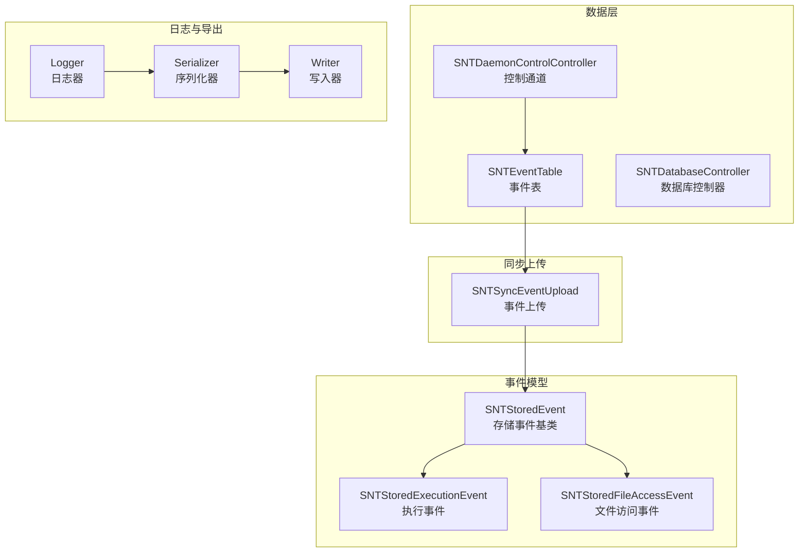
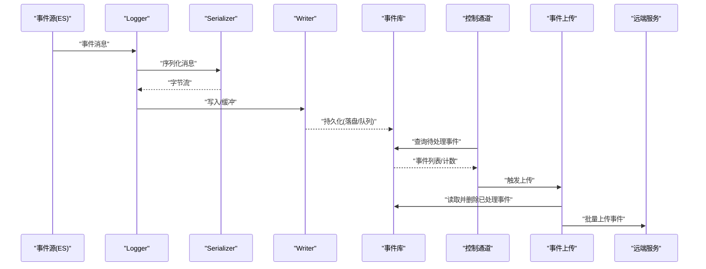
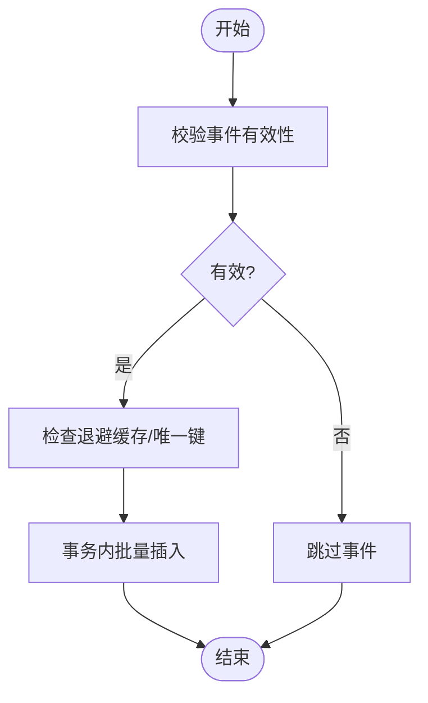
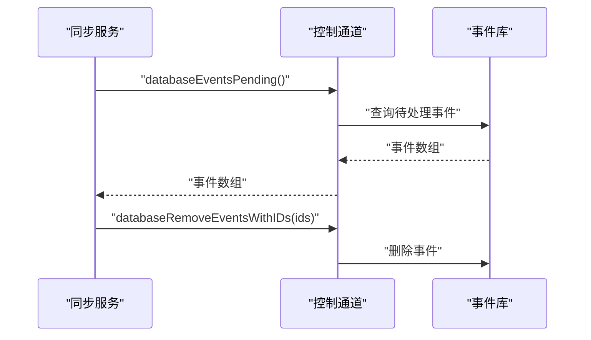
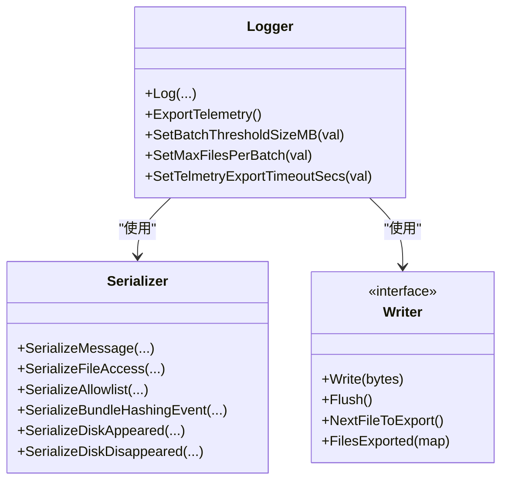
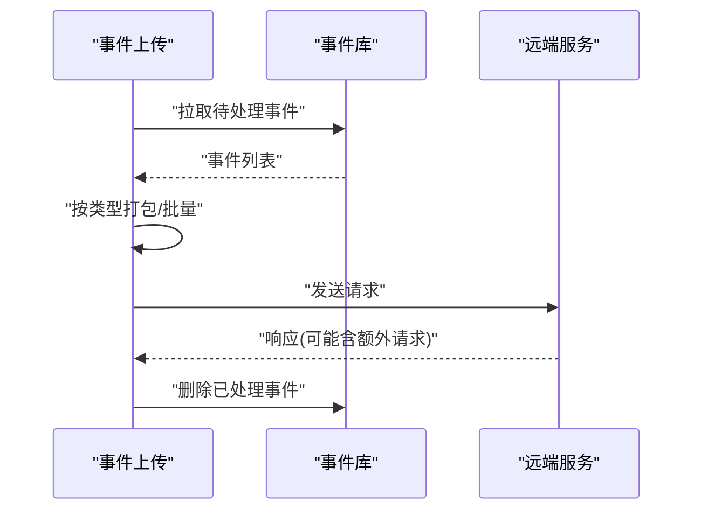
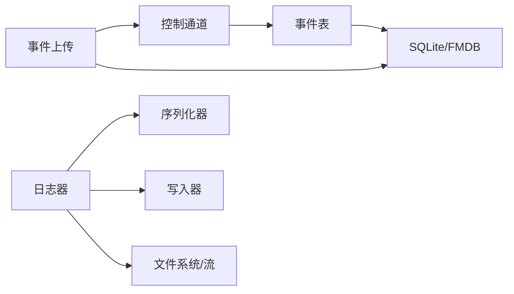

# 事件查询与过滤

<cite>
**本文引用的文件**
- [SNTEventTable.h](file://Source/santad/DataLayer/SNTEventTable.h)
- [SNTEventTable.mm](file://Source/santad/DataLayer/SNTEventTable.mm)
- [SNTDatabaseController.h](file://Source/santad/SNTDatabaseController.h)
- [SNTDaemonControlController.mm](file://Source/santad/SNTDaemonControlController.mm)
- [SNTStoredEvent.h](file://Source/common/SNTStoredEvent.h)
- [SNTStoredEvent.mm](file://Source/common/SNTStoredEvent.mm)
- [SNTStoredExecutionEvent.h](file://Source/common/SNTStoredExecutionEvent.h)
- [SNTStoredFileAccessEvent.h](file://Source/common/SNTStoredFileAccessEvent.h)
- [SNTSyncEventUpload.h](file://Source/santasyncservice/SNTSyncEventUpload.h)
- [SNTSyncEventUpload.mm](file://Source/santasyncservice/SNTSyncEventUpload.mm)
- [Logger.h](file://Source/santad/Logs/EndpointSecurity/Logger.h)
- [Logger.mm](file://Source/santad/Logs/EndpointSecurity/Logger.mm)
- [Serializer.h](file://Source/santad/Logs/EndpointSecurity/Serializers/Serializer.h)
- [Protobuf.mm](file://Source/santad/Logs/EndpointSecurity/Serializers/Protobuf.mm)
- [SantadDeps.mm](file://Source/santad/SantadDeps.mm)
- [SNTEventTableTest.mm](file://Source/santad/DataLayer/SNTEventTableTest.mm)
- [SNTSyncTest.mm](file://Source/santasyncservice/SNTSyncTest.mm)
</cite>

## 目录
1. [简介](#简介)
2. [项目结构](#项目结构)
3. [核心组件](#核心组件)
4. [架构总览](#架构总览)
5. [详细组件分析](#详细组件分析)
6. [依赖关系分析](#依赖关系分析)
7. [性能考量](#性能考量)
8. [故障排查指南](#故障排查指南)
9. [结论](#结论)
10. [附录](#附录)

## 简介
本技术文档围绕 Santa 的“事件查询与过滤”能力进行系统化梳理，覆盖以下方面：
- 事件查询接口设计与过滤条件
- 事件序列化机制、日志格式化与导出流程
- 查询性能优化策略（索引、事务、去重）
- 常用查询场景、API 调用方法与批量查询最佳实践
- 排序、分页与聚合分析的实现现状与扩展建议

## 项目结构
与事件查询与过滤直接相关的核心模块包括：
- 数据层：事件表、数据库控制器、控制通道
- 日志与导出：事件序列化器、写入器、导出调度
- 同步上传：事件打包与上传流程
- 事件模型：存储事件基类及执行/文件访问等具体事件类型

图表来源
- [SNTEventTable.h](file://Source/santad/DataLayer/SNTEventTable.h#L1-L72)
- [SNTEventTable.mm](file://Source/santad/DataLayer/SNTEventTable.mm#L1-L244)
- [SNTDatabaseController.h](file://Source/santad/SNTDatabaseController.h#L1-L40)
- [SNTDaemonControlController.mm](file://Source/santad/SNTDaemonControlController.mm#L185-L222)
- [SNTStoredEvent.h](file://Source/common/SNTStoredEvent.h#L1-L36)
- [SNTStoredEvent.mm](file://Source/common/SNTStoredEvent.mm#L1-L74)
- [SNTStoredExecutionEvent.h](file://Source/common/SNTStoredExecutionEvent.h#L1-L142)
- [SNTStoredFileAccessEvent.h](file://Source/common/SNTStoredFileAccessEvent.h#L1-L74)
- [Logger.h](file://Source/santad/Logs/EndpointSecurity/Logger.h#L1-L179)
- [Logger.mm](file://Source/santad/Logs/EndpointSecurity/Logger.mm#L1-L446)
- [Serializer.h](file://Source/santad/Logs/EndpointSecurity/Serializers/Serializer.h#L1-L133)
- [SNTSyncEventUpload.h](file://Source/santasyncservice/SNTSyncEventUpload.h#L1-L26)
- [SNTSyncEventUpload.mm](file://Source/santasyncservice/SNTSyncEventUpload.mm#L1-L485)

章节来源
- [SNTEventTable.h](file://Source/santad/DataLayer/SNTEventTable.h#L1-L72)
- [SNTEventTable.mm](file://Source/santad/DataLayer/SNTEventTable.mm#L1-L244)
- [Logger.h](file://Source/santad/Logs/EndpointSecurity/Logger.h#L1-L179)
- [Logger.mm](file://Source/santad/Logs/EndpointSecurity/Logger.mm#L1-L446)
- [SNTSyncEventUpload.mm](file://Source/santasyncservice/SNTSyncEventUpload.mm#L1-L485)

## 核心组件
- 事件表与查询接口
  - 事件入库：支持单条与批量插入，使用唯一键去重，避免重复事件写入。
  - 事件查询：提供待处理事件计数与全量拉取；内部对序列化对象进行校验与清理。
  - 删除接口：按索引删除单条或多条事件。
- 控制通道接口
  - 提供获取待处理事件、删除事件、统计事件数量等 RPC 接口，供同步服务调用。
- 序列化与导出
  - Logger 负责定时导出已落盘的事件日志，支持多种压缩/流式格式，并具备批大小与并发限制。
  - Serializer 将事件转换为二进制 Protobuf 或 JSON 文本，Writer 负责落盘或流式输出。
- 事件模型
  - 存储事件基类定义统一字段与抽象方法；具体事件类型包含执行事件与文件访问事件等。

章节来源
- [SNTEventTable.h](file://Source/santad/DataLayer/SNTEventTable.h#L1-L72)
- [SNTEventTable.mm](file://Source/santad/DataLayer/SNTEventTable.mm#L107-L243)
- [SNTDaemonControlController.mm](file://Source/santad/SNTDaemonControlController.mm#L203-L222)
- [Logger.h](file://Source/santad/Logs/EndpointSecurity/Logger.h#L1-L179)
- [Logger.mm](file://Source/santad/Logs/EndpointSecurity/Logger.mm#L1-L446)
- [Serializer.h](file://Source/santad/Logs/EndpointSecurity/Serializers/Serializer.h#L1-L133)
- [SNTStoredEvent.h](file://Source/common/SNTStoredEvent.h#L1-L36)
- [SNTStoredEvent.mm](file://Source/common/SNTStoredEvent.mm#L1-L74)
- [SNTStoredExecutionEvent.h](file://Source/common/SNTStoredExecutionEvent.h#L1-L142)
- [SNTStoredFileAccessEvent.h](file://Source/common/SNTStoredFileAccessEvent.h#L1-L74)

## 架构总览
事件从采集到查询、导出与上传的整体流程如下：

图表来源
- [Logger.mm](file://Source/santad/Logs/EndpointSecurity/Logger.mm#L393-L445)
- [Serializer.h](file://Source/santad/Logs/EndpointSecurity/Serializers/Serializer.h#L43-L129)
- [SNTEventTable.mm](file://Source/santad/DataLayer/SNTEventTable.mm#L176-L243)
- [SNTDaemonControlController.mm](file://Source/santad/SNTDaemonControlController.mm#L203-L222)
- [SNTSyncEventUpload.mm](file://Source/santasyncservice/SNTSyncEventUpload.mm#L465-L484)

## 详细组件分析

### 事件表与查询接口
- 插入逻辑
  - 单条/批量插入：对事件进行有效性校验，未动作事件采用退避缓存避免重复写入；使用事务批量写入，唯一键冲突时忽略。
  - 去重策略：以 uniqueid 作为唯一键，避免重复事件入库。
- 查询与删除
  - 计数：通过 COUNT(*) 获取待处理事件总数。
  - 全量拉取：遍历事件表，反序列化为具体事件类型，失败则清理该行。
  - 删除：支持按索引删除单条或多条事件。
- 索引与迁移
  - 历史版本包含 filesha256 索引，后续演进为 uniqueid 唯一索引，提升去重与查询稳定性。

图表来源
- [SNTEventTable.mm](file://Source/santad/DataLayer/SNTEventTable.mm#L111-L173)
- [SNTEventTable.mm](file://Source/santad/DataLayer/SNTEventTable.mm#L147-L160)

章节来源
- [SNTEventTable.h](file://Source/santad/DataLayer/SNTEventTable.h#L1-L72)
- [SNTEventTable.mm](file://Source/santad/DataLayer/SNTEventTable.mm#L107-L243)
- [SNTEventTableTest.mm](file://Source/santad/DataLayer/SNTEventTableTest.mm#L160-L190)

### 控制通道与查询API
- 待处理事件数量与列表
  - 提供回调式接口返回待处理事件计数与事件数组，便于上层批量处理。
- 删除事件
  - 支持按索引批量删除，用于上传后清理已处理事件。
- 与同步服务集成
  - 同步阶段通过远程代理调用上述接口完成事件拉取与清理。

图表来源
- [SNTDaemonControlController.mm](file://Source/santad/SNTDaemonControlController.mm#L203-L222)
- [SNTSyncTest.mm](file://Source/santasyncservice/SNTSyncTest.mm#L937-L956)

章节来源
- [SNTDaemonControlController.mm](file://Source/santad/SNTDaemonControlController.mm#L203-L222)
- [SNTSyncTest.mm](file://Source/santasyncservice/SNTSyncTest.mm#L937-L956)

### 事件序列化与日志格式化
- 序列化器
  - 支持多种事件类型的序列化，输出 Protobuf 或 JSON 文本；可注入机器标识装饰。
- 写入器
  - 支持文件、syslog、空写入以及多种流式/压缩格式（无压缩、gzip、zstd）。
- 导出调度
  - 定时器驱动导出，按最大文件数与批次大小阈值聚合文件，超时保护与跟踪完成状态。

图表来源
- [Serializer.h](file://Source/santad/Logs/EndpointSecurity/Serializers/Serializer.h#L43-L129)
- [Logger.h](file://Source/santad/Logs/EndpointSecurity/Logger.h#L47-L114)
- [Logger.mm](file://Source/santad/Logs/EndpointSecurity/Logger.mm#L1-L210)

章节来源
- [Serializer.h](file://Source/santad/Logs/EndpointSecurity/Serializers/Serializer.h#L1-L133)
- [Logger.h](file://Source/santad/Logs/EndpointSecurity/Logger.h#L1-L179)
- [Logger.mm](file://Source/santad/Logs/EndpointSecurity/Logger.mm#L1-L446)
- [Protobuf.mm](file://Source/santad/Logs/EndpointSecurity/Serializers/Protobuf.mm#L443-L467)

### 事件上传与导出
- 事件上传
  - 按事件类型分别打包，支持 v1/v2 协议差异；批量发送并清理已处理事件。
- 导出配置
  - 通过配置块动态获取导出参数，限制批大小、最大文件数与超时时间，确保资源可控。

图表来源
- [SNTSyncEventUpload.mm](file://Source/santasyncservice/SNTSyncEventUpload.mm#L465-L484)
- [SNTSyncEventUpload.mm](file://Source/santasyncservice/SNTSyncEventUpload.mm#L91-L177)

章节来源
- [SNTSyncEventUpload.h](file://Source/santasyncservice/SNTSyncEventUpload.h#L1-L26)
- [SNTSyncEventUpload.mm](file://Source/santasyncservice/SNTSyncEventUpload.mm#L1-L485)

### 过滤条件与搜索语法
- 当前实现要点
  - 事件入库阶段通过 uniqueid 唯一键与退避缓存实现“去噪/去重”，减少无效事件写入。
  - 查询侧提供全量拉取与计数接口，未见显式的客户端过滤/搜索语法解析逻辑。
- 扩展建议
  - 在查询侧增加基于字段的过滤（如时间范围、决策状态、路径前缀等），结合 SQLite 条件查询与分页。
  - 对于复杂条件，可引入表达式引擎（CEL）在服务端进行条件评估，避免将全部事件传输至客户端。

章节来源
- [SNTEventTable.mm](file://Source/santad/DataLayer/SNTEventTable.mm#L111-L173)
- [SNTEventTable.mm](file://Source/santad/DataLayer/SNTEventTable.mm#L176-L203)

## 依赖关系分析
- 组件耦合
  - 事件表依赖数据库队列与事务，保证写入一致性与原子性。
  - 控制通道依赖事件表暴露的查询与删除接口，形成清晰的 RPC 边界。
  - 日志器依赖序列化器与写入器，导出流程独立于事件写入路径。
  - 上传模块依赖控制通道提供的事件列表与删除接口，完成闭环。
- 外部依赖
  - SQLite/FMDB 用于事件持久化。
  - Protobuf 用于序列化与网络传输。
  - 并发与定时器用于导出调度与限流。

图表来源
- [SNTDaemonControlController.mm](file://Source/santad/SNTDaemonControlController.mm#L203-L222)
- [SNTEventTable.mm](file://Source/santad/DataLayer/SNTEventTable.mm#L1-L244)
- [Logger.mm](file://Source/santad/Logs/EndpointSecurity/Logger.mm#L1-L210)
- [SNTSyncEventUpload.mm](file://Source/santasyncservice/SNTSyncEventUpload.mm#L465-L484)

章节来源
- [SNTDaemonControlController.mm](file://Source/santad/SNTDaemonControlController.mm#L203-L222)
- [SNTEventTable.mm](file://Source/santad/DataLayer/SNTEventTable.mm#L1-L244)
- [Logger.mm](file://Source/santad/Logs/EndpointSecurity/Logger.mm#L1-L210)
- [SNTSyncEventUpload.mm](file://Source/santasyncservice/SNTSyncEventUpload.mm#L465-L484)

## 性能考量
- 写入性能
  - 使用事务批量插入，减少磁盘写放大；唯一键冲突时忽略，避免重复写入。
  - 退避缓存降低高频未动作事件的写入压力。
- 查询性能
  - 唯一键索引提升去重效率；COUNT(*) 计数避免全量扫描。
  - 反序列化失败自动清理，保持表整洁。
- 导出与上传
  - 导出按阈值聚合文件，限制同时打开文件数与批次大小，防止资源耗尽。
  - 超时保护与完成跟踪，确保导出可靠性。
- 建议
  - 针对高频查询字段（如时间、决策、路径）建立合适索引。
  - 分页查询与游标式拉取，避免一次性加载过多事件。
  - 对复杂过滤条件采用服务端表达式评估，减少网络传输。

章节来源
- [SNTEventTable.mm](file://Source/santad/DataLayer/SNTEventTable.mm#L147-L160)
- [Logger.mm](file://Source/santad/Logs/EndpointSecurity/Logger.mm#L166-L209)
- [Logger.mm](file://Source/santad/Logs/EndpointSecurity/Logger.mm#L252-L391)

## 故障排查指南
- 事件无法写入或重复
  - 检查事件唯一键是否正确生成；确认退避缓存是否命中导致事件被忽略。
- 查询结果异常
  - 若反序列化失败，事件表会自动清理对应行；检查事件类型与字段完整性。
- 导出失败或超时
  - 检查导出阈值设置是否合理；确认文件句柄与磁盘状态；查看导出队列与超时配置。
- 上传未清理
  - 确认上传成功后是否调用删除接口；检查同步阶段是否正确传递事件 ID 列表。

章节来源
- [SNTEventTable.mm](file://Source/santad/DataLayer/SNTEventTable.mm#L176-L203)
- [Logger.mm](file://Source/santad/Logs/EndpointSecurity/Logger.mm#L252-L391)
- [SNTSyncEventUpload.mm](file://Source/santasyncservice/SNTSyncEventUpload.mm#L150-L177)

## 结论
Santa 的事件查询与过滤能力以“入库去重 + 控制通道查询 + 序列化导出 + 批量上传”为核心路径。当前实现侧重于高可靠与低开销，未内置客户端侧的复杂过滤语法。建议在不破坏现有架构的前提下，逐步引入服务端过滤与分页、聚合分析能力，以满足更丰富的查询场景。

## 附录
- 常用查询场景与最佳实践
  - 快速概览：使用计数接口快速了解待处理事件规模。
  - 批量查询：通过控制通道拉取事件列表，按批次处理并及时删除已处理事件。
  - 导出归档：启用定时导出，按需选择压缩格式与阈值，保障稳定性。
- API 调用参考
  - 查询待处理事件与计数：参见控制通道接口路径。
  - 上传事件：参见事件上传模块路径。
  - 日志导出：参见日志器导出流程路径。

章节来源
- [SNTDaemonControlController.mm](file://Source/santad/SNTDaemonControlController.mm#L203-L222)
- [SNTSyncEventUpload.mm](file://Source/santasyncservice/SNTSyncEventUpload.mm#L465-L484)
- [Logger.mm](file://Source/santad/Logs/EndpointSecurity/Logger.mm#L252-L391)