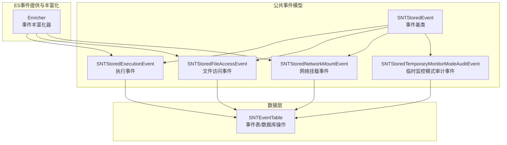
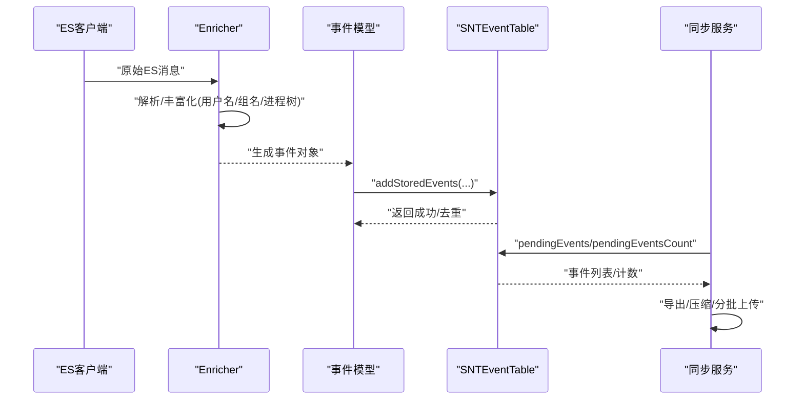
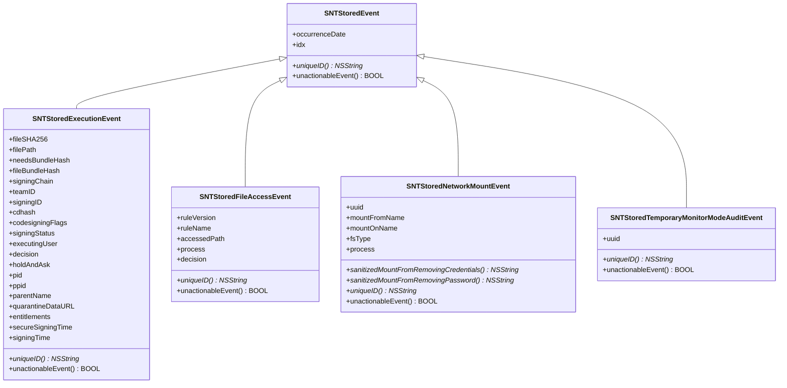
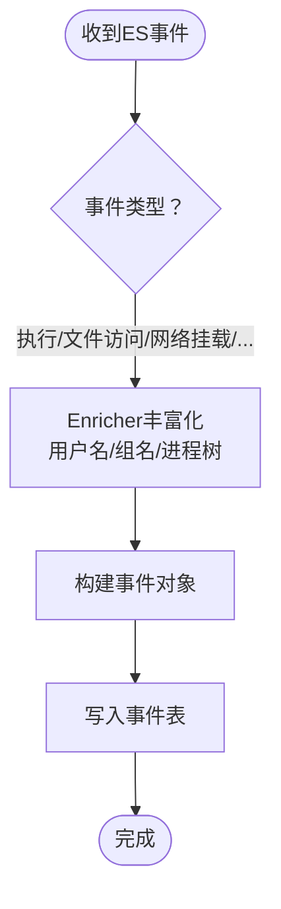
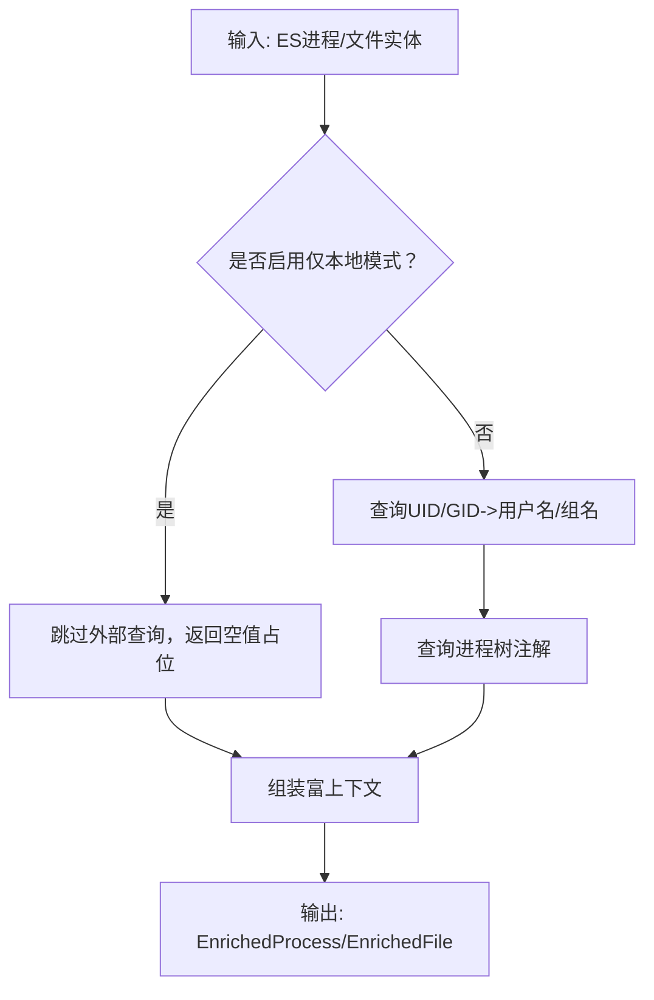
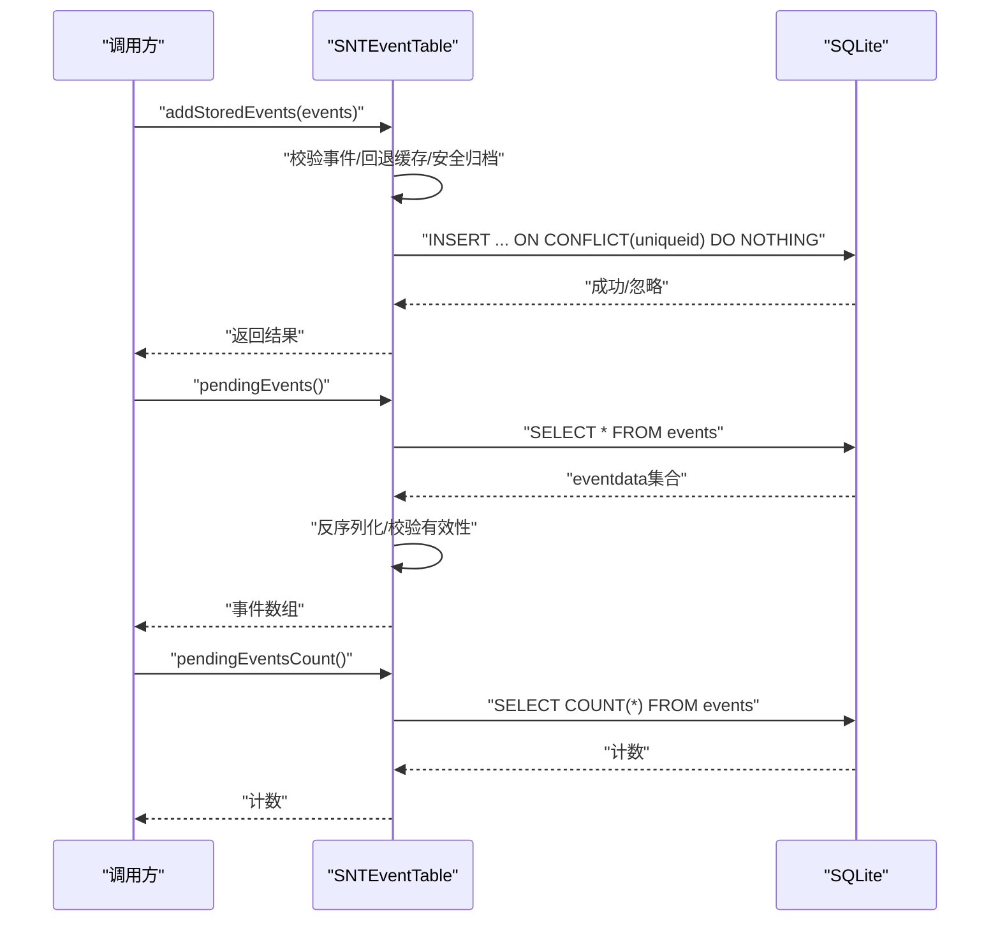
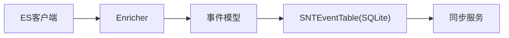

# 事件管理系统

<cite>
**本文引用的文件**
- [SNTStoredEvent.h](file://Source/common/SNTStoredEvent.h)
- [SNTStoredEvent.mm](file://Source/common/SNTStoredEvent.mm)
- [SNTStoredExecutionEvent.h](file://Source/common/SNTStoredExecutionEvent.h)
- [SNTStoredExecutionEvent.mm](file://Source/common/SNTStoredExecutionEvent.mm)
- [SNTStoredFileAccessEvent.h](file://Source/common/SNTStoredFileAccessEvent.h)
- [SNTStoredFileAccessEvent.mm](file://Source/common/SNTStoredFileAccessEvent.mm)
- [SNTStoredNetworkMountEvent.h](file://Source/common/SNTStoredNetworkMountEvent.h)
- [SNTStoredNetworkMountEvent.mm](file://Source/common/SNTStoredNetworkMountEvent.mm)
- [SNTStoredTemporaryMonitorModeAuditEvent.h](file://Source/common/SNTStoredTemporaryMonitorModeAuditEvent.h)
- [SNTStoredTemporaryMonitorModeAuditEvent.mm](file://Source/common/SNTStoredTemporaryMonitorModeAuditEvent.mm)
- [SNTCommonEnums.h](file://Source/common/SNTCommonEnums.h)
- [SNTFileInfo.h](file://Source/common/SNTFileInfo.h)
- [SNTEventTable.h](file://Source/santad/DataLayer/SNTEventTable.h)
- [SNTEventTable.mm](file://Source/santad/DataLayer/SNTEventTable.mm)
- [Enricher.h](file://Source/santad/EventProviders/EndpointSecurity/Enricher.h)
- [Enricher.mm](file://Source/santad/EventProviders/EndpointSecurity/Enricher.mm)
</cite>

## 目录
1. [简介](#简介)
2. [项目结构](#项目结构)
3. [核心组件](#核心组件)
4. [架构总览](#架构总览)
5. [详细组件分析](#详细组件分析)
6. [依赖关系分析](#依赖关系分析)
7. [性能考虑](#性能考虑)
8. [故障排查指南](#故障排查指南)
9. [结论](#结论)
10. [附录](#附录)

## 简介
本技术文档面向Santa的事件管理系统，系统性阐述事件类型分类（执行事件、文件访问事件、网络挂载事件、临时监控模式审计事件）、事件数据结构与存储机制、事件捕获流程、ES客户端实现与事件丰富化过程、事件查询接口与过滤聚合能力、事件导出格式与API接口说明，并提供最佳实践、性能优化与存储空间管理策略。

## 项目结构
事件管理相关代码主要分布在以下模块：
- 公共事件模型：定义事件基类与各类具体事件的数据字段与行为
- 数据层：事件表的数据库建模、增删查改与迁移逻辑
- ES事件提供与丰富化：从EndpointSecurity消息中提取并丰富上下文信息
- 常用枚举与工具：事件状态、决策类型、日志类型等

**图表来源**
- [SNTStoredEvent.h](file://Source/common/SNTStoredEvent.h#L1-L36)
- [SNTStoredExecutionEvent.h](file://Source/common/SNTStoredExecutionEvent.h#L1-L142)
- [SNTStoredFileAccessEvent.h](file://Source/common/SNTStoredFileAccessEvent.h#L1-L74)
- [SNTStoredNetworkMountEvent.h](file://Source/common/SNTStoredNetworkMountEvent.h#L1-L42)
- [SNTStoredTemporaryMonitorModeAuditEvent.h](file://Source/common/SNTStoredTemporaryMonitorModeAuditEvent.h#L1-L92)
- [SNTEventTable.h](file://Source/santad/DataLayer/SNTEventTable.h#L1-L72)
- [Enricher.h](file://Source/santad/EventProviders/EndpointSecurity/Enricher.h#L1-L74)

**章节来源**
- [SNTStoredEvent.h](file://Source/common/SNTStoredEvent.h#L1-L36)
- [SNTStoredEvent.mm](file://Source/common/SNTStoredEvent.mm#L1-L74)
- [SNTEventTable.h](file://Source/santad/DataLayer/SNTEventTable.h#L1-L72)
- [SNTEventTable.mm](file://Source/santad/DataLayer/SNTEventTable.mm#L1-L244)
- [Enricher.h](file://Source/santad/EventProviders/EndpointSecurity/Enricher.h#L1-L74)
- [Enricher.mm](file://Source/santad/EventProviders/EndpointSecurity/Enricher.mm#L1-L282)

## 核心组件
- 事件基类与序列化
  - SNTStoredEvent：所有事件的基类，统一索引、发生时间与安全编码支持；子类需实现唯一ID与可行动性判定
  - 编码/解码通过安全归档完成，确保跨进程/持久化安全
- 执行事件（SNTStoredExecutionEvent）
  - 关键字段：文件哈希、路径、签名链、团队ID、签名ID、cdhash、codesign标志、签名状态、执行用户、决策、进程与父进程信息、隔离区数据、权限与可信签名时间等
  - 唯一ID使用文件SHA-256，便于去重与上传
- 文件访问事件（SNTStoredFileAccessEvent）
  - 关键字段：被访问路径、规则版本/名称、进程信息（含签名链、团队ID、签名ID、cdhash、PID、执行用户、父进程）
  - 唯一ID组合规则名/版本/进程SHA-256，避免噪声规则导致大量事件
- 网络挂载事件（SNTStoredNetworkMountEvent）
  - 关键字段：挂载来源、挂载目标、文件系统类型、进程链、UUID；提供凭据清洗方法
  - 唯一ID基于挂载来源URL，用于去重
- 临时监控模式审计事件（SNTStoredTemporaryMonitorModeAuditEvent）
  - 包含进入/离开两类审计事件，携带会话UUID、时长、原因枚举；唯一ID使用随机UUID，保证每条记录均上报
- 数据层（SNTEventTable）
  - 负责事件入库、查询、删除与版本迁移；采用SQLite存储，BLOB保存事件对象；uniqueid列用于去重
- ES事件丰富化（Enricher）
  - 将EndpointSecurity原始事件转换为富上下文消息，补充用户名、组名、进程树注解等；支持“仅本地”丰富选项以降低外部调用开销

**章节来源**
- [SNTStoredEvent.h](file://Source/common/SNTStoredEvent.h#L1-L36)
- [SNTStoredEvent.mm](file://Source/common/SNTStoredEvent.mm#L1-L74)
- [SNTStoredExecutionEvent.h](file://Source/common/SNTStoredExecutionEvent.h#L1-L142)
- [SNTStoredExecutionEvent.mm](file://Source/common/SNTStoredExecutionEvent.mm#L1-L181)
- [SNTStoredFileAccessEvent.h](file://Source/common/SNTStoredFileAccessEvent.h#L1-L74)
- [SNTStoredFileAccessEvent.mm](file://Source/common/SNTStoredFileAccessEvent.mm#L1-L111)
- [SNTStoredNetworkMountEvent.h](file://Source/common/SNTStoredNetworkMountEvent.h#L1-L42)
- [SNTStoredNetworkMountEvent.mm](file://Source/common/SNTStoredNetworkMountEvent.mm#L1-L108)
- [SNTStoredTemporaryMonitorModeAuditEvent.h](file://Source/common/SNTStoredTemporaryMonitorModeAuditEvent.h#L1-L92)
- [SNTStoredTemporaryMonitorModeAuditEvent.mm](file://Source/common/SNTStoredTemporaryMonitorModeAuditEvent.mm#L1-L144)
- [SNTEventTable.h](file://Source/santad/DataLayer/SNTEventTable.h#L1-L72)
- [SNTEventTable.mm](file://Source/santad/DataLayer/SNTEventTable.mm#L1-L244)
- [Enricher.h](file://Source/santad/EventProviders/EndpointSecurity/Enricher.h#L1-L74)
- [Enricher.mm](file://Source/santad/EventProviders/EndpointSecurity/Enricher.mm#L1-L282)

## 架构总览
事件从ES客户端捕获，经由丰富化器增强后，转换为统一的事件对象，写入事件表数据库。随后可通过查询接口读取待上传事件，进行导出与同步。

**图表来源**
- [Enricher.mm](file://Source/santad/EventProviders/EndpointSecurity/Enricher.mm#L1-L282)
- [SNTStoredExecutionEvent.mm](file://Source/common/SNTStoredExecutionEvent.mm#L1-L181)
- [SNTStoredFileAccessEvent.mm](file://Source/common/SNTStoredFileAccessEvent.mm#L1-L111)
- [SNTStoredNetworkMountEvent.mm](file://Source/common/SNTStoredNetworkMountEvent.mm#L1-L108)
- [SNTEventTable.mm](file://Source/santad/DataLayer/SNTEventTable.mm#L1-L244)

## 详细组件分析

### 事件类型与数据结构
- 执行事件（SNTStoredExecutionEvent）
  - 关键属性：文件哈希/路径、签名链/团队ID/签名ID/cdhash、codesign标志、签名状态、执行用户、决策、进程/父进程、隔离区数据、权限与可信签名时间
  - 唯一ID：文件SHA-256；不可行动性：当决策允许时视为不可行动
- 文件访问事件（SNTStoredFileAccessEvent）
  - 关键属性：被访问路径、规则版本/名称、进程信息（含签名链/团队ID/签名ID/cdhash/PID/执行用户/父进程）
  - 唯一ID：规则名|规则版本|进程SHA-256；不可行动性：仅审计允许时不计入行动缓存
- 网络挂载事件（SNTStoredNetworkMountEvent）
  - 关键属性：挂载来源/目标、文件系统类型、进程链、UUID；提供凭据清洗方法（移除用户名/密码）
  - 唯一ID：挂载来源URL；不可行动性：允许进入回退缓存
- 临时监控模式审计事件（SNTStoredTemporaryMonitorModeAuditEvent）
  - 进入/离开两类事件，携带会话UUID、时长/原因；唯一ID使用随机UUID，确保每条记录上报

**图表来源**
- [SNTStoredEvent.h](file://Source/common/SNTStoredEvent.h#L1-L36)
- [SNTStoredExecutionEvent.h](file://Source/common/SNTStoredExecutionEvent.h#L1-L142)
- [SNTStoredFileAccessEvent.h](file://Source/common/SNTStoredFileAccessEvent.h#L1-L74)
- [SNTStoredNetworkMountEvent.h](file://Source/common/SNTStoredNetworkMountEvent.h#L1-L42)
- [SNTStoredTemporaryMonitorModeAuditEvent.h](file://Source/common/SNTStoredTemporaryMonitorModeAuditEvent.h#L1-L92)

**章节来源**
- [SNTStoredExecutionEvent.h](file://Source/common/SNTStoredExecutionEvent.h#L1-L142)
- [SNTStoredExecutionEvent.mm](file://Source/common/SNTStoredExecutionEvent.mm#L1-L181)
- [SNTStoredFileAccessEvent.h](file://Source/common/SNTStoredFileAccessEvent.h#L1-L74)
- [SNTStoredFileAccessEvent.mm](file://Source/common/SNTStoredFileAccessEvent.mm#L1-L111)
- [SNTStoredNetworkMountEvent.h](file://Source/common/SNTStoredNetworkMountEvent.h#L1-L42)
- [SNTStoredNetworkMountEvent.mm](file://Source/common/SNTStoredNetworkMountEvent.mm#L1-L108)
- [SNTStoredTemporaryMonitorModeAuditEvent.h](file://Source/common/SNTStoredTemporaryMonitorModeAuditEvent.h#L1-L92)
- [SNTStoredTemporaryMonitorModeAuditEvent.mm](file://Source/common/SNTStoredTemporaryMonitorModeAuditEvent.mm#L1-L144)

### 事件捕获流程与ES客户端实现
- ES客户端接收来自内核的事件流，按事件类型分发到对应处理分支
- Enricher对进程、文件等实体进行上下文丰富：解析UID/GID为用户名/组名、查询进程树注解、在“仅本地”模式下避免外部调用
- 生成统一事件对象后，交由数据层入库

**图表来源**
- [Enricher.mm](file://Source/santad/EventProviders/EndpointSecurity/Enricher.mm#L1-L282)
- [SNTEventTable.mm](file://Source/santad/DataLayer/SNTEventTable.mm#L1-L244)

**章节来源**
- [Enricher.h](file://Source/santad/EventProviders/EndpointSecurity/Enricher.h#L1-L74)
- [Enricher.mm](file://Source/santad/EventProviders/EndpointSecurity/Enricher.mm#L1-L282)
- [SNTEventTable.mm](file://Source/santad/DataLayer/SNTEventTable.mm#L1-L244)

### 事件丰富化过程
- 用户名/组名缓存：UID/GID到名称的映射使用缓存，减少重复查询
- 进程树注解：根据进程PID从进程树导出注解，增强事件上下文
- “仅本地”模式：在高负载场景下避免触发外部进程工作，降低开销

**图表来源**
- [Enricher.mm](file://Source/santad/EventProviders/EndpointSecurity/Enricher.mm#L1-L282)

**章节来源**
- [Enricher.mm](file://Source/santad/EventProviders/EndpointSecurity/Enricher.mm#L1-L282)

### 事件存储机制与查询接口
- 存储结构
  - 表：events（列：idx、uniqueid、eventdata）
  - 索引：uniqueid（唯一）用于去重
  - 版本迁移：支持多版本升级，清理历史数据并重建索引
- 写入策略
  - 安全归档事件对象为BLOB后写入
  - 使用uniqueid去重（INSERT ... ON CONFLICT(uniqueid) DO NOTHING）
  - 对不可行动事件使用回退缓存（按唯一ID与时间窗口），避免重复入库
- 查询接口
  - pendingEvents：读取全部事件并反序列化
  - pendingEventsCount：统计事件总数
  - 删除：按idx单个或批量删除

**图表来源**
- [SNTEventTable.h](file://Source/santad/DataLayer/SNTEventTable.h#L1-L72)
- [SNTEventTable.mm](file://Source/santad/DataLayer/SNTEventTable.mm#L1-L244)

**章节来源**
- [SNTEventTable.h](file://Source/santad/DataLayer/SNTEventTable.h#L1-L72)
- [SNTEventTable.mm](file://Source/santad/DataLayer/SNTEventTable.mm#L1-L244)

### 事件导出格式与API接口说明
- 导出格式
  - 事件对象通过安全归档（NSSecureCoding）序列化为二进制BLOB存储于数据库
  - 同步阶段可进一步进行压缩与分块传输（如zstd/gzip等，具体取决于配置）
- 接口能力
  - 查询待上传事件：pendingEvents、pendingEventsCount
  - 删除已上传事件：deleteEventWithId、deleteEventsWithIds
- 过滤与聚合
  - 当前数据层未内置SQL级过滤/聚合；可在上层应用中对事件对象进行内存过滤与聚合

**章节来源**
- [SNTEventTable.h](file://Source/santad/DataLayer/SNTEventTable.h#L1-L72)
- [SNTEventTable.mm](file://Source/santad/DataLayer/SNTEventTable.mm#L1-L244)
- [SNTCommonEnums.h](file://Source/common/SNTCommonEnums.h#L1-L233)

## 依赖关系分析
- 组件耦合
  - 事件模型之间通过SNTStoredEvent继承，保持统一接口与序列化契约
  - 数据层对事件模型的依赖为弱耦合（仅通过NSSecureCoding与唯一ID）
  - ES丰富化器与进程树模块松耦合，通过可选指针注入
- 外部依赖
  - SQLite（FMDB）用于事件持久化
  - EndpointSecurity框架用于事件源
  - 进程树模块用于事件上下文增强

**图表来源**
- [SNTEventTable.mm](file://Source/santad/DataLayer/SNTEventTable.mm#L1-L244)
- [Enricher.mm](file://Source/santad/EventProviders/EndpointSecurity/Enricher.mm#L1-L282)

**章节来源**
- [SNTEventTable.mm](file://Source/santad/DataLayer/SNTEventTable.mm#L1-L244)
- [Enricher.mm](file://Source/santad/EventProviders/EndpointSecurity/Enricher.mm#L1-L282)

## 性能考虑
- 回退缓存（unactionableEventCacheTimeSeconds）
  - 对不可行动事件按唯一ID与时间窗口进行缓存，避免高频重复事件入库
- 唯一索引与去重
  - uniqueid唯一索引与INSERT冲突忽略，降低重复事件写入成本
- 归档与序列化
  - 使用安全归档，避免不必要字段与大对象，控制BLOB体积
- 丰富化策略
  - 提供“仅本地”模式，减少外部查询与潜在阻塞
- 查询与删除
  - 使用COUNT(*)快速统计；按idx删除避免全表扫描

**章节来源**
- [SNTEventTable.mm](file://Source/santad/DataLayer/SNTEventTable.mm#L1-L244)
- [Enricher.mm](file://Source/santad/EventProviders/EndpointSecurity/Enricher.mm#L1-L282)

## 故障排查指南
- 事件无法入库
  - 检查事件有效性（如执行事件必须具备idx、uniqueID、filePath、occurrenceDate、decision等）
  - 查看数据库事务执行结果与冲突处理
- 反序列化失败
  - 确认allowedClasses包含事件类型；检查NSSecureCoding兼容性与版本迁移
- 事件过多导致存储压力
  - 利用唯一ID去重与回退缓存；定期清理已上传事件
- 丰富化缺失
  - 检查“仅本地”模式设置；确认UID/GID到用户名映射缓存是否命中

**章节来源**
- [SNTEventTable.mm](file://Source/santad/DataLayer/SNTEventTable.mm#L1-L244)

## 结论
Santa的事件管理系统以统一的事件模型为核心，结合ES事件丰富化与SQLite事件表，实现了高效、可扩展的事件捕获、存储与查询能力。通过唯一ID去重、回退缓存与安全归档，系统在保证数据完整性的同时兼顾性能与可维护性。建议在生产环境中配合合理的清理策略与导出压缩配置，持续优化存储与传输效率。

## 附录
- 事件状态与决策类型参考
  - 事件状态位掩码覆盖拒绝与允许类别，便于快速判断与统计
- 日志类型
  - 支持syslog、文件日志、Protobuf、JSON等多种输出格式，便于与下游系统对接

**章节来源**
- [SNTCommonEnums.h](file://Source/common/SNTCommonEnums.h#L1-L233)